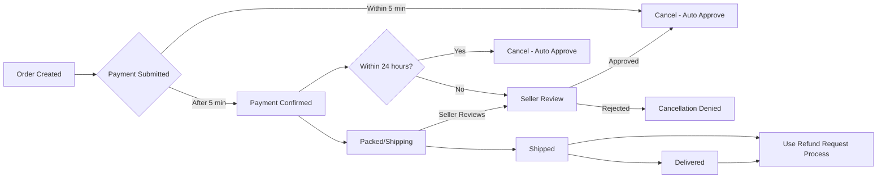
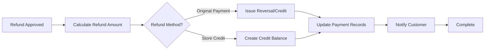
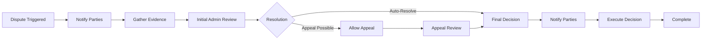

# Order Management, Cancellation, and Refund Processing

## 1. Overview and Business Context

### 1.1 System Purpose

The Order Management, Cancellation, and Refund Processing system enables customers to request order cancellations and refunds within defined business windows, manage product returns, and resolve disputes. This system ensures fair treatment of both customers and sellers while maintaining platform integrity and preventing abuse.

### 1.2 Business Objectives

- **Customer Satisfaction**: Allow customers to cancel orders within reasonable time windows with transparent refund policies
- **Seller Protection**: Prevent unfair cancellations after sellers have invested in fulfillment efforts
- **Payment Security**: Ensure refunds are processed securely back to original payment methods
- **Dispute Resolution**: Provide mechanisms for handling disagreements between customers and sellers
- **Operational Efficiency**: Enable automated refund processing while supporting manual intervention for complex cases
- **Audit and Compliance**: Maintain complete audit trails of all cancellations and refunds

### 1.3 Key System Principles

- Cancellations are customer-initiated requests that may be accepted or rejected based on order status
- Refunds are monetary reimbursements processed through the payment system
- Returns involve physical product shipment back to sellers or fulfillment centers
- Disputes occur when cancellations/refunds are contested by either party
- All actions are reversible and fully auditable for compliance

---

## 2. Order Cancellation Policy and Rules

### 2.1 Cancellation Policy Overview

THE shoppingMall system SHALL provide customers with the ability to request order cancellations within defined business windows based on order status and fulfillment stage.

WHEN a customer initiates a cancellation request, THE system SHALL validate the request against cancellation eligibility rules before accepting or rejecting the request.

### 2.2 Cancellation Windows and Time Frames

THE system SHALL enforce the following cancellation windows based on order status:

| Order Status | Cancellation Window | Auto-Refund | Manual Approval Required |
|---|---|---|---|
| **Order Confirmed (Payment Pending)** | Until payment is successfully processed | N/A | No |
| **Payment Processing** | Up to 5 minutes after payment is submitted | No | No - Cancel immediately |
| **Payment Failed** | Indefinitely (automatic cancellation) | N/A | No - Auto-cancel with notification |
| **Paid/Ready for Pickup** | Up to 24 hours after payment confirmation | Yes | No - Auto-approve if within 24 hours |
| **Packed/Preparing Shipment** | Up to 12 hours after entering this status | No | Yes - Seller must approve |
| **Shipped** | Not cancellable (refund request process applies) | No | N/A - Customer must request refund |
| **Delivered** | Not cancellable (refund request process applies) | No | N/A - Customer must request refund |
| **Returned (In Transit)** | Not cancellable (refund process active) | No | N/A |

### 2.3 Order Statuses and Cancellation Eligibility

THE system SHALL recognize the following order statuses and their cancellation eligibility:

**Status: Order Confirmed**
- WHEN an order is created and awaiting payment, THE system SHALL allow customer cancellation without seller approval
- WHEN the customer cancels at this stage, THE system SHALL immediately change order status to "Cancelled" and refund any payment holds
- THE system SHALL restore inventory for all cancelled items to the seller's stock
- THE system SHALL send cancellation confirmation email to customer within 1 minute

**Status: Payment Processing**
- WHEN payment is being processed, THE system SHALL allow cancellation up to 5 minutes after payment initiation
- IF payment processing is still in progress and cancellation is requested, THE system SHALL cancel the payment authorization and mark the order as "Cancelled"
- THE system SHALL verify with payment gateway that payment authorization was successfully cancelled
- IF payment authorization is already committed, THE system SHALL process refund instead of cancellation

**Status: Paid/Ready for Pickup**
- WHEN an order is paid and not yet packed, THE system SHALL automatically approve cancellations within 24 hours of payment confirmation
- WHEN automatic cancellation occurs, THE system SHALL immediately process a refund to the original payment method
- THE system SHALL restore inventory for cancelled items
- IF 24 hours have passed since payment, THE system SHALL require seller approval for cancellation
- THE system SHALL calculate 24-hour window from exact payment confirmation timestamp (not order creation time)

**Status: Packed/Preparing Shipment**
- WHEN an order enters this status, THE system SHALL require seller approval for any cancellations
- WHEN a customer requests cancellation, THE system SHALL notify the seller with approval deadline of 4 hours
- IF the seller does not respond within 4 hours, THE system SHALL auto-approve the cancellation
- IF the seller approves cancellation, THE system SHALL mark the order as "Cancelled" and initiate refund processing
- THE system SHALL restore inventory for all items in the cancelled order

**Status: Shipped or Later**
- WHEN an order has shipped, THE system SHALL NOT allow cancellation through the cancellation system
- WHEN customers request changes to shipped orders, THE system SHALL direct them to the refund request process
- THE customer SHALL be able to request a refund after receiving the product if they wish to return it

### 2.4 Cancellation Restrictions and Conditions

THE system SHALL enforce the following restrictions:

**Non-Cancellable Scenarios:**
- IF an order has already entered "Shipped" status, THEN THE system SHALL NOT allow cancellation through the cancellation API
- IF an order status is "Delivered", THEN THE system SHALL NOT allow cancellation (redirect to refund request process)
- IF an order is already "Cancelled" or "Refunded", THEN THE system SHALL reject further cancellation attempts
- IF an order is in "Dispute" status, THEN THE system SHALL NOT allow customer-initiated cancellation (admin only)
- IF a refund has already been initiated, THEN THE system SHALL prevent duplicate refund requests

**Partial Cancellations:**
- THE shoppingMall system SHALL support partial cancellations for orders containing multiple items
- WHEN a customer requests partial cancellation, THE system SHALL allow cancelling specific line items while keeping others active
- WHEN partial cancellation is processed, THE system SHALL calculate prorated refund amounts for each cancelled item
- IF partial cancellation leaves insufficient order value (less than $1), THE system MAY require the customer to cancel the entire order instead
- THE system SHALL restore inventory only for partially cancelled items, leaving other items in the order

**Conditional Cancellations:**
- IF an order contains items with special financing or installment plans, THE system SHALL require admin approval for cancellation
- IF an order includes time-sensitive or fresh products (if applicable to the platform), THE system MAY restrict cancellations after a shorter window (seller configurable, minimum 1 hour)

### 2.5 Cancellation Scenarios by Order State



---

## 3. Refund Request Process

### 3.1 Refund Request Workflow

THE shoppingMall system SHALL provide a separate refund request process for orders that cannot be cancelled (typically after shipment).

WHEN a customer requests a refund for a shipped or delivered order, THE system SHALL validate eligibility based on order status and time elapsed since purchase.

**Refund Request Eligibility Timeline:**
- THE system SHALL allow refund requests up to 30 days after order delivery confirmation
- THE system SHALL allow refund requests up to 60 days after purchase for orders not yet delivered
- IF 30+ days have passed since delivery, THE system SHALL only allow refund requests through admin dispute process
- THE system SHALL display countdown timer showing days remaining in refund eligibility window

### 3.2 Refund Eligibility Determination

WHEN a refund request is submitted, THE system SHALL check the following eligibility criteria:

- ✓ Order status is "Delivered" or "In Return"
- ✓ Refund request is within the 30-day window from delivery date
- ✓ No previous refund has been fully processed for this order
- ✓ Order is not already in dispute resolution
- ✓ Customer account is in good standing (no fraud indicators)

**Refund Reason Categories:**
THE system SHALL require customers to select a refund reason from the following options with specific handling for each:

| Reason Code | Description | Auto-Approve | Requires Return | Processing Notes |
|---|---|---|---|---|
| **PRODUCT_DEFECTIVE** | Product is broken or defective | No | Yes | May require photo evidence; seller must inspect returned item |
| **PRODUCT_NOT_AS_DESCRIBED** | Item does not match product description | No | Yes | Requires investigation by admin if disputed |
| **PRODUCT_DAMAGED** | Item arrived damaged | No | Yes | Photos required showing damage; seller inspects return |
| **PRODUCT_WRONG_ITEM** | Received wrong product | No | Yes | Seller error; return and replacement offered |
| **PRODUCT_MISSING** | Order partially missing items | No | Partial | Partial refund possible for missing items only |
| **CHANGED_MIND** | Customer changed mind | No | Yes | Standard return; full refund if conditions met |
| **FOUND_CHEAPER** | Found better price elsewhere | No | Yes | Discretionary; seller may deny |
| **PRODUCT_EXPIRED** | Product is expired or expired soon | Yes | No | Auto-refund without return required |
| **SERVICE_UNSATISFACTORY** | Service/experience was poor | No | Manual | Requires admin review and determination |

### 3.3 Refund Request Submission Requirements

WHEN a customer submits a refund request, THE system SHALL require the following information:

**Required Information:**
- Order ID and order date (auto-populated)
- Refund reason (from predefined list)
- Detailed description of the issue (minimum 20 characters, maximum 1000 characters)
- Supporting documentation (photos, evidence)
- Preferred refund method (if applicable)

**Supporting Documentation:**
- IF the reason is "Product Defective" or "Product Damaged", THEN THE system SHALL require at least one photo showing the defect with file size 500KB-5MB
- IF the reason is "Wrong Item Received", THEN THE system SHALL require photos of the received product and packaging
- IF the reason is "Not as Described", THEN THE system SHALL allow optional photo uploads for evidence (up to 3 photos)
- THE system SHALL validate that uploaded images are actual photographs (not screenshots, not drawings) with resolution minimum 640x480 pixels

### 3.4 Refund Processing Timeline

THE shoppingMall system SHALL enforce the following refund processing timeline with strict adherence:

| Phase | Timeline | Activity | Responsible Party |
|---|---|---|---|
| **1. Request Submission** | Immediate | Customer submits refund request | Customer |
| **2. Initial Validation** | Automated | System checks eligibility and basic validation | System |
| **3. Seller Review** | 48 hours | Seller reviews and responds (if return required) | Seller |
| **4. Customer Return** | 7 days | Customer ships product back (if applicable) | Customer |
| **5. Return Receipt** | 5 business days | Seller/fulfillment center receives and inspects return | Seller |
| **6. Refund Approval** | 24 hours after receipt | Admin approves refund based on inspection | Admin/System |
| **7. Refund Processing** | 24-48 hours | Refund issued to original payment method | Payment System |
| **8. Refund Completion** | 5-10 business days | Refund appears in customer's account | Bank/Card Issuer |

### 3.5 Refund Status Tracking

THE system SHALL track refund requests through the following statuses with customer visibility at each stage:

- **Submitted**: Customer has submitted the refund request; awaiting initial review (auto within 1 hour)
- **Approved**: Initial validation passed; customer waiting for next step (requires return action or processing)
- **Awaiting Return**: Customer needs to return the product (awaiting shipment with tracking number)
- **Return In Transit**: Customer has shipped the product; awaiting receipt (tracked by carrier)
- **Return Received**: Seller/fulfillment center has received the product (inspection to begin)
- **Under Review**: Inspection and evaluation in progress (2-5 business days typical)
- **Approved for Refund**: Refund has been approved; waiting for processing (within 24 hours)
- **Refund Processing**: Refund is being issued to payment method (24-48 hours typical)
- **Refund Completed**: Refund has been successfully processed (5-10 business days to appear)
- **Cancelled**: Refund request was cancelled by customer or admin (non-refundable status)
- **Rejected**: Refund request was denied with reason provided (customer can appeal)
- **Disputed**: Refund request is under dispute resolution (escalated process)

---

## 4. Return Workflow and Procedures

### 4.1 Return Process Overview

THE shoppingMall system SHALL manage the return process for orders requiring physical product returns as part of refund requests.

WHEN a refund request is approved and requires a return, THE system SHALL generate a return authorization with unique tracking information.

### 4.2 Return Initiation Requirements

WHEN a return is initiated, THE system SHALL perform the following:

**Return Authorization Generation:**
- THE system SHALL generate a unique Return Authorization Number (RMA) in format RMA-YYYYMMDD-XXXXXX where XXXXXX is unique daily sequence
- THE system SHALL specify the return address (seller's return address or fulfillment center address)
- THE system SHALL include return shipping instructions and requirements
- THE system SHALL display the maximum return window (14 days from authorization date)
- THE system SHALL provide printable return shipping label with barcode

**Return Shipping Details:**
- THE system SHALL inform the customer whether prepaid return shipping is provided (typically yes for defective/damaged items)
- THE system SHALL specify acceptable shipping carriers and methods (typically standard ground shipping)
- THE system SHALL require the customer to include the RMA number on the package exterior and inside the box
- THE system SHALL provide carrier tracking information and expected delivery date to return address
- THE system SHALL allow customers to schedule pickup with carrier if carrier supports this

**Return Conditions:**
- WHEN a return is authorized, THE system SHALL specify condition requirements based on reason:
  - For "Defective" returns: item must show defect
  - For "Damaged" returns: original packaging should be preserved if possible
  - For "Wrong Item" returns: unused item preferred but not required
  - For "Changed Mind" returns: unused, unopened, original packaging intact required
- THE system SHALL inform customers that items not meeting return conditions may be rejected with 25% restocking fee applied
- THE system SHALL display full list of condition requirements and consequences of non-compliance

### 4.3 Return Acceptance and Rejection

WHEN a return package is received, THE seller or fulfillment center SHALL inspect the product and submit acceptance or rejection.

**Return Acceptance:**
- IF the product meets return conditions (unopened, undamaged, original packaging, or defect confirmed), THE system SHALL mark return as "Accepted"
- WHEN a return is accepted, THE system SHALL automatically approve the refund for processing
- THE system SHALL notify customer that return was accepted and refund is being processed
- THE system SHALL provide refund processing timeline (2-3 business days to appear in account)

**Return Rejection:**
- IF the product is damaged by customer use, missing parts, or lacks original packaging beyond acceptable condition, THE system SHALL mark return as "Rejected"
- WHEN a return is rejected, THE system SHALL notify the customer and provide detailed reason for rejection
- THE system SHALL include photos of rejected item if available
- THE customer MAY request dispute resolution if they disagree with the rejection
- THE rejected item SHALL be returned to customer at seller's expense if customer disputes rejection

**Return Inspection for Defects:**
- IF the return reason was "Product Defective", THE seller SHALL inspect the defect and document findings with photos
- THE system SHALL use the inspection findings to determine if the product was defective (manufacturer issue) or damaged by customer (user issue)
- IF the product is confirmed defective, THE system SHALL approve the refund with full amount (100% of purchase price)
- IF the product shows signs of customer misuse or damage, THE system MAY reject or process partial refund (50-75% of purchase price)
- IF defect is borderline or unclear, THE system SHALL escalate to admin for determination

### 4.4 Return Shipping Process

THE system SHALL track the return shipping process with the following workflow:

**Return Shipping Initialization:**
- WHEN return is authorized, THE system SHALL provide shipping label or instructions within 1 hour
- THE customer SHALL initiate return shipping through their carrier within 14 days of authorization
- THE customer SHALL enter the return shipping tracking number into the system (provided by carrier)
- THE system SHALL accept shipping tracking information and begin monitoring shipment status

**Return In Transit Tracking:**
- THE system SHALL periodically check return shipping status every 4 hours
- THE system SHALL update return status to "Return In Transit" when carrier confirms pickup within 24 hours
- THE seller SHALL be notified that a return is in transit with tracking information and expected arrival date
- THE system SHALL provide customer with tracking link to monitor return package location

**Return Receipt:**
- WHEN the return package is delivered to the return address, THE system SHALL update status to "Return Received" within 24 hours (automated from carrier or manual confirmation)
- THE seller/fulfillment center SHALL receive notification of arrival with package tracking number
- THE seller SHALL inspect the package within 5 business days and submit inspection findings

### 4.5 Return Receipt and Inspection

WHEN a return package is received, THE seller SHALL perform inspection and submit findings.

**Inspection Process:**
- THE seller SHALL open and inspect the returned product within 2 business days
- THE seller SHALL verify the product condition against return authorization requirements
- THE seller SHALL check for damage that occurred during return shipment vs. original defect
- THE seller SHALL document findings with detailed notes and photos (minimum 2 photos, maximum 5)
- THE seller SHALL submit inspection results to the system within 5 business days

**Inspection Results:**
- THE system SHALL accept inspection results: "Accepted", "Rejected", or "Partial Refund"
- THE seller SHALL provide detailed reason for rejection or partial refund selection
- THE system SHALL attach inspection photos/documentation to the return record
- IF seller does not submit inspection within 5 business days, THE system SHALL auto-accept the return and approve refund

### 4.6 Return Completion and Refund Issuance

**Refund Processing After Inspection:**
- WHEN return inspection is marked "Accepted", THE system SHALL automatically move to refund processing phase within 4 hours
- THE admin dashboard SHALL flag the return for refund authorization
- THE system SHALL calculate the refund amount:
  - Full refund (100%) for accepted defective items
  - Full refund (100%) for wrong items
  - Full refund (100%) for items damaged in shipping
  - 75% refund for items showing light use/minor wear
  - 50% refund for items showing significant use/damage by customer
- THE system SHALL process the refund to the original payment method within 24 hours of approval

**Return Completion:**
- THE system SHALL mark return status as "Completed" after refund has been successfully processed
- THE system SHALL notify the customer that the return has been completed and refund has been issued
- THE system SHALL provide customer with:
  - Final refund amount
  - Refund transaction ID
  - Expected appearance in account (5-10 business days)
  - Resolution summary

---

## 5. Refund Processing and Payment Handling

### 5.1 Refund Processing Workflow

THE shoppingMall system SHALL process refunds through the payment system with the following workflow:



### 5.2 Refund Methods and Destinations

THE system SHALL support the following refund methods with specific processing for each:

**Original Payment Method (Primary - Default):**
- THE system SHALL attempt to refund to the original payment method first
- WHEN a customer paid by credit/debit card, THE system SHALL issue a reversal or credit to that card within 24 hours
- WHEN a customer paid by digital wallet, THE system SHALL return funds to the wallet account within 24 hours
- WHEN a customer paid by bank transfer, THE system SHALL attempt to reverse the transaction if within reversal window (typically 2-5 business days)
- THE system SHALL require 5-10 business days for the refund to appear in customer's account (bank dependent)
- THE system SHALL provide refund reference number for customer to verify with their bank

**Store Credit Option:**
- THE system MAY offer store credit as alternative to original payment method refund
- WHEN store credit is issued, THE system SHALL create a credit balance on the customer's account
- THE store credit SHALL be usable for future purchases immediately upon issuance
- THE system SHALL clearly indicate when store credit option is available vs. refund to original method
- THE store credit SHALL never expire for compliance with consumer protection regulations

**Non-Refundable Balance:**
- IF the original payment method cannot be reversed (e.g., cash payment, ATM withdrawal, third-party payment), THE system SHALL process to store credit instead
- THE customer SHALL be notified of the credit balance with instructions on how to use it for future purchases
- THE system SHALL provide one-time option to redirect credit to another payment method if available

### 5.3 Partial Refunds and Deductions

THE system SHALL calculate partial refunds when applicable with formula transparency:

**Partial Refund Scenarios:**
- THE system SHALL process partial refunds for partial cancellations or partial order returns
- THE system SHALL deduct return shipping costs from refunds IF agreed in return policy:
  - For defective items: no shipping deduction (seller bears cost)
  - For changed mind: $5-15 return shipping deduction (varies by region)
  - For wrong item: no shipping deduction (seller bears cost)
- THE system SHALL deduct restocking fees only if explicitly disclosed to customer at time of purchase:
  - Restocking fee maximum 20% of purchase price (varies by product category)
  - No restocking fee for defective, damaged, or wrong items
- THE system SHALL deduct applicable taxes that were collected for the purchase

**Refund Calculation Formula:**
```
Refund Amount = Order Item Price + Applicable Tax 
  - Return Shipping Cost (if applicable)
  - Restocking Fee (if disclosed)
  + Promotional Discount (restore if partial return)
```

**Example Calculation:**
```
Original Order:
  - Item Price: $100.00
  - Tax (10%): $10.00
  - Shipping: $5.00
  - Promotion Discount: -$20.00
  - Total Paid: $95.00

Partial Return (item defective):
  - Item Refund: $100.00
  - Tax Refund: $10.00
  - Shipping Refund: $0 (no deduction for defective)
  - Restocking Fee: $0 (no fee for defective)
  - Promotion Adjustment: +$20.00 (restore)
  - Total Refund: $130.00
```

**Discount Handling:**
- WHEN a customer received a discount on their purchase and returns items, THE system SHALL handle the discount as follows:
- IF the customer returns part of the order, THE system SHALL proportionally adjust the discount
- IF the discount cannot be split (e.g., "Buy 2 Get 1 Free"), THE system SHALL recalculate the refund with discount conditions
- IF discount becomes invalid after partial return, THE system SHALL recalculate remaining order total and apply discount accordingly

### 5.4 Payment Method Handling

THE system SHALL integrate with the payment processing system for refund execution with proper error handling:

**Credit/Debit Card Refunds:**
- THE system SHALL send refund requests to the payment gateway with original transaction reference (transaction ID)
- THE system SHALL attempt transaction reversal first (within card network reversal window, typically 120 days)
- IF reversal is no longer possible, THE system SHALL request a credit/chargeback to the card
- THE system SHALL provide transaction confirmation and tracking reference to customer
- THE system SHALL retry failed reversals once after 30-second delay

**Digital Wallet Refunds:**
- THE system SHALL issue refund to the original digital wallet account within 2 hours of approval
- THE system SHALL use wallet provider's API to process refund securely
- THE system SHALL provide refund confirmation with wallet transaction ID
- THE system SHALL track wallet refund status and retry if failed

**Bank Transfer Refunds:**
- THE system SHALL capture bank account details from original transaction if available
- THE system SHALL process refund through bank transfer if reversal is not possible
- THE system SHALL validate bank account information before processing (account name match if available)
- THE system SHALL provide refund confirmation with bank transaction reference number

### 5.5 Transaction Reversal and Processing

THE system SHALL manage transaction reversal with payment gateway systematically:

**Reversal Attempts:**
- WHEN a refund is approved, THE system SHALL attempt automatic reversal through payment gateway immediately
- THE system SHALL wait up to 48 hours for reversal confirmation from payment processor
- IF reversal is successful within timeframe, THE system SHALL mark refund as processed and notify customer
- IF reversal fails, THE system SHALL escalate to admin for manual processing or alternative method

**Chargebacks and Disputes:**
- IF a customer initiates a chargeback after receiving refund, THE system SHALL flag as potential fraud
- THE system SHALL maintain records of all refund transactions to defend against chargeback disputes
- THE admin dashboard SHALL provide chargeback dispute documentation for review including:
  - Original order details
  - Payment and refund records
  - Proof of refund issuance
  - Communication history
- THE system SHALL calculate financial impact of chargebacks for seller account adjustments

### 5.6 Refund Timing and Notifications

THE system SHALL manage refund timing and customer communication with specific milestones:

**Refund Processing Timeline:**
- THE system SHALL process refunds to payment gateway within 2 hours of approval
- THE system SHALL provide customer with refund processing confirmation immediately
- THE system SHALL estimate 5-10 business days for refund to appear in customer account
- THE system SHALL provide tracking reference for customer to verify with their bank if needed
- THE system SHALL send confirmation email within 1 minute of processing

**Refund Notifications:**
- WHEN a refund is approved, THE system SHALL send customer email notification with:
  - Refund amount and order reference
  - Reason for approval
  - Expected refund timeline (5-10 business days)
  - Tracking reference number
- WHEN refund is processed, THE system SHALL send second notification confirming:
  - Refund processing complete
  - Amount refunded
  - Expected arrival date
  - Instructions if refund doesn't appear
- WHEN refund appears in customer account (if integrated with payment gateway), THE system SHALL send final notification with:
  - Refund confirmation and amount
  - Transaction reference
  - Completion status
- WHEN refund is denied, THE system SHALL send notification with:
  - Detailed explanation of denial reason
  - Appeal instructions
  - Contact information for support

---

## 6. Cancellation Restrictions and Business Rules

### 6.1 Non-Cancellable Order Scenarios

THE system SHALL NOT allow cancellations in the following scenarios with specific messaging:

**Already Shipped or Delivered:**
- IF order status is "Shipped", "In Transit", "Delivered", or "Completed", THE system SHALL reject cancellation requests
- THE customer SHALL be directed to submit a refund request instead
- THE system SHALL display: "This order has already shipped and cannot be cancelled. Please submit a return request to receive a refund."

**Already Cancelled or Refunded:**
- IF order status is already "Cancelled" or "Refunded", THE system SHALL reject further cancellation attempts with specific error
- THE system SHALL display: "This order is already cancelled. No further cancellations are possible."

**In Dispute:**
- IF order is flagged as "In Dispute" for chargeback or fraud investigation, THE system SHALL prevent customer cancellation
- ONLY admins MAY modify or cancel orders in dispute status
- THE system SHALL display: "This order is under investigation and cannot be cancelled at this time."

**Payment Hold or Processing Issues:**
- IF payment is held due to fraud detection, THE system SHALL allow cancellation but freeze refund processing pending investigation
- WHEN payment is released, THE system SHALL process the refund normally
- THE customer SHALL be notified of the hold and timeline for resolution

**Special Orders:**
- IF order contains customized or made-to-order items, THE seller MAY restrict cancellation if production has begun
- THE system SHALL display clear cancellation restrictions during checkout for special order items
- IF cancellation is attempted after production starts, THE seller MAY contact customer to negotiate partial refund
- THE system SHALL allow seller to set "non-cancellable after [X hours]" for each product

### 6.2 Inventory Handling During Cancellation

WHEN an order is cancelled, THE system SHALL restore inventory to available stock systematically:

**Cancellation Inventory Restoration:**
- WHEN an order is cancelled, THE system SHALL immediately restore inventory quantities for all items in the order atomically
- THE inventory SHALL be restored to the seller's available stock (not reserved, not pending)
- IF inventory was reserved but payment failed, THE system SHALL release the reservation
- THE system SHALL log restoration with cancellation reason and timestamp

**Partial Cancellation Inventory:**
- WHEN a partial cancellation is processed, THE system SHALL restore only the quantities for cancelled items
- WHEN some items are retained in the order, THE system SHALL maintain reservations for continuing items
- THE system SHALL not affect inventory for retained items (they remain reserved)

**Inventory Conflicts:**
- IF inventory has already been allocated to another order (overselling scenario), THE system SHALL still complete the cancellation and refund
- THE system SHALL flag the inventory shortage for admin attention but SHALL NOT block the cancellation
- THE system SHALL immediately process refund to customer regardless of inventory status

**Stock Level Updates:**
- WHEN inventory is restored, THE seller's SKU-level inventory count SHALL be immediately updated
- THE system SHALL reflect new available stock in the product catalog for future orders
- THE system SHALL trigger low-stock alerts if restored inventory falls below seller's threshold

### 6.3 Impact on Seller and Commissions

THE system SHALL handle seller impact and commission calculations for cancellations with complete financial reconciliation:

**Commission Reversal:**
- WHEN an order is cancelled and refund is processed, THE system SHALL reverse any commission already paid to the seller
- IF commission was already transferred to seller's account, THE system SHALL create a debit to the seller's next payment (negative commission)
- THE seller's commission balance MAY go negative temporarily until settled in next payout cycle
- THE system SHALL log commission reversal with cancellation reference and timestamp

**Seller Notification:**
- WHEN customer cancels an order before seller has acted, THE system SHALL notify seller of cancellation with order ID and timestamp
- WHEN order is cancelled after seller has invested effort (packed/shipped), THE system SHALL flag for seller attention
- THE seller MAY file a dispute if they believe cancellation was unfair or fraudulent (handled through dispute resolution)

**Commission on Refunds:**
- IF a refund is processed for a shipped order, THE seller SHALL NOT be charged commission reversal (commission kept as fulfillment fee)
- ONLY cancellations of pre-fulfillment orders trigger commission reversal
- THE system SHALL clearly distinguish commission handling between cancellations (pre-shipment refund) vs. refunds (post-delivery return)

**Example Commission Handling:**
```
Scenario 1: Cancellation within 24 hours of payment
- Order Total: $100.00
- Commission Rate: 10%
- Commission Deducted: $10.00
- Seller Received: $90.00
- Customer Cancels → Refund $100.00 to customer
- Commission Reversal: -$10.00 from seller's next payment
- Net Result: Seller keeps $0, customer gets $100 back

Scenario 2: Refund after delivery
- Order Total: $100.00
- Commission Rate: 10%
- Commission Deducted: $10.00 (already kept by platform)
- Seller Received: $90.00
- Customer Returns Item → Refund $100.00 to customer
- Commission Reversal: $0 (seller keeps $10 for fulfillment effort)
- Net Result: Seller keeps $10, customer gets $100 back
```

### 6.4 Promotional and Discount Handling

THE system SHALL manage promotional adjustments during cancellations carefully:

**Full Order Cancellations:**
- WHEN an entire order is cancelled, THE system SHALL reverse all discounts, promotions, and special pricing
- THE customer SHALL receive full refund of all promotional benefits (gift cards used, discounts applied)
- THE system SHALL restore promotional items that were part of "Buy X Get Y Free" offers

**Partial Cancellations:**
- WHEN partial items are cancelled, THE system SHALL proportionally adjust discounts
- IF promotional offer cannot be split (e.g., "Bundle discount" on 3 items, customer returns 1), THE system SHALL recalculate pricing:
  - If bundle no longer qualifies: original bundle discount is removed
  - If bundle still qualifies: bundle discount remains on remaining items
  - IF promotion becomes invalid after partial cancellation, THE remaining order price SHALL be recalculated
- THE system SHALL refund the difference if customer should pay less after losing promotion eligibility

**Loyalty Point Reversals:**
- IF loyalty points were earned on the order, THE system SHALL reverse those points upon cancellation
- THE points SHALL be returned to the customer's loyalty account immediately
- IF points were already redeemed for discount, THE system MAY credit replacement points or process alternative resolution
- THE system SHALL track loyalty point reversals in customer's point history

### 6.5 Cancellation of Multi-Item Orders

THE system SHALL handle cancellations for orders with multiple items with complexity management:

**Full Cancellation:**
- WHEN customer cancels entire multi-item order, THE system SHALL cancel all items and process single refund for total amount
- THE inventory SHALL be restored for all items atomically (all succeed or all fail)
- THE seller commissions SHALL be reversed for all items in the order

**Partial Cancellation:**
- WHEN customer cancels specific items from multi-item order, THE system SHALL:
  - Cancel only selected line items
  - Retain order status for remaining items
  - Process refund only for cancelled items (calculated as per 5.3 formula)
  - Restore inventory for cancelled items only
  - Maintain separate order records or line-item status tracking
  - Reverse commission only for cancelled items

**Item-Level Approval:**
- WHEN partial cancellation is requested after packing, THE system SHALL allow seller to approve/reject each item individually
- WHEN seller approves cancellation for some items but rejects others, THE system SHALL:
  - Cancel approved items and process refund for those items only
  - Keep rejected items in the order for fulfillment
  - Notify customer of partial approval with itemized breakdown
  - Restore inventory for approved items only
  - Reverse commission only for approved items

**Example Multi-Item Cancellation:**
```
Original Order (3 items from 2 sellers):
- Item A (Seller 1): $30 × 2 = $60
- Item B (Seller 2): $40 × 1 = $40
- Total: $100, Tax: $10, Total Paid: $110

Customer requests partial cancellation of Item A (qty 1) and Item B (qty 1):
- Refund Calculation:
  - Item A (1 unit): $30 + $3 tax = $33
  - Item B (1 unit): $40 + $4 tax = $44
  - Total Refund: $77
- Inventory Restored:
  - Seller 1: +1 unit of Item A
  - Seller 2: +1 unit of Item B
- Commission Reversed:
  - Seller 1: $3 (10% of $30)
  - Seller 2: $4 (10% of $40)
- Remaining Order:
  - Item A: $30 × 1 = $30
  - Total: $33 (with tax)
```

---

## 7. Customer Communication and Notifications

### 7.1 Cancellation Request Acknowledgment

THE system SHALL send immediate acknowledgment when cancellation is requested with clear status:

**Cancellation Submission Confirmation:**
- WHEN a cancellation request is submitted, THE system SHALL immediately send email confirmation with:
  - Cancellation request ID (unique identifier)
  - Order number and order date
  - Items being cancelled (with quantities)
  - Cancellation status (e.g., "Pending Approval" or "Auto-Approved")
  - Expected refund amount (calculated amount)
  - Expected refund timeline (specific business days)
  - Next steps for customer
- THE confirmation SHALL be sent within 30 seconds of submission

**In-App Notification:**
- THE system SHALL display real-time notification in customer account showing cancellation request status
- THE notification SHALL indicate next steps or actions required from customer
- THE system SHALL update notification status as cancellation progresses through workflow

### 7.2 Status Update Notifications

THE system SHALL notify customers of status changes throughout cancellation process at each milestone:

**Auto-Approved Cancellations:**
- WHEN cancellation is automatically approved (within cancellation window), THE system SHALL send notification with:
  - Cancellation confirmation with order ID
  - Refund amount and calculation breakdown
  - Refund method (original payment method or store credit)
  - Expected refund processing timeline (2-3 business days to process, 5-10 business days to appear)
  - Transaction reference for tracking with bank if needed
  - What to do if refund doesn't appear

**Awaiting Seller Approval:**
- WHEN cancellation requires seller approval, THE system SHALL send notification with:
  - Current status: "Awaiting Seller Review"
  - Timeline for seller response (typically 4 hours, auto-approve if no response)
  - What seller reviews in the request
  - Option to contact seller if messaging available
  - Timeline for approval or auto-approval

**Seller Approved Cancellation:**
- WHEN seller approves cancellation, THE system SHALL send notification with:
  - Cancellation approved confirmation
  - Refund amount (itemized breakdown)
  - Expected refund processing timeline (24 hours to process, 5-10 days to appear)
  - Instructions if return shipping required
  - Refund tracking reference number
  - Estimated date refund will appear

**Cancellation Denied:**
- WHEN cancellation is rejected by seller or system, THE system SHALL send notification with:
  - Clear reason for denial with explanation
  - Option to dispute or escalate (with contact info)
  - Contact information for customer support team
  - Link to refund request process if cancellation window passed
  - Option to request seller reconsideration with new information

### 7.3 Refund Processing Notifications

THE system SHALL send notifications for each stage of refund processing with clear timeline:

**Refund Initiated:**
- WHEN refund processing begins, THE system SHALL send notification with:
  - Refund amount and order reference
  - Refund method (original payment method or store credit)
  - Expected timeline for refund to appear (specific business days)
  - Refund reference number for tracking
  - What refund means (funds returned to original payment method)

**Refund Processed:**
- WHEN refund is successfully transmitted to payment processor, THE system SHALL send notification with:
  - Confirmation that refund has been processed
  - Refund reference number for tracking
  - Estimated delivery to customer's account (specific timeline like "5-10 business days for card refunds")
  - Instruction to contact their bank if refund doesn't appear in estimated timeframe
  - Note that funds will show as credit on their statement

**Refund Completed:**
- WHEN refund appears in customer's account (if integrated), THE system SHALL send notification with:
  - Refund completion confirmation with amount
  - Final transaction details
  - Thank you message and customer satisfaction inquiry
  - Link to leave feedback about refund process
  - Invitation for follow-up survey

### 7.4 Return Status Communications

THE system SHALL send notifications throughout return process at each status change:

**Return Authorized:**
- WHEN return is authorized, THE system SHALL send email with:
  - Unique Return Authorization (RMA) number (prominently displayed)
  - Complete return address with postal code, country
  - Return shipping instructions (how to ship, carrier options)
  - Return shipping label (PDF download link)
  - Deadline for return shipment (14 days from authorization)
  - List of items being returned with condition requirements
  - Consequences of not meeting return conditions
  - Contact info if return address is unclear

**Return Shipping Initiated:**
- WHEN customer updates system with return tracking number, THE system SHALL send notification with:
  - Confirmation of return shipment receipt
  - Tracking number for their records
  - Expected delivery timeline to return address
  - Notification that seller will inspect upon receipt
  - Timeline for inspection (5 business days typical)
  - What happens after inspection

**Return In Transit:**
- WHEN return package is picked up by carrier, THE system SHALL send notification with:
  - Confirmation of pickup
  - Updated tracking information with carrier
  - Estimated delivery date to return address
  - Reminder to include RMA number
  - Contact info for tracking issues

**Return Received:**
- WHEN return package arrives at destination, THE system SHALL send notification with:
  - Confirmation of receipt at return address
  - Package reference number
  - Information that inspection will begin
  - Timeline for inspection completion (5 business days typical)
  - What inspection includes
  - Timeline for refund after approval

**Return Inspection Complete:**
- WHEN inspection is completed, THE system SHALL send notification with:
  - Inspection result (accepted/rejected/partial refund) with outcome
  - Refund amount (if approved)
  - Timeline for refund processing (24 hours typical)
  - If rejected: detailed reason, appeal instructions, timeline
  - Next steps for customer
  - Refund tracking reference

### 7.5 Dispute Escalation Notifications

THE system SHALL notify customers when disputes are escalated with clear process:

**Dispute Initiated:**
- WHEN a dispute is filed by seller or customer, THE system SHALL send notification with:
  - Dispute ID and unique reference
  - Reason for dispute
  - Current investigation status
  - Timeline for resolution (typically 7-14 days)
  - Contact information for support team
  - What to expect in investigation process

**Dispute Update:**
- AS dispute progresses, THE system SHALL send updates with:
  - Investigation findings to date
  - Information requested from customer (if needed)
  - Current status and next steps
  - Timeline for next update
  - Contact info for questions

**Dispute Resolution:**
- WHEN dispute is resolved, THE system SHALL send notification with:
  - Final decision and reason
  - Resolution action taken (refund approved/denied/partial)
  - Timeline for any refunds or actions
  - Appeal options if available
  - Final contact for concerns

---

## 8. Dispute Resolution and Escalation

### 8.1 Dispute Categories and Triggers

THE system SHALL recognize and track disputes in the following categories with clear escalation paths:

**Category: Cancellation Disputed**
- WHEN a seller challenges a customer cancellation, THE system SHALL flag the order as disputed
- Trigger: Seller claims customer is abusing cancellation policy or providing false reason
- THE system SHALL notify admin for manual review within 1 hour
- Timeline: Dispute must be resolved within 7 days or refund is auto-approved

**Category: Refund Disputed**
- WHEN a seller challenges a refund request, THE system SHALL escalate to admin review
- Trigger: Seller believes product was not defective or customer damaged it
- THE system SHALL hold refund processing pending investigation (max 24 hours investigation)
- Timeline: Resolution required within 7 days of dispute filing

**Category: Return Condition Disputed**
- WHEN seller rejects a return claiming product condition doesn't meet requirements, THE system SHALL create dispute
- Trigger: Customer claims product was actually defective or incorrectly rejected
- THE system SHALL require evidence from both parties
- Timeline: Resolution within 5 days or return is auto-accepted with refund

**Category: Chargeback Dispute**
- WHEN customer initiates chargeback with payment processor, THE system SHALL flag automatically as dispute
- Trigger: Chargeback notification from payment processor
- THE system SHALL escalate to admin with all transaction documentation
- Timeline: Defense response required within 10 days of chargeback notification

**Category: Fraudulent Activity**
- WHEN system detects unusual cancellation/refund pattern, THE system SHALL create fraud dispute
- Trigger: Customer cancels multiple orders (5+), multiple chargebacks, pattern of abuse
- THE system SHALL freeze further cancellations pending investigation
- Timeline: Investigation within 14 days; account frozen during investigation

### 8.2 Dispute Resolution Process

THE system SHALL manage disputes through the following workflow with clear decision points:



**Dispute Investigation Process:**
1. WHEN a dispute is created, THE system SHALL notify both parties within 1 hour
2. THE system SHALL provide evidence dashboard showing:
   - Original order details (all items, prices, dates)
   - Complete communication history
   - Return photos/inspection reports (if applicable)
   - Transaction records and payment status
   - Timeline of all actions
3. EACH party SHALL be given 48 hours to submit additional evidence or response
4. THE admin SHALL review all evidence and make determination within 72 hours
5. THE system SHALL notify both parties of resolution within 24 hours

### 8.3 Admin Intervention Procedures

THE system SHALL provide admin tools for dispute management with structured workflow:

**Dispute Dashboard Access:**
- WHEN admin accesses dispute record, THE system SHALL display:
  - Complete order history with all details
  - All communications between parties (messages, emails)
  - Evidence submitted by both customer and seller (photos, documentation)
  - Complete timeline of all events
  - Payment and refund records
  - Previous disputes involving this customer or seller
  - Risk assessment (fraud indicators)

**Admin Actions Available:**
- THE admin MAY approve the customer's cancellation/refund request
- THE admin MAY deny the customer's cancellation/refund request
- THE admin MAY approve partial refund with specific amount
- THE admin MAY request additional evidence from either party with deadline
- THE admin MAY contact customer or seller directly (if communication system available)
- THE admin MAY escalate to senior management for special circumstances
- THE admin MAY apply seller penalty if misconduct found

**Admin Documentation:**
- WHEN admin makes decision, THE system SHALL require documentation of:
  - Decision made (approve/deny/partial)
  - Reasoning and evidence considered
  - Amount of refund (if applicable)
  - Any conditions applied to resolution
  - Timestamp of decision
  - Admin ID for accountability

### 8.4 Dispute Status Tracking

THE system SHALL track disputes through the following statuses with clear progression:

| Status | Description | Parties Notified | Next Step | Timeout |
|---|---|---|---|---|
| **Created** | Dispute has been initiated | Both parties | Admin assignment | 1 hour |
| **Under Investigation** | Admin is reviewing evidence | Both parties | Waiting for admin decision | 7 days |
| **Evidence Requested** | Admin needs more information | Requesting party | Submit evidence within 48 hours | 48 hours |
| **Awaiting Response** | Other party given time to respond | Both parties | Decision pending | 5 days |
| **Decision Made** | Admin has made determination | Both parties | Notification and execution | Immediate |
| **Appealing** | Customer/Seller has appealed decision | Both parties | Appeal review | 7 days max |
| **Appeal Decision** | Appeal has been reviewed | Both parties | Final notification | Immediate |
| **Resolved** | Dispute has been finalized | Both parties | Case closed | - |
| **Escalated** | Escalated to senior management | Both parties | Management review | 14 days |

### 8.5 Appeal Mechanisms

THE system SHALL provide appeal options for disputed decisions with single appeal limit:

**Appeal Eligibility:**
- WHEN a customer or seller disagrees with admin decision, THE system SHALL allow one appeal
- WHEN an appeal is requested within 7 days of original decision, THE system SHALL accept it
- WHEN appeal deadline has passed, THE system SHALL NOT allow further appeals (decision is final)
- THE system SHALL reject multiple appeals with message "One appeal per dispute allowed"

**Appeal Process:**
1. THE party SHALL submit appeal with written explanation of disagreement
2. THE party SHALL provide additional evidence if claiming original evidence was misunderstood
3. THE system SHALL assign to different admin for independent review (not original admin)
4. THE second admin SHALL review case from beginning without bias or knowledge of original decision
5. THE second admin SHALL make final determination within 5 days (can uphold, reverse, or modify original decision)

**Appeal Notification:**
- WHEN appeal decision is made, THE system SHALL notify both parties with:
  - Final decision (appeal upheld or appeal denied)
  - Reasoning for appeal decision
  - Statement that decision is final and no further appeals available
  - Execution timeline for any remedies
  - Final contact information for concerns

### 8.6 Final Resolution and Documentation

THE system SHALL finalize disputes with complete documentation for compliance:

**Resolution Actions:**
- IF decision was to approve refund, THE system SHALL immediately process refund to customer within 24 hours
- IF decision was to deny refund, THE system SHALL notify customer with final explanation and appeal outcome
- IF decision was partial refund, THE system SHALL process specific refund amount within 24 hours
- IF decision involves seller compensation (e.g., for seller fraud), THE system SHALL adjust seller account balance

**Documentation and Audit Trail:**
- THE system SHALL permanently record all dispute details including:
  - Original issue and dispute trigger
  - All evidence submitted by both parties
  - Admin notes and reasoning
  - Final decision and justification
  - Any appeals and outcomes
  - Timestamps of all actions
  - Admin IDs for accountability
- THE documentation SHALL be accessible by admins for future pattern detection
- THE documentation SHALL support potential legal proceedings if needed

**Customer and Seller Communication:**
- WHEN dispute is resolved, THE system SHALL send final notification to customer with:
  - Clear statement of resolution
  - Refund amount (if applicable) or explanation if denied
  - Timeline for refund processing
  - Summary of investigation findings
  - What the resolution means
- THE system SHALL send notification to seller with:
  - Dispute outcome
  - Impact on their account (commission reversal, penalty, etc.)
  - Appeal rights if applicable
  - Timeline for any actions required

---

## 9. Business Rules and Validation Requirements

### 9.1 Validation Rules for Cancellations

THE system SHALL validate all cancellation requests using the following rules:

**Order Status Validation:**
- THE system SHALL verify order status is in cancellable state before processing
- IF order status is "Shipped" or later, THE system SHALL reject with specific error message: "Cannot cancel shipped orders. Please submit a return request."
- THE system SHALL check against real-time order status (not cached values)

**Eligibility Window Validation:**
- THE system SHALL calculate time elapsed since order creation or status change
- THE system SHALL verify request is within defined cancellation window for current order status
- THE system SHALL use server time (not client time) for all calculations
- THE system SHALL consider timezone of customer's location if relevant to window calculation

**Customer Account Validation:**
- THE system SHALL verify customer account is not suspended or flagged
- THE system SHALL check for previous fraudulent activity or abuse patterns
- THE system SHALL verify customer has authenticated and owns the order
- IF customer has 3+ chargebacks in 90 days, THE system SHALL require admin approval for cancellations

**Order Amount Validation:**
- THE system SHALL verify order total matches refund calculation
- THE system SHALL ensure refund amount is not greater than original order amount
- THE system SHALL validate all deductions and adjustments are justified
- THE system SHALL verify calculation before committing to refund

**Partial Cancellation Validation:**
- IF partial cancellation is requested, THE system SHALL verify each line item can be independently cancelled
- THE system SHALL validate that partial cancellation doesn't create invalid order state
- THE system SHALL ensure remaining items can be fulfilled without the cancelled items
- THE system SHALL calculate partial refund and verify against order total

### 9.2 Business Logic and Constraints

THE system SHALL enforce the following business logic consistently:

**Cancellation Priority:**
- WHEN multiple cancellation requests come simultaneously, THE system SHALL process in FIFO order (first submitted first processed)
- THE system SHALL ensure only one cancellation is processed per order
- WHEN cancellation is partially processed (some items approved, some rejected), THE system SHALL maintain consistency
- THE system SHALL prevent double-cancellation of same items

**Refund Calculation Constraints:**
- THE refund amount SHALL never exceed the original order total plus taxes (100% max)
- THE refund amount SHALL never be less than zero (0% minimum)
- THE system SHALL apply all applicable deductions (shipping, restocking) consistently across similar scenarios
- THE system SHALL NOT allow manual refund overrides without explicit admin approval and documentation with reason

**Inventory Constraints:**
- WHEN inventory is restored, THE inventory count SHALL never go negative
- IF inventory restoration would exceed seller's allocation, THE system SHALL still complete it and flag for investigation
- THE system SHALL prevent double-restoration of inventory (check for duplicates)
- THE system SHALL maintain audit trail of all inventory changes

**Commission Constraints:**
- THE seller's commission reversal SHALL not cause negative commission balance permanently (may temporarily)
- THE system SHALL ensure commission calculations match original commission from order (verify)
- THE system SHALL prevent commission adjustments without complete audit trail
- THE system SHALL validate commission reversals match original deductions

### 9.3 Data Integrity Requirements

THE system SHALL maintain data integrity through the following mechanisms:

**Transaction Management:**
- ALL cancellation operations SHALL be ACID transactions (atomic, consistent, isolated, durable)
- IF any step of cancellation fails, THE entire transaction SHALL rollback to previous state
- THE system SHALL NOT allow partial processing of cancellations
- THE system SHALL maintain referential integrity across all affected records

**Idempotency:**
- THE system SHALL handle duplicate requests safely (same request processed twice = identical result)
- WHEN cancellation is resubmitted, THE system SHALL recognize it as duplicate and not double-process
- THE system SHALL return the same confirmation as original request
- THE system SHALL track request IDs to prevent duplicate processing

**Audit Trail:**
- THE system SHALL log every cancellation request with full details for 7 years:
  - Timestamp of request
  - User initiating cancellation
  - Complete order details
  - Cancellation reason
  - Approval/rejection decision with reason
  - Refund amount and method
  - All status changes with timestamps
  - Final outcome
- THE audit trail SHALL be immutable (no deletion or modification after creation)
- THE audit trail SHALL be accessible to admins for compliance and fraud investigation

**Data Consistency:**
- WHEN order status changes, THE system SHALL atomically update related records:
  - Order status
  - Inventory quantities
  - Commission balances
  - Refund records
  - Customer account (refund credit if applicable)
- THE system SHALL ensure no orphaned or inconsistent records result from cancellations
- THE system SHALL validate consistency after each operation with automated checks

### 9.4 Audit and Compliance Requirements

THE system SHALL meet audit and compliance requirements:

**Compliance Logging:**
- EVERY cancellation, refund, and dispute SHALL be logged with complete details
- LOGS SHALL include both business events and system technical events
- LOGS SHALL be retained for minimum 7 years for financial audit purposes
- LOGS SHALL be protected from modification with cryptographic integrity verification

**Financial Reconciliation:**
- THE system SHALL provide reports for financial reconciliation of refunds
- THE system SHALL reconcile payments issued vs. payments received
- THE system SHALL identify and flag discrepancies for investigation
- THE system SHALL provide audit trail for each discrepancy investigation

**Regulatory Compliance:**
- THE system SHALL comply with consumer protection laws regarding returns and refunds
- THE system SHALL comply with payment processor requirements for refund handling
- THE system SHALL implement appropriate fraud detection for chargebacks
- THE system SHALL maintain data privacy for customer information in disputes

**Access Controls:**
- ONLY authorized personnel SHALL be able to override or modify cancellation/refund decisions
- WHEN admins make manual changes, THE system SHALL log with admin ID and timestamp
- THE system SHALL prevent unauthorized access to sensitive cancellation/refund data
- THE system SHALL alert security team on suspicious access attempts

---

## 10. System Interactions and Dependencies

### 10.1 Integration with Order Processing System

THE Order Management system SHALL integrate with the Order Processing system:

**Order Status Dependency:**
- THE system SHALL query current order status from Order Processing system in real-time
- WHEN order status changes, THE Order Processing system SHALL update cancellation eligibility
- THE cancellation system SHALL only allow cancellations for orders that exist in Order Processing system
- THE system SHALL validate status against Order Processing source of truth

**Order Detail Integration:**
- THE system SHALL retrieve complete order details from Order Processing system:
  - Order items and quantities
  - Order creation timestamp (exact time)
  - Current order status and status history
  - Order total and item prices
  - Seller assignments (which seller owns which items)
- THE system SHALL validate that cancellation items match actual order items
- THE system SHALL ensure no items are cancelled that don't exist in order

**Status Update Sync:**
- WHEN cancellation is processed, THE system SHALL update order status in Order Processing system to "Cancelled"
- WHEN partial cancellation is processed, THE system SHALL update order status to "Partially Cancelled" or create line-item status
- WHEN refund process begins for shipped order, THE system SHALL update status to "Return In Progress"
- THE system SHALL ensure Order Processing system reflects current cancellation status

### 10.2 Integration with Payment Processing System

THE system SHALL integrate with the Payment Processing system for refund execution:

**Refund Request Submission:**
- WHEN refund is approved, THE system SHALL submit refund request to Payment Processing system
- THE system SHALL include original transaction reference (transaction ID) and payment method details
- THE system SHALL specify refund amount and reason code
- THE system SHALL submit within 2 hours of approval

**Refund Status Tracking:**
- THE system SHALL query Payment Processing system for refund status regularly
- THE system SHALL update local refund status based on payment processor feedback
- WHEN payment processor confirms refund, THE system SHALL mark as "Refund Completed"
- THE system SHALL retry failed refunds up to 3 times before escalating to admin

**Transaction Reconciliation:**
- THE system SHALL reconcile refund records against Payment Processing system records daily
- WHEN discrepancies are found, THE system SHALL escalate to admin for investigation
- THE system SHALL maintain transaction ID linking for audit trails
- THE system SHALL flag missing or mismatched refunds for review

**Payment Method Validation:**
- THE system SHALL retrieve payment method details from Payment Processing system
- THE system SHALL validate that payment method can support refunds (some methods may not)
- THE system SHALL use stored payment method details for refund processing
- THE system SHALL handle payment method changes appropriately

### 10.3 Inventory System Interactions

THE system SHALL integrate with the Inventory Management system:

**Inventory Restoration:**
- WHEN order is cancelled, THE system SHALL call Inventory system to restore stock quantities
- THE system SHALL specify seller ID and SKU IDs for each cancelled item
- THE system SHALL restore exact quantities cancelled
- THE system SHALL wait for confirmation before marking cancellation complete

**Inventory Validation:**
- BEFORE processing cancellation, THE system SHALL NOT need to validate inventory (items already reserved)
- THE system SHALL restore inventory regardless of current inventory levels
- THE system SHALL verify inventory restoration was successful before confirming cancellation

**Real-Time Inventory Updates:**
- THE system SHALL use real-time inventory API calls (not batch processing)
- WHEN cancellation is approved, THE inventory restoration SHALL complete within 5 seconds
- THE system SHALL verify inventory restoration was successful or retry within 30 seconds
- THE system SHALL alert admin if inventory restoration fails after 3 retries

### 10.4 Notification System Integration

THE system SHALL integrate with the Notification system:

**Email Notifications:**
- WHEN cancellation/refund status changes, THE system SHALL trigger email notifications
- THE system SHALL include relevant details in email template based on status
- THE system SHALL support customizable notification templates per status type
- THE system SHALL send emails within 1 minute of status change

**SMS Notifications (Optional):**
- IF SMS is enabled, THE system SHALL send critical notifications via SMS
- WHEN refund is processed, THE system MAY send SMS confirmation to customer phone
- THE system SHALL respect customer notification preferences from profile
- THE system SHALL NOT send SMS outside quiet hours (9 PM - 8 AM in customer timezone)

**In-App Notifications:**
- THE system SHALL create in-app notifications for all status updates
- THE customer SHALL see real-time notification in their dashboard as updates occur
- THE system SHALL provide notification history for reference with timestamps
- THE system SHALL mark notifications as read/unread

### 10.5 Admin Dashboard Requirements

THE system SHALL provide admin dashboard features:

**Dispute Management Dashboard:**
- THE admin SHALL see all active disputes with summary information and status
- THE admin SHALL filter disputes by status, age, amount range, reason
- THE admin SHALL access detailed case information with complete timeline
- THE admin SHALL have quick-action buttons for common decisions (approve/deny)

**Refund Monitoring Dashboard:**
- THE admin SHALL see all pending and recent refunds with current status
- THE admin SHALL track refund status and payment processor status
- THE admin SHALL identify refunds that are stuck or delayed (older than expected)
- THE admin SHALL manually process refunds if payment processor integration fails

**Analytics and Reporting:**
- THE system SHALL provide refund rate analytics showing percentage of orders with refunds
- THE system SHALL track common cancellation reasons with frequency
- THE system SHALL identify sellers with high cancellation/refund rates requiring review
- THE system SHALL identify customers with unusual cancellation patterns (fraud indicators)
- THE system SHALL provide financial reports of total refunds processed

**Configuration Management:**
- THE admin SHALL be able to configure cancellation windows per order status (within business limits)
- THE admin SHALL adjust restocking fees and return shipping policies
- THE admin SHALL configure automatic approval thresholds
- THE admin SHALL adjust dispute escalation rules and timelines

---

## 11. Summary

The Order Management, Cancellation, and Refund Processing system provides a comprehensive framework for managing the complete order lifecycle, including customer-initiated cancellations, refund requests, return processes, and dispute resolution. By establishing clear policies, automated workflows, and manual escalation procedures, this system balances customer satisfaction with seller protection and platform integrity.

This document specifies all business requirements needed for backend developers to implement a robust order management system that meets customer expectations while preventing abuse and maintaining financial compliance with complete audit trails and error handling throughout all processes.

---

> *Developer Note: This document defines **business requirements only**. All technical implementations (architecture, APIs, database design, payment gateway integration methods, etc.) are at the discretion of the development team. The development team has full autonomy over how to architect the system, design APIs, structure databases, and integrate with external services, as long as the business requirements and workflows described in this document are fulfilled.*