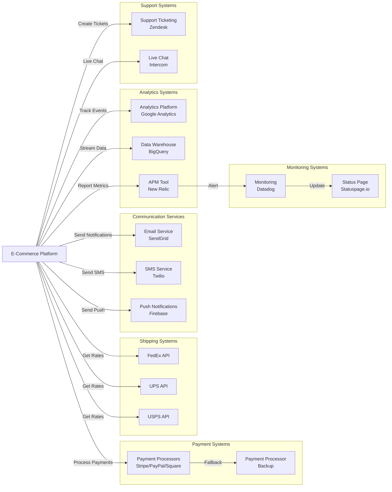

# Platform Integration and Operations Requirements

## Executive Summary

This document defines all external system integrations, third-party services, operational infrastructure, and compliance requirements for the e-commerce shopping mall platform. The platform must integrate with multiple payment processors, shipping carriers, notification services, and analytics platforms while maintaining high standards for security, compliance, performance, and reliability. These integrations form the operational backbone that enables the platform to function as a complete, enterprise-grade e-commerce solution.

The platform targets a global audience and must therefore support multiple payment methods, shipping carriers, currencies, and regulatory requirements. All external integrations must be designed with redundancy, error handling, and graceful degradation to ensure platform resilience and continuous operation.

---

## Payment Gateway Integration

### Payment Processor Requirements

THE platform SHALL integrate with multiple payment processors to accept various payment methods from customers worldwide. THE system SHALL support the following payment methods:

- Credit and debit cards (Visa, Mastercard, American Express)
- Digital wallets (PayPal, Apple Pay, Google Pay)
- Bank transfers and ACH payments
- Regional payment methods (Alipay for Asia, Klarna for Europe, etc.)
- Buy Now, Pay Later (BNPL) services where applicable

THE platform SHALL maintain active integrations with at least two major payment processors to ensure service continuity if one processor experiences downtime.

### Payment Processing Workflow

WHEN a customer initiates checkout, THE system SHALL calculate the final order total including taxes, shipping, and discounts, and present payment options available in their region.

WHEN a customer selects a payment method and enters payment details, THE system SHALL securely transmit the payment information to the appropriate payment processor through encrypted channels.

WHEN the payment processor authorizes the payment, THE system SHALL:
1. Receive and validate the payment authorization response
2. Store the payment transaction record with authorization code
3. Reserve inventory for the ordered items
4. Create the order record with "payment confirmed" status
5. Trigger order confirmation notification to customer and seller

WHEN a payment authorization fails, THE system SHALL:
1. Capture the error code and reason from the payment processor
2. Display a user-friendly error message to the customer
3. Provide clear instructions for retry or alternative payment method
4. Log the failure for fraud detection and analysis
5. Automatically retry payment up to 2 times with backoff delay (first retry after 5 seconds, second retry after 15 seconds)

WHEN a payment processor returns an error indicating a temporary issue, THE system SHALL automatically queue the payment for retry and continue attempting for up to 24 hours before notifying the customer of failure.

### PCI DSS Compliance

THE platform SHALL NOT store complete credit card numbers, CVV codes, or sensitive payment authentication data. THE platform SHALL use tokenization provided by the payment processor to reference payment methods for future transactions.

THE platform SHALL transmit all payment data over TLS 1.2 or higher encrypted connections. THE platform SHALL validate SSL certificates for all payment processor connections.

THE platform SHALL implement rate limiting and fraud detection on payment endpoints to prevent brute force attacks. THE platform SHALL monitor for suspicious payment patterns including:
- Multiple failed attempts from same IP address (>3 failures in 5 minutes triggers temporary block)
- Unusually large transaction amounts relative to customer history
- Geographic anomalies (payment from country different than registered address)
- Rapid successive transactions

THE platform SHALL maintain audit logs of all payment transactions including timestamp, amount, payment method type, customer ID, order ID, and transaction status.

### Refund Processing

WHEN a customer requests a refund through the system, THE platform SHALL validate the refund is within the allowed refund window (typically 30 days from order placement) and that the order is in a refundable state.

WHEN refund conditions are met, THE system SHALL:
1. Create a refund transaction record linked to the original payment
2. Submit the refund request to the payment processor using the original transaction reference
3. Update the refund status to "pending"
4. Notify the customer of the refund initiation

WHEN the payment processor confirms the refund, THE system SHALL:
1. Update refund status to "completed"
2. Add the refund amount back to customer's account or wallet
3. Notify customer of successful refund with expected timeline
4. Update order status to reflect the refund

THE platform SHALL support partial refunds where only some items from an order are refunded.

### Payment Status Synchronization

THE system SHALL query payment processor webhooks to receive real-time payment status updates rather than relying solely on synchronous responses.

WHEN the payment processor sends a webhook notification, THE system SHALL:
1. Verify webhook authenticity using processor-provided signatures
2. Update internal payment status based on webhook data
3. Process corresponding order status updates if payment status changed
4. Log the webhook event for audit purposes
5. Return HTTP 200 acknowledgment to processor to prevent duplicate deliveries

THE system SHALL implement webhook retry handling - if a webhook fails to process, it SHALL automatically retry the processing with exponential backoff.

THE platform SHALL perform daily reconciliation between internal payment records and payment processor transaction history to identify and resolve discrepancies.

---

## Shipping Provider Integration

### Supported Shipping Carriers

THE platform SHALL integrate with major shipping carriers to provide customers with shipping options during checkout. THE system SHALL initially support:

- National postal services (USPS, Royal Mail, Japan Post, etc.)
- International couriers (FedEx, UPS, DHL)
- Regional carriers (appropriate to each geographic market)
- Same-day and next-day delivery services where available

WHILE integrating multiple carriers, THE system SHALL maintain at least one carrier integration in each major geographic region to ensure shipping availability.

### Shipping Rate Calculation

WHEN a customer adds items to their cart and enters a shipping address, THE system SHALL:
1. Aggregate the weight and dimensions of all items in the cart
2. Query all available shipping carriers for rate quotes to the destination address
3. Present available shipping options with costs, estimated delivery dates, and carrier information
4. Update shipping options in real-time if cart contents change

THE system SHALL cache shipping rates for 5 minutes to reduce API calls while still providing current information. THE system SHALL refresh rates if the shipping address or cart contents change by more than 2%.

THE shipping rate calculation SHALL include:
- Base carrier rate from carrier API
- Platform handling fees (if applicable)
- Regional surcharges (remote area fees, island delivery fees, etc.)
- VAT or sales tax (calculated based on destination)
- Promotional discounts (free shipping, reduced rates)

### Shipment Creation and Label Generation

WHEN an order is placed and payment is confirmed, THE seller SHALL initiate shipment creation in their dashboard. WHEN the seller confirms shipment details (selected carrier, service level, package weight/dimensions), THE system SHALL:

1. Call the carrier API to create a shipment record
2. Receive the tracking number and shipping label from the carrier
3. Store the tracking number in the order record
4. Generate and store the shipping label (PDF format)
5. Notify the customer with tracking number and carrier information
6. Notify the seller with tracking number and shipping label for printing

THE system SHALL support batch shipment creation where sellers can create multiple shipments at once.

THE platform SHALL provide shipping label templates that integrate with common label printers for seller convenience.

### Real-Time Tracking and Status Updates

WHEN a shipment is created, THE system SHALL periodically query the shipping carrier for tracking updates (every 6 hours, or more frequently for active shipments).

WHEN the carrier reports a tracking status update, THE system SHALL:
1. Receive tracking events (picked up, in transit, out for delivery, delivered, exception)
2. Update the order's shipping status in the system
3. Store the tracking event with timestamp
4. Notify the customer of significant status changes:
   - Shipment picked up (immediate notification)
   - Out for delivery (immediate notification)
   - Delivered (immediate notification)
   - Delivery exception (immediate notification with issue details)

THE platform SHALL provide customers with a tracking timeline showing all tracking events in chronological order.

WHEN a shipment fails to update for more than 48 hours, THE system SHALL flag it for investigation and notify the seller.

### Delivery Confirmation

WHEN a shipment's status is marked as "delivered" by the carrier, THE system SHALL:
1. Update the order status to "delivered"
2. Update the seller's order fulfillment status
3. Notify the customer that the package has been delivered
4. Trigger the review window (customers can leave reviews starting 24 hours after delivery)
5. Log delivery confirmation for analytics

THE system SHALL provide estimated delivery dates based on the selected shipping service. WHEN actual delivery date differs significantly from estimate (more than 2 days variance), THE system SHALL notify the customer.

### Shipping Cost Calculation for Checkout

THE shipping cost presented to customers during checkout SHALL be the final cost they are charged. THE system SHALL NOT adjust shipping costs after order placement except in cases of:
- Customer explicitly requests different shipping method after order placement
- Shipping address is changed after order placement
- Platform error in initial calculation (which must be refunded to customer)

IF a shipping carrier increases rates or a promotional discount expires before shipment, THE platform SHALL absorb the difference rather than charging the customer additional fees.

### Multiple Carrier Support and Fallback

THE system SHALL attempt to get rate quotes from all integrated carriers. IF a carrier API is unavailable or returns an error, THE system SHALL:
1. Continue querying other carriers
2. Present options from available carriers
3. Log the carrier unavailability for monitoring
4. Alert operations team if multiple carriers become unavailable

WHEN a seller attempts to create a shipment with a carrier that is experiencing downtime, THE system SHALL:
1. Detect the unavailability
2. Suggest alternative carriers that serve the same destination
3. Allow the seller to switch carriers without re-entering shipment details
4. Provide the customer with updated tracking information after carrier switch

---

## Email and Notification Services

### Notification Triggers and Channels

THE platform SHALL send notifications to customers and sellers through multiple channels:

**Email notifications** (primary channel):
- Account registration confirmation
- Password reset requests
- Order confirmation and details
- Payment confirmation
- Shipment dispatch notification with tracking number
- Delivery confirmation
- Review request (24 hours after delivery)
- Account security alerts

**SMS notifications** (for critical time-sensitive updates):
- Order confirmation (if customer opted in)
- Shipment dispatch with tracking number
- Out for delivery alert
- Delivery confirmation
- Account security alerts

**In-app notifications**:
- New messages or support responses
- Review reminders
- Promotional offers (if opted in)
- System maintenance alerts

**Push notifications** (mobile app):
- Shipment status updates
- Review reminders
- Promotional offers
- Message notifications

THE platform SHALL allow customers to configure their notification preferences including:
- Which notification types they wish to receive
- Which channels they prefer (email, SMS, in-app, push)
- Frequency of promotional notifications
- Quiet hours during which non-urgent notifications are not sent

### Email Notification Templates

THE platform SHALL use templated emails that:
1. Include professional branding (logo, colors, fonts)
2. Are responsive and display correctly on mobile and desktop
3. Include clear call-to-action buttons (View Order, Track Shipment, Leave Review, etc.)
4. Contain plain text fallback versions
5. Include unsubscribe links and notification preference links
6. Are localized to customer's language preference

EACH email template SHALL include:
- Personalized greeting with customer name
- Order-specific details (order number, items, amounts)
- Clear next steps or required actions
- Support contact information
- Company branding and footer information

### SMS Notification Requirements

WHEN sending SMS notifications, THE system SHALL:
1. Respect customer SMS opt-in preferences (SMS is opt-in, not default)
2. Send only critical, time-sensitive updates (not promotional content)
3. Use short, clear language optimized for SMS format
4. Include a tracking link URL for shipment updates
5. Include a short code for customers to reply with issues

THE platform SHALL support SMS delivery to international phone numbers and SHALL adapt message length to local SMS standards.

### Push Notification Support

THE platform SHALL integrate with push notification services (Firebase Cloud Messaging for Android, APNs for iOS) to send notifications to mobile app users.

WHEN a customer installs the mobile app, THE system SHALL:
1. Request push notification permission
2. Register the device token with the notification service
3. Store device token linked to customer account
4. Allow customer to manage push preferences in app settings

WHEN a shipment status updates, THE system SHALL:
1. Send push notification to all registered devices for that customer
2. Include notification title, message, and deep link to order details
3. Track whether customer opened the notification

### Notification Scheduling and Delivery

THE system SHALL use a reliable email/SMS provider (e.g., SendGrid, Twilio, SES) with the following capabilities:

- Queue notifications reliably with persistence (notifications survive system restarts)
- Automatically retry failed deliveries with exponential backoff
- Track delivery status (sent, bounced, opened, clicked)
- Rate limit to avoid overwhelming provider APIs

WHEN queuing a notification, THE system SHALL:
1. Store notification record with recipient, content, channel, and scheduled time
2. Immediately queue for delivery unless scheduled for future time
3. Log the notification event for audit purposes
4. Update notification status as delivery progresses (queued → sent → delivered/bounced)

THE system SHALL batch notifications where possible to reduce API calls (e.g., consolidating multiple updates into a single "Weekly Activity Summary" email).

### Notification History and Tracking

THE platform SHALL maintain a complete history of all notifications sent, including:
- Recipient (customer or seller)
- Notification type and content
- Channel (email, SMS, push, in-app)
- Scheduled and actual send time
- Delivery status (sent, bounced, failed, opened)
- Engagement metrics (email opens, link clicks)

THE system SHALL provide admin dashboard showing notification performance metrics:
- Delivery rates by channel and notification type
- Bounce rates and bounce reasons
- Open rates and engagement rates
- Failed delivery analysis

### Unsubscribe and Preference Management

EVERY email notification SHALL include an unsubscribe link. WHEN a customer clicks the unsubscribe link, THE system SHALL:
1. Immediately remove the customer from that notification category
2. Update customer notification preferences
3. Show confirmation that preference has been updated
4. Provide a link to re-subscribe to notifications

THE platform SHALL maintain a blocklist of bounced email addresses and SHALL NOT attempt to send further emails to addresses on the blocklist.

WHEN an email bounces due to a permanent failure (user does not exist, domain invalid), THE system SHALL:
1. Add email to blocklist
2. Notify the customer through alternative channel if available
3. Prompt customer to verify their email address on next login
4. Prevent order confirmation from being sent to invalid email

### Multi-Language Notification Support

THE system SHALL send notifications in the customer's preferred language. THE system SHALL support at minimum:
- English
- Spanish
- French
- German
- Chinese (Simplified and Traditional)
- Japanese
- Korean

WHEN a customer changes their language preference, THE system SHALL:
1. Update preference in customer profile
2. Send future notifications in the new language
3. Note: Previously sent notifications are not translated (language is fixed at send time)

---

## Analytics and Reporting Platforms

### Event Tracking and Data Collection

THE platform SHALL collect business events that track user behavior and system performance. CRITICAL events to track include:

**Customer Journey Events**:
- Product view (with product ID, category, price)
- Product add to cart (with product ID, quantity, SKU variant)
- Product add to wishlist (with product ID)
- Cart checkout initiated (with cart value, item count)
- Order placed (with order total, items, payment method, shipping address)
- Order completed/delivered (with order total, revenue)
- Product reviewed (with product ID, rating, review length)

**Seller Activity Events**:
- Product created/updated (with product details)
- Shipment created (with shipping method, cost)
- Seller dashboard accessed (with features used)

**System Performance Events**:
- Page load times (with page type, duration)
- API response times (with endpoint, response time, status code)
- Payment processing time (with payment method, duration)
- Search performance (with query, result count, response time)

**Error and Issue Events**:
- Payment failures (with error code, reason)
- Shipment tracking failures (with carrier, reason)
- API errors (with endpoint, error code, status)

THE platform SHALL implement event tracking using a service like Google Analytics 4, Mixpanel, or similar that supports custom events.

WHEN an event occurs, THE system SHALL:
1. Create event record with timestamp
2. Include relevant context (user ID, session ID, page/endpoint)
3. Include custom properties (product ID, order total, etc.)
4. Queue event for transmission to analytics platform
5. Batch transmit events to reduce API calls (batch size: 50 events or 10 second timeout, whichever comes first)

### Dashboard Creation and Visualization

THE platform SHALL provide analytics dashboards accessible to different user types:

**Admin Dashboard**:
- Total orders and revenue (daily, weekly, monthly)
- Average order value (AOV) trends
- Customer acquisition and retention metrics
- Seller performance metrics (number of active sellers, products listed, sales)
- Payment method distribution
- Top selling products and categories
- Geographic distribution of orders
- Customer satisfaction (average ratings)
- Platform growth metrics

**Seller Dashboard**:
- Their store sales (daily, weekly, monthly)
- Number of products listed and visibility
- Top selling products
- Customer reviews and ratings for their products
- Order fulfillment rate and speed
- Revenue and commission details
- Traffic to their products
- Competitor benchmarking (anonymized)

**Customer Dashboard** (limited analytics):
- Personal spending summary
- Order history with status
- Wishlist tracking (price changes)
- Review recommendations

### Business Intelligence Requirements

THE system SHALL support ad-hoc reporting where admins can:
1. Query orders by various filters (date range, seller, category, payment method, order status)
2. Export reports to CSV/Excel format
3. Schedule automated report generation and email delivery
4. Create custom dashboards with selected metrics

THE platform SHALL track cohort-based metrics:
- Customer cohorts by registration month
- Repeat purchase rate by cohort
- Customer lifetime value (CLV) by cohort
- Churn rate by cohort

THE system SHALL calculate key business metrics:
- Monthly Recurring Revenue (MRR) if subscription products exist
- Customer Acquisition Cost (CAC) if marketing spend is tracked
- Return on Ad Spend (ROAS)
- Inventory turnover by product
- Days Sales Outstanding (DSO) for seller payments

### Real-Time Analytics Capabilities

THE analytics platform SHALL provide real-time dashboards showing:
- Orders placed in the last hour/day
- Current number of active users browsing
- Live transaction feed (showing high-value orders)
- Real-time alerts on anomalies:
  - Sudden spike in payment failures
  - Unusually high order values
  - High volume of refund requests
  - Site performance degradation

WHEN an anomaly is detected, THE system SHALL alert the operations team with:
1. Alert type and severity
2. Metric that triggered the alert
3. Current value vs. normal range
4. Recommended action

### Custom Report Generation

THE platform SHALL allow admins to generate custom reports with:
1. Selected metrics and dimensions
2. Time range and granularity (daily, weekly, monthly)
3. Filters (seller, category, payment method, shipping region, etc.)
4. Grouping and sorting options
5. Export format (PDF, Excel, CSV)

THE system SHALL support scheduled report delivery:
- Select report configuration
- Choose delivery schedule (daily, weekly, monthly)
- Specify recipients (email list)
- Automatically generate and email report on schedule

### Data Warehouse Integration

THE platform SHALL integrate with a data warehouse (e.g., Snowflake, BigQuery, AWS Redshift) for long-term analytics and machine learning. THE system SHALL:

1. Stream events to data warehouse in real-time (using CDC or event streaming)
2. Maintain data warehouse with clean, normalized tables:
   - Fact tables: orders, order_items, transactions, reviews
   - Dimension tables: customers, sellers, products, categories
3. Support historical queries (comparing year-over-year metrics)
4. Maintain data quality and consistency

THE data warehouse SHALL be used for:
- Training ML models (product recommendations, fraud detection)
- Complex analytics queries
- Historical reporting and trend analysis
- Data science initiatives

### Performance Metrics Tracking

THE system SHALL track performance metrics:
- Website/app page load times (target: <2 seconds for 95th percentile)
- API response times (target: <500ms for 95th percentile)
- Search response times (target: <1 second for 95th percentile)
- Payment processing time (target: <10 seconds end-to-end)
- Checkout completion time
- Order fulfillment time (seller's time to ship)
- Delivery time accuracy

WHEN performance degrades below targets, THE system SHALL:
1. Alert operations team
2. Log performance metrics for investigation
3. Trigger automatic scaling (if applicable)
4. Provide performance debugging information

---

## Search Engine Optimization

### Product Search Indexing

THE platform SHALL implement a product search system that allows customers to quickly find products. THE search system SHALL support:

- Full-text search across product names, descriptions, and keywords
- Faceted search allowing filtering by category, price range, brand, ratings, color, size, etc.
- Autocomplete suggestions as customer types search query
- Search suggestions (did you mean, related searches)
- Typo tolerance (finding "tshirt" when customer searches "t-shrit")
- Search analytics showing popular searches and searches with no results

THE platform SHALL use Elasticsearch or similar search engine for efficient, scalable search.

WHEN a product is created or updated by a seller, THE system SHALL:
1. Index the product in the search system immediately
2. Update search index if product details change (name, description, price, availability)
3. Remove product from search index when it's no longer visible (unpublished, out of stock)

THE search index SHALL include:
- Product ID and seller ID
- Product name, description, categories
- Price and currency
- Availability status and stock level
- Ratings and number of reviews
- Product images
- Keywords and tags
- Seller name and ratings

### SEO-Friendly URLs and Metadata

THE platform SHALL generate SEO-friendly URLs for all important pages:

**Product page**: `/products/{product-name-slug}-{product-id}`
- Example: `/products/wireless-bluetooth-headphones-12345`

**Category page**: `/categories/{category-name-slug}`
- Example: `/categories/electronics/headphones`

**Seller store page**: `/sellers/{seller-name-slug}-{seller-id}`
- Example: `/sellers/electronics-megastore-789`

**Review pages**: `/products/{product-id}/reviews`

ALL URLs SHALL:
- Use hyphens to separate words (not underscores)
- Be lowercase
- Be descriptive and include keywords
- Avoid unnecessary parameters in URL (use URL path structure instead)
- Implement 301 redirects if URLs are changed (to preserve SEO value)

EACH product page SHALL include appropriate meta tags:
- `<title>`: Product name - E-Commerce Mall (50-60 characters)
- `<meta name="description">`: Product summary (150-160 characters)
- `<meta name="keywords">`: Relevant search terms
- `<canonical>`: Self-referencing canonical URL
- Open Graph tags for social sharing (title, image, price)

### Sitemap Generation

THE platform SHALL automatically generate XML sitemaps for search engine crawling:

- `/sitemap.xml` - Index of all sitemaps
- `/sitemaps/products-1.xml`, `/sitemaps/products-2.xml`, etc. - Product URLs (max 50,000 URLs per sitemap)
- `/sitemaps/categories.xml` - Category pages
- `/sitemaps/sellers.xml` - Seller store pages

WHEN products are added, updated, or removed, THE system SHALL:
1. Update the appropriate sitemap within 1 hour
2. Notify search engines of sitemap changes via Search Console API
3. Ensure sitemap includes lastmod timestamp for all URLs

### Search Ranking Optimization

THE platform SHALL implement best practices for search engine ranking:

**Page Speed Optimization**:
- THE platform SHALL achieve Google PageSpeed Insights score of 80+ for product pages
- Images SHALL be optimized and lazy-loaded
- CSS and JavaScript SHALL be minified
- Server response time SHALL be <600ms

**Mobile Optimization**:
- THE platform SHALL be fully responsive on mobile devices
- Mobile page speed SHALL be >2.0 seconds (Core Web Vitals target)
- Touch targets SHALL be appropriately sized (>48x48 pixels)

**Content Quality**:
- Product descriptions SHALL include relevant keywords naturally
- Category pages SHALL include SEO-optimized content sections
- Product reviews contribute to page freshness and user-generated content signals

**Link Building**:
- Product pages SHALL include internal links to related products
- Category pages SHALL link to subcategories and featured products
- Sellers' store pages SHALL link to their products

### Meta Tags and Structured Data

EVERY product page SHALL include structured data (Schema.org JSON-LD format):

```json
{
  "@context": "https://schema.org/",
  "@type": "Product",
  "name": "Product Name",
  "image": "https://...",
  "description": "Product description",
  "brand": {
    "@type": "Brand",
    "name": "Brand Name"
  },
  "offers": {
    "@type": "Offer",
    "price": "19.99",
    "priceCurrency": "USD",
    "availability": "https://schema.org/InStock"
  },
  "aggregateRating": {
    "@type": "AggregateRating",
    "ratingValue": "4.5",
    "reviewCount": "100"
  }
}
```

CATEGORY pages SHALL include structured data for breadcrumb navigation:

```json
{
  "@context": "https://schema.org",
  "@type": "BreadcrumbList",
  "itemListElement": [
    { "@type": "ListItem", "position": 1, "name": "Electronics", "item": "https://..." },
    { "@type": "ListItem", "position": 2, "name": "Computers", "item": "https://..." },
    { "@type": "ListItem", "position": 3, "name": "Laptops", "item": "https://..." }
  ]
}
```

SELLER store pages SHALL include:

```json
{
  "@context": "https://schema.org/",
  "@type": "LocalBusiness",
  "name": "Seller Store Name",
  "url": "https://...",
  "aggregateRating": {
    "@type": "AggregateRating",
    "ratingValue": "4.8",
    "reviewCount": "500"
  }
}
```

### Mobile Optimization Requirements

THE platform SHALL be optimized for mobile users since mobile traffic typically represents >60% of e-commerce traffic:

- Responsive design with mobile-first approach
- Touch-friendly navigation and buttons
- Mobile-optimized image sizes and formats (WebP with PNG fallback)
- Fast mobile page load (<3 seconds on 4G)
- Mobile search functionality as robust as desktop
- Mobile checkout simplified (minimize form fields)
- Mobile app deep linking (if app exists)

---

## Customer Support Integration

### Support Ticket System Integration

THE platform SHALL integrate with a customer support system (e.g., Zendesk, Freshdesk, Intercom) to manage customer inquiries and support requests.

WHEN a customer submits a support request through the platform, THE system SHALL:
1. Create a support ticket in the ticket system
2. Associate ticket with customer account
3. Associate ticket with relevant order (if inquiry is order-related)
4. Auto-assign category based on inquiry type (shipping, returns, product quality, seller issue, etc.)
5. Send confirmation email to customer with ticket number
6. Display ticket status in customer dashboard

THE support system SHALL track:
- Time to first response
- Time to resolution
- Customer satisfaction rating
- Support agent performance metrics
- Common issue patterns

### Live Chat Capabilities

THE platform SHALL offer live chat support for customers needing immediate assistance. THE live chat system SHALL:

- Display availability status (online, busy, offline)
- Queue customers when all agents are busy
- Provide estimated wait time
- Allow customers to leave message if no agents available
- Offer chat transcript via email after chat ends
- Integrate with customer account (agents see customer history, orders, account status)

THE platform SHALL provide chat widget on:
- Product pages (product-specific questions)
- Checkout pages (payment/shipping questions)
- Support pages (general support)

WHEN a chat is initiated, THE system SHALL:
1. Route to available agent
2. Share customer context (account status, recent orders, previous chats)
3. Track response time for SLA monitoring
4. Record transcript for quality assurance and training

### Knowledge Base Integration

THE platform SHALL maintain a searchable knowledge base with self-service articles covering:
- Frequently asked questions (FAQs)
- How-to guides for common tasks (registering, placing orders, tracking shipments, leaving reviews)
- Product guides and specifications
- Return and refund policies
- Shipping and delivery information
- Payment methods and troubleshooting
- Account security and privacy information

THE knowledge base SHALL:
- Be searchable by customers
- Show suggested articles when customer submits support request
- Rank articles by helpfulness (customer ratings)
- Track article usage (view counts, helpful votes)
- Display search analytics to improve article content
- Include video tutorials for complex processes

THE platform SHALL integrate knowledge base with live chat - agents should suggest relevant articles to customers.

### Support Escalation Workflows

WHEN a support issue cannot be resolved at the first level, THE system SHALL:
1. Allow agent to escalate ticket to supervisor
2. Change ticket priority and SLA based on escalation
3. Notify supervisor of escalation reason
4. Add escalation notes to ticket history
5. Track escalation rates by issue type

THE platform SHALL define escalation criteria:
- Issues unresolved after 24 hours
- High-value orders (>$500)
- Safety or legal concerns
- Dispute involving sellers or payments
- Multiple prior incidents by same customer

### Customer Inquiry Tracking

THE platform SHALL maintain inquiry history for each customer showing:
- All previous support tickets and inquiries
- Issue types and resolutions
- Time to resolution
- Customer satisfaction ratings
- Related orders and products

WHEN a customer with prior issues opens a new inquiry, THE system SHALL:
1. Alert support agent of customer's history
2. Show customer's previous similar issues and resolutions
3. Provide context for faster resolution

THE platform SHALL analyze inquiry patterns:
- Customers submitting repeated similar issues (product quality, seller service)
- Sellers with high complaint rates
- Products with high support volume
- Alert operations team to systemic issues

---

## Data Privacy and Compliance

### GDPR Compliance Requirements

THE platform SHALL comply with the General Data Protection Regulation (GDPR) for customers and business contacts in the European Union. The system SHALL:

**Lawful Basis**:
- Clearly identify the lawful basis for processing customer data
- Obtain explicit consent for non-essential processing (marketing, analytics beyond legitimate business interest)
- Implement consent management system tracking what the customer consented to and when

**Data Subject Rights**:
- WHEN a customer requests their personal data, THE system SHALL provide all their data (portability) in machine-readable format (CSV, JSON) within 30 days
- WHEN a customer requests deletion (right to be forgotten), THE system SHALL delete personal data within 30 days (with exceptions for legal/tax obligations)
- WHEN a customer requests data correction, THE system SHALL update their data and correct it in all systems
- WHEN a customer revokes consent, THE system SHALL cease processing for that purpose

**Privacy by Design**:
- Collect only necessary personal data for stated purposes
- Implement data minimization (don't collect more than needed)
- Implement privacy impact assessments for new data processing activities
- Default privacy-protective settings (opt-in for non-essential processing)

**Data Processing Agreements**:
- THE platform SHALL have Data Processing Agreements (DPA) with all vendors processing customer data
- DPAs SHALL specify processor obligations, data security measures, and sub-processor policies
- THE platform SHALL maintain list of all processors and sub-processors

### PCI DSS Compliance for Payments

THE platform SHALL achieve and maintain PCI DSS (Payment Card Industry Data Security Standard) Level 1 compliance, the highest security level for organizations handling payment cards. Specific requirements:

**Secure Network**:
- Install and maintain firewall for payment systems
- Use default credentials only for test systems; change all default passwords
- Implement intrusion detection/prevention systems (IDS/IPS)
- Prohibit direct public access to cardholder data (use tokenization/encryption)

**Cardholder Data Protection**:
- NEVER store full card numbers; use tokenization
- NEVER store CVC/CVV codes
- NEVER store PIN codes
- Encrypt cardholder data in transit using TLS 1.2+
- Encrypt cardholder data at rest using AES-256 or equivalent
- Implement secure deletion for cardholder data

**Access Control**:
- Implement role-based access control (RBAC)
- Restrict access to cardholder data on need-to-know basis
- Assign unique user IDs to all system users
- Restrict physical access to payment processing systems
- Implement multi-factor authentication for payment system access

**Regular Monitoring and Testing**:
- Run automated vulnerability scans at least weekly
- Conduct quarterly penetration testing
- Maintain logs of all access to cardholder data systems
- Monitor for intrusion attempts and suspicious activity

**Vendor Management**:
- Maintain list of all payment processors and vendors
- Ensure all vendors are PCI DSS compliant
- Include security requirements in vendor contracts
- Annually confirm vendor compliance status

**Annual Compliance Validation**:
- THE platform SHALL undergo annual PCI DSS audit by qualified security assessor (QSA)
- Complete attestation of compliance (SAQ-A-EP or Level 1 questionnaire)
- Maintain compliance documentation for 3 years

### Data Retention Policies

THE platform SHALL define and implement data retention policies:

**Customer Account Data**:
- Retain active account data as long as account is active
- After account deletion, retain identifiable data for 90 days (for system cleanup)
- After 90 days, delete all personal identifiable information (PII)
- Exception: Retain transaction records for 7 years (tax/legal requirements)

**Order and Transaction Data**:
- Retain order records for 7 years (tax and accounting requirements)
- Retain payment records for 7 years (PCI compliance)
- Retain shipping records for 3 years
- Retain return/refund records for 3 years

**Support and Communication Records**:
- Retain support tickets for 2 years
- Retain email logs for 1 year
- Retain chat transcripts for 1 year
- Exception: Retain if related to dispute or legal proceeding (as long as applicable)

**Analytics and Logs**:
- Retain raw event logs for 90 days
- Retain aggregated analytics data indefinitely (no PII)
- Retain error logs for 30 days
- Retain security logs for 1 year

**Audit and Compliance Records**:
- Retain audit logs for 1 year
- Retain compliance records for 3 years (including PCI DSS evidence)
- Retain data processing agreements for 3 years after termination

WHEN retention period expires, THE system SHALL:
1. Automatically delete data (no manual intervention)
2. Log deletion for audit trail
3. Verify deletion success
4. Report deletion metrics to compliance team

### User Consent Management

THE platform SHALL implement consent management system that:

**Consent Capture**:
- Capture explicit consent for marketing communications at registration
- Capture consent for analytics cookies/pixels during first visit
- Capture consent for data processing in specific use cases
- Record consent timestamp and version of privacy policy consented to
- Allow consent to be captured in multiple languages

**Consent Display**:
- Show consent requests clearly before capturing data
- Use clear, plain language (not legal jargon)
- Make consent opt-in (not pre-checked)
- Provide easy way to review and modify consent
- Distinguish between required and optional consent

**Consent Withdrawal**:
- Allow customers to view what they consented to
- Allow customers to withdraw consent at any time
- Provide easy unsubscribe links in all marketing communications
- Cease processing immediately upon consent withdrawal
- No retaliation for withdrawal of consent (don't delete account or restrict access)

**Consent Records**:
- Maintain records of all consents with timestamp
- Track changes to consent preferences
- Maintain audit trail of consent management
- Support consent export for data subject access requests

### Privacy Policy Enforcement

THE platform SHALL maintain clear, accessible privacy policy covering:
- What personal data is collected
- How personal data is used and for what purposes
- Who personal data is shared with (if anyone)
- How long personal data is retained
- User rights (access, deletion, portability, objection)
- How to contact privacy/data protection team
- Complaint procedures
- Cookie usage and tracking
- Security measures

THE platform SHALL:
- Display privacy policy prominently (easy access from all pages)
- Provide privacy policy in multiple languages
- Update privacy policy when practices change
- Notify users of material changes to privacy policy
- Require re-acceptance of updated policy

WHEN processing activities change, THE system SHALL:
1. Update privacy policy
2. Conduct privacy impact assessment
3. If new data types collected, obtain new consent
4. If new purposes, obtain new consent
5. Notify customers of changes

### Data Export and Deletion Capabilities

THE platform SHALL provide customers with self-service data export and deletion:

**Data Export (Portability)**:
- WHEN customer requests export, THE system SHALL generate file containing:
  - Account information (name, email, phone, addresses)
  - Order history with order details
  - Payment methods (token references, but not card numbers)
  - Reviews and ratings submitted
  - Wishlist items
  - Support tickets and communications
  - Preference settings
- Export format: JSON or CSV (customer choice)
- Deliver via secure download link (expires after 7 days)
- Send confirmation email with download link
- Process request within 30 days (typically much faster)

**Account Deletion**:
- WHEN customer requests deletion, THE system SHALL:
  1. Show what data will be deleted
  2. Show what data will be retained (for legal/tax reasons)
  3. Require confirmation (sent via email)
  4. Execute deletion only after email confirmation received
  5. Delete PII from active systems immediately
  6. Mark account as deleted in database
  7. Confirm deletion via email
- Process request within 30 days

**Seller Data Management**:
- WHEN seller requests deletion, THE system SHALL:
  1. Allow seller to export their product catalog
  2. Allow seller to export sales records
  3. Delete seller account after orders are complete
  4. Retain order records for tax/legal purposes (but deidentify seller)

### Audit Logging for Compliance

THE platform SHALL maintain comprehensive audit logs for all data access and processing:

**Events to Log**:
- Customer account creation/modification/deletion
- Personal data access (when, by whom, what data)
- Data export/download requests and completion
- Deletion requests and completion
- Payment processing (transaction ID, amount, status - no card data)
- Support ticket access by agents
- Admin data access
- API authentication and access
- Failed login attempts
- Permission changes
- Data processing agreement updates

**Audit Log Contents**:
- Event timestamp (UTC)
- Event type (access, modification, deletion, etc.)
- User/system performing action (user ID, IP address)
- Resource affected (customer ID, order ID, etc.)
- Action details (what was changed, from what to what)
- Outcome (success/failure)
- Any errors or exceptions

**Audit Log Security**:
- Store audit logs in tamper-evident system (cannot be deleted/modified without detection)
- Restrict audit log access to authorized personnel only
- Encrypt audit logs at rest
- Backup audit logs separately
- Retain audit logs for 1 year minimum (longer for compliance)

**Compliance Reporting**:
- Generate audit reports for compliance reviews
- Export audit logs for regulatory requests
- Search/filter audit logs by user, resource, date range, event type
- Generate alerts for suspicious access patterns

---

## Performance and Scalability

### Performance Requirements and Targets

THE platform SHALL achieve the following performance targets to ensure excellent customer experience:

**Page Load Performance**:
- WHEN a customer visits a product page, THE page SHALL load within 2 seconds (for 95th percentile)
- WHEN a customer views a category page, THE page SHALL load within 2 seconds (for 95th percentile)
- WHEN a customer performs a search, results SHALL display within 1 second (for 95th percentile)
- WHEN a customer accesses their account dashboard, THE page SHALL load within 2 seconds

**API Response Times**:
- Search API: <1 second response time (95th percentile)
- Product detail API: <500ms response time (95th percentile)
- Cart operations API: <300ms response time (95th percentile)
- Order creation API: <5 seconds response time (95th percentile, includes payment processing)
- User account APIs: <500ms response time (95th percentile)

**Database Query Performance**:
- Most database queries: <100ms execution time
- Complex queries (reports, analytics): <5 seconds execution time
- Database connection pooling to prevent connection exhaustion
- Query optimization to minimize full table scans

**Search Performance**:
- WHEN customer searches product catalog with 10 million+ products, results SHALL return within 1 second
- Search autocomplete suggestions: <300ms response time
- Facet calculations for search filters: <500ms response time

**Payment Processing**:
- Payment processing end-to-end: <10 seconds
- Payment provider integration API: <5 seconds response
- Automatic payment retry should not exceed 24 hours total

**Concurrent User Capacity**:
- THE platform SHALL support 10,000 concurrent users during peak hours without performance degradation
- THE platform SHALL support 100,000 concurrent users with acceptable performance (response times up to 5 seconds)

### Load Handling Capacity

THE platform SHALL be designed to handle peak traffic loads:

**Traffic Patterns**:
- Typical daily traffic: 1 million page views
- Peak hour traffic: 100,000 page views
- Peak day traffic (holiday sales): 10 million page views (10x normal)
- Peak month traffic (major sale event): 200 million page views

**Concurrent Connection Handling**:
- Handle 10,000+ concurrent connections during normal operation
- Handle 50,000+ concurrent connections during promotional events
- Graceful degradation beyond capacity (queuing requests, not dropping them)

**Database Capacity**:
- Support 100 million+ product records
- Support 100 million+ order records
- Support 500 million+ review/rating records
- Query performance remains <100ms for standard queries at this scale

**Storage Capacity**:
- Product images: 10+ GB (100+ million product images)
- Order data: 50+ GB (100+ million orders)
- User-generated content (reviews, images): 100+ GB
- Transaction logs and audit logs: 500+ GB

### Database Optimization Requirements

THE platform SHALL implement database optimization:

**Indexing Strategy**:
- Create indexes on frequently queried columns (user_id, product_id, order_id, category)
- Create composite indexes for common query patterns (e.g., seller_id + product_status)
- Avoid over-indexing (each index increases write performance overhead)
- Monitor index usage and remove unused indexes quarterly

**Query Optimization**:
- Avoid N+1 query problems (batch fetch related data)
- Use pagination for large result sets (max 100 items per query)
- Denormalize data for read-heavy queries (e.g., cache product ratings count)
- Use query optimization explained plans to identify slow queries

**Data Partitioning**:
- Partition large tables by date range (e.g., orders table partitioned by order_date)
- Partition by region for multi-region deployments
- Enables faster queries on recent data (most common access pattern)

**Caching Strategy**:
- Cache product catalog in-memory (fast reads, 1-minute invalidation)
- Cache category/search data (1-minute invalidation)
- Cache user session data
- Cache order data for frequently accessed orders (1-hour invalidation)
- Use Redis or Memcached for distributed caching

**Connection Pooling**:
- Use database connection pooling to reuse connections
- Pool size: 20-50 connections for normal operation
- Prevent connection leaks through proper resource management

### Caching Strategies

THE platform SHALL implement multi-layer caching for optimal performance:

**HTTP Response Caching**:
- Cache public product pages (1 hour TTL)
- Cache category pages (1 hour TTL)
- Cache static assets (images, CSS, JS) with long TTL (30 days)
- Invalidate cache when product is updated by seller

**API Response Caching**:
- Cache product list API responses (5 minutes TTL)
- Cache product detail API responses (10 minutes TTL)
- Cache category/search responses (5 minutes TTL)
- Cache user preference data (1 hour TTL)
- Skip cache for user-specific data (cart, orders, account)

**Database Query Caching**:
- Cache aggregated data (total revenue, order counts, ratings) - 1 hour TTL
- Cache category/taxonomy data - 1 hour TTL
- Cache seller information - 24 hour TTL

**Cache Invalidation**:
- When product is updated, invalidate product cache immediately
- When inventory changes, invalidate inventory cache immediately
- When order is placed, invalidate user cart cache immediately
- Use event-driven cache invalidation (avoid time-based expiry for critical data)

### Content Delivery Requirements

THE platform SHALL use Content Delivery Network (CDN) for efficient content distribution:

**CDN Implementation**:
- Serve product images through CDN (Cloudflare, AWS CloudFront, Akamai, etc.)
- Store images in multiple geographic locations for fast delivery
- Image optimization on-the-fly (resize, format conversion to WebP)
- Cache static assets (CSS, JavaScript) on CDN

**Image Optimization**:
- Serve different image sizes based on device (mobile 300px, tablet 600px, desktop 1200px)
- Use progressive JPEG format for faster perceived load
- Use WebP format for supported browsers (25-35% smaller)
- Lazy-load images below the fold
- Compress images to <200KB per product image

**Geographic Optimization**:
- Serve content from location closest to customer
- Reduce latency from 200-500ms to <50ms for most users

---

## Monitoring and Alerting

### System Health Monitoring

THE platform SHALL continuously monitor system health and performance:

**Application Health**:
- Monitor API response times (alerting if >1 second for 5 minutes)
- Monitor error rates (alerting if >1% of requests fail)
- Monitor successful transaction rates (alerting if <99%)
- Monitor payment processing success rates (alerting if <99.5%)
- Monitor database connection count (alerting if >80% of pool capacity)

**Database Health**:
- Monitor database query performance (alerting if slow log exceeds threshold)
- Monitor database CPU usage (alerting if >80%)
- Monitor database memory usage (alerting if >85%)
- Monitor disk space (alerting if <20% free)
- Monitor replication lag (alerting if >1 second lag)

**Infrastructure Health**:
- Monitor server CPU usage (alerting if >80% for 5 minutes)
- Monitor server memory usage (alerting if >85%)
- Monitor disk I/O (alerting if >90% capacity)
- Monitor network bandwidth (alerting if approaching limits)
- Monitor service availability (alerting if unavailable)

### Error Tracking and Alerting

THE platform SHALL implement error tracking and alerting system:

**Error Capture**:
- Capture all application errors with stack traces
- Capture error context (user, request, session data)
- Capture error frequency and trends
- Distinguish between handled errors and unhandled exceptions

**Error Analysis**:
- Group similar errors together
- Calculate error rate by error type
- Identify error spike patterns
- Correlate errors with deployments or system changes

**Error Alerting**:
- WHEN an error occurs with severity "critical" (payment failure, data loss), alert team immediately
- WHEN error rate exceeds threshold (>1% of requests), alert team
- WHEN new error type appears (never seen before), alert team
- WHEN error rate returns to normal, send resolution notification

**Error Resolution**:
- Track error resolution (who fixed, when, what was the fix)
- Associate error fixes with code commits/deployments
- Build knowledge base of common errors and solutions

### Performance Monitoring

THE platform SHALL monitor performance metrics continuously:

**Key Performance Indicators (KPIs)**:
- Page load time (target: <2 seconds, 95th percentile)
- API response time (target: <500ms, 95th percentile)
- Search response time (target: <1 second, 95th percentile)
- Database query time (target: <100ms, 95th percentile)
- Payment processing time (target: <10 seconds, 95th percentile)

**Performance Trends**:
- Monitor performance over time (daily, weekly, monthly trends)
- Identify performance regressions after deployments
- Correlate performance with traffic volume
- Identify specific endpoints with performance issues

**Bottleneck Identification**:
- Use APM (Application Performance Monitoring) tools to identify slow code
- Profile database queries to find slow queries
- Analyze API call chains to find expensive operations
- Identify N+1 queries and optimization opportunities

### Uptime Monitoring and SLAs

THE platform SHALL define and monitor Service Level Agreements (SLAs):

**Uptime Targets**:
- THE platform SHALL maintain 99.9% uptime (acceptable downtime: 43 minutes/month)
- Excludes planned maintenance windows (notified in advance)
- Excludes force majeure events (major incidents beyond control)

**Uptime Monitoring**:
- Synthetic monitoring checks platform availability every 30 seconds from multiple geographic locations
- Real-time alerts when platform becomes unavailable
- Automatic incident creation when availability drops below 99%
- Dashboard showing uptime status and incident history

**SLA Tracking**:
- Calculate monthly uptime percentage
- Compare against 99.9% target
- Report SLA achievement to stakeholders
- Escalate if SLA is at risk of being missed

**Incident Communication**:
- Post incident notifications on status page (status.ecommercemall.com)
- Provide regular updates during incidents
- Communicate resolution and root cause post-incident
- Publish incident post-mortems for major incidents

### Alert Notification Configuration

THE platform SHALL support configurable alert notifications:

**Alert Channels**:
- Email alerts to on-call team
- SMS alerts for critical issues
- Slack/Teams notifications for team awareness
- PagerDuty integration for on-call rotation
- Auto-escalation if not acknowledged within time threshold

**Alert Severity Levels**:
- **Critical**: Immediate action required (payment system down, data loss risk)
- **High**: Urgent action required within 30 minutes (error rate spike, performance degradation)
- **Medium**: Action required within 2 hours (moderate issues, non-critical service down)
- **Low**: Action required within 24 hours (warnings, informational alerts)

**Alert Tuning**:
- Adjust alert thresholds based on feedback (reduce false positives)
- Disable alerts for known benign conditions
- Escalate alert if not resolved within SLA
- Track alert fatigue and adjust accordingly

### Dashboard and Visualization

THE platform SHALL provide comprehensive monitoring dashboards:

**Executive Dashboard**:
- Overall platform status (green/yellow/red)
- Uptime percentage for current month
- Key metrics (revenue, orders, active users, errors)
- Major incidents in past 24 hours
- Forecast of SLA achievement

**Operations Dashboard**:
- Real-time API response times by endpoint
- Database performance metrics
- Error rates and error distribution
- Server resource usage (CPU, memory, disk)
- Network bandwidth usage
- Active alerts and incidents

**Business Dashboard**:
- Orders placed per hour
- Revenue per hour
- Popular products
- Payment success rate
- Top errors impacting customers
- Customer complaints/support tickets

**Performance Dashboard**:
- Page load times (95th percentile)
- API response times by endpoint
- Database query performance
- Search performance
- Cache hit rates
- CDN performance

---

## Backup and Disaster Recovery

### Backup Frequency and Retention

THE platform SHALL implement automated backup strategy:

**Full Backups**:
- Perform full database backup daily at off-peak hours (2 AM UTC)
- Retain 7 full backups (one per week for 7 weeks)
- Storage location: Geographically isolated region from primary

**Incremental Backups**:
- Perform incremental backups every 6 hours
- Retain 28 incremental backups (4 backups per day × 7 days)
- Incrementals capture changes since last full backup
- Combine incrementals with most recent full backup to achieve full restore

**Transaction Logs**:
- Archive transaction logs every hour
- Retain 90 days of transaction logs
- Enable point-in-time recovery to any timestamp in past 90 days

**File Backups**:
- Backup product images daily (incremental)
- Backup user-generated content (reviews, support attachments) daily
- Retain 30 days of file backups

**Backup Verification**:
- Automatically verify backup integrity (checksum validation)
- Periodically test backup restoration (monthly full restore test)
- Alert on backup failures immediately
- Maintain backup success metrics (99.9% success target)

### Data Recovery Procedures

THE platform SHALL maintain documented data recovery procedures:

**Recovery Time Objective (RTO)**:
- RTO: 4 hours (maximum time to recover from backup)
- Critical systems (payment, order processing): 1 hour RTO
- Non-critical systems: 24 hour RTO

**Recovery Point Objective (RPO)**:
- RPO: 1 hour (maximum acceptable data loss)
- Critical data: 15-minute RPO
- Using hourly transaction logs to achieve <1 hour data loss

**Recovery Procedures**:
- WHEN database corruption is detected:
  1. Identify corruption scope (affected tables, data)
  2. Determine recovery point (which backup to use)
  3. Start recovery process (restore from backup or transaction logs)
  4. Validate recovered data integrity
  5. Resume normal operations
  6. Investigate corruption root cause

- WHEN complete database loss occurs:
  1. Provision new database instance
  2. Restore most recent full backup
  3. Apply incremental backups and transaction logs to bring to current state
  4. Verify data completeness
  5. Resume service
  6. Analyze what caused loss and prevent recurrence

**Partial Recovery**:
- Support recovery of specific tables (not entire database)
- Support recovery to specific point in time
- Support recovering specific order or user records

### Business Continuity Planning

THE platform SHALL maintain Business Continuity Plan (BCP) addressing:

**Disaster Scenarios**:
- Data center outage (complete region unavailability)
- Database corruption or failure
- Ransomware attack
- Security breach
- Key personnel unavailability
- Third-party service failure (payment processor, shipping provider)

**Continuity Measures**:
- Multi-region deployment with automatic failover
- Database replication to secondary region
- Read-only replicas for reporting (can serve traffic if primary unavailable)
- DNS failover to alternate region
- Inventory of critical suppliers and contingency plans
- Cross-training of personnel on critical processes

**Crisis Communication**:
- Maintain list of stakeholders to notify (customers, sellers, partners)
- Pre-prepared communication templates
- Process for timely updates during outage
- Post-incident communication and lessons learned

### Disaster Recovery Testing

THE platform SHALL conduct quarterly disaster recovery (DR) tests:

**Full Disaster Recovery Test** (quarterly):
- Simulate complete data center failure
- Failover to recovery region
- Restore data from backups
- Verify all systems operational in recovery environment
- Measure actual RTO and RPO
- Document any issues or improvements needed
- Update procedures based on test results

**Backup Restoration Test** (monthly):
- Restore database from backup in isolated environment
- Verify data integrity and completeness
- Test recovery time and document
- Verify transaction logs can be applied

**Failover Test** (monthly):
- Test automatic failover to secondary region
- Verify traffic routes correctly to alternate region
- Verify data replication is current
- Test failback to primary region

**DR Documentation**:
- Maintain updated DR runbooks with step-by-step procedures
- Document recovery contacts and escalation procedures
- Maintain architecture diagrams of recovery environment
- Document testing results and improvements made

### RPO and RTO Requirements

THE platform SHALL achieve:

**Recovery Time Objective (RTO)**:
- Critical systems (payment, checkout): 1 hour
- Order processing and fulfillment: 4 hours
- Analytics and reporting: 24 hours
- Non-critical systems: 72 hours

**Recovery Point Objective (RPO)**:
- Financial transactions: 15 minutes (critical)
- Orders: 1 hour
- Customer accounts: 4 hours
- Analytics: 24 hours

WHEN meeting RPO and RTO:
- Use transaction logs and point-in-time recovery for short RPO
- Use multi-region replication for short RTO
- Use automated failover for quick recovery
- Test procedures quarterly to validate assumptions

### Failover Mechanisms

THE platform SHALL implement automatic failover:

**Database Failover**:
- Primary-replica replication with automatic failover
- Monitor replication lag (alert if >1 second)
- Upon primary failure, promote replica to primary
- Automatic within 2 minutes (target: <1 minute)
- Verify data consistency after failover

**Application Failover**:
- Multi-region deployment of application servers
- Load balancer detects unavailable region
- Routes traffic to healthy region automatically
- Automatic within 30 seconds
- Health checks every 10 seconds

**DNS Failover**:
- Health checks on primary DNS endpoints
- If primary region unhealthy, DNS returns secondary region IPs
- Propagation within 5 minutes (respecting TTL)
- Clients can cache DNS up to 1 hour (limit improvement window)

**Cache Failover**:
- Distributed cache across multiple regions
- If cache node fails, requests go to database (performance impact but no data loss)
- Rebuild cache from database traffic
- Redis or Memcached handles automatic replication

---

## Integration Architecture Overview

The following diagram illustrates how all external systems integrate with the e-commerce platform:



---

## Compliance and Legal Requirements Summary

**Key Compliance Frameworks**:
- GDPR: For EU customers
- CCPA: For California customers
- PCI DSS Level 1: For payment card handling
- SOC 2 Type II: Industry standard for service providers
- WCAG 2.1 AA: Web accessibility standards

**Documentation and Attestation**:
- Annual PCI DSS compliance audit and SAQ submission
- Annual GDPR compliance review and documentation
- Quarterly security vulnerability assessments
- Annual penetration testing
- SOC 2 Type II certification (if serving enterprise customers)

**Legal and Policy Documentation**:
- Privacy policy (GDPR and CCPA compliant)
- Terms of service
- Acceptable use policy
- Data processing agreements with vendors
- Incident response policy

---

## Conclusion

The platform integration and operations framework ensures the e-commerce shopping mall is built on a foundation of reliable external services, strong compliance, and operational excellence. By implementing comprehensive monitoring, backup procedures, and disaster recovery planning, the platform can maintain high availability and data integrity. By integrating with trusted payment processors, shipping carriers, and communication services, the platform delivers a complete, world-class customer experience.

The specifications in this document provide clear requirements for all external integrations and operational standards that backend developers should implement to ensure the platform operates reliably, securely, and in compliance with applicable regulations.

---

> *Developer Note: This document defines **business requirements only**. All technical implementations (architecture, APIs, database design, etc.) are at the discretion of the development team.*