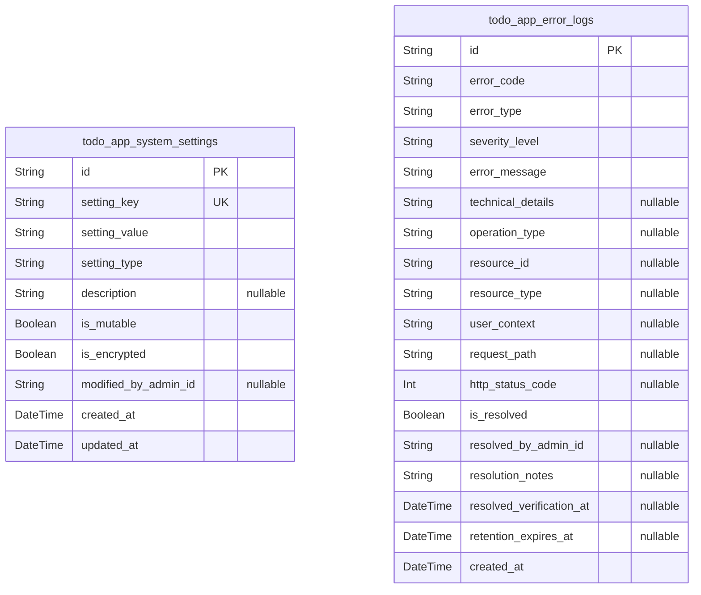
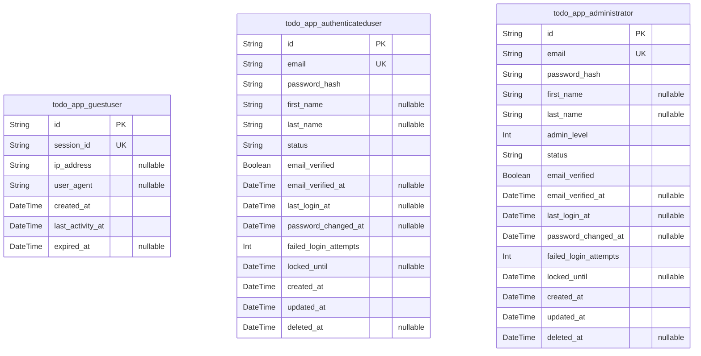
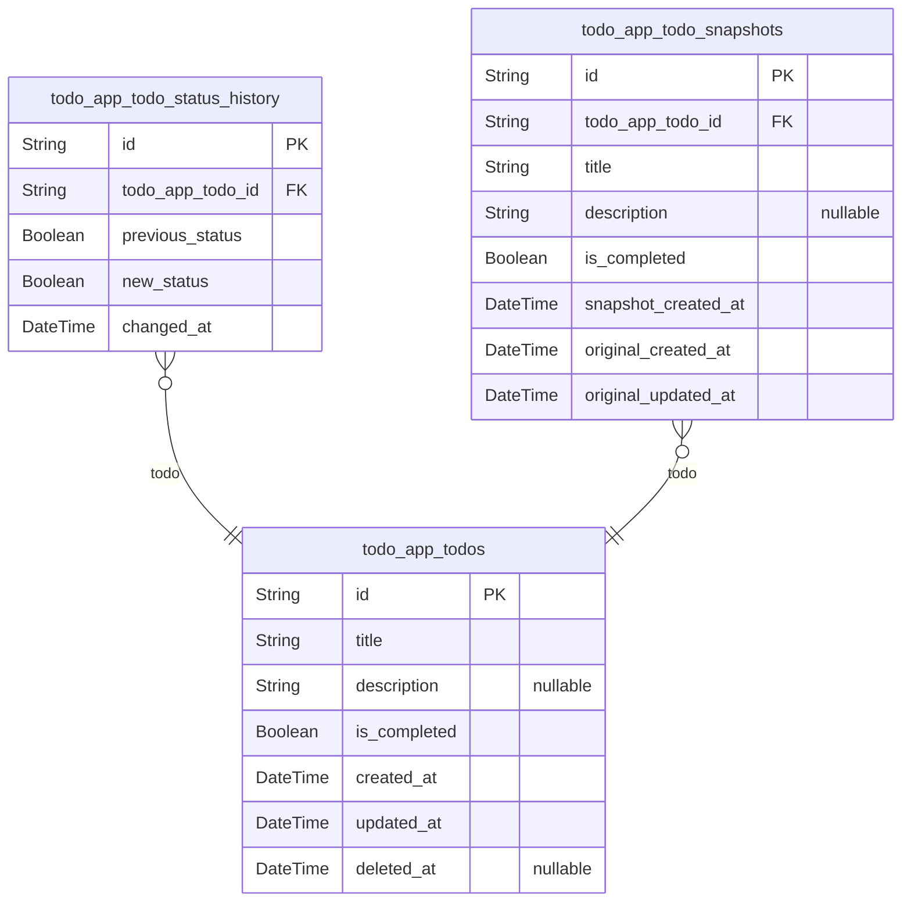
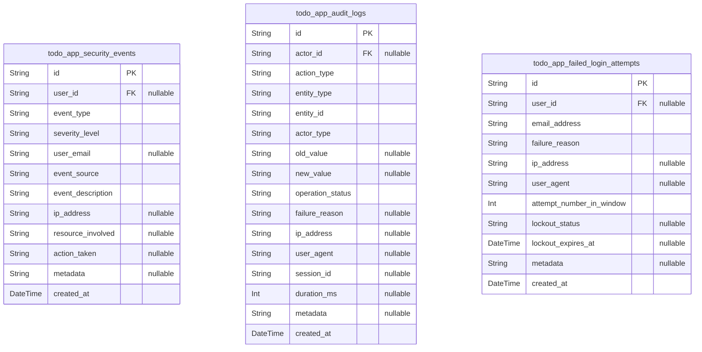

# Prisma Markdown

> Generated by [`prisma-markdown`](https://github.com/samchon/prisma-markdown)

- [Systematic](#systematic)
- [Actors](#actors)
- [Todos](#todos)
- [Audit](#audit)

## Systematic

### `todo_app_system_settings`

System configuration and application settings that control system
behavior and initialization. This table stores key-value configuration
pairs that enable system customization, feature flags, and operational
parameters. Settings are typically set during system initialization and
modified only by administrators through configuration interfaces. These
settings persist across application restarts and sessions, providing
consistent system behavior.

Properties as follows:

- `id`: Primary Key.
- `setting_key`
  > Unique configuration key identifier such as 'max_todos_per_user',
  > 'session_timeout_minutes', 'app_version', 'maintenance_mode_enabled', or
  > 'feature_flag_offline_sync'. This key uniquely identifies each
  > configuration setting.
- `setting_value`
  > Configuration value as string, allowing flexible storage of various data
  > types (numbers, booleans, JSON objects stored as strings). Examples:
  > '1000', 'true', '30', '{"enabled": true}'. Interpretation depends on
  > setting_key context.
- `setting_type`
  > Data type of the setting value to guide interpretation: 'string',
  > 'integer', 'boolean', 'json', 'float'. Helps applications parse setting
  > values correctly without ambiguity.
- `description`
  > Human-readable description explaining the purpose and valid values of
  > this setting. Examples: 'Maximum number of todos allowed per user
  > account', 'Session timeout in minutes before automatic logout',
  > 'Indicates if system is in maintenance mode'. Helps administrators
  > understand settings.
- `is_mutable`
  > Whether this setting can be changed at runtime by administrators. True
  > allows runtime modification; false indicates immutable settings that
  > require system restart to change. Examples: app version is immutable,
  > maintenance mode is mutable.
- `is_encrypted`
  > Whether the setting_value contains sensitive information requiring
  > encryption at rest. True indicates the value should be encrypted; false
  > allows plaintext storage. Examples: true for API keys, false for version
  > numbers.
- `modified_by_admin_id`
  > UUID of the administrator who last modified this setting. Enables audit
  > trail tracking of configuration changes. Required for compliance
  > documentation of who changed system settings and when.
- `created_at`: Timestamp when this configuration setting was first created in the system.
- `updated_at`
  > Timestamp when this configuration setting was last modified. Tracks the
  > most recent change to the setting value or metadata.

### `todo_app_error_logs`

System error and exception logging table capturing all error events,
failures, and exceptional conditions that occur during application
operation. This table records comprehensive error details including error
codes, messages, stack traces, affected resources, user context, and
system state at time of error. Error logs are essential for debugging,
monitoring system health, diagnosing issues, and identifying patterns of
recurring problems. Logs are retained for analysis and compliance
purposes according to data retention policies.

Properties as follows:

- `id`: Primary Key.
- `error_code`
  > Unique error identifier following format TODOAPP-XXXX where XX represents
  > error category (AUTH, VAL, OP, SYS, REC, EDGE) and XX is sequence number.
  > Examples: TODOAPP-VAL-001, TODOAPP-OP-005, TODOAPP-SYS-003. Used for
  > tracking, monitoring, and support reference.
- `error_type`
  > Classification of error type: 'validation', 'authentication',
  > 'authorization', 'database', 'network', 'server', 'storage',
  > 'concurrency', 'data_integrity', 'system'. Enables filtering and analysis
  > of specific error categories.
- `severity_level`
  > Error severity classification: 'critical' (system cannot function),
  > 'high' (operation failed, user action required), 'medium' (operation
  > partially affected, retry possible), 'low' (minor issue, informational).
  > Guides response priority and escalation.
- `error_message`
  > User-friendly error message displayed to end users, non-technical and
  > actionable. Examples: 'Unable to create todo. Please try again.', 'Title
  > cannot be empty. Please enter a title.', 'Connection lost. Check your
  > internet and refresh.' Maximum 500 characters.
- `technical_details`
  > Technical error details for debugging: exception names, stack traces, SQL
  > queries (sanitized), API responses, database errors. Used by developers
  > and system administrators for troubleshooting but never shown to users.
  > Stored as JSON for structured analysis.
- `operation_type`
  > Type of operation that triggered the error: 'create_todo', 'read_todos',
  > 'update_todo', 'delete_todo', 'login', 'register', 'logout',
  > 'database_query', 'file_write', 'network_request'. Identifies which
  > feature/operation failed.
- `resource_id`
  > UUID of the specific resource involved in the error (todo ID, user ID,
  > etc.) if applicable. Enables tracing error to specific record. Null if
  > error is system-level without specific resource.
- `resource_type`
  > Type of resource involved in error: 'todo', 'user', 'session', 'file',
  > 'database', 'network', 'storage'. Identifies what resource caused or was
  > affected by the error. MUST be provided if resource_id is not null.
- `user_context`
  > UUID of the user associated with the error if applicable. Stored as user
  > ID for association with todo_app_authenticateduser. Null for system-level
  > errors. Used to track error frequency per user and user-specific issue
  > patterns.
- `request_path`
  > HTTP request path or API endpoint where error occurred. Examples:
  > '/api/todos', '/api/todos/123', '/auth/login'. Enables tracking which
  > endpoints have error issues.
- `http_status_code`
  > HTTP response status code associated with error: 400 (bad request), 401
  > (unauthorized), 403 (forbidden), 404 (not found), 429 (too many
  > requests), 500 (server error), 503 (service unavailable). Null if not
  > HTTP-based error.
- `is_resolved`
  > Whether this error has been investigated, understood, and resolved
  > (patched). True indicates fix deployed and error should not recur; false
  > indicates active issue requiring attention. Used to track outstanding
  > problems.
- `resolved_by_admin_id`
  > UUID of the administrator who resolved/investigated this error. Enables
  > audit trail tracking of error resolution. Null if error not yet resolved
  > or resolved by automated system.
- `resolution_notes`
  > Administrator notes documenting the investigation, root cause analysis,
  > and fix applied for resolved errors. Examples: 'Caused by database
  > connection timeout. Improved connection retry logic. Deploy to production
  > May 15.', 'User entered invalid email format. Improved validation message
  > clarity.'
- `resolved_verification_at`
  > Timestamp when error resolution was verified/confirmed. Indicates when
  > fix validation was completed. Null if error not yet resolved.
- `retention_expires_at`
  > Timestamp indicating when this error log should be purged according to
  > retention policy. Enables automatic cleanup of old error logs. Set to
  > current_time + retention_period at creation.
- `created_at`
  > Timestamp when the error was first recorded in the system. Essential for
  > error trend analysis, time-based filtering, and retention policy
  > enforcement.

## Actors

### `todo_app_guestuser`

Guest user representation for unauthenticated session tracking. Guests
are temporary visitors to the application without authentication who can
access public pages (registration, login). This entity tracks guest
session information for the duration of their visit without requiring
persistent credential storage. Guest sessions have defined expiration
times and are cleaned up after inactivity.

Properties as follows:

- `id`: Primary Key.
- `session_id`
  > Unique session identifier for tracking guest session across requests.
  > Must be cryptographically random and unique.
- `ip_address`
  > IP address of the guest user for basic tracking and security purposes
  > (optional). Used to detect suspicious access patterns.
- `user_agent`
  > Browser user agent string identifying the guest's browser and device
  > type. Used for device detection and bot prevention.
- `created_at`
  > Timestamp when guest session was created, recorded in UTC timezone. Marks
  > the beginning of guest access.
- `last_activity_at`
  > Timestamp of last guest activity, used to track session idle time for
  > timeout management. Updated on each request.
- `expired_at`
  > Timestamp when guest session expires, allowing cleanup of stale sessions.
  > Set to 24 hours after creation or last activity.

### `todo_app_authenticateduser`

Authenticated user account representing registered users who have
successfully logged in and verified their email. These are the primary
user personas managing personal todo lists. Each authenticated user has
email and password-based credentials with full access to CRUD operations
on their own todos, while being restricted from accessing other users'
data. Users can maintain todo ownership and data isolation enforced
through database relationships.

Properties as follows:

- `id`: Primary Key.
- `email`
  > User email address used for authentication and identification. Must be
  > unique across the system, following RFC 5321 standard format. Used as the
  > primary login identifier.
- `password_hash`
  > Securely hashed password using bcrypt or Argon2 algorithm with unique
  > salt (minimum 10 rounds for bcrypt). Never stored or transmitted in
  > plaintext. Minimum 60 characters to ensure valid hash format.
- `first_name`
  > User's first name for profile display and personalization (optional). Not
  > required for account functionality.
- `last_name`
  > User's last name for profile display and personalization (optional). Not
  > required for account functionality.
- `status`
  > User account status: 'active' for normal operation allowing login and all
  > operations, 'inactive' for disabled accounts preventing login, 'locked'
  > for temporarily locked accounts due to multiple failed login attempts.
- `email_verified`
  > Boolean flag indicating whether user email address has been verified
  > through confirmation link. Defaults to false at registration. Users
  > cannot fully activate account until this is true.
- `email_verified_at`
  > Timestamp when user completed email verification process, enabling full
  > account functionality. Null until verification is completed. Used for
  > compliance audit trails.
- `last_login_at`
  > Timestamp of user's most recent successful login for activity tracking
  > and security monitoring. Null if user has never successfully logged in.
  > Updated on each successful authentication.
- `password_changed_at`
  > Timestamp of last password change for security audit trail and password
  > expiration policies. Null if password never changed since registration.
  > Updated whenever user changes password.
- `failed_login_attempts`
  > Count of consecutive failed login attempts. Reset to zero on successful
  > login. Used to trigger account lockout at 5 attempts within 15 minutes.
- `locked_until`
  > Timestamp until which the account is locked due to multiple failed login
  > attempts. Account unlocks automatically after this time. Null if account
  > is not currently locked.
- `created_at`
  > Timestamp when user account was created during registration process,
  > recorded in UTC timezone. Immutable record of account creation time.
- `updated_at`
  > Timestamp of last account modification (password change, profile update,
  > status change), automatically updated on changes. Used to track most
  > recent modification.
- `deleted_at`
  > Timestamp when user requested account deletion (soft delete), supporting
  > 30-day recovery period before permanent removal. Null for active
  > accounts. Users can recover account within 30 days of deletion.

### `todo_app_administrator`

Administrator user account representing system operators with elevated
privileges for system management, monitoring, and administrative
functions. Administrators have access to system status pages, logs, user
management capabilities, and configuration settings. Unlike authenticated
users, administrators are designated by admin_level field and can access
system-wide information. Administrators also retain full todo management
capabilities for their personal todos while being subject to same
authorization constraints for other users' todos.

Properties as follows:

- `id`: Primary Key.
- `email`
  > Administrator email address for authentication and identification. Must
  > be unique across the system, following RFC 5321 standard format.
- `password_hash`
  > Securely hashed password using bcrypt or Argon2 algorithm with unique
  > salt (minimum 10 rounds for bcrypt). Never stored or transmitted in
  > plaintext. Minimum 60 characters to ensure valid hash format.
- `first_name`
  > Administrator's first name for identification and communication. Optional
  > field for display purposes.
- `last_name`
  > Administrator's last name for identification and communication. Optional
  > field for display purposes.
- `admin_level`
  > Integer 1-5 indicating scope of administrative privileges. Level 5
  > represents full system access with all administrative capabilities. Level
  > 1 represents minimal admin functions. Determines which admin endpoints
  > and functions are accessible.
- `status`
  > Administrator account status: 'active' for normal operation, 'inactive'
  > for disabled administrator accounts, 'suspended' for temporarily
  > suspended admin access. Inactive/suspended administrators cannot access
  > admin endpoints.
- `email_verified`
  > Boolean flag indicating whether administrator email address has been
  > verified through confirmation link. Defaults to false. Admin cannot
  > access system until verified.
- `email_verified_at`
  > Timestamp when administrator completed email verification. Null until
  > verification is completed. Required for admin activation.
- `last_login_at`
  > Timestamp of administrator's most recent successful login for activity
  > tracking and security audit. Null if never logged in. Updated on each
  > successful authentication.
- `password_changed_at`
  > Timestamp of last password change for security audit and compliance with
  > password rotation policies. Null if password never changed. Updated
  > whenever administrator changes password.
- `failed_login_attempts`
  > Count of consecutive failed login attempts. Reset on successful login.
  > Triggers account lockout at 5 attempts within 15 minutes.
- `locked_until`
  > Timestamp until which administrator account is locked due to failed login
  > attempts. Account unlocks automatically after this time. Null if account
  > not currently locked.
- `created_at`
  > Timestamp when administrator account was created, recorded in UTC
  > timezone. Immutable record of account creation.
- `updated_at`
  > Timestamp of last administrator account modification, automatically
  > updated on changes. Used to track most recent modification.
- `deleted_at`
  > Timestamp when administrator account was deleted (soft delete),
  > supporting recovery period before permanent removal. Null for active
  > accounts. Administrators can be recovered within recovery period.

## Todos

### `todo_app_todos`

Primary todo entity representing individual task items. Core business
table for the Todo List Application where users create, read, update, and
delete their personal todos. Each todo is independent, user-owned, and
supports full CRUD operations. Contains essential todo properties: unique
identifier, title/description, completion status, and lifecycle
timestamps.

Properties as follows:

- `id`: Primary Key.
- `title`
  > Todo title or short description of the task. Required field containing
  > 1-255 characters. Stores the user's task description exactly as entered.
- `description`
  > Optional detailed description or notes about the todo. May be empty
  > string. Maximum 2000 characters.
- `is_completed`
  > Completion status of the todo. True indicates completed task, false
  > indicates incomplete task. Defaults to false when todo is created.
- `created_at`
  > Timestamp when the todo was created in UTC timezone. Immutable after
  > creation. Automatically set to current time on todo creation.
- `updated_at`
  > Timestamp when the todo was last modified in UTC timezone. Automatically
  > updated whenever any todo property changes. Initially equals created_at.
- `deleted_at`
  > Timestamp indicating soft deletion. Null for active todos. Set to current
  > time when user deletes a todo. Enables recovery within 30-day window
  > before permanent deletion.

### `todo_app_todo_status_history`

Supporting table tracking status change history for todos. Records each
transition between incomplete and completed states with timestamps.
Enables audit trail capabilities and historical analysis of todo state
changes. Subsidiary entity managed through parent todo operations.

Properties as follows:

- `id`: Primary Key.
- `todo_app_todo_id`
  > Reference to the parent todo's [todo_app_todos.id](#todo_app_todos). Associates this
  > status change history record with the specific todo.
- `previous_status`
  > The completion status before this change. True if was completed, false if
  > was incomplete.
- `new_status`
  > The completion status after this change. True if marked complete, false
  > if marked incomplete.
- `changed_at`
  > Timestamp when the status change occurred in UTC timezone. Immutable
  > record of when transition happened.

### `todo_app_todo_snapshots`

Snapshot table capturing point-in-time states of todos for audit trail
and historical tracking. Records complete todo state (title, description,
status) at specific moments. Implements snapshot pattern for version
control and forensic capability. Each snapshot is immutable and
represents the exact state at creation time.

Properties as follows:

- `id`: Primary Key.
- `todo_app_todo_id`
  > Reference to the original todo's [todo_app_todos.id](#todo_app_todos). Associates
  > this snapshot with the todo it captures.
- `title`
  > Snapshot of todo title at time of capture. Denormalized copy of title
  > from parent todo for historical accuracy.
- `description`
  > Snapshot of todo description at time of capture. Denormalized copy for
  > historical tracking of changes to description.
- `is_completed`
  > Snapshot of completion status at time of capture. Records whether todo
  > was completed or incomplete at snapshot moment.
- `snapshot_created_at`
  > Timestamp when this snapshot was created in UTC timezone. Represents the
  > moment-in-time being captured by this snapshot record.
- `original_created_at`
  > Original creation timestamp from parent todo at snapshot moment.
  > Preserved for historical reference.
- `original_updated_at`
  > Last update timestamp from parent todo at snapshot moment. Shows when
  > parent was last modified.

## Audit

### `todo_app_security_events`

Comprehensive security event log tracking authentication failures,
unauthorized access attempts, permission violations, and suspicious
system activities. Used for real-time security monitoring, threat
detection, and regulatory compliance reporting. Each security event
represents a potential security incident requiring monitoring or
investigation. MODIFIED: Added explicit user_id UUID foreign key
(nullable for system-level events), added user_role field for context,
improved timestamp and event tracking for forensic capability.

Properties as follows:

- `id`: Primary Key.
- `user_id`
  > Reference to the security event actor's {@link
  > todo_app_authenticateduser.id}. Nullable for system-level events that
  > occur without user context (e.g., pre-authentication security checks).
- `event_type`
  > Classification of the security event (e.g., 'AUTHENTICATION_FAILURE',
  > 'UNAUTHORIZED_ACCESS', 'PERMISSION_VIOLATION', 'RATE_LIMIT_EXCEEDED',
  > 'SUSPICIOUS_ACTIVITY', 'DATA_INTEGRITY_VIOLATION'). Enables filtering and
  > analysis of specific threat categories.
- `severity_level`
  > Severity classification of the event ('CRITICAL', 'HIGH', 'MEDIUM',
  > 'LOW'). Used to prioritize security incident response and determine
  > escalation requirements.
- `user_email`
  > Email address associated with the security event for display and
  > reporting purposes. Preserved separately from user_id to support
  > forensics even if user account is deleted.
- `event_source`
  > Origin of the security event (e.g., 'LOGIN_ENDPOINT', 'TODO_API',
  > 'ADMIN_PANEL', 'UNKNOWN'). Identifies which system component generated
  > the security alert.
- `event_description`
  > Detailed description of the security event explaining what triggered the
  > alert. Examples: 'Failed login attempt with invalid credentials', 'User
  > attempted to access unauthorized resource', 'Rate limit exceeded for API
  > calls'.
- `ip_address`
  > IP address from which the security event originated if available. Used
  > for geographic analysis and detection of coordinated attacks from
  > specific sources.
- `resource_involved`
  > Identifier of the resource or todo involved in the security event if
  > applicable (e.g., todo ID, API endpoint). Null for authentication-level
  > events.
- `action_taken`
  > System response to the security event (e.g., 'ACCOUNT_LOCKED',
  > 'REQUEST_BLOCKED', 'THROTTLED', 'LOGGED_ONLY'). Documents what preventive
  > action was executed.
- `metadata`
  > JSON-encoded additional context about the security event (e.g., failed
  > login attempt count, time since last successful login, geographic
  > information). Stored as JSON string for flexible schema.
- `created_at`
  > ISO 8601 UTC timestamp when the security event occurred and was recorded.
  > Used for chronological analysis and correlation with other events.

### `todo_app_audit_logs`

Complete audit trail for all todo operations (create, read, update,
delete) and administrative actions. Provides comprehensive compliance
documentation for GDPR, CCPA, and other regulatory requirements. Every
operation on todos is recorded with complete context for forensic
investigation and compliance reporting. MODIFIED: Added explicit actor_id
UUID foreign key with actor_type discrimination field, improved entity
relationship handling with constraint support.

Properties as follows:

- `id`: Primary Key.
- `actor_id`
  > Reference to the actor performing the action. For user actions,
  > references [todo_app_authenticateduser.id](#todo_app_authenticateduser). For admin actions,
  > references [todo_app_administrator.id](#todo_app_administrator). For system actions, may be
  > null or system identifier.
- `action_type`
  > Type of action performed ('CREATE', 'READ', 'UPDATE', 'DELETE',
  > 'COMPLETE_TOGGLE', 'EXPORT', 'ARCHIVE'). Categorizes what operation was
  > executed on a todo.
- `entity_type`
  > Type of entity affected by the audit action (e.g., 'TODO',
  > 'USER_ACCOUNT', 'ADMIN_SETTING', 'SYSTEM_SETTING'). Identifies what
  > object the action targeted.
- `entity_id`
  > Unique identifier of the entity being audited (e.g., todo ID, user ID,
  > setting ID). Links the audit record to the specific object involved.
  > Combined with entity_type for polymorphic relationship validation.
- `actor_type`
  > Type of actor performing the action ('authenticatedUser',
  > 'administrator', 'system'). Enables proper interpretation of actor_id and
  > supports role-based audit analysis.
- `old_value`
  > Previous value before the action (for UPDATE operations). Stored as JSON
  > or string representation for tracking what changed. Null for CREATE,
  > READ, DELETE operations.
- `new_value`
  > New value after the action (for UPDATE operations). Stored as JSON or
  > string representation showing what the entity became. Null for READ and
  > DELETE operations.
- `operation_status`
  > Success status of the operation ('SUCCESS', 'FAILURE',
  > 'PARTIAL_SUCCESS'). Indicates whether the action completed as intended or
  > encountered errors.
- `failure_reason`
  > Description of why operation failed if status is FAILURE or
  > PARTIAL_SUCCESS. Null for successful operations. Documents the reason for
  > operation failure.
- `ip_address`
  > IP address from which the action was initiated. Used for geographic and
  > security analysis of operation origins.
- `user_agent`
  > HTTP User-Agent string identifying the client/browser used for the
  > action. Useful for detecting automated tools or unusual client types.
- `session_id`
  > Session identifier associated with the action if available. Helps
  > correlate multiple actions from the same session or suspicious session
  > patterns.
- `duration_ms`
  > Time in milliseconds for the operation to complete. Used for performance
  > analysis and detecting anomalously slow operations.
- `metadata`
  > JSON-encoded additional context (e.g., browser details, device
  > fingerprint, request parameters). Provides flexibility for capturing
  > operation-specific details.
- `created_at`
  > ISO 8601 UTC timestamp when the audit log entry was created. Represents
  > when the audited action occurred, used for chronological analysis.

### `todo_app_failed_login_attempts`

Dedicated tracking of failed login attempts for security monitoring and
account protection. Used to detect brute force attacks, implement account
lockout mechanisms, and investigate unauthorized access attempts.
Critical for both real-time threat detection and forensic security
analysis. MODIFIED: Added explicit user_id UUID foreign key for proper
referential integrity, maintains email history for forensics.

Properties as follows:

- `id`: Primary Key.
- `user_id`
  > Reference to the user account's [todo_app_authenticateduser.id](#todo_app_authenticateduser) if
  > login attempt matched an existing account. Null if email address does not
  > exist in system, preserving forensics for non-existent account attacks.
- `email_address`
  > Email address used in the failed login attempt. May be invalid or
  > non-existent, but captures what the attacker tried to use. Preserved for
  > forensic analysis.
- `failure_reason`
  > Reason for login failure ('INVALID_EMAIL', 'INVALID_PASSWORD',
  > 'ACCOUNT_LOCKED', 'ACCOUNT_DISABLED', 'INVALID_MFA'). Categorizes the
  > type of authentication failure.
- `ip_address`
  > IP address from which the login attempt originated. Used for geographic
  > analysis and detection of coordinated brute force attacks from specific
  > sources.
- `user_agent`
  > HTTP User-Agent string from the login attempt. Helps identify automated
  > attacks and unusual client types.
- `attempt_number_in_window`
  > Sequential attempt number within the current time window (e.g., attempt 1
  > of 5 in last 15 minutes). Used to implement and track rate limiting.
- `lockout_status`
  > Current account lockout status ('LOCKED',
  > 'LOCKED_WITH_EMAIL_NOTIFICATION', 'LOCKOUT_TIMER_ACTIVE', null for not
  > locked). Documents any protective actions taken in response to failed
  > attempts.
- `lockout_expires_at`
  > ISO 8601 UTC timestamp when the account lockout expires and login can be
  > retried. Null if account is not currently locked.
- `metadata`
  > JSON-encoded additional context (e.g., geolocation, device fingerprint,
  > referrer, request path). Provides forensic details for security
  > investigation.
- `created_at`
  > ISO 8601 UTC timestamp when the failed login attempt occurred. Used for
  > chronological analysis and rate limiting calculations.
