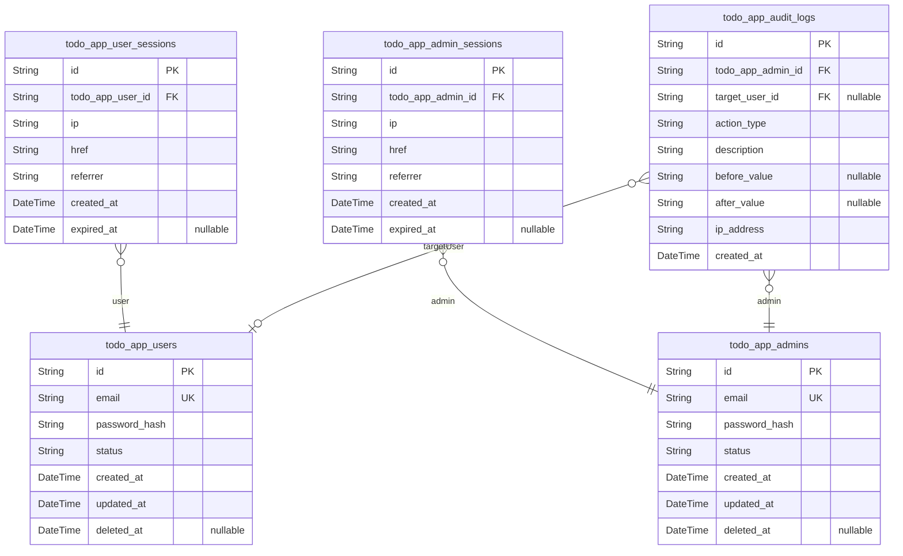
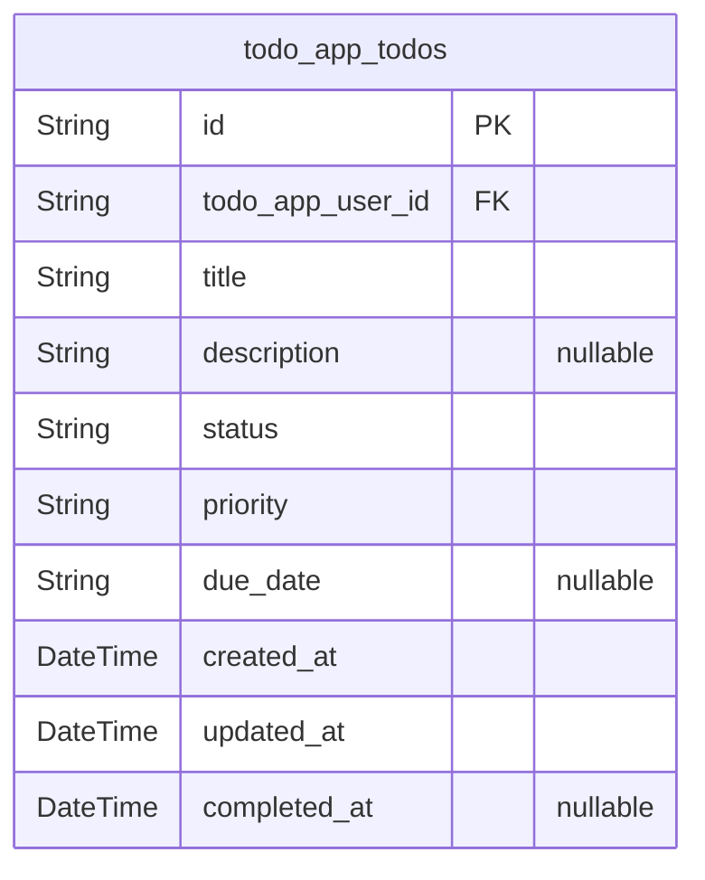

# Prisma Markdown

> Generated by [`prisma-markdown`](https://github.com/samchon/prisma-markdown)

- [Actors](#actors)
- [Todos](#todos)

## Actors

```mermaid
erDiagram
"todo_app_users" {
  String id PK
  String email UK
  String password_hash
  String status
  DateTime created_at
  DateTime updated_at
  DateTime deleted_at "nullable"
}
"todo_app_user_sessions" {
  String id PK
  String todo_app_user_id FK
  String ip
  String href
  String referrer
  DateTime created_at
  DateTime expired_at "nullable"
}
"todo_app_admins" {
  String id PK
  String email UK
  String password_hash
  String status
  DateTime created_at
  DateTime updated_at
  DateTime deleted_at "nullable"
}
"todo_app_admin_sessions" {
  String id PK
  String todo_app_admin_id FK
  String ip
  String href
  String referrer
  DateTime created_at
  DateTime expired_at "nullable"
}
"todo_app_audit_logs" {
  String id PK
  String todo_app_admin_id FK
  String target_user_id FK "nullable"
  String action_type
  String description
  String before_value "nullable"
  String after_value "nullable"
  String ip_address
  DateTime created_at
}
"todo_app_user_sessions" }o--|| "todo_app_users" : user
"todo_app_admin_sessions" }o--|| "todo_app_admins" : admin
"todo_app_audit_logs" }o--|| "todo_app_admins" : admin
"todo_app_audit_logs" }o--o| "todo_app_users" : targetUser
```

### `todo_app_users`

User accounts representing individuals who authenticate and manage their
own todo lists. Each user has unique identity (email), secure password
hash, account status tracking, and temporal audit fields. Users form the
primary identity entity for the application.

Properties as follows:

- `id`: Primary Key.
- `email`
  > User's email address for authentication and communication. Must follow
  > valid email format (RFC 5322). Used as the unique login identifier for
  > the user account.
- `password_hash`
  > Securely hashed password using bcrypt or Argon2. Never stored in
  > plaintext. Used to verify user identity during authentication. Hash is
  > generated server-side from user's plaintext password input.
- `status`
  > Current account status indicating whether user can access the system.
  > Valid values: 'active' (user can log in and access todos), 'inactive'
  > (user cannot log in, data preserved). Defaults to 'active' on account
  > creation.
- `created_at`
  > Timestamp when the user registered and created their account.
  > Automatically set by system at account creation time. Never changes after
  > creation. Stored in UTC timezone.
- `updated_at`
  > Timestamp of the most recent update to any user profile field (excluding
  > session/activity fields). Automatically updated whenever user information
  > changes. Stored in UTC timezone.
- `deleted_at`
  > Timestamp indicating when the user account was deleted (soft delete).
  > NULL means account is active. When set, user cannot log in but data is
  > preserved for audit trail and recovery. Stored in UTC timezone.

### `todo_app_user_sessions`

Session records tracking authenticated user connections. Each session
represents one login session with JWT token references, connection
metadata (IP, device info), and expiration tracking. Enables
session-per-device support and audit trail of user activity. Sessions are
created on successful authentication and invalidated on logout or
expiration.

Properties as follows:

- `id`: Primary Key.
- `todo_app_user_id`
  > Foreign key reference to the authenticated user's {@link
  > todo_app_users.id}. Each session belongs to exactly one user. Multiple
  > concurrent sessions allowed per user.
- `ip`
  > IP address from which the user established this session. Used for
  > security monitoring, tracking login locations, and audit purposes.
  > Example: '192.168.1.100' or '2001:db8::1'.
- `href`
  > Connection URL / request URL when the session was established. Captures
  > the entry point for the session and referrer context.
- `referrer`
  > Referrer URL indicating the previous page or application that led to this
  > session creation. Used for tracking traffic sources and user journey
  > analysis.
- `created_at`
  > Timestamp when the session was established after successful user
  > authentication. Automatically set when user logs in. Stored in UTC
  > timezone.
- `expired_at`
  > Timestamp when the session expires or was explicitly terminated by user
  > logout. NULL indicates session is still active. When set, user must
  > re-authenticate to continue using the application. Stored in UTC
  > timezone.

### `todo_app_admins`

Administrator accounts representing system operators with elevated
permissions. Admins manage user accounts, monitor system health, access
audit logs, and perform administrative maintenance. Separate from regular
users table to enforce distinct admin role and permission structure. Each
admin authenticates with email and password, tracked independently from
regular users.

Properties as follows:

- `id`: Primary Key.
- `email`
  > Admin's email address for authentication and administrative
  > communication. Must follow valid email format. Unique across admin
  > accounts. Used as the login identifier for admin authentication.
- `password_hash`
  > Securely hashed admin password using bcrypt or Argon2. Never stored in
  > plaintext. Used to verify admin identity during authentication. Generated
  > server-side from admin's plaintext password input.
- `status`
  > Current admin account status. Valid values: 'active' (admin can log in
  > and perform operations), 'inactive' (admin cannot log in). Controls
  > whether admin can access the system.
- `created_at`
  > Timestamp when the admin account was created. Automatically set by
  > system. Never changes after account creation. Stored in UTC timezone.
- `updated_at`
  > Timestamp of the most recent update to admin profile information.
  > Automatically updated when admin data changes. Stored in UTC timezone.
- `deleted_at`
  > Timestamp when the admin account was deleted (soft delete). NULL
  > indicates active account. When set, admin cannot log in but account data
  > preserved for audit trail. Stored in UTC timezone.

### `todo_app_admin_sessions`

Session records tracking authenticated admin connections and JWT token
sessions. Each session represents one admin login with shorter timeout
(15 minutes inactivity) than regular user sessions for enhanced security.
Tracks connection metadata (IP, referrer) for admin action audit trail.
Sessions created on successful admin authentication and invalidated on
logout or expiration.

Properties as follows:

- `id`: Primary Key.
- `todo_app_admin_id`
  > Foreign key reference to the authenticated admin's {@link
  > todo_app_admins.id}. Each session belongs to exactly one admin. Multiple
  > concurrent sessions allowed per admin.
- `ip`
  > IP address from which the admin established this session. Used for
  > security monitoring, tracking admin login locations, and audit trail of
  > admin access points.
- `href`
  > Connection URL when the admin session was established. Captures the entry
  > point for the admin session.
- `referrer`
  > Referrer URL indicating the source that led to this admin session
  > creation. Used for tracking admin access sources.
- `created_at`
  > Timestamp when the admin session was established after successful
  > authentication. Automatically set when admin logs in. Stored in UTC
  > timezone.
- `expired_at`
  > Timestamp when the session expires or was explicitly terminated by admin
  > logout. NULL indicates session is still active. Admin sessions expire
  > after 15 minutes of inactivity for security. Stored in UTC timezone.

### `todo_app_audit_logs`

Immutable audit trail recording all administrative actions for security,
compliance, and accountability. Each log entry captures what admin
performed what action, on what resource, when, and from where.
Append-only table - entries never modified or deleted. Used for security
monitoring, compliance reporting, investigating security incidents, and
tracking admin accountability per requirements in 07-admin-features.md.

Properties as follows:

- `id`: Primary Key.
- `todo_app_admin_id`
  > Foreign key reference to the admin who performed the action. {@link
  > todo_app_admins.id}. Links audit entry to the specific admin responsible
  > for the action.
- `target_user_id`
  > Foreign key reference to the user affected by the admin action (if
  > applicable). [todo_app_users.id](#todo_app_users). NULL if action doesn't target a
  > specific user (e.g., system configuration changes). Example: User ID of
  > deleted user account.
- `action_type`
  > Type of administrative action performed. Examples: 'user_created',
  > 'user_deleted', 'user_status_changed', 'password_reset',
  > 'config_updated', 'backup_initiated'. Enables filtering audit logs by
  > action category.
- `description`
  > Detailed description of the action performed. Captures contextual
  > information about what the admin did and why. Example: 'User account
  > suspended due to security violation' or 'System configuration updated:
  > session timeout changed from 30 to 15 minutes'.
- `before_value`
  > Previous value of the modified field (for update actions). Captured
  > before the change was applied. NULL for create or delete actions. Enables
  > tracking exactly what changed.
- `after_value`
  > New value of the modified field (for update actions). Captured after the
  > change was applied. NULL for delete actions. Enables tracking the new
  > state after admin action.
- `ip_address`
  > IP address from which the admin performed the action. Used for tracking
  > admin activity location and detecting suspicious access patterns.
- `created_at`
  > Timestamp when the action was performed. Automatically set by system when
  > audit log entry is created. Stored in UTC timezone for accurate timeline
  > of admin actions.

## Todos

```mermaid
erDiagram
"todo_app_todos" {
  String id PK
  String todo_app_user_id FK
  String title
  String description "nullable"
  String status
  String priority
  String due_date "nullable"
  DateTime created_at
  DateTime updated_at
  DateTime completed_at "nullable"
}
```

### `todo_app_todos`

Core todo item entity representing individual tasks managed by users.
Each todo belongs exclusively to one user and tracks the complete
lifecycle from creation through completion. Todos contain required
properties (title, status) and optional properties (description,
priority, due_date). Timestamps track creation, modification, and
completion events. This entity is the central business object enabling
users to capture, organize, and track their work.

Properties as follows:

- `id`: Primary Key.
- `todo_app_user_id`
  > Owner user's [todo_app_users.id](#todo_app_users). Establishes one-to-many
  > relationship where each todo belongs to exactly one user and user can
  > have many todos.
- `title`
  > Required todo title/description that identifies what the user needs to
  > do. Maximum 255 characters, must be non-empty. Primary identifier for the
  > todo from user perspective.
- `description`
  > Optional detailed information and context about the todo. Additional
  > notes beyond the title. Maximum 2000 characters. Can be empty if user
  > does not provide additional details.
- `status`
  > Current state of the todo. Only two valid values: 'active' for incomplete
  > todos, 'completed' for finished todos. Defaults to 'active' when created.
  > Determines visibility in active vs completed todo lists.
- `priority`
  > Optional importance level of the todo. Valid values: 'low', 'medium',
  > 'high'. Defaults to 'medium' if not specified by user. Helps users
  > prioritize their work.
- `due_date`
  > Optional target completion date for the todo in ISO 8601 format
  > (YYYY-MM-DD). Must not be in the past. If provided, helps users manage
  > deadlines. Can be null when no specific deadline exists.
- `created_at`
  > System-generated timestamp in UTC when the todo was created. Immutable
  > after creation, never changes. Records when user captured the task.
- `updated_at`
  > System-generated timestamp in UTC of the most recent modification.
  > Updated every time any field of the todo changes. Enables tracking of
  > recent activity and recency sorting.
- `completed_at`
  > System-generated timestamp in UTC when the todo was marked as completed.
  > Only populated when status is 'completed'. Automatically cleared when
  > status changes back to 'active'. Records when user finished the task.
