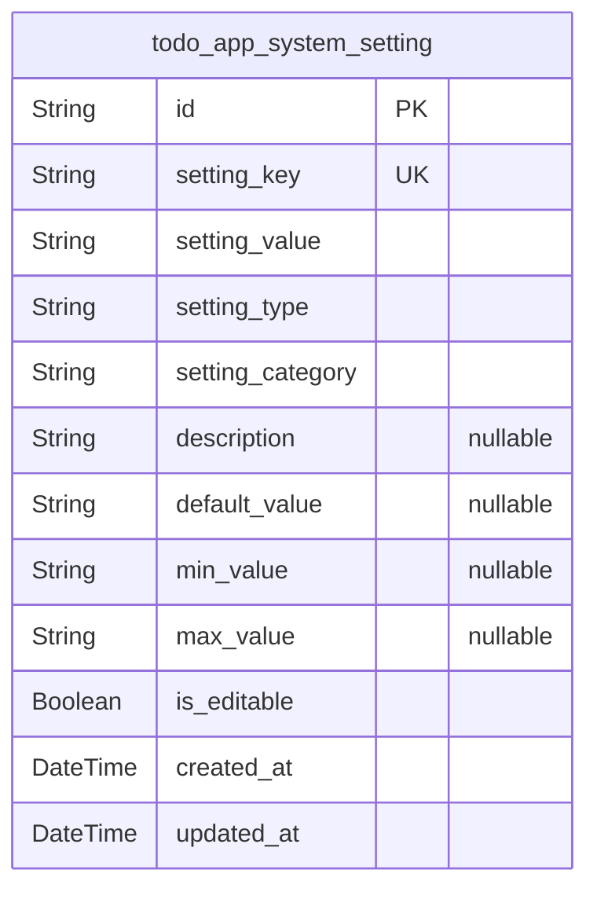
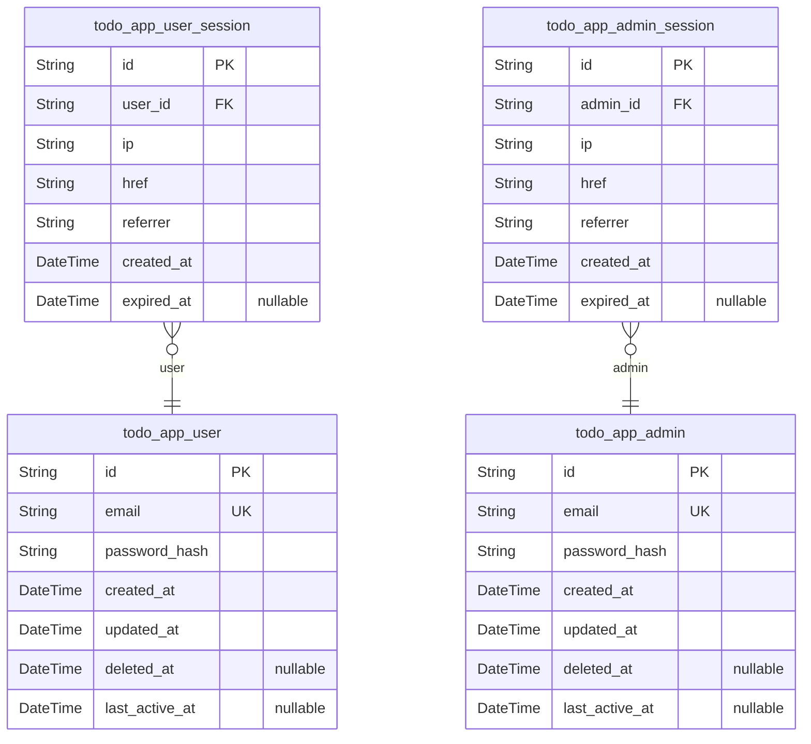
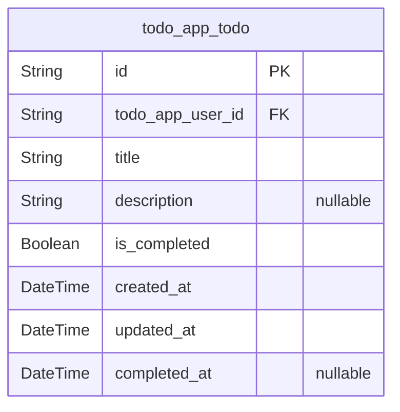
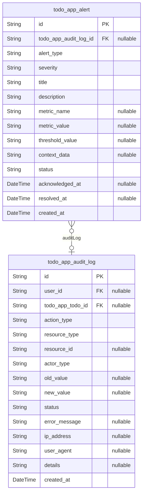

# Prisma Markdown

> Generated by [`prisma-markdown`](https://github.com/samchon/prisma-markdown)

- [Systematic](#systematic)
- [Actors](#actors)
- [Todos](#todos)
- [Audit](#audit)

## Systematic

```mermaid
erDiagram
"todo_app_system_setting" {
  String id PK
  String setting_key UK
  String setting_value
  String setting_type
  String setting_category
  String description "nullable"
  String default_value "nullable"
  String min_value "nullable"
  String max_value "nullable"
  Boolean is_editable
  DateTime created_at
  DateTime updated_at
}
```

### `todo_app_system_setting`

System-wide configuration settings that govern application behavior and
operational constraints.

This table stores all configurable parameters that administrators use to
tune system behavior, including authentication timeouts, password
policies, rate limits, data retention policies, and performance settings.

System administrators modify these settings to control how the
application operates. All system components read these settings to
determine behavior. Settings are updated infrequently (typically during
deployment or exceptional circumstances), and changes apply system-wide
to all users.

Each setting is identified by a unique configuration key and stores its
current value along with metadata about the setting type and description
for administrative documentation.

Properties as follows:

- `id`: Primary Key.
- `setting_key`
  > Unique identifier for this configuration setting. Examples:
  > session_timeout_minutes, password_min_length, max_todos_per_user,
  > account_lockout_minutes, failed_login_attempts_limit. Used to retrieve
  > specific settings by name.
- `setting_value`
  > Current value of the setting as a string. Must be parsed to appropriate
  > type (integer, boolean, etc.) by application code. Examples: "30" for
  > session timeout, "10000" for max todos, "true" for email notifications
  > enabled.
- `setting_type`
  > Data type of this setting value. Valid values: "integer", "string",
  > "boolean", "decimal". Indicates how to interpret and validate the
  > setting_value. Guides UI components on how to present the setting for
  > editing.
- `setting_category`
  > Category grouping for related settings. Valid values: "authentication",
  > "password_policy", "data_management", "email_notification",
  > "rate_limiting", "performance". Used for organizing settings in
  > administrative interface.
- `description`
  > Human-readable description of what this setting controls and its business
  > purpose. Displayed in admin interface to help administrators understand
  > each setting. Example: "Maximum number of minutes a user session remains
  > valid after inactivity."
- `default_value`
  > The default value for this setting as defined during system
  > initialization. Allows admins to reset settings to original defaults.
  > Used when deploying new settings versions.
- `min_value`
  > For numeric settings, the minimum acceptable value. Used for validation
  > when admins attempt to modify settings. Prevents setting invalid values
  > (e.g., negative session timeouts).
- `max_value`
  > For numeric settings, the maximum acceptable value. Used for validation
  > when admins attempt to modify settings. Prevents setting excessive values
  > that could harm system performance.
- `is_editable`
  > Whether this setting can be edited by administrators. True for most
  > settings; false for critical settings that should not be modified after
  > system initialization (e.g., fundamental system identifiers). Determines
  > whether setting appears as editable in admin interface.
- `created_at`
  > Timestamp when this setting was first created, in ISO 8601 format, UTC
  > timezone. Represents when the setting was first added to the system
  > configuration.
- `updated_at`
  > Timestamp of the most recent modification to this setting's value.
  > Updates each time an administrator changes the setting_value. Used to
  > track when settings were last modified.

## Actors

```mermaid
erDiagram
"todo_app_user" {
  String id PK
  String email UK
  String password_hash
  DateTime created_at
  DateTime updated_at
  DateTime deleted_at "nullable"
  DateTime last_active_at "nullable"
}
"todo_app_user_session" {
  String id PK
  String user_id FK
  String ip
  String href
  String referrer
  DateTime created_at
  DateTime expired_at "nullable"
}
"todo_app_admin" {
  String id PK
  String email UK
  String password_hash
  DateTime created_at
  DateTime updated_at
  DateTime deleted_at "nullable"
  DateTime last_active_at "nullable"
}
"todo_app_admin_session" {
  String id PK
  String admin_id FK
  String ip
  String href
  String referrer
  DateTime created_at
  DateTime expired_at "nullable"
}
"todo_app_user_session" }o--|| "todo_app_user" : user
"todo_app_admin_session" }o--|| "todo_app_admin" : admin
```

### `todo_app_user`

Regular user accounts for personal todo management. Stores authentication
credentials, profile information, and account metadata for users who can
create and manage their own todo items. Each user maintains a completely
private, isolated todo list that no other user can access.

Properties as follows:

- `id`: Primary Key.
- `email`
  > User's email address used for authentication and account recovery. Must
  > be in valid email format and unique across all user accounts. This is the
  > primary login identifier.
- `password_hash`
  > Encrypted password hash using bcrypt with salt rounds >= 12. Passwords
  > are never stored in plain text. The hash includes the salt and algorithm
  > metadata.
- `created_at`
  > User account creation timestamp in UTC. This value is immutable and
  > records when the user first registered.
- `updated_at`
  > Last modification timestamp. Updated whenever user profile information or
  > password is changed. Enables tracking of account activity.
- `deleted_at`
  > Soft deletion timestamp. If null, the account is active. If set, the
  > account is marked for deletion but data is retained for compliance and
  > potential recovery within retention period.
- `last_active_at`
  > Timestamp of the user's most recent activity (login or API request).
  > Updated with each authenticated request. Used to identify inactive
  > accounts for monitoring and engagement analysis.

### `todo_app_user_session`

Authentication sessions for regular users. Records active login sessions
with connection metadata and timing information. Each session represents
an authenticated connection from a specific device or browser, enabling
multi-device login support and session management.

Properties as follows:

- `id`: Primary Key.
- `user_id`
  > Foreign key referencing the user who owns this session. Links this
  > authentication session to a specific user account. {@link
  > todo_app_user.id}
- `ip`
  > Client IP address where the session was initiated. Used for security
  > monitoring and detecting suspicious login patterns from unusual
  > locations.
- `href`
  > Connection URL (referrer or entry point URL). Records what page or
  > endpoint was accessed when the session was established. Useful for
  > understanding user entry patterns.
- `referrer`
  > HTTP Referrer header or source that led to the connection. May indicate
  > if user came from bookmark, search, external link, or direct access.
- `created_at`
  > Session creation timestamp when user successfully authenticated. Recorded
  > in UTC. Used to calculate session age and enforce timeout policies.
- `expired_at`
  > Session expiration or logout timestamp. If null, the session is still
  > active. If set, indicates when the session ended (either by user logout
  > or automatic expiration).

### `todo_app_admin`

Administrator accounts with elevated system-wide permissions. Separate
from regular users to maintain clear permission boundaries. Admins can
manage user accounts, view system statistics, access audit logs, and
configure system settings. Admin data follows same security practices as
user accounts.

Properties as follows:

- `id`: Primary Key.
- `email`
  > Admin's email address used for authentication and system notifications.
  > Must be in valid email format and unique across all admin accounts. This
  > is the primary login identifier for admin panel access.
- `password_hash`
  > Encrypted password hash using bcrypt with salt rounds >= 12. Passwords
  > are never stored in plain text. The hash includes the salt and algorithm
  > metadata.
- `created_at`
  > Admin account creation timestamp in UTC. This value is immutable and
  > records when the admin account was first created by system operator.
- `updated_at`
  > Last modification timestamp. Updated whenever admin profile information
  > or password is changed. Enables tracking of account modifications.
- `deleted_at`
  > Soft deletion timestamp. If null, the account is active. If set, the
  > admin account is marked for deletion but data is retained for audit trail
  > and compliance purposes.
- `last_active_at`
  > Timestamp of the admin's most recent activity (login or API request).
  > Updated with each authenticated request. Used to monitor admin activity
  > and identify inactive admin accounts.

### `todo_app_admin_session`

Authentication sessions for administrators. Records active admin login
sessions with connection metadata and timing. Each session represents an
authenticated admin connection, enabling admin multi-device access and
comprehensive session tracking for security auditing.

Properties as follows:

- `id`: Primary Key.
- `admin_id`
  > Foreign key referencing the admin who owns this session. Links this
  > authentication session to a specific admin account. {@link
  > todo_app_admin.id}
- `ip`
  > Client IP address where the session was initiated. Used for security
  > monitoring, audit trail, and detecting unauthorized admin access attempts
  > from unexpected locations.
- `href`
  > Connection URL (entry point URL). Records what endpoint was accessed when
  > the admin session was established. Useful for understanding admin panel
  > access patterns.
- `referrer`
  > HTTP Referrer header or source that led to the admin connection. May
  > indicate internal navigation or external access to admin panel.
- `created_at`
  > Session creation timestamp when admin successfully authenticated.
  > Recorded in UTC. Used to track when admin panel access occurred and
  > enforce session timeout policies.
- `expired_at`
  > Session expiration or logout timestamp. If null, the session is still
  > active. If set, indicates when the admin session ended (by logout or
  > automatic expiration after inactivity).

## Todos

```mermaid
erDiagram
"todo_app_todo" {
  String id PK
  String todo_app_user_id FK
  String title
  String description "nullable"
  Boolean is_completed
  DateTime created_at
  DateTime updated_at
  DateTime completed_at "nullable"
}
```

### `todo_app_todo`

Individual todo items representing tasks and action items on a user's
personal todo list.

Each todo item is owned by exactly one user and contains all information
needed to track a personal task including its description, completion
status, and temporal tracking. Todo items are the core business entities
that deliver value to users by enabling personal task management.

Users can create multiple todos, view their complete list, edit todo
details (title and description), mark todos as complete or incomplete to
track progress, and delete todos when no longer needed. Each todo
maintains an immutable creation timestamp, tracks the most recent
modification time, and records when the user marked it as completed.

Properties as follows:

- `id`: Primary Key.
- `todo_app_user_id`
  > The user who owns this todo item. Every todo belongs to exactly one user.
  > User's [todo_app_user.id](#todo_app_user).
- `title`
  > The main task description or title of the todo item. Required for every
  > todo item. Minimum 1 character, maximum 255 characters. The primary
  > information users see when viewing their todo list.
- `description`
  > Optional additional details or context about the todo item. Provides
  > space for expanded task information beyond the title. Maximum 2000
  > characters. Can be empty or null if no additional details are provided.
- `is_completed`
  > Whether this todo item has been marked as complete. True indicates the
  > task is marked finished, false indicates the task is still incomplete.
  > Defaults to false when todo is created.
- `created_at`
  > The date and time when this todo item was created. Set automatically by
  > the system and never changes. Used for chronological ordering and
  > establishing when the task was first captured.
- `updated_at`
  > The date and time when this todo item was last modified. Updates whenever
  > the todo's title, description, or completion status changes. Tracks the
  > most recent change to the todo.
- `completed_at`
  > The date and time when the user marked this todo as completed. Only set
  > when is_completed is true. Cleared (set to null) if user marks a
  > completed todo as incomplete again. Null if todo has never been marked
  > complete.

## Audit

```mermaid
erDiagram
"todo_app_audit_log" {
  String id PK
  String user_id FK "nullable"
  String todo_app_todo_id FK "nullable"
  String action_type
  String resource_type
  String resource_id "nullable"
  String actor_type
  String old_value "nullable"
  String new_value "nullable"
  String status
  String error_message "nullable"
  String ip_address "nullable"
  String user_agent "nullable"
  String details "nullable"
  DateTime created_at
}
"todo_app_alert" {
  String id PK
  String todo_app_audit_log_id FK "nullable"
  String alert_type
  String severity
  String title
  String description
  String metric_name "nullable"
  String metric_value "nullable"
  String threshold_value "nullable"
  String context_data "nullable"
  String status
  DateTime acknowledged_at "nullable"
  DateTime resolved_at "nullable"
  DateTime created_at
}
"todo_app_alert" }o--o| "todo_app_audit_log" : auditLog
```

### `todo_app_audit_log`

Immutable audit trail recording all significant system events for
security, compliance, and troubleshooting purposes.

Captures comprehensive records of authentication events (login, logout,
password changes), user account operations (registration, deletion), todo
item management (create, update, complete, delete), admin actions (user
management, settings changes), and security incidents (failed
authentication, unauthorized access attempts).

Each audit log entry records exactly what happened, who performed the
action, when it occurred, where it originated from (IP address), the
outcome, and any relevant error information. Audit logs are immutable -
once created, they cannot be modified or deleted during their retention
period, ensuring the integrity of the audit trail.

These records serve as the definitive source of truth for system activity
and enable administrators to investigate security incidents, trace data
modifications, verify compliance with policies, and troubleshoot system
issues.

Properties as follows:

- `id`: Primary Key.
- `user_id`
  > ID of the user who performed the action. Foreign key referencing {@link
  > todo_app_user.id}. Null for system-level events or unauthenticated
  > operations.
- `todo_app_todo_id`
  > ID of the todo item affected by the action (if applicable). Foreign key
  > referencing [todo_app_todo.id](#todo_app_todo). Null for non-todo-related events.
- `action_type`
  > The specific type of action performed. Examples: 'user_registration',
  > 'user_login', 'user_logout', 'password_change', 'password_reset',
  > 'todo_created', 'todo_updated', 'todo_deleted', 'todo_marked_complete',
  > 'todo_marked_incomplete', 'user_account_status_changed',
  > 'user_account_deleted', 'admin_password_reset',
  > 'unauthorized_access_attempt'.
- `resource_type`
  > The type of resource affected by the action. Examples: 'user', 'todo',
  > 'authentication', 'system_config', 'account', 'session'.
- `resource_id`
  > The unique identifier of the specific resource affected. For todo-related
  > events, this is the todo ID. For user-related events, this is the user
  > ID. For other events, this identifies the specific resource.
- `actor_type`
  > The type of actor who performed the action. Values: 'user' (regular
  > user), 'admin' (administrator), 'system' (automated system action).
- `old_value`
  > For update operations, the previous value before the change. Stored as
  > JSON string for complex objects. Null for create or delete operations.
- `new_value`
  > For create or update operations, the new value after the change. Stored
  > as JSON string for complex objects. Null for delete operations.
- `status`
  > The result of the action. Values: 'success' (action completed
  > successfully), 'failure' (action failed), 'partial' (action partially
  > completed).
- `error_message`
  > If the action failed, description of the error that occurred. Null if
  > status is 'success'. Should not contain sensitive information like
  > passwords or tokens.
- `ip_address`
  > The IP address from which the action was initiated. Used for security
  > analysis and identifying patterns of suspicious activity.
- `user_agent`
  > Browser and client information from the request User-Agent header. Helps
  > identify the type of client application making the request.
- `details`
  > Additional contextual information about the action. Examples: bulk
  > operation details, number of items affected, reason for admin action.
  > Stored as JSON for complex data.
- `created_at`
  > The exact timestamp when the audit log entry was created, recorded in
  > UTC. This timestamp is set automatically and represents the precise
  > moment the event occurred.

### `todo_app_alert`

System alerts tracking anomalies, threshold violations, and conditions
requiring administrator attention.

Monitors system health and detects suspicious patterns such as high
failure rates, unusual access patterns, resource utilization thresholds,
and security-related anomalies. Each alert record documents the condition
detected, its severity level, when it was triggered, and the underlying
metrics or audit entries that prompted the alert.

Alerts are derived from audit logs and system monitoring and serve to
notify administrators of issues requiring investigation or intervention.
Alert records are retained for historical trend analysis and incident
investigation, allowing administrators to correlate multiple alerts to
identify systemic issues or attack patterns.

Alerts support severity levels (info, warning, critical) to help
administrators prioritize investigation and response efforts. The alert
system enables proactive system management by detecting problems early
before they impact users.

Properties as follows:

- `id`: Primary Key.
- `todo_app_audit_log_id`
  > Optional reference to the audit log entry that triggered this alert.
  > Foreign key referencing [todo_app_audit_log.id](#todo_app_audit_log). Null for alerts
  > generated from system metrics rather than specific events.
- `alert_type`
  > The category or classification of the alert. Examples:
  > 'high_failed_logins', 'rate_limit_exceeded', 'bulk_user_deletion',
  > 'high_api_error_rate', 'unusual_data_access',
  > 'system_performance_degradation', 'concurrent_login_anomaly',
  > 'brute_force_attempt_detected'.
- `severity`
  > The severity level indicating how serious the alert is. Values: 'info'
  > (informational), 'warning' (requires attention), 'critical' (immediate
  > action required).
- `title`
  > Short descriptive title of the alert. Examples: 'High failed login rate
  > detected', 'API error rate above threshold', 'Unusual bulk deletion
  > activity'.
- `description`
  > Detailed description of the alert condition, including specific metrics,
  > thresholds, and context. Examples: 'Failed login attempts: 25 from 5
  > different IPs in 30 minutes', 'Error rate: 12% (threshold: 5%)'.
- `metric_name`
  > The specific metric or condition that triggered the alert. Examples:
  > 'failed_login_count', 'api_error_rate', 'cpu_utilization',
  > 'db_connection_pool_usage'.
- `metric_value`
  > The actual value of the metric that exceeded the threshold. Stored as
  > string to accommodate various data types. Examples: '25', '12%', '85'.
- `threshold_value`
  > The threshold value that was exceeded, triggering the alert. Stored as
  > string for flexibility. Examples: '10', '5%', '80'.
- `context_data`
  > Additional context or metadata related to the alert, stored as JSON.
  > Examples: IP addresses involved, user IDs affected, system component
  > names, resource details.
- `status`
  > The current state of the alert. Values: 'open' (alert still
  > active/unresolved), 'acknowledged' (admin has seen it), 'resolved' (issue
  > has been addressed).
- `acknowledged_at`
  > Timestamp when an administrator acknowledged the alert. Null until the
  > alert is acknowledged.
- `resolved_at`
  > Timestamp when the alert condition was resolved or the alert was closed.
  > Null until the alert is resolved.
- `created_at`: Timestamp when the alert was generated, recorded in UTC.
