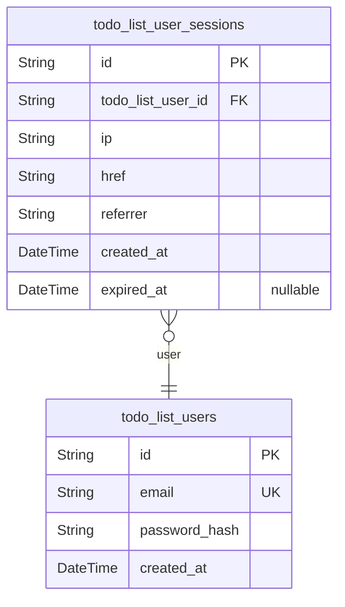
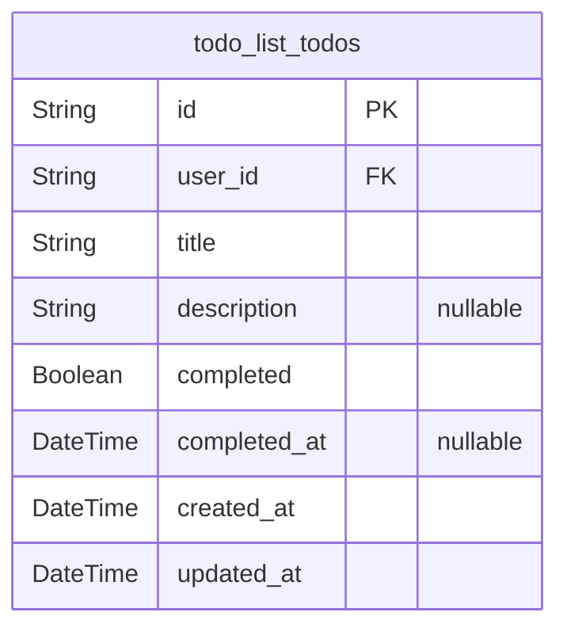

# Prisma Markdown

> Generated by [`prisma-markdown`](https://github.com/samchon/prisma-markdown)

- [Actors](#actors)
- [Todos](#todos)

## Actors

```mermaid
erDiagram
"todo_list_users" {
  String id PK
  String email UK
  String password_hash
  DateTime created_at
}
"todo_list_user_sessions" {
  String id PK
  String todo_list_user_id FK
  String ip
  String href
  String referrer
  DateTime created_at
  DateTime expired_at "nullable"
}
"todo_list_user_sessions" }o--|| "todo_list_users" : user
```

### `todo_list_users`

User accounts with unique email-based authentication.

Represents the sole actor type for the Todo List application. Each record
stores the credentials and identity required for exclusive user ownership
of todo items. Email serves as the unique business identifier for
authentication and communication.

Password hashes implement security best practices; plain text passwords
are never stored. Users may have multiple concurrent sessions, tracked
separately in 'todo_list_user_sessions'.

This model is only referenced by its own authentication and relationship
flows; no business data or soft deletion are present.

Properties as follows:

- `id`: Primary Key.
- `email`
  > User's email address for authentication and account identification. Must
  > be unique across all users; used as the primary business login field.
- `password_hash`
  > Secure hash of the user's password for credential verification. Never
  > stores raw or unhashed passwords; required for all authentication flows.
- `created_at`: Timestamp for when the user account was created.

### `todo_list_user_sessions`

Session records for authenticated user logins.

Stores each session created when a user logs in, supporting secure,
auditable session invalidation and tracking. Each record details when and
from where the user accessed the service, associated with the parent user
account. Multiple concurrent sessions per user are supported for
multi-device access.

Follows canonical session-fields pattern: IP address, referrer, and
connecting URL are required for every session. Session conclusion is
tracked via the 'expired_at' field. No other fields (token, device, user
agent, etc.) are present for strict compliance.

Deletion of a session immediately invalidates its record; no soft delete
or restoration mechanism exists. This table is managed exclusively
through authentication flows and referenced only by user ID foreign key.

Properties as follows:

- `id`: Primary Key.
- `todo_list_user_id`
  > References the owning user account for this session. Ensures auditability
  > and precise relationship between session and principal actor. {@link
  > todo_list_users.id}.
- `ip`
  > IP address from which the session originated. Provides context for
  > session security auditing and suspicious login detection.
- `href`
  > Full URL at which this session was initiated. Used for audit trail and
  > debugging session issues.
- `referrer`
  > Referrer URL indicating where the session started, if available;
  > otherwise records the login screen URL.
- `created_at`: Timestamp for when the session was created.
- `expired_at`
  > Timestamp when the session ended or expired. Nullable for active
  > sessions; set when explicit logout or session expiration occurs.

## Todos

```mermaid
erDiagram
"todo_list_todos" {
  String id PK
  String user_id FK
  String title
  String description "nullable"
  Boolean completed
  DateTime completed_at "nullable"
  DateTime created_at
  DateTime updated_at
}
```

### `todo_list_todos`

Main business entity representing a single todo item owned by a user.

This table stores the minimal, per-user todo tasks that implement the
entire business workflow for the application. Each row represents a
private task created by one authenticated user and is uniquely identified
by a UUID-based primary key. The model enforces strict user ownership via
a foreign key reference to the users table (todo_list_users), supporting
fast queries and guaranteeing data isolation required by business rules.

Todos include a required title, an optional description, a boolean
completion flag, and an optional completion timestamp (set only when
marked complete). Creation and last-modified audit timestamps are
included to support ordering, filtering, and user audit transparency.
Business logic around quotas, validation, and user-only access is
expected to be handled at the application layer in conjunction with these
schema constraints. No soft deletion is supported—deletion is always
permanent by business mandate. This model implements all production
requirements for the MVP todo management domain.

Properties as follows:

- `id`: Primary Key for unique identification of each todo item.
- `user_id`
  > Reference to the owning user. Enforces strict data isolation; each todo
  > belongs to exactly one user. [todo_list_users.id](#todo_list_users).
- `title`
  > Required, user-defined short label for the todo item. Must be non-empty
  > and a maximum of 255 characters. Used for listing and main
  > identification.
- `description`
  > Optional detailed text field for the todo's additional context. Allows up
  > to 1000 characters; may be null if no detail is provided.
- `completed`
  > Boolean status indicating whether the todo is marked complete by the
  > user. Defaults to false on creation; set true when completed.
- `completed_at`
  > Timestamp for when the todo was marked as complete. Null if todo is not
  > completed; set only at moment of completion.
- `created_at`
  > Timestamp when the todo item was first created. Used for sorting and
  > audit trails.
- `updated_at`
  > Timestamp of the most recent update to the todo. Updated on any
  > modification, including changes to title, description, or completed
  > status.
