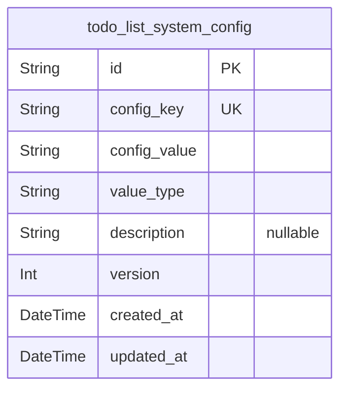
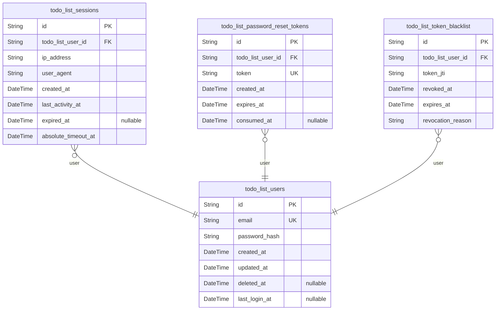
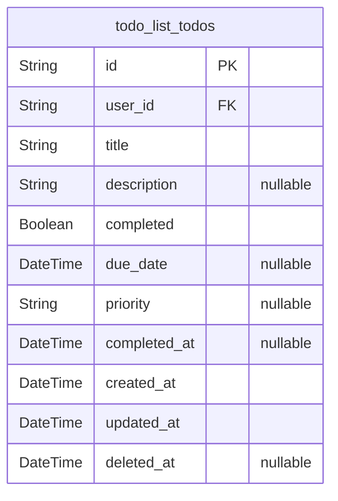

# Prisma Markdown

> Generated by [`prisma-markdown`](https://github.com/samchon/prisma-markdown)

- [Systematic](#systematic)
- [Actors](#actors)
- [Todos](#todos)

## Systematic

```mermaid
erDiagram
"todo_list_system_config" {
  String id PK
  String config_key UK
  String config_value
  String value_type
  String description "nullable"
  Int version
  DateTime created_at
  DateTime updated_at
}
```

### `todo_list_system_config`

System-wide configuration and metadata storage for the Todo List
application. This table maintains operational settings, feature flags,
and deployment-specific configuration that applies across the entire
system. Configuration entries are stored as key-value pairs with type
information and versioning, enabling flexible management of system
behavior without database schema migrations.

Properties as follows:

- `id`: Primary Key.
- `config_key`
  > Unique configuration key identifier. Examples: 'max_todos_per_user',
  > 'enable_feature_flag_xyz', 'deployment_environment',
  > 'token_expiration_minutes'. Used to lookup specific configuration values.
- `config_value`
  > Configuration value as string. The actual value is stored as string for
  > flexibility; type conversion handled by application based on value_type
  > field. Examples: '10000', 'true', 'production', '900'.
- `value_type`
  > Data type of the configuration value. Valid values: 'string', 'integer',
  > 'boolean', 'float'. Used by application to parse and convert config_value
  > to appropriate type for processing.
- `description`
  > Human-readable description explaining the purpose and usage of this
  > configuration setting. Helps operations team understand what this setting
  > controls and when it should be modified.
- `version`
  > Version number of this configuration entry. Incremented each time the
  > value is updated. Starts at 1 for new entries. Enables tracking of
  > configuration evolution over time.
- `created_at`
  > Timestamp when this configuration entry was initially created in UTC.
  > Immutable after creation. Used for audit trail and history tracking.
- `updated_at`
  > Timestamp when this configuration entry was last modified in UTC. Updated
  > whenever the config_value or other fields change. Used to track most
  > recent configuration updates.

## Actors

```mermaid
erDiagram
"todo_list_users" {
  String id PK
  String email UK
  String password_hash
  DateTime created_at
  DateTime updated_at
  DateTime deleted_at "nullable"
  DateTime last_login_at "nullable"
}
"todo_list_sessions" {
  String id PK
  String todo_list_user_id FK
  String ip_address
  String user_agent
  DateTime created_at
  DateTime last_activity_at
  DateTime expired_at "nullable"
  DateTime absolute_timeout_at
}
"todo_list_password_reset_tokens" {
  String id PK
  String todo_list_user_id FK
  String token UK
  DateTime created_at
  DateTime expires_at
  DateTime consumed_at "nullable"
}
"todo_list_token_blacklist" {
  String id PK
  String todo_list_user_id FK
  String token_jti
  DateTime revoked_at
  DateTime expires_at
  String revocation_reason
}
"todo_list_sessions" }o--|| "todo_list_users" : user
"todo_list_password_reset_tokens" }o--|| "todo_list_users" : user
"todo_list_token_blacklist" }o--|| "todo_list_users" : user
```

### `todo_list_users`

User accounts and authentication credentials for the Todo List application.

Stores registered user information including email address, securely
hashed password, and account metadata. Each user has a one-to-many
relationship with sessions (supporting multi-device login) and password
reset tokens. Users are the core identity entity that owns all todo items
and authentication sessions.

User accounts are created during registration with email validation and
unique email constraint. Passwords are hashed using bcrypt (never stored
plaintext). Account status is tracked implicitly through the deleted_at
field - null means active account, non-null timestamp indicates deleted
account.

This table is fundamental to all authentication and authorization in the
system. Every authenticated operation references a user ID from this
table.

Properties as follows:

- `id`: Primary Key.
- `email`
  > User's email address used for login and account recovery. Must be unique
  > across all users to prevent duplicate accounts. Stored in lowercase for
  > case-insensitive matching.
- `password_hash`
  > Secure bcrypt hash of user's password (minimum cost factor 10). Never
  > stored or returned as plaintext. Used for password verification during
  > login using secure comparison functions.
- `created_at`
  > Timestamp when user account was created (immutable). Recorded in UTC
  > timezone, ISO 8601 format.
- `updated_at`
  > Timestamp of the most recent account modification. Updated when password
  > changes or account information is modified. Recorded in UTC timezone.
- `deleted_at`
  > Timestamp when account was deleted (soft delete marker for audit trail).
  > Null value indicates active account. When set to non-null, user cannot
  > log in and associated sessions/tokens should be invalidated.
- `last_login_at`
  > Timestamp of user's most recent successful login. Updated each time user
  > authenticates. Used for tracking user activity and session management.

### `todo_list_sessions`

User authentication sessions for managing multi-device login support.

Represents an authenticated session from a specific device or browser.
Each user can have multiple concurrent sessions from different devices,
and this table tracks each independent session separately. Sessions store
device context (IP address, user agent) and token associations for
revocation tracking.

Sessions are created upon successful login and contain references to both
the user and the generated JWT tokens (if using database-backed token
storage). Sessions are invalidated on logout or when tokens expire.

This table enables the multi-device login requirement where a user can be
logged in from multiple devices simultaneously, with independent token
management per device. Each session maintains its own expiration and can
be revoked independently.

Properties as follows:

- `id`: Primary Key.
- `todo_list_user_id`
  > Foreign key referencing the user who owns this session. {@link
  > todo_list_users.id}
- `ip_address`
  > IP address from which the session was established. Used for session
  > context tracking and security monitoring to detect unusual login
  > patterns.
- `user_agent`
  > HTTP User-Agent header from the device that established the session.
  > Contains information about browser/device type. Used to display device
  > information to users and detect suspicious sessions.
- `created_at`
  > Timestamp when session was created (login time). Recorded in UTC
  > timezone, ISO 8601 format. Used for tracking session duration and age.
- `last_activity_at`
  > Timestamp of the most recent API request using this session. Updated on
  > each authenticated request. Used for implementing inactivity timeout (7
  > days) and session activity tracking.
- `expired_at`
  > Timestamp when session was explicitly terminated (logout). Null while
  > session is active. When set, all tokens associated with this session
  > become invalid and cannot be reused.
- `absolute_timeout_at`
  > Absolute maximum expiration time for this session (30 days from
  > creation). Session must be terminated by this time regardless of
  > activity. Used for enforcing maximum session duration per security
  > requirements.

### `todo_list_password_reset_tokens`

Secure tokens for password reset functionality enabling account recovery.

Generated when users forget their password and request recovery. Each
token is time-limited (1 hour validity) and single-use to prevent token
reuse attacks. Tokens are cryptographically secure random values that
cannot be guessed or brute-forced.

When user clicks password reset link in email, the token is validated
(not expired, not already used), then user can set new password. After
password reset completes, the token is marked as used (consumed) to
prevent reuse.

This table implements the secure password recovery flow required by the
authentication system. Tokens are tied to specific users and are
invalidated upon successful password change.

Properties as follows:

- `id`: Primary Key.
- `todo_list_user_id`
  > Foreign key referencing the user who requested password reset. {@link
  > todo_list_users.id}
- `token`
  > Cryptographically secure random token value used in password reset link.
  > Must be unique and unguessable. Sent to user via email in reset link
  > (e.g., /reset-password?token={token}). Hashed before storage for
  > security.
- `created_at`
  > Timestamp when reset token was generated. Used to calculate expiration
  > time (tokens valid for 1 hour). Recorded in UTC timezone.
- `expires_at`
  > Timestamp when this reset token becomes invalid. Set to 1 hour from
  > creation. Tokens cannot be used after this time and user must request new
  > reset link.
- `consumed_at`
  > Timestamp when token was successfully used to reset password. Null while
  > token is unused. When set, token can no longer be used (prevents reuse
  > attacks). Single-use enforcement.

### `todo_list_token_blacklist`

Revoked JWT tokens to prevent reuse after logout or password change.

When a user logs out or changes their password, their JWT tokens must be
invalidated to prevent unauthorized access if tokens were compromised.
This table maintains a blacklist of revoked token identifiers (JTI - JWT
ID claim) so the system can reject attempts to use invalidated tokens.

Each revoked token entry includes the unique token identifier (jti from
token payload), user who owned the token, and revocation timestamp. The
table also stores token expiration time so entries can be automatically
cleaned up after tokens naturally expire (no need to maintain blacklist
entries forever).

This enables secure token revocation without requiring a database lookup
on every request (tokens can validate their JTI against blacklist on
presentation). Implements the security requirement that tokens cannot be
reused after logout or password change.

Properties as follows:

- `id`: Primary Key.
- `todo_list_user_id`
  > Foreign key referencing the user who owned the revoked token. {@link
  > todo_list_users.id}
- `token_jti`
  > Unique token identifier from JWT payload (jti claim). Used to identify
  > which specific token was revoked. Combined with user_id to prevent token
  > reuse by same user.
- `revoked_at`
  > Timestamp when token was revoked (logout or password change). Used for
  > audit trail of when revocation occurred.
- `expires_at`
  > Timestamp when the original JWT token was set to expire. Blacklist
  > entries can be automatically cleaned up after this time since token would
  > be expired anyway. Enables automatic garbage collection of old revocation
  > records.
- `revocation_reason`
  > Reason why token was revoked: 'logout' (user initiated logout),
  > 'password_change' (user changed password and all sessions revoked), or
  > 'global_logout' (user logged out from all devices). Useful for security
  > auditing.

## Todos

```mermaid
erDiagram
"todo_list_todos" {
  String id PK
  String user_id FK
  String title
  String description "nullable"
  Boolean completed
  DateTime due_date "nullable"
  String priority "nullable"
  DateTime completed_at "nullable"
  DateTime created_at
  DateTime updated_at
  DateTime deleted_at "nullable"
}
```

### `todo_list_todos`

Personal todo items managed by authenticated users.

Stores individual todo tasks created by users, each with exclusive user
ownership enforced through user_id foreign key. Enables complete data
isolation - each user can only view, edit, and delete their own todos.
Supports core todo management functionality: creation with title and
optional details, completion status tracking, metadata (due date,
priority), and modification history through timestamps.

Designed for minimal viable todo application scope focusing on essential
CRUD operations, filtering by completion status, and sorting
capabilities. Single unified list per user with no categories, projects,
or advanced organizational features in baseline implementation.

Properties as follows:

- `id`: Primary Key.
- `user_id`
  > Owner of this todo. References authenticated user who created this todo.
  > [todo_list_users.id](#todo_list_users)
- `title`
  > Todo task title. Required field, non-empty after trimming whitespace.
  > What the todo is about. Length 1-255 characters.
- `description`
  > Optional detailed description of the todo task. Additional context or
  > notes. Length 0-5000 characters. Null or empty when not provided.
- `completed`
  > Completion status of the todo. True = completed and done, false =
  > pending/incomplete. Initialized to false when created. Can be toggled by
  > user at any time.
- `due_date`
  > Optional due date for completing this todo. Must be today or in the
  > future (cannot be in past). In ISO 8601 format. Null when not set.
- `priority`
  > Priority level for this todo. One of: "low", "medium", "high". Defaults
  > to "medium" if not specified. Optional field.
- `completed_at`
  > Timestamp when todo was marked as complete. Recorded when completion
  > status changes to true. Cleared when marked incomplete. Null while todo
  > is pending.
- `created_at`
  > Timestamp when todo was created. System-generated, immutable. Used for
  > sorting (newest/oldest first) and audit purposes.
- `updated_at`
  > Timestamp when todo was last modified. Updated whenever any field changes
  > (title, description, completion status, priority, due date). Tracks
  > modification history.
- `deleted_at`
  > Soft deletion timestamp. Marked when todo is deleted by user. Null for
  > active todos. Enables potential recovery and audit trail of deletions.
