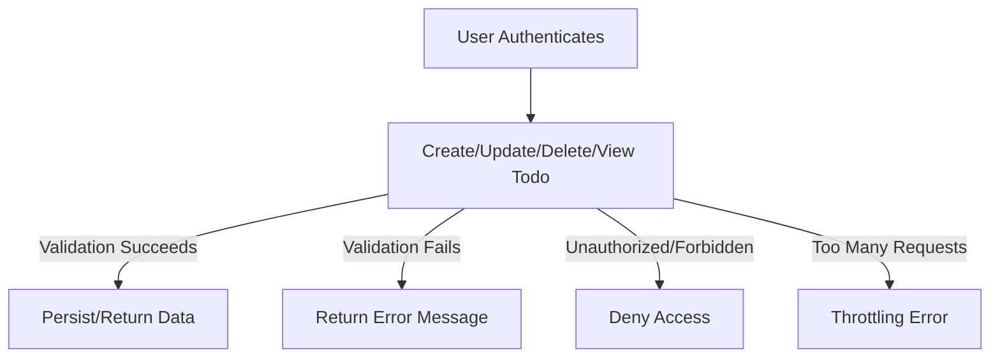

# Functional Requirements: Todo List Minimal Application

## Introduction
A Todo List service provides users the ability to record, update, and remove short reminders or actionable items. The design intent is single-minded focus on core todo management, efficient workflow, and clear, reliable user experience. Only minimal functionality is provided: just enough to meet common todo list needs without extra features.

## Core Features (CRUD Operations)
- **Create Todo**: WHEN a user submits a new todo item, THE system SHALL save the todo under the authenticated user's account and confirm item creation.
- **Read Todo**: WHEN a user requests their todo items, THE system SHALL return all todos associated with that user's account, sorted by most recent, and only those the user owns.
- **Update Todo**: WHEN a user requests to update a specific todo item THEY own, THE system SHALL allow modifications to the item's text and completion status.
- **Delete Todo**: WHEN a user requests deletion of a todo item THEY own, THE system SHALL permanently remove it from their account, confirming removal.
- **View Todo Detail**: WHEN a user requests detail for a single todo by ID, THE system SHALL provide full details if—AND ONLY IF—the user is the owner, otherwise an appropriate error SHALL be returned.

## Business Rules & Field Validations
- WHEN a user submits a todo, THE system SHALL REQUIRE a non-empty, maximum 255-character text description.
- WHEN a todo is created or updated, THE system SHALL automatically record timestamps for creation and last modification as metadata for audit and user transparency.
- WHEN a user marks a todo as complete, THE system SHALL update the status as complete and record the completion timestamp; otherwise, the completion timestamp SHALL be null.
- WHEN querying for todos, THE system SHALL NOT return todos belonging to other users under any circumstance.
- WHEN a user attempts to update or delete a todo not owned by them, THE system SHALL reject the request, providing an error message indicating insufficient permission.

## Access Controls & Permissions
- Only authenticated, logged-in users MAY access any todo-related endpoint.
- WHEN a request is made without valid authentication, THE system SHALL return an authentication error and shall not leak information about todo data existence.
- WHEN an authenticated user accesses todo functionality, THE system SHALL authorize actions exclusively on data owned by that user: users cannot view, update, or delete other users' data.

## Limits & Constraints
- Each user SHALL be limited to a maximum of 100 active todo items. WHEN a new todo would exceed this cap, THE system SHALL reject the creation request and provide a business-friendly error message explaining the limit.
- Text descriptions for todos SHALL have a maximum of 255 Unicode characters; overflow SHALL result in a validation error.
- WHEN an action is performed after logout or session expiration, THE system SHALL return an authentication/session expired error.

## System Behaviors & Error Handling
- WHEN user requests violate business rules, THE system SHALL respond with human-readable error messages that clearly state the cause and possible steps to resolve (e.g., 'Todo limit reached. Delete an item to add new.').
- System SHALL provide clear distinctions between "not found" (invalid todo ID) and "forbidden" (trying to access others' data) errors.
- WHEN backend is down or unavailable, THE system SHALL provide an error indicating the service is temporarily unavailable and suggest retrying later.
- All errors SHALL be handled without exposing sensitive system or account data.

## Authentication & Session Management
- All todo features SHALL be accessible only to authenticated users.
- WHEN a user logs in, THE system SHALL create a secure session (token-based or cookie-based) linked to that user.
- WHEN a session expires or is invalidated (by logout or manually), THE system SHALL prevent further access to todos until the user re-authenticates.
- WHEN a user requests logout, THE system SHALL immediately invalidate any access token or authentication session.
- No part of the system SHALL expose data about users or todos to non-authenticated entities.

## Performance, SLA, and Edge Cases
- WHEN any valid request is submitted, THE system SHALL respond within 2 seconds under typical load (≤1,000 simultaneous users).
- Data for each user SHALL remain consistent across multiple devices or access sessions.
- WHEN data is deleted or updated, THE changes SHALL be permanent and cannot be reverted through the API.
- WHEN a user rapidly creates or deletes todos, THE system SHALL throttle requests that exceed 20 operations per second and return a throttling error if limits are surpassed.

## Minimal Use Flow (Mermaid Flowchart)

---

The above requirements specify all permitted business flows and rules for the Todo backend application. No additional features, integrations, or technical architectural details are in scope. All implementation specifics are at the backend team's discretion as long as these requirements are fulfilled.