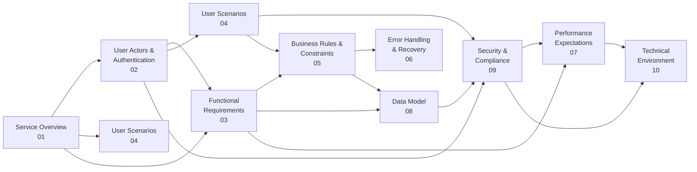

# Todo List Application Documentation

## Overview

This documentation set provides comprehensive requirements and specifications for building a minimal Todo list application with user authentication and todo management capabilities. The application enables users to securely create, manage, and organize their personal todo items with a focus on simplicity and essential features only.

The complete documentation comprises 10 detailed specification documents organized by purpose and audience. Each document serves a specific role in communicating requirements to different teams:

- **Business Stakeholders**: Understand the application's purpose, value, and user impact
- **Development Team**: Implement all functional requirements, security, and performance standards
- **Quality Assurance Team**: Test all features, edge cases, and error scenarios
- **Product Team**: Track requirements and user experience expectations

This table of contents document provides navigation across the complete specification set. Use this as your starting point to locate relevant documentation for your role and information needs.

---

## Quick Navigation Guide

### For Backend Developers (Start Here)

If you are building the backend API and system, follow this reading sequence:

1. **[01-service-overview.md](#01-service-overviewmd)** - Understand the application's business purpose and core features
2. **[02-user-actors-authentication.md](#02-user-actors-authenticationmd)** - Learn complete authentication flows, JWT token management, and user permissions
3. **[03-functional-requirements.md](#03-functional-requirementsmd)** - Implement all system functions using EARS format specifications
4. **[04-user-scenarios-workflows.md](#04-user-scenarios-workflowsmd)** - Understand user interactions and complete workflows
5. **[05-business-rules-constraints.md](#05-business-rules-constraintsmd)** - Implement business logic and validation rules
6. **[06-error-handling-recovery.md](#06-error-handling-recoverymd)** - Build error handling and user recovery paths
7. **[08-data-model-concepts.md](#08-data-model-conceptsmd)** - Understand data structure and relationships from business perspective
8. **[09-security-compliance.md](#09-security-compliancemd)** - Implement all security, privacy, and data protection requirements
9. **[07-performance-expectations.md](#07-performance-expectationsmd)** - Meet performance targets and handle concurrent users
10. **[10-technical-environment.md](#10-technical-environmentmd)** - Set up infrastructure and deployment environment

### For Product & Business Stakeholders

If you are managing the product or making business decisions, follow this sequence:

1. **[01-service-overview.md](#01-service-overviewmd)** - Executive summary and business model
2. **[02-user-actors-authentication.md](#02-user-actors-authenticationmd)** - Understand who uses the application and how they authenticate
3. **[04-user-scenarios-workflows.md](#04-user-scenarios-workflowsmd)** - See complete user journeys and workflows
4. **[03-functional-requirements.md](#03-functional-requirementsmd)** - Review complete feature list and capabilities
5. **[07-performance-expectations.md](#07-performance-expectationsmd)** - Understand user experience and performance standards

### For QA & Testing Teams

If you are testing the application, follow this sequence:

1. **[03-functional-requirements.md](#03-functional-requirementsmd)** - Understand what to test and system functions
2. **[04-user-scenarios-workflows.md](#04-user-scenarios-workflowsmd)** - Test complete user workflows and scenarios
3. **[05-business-rules-constraints.md](#05-business-rules-constraintsmd)** - Test validation rules and business constraints
4. **[06-error-handling-recovery.md](#06-error-handling-recoverymd)** - Test error scenarios and recovery paths
5. **[02-user-actors-authentication.md](#02-user-actors-authenticationmd)** - Test authentication flows and permissions

---

## Complete Documentation Index

### 01-service-overview.md

**Purpose**: Establish the foundational business context for the Todo list application

**What You'll Find**:
- Executive summary of the application and its purpose
- Definition and business justification for the Todo list application
- Business model and value proposition for users and the service provider
- Target users and typical use cases (busy professionals, students, home managers, casual users)
- Core features overview (minimal viable feature set only)
- Success metrics for measuring application performance and adoption
- User actors overview (Guest and User actors)
- Key application principles (simplicity, data privacy, reliability, user control)

**Key Questions Answered**:
- Why does this application exist and what problem does it solve?
- Who are the target users and what are their pain points?
- What are the core features and minimum viable functionality?
- What are the business metrics for success?
- How does the application generate value?

**For**: All stakeholders - provides business context necessary for understanding purpose and scope

**Length**: 2,500+ words with comprehensive business context

---

### 02-user-actors-authentication.md

**Purpose**: Define complete authentication system, user roles, permissions, and JWT token management

**What You'll Find**:
- Definition of all user actors (Guest and User/Authenticated Member)
- Guest actor capabilities and limitations (registration, login, password reset)
- Authenticated user capabilities and full permission matrix
- Complete authentication requirements using EARS format
- User registration requirements and validation rules
- User login process and credential validation
- Password change and password reset flows
- User logout including single and multi-device logout
- Complete JWT token management specification
- Access token details (15-minute expiration, payload structure)
- Refresh token details (30-day expiration, usage)
- Token refresh mechanism and automatic renewal
- Session management requirements including initialization, timeout, and invalidation
- Multi-device session support
- Token revocation procedures
- Security considerations for session management
- Complete permission matrix showing what each actor can do

**Key Questions Answered**:
- What are all the user types in the system?
- How exactly do users authenticate and manage sessions?
- What is the JWT token structure and how should it be managed?
- How long do tokens remain valid?
- What can each user actor do?
- How are sessions handled across multiple devices?

**For**: Development team (primary), Security and DevOps teams

**Length**: 5,000+ words with detailed authentication specifications and complete token lifecycle

---

### 03-functional-requirements.md

**Purpose**: Document all functional capabilities and system behavior in EARS format

**What You'll Find**:
- Complete list of all system functions for todo management
- User registration requirements (email validation, password requirements, account creation)
- User login requirements (credential validation, session establishment)
- User logout functionality
- Todo creation requirements (title validation, optional fields, initial state)
- Todo retrieval requirements (single and all todos, pagination, sorting)
- Todo update requirements (editing title/description, changing completion status, updating other fields)
- Todo deletion requirements (permanent removal, cascade behavior)
- List management requirements (single unified list, data isolation)
- Data validation requirements (required/optional fields, length constraints, character restrictions)
- Search and filtering requirements (completion status filtering, title search, sorting options)
- Cross-cutting requirements (timestamp management, session persistence, concurrent modification)
- All requirements specified in EARS format for precision and testability
- Input validation specifications and business logic

**Key Questions Answered**:
- What are all the operations users can perform on todos?
- What validation is required for all inputs?
- How should todos be retrieved and displayed?
- What filtering and search capabilities are needed?
- How is data isolation enforced between users?

**For**: Development team (primary reference for implementation)

**Length**: 6,000+ words with detailed, actionable requirements in EARS format

---

### 04-user-scenarios-workflows.md

**Purpose**: Document step-by-step user journeys and complete interaction workflows

**What You'll Find**:
- User registration scenario with complete flow, validation, email verification
- User login scenario with credential validation and session establishment
- User logout scenario with session termination
- Creating a todo - complete flow from initiation through confirmation
- Viewing all todos - complete list retrieval and display flow
- Completing a todo - marking tasks as done/incomplete
- Editing a todo - modifying task details
- Deleting a todo - permanent removal with confirmation
- Detailed error scenarios for each workflow (missing fields, validation failures, permission denials)
- Alternative flows and edge cases
- User decision points and next steps
- Recovery paths for error conditions
- Complete workflow summary and user journey map

**Key Questions Answered**:
- What are the step-by-step user interactions?
- What is the complete lifecycle of a todo from creation to deletion?
- How do users interact with the system at each stage?
- What error conditions can occur and how are they handled?
- What are the alternative and recovery paths?

**For**: Development team, product stakeholders, QA teams

**Length**: 8,000+ words with detailed workflows including error scenarios

---

### 05-business-rules-constraints.md

**Purpose**: Define all business logic, validation rules, and operational constraints

**What You'll Find**:
- Todo creation rules (unique ID assignment, user association, initial state)
- Title requirements (length constraints, character restrictions, non-empty validation)
- Description requirements (optional field, length constraints)
- Todo ownership rules (exclusive ownership, data isolation, visibility control)
- Data isolation enforcement between users
- Todo completion rules (binary state management, timestamp tracking)
- Completion status independence from editing capability
- Data validation rules (field requirements, format validation, character encoding)
- User registration requirements (email validation, uniqueness, password requirements)
- User account lifecycle (registration, active, inactive, deletion)
- Password requirements (minimum length, complexity, hashing, secure storage)
- Account status management
- Email uniqueness enforcement
- System constraints (todos per user limit, data retention, request limits)
- Request handling and concurrent modifications
- State consistency requirements
- Account and todo associations
- All rules specified for implementation accuracy

**Key Questions Answered**:
- What are the validation rules for todos?
- What business logic constraints exist?
- What are the limits and restrictions?
- How is data integrity maintained?
- How should concurrent modifications be handled?

**For**: Development team (reference for validation and business logic implementation)

**Length**: 4,000+ words specifying all business constraints and rules

---

### 06-error-handling-recovery.md

**Purpose**: Define all error scenarios, user-facing messages, and recovery processes

**What You'll Find**:
- Error handling philosophy and categorization
- Authentication errors with HTTP status codes and user messages
  - Invalid credentials, email not found, account not activated, session expired
  - Invalid tokens, missing tokens, refresh failures
- Validation errors for all input types
  - Missing required fields, invalid email format, email already registered
  - Password too short, todo title missing/too long, description too long
  - Invalid data types and date formats
- Permission errors (insufficient privileges, cannot modify other's todos, cannot view other's todos)
- Data not found errors (todo not found, user account not found)
- System constraint errors (too many todos, rate limit exceeded)
- Concurrent modification handling (todo modified elsewhere, deleted during edit)
- User recovery paths and self-service options
- Password reset flow with email verification
- Email re-verification procedure
- Account recovery assistance options
- Error response structure and HTTP status codes
- Summary of all error codes by category
- Complete error messages and recovery guidance

**Key Questions Answered**:
- What errors can users encounter?
- How should errors be communicated to users?
- What recovery options exist for each error?
- How are edge cases and concurrent situations handled?
- What error messages should be shown for each scenario?

**For**: Development team (error handling implementation)

**Length**: 5,000+ words with detailed error scenarios and recovery procedures

---

### 07-performance-expectations.md

**Purpose**: Define performance targets and user experience requirements

**What You'll Find**:
- Performance requirements foundation and philosophy
- Authentication performance targets
  - User registration: 2 seconds
  - User login: 1 second
  - JWT token refresh: 500 milliseconds
- Todo operations performance
  - Creating a todo: 1 second
  - Retrieving all todos: 500 ms - 2 seconds depending on count
  - Retrieving single todo: 500 milliseconds
  - Updating a todo: 1 second
  - Deleting a todo: 1 second
- List retrieval performance (sorting, filtering, pagination)
- Search performance (1-2 seconds based on complexity)
- Concurrent user handling (minimum 1,000 concurrent users)
- Data limits and scalability expectations
- Maximum todos per user (10,000)
- Performance degradation scenarios
- Database query optimization requirements
- Performance testing and verification procedures
- Complete summary table of all performance targets
- Psychological foundations for performance expectations
- Load indication and visual feedback requirements

**Key Questions Answered**:
- What response times are expected?
- How many todos should a user be able to manage?
- What is the expected concurrent user capacity?
- How should the system scale as user base grows?
- What are acceptable performance degradation scenarios?

**For**: Development team, DevOps, infrastructure planning

**Length**: 4,000+ words with specific, measurable performance metrics

---

### 08-data-model-concepts.md

**Purpose**: Describe conceptual data structure from business perspective (not technical schema)

**What You'll Find**:
- Core data model overview and principles
- User data concepts (identity, account information, lifecycle)
- Todo data concepts (title, description, status, tracking information)
- Complete todo lifecycle (creation, pending, completed, modified, deleted)
- Todo properties in detail (title, description, completion status, timestamps)
- User-to-todo relationships (one user owns many todos)
- Data isolation between users
- No cross-user relationships supported
- Data relationships diagram (conceptual only)
- Complete data lifecycle from creation through deletion
- Data ownership rules and exclusive ownership
- Ownership verification requirements
- Multi-user isolation enforcement
- Data retention and cleanup policies
- Deleted data handling
- Audit trail optional enhancement
- Data validation scope for user and todo data
- Field validation rules and requirements
- Summary of data model principles
- **Note**: Conceptual only - no database schema or ERD included

**Key Questions Answered**:
- What data does the system store?
- How are users and todos related?
- What is the lifecycle of data?
- How long is data retained?
- How is data owned and accessed?

**For**: Development team (understanding data relationships)

**Length**: 4,000+ words describing business data concepts

---

### 09-security-compliance.md

**Purpose**: Define security requirements, privacy considerations, and compliance needs

**What You'll Find**:
- Security overview and philosophy
- Authentication security requirements
  - JWT token implementation details
  - Login security and protection against enumeration attacks
  - Session token validation procedures
- Authorization and access control
  - User access control with ownership verification
  - Guest vs. authenticated user permissions
  - Role-based access control implementation
- Password requirements (minimum 8 characters, complexity, hashing algorithm)
- Password security (never plaintext storage, secure hashing, bcrypt with cost factor 10)
- Password change requirements (identity verification, token invalidation)
- Data privacy requirements
  - Personal data protection (email, password hash, todos, activity logs)
  - Data access restrictions (user isolation, audit logging)
  - User data deletion procedures
- Data protection (encryption in transit, HTTPS/TLS requirement)
- Encryption at rest for sensitive data
- Data integrity verification
- Session security (timeout, invalidation, concurrent sessions, fixation prevention)
- Input security (validation, SQL injection prevention, XSS prevention)
- Input length limits and special character handling
- Authentication error handling (generic messages, rate limiting)
- OWASP security concerns coverage
- Security headers implementation
- API security best practices
- Security logging and monitoring
- Log retention policies
- Suspicious activity monitoring

**Key Questions Answered**:
- How is user data protected?
- What are password requirements?
- How is access controlled?
- What privacy measures are needed?
- How are common attacks prevented?

**For**: Development team (security implementation), Security team

**Length**: 7,000+ words with detailed security specifications

---

### 10-technical-environment.md

**Purpose**: Describe technical infrastructure, architectural needs, and deployment considerations

**What You'll Find**:
- Technical environment overview and system architecture principles
- Client-server architecture description
- Stateless design approach
- Technology stack orientation (Node.js, TypeScript, RESTful APIs)
- Environment tiers (development, staging, production)
- RESTful API design principles
  - Resource-based design
  - HTTP method mapping
  - Stateless communication
- Request/response structure and standards
- API versioning strategy
- Authentication protocol (JWT implementation and usage)
- Token flow and management
- Security protocols for tokens
- Database requirements and concepts
- Data persistence needs
- Storage requirements and capacity estimates
- Data integrity requirements
- External services and integrations
  - Email services (verification, password reset, notifications)
  - Logging services (centralized logging infrastructure)
  - Monitoring and alerting services
- Deployment considerations
  - Environment setup (development, staging, production)
  - Automated deployment pipeline
  - Configuration management
- Monitoring and logging
  - Application logging strategy
  - Performance monitoring
  - Error tracking
  - User activity logging
- Development standards
  - Code quality, version control, code style
  - Type safety with TypeScript
  - Testing requirements (unit, integration, end-to-end)
  - Documentation standards
- Infrastructure scalability
  - Growth projections
  - Scaling strategy (horizontal, vertical, database)
  - Load balancing concepts
- Data governance and compliance
  - Backup and recovery procedures
  - Data retention policies
  - Privacy and data protection
- **Note**: High-level architectural guidance only, not implementation details

**Key Questions Answered**:
- What technical infrastructure is needed?
- What protocols and standards should be used?
- What external services are required?
- What monitoring is needed?
- How should the system scale?

**For**: Development team (technical setup), DevOps, infrastructure planning

**Length**: 6,000+ words with architectural guidance and infrastructure concepts

---

## Reading Order by Role

### Backend Developer Implementation Path (Recommended Sequence)

Follow this order to understand requirements and implement systematically:

1. **Service Overview (01)** - Understand business context and why the application exists
2. **User Actors & Authentication (02)** - Learn complete authentication system and user roles
3. **Functional Requirements (03)** - Reference for implementing all system functions
4. **User Scenarios (04)** - Understand how features work together in real user workflows
5. **Business Rules (05)** - Implement business constraints and validation logic
6. **Error Handling (06)** - Build error handling for all scenarios
7. **Data Model (08)** - Understand data relationships and structure
8. **Security & Compliance (09)** - Implement security measures and privacy protection
9. **Performance Expectations (07)** - Optimize to meet performance targets
10. **Technical Environment (10)** - Set up infrastructure and deployment

### Project Manager Overview Path

1. Service Overview (01) - Executive summary
2. User Scenarios & Workflows (04) - Understand user experience
3. Functional Requirements (03) - Feature list and scope
4. Performance Expectations (07) - Quality and performance standards

### Quality Assurance Testing Path

1. User Actors & Authentication (02) - Test authentication and permissions
2. Functional Requirements (03) - What features to test
3. User Scenarios & Workflows (04) - Test complete user journeys
4. Business Rules & Constraints (05) - Test validation and business logic
5. Error Handling & Recovery (06) - Test error scenarios and recovery

---

## Key Concepts Across All Documentation

### User Actors Defined

**Guest Actor** (Unauthenticated)
- Can access registration and login
- Can reset forgotten password
- Cannot access any todo functionality
- Becomes a User upon successful registration and authentication

**User Actor** (Authenticated Member)
- Can create, read, update, and delete their own todos
- Can manage their account and change password
- Can log out from one device or all devices
- Can only see and manage their own todos
- Has complete data isolation from other users

### Core Features (Minimum Viable)

The application includes only essential features:

1. **User Authentication** - Registration, login, logout, password management
2. **Todo Creation** - Create new todos with title and optional description
3. **Todo Display** - View all todos in organized list
4. **Todo Completion** - Mark todos as complete/incomplete
5. **Todo Editing** - Update todo details
6. **Todo Deletion** - Remove todos from list
7. **Account Management** - Change password, manage profile

No advanced features like:
- Team collaboration
- Recurring tasks
- Complex scheduling
- Filtering by multiple criteria
- Todo categories or projects

### Core Data Entities

**User Account**
- Unique email address (login identifier)
- Securely hashed password
- Account status and timestamps
- Owns collection of todos

**Todo Item**
- Unique identifier within user's list
- Title (required, non-empty)
- Description (optional)
- Completion status (complete/incomplete)
- Creation and modification timestamps
- Belongs exclusively to one user

### Authentication Method

**JWT-Based Authentication**
- User logs in with email and password
- Server generates JWT access token (15-minute expiration)
- Server generates JWT refresh token (30-day expiration)
- Client includes access token in subsequent requests
- When token expires, client uses refresh token to get new access token
- System maintains session per device; supports multi-device login

### Business Model

**Simple and Minimal**
- Free service for all users
- Focus on individual productivity
- Minimal feature set for ease of use
- Future premium features possible but not included in MVP
- Revenue model: Initially free; premium features later

---

## Document Relationships

**Document Dependencies**:

- **Service Overview** is the foundation; all other documents build on it
- **User Actors & Authentication** establishes user types and access control referenced throughout
- **Functional Requirements** and **User Scenarios** are closely related; scenarios demonstrate requirements in practice
- **Business Rules** define the constraints for functional requirements
- **Data Model** describes structure for all functional requirements
- **Error Handling** covers all error scenarios from functional requirements
- **Security** applies to authentication, data handling, and all user interactions
- **Performance** applies to all operations and system architecture
- **Technical Environment** provides infrastructure for all other requirements

---

## Quick Reference: Document Purposes

| Document | Primary Purpose | Key Output | Who Needs It |
|----------|---|---|---|
| 01 | Establish business context | Why the app exists; user value | All stakeholders |
| 02 | Define authentication system | User roles; login flows; JWT tokens | Developers, Security |
| 03 | Specify system functions | What the system does (EARS format) | Developers, QA |
| 04 | Document user journeys | How users interact with system | Developers, Product, QA |
| 05 | Define business logic | Rules, validation, constraints | Developers |
| 06 | Document error scenarios | Error messages, recovery paths | Developers, QA |
| 07 | Specify performance targets | Response times, throughput, scale | Developers, DevOps |
| 08 | Describe data concepts | Data structure and relationships | Developers |
| 09 | Define security measures | Authentication, encryption, privacy | Developers, Security |
| 10 | Describe infrastructure | Technical setup, deployment, monitoring | Developers, DevOps |

---

## How to Use This Documentation

### Step 1: Identify Your Role

Find your role in one of the predefined reading paths above:
- Backend Developer
- Product Manager
- QA/Testing
- Other role (customize your path)

### Step 2: Follow Your Reading Path

Read documents in the recommended sequence for your role. Each document builds on previous ones, so sequential reading ensures complete understanding.

### Step 3: Deep Dive as Needed

Once you've reviewed the overview documents, jump to specific documents for detailed information:
- Implementing authentication? → Go to document 02
- Writing test cases? → Go to documents 03, 04, 06
- Building data layer? → Go to documents 08, 05
- Optimizing performance? → Go to document 07

### Step 4: Use Cross-References

Each document includes references to related documents. Follow these links to see how concepts interconnect and apply across the specification.

### Step 5: Reference While Building

Keep relevant documents open during implementation, testing, or planning. Use the detailed specifications as your authoritative requirements source.

---

## Document Completeness Statement

This documentation set provides **complete requirements for building the Todo list application**. All functional specifications, business rules, user flows, security requirements, and technical guidance needed are fully documented across the 10 specification documents.

**What is Included**:
- ✅ Complete functional requirements for all features
- ✅ All user actor definitions and permissions
- ✅ Complete authentication and session management specifications
- ✅ All business rules and validation requirements
- ✅ Complete user workflows and scenarios
- ✅ All error scenarios and recovery paths
- ✅ Performance targets and expectations
- ✅ Data model and relationship concepts
- ✅ Complete security and privacy requirements
- ✅ Technical architecture and infrastructure guidance
- ✅ Testing and quality assurance guidance
- ✅ Logging, monitoring, and operational requirements

**What is NOT Included** (By Design):
- ❌ Database schema design (developer discretion)
- ❌ API endpoint specifications (developer discretion)
- ❌ Code implementation examples (developer discretion)
- ❌ Technology framework selection (developer discretion)
- ❌ Deployment tool selection (DevOps discretion)
- ❌ UI/UX design specifications (Design team responsibility)

Developers have **full autonomy over technical implementation decisions** while following the business requirements and specifications in this documentation.

### How to Reference This Documentation

- **Developers**: Use this as your definitive requirements specification. Implement functionality to match these requirements exactly.
- **Product Managers**: Use this to understand scope, features, and success metrics. Reference for stakeholder communication.
- **QA Teams**: Use this to create test plans and test cases. Reference for validating implementation correctness.
- **Project Managers**: Use this to understand scope, effort, and dependencies. Reference for project planning.

---

## Version and Updates

This documentation set version: **1.0**

All requirements in this documentation are complete and stable. Changes or additions would be documented in subsequent versions with clear version numbering.

Each specification document can be updated independently, but all changes maintain consistency with this table of contents and cross-referencing.

---

> **Developer Note**: This documentation defines all **business requirements and system specifications**. All technical implementations—including architecture decisions, API design patterns, database schema design, code structure, development methodology, and deployment tools—are at the complete discretion of the development team. This documentation describes **WHAT** the system should do and **WHY**, not **HOW** to implement it. Developers have full autonomy over all technical implementation decisions while building to meet these business requirements.