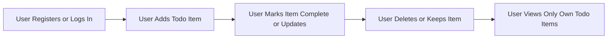

# Problem Definition for the Todo List Application

## User Pain Points

Forgetting important tasks is a persistent challenge for many individuals, resulting in missed commitments and decreased productivity. The following pain points are addressed by the Todo List application:

1. **Essential tasks are often forgotten.** Users lack a persistent, accessible place to record tasks they must not overlook.
2. **Cognitive friction with complex tools.** Most productivity tools overwhelm users with secondary features, causing frustration and abandonment.
3. **Difficulty focusing on current tasks.** Users need to see only the tasks relevant to their immediate concerns, without distraction from advanced toolsets.
4. **Disorganized task tracking.** Users are unable to structure, prioritize, and complete tasks consistently without a single, dedicated workflow.
5. **Data fragmentation and privacy risk.** Tracking todos in fragmented systems (email, chat apps, sticky notes) raises the likelihood of loss and accidental disclosure.
6. **High adoption barrier for non-technical users.** The Todo List must be immediately usable by all users, requiring no training or onboarding.

### EARS Requirements (Pain Points)
- WHEN a user wants to record a new task, THE todoList system SHALL allow rapid, reliable addition of todo items.
- WHEN a user needs to view outstanding tasks, THE todoList system SHALL present a clear list of that user's todo items and completion states.
- WHEN a user completes a task, THE todoList system SHALL allow simple marking of that item as complete.
- WHEN a user wants to update or remove a task, THE todoList system SHALL enable easy, obvious workflows with no accidental data loss.
- WHEN a user signs in, THE todoList system SHALL display and permit modification only of that user's tasks.

## Existing Solutions and Gaps

Current task-tracking methods—including multifunction apps, analog lists, and digital alternatives—fail users whose only need is reliably tracking a small number of private, personal todo items. Gaps include:

1. **Excess complexity.** Full-featured solutions include unnecessary options, leading to cognitive overload and feature fatigue.
2. **Decision fatigue and poor adoption.** Users abandon platforms that require excessive configuration or offer tangential features.
3. **Privacy threats.** Multi-user or shared solutions risk accidental data leaks—unacceptable for personal or sensitive todo items.
4. **Unfit repurposing.** Tools meant for notes, calendars, or spreadsheets do not offer a direct workflow for rapid, frequent task entry and completion.
5. **Rigid, non-personal views.** Systems that impose categories or enforced structures on todo data fail to adapt to diverse personal needs.

### EARS Requirements (Solution Gaps)
- THE todoList system SHALL require zero training or onboarding for users.
- WHEN a user creates, updates, or deletes a todo, THE system SHALL perform the operation privately for that user alone.
- THE todoList system SHALL neither require nor offer advanced configuration or settings for standard todo management.

## Why Minimalism

A minimal feature set directly targets and eliminates the above pain points and market gaps. Minimalism is justified by:

1. **Reduced distraction and maximized focus.** The core workflow—add, check, update, or delete a simple individual todo—is always immediately available, with no distractions.
2. **Immediate adoption.** Anyone can understand and use the application with no introduction, tutorial, or setup.
3. **Absolute privacy.** Data is accessible only to the task owner, with no sharing or external visibility of any kind.
4. **Maximum reliability and maintainability.** With few moving parts, users enjoy a robust experience free of bugs or performance degradation.
5. **Agile shipping and responsiveness.** Developers can maintain and enhance the application quickly based on actual user needs, not speculation about potential features.
6. **Tight alignment to core user needs.** Research confirms that users want a single, current todo list and gain no measurable benefit from categories, notifications, tags, or similar advanced features.

### EARS Requirements (Minimalism)
- THE todoList system SHALL allow ONLY adding, viewing, editing, completing, and deleting personal tasks.
- THE todoList system SHALL NOT include sharing, categories, tags, priorities, integrations, or analytics. Only strictly required capabilities are permitted.

## Success Factors for Problem Solving

A Todo List application will be judged successful for its minimal use case if:

1. **Users can always recall what needs doing.** Tasks are reliably remembered and completed.
2. **Ongoing user engagement.** Lack of frustration and absence of abandonment indicates the core needs are solved simply.
3. **No cross-user data access.** User todo data is perfectly isolated; no information is shared or leaked.
4. **No unnecessary features exist.** Users never experience confusion, distraction, or have to ignore secondary options.
5. **Day-to-day reliability.** All operations (add, check, edit, delete) work correctly on every use for every user.

### EARS Requirements (Success)
- THE todoList system SHALL permit each user to manage their todos without any possibility of seeing or modifying another user's tasks.
- THE todoList system SHALL support instant, reliable viewing and updating of todo data for each user in real time.
- IF a user tries an unsupported or irrelevant action (such as sharing), THEN THE todoList system SHALL gently inform the user this is not possible.
- THE todoList system SHALL enable every core operation (add, complete, edit, delete) to be accomplished quickly and without error.

## Core User Workflow Diagram

## Conclusion

The Todo List application exists to deliver private, effortless, and focused personal task management for all users, regardless of technical skill. By restricting features to the absolute essentials—add, view, update, complete, and delete personal tasks—the application will uniquely address the cognitive and organizational needs outlined above, foster consistent use, and minimize any risk of user abandonment or data exposure. Backend developers must implement business logic that always preserves these minimal, privacy-first principles.