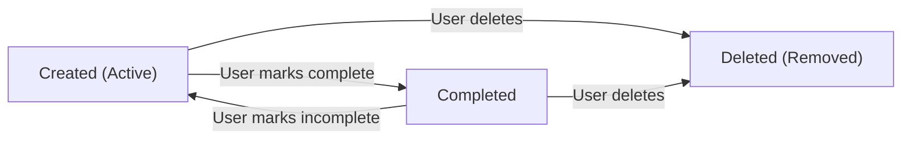

# Functional Requirements for Todo List Application

## 1. Overview

This document specifies the complete functional requirements for the Todo List application. It defines what users can do with the system, how the system behaves, what data is managed, and all business rules that govern todo operations. This specification is designed for backend developers to understand and implement the core todo management system.

---

## 2. Core Todo Management Features

### 2.1 Todo Creation

WHEN a user submits a request to create a new todo, THE system SHALL validate all required fields and store the todo with all provided information.

WHEN a user attempts to create a todo without providing a title, THE system SHALL reject the operation with error code INVALID_INPUT_EMPTY_TITLE and display the message "Todo title cannot be empty".

WHEN a user provides a title exceeding 255 characters, THE system SHALL reject the operation with error code INVALID_INPUT_TITLE_TOO_LONG and display the message "Todo title cannot exceed 255 characters".

THE system SHALL automatically assign a unique identifier to each created todo item that does not conflict with any existing todo.

THE system SHALL automatically record the creation timestamp in UTC format when a todo is created, and this timestamp SHALL never be modified.

THE system SHALL initialize the new todo in the "Active" status upon creation.

WHEN a user provides optional fields (description, due date, priority), THE system SHALL validate these fields according to their specific requirements and reject the creation if any validation fails.

### 2.2 Todo Viewing & Retrieval

WHEN a user requests their todo list, THE system SHALL retrieve all todos associated with the authenticated user and return them sorted by creation date with newest todos first.

WHEN a user views their todo list, THE system SHALL display each todo with its complete properties: ID, title, description, status, priority, due date, created date, modified date, and completion date (if applicable).

WHEN a user requests a filtered view (active only, completed only), THE system SHALL apply the filter and return only todos matching the filter criteria.

IF a user has no todos, THEN THE system SHALL display an empty list indication and provide guidance on creating a first todo.

### 2.3 Todo Updating

WHEN a user modifies a todo item, THE system SHALL update only the specified fields while validating each modified field according to its validation rules.

WHEN a user updates a todo title, THE title SHALL meet all title validation requirements (non-empty, maximum 255 characters, valid characters).

WHEN a user updates a todo description, THE description SHALL not exceed 2000 characters and SHALL be a valid string value.

WHEN a user updates a todo due date, THE due date SHALL be a valid calendar date in ISO 8601 format (YYYY-MM-DD) and SHALL not be in the past.

WHEN a user updates a todo priority, THE priority SHALL be one of the three valid values: "low", "medium", or "high".

WHEN a user updates a todo status, THE new status SHALL be one of the valid values: "active" or "completed".

THE system SHALL automatically record the last modification timestamp whenever a todo is updated, and this timestamp SHALL reflect the exact time of the most recent change.

IF a user provides invalid data for any field during an update, THEN THE system SHALL reject the entire update operation and return specific error messages for each invalid field.

THE system SHALL preserve all unchanged properties from the previous state when performing partial updates.

### 2.4 Todo Deletion

WHEN a user requests to delete a todo, THE system SHALL verify the user owns that todo before proceeding with deletion.

WHEN a user confirms deletion, THE system SHALL permanently remove the todo from the database.

WHEN a todo is successfully deleted, THE system SHALL immediately remove it from all queries and user-facing views.

IF a user attempts to delete a todo they do not own, THEN THE system SHALL deny the operation with error code ACCESS_DENIED_TODO_NOT_OWNED and display the message "You do not have permission to delete this todo".

THE system SHALL not provide any recovery or "undo" mechanism for deleted todos - deletion is permanent and final.

### 2.5 Todo Completion & Status Management

WHEN a user marks a todo as "completed", THE system SHALL record the completion timestamp indicating when the todo was marked as finished.

WHEN a user marks a previously completed todo back to "active", THE system SHALL change the status to "active" and clear or remove the completion timestamp.

WHEN a user marks a todo as completed, THE system SHALL update the "modified date" to the current timestamp while preserving the original "created date".

THE system SHALL allow users to change the status of any todo between "active" and "completed" states regardless of previous status changes.

WHEN a user views their todo list, THE system SHALL clearly distinguish completed todos from active todos through visual indicators or separate list sections.

---

## 3. Todo Item Lifecycle & States

### 3.1 Todo States

Each todo item exists in one of two primary states throughout its lifecycle:

1. **Active State**: The todo is incomplete and requires action from the user
2. **Completed State**: The todo has been marked as done by the user

### 3.2 State Transitions

Todos transition between states according to these rules:

- WHEN a todo is created, THE status SHALL always default to "Active"
- WHEN a user marks a todo as complete, THE status SHALL transition from "Active" to "Completed"
- WHEN a user marks a previously completed todo as incomplete, THE status SHALL transition from "Completed" back to "Active"
- IF a todo is deleted while in either state, THEN THE todo is permanently removed and no state information remains

### 3.3 Lifecycle Events & Timestamps

THE system SHALL record the following events and timestamps for each todo:

- **Created Event**: Recorded when the todo is first created (creation_date timestamp in UTC)
- **Modified Event**: Recorded every time the todo properties are changed (modified_date timestamp in UTC, automatically updated on each change)
- **Completed Event**: Recorded when the todo status changes to "Completed" (completion_date timestamp in UTC)
- **Deleted Event**: Permanent removal when the user deletes the todo (no recovery possible)

WHEN a todo transitions from "Completed" back to "Active", THE completion_date SHALL be cleared and the modified_date SHALL be updated to the current timestamp.

---

## 4. Todo Item Properties & Data

### 4.1 Required Properties

EVERY todo item that exists in the system SHALL contain the following required properties:

**Todo ID**: 
- UNIQUE identifier for each todo
- Automatically generated by the system
- Immutable after creation
- Never shared between different todos
- Format: UUID or sequential integer

**Title/Description**:
- THE main text content describing what the user needs to do
- REQUIRED when creating a todo
- CAN be updated after creation
- REPRESENTS the primary way users identify and understand their task
- MAXIMUM length: 255 characters
- CANNOT be empty or contain only whitespace

**Status**:
- CURRENT state of the todo ("Active" or "Completed")
- ALWAYS has a value at all times
- DEFAULTS to "Active" when a todo is created
- CAN be changed by the user at any time
- ONLY two valid values allowed: "Active" or "Completed"

**Created Date**:
- TIMESTAMP when the todo was first created
- Automatically set by the system
- RECORDED in UTC format with complete timestamp information
- NEVER changes throughout the todo's lifetime
- Preserved even if the todo is updated or status changes

**Modified Date**:
- TIMESTAMP of the most recent modification to the todo
- Automatically updated whenever any property of the todo changes
- RECORDED in UTC format with complete timestamp information
- INITIALLY matches the created date when todo is first created
- UPDATED every time user makes any change (title, status, description, etc.)

**User ID**:
- REFERENCE to the user who owns this todo
- Used for data isolation and access control
- Determines which user can view, modify, and delete the todo
- Immutable after creation
- CANNOT be changed to another user

### 4.2 Optional Properties

**Due Date**:
- OPTIONAL deadline for when the todo should be completed
- CAN be any future date (not past)
- USER can set, change, or remove the due date
- HELPS user prioritize and organize tasks
- FORMAT: ISO 8601 date format (YYYY-MM-DD) without time component
- MUST NOT be in the past; system rejects past dates

**Priority Level**:
- OPTIONAL ranking of the todo's importance
- THREE levels only: "Low", "Medium", "High"
- USER can set or change the priority
- HELPS user understand task importance at a glance
- DEFAULTS to "Medium" if user does not specify
- IF not specified, system uses neutral/medium priority state

**Description (Extended)**:
- OPTIONAL detailed information about the todo
- LONGER-form explanation or notes beyond the title
- USER can provide or remove
- MAXIMUM length: 2000 characters
- HELPS user remember context and details about the task

**Completion Date**:
- ONLY populated when todo status is "Completed"
- Automatically set when user marks todo as done
- RECORDED in UTC format with complete timestamp
- CLEARED when user marks todo as incomplete again
- PRESERVED in historical data after creation

---

## 5. Complete Todo Workflows

### 5.1 Create Todo Workflow

WHEN a user initiates todo creation, THE following steps SHALL occur:

1. User accesses the todo creation interface
2. User provides a todo title (required)
3. User optionally provides description, due date, and/or priority
4. User submits the creation form
5. System validates the title is not empty and does not exceed 255 characters
6. System validates the due date (if provided) is not in the past and is valid format
7. System validates the priority (if provided) is one of: Low, Medium, High
8. IF all validation passes, THEN system creates the todo with unique ID
9. System automatically records creation timestamp in UTC
10. System sets status to "Active"
11. System associates todo with the authenticated user
12. System returns the created todo to the user with all properties populated
13. User sees the new todo immediately in their list

**Validation Performed**:
- Title cannot be empty
- Title cannot exceed 255 characters
- Due date (if provided) must be valid ISO 8601 format
- Due date cannot be in the past
- Priority (if provided) must be one of: Low, Medium, High
- User must be authenticated

### 5.2 View Todos Workflow

WHEN a user requests their todo list, THE following steps SHALL occur:

1. User accesses the todo dashboard or list view
2. System verifies user is authenticated
3. System retrieves all todos owned by the authenticated user
4. System sorts todos by creation date (newest first) by default
5. System optionally applies any user-specified filters
6. System returns complete list with all todo properties
7. User receives complete todo list organized by preference
8. User can see all todos with their current status and properties

**Viewing Options**:
- View all todos (active and completed)
- View only active todos
- View only completed todos
- View single todo details by ID

### 5.3 Update Todo Workflow

WHEN a user modifies an existing todo, THE following steps SHALL occur:

1. User selects a todo to modify
2. User provides new values for one or more properties
3. System validates all provided values according to their specific rules
4. IF all validation passes, THEN system updates only the specified properties
5. System preserves all unchanged properties from the previous state
6. System automatically records modification timestamp to current UTC time
7. System updates the "modified date" field
8. System returns the updated todo to the user
9. User sees the todo immediately reflected with new values in the list

**Modifiable Properties**:
- Title (must be non-empty, max 255 characters)
- Description (optional, max 2000 characters)
- Due date (optional, must be future date or today)
- Priority (optional, must be Low/Medium/High or removed)
- Status (must be Active or Completed)

### 5.4 Mark Todo Complete Workflow

WHEN a user marks a todo as complete, THE following steps SHALL occur:

1. User selects an active todo from their list
2. User clicks "mark complete" or similar button
3. System changes the status from "Active" to "Completed"
4. System records the completion timestamp in UTC format
5. System updates the modified timestamp to current time
6. System displays confirmation to user
7. Todo immediately updates appearance (strikethrough, moved to completed section)
8. User can still view the completed todo
9. User can still modify the completed todo's properties
10. User can revert the completion status if needed

### 5.5 Mark Todo Incomplete Workflow

WHEN a user changes a completed todo back to active, THE following steps SHALL occur:

1. User selects a completed todo from the list
2. User clicks "mark incomplete" or similar button
3. System changes the status from "Completed" to "Active"
4. System clears the completion timestamp
5. System updates the modified timestamp to current time
6. System displays confirmation to user
7. Todo immediately returns to the active section
8. Todo appears as an active task requiring attention
9. User can continue working with the reactivated todo

### 5.6 Delete Todo Workflow

WHEN a user requests to delete a todo, THE following steps SHALL occur:

1. User selects a todo (active or completed)
2. User clicks delete button and confirms deletion
3. System verifies the user owns the todo (user_id matches authenticated user)
4. System displays confirmation dialog: "Are you sure? This cannot be undone."
5. User confirms deletion
6. System permanently removes the todo from the database
7. System confirms deletion to the user with success message
8. Todo is no longer available in any queries or views
9. Todo cannot be recovered or restored

---

## 6. Business Rules & Validation Requirements

### 6.1 Todo Creation Validation Rules

WHEN a user creates a todo, THE title/description field SHALL be required and non-empty.

WHEN a user submits an empty title field, THE system SHALL reject with error code INVALID_INPUT_EMPTY_TITLE and message "Todo title cannot be empty".

THE title/description SHALL NOT exceed 255 characters in length.

WHEN a user provides a title exceeding 255 characters, THE system SHALL reject with error code INVALID_INPUT_TITLE_TOO_LONG and message "Todo title cannot exceed 255 characters".

WHEN a user provides a due date, THE date SHALL be a valid calendar date in ISO 8601 format (YYYY-MM-DD).

WHEN a user provides an invalid due date format, THE system SHALL reject with error code INVALID_INPUT_DATE_FORMAT and message "Due date must be in YYYY-MM-DD format".

WHEN a user provides a due date in the past, THE system SHALL reject with error code INVALID_INPUT_PAST_DATE and message "Due date cannot be in the past".

WHEN a user provides a priority level, THE priority SHALL be one of: "Low", "Medium", or "High".

WHEN a user provides an invalid priority value, THE system SHALL reject with error code INVALID_INPUT_PRIORITY and message "Priority must be 'Low', 'Medium', or 'High'".

IF priority is not specified by the user during creation, THEN the system SHALL automatically assign "Medium" as the default priority.

### 6.2 Todo Update Validation Rules

WHEN a user updates a todo, THE system SHALL update only the properties specified in the request.

THE system SHALL preserve all unchanged properties from the previous state.

WHEN a user updates the title, THE new title SHALL meet the same requirements as creation (non-empty, max 255 characters, valid characters).

IF a user attempts to update title to empty, THEN the system SHALL reject with error INVALID_INPUT_EMPTY_TITLE.

IF a user attempts to update title exceeding 255 characters, THEN the system SHALL reject with error INVALID_INPUT_TITLE_TOO_LONG.

WHEN a user updates the description, THE new description SHALL not exceed 2000 characters.

IF a user attempts to update description exceeding 2000 characters, THEN the system SHALL reject with error INVALID_INPUT_DESCRIPTION_TOO_LONG.

WHEN a user updates the due date, THE new date SHALL be a valid calendar date and not in the past.

IF a user attempts to update due date to past, THEN the system SHALL reject with error INVALID_INPUT_PAST_DATE.

WHEN a user updates the priority, THE new priority SHALL be one of: "Low", "Medium", or "High".

IF a user attempts to update priority to invalid value, THEN the system SHALL reject with error INVALID_INPUT_PRIORITY.

WHEN a user updates the status to "Completed", THE system SHALL automatically record the completion timestamp.

WHEN a user updates the status to "Active", THE system SHALL clear any existing completion timestamp.

### 6.3 Data Consistency Rules

THE system SHALL maintain referential integrity between todos and users.

EVERY todo SHALL have an associated user_id that corresponds to an existing user account.

THE system SHALL never allow a todo to exist without an associated user.

THE system SHALL never allow duplicate todo IDs.

WHEN a user is deleted, THE system SHALL delete all todos owned by that user (cascade delete).

THE system SHALL maintain data consistency across all timestamps (never store timestamp data with errors).

### 6.4 Data Isolation Rules

THE system SHALL only allow users to view their own todos.

WHEN a user queries their todos, THE system SHALL return only todos where user_id matches the authenticated user's id.

THE system SHALL only allow users to modify their own todos.

WHEN a user attempts to modify a todo, THE system SHALL verify ownership before allowing the modification.

THE system SHALL only allow users to delete their own todos.

WHEN a user attempts to delete a todo, THE system SHALL verify ownership before allowing deletion.

IF a user attempts to access a todo belonging to another user, THEN the system SHALL deny access with error code ACCESS_DENIED_TODO_NOT_OWNED.

### 6.5 Status & Lifecycle Rules

WHEN a todo is created, THE status SHALL always default to "Active".

THE system SHALL only allow two status values: "Active" and "Completed".

IF a user attempts to set status to any value other than these two, THEN the system SHALL reject with error code INVALID_INPUT_STATUS.

THE system SHALL not delete todos based on status (both active and completed todos can be deleted by the user).

WHEN a todo is in "Completed" status, THE completion_date SHALL contain a valid timestamp.

WHEN a todo is in "Active" status, THE completion_date SHALL be null or empty.

### 6.6 Timestamp Rules

THE system SHALL automatically generate and assign creation_date upon todo creation.

THE system SHALL automatically generate and assign modified_date upon todo creation.

THE creation_date SHALL never change throughout the todo's lifetime.

THE modified_date SHALL be updated whenever any property of the todo is changed.

WHEN a todo's status changes to "Completed", THE system SHALL generate a completion_date timestamp.

WHEN a todo's status changes to "Active", THE system SHALL clear the completion_date timestamp.

ALL timestamps SHALL be recorded in UTC timezone and stored in ISO 8601 format (YYYY-MM-DDTHH:MM:SSZ).

---

## 7. Error Handling & Recovery

### 7.1 Validation Error Scenarios

**Empty Title Error:**
- Scenario: User attempts to create a todo without providing a title
- Error Code: INVALID_INPUT_EMPTY_TITLE
- HTTP Status: 400 Bad Request
- User Message: "Please enter a title for your todo. The title cannot be empty."
- System Action: Reject the request and return error to user
- Recovery: User provides title and resubmits

**Title Too Long Error:**
- Scenario: User provides a title exceeding 255 characters
- Error Code: INVALID_INPUT_TITLE_TOO_LONG
- HTTP Status: 400 Bad Request
- User Message: "Your title is too long. Please keep it under 255 characters."
- System Action: Reject the request and suggest maximum length
- Recovery: User shortens title and resubmits

**Invalid Date Format Error:**
- Scenario: User provides a due date not in YYYY-MM-DD format
- Error Code: INVALID_INPUT_DATE_FORMAT
- HTTP Status: 400 Bad Request
- User Message: "Please provide the date in YYYY-MM-DD format (example: 2025-12-31)."
- System Action: Reject the request and show expected format
- Recovery: User enters date in correct format and resubmits

**Past Due Date Error:**
- Scenario: User attempts to set a due date in the past
- Error Code: INVALID_INPUT_PAST_DATE
- HTTP Status: 400 Bad Request
- User Message: "Due date cannot be in the past. Please select today or a future date."
- System Action: Reject the request and keep previous due date
- Recovery: User selects valid future date and resubmits

**Invalid Priority Error:**
- Scenario: User provides a priority value that is not Low/Medium/High
- Error Code: INVALID_INPUT_PRIORITY
- HTTP Status: 400 Bad Request
- User Message: "Priority must be one of: Low, Medium, or High."
- System Action: Reject the request and list valid options
- Recovery: User selects valid priority and resubmits

### 7.2 Access Control Error Scenarios

**Unauthorized Todo Access Error:**
- Scenario: User attempts to view/edit/delete a todo belonging to another user
- Error Code: ACCESS_DENIED_TODO_NOT_OWNED
- HTTP Status: 403 Forbidden
- User Message: "You don't have permission to access this todo."
- System Action: Deny access, log the unauthorized attempt, return error
- Recovery: User can only access their own todos

**User Not Authenticated Error:**
- Scenario: User attempts to perform todo operations without being logged in
- Error Code: NOT_AUTHENTICATED
- HTTP Status: 401 Unauthorized
- User Message: "You must log in to access your todos."
- System Action: Redirect to authentication, prevent operation
- Recovery: User logs in and can proceed with operation

### 7.3 Not Found Error Scenarios

**Todo Not Found Error:**
- Scenario: User requests a todo that does not exist or was deleted
- Error Code: TODO_NOT_FOUND
- HTTP Status: 404 Not Found
- User Message: "This todo was not found. It may have been deleted."
- System Action: Return not found error, suggest viewing todo list
- Recovery: User views their todo list and creates new todos

**User Account Not Found Error:**
- Scenario: System cannot locate user account during operation
- Error Code: USER_NOT_FOUND
- HTTP Status: 404 Not Found
- User Message: "Your user account could not be found."
- System Action: Log error, prompt user to log in again
- Recovery: User logs out and logs back in

### 7.4 Recovery Mechanisms

**After Validation Error:**
- User receives clear error message explaining the specific issue
- User receives guidance on how to fix the problem (format, character limits, requirements)
- User can retry the operation with corrected data
- Previous valid data is preserved for user convenience where safe
- Form retains user input to avoid re-typing

**After Access Denied Error:**
- User receives clear message that they lack permission
- System prevents the operation from being executed
- No partial data changes or corruption occur
- User can view their own todos or operations they have permission for
- System remains stable and responsive

**After Not Found Error:**
- User receives message that the resource doesn't exist
- User can navigate to see their available todos
- User can create new todos or perform other valid operations
- System remains stable and responsive

### 7.5 Data Integrity During Errors

THE system SHALL NOT update any todo state if validation fails.

THE system SHALL NOT create partial todo records if an error occurs during creation.

THE system SHALL NOT delete any todo if an error occurs during deletion request.

WHEN an error occurs, THE system SHALL leave the database in a consistent state (all-or-nothing transactions).

THE system SHALL not lose user data due to errors or exceptions.

IF a transaction fails, THEN THE system SHALL rollback all changes and restore to previous state.

---

## 8. Performance & Response Expectations

### 8.1 Response Time Requirements

WHEN a user creates a new todo, THE system SHALL respond with confirmation within 1 second.

WHEN a user retrieves their todo list, THE system SHALL return results within 2 seconds, even with 1000+ todos.

WHEN a user updates a todo, THE system SHALL confirm the update within 1 second.

WHEN a user marks a todo complete or incomplete, THE system SHALL process the change within 1 second.

WHEN a user deletes a todo, THE system SHALL confirm deletion within 1 second.

WHEN a user searches or filters todos, THE system SHALL return filtered results within 2 seconds.

### 8.2 List Retrieval Performance

WHEN a user requests their complete todo list with fewer than 500 todos, THE system SHALL retrieve and return results within 1 second.

WHEN a user has very large numbers of todos (1000+), THE system SHALL still return results within 2 seconds using optimized queries.

THE system SHALL maintain acceptable performance even as data grows over time.

### 8.3 Concurrent Operation Handling

WHEN multiple simultaneous todo operations come from different users, THE system SHALL process them without performance degradation for individual users.

WHEN multiple users access the system simultaneously, THE system SHALL provide consistent response times for all users.

WHEN a user updates a todo, THE system SHALL prevent race conditions and ensure data conflicts do not occur.

---

## 9. System Behavior & Interaction Patterns

### 9.1 Default Behaviors

WHEN a user creates a todo without specifying a priority, THE system SHALL assign priority level "Medium" automatically.

WHEN a user creates a todo without specifying a description, THE system SHALL leave the description empty (optional field).

WHEN a user creates a todo without specifying a due date, THE system SHALL leave the due date empty (optional field).

WHEN sorting todos, THE system SHALL use creation date (newest first) as the default order if user does not specify otherwise.

WHEN displaying todos, THE system SHALL show both active and completed todos together unless the user filters by status.

### 9.2 User-Specific Data Requirements

THE system SHALL maintain separate todo lists for each user with complete data isolation.

THE system SHALL ensure zero data leakage between users.

WHEN a user logs in, THE system SHALL retrieve only their own todos from the database.

THE system SHALL never display or return another user's todos in any circumstance.

### 9.3 Status Visibility

WHEN displaying todos, THE system SHALL clearly indicate which todos are active and which are completed using visual indicators or separate sections.

THE system SHALL allow filtering to show only active todos or only completed todos.

THE system SHALL preserve completed todos in the user's history until the user explicitly deletes them.

### 9.4 Date/Time Display

THE system SHALL store and maintain all timestamps consistently in UTC timezone.

WHEN returning todo data to users, THE system SHALL provide all timestamps in ISO 8601 format (YYYY-MM-DDTHH:MM:SSZ).

WHEN displaying due dates to users, THE system SHALL show in user-friendly format (e.g., "December 31, 2025" or similar depending on user locale).

---

## 10. Business Logic Summary

### 10.1 Core Operations Allowed

✅ **Authenticated users CAN:**
- Create new todos with title (required), optional description, optional due date, optional priority
- View all their own todos with complete details
- View todos filtered by status (active/completed), priority, due date, or search terms
- Update any property of their own todos (title, description, due date, priority, status)
- Mark todos as complete or incomplete and track completion history
- Delete their own todos permanently
- Change due dates, priorities, or descriptions at any time
- Mark and unmark todos as complete multiple times

✅ **System automatically:**
- Assigns unique ID to each todo
- Records creation timestamp in UTC
- Updates modification timestamp on every change
- Records completion timestamp when marked complete
- Clears completion timestamp when marked incomplete
- Validates all input data against requirements
- Maintains data isolation per user
- Prevents unauthorized access to other users' todos
- Applies default values where needed (priority defaults to Medium)

### 10.2 Core Operations NOT Allowed

❌ **Users CANNOT:**
- Create todos without a title
- Access or modify another user's todos
- Undelete a deleted todo (deletion is permanent)
- Set invalid priority values (only Low/Medium/High allowed)
- Create todos with duplicate IDs
- Bypass data isolation
- View system admin functions
- Modify other users' account information

❌ **System will NOT:**
- Allow empty todo titles
- Recover deleted todos
- Share todos between users
- Accept invalid dates, priorities, or status values
- Compromise data isolation
- Allow status values other than Active or Completed
- Store passwords in plaintext
- Create incomplete or corrupted todo records

---

## 11. Data Completeness Verification

EVERY todo item stored in the system SHALL contain ALL of the following:

- ✅ Unique ID (system-generated, never changes)
- ✅ Title/description (user-provided at creation, required, non-empty)
- ✅ User ID (automatically linked to owner, immutable)
- ✅ Status (Active or Completed, default: Active, always present)
- ✅ Creation timestamp (automatically set at creation time, never changes)
- ✅ Modified timestamp (automatically set at creation, updated on every change)
- ✅ Due date (optional, user-provided, must be future date if provided)
- ✅ Priority (optional, user-provided or defaults to Medium)
- ✅ Completion timestamp (only present when status is Completed, null when Active)

WHEN a todo is stored, THE system SHALL verify all required fields are populated before saving.

IF any required field is missing, THEN the system SHALL reject the save operation and return an error.

---

## 12. Implementation Readiness Verification

This specification provides backend developers with:

1. ✅ **Complete CRUD Operations**: All create, read, update, delete behaviors specified with EARS format
2. ✅ **State Management**: Clear state transitions with specific rules for all state changes
3. ✅ **Validation Rules**: Exact requirements for all input validation with specific error codes
4. ✅ **Business Logic**: Complete rules governing todo operations and constraints
5. ✅ **Error Handling**: Specific error codes, HTTP status codes, and user messages for all scenarios
6. ✅ **Performance Requirements**: Clear response time expectations for all operations
7. ✅ **Data Isolation**: Strong requirements for user data security and access control
8. ✅ **User Workflows**: Step-by-step interaction patterns for all common operations
9. ✅ **Timestamp Management**: Complete specification of how timestamps are recorded and maintained
10. ✅ **Rollback & Recovery**: Complete transaction handling and data consistency requirements

Developers now have sufficient detail to implement the complete todo management system with all business rules, validation, user interactions, error handling, and performance requirements properly specified.

---

## 13. Quick Reference: Error Codes & HTTP Status Codes

| Error Code | HTTP Status | User Message | Cause |
|-----------|-----------|--------------|-------|
| INVALID_INPUT_EMPTY_TITLE | 400 | Please enter a title for your todo | Title is empty |
| INVALID_INPUT_TITLE_TOO_LONG | 400 | Title cannot exceed 255 characters | Title exceeds limit |
| INVALID_INPUT_DATE_FORMAT | 400 | Please provide date in YYYY-MM-DD format | Invalid date format |
| INVALID_INPUT_PAST_DATE | 400 | Due date cannot be in the past | Past date provided |
| INVALID_INPUT_PRIORITY | 400 | Priority must be Low, Medium, or High | Invalid priority |
| INVALID_INPUT_DESCRIPTION_TOO_LONG | 400 | Description cannot exceed 2000 characters | Description too long |
| INVALID_INPUT_STATUS | 400 | Status must be Active or Completed | Invalid status value |
| ACCESS_DENIED_TODO_NOT_OWNED | 403 | You don't have permission to access this todo | User doesn't own todo |
| NOT_AUTHENTICATED | 401 | You must log in to access your todos | User not logged in |
| TODO_NOT_FOUND | 404 | This todo was not found | Todo doesn't exist |
| USER_NOT_FOUND | 404 | Your user account could not be found | User doesn't exist |

---

> *Developer Note: This document defines **business requirements only**. All technical implementations (architecture, APIs, database design, etc.) are at the discretion of the development team.*