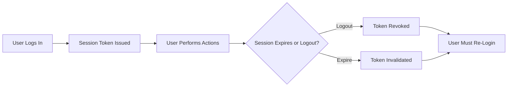
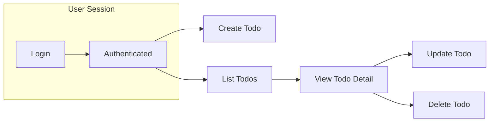

# Minimal Todo List Application Requirements

## 1. Overview
A Todo List Application designed with strict minimalism—only essential backend operations are included. Users must register, log in, and manage personal todo items through Create, Read, Update, and Delete (CRUD). There are no public, guest, or administrative user roles; every action except registration requires authentication. Only a user's own data is ever visible or modifiable. This document defines the ONLY features to be implemented for the first production release.

## 2. User Actor
- The system SHALL define exactly one user actor: the "User".
- There are NO administrator roles, NO guest/public access, NO third-party integrations, and NO role switching.
- The "User" actor is described as: "A registered individual who can login and securely manage their own todo items within their private scope."

## 3. Registration and Authentication Flows
### Requirements and Business Rules
- WHEN any person attempts to register, THE system SHALL require both email and password; all must be valid and not in use.
- WHEN registration completes, THE system SHALL create an exclusive user account and enable login.
- IF registration fields are invalid or the email is already registered, THEN THE system SHALL return actionable error codes/messages.
- Email addresses SHALL be unique per user.
- Passwords SHALL meet minimum security standards: 8+ characters, not trivially guessable.
- THERE SHALL NOT be social/OAuth registrations in the minimal app.

#### Mermaid: Registration Flow
```mermaid
graph LR
    A["Begin Registration"] --> B["Input Email/Password"]
    B --> C{"Are Fields Valid?"}
    C -->|"Yes"| D["Check Email Uniqueness"]
    C -->|"No"| E["Show Validation Error"]
    D -->{"Is Email New?"}
    D -->|"Yes"| F["Create Account"]
    D -->|"No"| G["Show Duplicate Email Error"]
    F --> H["Prompt Login"]
```

### Authentication & Session Management
- WHEN a user logs in using correct credentials, THE system SHALL create a session (using JWT or equivalent token).
- WHEN a user logs out, THE system SHALL immediately invalidate the session token.
- IF a user is inactive and the session times out, THE system SHALL require login again before any further action.
- Only active, authenticated sessions authorize other actions.

#### Mermaid: Authentication and Session Flow


## 4. Todo Management (CRUD)
### General Principles
- A user can only create, view, update, or delete their own todos.
- Todos SHALL have only minimal fields: title, description, completion status, created timestamp.
- No user can view or access another user's todos at any time.

### CRUD Requirements (EARS)
- WHEN an authenticated user submits a new todo, THE system SHALL validate required fields and associate the new todo with the authenticated user.
- IF creation data is missing/invalid, THEN THE system SHALL reject with actionable error messaging.
- WHEN an authenticated user requests their todo list, THE system SHALL return all and only their todos.
- WHEN a user requests a todo detail, THE system SHALL confirm ownership before returning data.
- IF a user requests or tries to access a todo not owned by them (or that does not exist), THEN THE system SHALL deny access and return an appropriate error.
- WHEN a user updates a todo, THE system SHALL validate input, confirm user ownership, and apply updates only if both checks pass.
- IF update fails due to ownership or data issues, THEN THE system SHALL reject and return a business logic error.
- WHEN a user requests to delete a todo, THE system SHALL require confirmation of ownership and existence, then remove the todo item if checks pass.
- IF the todo is non-existent or not user-owned, THEN THE system SHALL reject the request and provide an error notification.

#### Mermaid: End-to-End CRUD Flow


## 5. Error Handling, Validation, and User Experience
- WHEN performing registration, login, CRUD, or logout, THE system SHALL respond within 2 seconds under normal server load.
- Input data SHALL always be validated for format and business logic before processing.
- THE system SHALL send informative, actionable, business-suitable error messages for all rejection scenarios.
- No system, operational, or technical details SHALL be leaked in any error response.
- All actions that create, update, or delete resources MUST be idempotent—repeated requests shall not cause duplicate actions or inconsistent state.
- At no point SHALL any user ever view or interact with data owned by another user.
- WHEN session tokens are expired or invalid, THE system SHALL reject with a clear invalid session error.
- Ownership tracking of todos SHALL guarantee absolutely exclusive user data separation at all times.

## 6. Summary and Scope Boundaries
- The backend SHALL NOT support administrative functions, external integrations, reporting, analytics, notifications, UI-specific logic, or business features outside the registration/authentication and personal todo CRUD domain.
- All requirements are stated only in natural language suitable for backend engineering, using the EARS format for clarity, actionability, and testing alignment.
