# User Scenarios for Todo Application

## Overview

This document describes how users interact with the Todo application through detailed, step-by-step scenarios. These scenarios represent real-world usage patterns and help developers understand the complete user experience, including both successful operations and error handling.

Each scenario is written from the user's perspective, showing what they see, what they do, and how the system responds. These scenarios complement the functional requirements by providing context and workflow details.

---

## Primary User Scenarios

### Scenario 1: New User Registration and First Todo Creation

**User Type:** New, unregistered person
**Goal:** Create an account and add their first todo item
**Context:** User visits the Todo application for the first time

#### Step-by-Step Interaction:

1. User arrives at the application and sees a welcome screen
2. User clicks or selects "Sign Up" / "Create Account" option
3. System presents registration form requesting:
   - Email address
   - Password
   - Password confirmation
4. User enters their email (e.g., john@example.com)
5. User enters a password and confirms it
6. User submits the registration form
7. **System validation:** Checks if email is valid format and not already registered
8. **System validation:** Checks if passwords match and meet minimum requirements (8 characters)
9. IF validation passes: System creates the account and automatically logs the user in
10. IF validation fails: System displays clear error message (e.g., "Email already exists" or "Passwords don't match")
11. User is taken to their empty todo list view
12. User sees a message indicating they have no todos yet
13. User clicks "Create New Todo" button
14. System shows a form with a text field for todo description
15. User enters a todo description (e.g., "Buy groceries")
16. User submits the form
17. System validates the todo is not empty and not excessively long
18. System creates the todo item with default properties:
    - Status: Active/Incomplete
    - Created date: Current date/time
    - Completion date: Empty (not yet completed)
    - Priority: Medium (default)
19. System displays the new todo in the list
20. User sees their first todo item displayed with options to complete or delete it

#### Expected System Behavior:
- Registration confirmation is immediate (no email verification for MVP)
- User session is automatically created after successful registration
- Empty todo list displays helpful guidance
- New todos appear immediately in the list
- User remains logged in throughout the process

#### Success Criteria:
- User account created with correct email and secure password
- First todo item created and visible in the list
- User is authenticated and can continue using the app
- Default values are properly assigned (status: active, priority: medium)

---

### Scenario 2: Daily Todo List Management

**User Type:** Existing authenticated user
**Goal:** Review, add, and manage todos for the day
**Context:** User logs in on a regular workday

#### Step-by-Step Interaction:

1. User opens the Todo application
2. User sees login screen (because session has expired or device was closed)
3. User enters their email address
4. User enters their password
5. User submits login form
6. **System validation:** Checks if email exists and password is correct
7. IF validation passes: System authenticates user and creates a new session
8. IF validation fails: System shows error message (e.g., "Email or password incorrect")
9. User is presented with their complete todo list
10. User reviews all active/incomplete todos from previous days and today
11. User scans through the list to understand their workload
12. User decides to add a new todo for today
13. User clicks "Add New Todo" button
14. User types description: "Prepare presentation slides"
15. User optionally adds priority "High" and due date "2025-11-02"
16. User submits the new todo
17. System validates:
    - Title is not empty
    - Title does not exceed 255 characters
    - Due date (if provided) is not in the past
    - Priority (if provided) is one of: Low, Medium, High
18. System creates the todo and displays it in the list
19. User sees the new todo added to the list (sorted by creation date, newest first)
20. User notices several completed todos from past days are still shown
21. User wants to focus on active todos only
22. User selects or clicks "Show Active Todos Only" filter/view
23. System filters the display to show only incomplete todos
24. User now sees a cleaner view with just active tasks
25. User reviews the filtered list and understands their current workload

#### Expected System Behavior:
- Session is properly authenticated with valid credentials
- Todo list loads showing all todos by default (active and completed)
- New todos are immediately visible after creation
- Filtering/viewing options work instantly
- User can switch between views without losing data
- Error messages are specific about validation failures

#### Success Criteria:
- User successfully authenticates with email and password
- Todo list displays correctly with all user's todos
- New todo appears immediately after creation
- Filtering works as expected
- User can effectively manage their todos
- Default priority (Medium) is assigned if not specified

---

### Scenario 3: Completing and Tracking Progress

**User Type:** Authenticated user working through their todos
**Goal:** Mark todos as complete and see progress
**Context:** User has multiple active todos and completes them throughout the day

#### Step-by-Step Interaction:

1. User views their active todo list with 5 items
2. User completes their first task (e.g., "Call client")
3. User clicks the checkbox or "Mark Complete" button next to that todo
4. System validates the action (user owns this todo, todo exists, user is authenticated)
5. System marks the todo as complete and records the completion timestamp
6. System updates the display:
   - Todo appears with completed styling (e.g., strikethrough, different color)
   - OR todo disappears from active view if using active-only filter
7. User sees the visual feedback that todo is complete
8. User continues working and completes another todo
9. User marks it complete using the same process
10. System records completion timestamp for the second todo
11. User wants to see all their completed work for today
12. User switches view to "Show Completed Todos" or similar option
13. System displays only the completed todos with timestamps
14. User sees a list of completed items with completion dates/times (e.g., "Completed today at 2:30 PM")
15. User feels a sense of accomplishment seeing completed work
16. User returns to active todo view to continue with remaining tasks
17. System shows only incomplete todos again

#### Expected System Behavior:
- Completion action is instant and provides visual feedback
- Completed todos are marked with clear visual indicators
- User can switch between views (active/completed) without losing data
- Completion timestamps are recorded automatically in system
- Todos do not disappear unexpectedly from the system
- Status can be changed back from completed to active if needed

#### Success Criteria:
- Todos can be marked complete successfully
- Completion status persists correctly across sessions
- View filtering shows appropriate todos based on status
- User can track what has been completed
- Visual feedback is clear and immediate
- Completion timestamps are recorded and visible to user

---

### Scenario 4: Editing and Organizing Todos

**User Type:** Authenticated user refining their todo list
**Goal:** Update, edit, and reorganize existing todos
**Context:** User realized a todo needs different wording or priority

#### Step-by-Step Interaction:

1. User is viewing their active todo list
2. User sees a todo they created: "Buy groceris" (typo)
3. User wants to fix the typo
4. User clicks the edit button/icon on that todo
5. System displays an edit form with:
   - Current todo description: "Buy groceris"
   - Current priority: "Medium"
   - Current due date (if any)
   - Any other editable fields
6. User modifies the text to: "Buy groceries"
7. User optionally changes priority to "Low"
8. User submits the edit form
9. **System validation:** Checks new description is not empty and valid
10. **System validation:** Checks priority is one of the allowed values (Low, Medium, High)
11. System saves the changes
12. System updates the modified timestamp
13. System updates the display with the corrected text and priority
14. User sees the todo now correctly displays: "Buy groceries" with "Low" priority
15. User receives confirmation message: "Todo updated successfully"
16. Later, user wants to delete a todo they no longer need
17. User finds the todo: "Clean garage" (decided not to do it)
18. User clicks the delete button/icon
19. System shows a confirmation message: "Are you sure you want to delete this todo? This action cannot be undone."
20. User confirms deletion by clicking "Yes" or "Delete" button
21. System removes the todo from the list permanently
22. System updates the display immediately
23. User no longer sees that todo in their list
24. User receives confirmation: "Todo deleted successfully"
25. User feels their list is now clean and accurate

#### Expected System Behavior:
- Edit form displays current data
- Changes are saved immediately after validation
- Deletion requires explicit confirmation before permanent removal
- Display updates instantly after changes are made
- No data loss occurs unless explicitly deleted by user
- Edit and delete operations only work on user's own todos
- All changes are validated before being saved
- Appropriate error messages if validation fails

#### Success Criteria:
- Todos can be edited and changes persist
- Edited todos display updated information
- Modified timestamp is updated on changes
- Todos can be deleted with confirmation
- Deleted todos are permanently removed
- User cannot accidentally lose data without confirmation
- Only the todo owner can edit/delete their todos
- Invalid data (empty title, etc.) is rejected with clear messages

---

## Alternative Scenarios

### Scenario 5: Attempting to Add Invalid Todo

**User Type:** Authenticated user
**Goal:** Attempting to create a todo
**Context:** User attempts various invalid inputs

#### Step-by-Step Interaction:

1. User clicks "Add New Todo"
2. User sees the todo creation form
3. User accidentally submits without entering any text (empty field)
4. System validates the input
5. System detects empty todo description
6. System shows an error message: "Todo title cannot be empty. Please enter a title for your todo."
7. Todo is NOT created
8. User sees the form is still ready for input with any previous text preserved
9. User enters a description: "This is an extremely long todo that goes on and on and on... [continues for thousands of characters beyond system limits]"
10. User submits the form
11. System validates the length of the todo
12. System detects the todo exceeds maximum length (255 characters)
13. System shows error: "Todo title is too long (maximum 255 characters). Please shorten your title."
14. Todo is NOT created
15. User sees the form still has their text and can edit it
16. User modifies the text to a reasonable length: "Prepare quarterly budget report"
17. User submits again
18. **System validation:** Passes all checks
19. System creates the todo successfully
20. User sees their valid todo in the list
21. User receives confirmation: "Todo created successfully"

#### Expected System Behavior:
- Empty todos are rejected with clear messages
- Oversized todos are rejected with clear messages
- Validation errors show what went wrong and how to fix it
- User can resubmit after fixing the issue
- User's input is preserved after errors (where safe to do so)
- No partial/corrupted todos are created
- Validation happens before saving to database

#### Success Criteria:
- Invalid todos are never created
- User receives clear feedback about what went wrong
- Error messages guide user on how to correct the problem
- User can correct and resubmit successfully
- Valid todos are successfully created after correction

---

### Scenario 6: Viewing Completed Work from Previous Days

**User Type:** Authenticated user with history
**Goal:** Review past completed work
**Context:** User wants to see what they accomplished last week

#### Step-by-Step Interaction:

1. User is viewing their active todo list (default view)
2. User wants to see completed todos from previous days
3. User selects "Show Completed Todos" view option
4. System displays todos marked as complete with their completion dates
5. User sees todos completed from today, yesterday, and previous days
6. User can see when each todo was completed (date and time)
7. User reviews their productivity over time
8. User sees they completed:
   - "Buy groceries" - completed today at 2:30 PM
   - "Fix bug in login" - completed yesterday at 5:00 PM
   - "Team meeting" - completed 2 days ago at 10:00 AM
   - "Review design mockups" - completed 5 days ago at 3:15 PM
9. User feels satisfied with their productivity
10. User can click on any completed todo to see full details
11. User can switch back to active todos view
12. System returns to showing only incomplete todos
13. User's history is preserved and accessible whenever they want to review it

#### Expected System Behavior:
- Completed todos are preserved with timestamps
- User can access history easily through view switching
- Completion times are recorded accurately
- User can navigate between views without data loss
- System maintains both active and completed data
- Deleted todos do not appear in completed view

#### Success Criteria:
- Completed todos remain in the system after marking complete
- Completion dates/times are visible and accurate
- User can view their history of completed work
- User can return to active view without data loss
- Switching views shows appropriate todos

---

### Scenario 7: Forgotten Password Recovery

**User Type:** Existing user with forgotten password
**Goal:** Regain access to their account
**Context:** User forgot their password and cannot log in

#### Step-by-Step Interaction:

1. User attempts to log in with their email
2. User cannot remember their password
3. User looks for a "Forgot Password" link on login screen
4. User clicks "Forgot Password"
5. System displays a password reset form asking for email
6. User enters their email: "jane@example.com"
7. User submits the password reset request
8. **System validation:** Checks if email exists in system
9. IF email exists: System shows message "If an account exists with this email, you will receive password reset instructions"
10. System sends password reset link to the email (or indicates it would in MVP)
11. User checks their email inbox
12. User receives email with subject "Password Reset Request for Todo App"
13. User clicks the reset link in the email
14. System validates the reset token/link is valid and not expired
15. System displays password reset form
16. User enters new password: "NewSecurePassword123"
17. User confirms new password: "NewSecurePassword123"
18. User submits the form
19. **System validation:** Checks passwords match and meet requirements (8+ characters)
20. IF validation fails: System shows error about password requirements
21. User corrects password if needed
22. System updates the password in the database
23. System shows success message: "Password has been reset successfully. You can now log in with your new password."
24. User is redirected to login page
25. User enters email and new password
26. System authenticates with new credentials
27. User can now log in successfully

#### Expected System Behavior:
- Password reset is accessible from login screen
- Reset email/process indicates whether email was found (security best practice)
- Reset links/tokens are time-limited (expire after 1 hour)
- New password is immediately usable for login
- User is not automatically logged in after reset (security)
- Old sessions are invalidated after password change
- Password requirements are enforced during reset

#### Success Criteria:
- User can request password reset from login page
- Reset process is secure (token-based, time-limited)
- User can set a new password
- User can log in with new password immediately
- Account access is restored successfully

---

### Scenario 8: Session Timeout and Re-authentication

**User Type:** Authenticated user with expired session
**Goal:** Resume using the app after session expires
**Context:** User was idle for extended period and session expired

#### Step-by-Step Interaction:

1. User is actively using their todo list
2. User gets called away and leaves the browser open
3. User is away for several hours (session expires after 30 minutes of inactivity)
4. User returns and tries to add a new todo
5. System checks the user's session/authentication token
6. System detects the session is expired
7. System prevents the action and shows: "Your session has expired. Please log in again to continue."
8. User is redirected to the login screen
9. User enters their email and password again
10. System authenticates the user with fresh credentials
11. System creates a new session/authentication token
12. User is returned to their todo list
13. User sees all their todos are still there (no data was lost)
14. User can immediately continue adding/managing todos
15. User's new session is active and ready for use

#### Expected System Behavior:
- Expired sessions are properly detected before attempting operations
- User receives clear message about what happened and why
- Login is simple and straightforward after session expiration
- User data is never lost due to session expiration
- New session is created after successful re-authentication
- Previous session is properly invalidated
- User can resume work immediately after re-authentication

#### Success Criteria:
- Expired sessions are handled gracefully
- User is informed why they need to re-authenticate
- Re-authentication is successful and quick
- User data is preserved after session expiration
- User can continue using app immediately after login
- No todos are lost due to session timeout

---

## Edge Cases & Exception Handling

### Case 1: Duplicate Todo Prevention Attempt

**Scenario:** User attempts to create the same todo multiple times

**User Interaction:**
1. User has todo: "Call mom"
2. User clicks "Add New Todo" and enters: "Call mom"
3. User submits the form
4. System checks if this exact todo already exists
5. **System Behavior:** The system allows users to create identical todos (duplicates are permitted)
6. System creates the second "Call mom" todo
7. User now has two identical todos in their list
8. Both todos have different IDs and can be managed independently

**Alternative Behavior (if duplicates are NOT allowed):**
1. System checks for existing todo with same title
2. System detects duplicate and prevents creation
3. System shows message: "You already have a todo with this title. Did you mean to edit the existing one?"
4. Todo is NOT created
5. User can either create a different todo or edit the existing one

**Expected Behavior:**
- System clearly communicates whether duplicates are allowed
- User is not surprised by the result
- Duplicates are either prevented or allowed consistently

---

### Case 2: Concurrent Edit by Same User

**Scenario:** User makes changes on two different devices/windows simultaneously

**User Interaction:**
1. User has todo list open on laptop and phone
2. User marks a todo complete on laptop
3. Simultaneously, user edits that same todo on phone (changes title to "Buy groceries for dinner")
4. System handles the conflict appropriately using last-write-wins strategy:
   - The phone edit is processed after laptop completion
   - Final state: Todo is marked completed AND has new title "Buy groceries for dinner"
5. User ends up with a consistent state (no corrupted data)
6. One action takes precedence clearly
7. When user opens both devices, they see the consistent final state

**Expected Behavior:**
- No data corruption occurs
- System handles conflict gracefully
- User may be informed of any recent changes
- Final state is consistent and predictable
- Both operations complete successfully

---

### Case 3: Delete Confirmation Cancellation

**Scenario:** User starts to delete a todo but cancels

**User Interaction:**
1. User clicks delete button on a todo titled "Clean house"
2. System shows confirmation dialog: "Are you sure you want to delete 'Clean house'? This action cannot be undone."
3. User thinks: "Actually, I still need to do this"
4. User clicks "Cancel" button
5. System closes the confirmation dialog
6. Todo remains in the list unchanged
7. User can continue working with the todo

**Expected Behavior:**
- Confirmation dialog has clear Cancel option
- Cancellation is effective immediately
- No accidental deletions occur
- User can try again if needed
- Todo data is completely preserved

---

### Case 4: Network Interruption During Todo Creation

**Scenario:** User's network connection drops while creating a todo

**User Interaction:**
1. User enters a todo description: "Prepare presentation"
2. User submits the form (network is still connected)
3. Network connection drops before server responds
4. System cannot confirm creation
5. User sees an error message: "Could not save todo. Please check your connection and try again."
6. User's entered text is still in the form (not lost)
7. User checks their connection
8. User's connection is restored
9. User clicks "Save" button again
10. System successfully creates the todo
11. Todo appears in the list with unique ID
12. System confirms: "Todo created successfully"

**Expected Behavior:**
- User input is never lost due to network issues
- Error messages are clear about what happened
- User can retry the operation after connection restored
- No duplicate todos are created from multiple retries
- System gracefully handles network failures
- User knows to check their connection

#### Success Criteria:
- Todo is eventually created after network recovery
- User data is not lost
- No duplicate todos created from retries
- Clear communication about network state

---

### Case 5: Invalid Email During Registration

**Scenario:** User enters invalid email format

**User Interaction:**
1. User fills registration form
2. User enters email: "notanemail" (missing @domain)
3. User submits form
4. System validates email format
5. System detects invalid format
6. System shows error: "Please enter a valid email address (example: user@example.com)"
7. Registration form is displayed again with error highlighted
8. User sees form is still filled with their previous input
9. User corrects email to: "user@example.com"
10. User re-enters password
11. User resubmits form
12. System validates the valid email
13. System validates passwords match and meet requirements
14. System accepts the valid email and completes registration
15. User account is created successfully

**Expected Behavior:**
- Email format validation is enforced
- User is shown what format is expected
- User's data is preserved for correction
- Valid emails are accepted without delay
- Clear guidance on fixing the error

#### Success Criteria:
- Invalid emails are rejected
- User knows what format is needed
- Valid emails are accepted
- Registration completes after correction

---

## User Journey Flows

### Journey 1: Complete New User Onboarding

```mermaid
graph LR
    A["User Arrives at App"] --> B["See Registration Option"]
    B --> C["Click Sign Up"]
    C --> D["Enter Email & Password"]
    D --> E["Submit Registration"]
    E --> F{\"Validation Passes?\"}
    F -->|"No"| G["Show Error Message"]
    G --> D
    F -->|"Yes"| H["Account Created"]
    H --> I["Auto-Login User"]
    I --> J["Show Empty Todo List"]
    J --> K["User Clicks Add Todo"]
    K --> L["Enter Todo Description"]
    L --> M["Submit Todo"]
    M --> N{\"Valid Todo?\"}
    N -->|"No"| O["Show Error Message"]
    O --> L
    N -->|"Yes"| P["Todo Created"]
    P --> Q["Display in List"]
    Q --> R["User Sees First Todo"]
    R --> S["Onboarding Complete"]
```

**Journey Duration:** 5-10 minutes
**Success Criteria:** User has working account with first todo
**Pain Points:** Password requirements, form validation errors

---

### Journey 2: Daily Todo Management Workflow

```mermaid
graph LR
    A["User Opens App"] --> B["See Login Screen"]
    B --> C["Enter Email & Password"]
    C --> D["Submit Login"]
    D --> E{\"Auth Successful?\"}
    E -->|"No"| F["Show Error"]
    F --> C
    E -->|"Yes"| G["Show Todo List"]
    G --> H["Review Active Todos"]
    H --> I["Add New Todo"]
    I --> J["Complete a Todo"]
    J --> K["Mark as Done"]
    K --> L["View Updated List"]
    L --> M["Edit a Todo"]
    M --> N["Save Changes"]
    N --> O["Logout or Close App"]
```

**Journey Duration:** 5-30 minutes (varies by user workload)
**Success Criteria:** User completes/updates todos, changes persist
**Pain Points:** Finding todos to manage, remembering what needs doing

---

### Journey 3: Productivity Tracking and Reflection

```mermaid
graph LR
    A["User Logs In"] --> B["View Active Todos"]
    B --> C["Complete Several Todos"]
    C --> D["Decide to Check Progress"]
    D --> E["Switch to Completed View"]
    E --> F["See Completed Todos with Timestamps"]
    F --> G["Review Accomplishments"]
    G --> H["Feel Sense of Progress"]
    H --> I["Return to Active Todos"]
    I --> J["Continue Working"]
```



**Journey Duration:** 15-60 minutes (throughout day)
**Success Criteria:** User sees accomplishments and motivation maintained
**Pain Points:** Tracking progress, maintaining motivation

---

## Error Recovery Scenarios

### Scenario: Handling Password Requirement Failures

**User Attempts:** Password is too short (less than 8 characters)

1. User enters password: "pass123" (only 7 characters)
2. User submits registration
3. System validates password length
4. System shows error: "Password must be at least 8 characters long"
5. **User Recovery Option:**
   - User sees form still has email filled in
   - User enters longer password: "password123"
   - User submits again successfully
6. Registration proceeds normally
7. Account is created

**System Behavior:** Clear error about what failed, allows retry without losing data

---

### Scenario: Handling Duplicate Email Registration

**User Attempts:** Email already registered

1. User enters email: "john@example.com" (already exists)
2. User creates password and submits
3. System checks email uniqueness
4. System shows error: "An account with this email already exists. Please log in instead or use a different email."
5. **User Recovery Options:**
   - Use forgot password to recover existing account
   - Use different email for new account
   - Proceed to login screen
6. User chooses to log in and regains access

**System Behavior:** Informative message about the problem with clear recovery options

---

### Scenario: Todo Already Exists (If Applicable)

**User Attempts:** Create exact duplicate todo

1. User has todo: "Buy milk"
2. User tries to create: "Buy milk" again
3. System detects that duplicates are allowed
4. System creates the second "Buy milk" todo
5. User now has two "Buy milk" todos
6. Both todos have different IDs and timestamps
7. User can manage them independently

**System Behavior:** Allows duplicate todos since no restriction is defined for MVP

---

## Summary of User Interaction Patterns

### Common Workflow Sequence:
1. **Authentication:** User logs in or registers
2. **View:** User sees their current todo list
3. **Action:** User adds, edits, completes, or deletes a todo
4. **Feedback:** System provides immediate visual confirmation
5. **Persistence:** Changes are saved automatically
6. **Continuation:** User can perform more actions or log out

### Key User Expectations:
- **Immediate Feedback:** Actions should feel instant, not delayed (within 1-2 seconds)
- **Data Preservation:** User data should never be lost unexpectedly
- **Clear Error Messages:** If something fails, user knows why and how to fix it
- **Easy Recovery:** User can correct mistakes easily and resubmit
- **Intuitive Navigation:** User can find what they need without confusion
- **Reliable Persistence:** Todos are always saved and available
- **Confirmation for Destructive Actions:** Delete requires confirmation to prevent accidents

### Design Implications for Developers:
- All operations should provide immediate response feedback within 1-3 seconds
- Errors should be descriptive and actionable, not generic
- Confirmations should be required for destructive actions (delete)
- User data must be validated before storage
- Sessions should persist appropriately with clear expiration messaging
- System should handle network interruptions gracefully
- All interactions should work consistently across devices
- Validation errors should preserve user input for correction
- System should provide clear status updates for all operations

---

> *Developer Note: This document defines **business requirements and user scenarios only**. All technical implementations (architecture, APIs, database design, session management specifics, etc.) are at the discretion of the development team.*