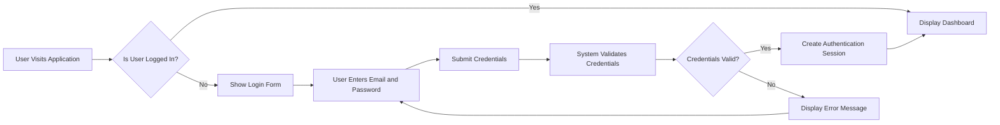
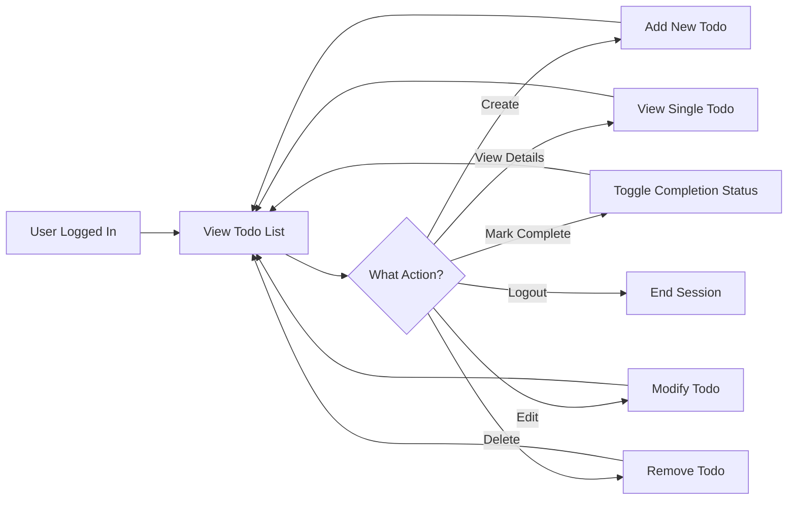
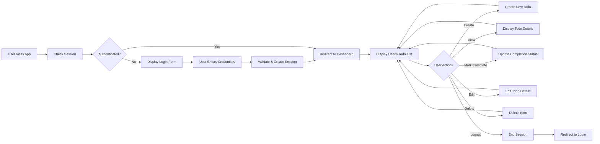

# User Workflows and Scenarios

## Overview

This document describes the complete user journeys, workflows, and primary use cases for the Todo list application. It details how users interact with the system from registration through daily todo management activities. These workflows form the foundation for all backend functionality and define the critical business processes that drive user engagement.

The Todo application follows a straightforward interaction model focused on minimum viable functionality: users register, log in, and manage their personal todo items through basic create, read, update, and delete operations.

## User Registration and Onboarding

### Registration Flow

New users begin their journey by creating an account in the system. This process establishes their identity and prepares them to access their personal todo workspace.

WHEN a new user visits the application, THE system SHALL present a registration form requesting essential account information.

WHEN a user submits registration information (email and password), THE system SHALL validate the provided credentials and create a new user account.

WHEN registration is completed successfully, THE system SHALL create a new user record and establish their authenticated session.

IF a user provides an email address that already exists in the system, THEN the system SHALL reject the registration and display an error message indicating the email is already registered.

IF a user provides a password that does not meet security requirements (minimum 8 characters, at least one uppercase letter, one lowercase letter, and one number), THEN the system SHALL reject the registration and specify the password requirements.

### First-Time User Experience

WHEN a user successfully registers and logs in for the first time, THE system SHALL display an empty todo list with a welcome message and clear instructions on how to create their first todo item.

THE system SHALL provide an obvious call-to-action button or interface element to guide new users toward creating their first todo item.

---

## User Login and Session Management

### Authentication Workflow

Returning users authenticate by providing their credentials to access their personal todo workspace and previously saved items.

### Login Process Details

WHEN a user accesses the application, THE system SHALL check if the user has an active authenticated session.

WHEN a user does not have an active session, THE system SHALL display a login form requesting email and password.

WHEN a user submits their email and password, THE system SHALL validate the credentials against stored user records.

WHEN credentials are valid, THE system SHALL create an authenticated session using JWT (JSON Web Token) and grant access to the user's personal todo workspace.

IF the email address does not exist in the system, THEN the system SHALL display a generic authentication error message (for security reasons, not indicating whether the email exists).

IF the password is incorrect, THEN the system SHALL display a generic authentication error message and allow the user to retry.

### Session Management

THE user's session SHALL remain active for 30 days of inactivity, after which the user must log in again.

THE system SHALL store the JWT token securely, either in an httpOnly cookie or in local storage (as per deployment specifications).

WHEN a user's session expires, THE system SHALL redirect them to the login form on their next action.

---

## Primary User Workflow: Managing Daily Todos

The core user workflow involves a simple, repeatable cycle: users log in, view their todo list, perform CRUD operations (create, read, update, delete), mark items as complete, and eventually log out. This workflow represents the daily interaction pattern that drives value for users.

THE user's todo list SHALL be the primary interface after login, displaying all their todos in a single view.

THE system SHALL display todos with their current status (complete or incomplete), allowing users to quickly assess their tasks.

WHEN a user performs any action on their todos, THE system SHALL immediately reflect the changes in the user's view.

---

## Detailed User Scenarios

### Scenario 1: Creating a New Todo

This is the most fundamental action in the application. Users create todo items to capture new tasks they need to complete.

#### Step-by-Step Interaction

1. **User Initiates Creation**: User clicks the "Create Todo" button or similar call-to-action on their todo list page.

2. **System Presents Input Form**: The system displays a form requesting the todo information (at minimum, a title/description field).

3. **User Enters Todo Details**: The user types the todo description (e.g., "Buy groceries", "Complete project report").

4. **System Validates Input**: 
   - WHEN a user submits a new todo, THE system SHALL validate that the todo title is not empty.
   - WHEN a user submits a new todo, THE system SHALL validate that the todo title does not exceed 255 characters.
   - IF validation fails, THEN the system SHALL display a specific error message and allow the user to correct the input.

5. **System Creates Todo**: Upon successful validation, the system stores the new todo item in the database associated with the user's account.

6. **System Confirms Creation**: The system displays a success message and immediately adds the newly created todo to the user's visible todo list.

#### EARS Format Requirements

WHEN a user submits a new todo item with a valid title, THE system SHALL create the todo item, assign it a unique identifier, mark it as incomplete by default, and add it to the user's todo list.

WHEN a user creates a new todo, THE system SHALL record the creation timestamp automatically.

THE newly created todo SHALL appear at the top of the user's todo list (or per specified ordering).

IF a user attempts to create a todo with an empty title, THEN the system SHALL display an error message: "Todo title cannot be empty. Please enter a task description."

IF a user attempts to create a todo with a title exceeding 255 characters, THEN the system SHALL display an error message: "Todo title is too long. Maximum 255 characters allowed."

WHILE a user is in the todo creation form, THE system SHALL provide clear guidance on any input requirements or limitations.

---

### Scenario 2: Viewing Todo List

Users need to see all their todos to understand their workload and decide what to work on next. This is the primary interface for users after login.

#### Step-by-Step Interaction

1. **User Navigates to Todo List**: After login, the user is automatically directed to their todo list, or they click a navigation link to view their todos.

2. **System Retrieves Todos**: The system fetches all todos belonging to the authenticated user.

3. **System Displays List**: The system displays the complete list of user's todos with their current states (complete/incomplete).

4. **User Reviews Todos**: The user scans the list to see what tasks need to be completed.

#### Display Requirements

WHEN a user views their todo list, THE system SHALL display all of the user's todo items in a list format.

THE system SHALL display each todo with at minimum: the todo title, completion status (complete/incomplete indicator), and action buttons.

THE system SHALL display incomplete todos and complete todos in a way that clearly distinguishes their status.

WHEN a user has no todos, THE system SHALL display a message such as "You have no todos. Create one to get started!" to guide them toward creating their first item.

THE system SHALL respond with the todo list within 2 seconds from user request.

---

### Scenario 3: Marking Todo as Complete

Users frequently need to mark todos as complete as they finish tasks. This is a common interaction that provides a sense of progress and accomplishment.

#### Step-by-Step Interaction

1. **User Identifies Completed Task**: User finds the todo item they have just completed in their list.

2. **User Marks as Complete**: User clicks a checkbox, toggle button, or "Mark Complete" action next to the todo item.

3. **System Updates Status**: The system immediately changes the todo's completion status from incomplete to complete.

4. **System Reflects Change**: The todo item's appearance updates to show it is complete (e.g., strikethrough text, different styling).

5. **User Continues Work**: User can proceed to other tasks.

#### EARS Format Requirements

WHEN a user clicks the completion toggle on a todo item, THE system SHALL immediately change the completion status of that todo.

WHEN a user marks a todo as complete, THE system SHALL update the todo's completed_at timestamp to the current time.

WHEN a user marks a completed todo as incomplete again, THE system SHALL change the status back to incomplete and clear the completed_at timestamp.

THE system SHALL display the updated completion status immediately on the user's screen without requiring a page refresh.

THE system SHALL respond to completion status changes within 1 second.

---

### Scenario 4: Editing a Todo

Users sometimes need to modify todo items after creating them—to clarify the task, change priorities, or correct typos. This workflow allows users to update their todos.

#### Step-by-Step Interaction

1. **User Selects Edit Option**: User clicks an "Edit" button or similar action on the todo item they want to modify.

2. **System Displays Edit Form**: The system presents the current todo details in an editable form.

3. **User Modifies Content**: User updates the todo title or other editable properties.

4. **System Validates Changes**: The system validates the modified input according to the same rules as creation.

5. **System Saves Changes**: Upon validation, the system updates the todo in the database.

6. **System Confirms Update**: The system displays the updated todo with changes reflected immediately.

#### EARS Format Requirements

WHEN a user clicks the edit action on a todo item, THE system SHALL display the current todo content in an editable form.

WHEN a user submits changes to a todo, THE system SHALL validate the updated title according to the same rules as new todo creation.

WHEN a user saves changes to a todo, THE system SHALL update the todo's updated_at timestamp to the current time.

IF a user attempts to save an edited todo with an empty title, THEN the system SHALL display an error and prevent the save: "Todo title cannot be empty."

IF a user attempts to save an edited todo with a title exceeding 255 characters, THEN the system SHALL display an error and prevent the save: "Todo title is too long. Maximum 255 characters allowed."

WHEN an edit is successfully saved, THE system SHALL immediately display the updated todo in the list with no page refresh required.

THE system SHALL respond to edit operations within 2 seconds.

---

### Scenario 5: Deleting a Todo

Users need the ability to remove todos from their list when tasks are no longer relevant or were created in error. This workflow provides a clean way to remove items.

#### Step-by-Step Interaction

1. **User Selects Delete Option**: User clicks a "Delete" button, trash icon, or similar action on the todo item they want to remove.

2. **System Requests Confirmation**: To prevent accidental deletion, the system displays a confirmation dialog asking if the user is sure they want to delete this todo.

3. **User Confirms Deletion**: User clicks "Confirm Delete" or "Yes" to proceed with the deletion.

4. **System Removes Todo**: The system deletes the todo from the database.

5. **System Updates List**: The deleted todo immediately disappears from the user's todo list.

#### EARS Format Requirements

WHEN a user clicks the delete action on a todo item, THE system SHALL display a confirmation dialog before permanently removing the item.

THE confirmation dialog SHALL clearly state what action will be performed and ask the user to confirm.

WHEN a user confirms deletion, THE system SHALL permanently remove the todo item from the database and all associated data.

WHEN deletion is completed, THE system SHALL immediately remove the todo from the user's visible list.

WHEN a user cancels the deletion confirmation, THE system SHALL close the confirmation dialog and take no action on the todo item.

THE system SHALL respond to deletion operations within 2 seconds.

IF a user's todo list becomes empty after deletion, THE system SHALL display the empty state message: "You have no todos. Create one to get started!"

---

### Scenario 6: User Logout

Users need the ability to securely end their session, particularly on shared devices or when they are finished working.

#### Step-by-Step Interaction

1. **User Initiates Logout**: User clicks a "Logout" button or menu option, typically located in a navigation menu or user menu.

2. **System Terminates Session**: The system clears the user's authentication token and ends the session.

3. **System Redirects to Login**: The system redirects the user to the login page with a message confirming they have been logged out.

4. **User Session Ends**: Any subsequent requests from that session are rejected, and the user must log in again to access their todos.

#### EARS Format Requirements

WHEN a user clicks the logout button, THE system SHALL immediately clear the user's session token.

WHEN a user logs out, THE system SHALL invalidate any stored JWT tokens for that session.

WHEN logout is complete, THE system SHALL redirect the user to the login page and display a confirmation message: "You have been logged out successfully."

WHEN a user attempts to access the application after logout, THE system SHALL require them to log in again.

THE system SHALL complete the logout operation within 1 second.

---

## User Journey Map

The following diagram illustrates a typical user session from login through various todo management activities and eventual logout:

---

## Common User Paths and Variations

### Morning Routine - Checking and Planning Tasks

A typical user might follow this pattern:
1. Log in to the application
2. View their complete todo list
3. Identify incomplete tasks from previous days
4. Create new tasks for the current day
5. Review the prioritized list
6. Begin working on the first task
7. Log out when stepping away

### Task Completion Loop

When actively working:
1. View todo list
2. Select a task to work on
3. Complete the task in the real world
4. Return to the application
5. Mark the todo as complete
6. Move on to the next task
7. Repeat until all urgent tasks are complete

### Task Modification

When context changes:
1. View todo list
2. Identify a task that needs updating
3. Click edit
4. Modify the task description based on new information
5. Save changes
6. Continue with other tasks

### Cleanup and Maintenance

Periodically, users might:
1. Review their complete list
2. Find and delete outdated or irrelevant todos
3. Edit todos for clarity
4. Organize their list for the coming period

---

## User Expectations and System Behavior

### Response and Feedback

WHEN a user performs any action (create, edit, delete, mark complete), THE system SHALL provide immediate visual feedback of the change.

THE system SHALL NOT require page reloads for users to see updated information after their actions.

THE system SHALL display clear success messages when operations complete successfully.

THE system SHALL display clear, actionable error messages when operations fail.

### Data Consistency

THE user's todo list SHALL always reflect the current state of their data without requiring manual refresh.

WHEN a user performs multiple rapid actions, THE system SHALL handle them correctly and ensure data consistency.

### Accessibility and Ease of Use

THE interface SHALL be intuitive enough that new users can accomplish basic tasks (create, view, complete, delete) without instruction.

THE system SHALL provide clear labeling and guidance for all interactive elements.

THE action buttons and controls SHALL be prominently displayed and easy to locate.

---

## Edge Cases and Variations

### Empty List State

WHEN a user has no todos, THE system SHALL display an encouraging message and a prominent button to create their first todo.

### Many Todos (Large Lists)

WHEN a user has many todos, THE system SHALL display them efficiently (either all at once or with pagination).

THE system SHALL maintain responsive performance even with 100+ todos per user.

### Rapid Actions

WHEN a user performs multiple actions in quick succession (e.g., creating and immediately deleting), THE system SHALL process each action correctly and maintain data integrity.

### Network Issues

IF a user loses network connectivity during a todo operation, THEN the system SHALL notify the user and allow them to retry the operation once connectivity is restored.

### Concurrent Sessions

WHEN a user logs in from multiple devices or browser tabs simultaneously, THE system SHALL allow each session to function independently (each session has its own authentication token).

---

## Success Criteria for User Workflows

A successful implementation of these user workflows should enable:

1. ✅ Users can register and create accounts within 2 minutes
2. ✅ Users can log in and view their todos within 5 seconds
3. ✅ Users can create a new todo in less than 30 seconds
4. ✅ Users can mark a todo as complete in less than 2 seconds
5. ✅ Users can edit a todo in less than 1 minute
6. ✅ Users can delete a todo with confirmation in less than 30 seconds
7. ✅ Users can log out and securely end their session in less than 2 seconds
8. ✅ All user actions produce immediate, visible feedback
9. ✅ No data is lost during normal user operations
10. ✅ The system maintains data consistency across all user interactions