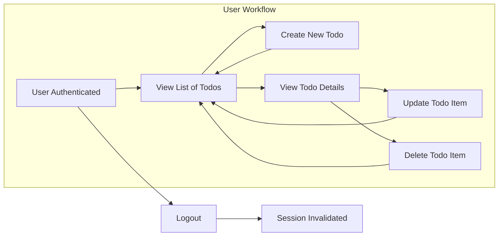

# Minimal Todo List Application — Business Requirements

## Core Features
The Todo List system is designed for individuals to securely manage their own personal todo items with the most minimal, essential feature set necessary for functional productivity. All features conform to principles of simplicity, user data isolation, and predictable behavior. There are no stretch, social, or advanced features allowed in scope.

### User Workflow Supported:
- Secure user registration, login, and logout
- Create new todo (task/item)
- List all personal todos
- View details of a specific todo
- Update an existing todo (title, description, completed status)
- Delete a personal todo

## Functional Requirements (EARS Format)
### Authentication and Session
- THE system SHALL require user registration by unique email and password.
- WHEN valid credentials are provided, THE system SHALL start a secure session for the user.
- IF login credentials are invalid, THEN THE system SHALL deny access and return an error message.
- WHEN a user logs out, THE system SHALL invalidate their session and tokens immediately.
- THE system SHALL enforce session expiration after 30 minutes of inactivity.
- IF session token is expired or invalid, THEN THE system SHALL deny further access until a new login.

### Todo Creation
- WHEN a user creates a todo, THE system SHALL require a non-empty title (1-255 characters).
- THE system SHALL allow an optional description field (up to 1000 characters).
- THE system SHALL set the new todo's completed status to false by default.
- THE system SHALL associate each todo only to its creator (strict user ownership).
- IF no valid session exists, THEN THE system SHALL reject todo creation with an authentication error message.
- IF the todo title is blank or >255 characters, THEN THE system SHALL reject the request with a clear error.

### Todo Listing and Retrieval
- WHEN a user requests their todo list, THE system SHALL return user's own todos only, in reverse chronological order by creation date.
- WHEN a user requests a specific todo by ID, THE system SHALL only return it if it belongs to the requesting user.
- IF a user requests a todo that does not exist or is not owned by them, THEN THE system SHALL return a not found or inaccessible error.
- THE system SHALL permit optional filtering of todo list by completion status.

### Todo Updating
- WHEN a user updates a todo, THE system SHALL permit updates only for their own items.
- THE system SHALL allow edits to title, description, and completed status.
- IF updated title is blank or >255 characters, THEN THE system SHALL reject the operation with a clear error.
- IF a user tries to update a todo not belonging to them or not existing, THE system SHALL reject with an inaccessible error.
- THE system SHALL store updatedAt timestamp and only update completedAt if status changes to completed; clear it if set to incomplete.

### Todo Deletion
- WHEN a user deletes a todo, THE system SHALL permanently remove the item if and only if it is owned by the user.
- IF a user tries to delete a todo that does not exist or is not theirs, THE system SHALL reject with an error indicating access violation or item not found.

### Completion Status and Data Ownership
- THE system SHALL manage a 'completed' boolean status per todo.
- WHEN a todo is marked complete, THE system SHALL record the timestamp; WHEN set incomplete, SHALL clear completedAt.
- THE system SHALL always restrict all operations to the data owned by the authenticated user.
- IF a user attempts any access to another user's data, THEN THE system SHALL reject and log the attempt as a violation.

### Field and Data Validation
- WHEN creating/updating todos, THE system SHALL trim whitespace from title and description.
- IF title is empty after trim or exceeds 255 chars, THEN THE system SHALL reject the request.
- IF description exceeds 1000 chars, THEN THE system SHALL reject the request.
- THE system SHALL treat 'id', 'createdAt', 'updatedAt', 'completedAt' as system-managed, read-only fields (never user-provided).

#### Required and Optional Fields
| Field         | Required | Type     | Details                                                    |
|---------------|----------|----------|------------------------------------------------------------|
| id            | auto     | string   | Unique identifier, system-generated, immutable             |
| ownerId       | auto     | string   | Matches current authenticated user session                 |
| title         | yes      | string   | 1-255 chars, not blank or whitespace only                  |
| description   | no       | string   | Optional, up to 1000 chars                                 |
| completed     | yes      | boolean  | true/false; default false on create                        |
| createdAt     | auto     | datetime | Set by system at creation                                  |
| updatedAt     | auto     | datetime | Set by system at update                                    |
| completedAt   | auto     | datetime | Set only when completed=true, else null                    |

## Actor, Permissions and Access Control
- The ONLY actor is the registered user; no admin, guest, or moderator.
- THE system SHALL never permit cross-user access for view/update/delete/creation.

| Feature                         | Permission             |
|----------------------------------|------------------------|
| Register                        | Any                    |
| Login/Logout                    | Own account only       |
| Create/List/Update/Delete todos | Own todos only         |
| Access others’ todos            | Never                  |

- IF an API request is not authenticated or not authorized for the current user, THEN THE system SHALL deny the request and provide a clear, actionable error message.

## Non-Functional Requirements, Constraints and Limits
- THE system SHALL restrict request JSON body size (<10KB per request).
- THE system SHALL limit todo list responses to 100 items maximum per request, recommend paginated retrieval.
- THE system SHALL respond to all requests within 2 seconds under normal operation.
- THE system SHALL ensure atomicity: creates, updates, deletes must not result in partial states (all or nothing per operation).
- THE system SHALL ensure all error messages are clear and meaningful in natural (end-user) language, not technical jargon.

## Business Process Flow Diagram

---

This requirement document constitutes the sole, production-ready business specification for the minimal Todo List backend application. All technical schema and API design are purposely omitted to maintain implementation flexibility for backend engineers.