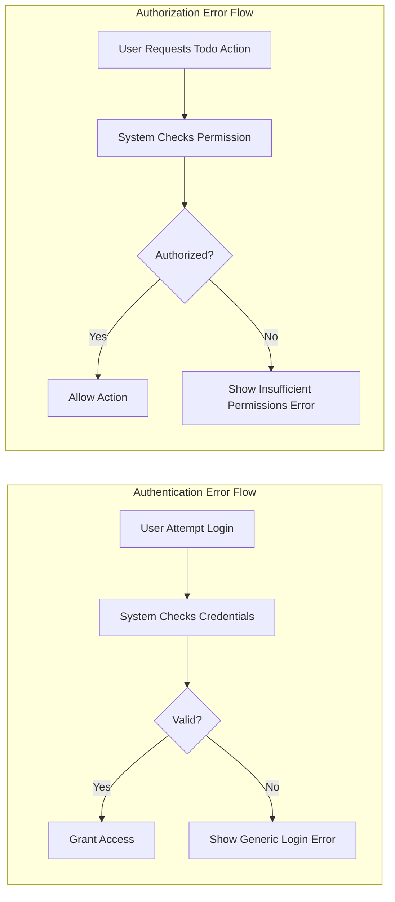
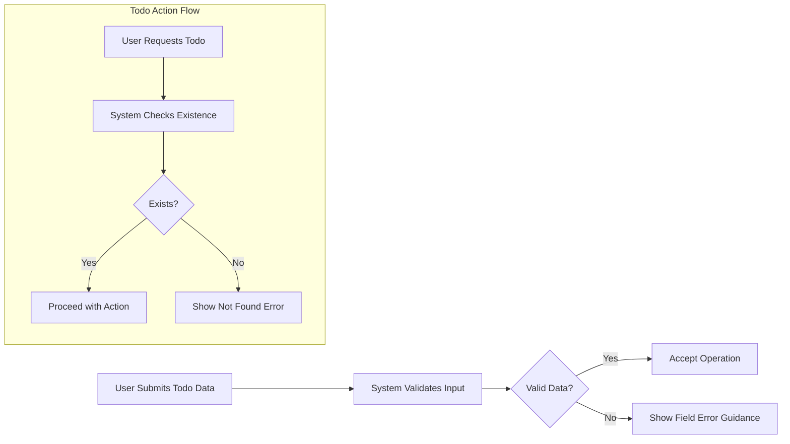
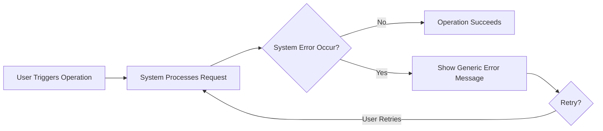

# Error Handling and Exception Management for Todo List Application

## Common Error Scenarios
A robust Todo List application must anticipate and explicitly handle all user-facing error cases. Key error scenarios include:

### Authentication Errors
- WHEN a user provides invalid login credentials, THE system SHALL deny access and SHALL inform the user the login attempt failed, WITHOUT indicating whether the email or password was incorrect.
- WHEN an authentication attempt uses an unregistered email, THE system SHALL treat this identically to an incorrect password, providing NO indication if the email exists.
- WHEN system features are accessed by a non-logged-in user, THE system SHALL reject the operation and SHALL require login first.
- WHEN the session or token has expired, THE system SHALL invalidate the request and SHALL require login again with a clear session expired message.

### Authorization Errors
- WHEN a user tries to view, update, or delete a todo owned by another user, THE system SHALL deny the action and SHALL explain that permissions are insufficient.
- WHEN any feature is accessed outside the permissions for that user’s actor type, THE system SHALL prohibit the action and SHALL explain the authorization failure.

### Resource Not Found Errors
- WHEN a user requests a todo resource that does not exist (never created or deleted), THE system SHALL reject the request and SHALL inform the user that the specified todo could not be found.
- WHEN a user attempts to update or delete a todo that is already deleted, THE system SHALL present a message that the resource no longer exists, WITHOUT revealing previous owner or content.

### Validation and Input Errors
- WHEN required fields (e.g., content) are missing or invalid, THE system SHALL reject the operation and SHALL clearly indicate the affected fields and correction needs, NEVER exposing technical details or validation logic.
- WHEN the user inputs data of the wrong type or in an invalid format, THE system SHALL present a business-meaningful message (e.g., "Todo content must not be empty.")

### Action Errors and Limitations
- WHEN a user exceeds business operation limits (such as max number of todos per user), THE system SHALL explain the limit reached and SHALL present actionable options, such as deleting old todos.
- WHEN an operation is attempted on an already deleted or otherwise logically unavailable resource, THE system SHALL unambiguously state that the operation cannot be completed.

### System and Unexpected Errors
- WHEN a backend/system error occurs not caused by user input, THE system SHALL present a generic error (“Something went wrong, please try again later.”), WITHOUT revealing internal system details, error codes, or stack traces.
- WHEN application is under maintenance or the backend is unavailable, THE system SHALL notify the user about temporary service unavailability and SHALL advise retry.

## Expected System Behavior (EARS-Format Requirements)
Each user-visible error case follows the EARS format to ensure each requirement is specific, testable, and actionable:
- WHEN a login attempt fails for any reason, THE system SHALL respond within 2 seconds with a generic login failure message.
- WHEN session/token is invalid or expired, THE system SHALL display a session expired message and SHALL require user re-authentication.
- WHEN a permission violation occurs, THE system SHALL provide an error message indicating lack of authorization, using consistent and non-technical language.
- WHEN a todo is not found (on read, update, or delete), THE system SHALL tell the user it cannot locate the requested todo.
- WHEN input validation fails, THE system SHALL identify the specific field(s) in error and SHALL provide actionable correction guidance, WITHOUT technical jargon.
- WHEN operation limits are reached, THE system SHALL inform the user and SHALL describe allowed remediation actions.
- WHEN a recoverable backend error occurs, THE system SHALL return a generic error prompt and SHALL automatically suggest retry if possible.
- WHEN an unrecoverable error or permanent failure occurs, THE system SHALL specify that the operation cannot be completed at this time and SHALL avoid raising expectations of further retries.

## User Messaging Principles
- Clarity: All error messages MUST be clear, concise, and never ambiguous.
- Security: Error responses MUST NEVER leak information about system internals, valid/invalid emails, technical details, stack traces, nor details about other users or todos.
- Consistency: The same type of error must always yield the same message pattern, regardless of underlying cause.
- Actionability: Users must always know what to do next (e.g., retry, correct a field, re-authenticate).
- Tone: All errors should use polite, neutral, and user-friendly language.

## Recovery and Retry Logic
- WHEN a correctable error (such as invalid input) is encountered, THE system SHALL guide the user to the specific field to fix, and SHALL retain any unaffected data for convenience.
- WHEN a transient or system error occurs, THE system SHALL advise retry and, where possible, transparently handle subsequent retries.
- WHEN a session expires, THE system SHALL require the user to log in again before further access to protected features.
- WHEN a non-retryable error occurs (as with a resource deleted permanently), THE system SHALL communicate this explicitly.
- At no point SHALL the system log users out or require additional authentication except in cases of explicit session expiry or security violation.

## Error Handling Workflows (with Mermaid Diagrams)

### Authentication and Authorization Error Handling

### Resource Not Found and Validation Error Flow

### System and Unexpected Error Flow

## Final Guidance for Backend Developers
All business rules in this document are mandatory for backend logic. Error handling MUST be built according to these requirements, and all error-related code paths MUST be tested for alignment with user messaging, recovery expectation, security, and actionability defined above. No backend implementation task is complete if user-facing error handling is not fully aligned with every requirement herein. For further business requirements, validation rules, or role/permission matrix details, see related project documentation as referenced in planning.