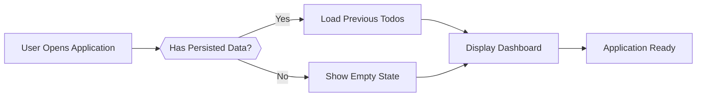
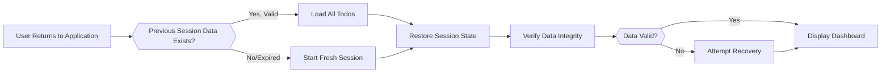
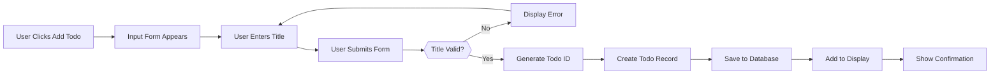
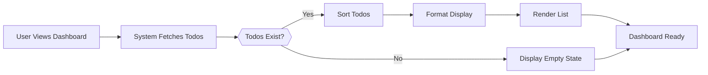
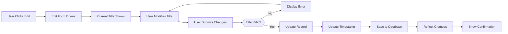
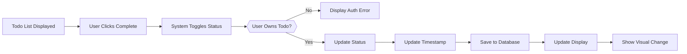
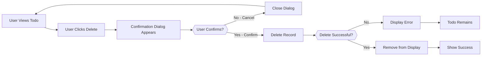
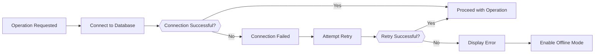

# User Flows for Todo List Application

## User Flow Overview

This document defines detailed step-by-step user flows for all major operations in the Todo list application. User flows describe the complete interaction between users and the system, including user actions, system responses, validations, decision points, and error handling procedures.

### What Are User Flows?

User flows are precise sequences of interactions that show exactly how users accomplish tasks and how the system responds to each action. Each flow includes:
- **User Actions**: What the user does (clicks, enters data, submits forms)
- **System Processing**: How the system processes the action (validation, database operations, state changes)
- **System Responses**: What the system displays or returns to the user
- **Decision Points**: Where the flow branches based on conditions
- **Error Scenarios**: What happens when things go wrong
- **Success Criteria**: How to verify the flow completed successfully

### Flow Scope

These flows apply to authenticated users managing their personal todos. Each flow assumes:
- User is already authenticated and has valid access
- User is operating on their own todos
- System has persistent data storage available
- Network connectivity is present (error handling covers disconnection scenarios)

### Flow Documentation Standards

All flows in this document follow EARS (Easy Approach to Requirements Syntax) format for clarity and testability. Key patterns used:
- **WHEN**: Describes the trigger or initial condition
- **THE**: Identifies the subject (usually "the system")
- **SHALL**: Indicates mandatory behavior
- **IF/THEN**: Specifies conditional logic

Example: "WHEN user clicks the complete button, THE system SHALL toggle the todo's completion status and update the display immediately."

### Flow Relationships

Flows are organized from foundational (authentication/access) through core operations (CRUD) to specialized scenarios (errors, edge cases):
1. **Authentication** - How users access the application
2. **Create** - Adding new todos
3. **Read** - Viewing todos
4. **Update** - Modifying existing todos
5. **Complete** - Changing completion status
6. **Delete** - Removing todos
7. **Error Handling** - What happens when things go wrong
8. **Edge Cases** - Special scenarios and boundary conditions

---

## Authentication and Access Flow

### Overview
Users access the Todo application without requiring complex authentication. This flow handles initial access and session management for the single-user system.

### Flow 1: Initial Application Access

**Detailed Steps:**

1. WHEN user opens or navigates to the Todo application, THE system SHALL immediately check if previous session data exists.

2. THE system SHALL attempt to load all previously saved todos from persistent storage.

3. IF previous data is found AND data is valid, THE system SHALL deserialize and prepare the todo list for display.

4. IF no previous data exists OR data is corrupted, THE system SHALL initialize empty todo list and display empty state message.

5. THE system SHALL render the main dashboard interface with:
   - Todo list area (empty or populated)
   - Create todo input form
   - Action buttons (add, refresh, etc.)
   - Any status indicators

6. THE system SHALL load the dashboard within 2 seconds from application start.

7. THE system SHALL display all previously saved todos in chronological order (newest first).

8. IF todos exist, THE system SHALL show both completed and incomplete todos with visual distinction.

9. THE system SHALL display empty state message only if zero todos exist: "No todos yet. Create your first todo to get started."

10. THE system SHALL make the application fully interactive and responsive to user input.

**Success Criteria:**
- Application loads and displays within 2 seconds
- All previously saved todos appear correctly
- UI is responsive and ready for user interaction
- Empty state displays appropriately when no todos exist

**Error Scenarios:**
- IF data is corrupted: Display "Unable to load data. Starting fresh." and proceed with empty state
- IF storage is inaccessible: Display "Unable to access your todos. Please refresh the page." and attempt retry

---

### Flow 2: Session Resume After Inactivity

**Detailed Steps:**

1. WHEN user returns to the application after being away (even for extended periods), THE system SHALL check for any persisted session or data.

2. THE system SHALL retrieve all todos from persistent storage.

3. IF todo data exists, THE system SHALL perform integrity validation to ensure data has not been corrupted.

4. THE system SHALL verify the structure and content of each todo (required fields present, valid data types, correct associations).

5. IF all data validates successfully, THE system SHALL load the complete todo list and present it to the user.

6. IF data validation fails or data appears corrupted, THE system SHALL attempt automatic recovery procedures:
   - Isolate corrupted todos
   - Attempt to repair if possible
   - Display affected todos in disabled state
   - Log the corruption event

7. THE system SHALL restore the user interface to the state they last used (list view, filters, etc.).

8. THE system SHALL display a status message if any recovery was attempted: "Your data has been restored. [X] todos recovered."

9. THE system SHALL make all valid todos immediately available for user interaction.

**Success Criteria:**
- All valid todos from previous session are restored
- User can immediately access and work with their todos
- Corrupted data is handled gracefully without data loss
- Session resumes without user re-entry of data

**Error Scenarios:**
- IF data corruption is detected: Attempt recovery and notify user
- IF data cannot be recovered: Display "Unable to recover some todos. Please contact support." and display recoverable todos
- IF no data exists: Display empty state and allow creating first todo

---

## Create Todo Flow

### Overview
Users can create new todos by providing a title. The system validates input, stores the todo, and displays it immediately.

### Flow 3: Create New Todo - Success Path

**Detailed Steps:**

1. WHEN user clicks the "Add Todo", "Create New Todo", or similar action button, THE system SHALL display the todo creation form.

2. THE form SHALL include:
   - Text input field for todo title (clearly labeled)
   - Submit button ("Add", "Create", "Save")
   - Cancel button
   - Character counter showing current length and maximum
   - Visual focus on the input field

3. WHEN user begins typing in the title field, THE system SHALL:
   - Display real-time character count (e.g., "45/255 characters")
   - Prevent entering more than 255 characters (disable input at limit)
   - Display warning when approaching limit (at 90% = 229 characters)

4. WHEN user submits the form (by clicking button or pressing Enter), THE system SHALL retrieve the entered title text.

5. THE system SHALL validate that the title is not empty OR contains only whitespace characters.

6. IF the title validation fails, THE system SHALL display inline error message: "TODOAPP-VAL-001: Todo title cannot be empty. Please enter a title for your todo."

7. THE system SHALL NOT submit the form and SHALL keep the input field focused for user correction.

8. IF the title passes validation, THE system SHALL automatically:
   - Generate a unique identifier (UUID format) for the todo
   - Record the current timestamp as creation time
   - Set completion status to "incomplete"
   - Associate the todo with the current user session

9. THE system SHALL create the todo record in memory and attempt to persist it to storage.

10. WHEN todo is successfully persisted, THE system SHALL:
    - Display the newly created todo in the list (typically at the top)
    - Apply "incomplete" visual styling to the new todo
    - Clear the input form for creating additional todos
    - Display success message: "Todo created successfully." (auto-dismiss after 3 seconds)

11. THE creation process SHALL complete end-to-end within 1 second from submission to display.

12. THE system SHALL make the new todo immediately available for user operations (marking complete, editing, deleting).

**Success Criteria:**
- New todo appears immediately in the list
- Todo displays with correct title and incomplete status
- Input form clears and is ready for next todo
- User receives visual confirmation
- Process completes within 1 second

**Error Scenarios:**

**Scenario: Title Too Long (exceeds 255 characters)**
- System prevents additional input at 255 characters
- System displays warning: "TODOAPP-VAL-002: Title cannot exceed 255 characters."
- User must delete characters to proceed

**Scenario: Database Save Fails**
- System displays error: "TODOAPP-OP-001: Unable to create todo. Please try again."
- System preserves user's input in the form
- System implements automatic retry (up to 3 attempts with 1-second intervals)
- IF retry succeeds: Display success and clear form
- IF retry fails: Display error with Retry button and allow manual retry

**Scenario: Network Connection Lost**
- System displays: "TODOAPP-SYS-002: Unable to save. You're offline."
- System queues the todo creation for retry when online
- User's input is preserved locally

**Scenario: Special Characters in Title**
- System accepts emojis, Unicode characters, and special characters
- System displays them correctly in the list
- System performs XSS prevention (sanitizes if necessary)

**Alternative Path: User Cancels Creation**
- WHEN user clicks Cancel button or presses Escape, THE system SHALL close the form without saving
- THE system SHALL discard the input
- THE system SHALL return focus to the main todo list

---

### Flow 4: Create Todo - Bulk/Rapid Creation

**Detailed Steps for Creating Multiple Todos Rapidly:**

1. WHEN user creates multiple todos in rapid succession (without waiting for server confirmation), THE system SHALL queue all creation requests.

2. THE system SHALL process creations sequentially in the order received.

3. THE system SHALL display a progress indicator: "Creating todos... (3 of 10 completed)"

4. EACH todo creation SHALL follow the same validation and persistence rules as single creation.

5. THE system SHALL assign unique IDs to each todo to prevent duplicates.

6. IF one creation fails, THE system SHALL:
   - Note which creation failed
   - Continue creating remaining todos
   - Display error for failed creation only
   - Allow user to retry failed creation individually

7. THE system SHALL display all successfully created todos immediately in the list.

8. WHEN all creations complete, THE system SHALL display: "All todos created successfully."

**Success Criteria:**
- All todos created and displayed
- No duplicates created from rapid submissions
- Progress feedback provided to user
- Failed creations are handled individually

---

## Read/View Todos Flow

### Overview
Users can view their complete list of todos with clear organization and status indication. The system retrieves all todos and displays them in an organized, easy-to-scan format.

### Flow 5: View Todo List - Initial Load

**Detailed Steps:**

1. WHEN user navigates to or focuses on the main dashboard/todo list view, THE system SHALL retrieve all todos for the current user.

2. THE system SHALL query all saved todos from persistent storage.

3. IF no todos exist in storage, THE system SHALL display empty state interface with:
   - Message: "No todos yet. Create your first todo to get started!"
   - Prominent "Create Todo" button
   - Optional: Inspirational message or tips for using the application

4. IF todos exist, THE system SHALL retrieve all todo records with their complete properties (ID, title, completion status, timestamps).

5. THE system SHALL organize todos in the following order:
   - Incomplete todos first (displayed at top)
   - Completed todos second (displayed below incomplete)
   - Within each group, sort by creation date (newest first)

6. FOR each todo in the list, THE system SHALL display:
   - **Title/Description**: The complete todo text
   - **Completion Status**: Visual indicator (checkbox, color, strikethrough, or other clear indicator)
   - **Last Modified**: Timestamp or relative time (optional: "Just now", "5 minutes ago")
   - **Action Buttons**: Edit, Complete/Incomplete, Delete buttons
   - **Hover Effects**: Highlight on mouse over to show interactivity

7. THE system SHALL apply distinct visual styling to completed vs incomplete todos:
   - Incomplete: Normal text, standard color, checkbox unchecked
   - Completed: Strikethrough or faded appearance, checkbox checked, potentially grayed out

8. THE system SHALL load and display all todos within 500 milliseconds.

9. THE system SHALL render the list in a single scrollable view (no pagination required for reasonable list sizes under 500 todos).

10. THE system SHALL make all todos immediately interactive (users can click buttons, edit, etc.).

**Success Criteria:**
- All user's todos retrieved and displayed
- Incomplete todos appear first, completed todos second
- Clear visual distinction between completion states
- List loads within 500 milliseconds
- Empty state displays appropriately
- All action buttons are visible and functional

**Error Scenarios:**

**Scenario: Database Retrieval Fails**
- System displays: "TODOAPP-OP-003: Unable to load your todos. Please refresh the page."
- System offers Refresh button
- System attempts automatic retry

**Scenario: Partial Load Failure**
- Some todos load successfully, others fail
- System displays successfully loaded todos
- System displays message: "TODOAPP-OP-004: Some todos could not be loaded. Attempting recovery..."
- System attempts to reload failed todos

**Scenario: Large Number of Todos (500+)**
- System implements pagination or lazy loading
- Initial load displays first 50 todos
- "Load More" button appears to fetch additional todos
- Each batch loads within 200 milliseconds
- Display remains responsive even with large dataset

**Scenario: Network Disconnection**
- IF connection lost while viewing list: Display cached todos
- Display "TODOAPP-SYS-002: You're offline. Working with cached data."
- Mark todos as potentially stale if not recently synced
- Re-sync when connection restored

---

### Flow 6: View Individual Todo Details

**Detailed Steps:**

1. WHEN user clicks on a specific todo or requests details view, THE system SHALL retrieve the complete todo data.

2. THE system SHALL display:
   - Complete todo title/description
   - Completion status
   - Creation timestamp ("Created on [date]")
   - Last modified timestamp ("Last updated on [date]")
   - All available actions (edit, complete/incomplete, delete)
   - Additional metadata if available

3. THE system SHALL show this information within 200 milliseconds.

4. IF the todo was subsequently modified elsewhere (e.g., on another device), THE system SHALL display the most current version.

5. THE system SHALL provide a back button to return to the main list view.

**Success Criteria:**
- Complete todo details displayed
- All metadata visible and accurate
- Display updates within 200 milliseconds
- User can navigate back to list

---

### Flow 7: Refresh Todo List

**Detailed Steps:**

1. WHEN user manually refreshes the todo list (by clicking refresh button or pressing F5), THE system SHALL:
   - Clear any cached display state
   - Re-fetch all todos from persistent storage
   - Re-validate todo data integrity
   - Re-render the complete list

2. THE system SHALL display a loading indicator: "Refreshing your todos..."

3. THE system SHALL complete the refresh within 1 second.

4. THE system SHALL display any changes that occurred since the last display (if todos were modified elsewhere).

5. THE system SHALL maintain the user's scroll position if possible, or reset to top of list.

**Success Criteria:**
- All todos reloaded from storage
- Display refreshed and shows current state
- Refresh completes within 1 second
- Any external changes are reflected

---

## Update Todo Flow

### Overview
Users can modify existing todos by changing their title or description. The system validates changes, updates the record, and reflects modifications immediately.

### Flow 8: Edit Todo - Title/Description Update

**Detailed Steps:**

1. WHEN user clicks the "Edit" button on a specific todo, THE system SHALL enter edit mode for that todo.

2. THE system SHALL display an edit form or inline editor with:
   - Text field containing the current todo title
   - Save button
   - Cancel button
   - Character counter showing current and maximum characters
   - Clear visual indication that this todo is being edited

3. THE system SHALL pre-populate the edit field with the exact current title text.

4. THE system SHALL place focus on the text field, allowing user to immediately begin editing.

5. WHEN user modifies the title text, THE system SHALL:
   - Display real-time character count
   - Enforce 255 character maximum (prevent additional input at limit)
   - Update character counter continuously

6. WHEN user submits changes (clicks Save or presses Enter), THE system SHALL validate the new title:
   - Check that title is not empty
   - Check that title is not only whitespace
   - Check that title does not exceed 255 characters

7. IF validation fails, THE system SHALL display error inline:
   - Empty: "TODOAPP-VAL-001: Title cannot be empty."
   - Too long: "TODOAPP-VAL-002: Title cannot exceed 255 characters."
   - THE system SHALL keep the edit form open for correction

8. IF validation succeeds, THE system SHALL:
   - Update the todo's title property in the database
   - Record the current timestamp as the modification time
   - Preserve all other todo properties (completion status, creation time, ID)

9. THE system SHALL commit the changes to persistent storage within 500 milliseconds.

10. WHEN update succeeds, THE system SHALL:
    - Close the edit form
    - Display the updated todo in the list with new title
    - Apply "updated recently" visual indicator if applicable (highlight, notification)
    - Display confirmation: "Todo updated." (auto-dismiss after 2 seconds)

11. THE system SHALL make the updated todo immediately available for further operations.

**Success Criteria:**
- Todo title updated successfully
- Changes reflected immediately in list
- Modification timestamp recorded
- User receives confirmation
- Process completes within 500 milliseconds

**Error Scenarios:**

**Scenario: Edit Form Closed Without Saving**
- WHEN user clicks Cancel or presses Escape, THE system SHALL close edit form
- THE system SHALL discard changes
- THE system SHALL display original todo unchanged

**Scenario: Title Becomes Empty During Edit**
- System displays error: "Title cannot be empty."
- System prevents submission
- User must enter valid title

**Scenario: Database Update Fails**
- System displays error: "TODOAPP-OP-005: Unable to save changes. Please try again."
- System preserves user's edits in the form
- System implements automatic retry (up to 3 attempts)
- IF success: Close form and display updated todo
- IF failure: Allow manual retry

**Scenario: Concurrent Edit Conflict**
- IF todo is modified elsewhere during edit, THE system SHALL:
  - Detect the conflict upon save attempt
  - Display message: "TODOAPP-OP-006: This todo was modified elsewhere. Your version: [X], Current version: [Y]. Save anyway? [Yes] [No] [View Current]"
  - Allow user to view current version, overwrite, or cancel

**Alternative Path: User Cancels Editing**
- User clicks Cancel or presses Escape
- Edit form closes
- Original todo displays with no changes

---

### Flow 9: Quick Edit (Inline Editing)

**Detailed Steps for Inline Title Editing:**

1. IF the system supports inline editing, WHEN user clicks directly on the todo title (in list view), THE system SHALL enable in-place editing.

2. THE title text SHALL become an editable field within the list view (no popup or separate form).

3. WHEN user finishes editing (clicks away, presses Enter, or clicks Save), THE system SHALL validate and save the changes.

4. THE system SHALL update the display immediately without requiring page refresh.

**Success Criteria:**
- Title edited and saved inline
- Changes persist immediately
- User experience is fast and intuitive

---

## Complete Todo Flow

### Overview
Users can mark todos as complete or incomplete by toggling their completion status. The system updates the status and reflects changes immediately with clear visual distinction.

### Flow 10: Mark Todo as Complete

**Detailed Steps:**

1. WHEN user clicks the "Complete" button, checkbox, or similar completion action for a specific incomplete todo, THE system SHALL initiate a completion state change.

2. THE system SHALL verify that the user owns the requested todo (using user session/identification).

3. IF ownership verification fails, THE system SHALL display error: "TODOAPP-OP-007: You cannot modify this todo." and abort the operation.

4. THE system SHALL change the todo's completion status from "incomplete" to "completed".

5. THE system SHALL automatically record the current timestamp as the modification time.

6. THE system SHALL update the todo record in persistent storage.

7. THE system SHALL commit the status change within 200 milliseconds (this should be the fastest operation in the application).

8. WHEN status change succeeds, THE system SHALL immediately update the visual display:
   - Apply completed styling (strikethrough, faded color, grayed out appearance)
   - Update the checkbox/button to show checked/completed state
   - Move todo to completed section (below incomplete todos)

9. THE system SHALL display visual confirmation that the action succeeded (brief highlight, animation, or color change).

10. THE system SHALL keep the completed todo visible in the list (don't hide it) for user review.

11. THE system SHALL make the completed todo available for all operations (reopen, edit, delete).

**Success Criteria:**
- Todo status changes to completed
- Visual styling updates immediately
- User receives visual feedback
- Timestamp recorded
- Process completes within 200 milliseconds

**Error Scenarios:**

**Scenario: Status Update Fails**
- System displays: "TODOAPP-OP-005: Unable to update status. Please try again."
- System reverts todo to previous state
- System implements automatic retry

**Scenario: Todo Deleted Before Status Update**
- System detects todo no longer exists
- System displays: "TODOAPP-OP-009: This todo no longer exists."
- System removes it from display

**Scenario: Network Disconnection**
- System queues the status change
- Displays: "TODOAPP-SYS-002: You're offline. Change will sync when online."
- Changes persist when connection restored

---

### Flow 11: Mark Todo as Incomplete (Reopen)

**Detailed Steps:**

1. WHEN user clicks the completion button/checkbox on a completed todo, THE system SHALL reverse the completion status.

2. THE system SHALL change status from "completed" to "incomplete".

3. THE system SHALL update modification timestamp.

4. THE system SHALL commit changes to storage within 200 milliseconds.

5. THE system SHALL immediately update visual display:
   - Remove completed styling (remove strikethrough, return to normal color)
   - Show unchecked checkbox/incomplete button state
   - Move todo back to incomplete section (above completed todos)

6. THE system SHALL display confirmation that the action succeeded.

**Success Criteria:**
- Todo status changes back to incomplete
- Visual styling reverts to incomplete appearance
- Todo moves back to incomplete section
- All changes recorded

**Error Scenarios:**
- Same error handling as completing todos

**Alternative Path: Undo Recent Completion**
- IF system implements undo within 30 seconds, user can click "Undo" after marking complete
- Status reverts to incomplete
- User receives confirmation

---

## Delete Todo Flow

### Overview
Users can permanently remove todos from their list. The system requires confirmation to prevent accidental deletion, removes the record, and updates the display.

### Flow 12: Delete Todo with Confirmation

**Detailed Steps:**

1. WHEN user clicks the "Delete" button on a specific todo, THE system SHALL display a confirmation dialog.

2. THE confirmation dialog SHALL clearly state:
   - Message: "Are you sure you want to delete this todo?"
   - Todo title: Display the exact title to confirm which todo will be deleted
   - Warning: "This action cannot be undone."
   - Buttons: "Cancel" (secondary) and "Delete" (primary, red or warning color)

3. WHEN user clicks "Cancel", THE system SHALL:
   - Close the confirmation dialog
   - Return to the main todo list
   - Keep the todo in place, unchanged

4. WHEN user clicks "Confirm Delete", THE system SHALL:
   - Verify the user owns the todo
   - Delete the todo record from persistent storage
   - Verify deletion was successful

5. THE system SHALL execute the deletion within 1 second.

6. IF deletion succeeds, THE system SHALL:
   - Remove the todo from the displayed list immediately
   - Display success message: "Todo deleted successfully."
   - Optionally display "Undo" button for 30 seconds allowing user to restore

7. IF deletion fails, THE system SHALL:
   - Display error: "TODOAPP-OP-008: Unable to delete todo. Please try again."
   - Keep todo in list
   - Allow user to retry immediately

8. THE system SHALL NOT delete additional todos beyond the one requested.

**Success Criteria:**
- User confirms deletion
- Todo removed from list immediately
- Deletion is permanent (or recoverable via undo within 30 seconds)
- User receives confirmation
- Process completes within 1 second

**Error Scenarios:**

**Scenario: User Cancels Deletion**
- Dialog closes
- Todo remains in list
- No changes made

**Scenario: Deletion Fails**
- Error displayed: "Unable to delete."
- Todo remains in list
- System implements automatic retry (up to 3 times)
- User can manually retry via Retry button

**Scenario: Network Disconnection During Delete**
- System queues the deletion
- Displays: "TODOAPP-SYS-002: You're offline. Deletion will complete when online."
- Temporarily removes from display
- Completes deletion when connection restored

**Scenario: Accidental Deletion (Undo Recovery)**
- IF system implements undo, display: "Todo deleted. [Undo] [OK]"
- Allow user to click Undo within 30 seconds
- Restore the deleted todo with all original properties

**Alternative Path: Soft Delete (Optional Implementation)**
- Instead of permanent deletion, mark todo as deleted internally
- Remove from user's normal list view
- Display in "Recently Deleted" section for 30 days
- Allow permanent purge or restore

---

## Error Handling Flows

### Overview
This section defines flows for various error conditions that may occur during todo operations. Each error scenario includes the trigger, system response, user notification, and recovery procedures.

### Flow 13: Handling Validation Errors During Todo Creation

**Detailed Steps:**

1. WHEN user attempts to create a todo with empty title, THE system SHALL validate before submission.

2. THE system SHALL display inline error message immediately below the title field: "TODOAPP-VAL-001: Todo title cannot be empty. Please enter a title."

3. THE system SHALL highlight the problematic field with red border or background.

4. THE system SHALL prevent form submission until corrected.

5. WHEN user corrects the input (enters valid title), THE system SHALL:
   - Clear the error message
   - Remove the field highlighting
   - Enable the submit button

6. WHEN user submits corrected data, THE system SHALL proceed with normal creation flow.

**Success Criteria:**
- User receives clear error message
- Error is specific to the field
- User can easily correct and resubmit
- Correction removes the error state

---

### Flow 14: Handling Database Connection Errors

**Detailed Steps:**

1. WHEN the system attempts any database operation and the connection fails, THE system SHALL detect the failure.

2. THE system SHALL display message to user: "TODOAPP-SYS-001: Connecting to your data storage. Please wait..."

3. THE system SHALL implement automatic retry with exponential backoff:
   - First attempt: Retry immediately
   - Second attempt: Wait 1 second, then retry
   - Third attempt: Wait 2 seconds, then retry
   - Fourth attempt: Wait 4 seconds, then retry
   - Maximum: 3-4 retry attempts

4. IF a retry succeeds, THE system SHALL:
   - Complete the requested operation
   - Display success to user
   - Continue normal operation

5. IF all retry attempts fail, THE system SHALL:
   - Display error: "TODOAPP-SYS-003: Unable to connect to data storage. Check your internet connection."
   - Enable offline mode (if available)
   - Queue operation for retry when connection restored

6. WHILE in offline mode, THE system SHALL:
   - Display offline indicator
   - Allow viewing previously loaded todos
   - Queue any create/update/delete operations
   - Attempt reconnection periodically (every 5 seconds)

7. WHEN connection is restored, THE system SHALL:
   - Automatically retry queued operations
   - Display: "Connection restored. Syncing your data..."
   - Update display with any changes

**Success Criteria:**
- Connection errors handled gracefully
- Automatic retry implemented
- User informed of status
- Operations queued for retry
- Offline mode enables continued use

**Error Recovery:**
- Automatic retry completes successfully
- User manually checks connection and retries
- System recovers when network is restored

---

### Flow 15: Handling Race Conditions (Concurrent Modifications)

**Detailed Steps:**

1. WHEN a user modifies a todo while another modification is pending (e.g., on another device), THE system SHALL detect the conflict upon attempted save.

2. THE system SHALL retrieve the current server state of the todo.

3. THE system SHALL compare the user's changes against the current state:
   - IF changes don't conflict (different fields modified): Merge the changes automatically
   - IF changes conflict (same field modified): Request user decision

4. FOR automatic merge scenarios, THE system SHALL:
   - Apply both changes
   - Display: "TODOAPP-OP-006: Your changes have been merged with updates from another session."
   - Show the merged result

5. FOR conflicting changes, THE system SHALL:
   - Display conflict dialog: "This todo was modified elsewhere. What would you like to do?"
   - Show both versions for comparison
   - Provide options: "Keep My Changes", "Use Their Changes", "View Both"

6. WHEN user selects option, THE system SHALL:
   - Apply the selected version
   - Update the display
   - Display confirmation of resolution

**Success Criteria:**
- Conflict detected automatically
- User can understand and resolve conflicts
- Final state is consistent
- No data is lost

---

### Flow 16: Handling Network Interruption During Operation

**Detailed Steps:**

1. WHEN network connection is lost during an in-flight operation (create, update, delete), THE system SHALL detect the interruption.

2. DEPENDING on when interruption occurred:
   - Before database write: Operation is aborted, can be retried
   - During write: System attempts to determine final state
   - After write but before confirmation: Operation likely succeeded

3. THE system SHALL display message: "TODOAPP-SYS-002: Connection lost. Retrying operation..."

4. THE system SHALL queue the operation for retry when connection is restored.

5. THE system SHALL store the user's input temporarily to prevent data loss.

6. WHEN connection is restored, THE system SHALL:
   - Automatically retry the queued operation
   - Synchronize state with server
   - Display any required updates

7. IF operation ultimately succeeds, THE system SHALL display: "Operation completed successfully."

8. IF operation ultimately fails, THE system SHALL display error and allow user to retry or abandon.

**Success Criteria:**
- Operation queued during interruption
- User data preserved
- Automatic retry when online
- Final state is consistent

---

### Flow 17: Handling System Errors (Server Errors)

**Detailed Steps:**

1. WHEN the server returns an error (HTTP 500, timeout, etc.), THE system SHALL display user-friendly error message.

2. THE error message SHALL NOT include technical details, just: "TODOAPP-SYS-005: Server error. Our team has been notified. Please try again in a few moments."

3. THE system SHALL log the complete error details for administrator debugging.

4. THE system SHALL implement automatic retry after 5 seconds.

5. IF retry succeeds, THE operation completes normally.

6. IF retry fails, THE system SHALL display: "Server is still unavailable. Your changes have been saved locally. Please try again later."

7. THE system SHALL queue the operation for retry and continue normal operation offline.

**Success Criteria:**
- Error handled without crashing
- User receives clear message
- System recovers when server recovers
- No data loss

---

## Edge Case Flows

### Overview
Edge case flows handle special, unusual, or boundary condition scenarios that don't fit normal operation patterns.

### Flow 18: Rapid Successive Delete Clicks

**Detailed Steps:**

1. WHEN user rapidly clicks the Delete button on the same todo multiple times, THE system SHALL:
   - Process the first delete request normally
   - Display confirmation dialog for first request
   - Ignore or disable additional delete clicks while dialog is open

2. IF user confirms first deletion and clicks Delete again before dialog closes, THE system SHALL:
   - Display error: "TODOAPP-EDGE-003: Todo already deleted."
   - Close any additional dialogs

3. THE system SHALL prevent duplicate deletion of the same todo.

**Success Criteria:**
- Only one deletion occurs
- No duplicate or partial operations
- User receives clear feedback

---

### Flow 19: Creating Todo While Offline

**Detailed Steps:**

1. WHEN user creates a todo while network is unavailable, THE system SHALL:
   - Accept the todo creation request
   - Create todo record locally
   - Display todo in the list with local pending indicator
   - Display message: "TODOAPP-REC-001: Todo created locally. Will sync when online."

2. THE system SHALL store the pending todo in local storage.

3. WHEN network connection is restored, THE system SHALL:
   - Automatically upload pending todo to server
   - Assign server-generated ID if needed
   - Update display to show synced status
   - Clear offline indicator

4. IF sync fails after connection restored, THE system SHALL:
   - Display error with retry option
   - Keep todo in local storage for later retry

**Success Criteria:**
- Todo created and visible while offline
- Auto-sync when connection restored
- Pending state clearly indicated to user
- No data loss

---

### Flow 20: Viewing Todos While Storage is Full

**Detailed Steps:**

1. IF the system detects storage quota is exceeded when viewing todo list, THE system SHALL:
   - Load and display all existing todos normally
   - Display warning: "TODOAPP-SYS-009: Storage limit reached."
   - Disable the create todo form
   - Display helpful message: "Delete some existing todos to create new ones."

2. THE system SHALL allow viewing and managing existing todos normally.

3. THE system SHALL only block new todo creation.

4. WHEN user deletes todos to free space, THE system SHALL:
   - Re-enable todo creation
   - Clear warning message

**Success Criteria:**
- Existing todos viewable
- User understands why creation is blocked
- Creation re-enabled after space freed

---

### Flow 21: Extremely Long Todo Title (at Maximum)

**Detailed Steps:**

1. WHEN user enters exactly 255 characters (maximum length) in title field, THE system SHALL:
   - Accept the input
   - Display character count: "255/255 characters"
   - Display warning: "Maximum length reached. No more characters can be added."
   - Prevent additional input

2. WHEN user submits this maximum-length title, THE system SHALL:
   - Accept and save it without error
   - Display it correctly in the list
   - Handle editing without truncation

3. IF system displays truncated title in list view (due to space), THE system SHALL:
   - Provide full text in tooltip on hover
   - Provide full text in detail/edit view

**Success Criteria:**
- Maximum length title accepted
- Display handled without errors
- Full text accessible when needed

---

### Flow 22: System Attempts Recovery from Data Corruption

**Detailed Steps:**

1. WHEN system detects corrupted todo data (invalid structure, missing fields), THE system SHALL:
   - Isolate the corrupted todo
   - Display message: "TODOAPP-SYS-007: Corrupted data detected. Attempting repair..."
   - Attempt automated repair:
     - Restore missing fields with defaults
     - Validate data types
     - Reconstruct valid record if possible

2. IF repair succeeds, THE system SHALL:
   - Display recovered todo normally
   - Display message: "Corrupted todo has been recovered."
   - Continue normal operation

3. IF repair fails, THE system SHALL:
   - Display warning: "This todo could not be recovered. Contact support if needed."
   - Isolate corrupted todo from normal display
   - Offer option to delete or attempt manual recovery

4. THE system SHALL log corruption event for analysis and debugging.

**Success Criteria:**
- Corrupted data handled gracefully
- Repair attempted automatically
- User informed of status
- No data loss if repair possible

---

## Summary of Flow Characteristics

### Consistent Principles Across All Flows

**Immediate Feedback**: Every flow provides visual feedback to users within 200-500 milliseconds, ensuring they perceive the application as responsive and never stuck.

**Data Preservation**: All flows preserve user data during errors, allowing retry or recovery without re-entering information.

**Clear Communication**: All error messages are specific, actionable, and use non-technical language.

**Automatic Recovery**: Flows implement automatic retry and recovery where possible, requiring user intervention only when necessary.

**Atomic Operations**: All flows ensure operations complete fully or not at all, preventing partial/inconsistent states.

**User Control**: Users can cancel operations, undo actions, or change their mind throughout flows.

**Audit Trail**: All flows record timestamps and modifications for data integrity and debugging.

### Response Time Expectations by Flow Type

| Flow Type | Expected Response | User Perception |
|-----------|---|---|
| View todos | < 500ms | Instantaneous |
| Create todo | < 1 second | Immediate |
| Update todo | < 500ms | Very fast |
| Mark complete | < 200ms | Instant |
| Delete todo | < 1 second | Fast |
| Error recovery | < 5 seconds | Acceptable |
| Offline operation | Queued | Background |

### Error Recovery Sequence

ALL flows follow this error recovery sequence:
1. Detect error condition
2. Display user-friendly error message
3. Attempt automatic recovery (if applicable)
4. IF recovery succeeds: Resume operation
5. IF recovery fails: Offer retry or fallback options
6. Log error for debugging

---

## Cross-Flow Considerations

### Session Consistency

All flows maintain consistent user session throughout the application. Changes made in one flow are immediately visible in other flows:
- Create in create flow → visible in view flow
- Update in update flow → reflected in list view
- Delete in delete flow → removed from all views

### Data Validation Consistency

All flows apply identical validation rules for todo data:
- Title: 1-255 characters, not empty/whitespace
- Status: "incomplete" or "completed" only
- User association: Always enforced

### Permission Enforcement

All flows enforce consistent permission rules:
- Users can only access own todos
- Unauthorized operations are rejected with consistent error
- Admin override (if applicable) is consistently enforced

### Timestamp Management

All flows consistently manage timestamps:
- Creation time: Set once, never modified
- Modification time: Updated on any change
- All times in UTC, ISO 8601 format

---

> *Developer Note: These user flows describe WHAT interactions users should experience and WHAT the system should do in response. They do not prescribe HOW to implement these flows technologically. Implementation choices (framework selection, UI components, state management, API design, etc.) are entirely at the discretion of the development team.*
