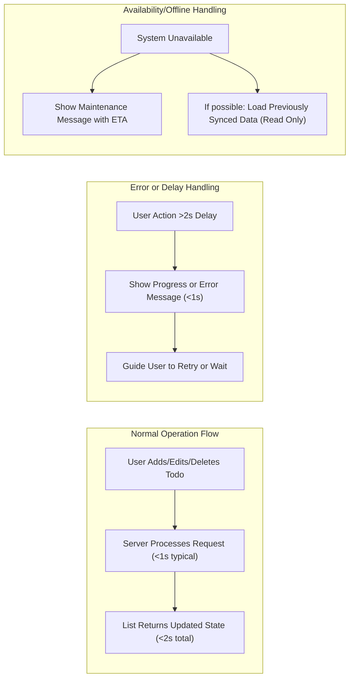

# Minimal Todo List Application – Requirements Specification

## 1. Introduction
A minimalist Todo List application supports basic yet essential task management for individual users. The focus is on simplicity, clarity, and reliability so users can add, complete, manage, and delete their todos with absolute ease and immediate feedback.

## 2. Actors and Basic Permissions
- **User:** An authenticated person who can create, view, edit, complete, un-complete, and delete their own todos.
- **System:** The application backend and logic responsible for processing user actions and maintaining state integrity.

Permissions Table:
| Actor | Add | Edit | Complete/Un-complete | Delete | View |
|-------|-----|------|----------------------|--------|------|
| User  | Yes | Yes  | Yes                  | Yes    | Yes  |

The User has exclusive control and visibility over their own todo items. No access to others’ data is allowed at any business layer. Authentication is mandatory for session and all todo interactions.

## 3. Core Todo Management Flows

- Add a new todo item to a personal list
- View current todo items (optionally with search and filtering by completion)
- Edit a todo item’s description and due date
- Mark a todo item as completed or revert to incomplete
- Delete a todo item with instant confirmation
- All actions are restricted to the authenticated user’s list

## 4. Functional Requirements (EARS Format)

- WHEN a user logs in, THE system SHALL display all their existing todo items within 2 seconds.
- WHEN a user submits a new todo, THE system SHALL add it to their list and display it as visible and editable within 1 second.
- WHEN a user edits a todo’s content or due date, THE system SHALL update it in their list and reflect the new state within 1 second.
- WHEN a user marks a todo as complete or restores it to incomplete, THE system SHALL update the item and show the new state within 1 second.
- WHEN a user deletes a todo, THE system SHALL remove it and confirm the deletion visually within 1 second.
- WHEN a user tries to perform any CRUD action not permitted by their session/authentication, THE system SHALL reject the request and show an access denied message instantly.
- WHEN an operation cannot complete within 1 second because of high load or networking delays, THE system SHALL show a clear progress or error message within that second.
- THE system SHALL always confirm the result of each action to the user, either via updated screen state or a visible message.
- WHEN the number of todos in a user’s list approaches or exceeds 1,000, THE system SHALL display a warning and recommend cleanup but SHALL NOT block basic operations.
- THE system SHALL allow all CRUD operations even when offline or after short outages, provided previously synced data exists (read-only). Editing/creation is only allowed when online or once network is restored for data to persist.

## 5. Non-Functional Requirements (User-oriented)

- User actions (add, edit, complete, delete) SHALL always produce a visible result or message within 1 second under typical conditions.
- WHEN slow operations occur, THE system SHALL provide feedback (like progress spinners or toast messages) immediately.
- THE system SHALL handle up to 1,000 todos per user with no slowdowns.
- WHEN server is unavailable for maintenance or outage, THE system SHALL offer a friendly message and allow read-only access to previously loaded data if technically feasible.
- THE application SHALL never lose a todo after confirming success to the user.
- WHEN sync or save is delayed, THE system SHALL still allow local edits (optimistic UI), subject to final sync success.
- All time-related messaging SHALL reference the Asia/Seoul timezone.

## 6. Performance, Availability, and SLA
- THE system SHALL respond to all typical user operations (add, edit, complete, delete) within 1 second, except for bulk list loading, which SHALL complete within 2 seconds.
- WHEN delays >1s exist, THE system SHALL show feedback/progress messages within the first second.
- WHEN an operation cannot be completed due to backend or connectivity issues, THE system SHALL never lose the user’s intended edits and SHALL prompt the user clearly to retry or check back later.
- THE system SHALL provide 99.9% uptime per month except for scheduled, pre-announced maintenance, showing ETA messages in Asia/Seoul local time if possible.
- WHEN offline, users SHALL be able to view previously synced todos (read-only) but cannot modify or add until connectivity restores.
- IF a user passes the soft quota of 1,000 todos, THE system MAY show a warning but SHALL remain fully usable (may note slower experience as possible).

### Performance Flow (Mermaid)

#### SLA Table
| Feature or Action                  | Expected Response Time | Maximum Allowable Delay | User Notification                           |
|------------------------------------|-----------------------|------------------------|---------------------------------------------|
| Add/Edit/Delete todo item          | ≤ 1 second            | 2 seconds              | Immediate or progress message               |
| Load full todo list                | ≤ 2 seconds           | 3 seconds              | Progress or fallback/offline notice         |
| System available for login/session | 99.9% of time/month   | 45 mins downtime/month | ETA and offline access if available         |
| Data quota warning                 | N/A                   | N/A                    | Warn before limit; never block operations   |

## 7. Error Handling Principles
- THE system SHALL provide immediate, clear error messages for any action that cannot complete and SHALL never leave user in ambiguous state.
- WHEN an error occurs, THE system SHALL describe the cause and suggest next steps (retry, check connectivity, or contact support).
- The backend SHALL never expose technical details or cryptic codes to end-users.
- WHEN recovery is possible (such as retry or resume later), THE system SHALL provide clear prompts and retain unsaved edits for later submission.

## 8. Security and Data Privacy
- User authentication is required for all operations; no unauthenticated todo access is permitted.
- User data MUST be isolated; no cross-user access at any endpoint or data layer.
- Every todo created is associated only with its user account.
- All data transmissions SHALL use encrypted channels (HTTPS/TLS/SSL).
- Session tokens or credentials SHALL be securely stored and transmitted only during authentication and authorized API calls.
- THE system SHALL provide a secure logout endpoint invalidating user sessions instantly.
- WHEN handling tokens and sessions, THE system SHALL follow industry best practices for expiry and renewal.

## 9. Out-of-Scope Features
- No shared lists / collaboration / team/group features
- No notifications, reminders, or calendar integration
- No tags/prioritization/labels
- No recurring tasks or automation
- No attachments or file uploads
- No third-party integrations

## 10. Developer Summary
This document fully specifies requirements—functional and non-functional, actor permissions, error handling, performance, security, authentication, and strict scope—for a minimal Todo List backend. All requirements are presented in precise natural language for direct implementation, following best practices for maintainable and scalable backend design.
