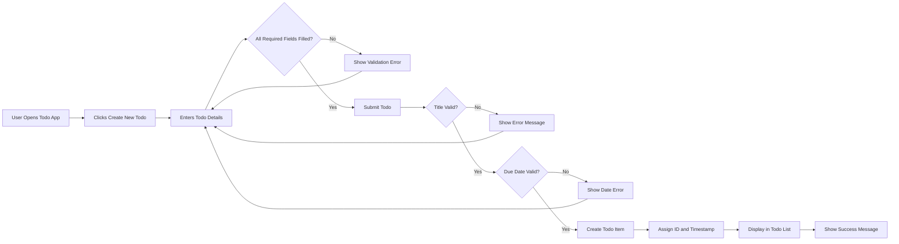
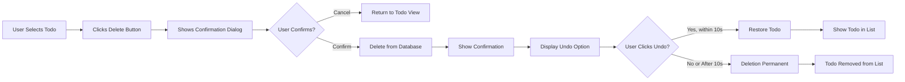
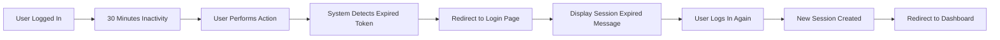

# API Interaction Patterns for Todo Application

## Overview

This document describes how users interact with the Todo application from a business perspective. It outlines the typical workflows, information exchanges, and user journeys without specifying technical implementation details. All interactions are described in terms of user actions and system responses in natural language.

---

## 1. User Registration & Authentication Flow

### 1.1 New User Registration

**User Registration Workflow:**

WHEN a new user visits the application, THE system SHALL display a registration interface where the user can create an account.

WHEN a user submits their registration information, THE system SHALL perform the following steps:

1. User provides their email address and desired password
2. System validates that the email is not already registered
3. System validates that the password meets security requirements (minimum 8 characters)
4. System creates the user account in an "active" state
5. System automatically logs the user in upon successful registration
6. System creates an empty todo list for the user

WHEN registration is successful, THE user SHALL be directed to their todo management dashboard.

IF the email address is already registered, THEN THE system SHALL display an error message indicating "This email is already in use" and ask the user to choose a different email or use the login option.

IF the password does not meet requirements, THEN THE system SHALL display specific error messages about which requirements are not met (e.g., "Password must be at least 8 characters").

**Registration Data Exchange:**
- User Input: Email address, Password, Password confirmation
- System Processing: Validation, Account creation, Session initiation
- System Output: Welcome message, Redirect to dashboard, Empty todo list

### 1.2 User Login

**Login Workflow:**

WHEN an existing user visits the application, THE system SHALL display a login interface.

WHEN a user submits their login credentials (email and password), THE system SHALL perform the following steps:

1. System verifies the email address exists in the system
2. System validates the provided password against the stored password
3. IF credentials are correct, system creates a user session
4. System displays the user's todo dashboard
5. User remains logged in across multiple visits until logout

WHEN a user logs in successfully, THE system SHALL retrieve and display all of their todos in a persistent session.

IF the email address does not exist in the system, THEN THE system SHALL display "Email not found. Please check your email or register for a new account."

IF the password is incorrect, THEN THE system SHALL display "Incorrect password. Please try again."

IF a user attempts to login multiple times with incorrect passwords, THE system SHALL temporarily lock the account for security purposes and request the user to reset their password.

**Login Data Exchange:**
- User Input: Email address, Password
- System Processing: Email verification, Password validation, Session creation
- System Output: Session token, Todo list data, Dashboard view
- Session Duration: 30 minutes of inactivity

### 1.3 Password Reset

**Password Reset Workflow:**

WHEN a user clicks "Forgot Password", THE system SHALL request the user's email address.

WHEN the user provides their email address, THE system SHALL perform the following steps:

1. System verifies the email exists in the system
2. System generates a password reset token with 1-hour expiration
3. System sends the reset token to the user's email address
4. User clicks the reset link in their email
5. System verifies the reset token is valid and not expired
6. User enters their new password
7. System validates the new password meets security requirements
8. System updates the user's password
9. System displays a confirmation message and directs user to login

WHEN password reset is successful, THE user SHALL be able to login with their new password.

IF the email address is not found, THEN THE system SHALL still display a confirmation message (for security reasons, to prevent email enumeration attacks).

IF the reset token has expired, THEN THE system SHALL display an error message and ask the user to request a new password reset.

**Password Reset Data Exchange:**
- User Input: Email address, New password
- System Processing: Email verification, Token generation, Password validation, Database update
- System Output: Confirmation email, Success message
- Token Validity: 1 hour from generation

### 1.4 User Logout

**Logout Workflow:**

WHEN a user clicks the logout option, THE system SHALL perform the following steps:

1. System terminates the user's session
2. System clears the user's session from memory
3. System invalidates all active tokens for that user
4. System redirects the user to the login page
5. System displays a confirmation message

WHEN logout is successful, THE user's todos shall not be accessible until they login again with their credentials.

**Logout Data Exchange:**
- User Action: Click logout button
- System Processing: Session termination, Token invalidation, Redirect
- System Output: Login page, Confirmation message

---

## 2. Todo Management Interaction Patterns

### 2.1 Creating a New Todo

**Create Todo Workflow:**

WHEN a logged-in user wants to create a new todo, THE system SHALL display a todo creation interface.

WHEN a user submits a new todo, THE system SHALL accept the following information:

- **Title** (required): The main description of the todo (maximum 255 characters)
- **Description** (optional): Additional details about the todo (maximum 2000 characters)
- **Priority** (optional): One of three levels - "Low", "Medium", or "High" (defaults to "Medium")
- **Due Date** (optional): A date when the todo should be completed (must not be in past)

WHEN a todo is created, THE system SHALL perform the following steps:

1. System validates that all required fields are populated
2. System validates that the title is not empty and contains meaningful content
3. System validates the due date (if provided) is not in the past
4. System validates that title does not exceed 255 characters
5. System creates the todo item with status "Active"
6. System assigns unique todo ID and creation timestamp
7. System adds the todo to the user's list
8. System displays the newly created todo in the user's dashboard
9. System shows a confirmation message "Todo created successfully"

IF the title is empty or contains only whitespace, THEN THE system SHALL display an error message "Todo title is required and cannot be empty."

IF the title exceeds 255 characters, THEN THE system SHALL display an error message "Todo title cannot exceed 255 characters."

IF the due date is in the past, THEN THE system SHALL display an error message "Due date cannot be in the past. Please select a future date."

IF the description exceeds 2000 characters, THEN THE system SHALL display an error message "Todo description cannot exceed 2000 characters."

IF the todo is successfully created, THE system SHALL immediately display it in the user's todo list at the top.

**Create Todo Data Exchange:**
- User Input: Title, Optional description, Optional priority, Optional due date
- System Processing: Validation of all fields, Todo creation, ID generation, Timestamp recording
- System Output: New todo object with auto-generated fields (ID, creation date, status=Active)
- Immediate Result: Todo appears in list, Confirmation notification

**Create Todo Diagram:**



### 2.2 Viewing Todos

**View All Todos Workflow:**

WHEN a logged-in user accesses their dashboard, THE system SHALL automatically display all of their todos.

THE system SHALL display each todo with the following information:

- Todo title
- Status (Active or Completed)
- Priority level (High, Medium, Low)
- Due date (if provided)
- Creation date
- Last modified date

WHEN the user views their todo list, THE system SHALL organize todos in the following default order:

1. Active todos appear before completed todos
2. Within active todos: Higher priority items appear first (High > Medium > Low)
3. Within same priority: Earlier due dates appear first
4. Todos without due dates appear at the end

WHEN a user clicks on a specific todo, THE system SHALL display the complete todo details including:

- Full title and description
- Current status and completion date (if completed)
- Priority level
- Due date
- Creation timestamp
- Modification history (last modified date and time)
- Options to edit or delete the todo

IF a user has no todos, THE system SHALL display a helpful message such as "You have no todos yet. Create your first todo to get started!"

**View Todo Data Exchange:**
- System Processing: Retrieve all user todos from database, Sort by priority and due date, Format for display
- System Output: List of todo objects with all displayable fields, Organized by status and priority
- Display Order: Active (by priority and due date), then Completed

### 2.3 Updating Todo Status

**Update Status Workflow:**

WHEN a user wants to change a todo's status, THE system SHALL provide easy interaction methods (e.g., checkbox to mark complete, dropdown to change status).

THE system SHALL support two main status values:

1. **Active**: Initial state when todo is created; todo is incomplete
2. **Completed**: User has finished the todo; task is done

WHEN a user changes a todo's status, THE system SHALL perform the following steps:

1. System receives the new status from the user
2. System validates the status is one of the two allowed values (Active or Completed)
3. System updates the todo's status
4. System records the timestamp of the status change
5. IF status changes to Completed, system records the completion timestamp
6. IF status changes back to Active, system clears the completion timestamp
7. System displays the updated todo in the appropriate list section
8. System shows a brief confirmation message

WHEN a user marks a todo as "Completed", THE system SHALL:

- Record the completion timestamp with current date and time
- Move the todo to the completed section in the interface
- Update the todo's appearance (e.g., strikethrough the title, different color)
- Allow the user to still view and interact with the completed todo
- Display "✓ Completed on [date at time]"

WHEN a user changes a completed todo back to "Active", THE system SHALL:

- Update the status to Active
- Move the todo back to the active todos section
- Clear any completion timestamp data
- Restore the todo's normal appearance (remove strikethrough)
- Show confirmation message "Todo marked as active"

**Status Update Data Exchange:**
- User Action: Click checkbox or select status from dropdown
- System Processing: Status validation, Timestamp recording, List reorganization
- System Output: Updated todo with new status and timestamp, Reorganized list view
- Immediate Feedback: Visual status change, Confirmation message

### 2.4 Editing Todo Details

**Edit Todo Workflow:**

WHEN a user wants to modify an existing todo, THE system SHALL display an edit interface where the user can modify:

- Title
- Description
- Priority level (Low, Medium, High)
- Due date
- Status

WHEN a user submits changes to a todo, THE system SHALL perform the following steps:

1. System validates the new title is not empty and does not exceed 255 characters
2. System validates the new description (if provided) does not exceed 2000 characters
3. System validates the new due date (if changed) is not in the past
4. System validates the new priority is one of: Low, Medium, High
5. System updates the todo with the new information
6. System records the modification timestamp
7. System displays the updated todo in the list
8. System shows a confirmation message "Todo updated successfully"

IF the title becomes empty, THEN THE system SHALL display an error "Title cannot be empty" and revert to the previous value.

IF the user attempts to set a due date in the past, THEN THE system SHALL display an error "Due date cannot be in the past" and keep the previous due date.

IF the priority value is invalid, THEN THE system SHALL display an error "Priority must be Low, Medium, or High" and keep the previous value.

IF changes are successfully saved, THE todo shall immediately reflect the new information in the user's view with updated modification timestamp.

**Edit Todo Data Exchange:**
- User Input: Modified field values (title, description, priority, due date)
- System Processing: Validation of all modified fields, Database update, Timestamp update
- System Output: Updated todo object with modified fields, Confirmation message
- Modified Fields: Only specified fields change; others remain unchanged

### 2.5 Deleting Todos

**Delete Todo Workflow:**

WHEN a user wants to delete a todo, THE system SHALL display a confirmation dialog asking "Are you sure you want to delete this todo? This action cannot be undone."

WHEN a user confirms the deletion, THE system SHALL perform the following steps:

1. System verifies the user owns the todo being deleted
2. System removes the todo from the user's list
3. System permanently deletes the todo from storage
4. System displays a confirmation message "Todo deleted successfully"
5. System refreshes the todo list view
6. System offers an "Undo" option for 10 seconds

WHEN a user cancels the deletion, THE system SHALL return to the previous view without making any changes.

IF a user clicks "Undo" within 10 seconds of deletion, THE system SHALL:

- Restore the deleted todo to its previous state
- Display the todo in the list again
- Show confirmation message "Todo restored successfully"

IF 10 seconds have passed, THE system SHALL disable the Undo option and the deletion becomes permanent.

**Delete Todo Data Exchange:**
- User Action: Click delete button, Confirm deletion, Optional: Click undo
- System Processing: Ownership verification, Deletion from database, Undo buffer creation
- System Output: Deletion confirmation, List refresh, Undo button (10-second window)
- Permanent State: After 10 seconds or manual confirmation, deletion is final

**Delete Todo Diagram:**



---

## 3. Data Query Patterns

### 3.1 Filtering Todos

**Filter Todos Workflow:**

WHEN a user wants to view a subset of their todos, THE system SHALL provide filtering options through a filter menu or controls.

THE system SHALL support the following filter options:

1. **By Status**: View only "Active" or "Completed" todos
2. **By Priority**: View only "High", "Medium", or "Low" priority todos
3. **By Date Range**: View todos with due dates within a specific timeframe (e.g., Today, This Week, This Month)
4. **Active Todos Only**: Show only incomplete todos (Active status)
5. **Completed Todos Only**: Show only finished todos (Completed status)
6. **Overdue Todos**: Show todos with due dates in the past and still Active

WHEN a user applies a filter, THE system SHALL perform the following steps:

1. System receives the filter criteria
2. System retrieves all user todos matching the criteria
3. System displays only the filtered todos
4. System shows a clear indication of active filters (e.g., "Showing 5 Active Todos | Filters: Priority=High")
5. System provides a "Clear Filters" button to remove all filters

IF no todos match the filter criteria, THE system SHALL display "No todos match your current filters. Try adjusting your filter options."

WHEN a user clears filters, THE system SHALL display all of the user's todos again in the default order.

**Filter Data Exchange:**
- User Input: Selected filter criteria (status, priority, date range)
- System Processing: Retrieve todos matching all filter criteria, Apply sorting within filtered results
- System Output: Filtered todo list, Filter status indicator, Clear filters button
- Dynamic Updates: List updates immediately as filters change

### 3.2 Searching Todos

**Search Todos Workflow:**

WHEN a user wants to search for specific todos, THE system SHALL provide a search interface (search box or input field).

WHEN a user enters search text, THE system SHALL perform the following steps:

1. System receives the search query
2. System searches through all user todos (title and description fields)
3. System returns todos matching the search term
4. System displays matching todos immediately or after a brief delay (under 2 seconds)
5. System highlights the matching text within results
6. System shows result count (e.g., "Found 3 todos matching 'meeting'")

THE search SHALL match:

- Partial matches (e.g., searching "meet" finds "Team Meeting")
- Case-insensitive matches (e.g., "TODO" matches "todo")
- Matches in both title and description
- Whole words and substrings

IF the search returns no results, THE system SHALL display "No todos found matching 'search term'. Try different keywords or check your filters."

WHEN a user clears the search (empties the search box), THE system SHALL display all todos again in the default order.

**Search Data Exchange:**
- User Input: Search text string
- System Processing: Text matching in title and description fields, Result ranking by relevance
- System Output: Matching todo list, Result count, Highlighted matching text
- Response Time: Under 2 seconds for typical searches

### 3.3 Sorting Todos

**Sort Todos Workflow:**

WHEN a user wants to organize their todos differently, THE system SHALL provide sorting options through a sort menu.

THE system SHALL support the following sort options:

1. **By Priority**: High priority first, then Medium, then Low
2. **By Due Date**: Earliest due dates first (upcoming deadlines)
3. **By Status**: Active first, then Completed
4. **By Creation Date**: Newest todos first or oldest todos first
5. **By Modified Date**: Most recently modified todos first
6. **By Completion Status**: Completed todos first or last

WHEN a user selects a sort option, THE system SHALL perform the following steps:

1. System receives the sort preference
2. System reorders all visible todos according to the sort criterion
3. System displays the reorganized list
4. System remembers the user's sort preference for future visits (if applicable)
5. System shows indication of current sort (e.g., "Sorted by: Due Date (Earliest First)")

WHEN a user changes sort order, THE system SHALL immediately reorganize the visible todos.

**Sort Data Exchange:**
- User Input: Selected sort option
- System Processing: Reorder todos by sort criterion, Maintain filter state
- System Output: Reorganized todo list, Sort indicator showing current sort method
- Persistence: Sort preference saved for next session

---

## 4. Error Response Scenarios

### 4.1 Network & Connection Errors

**Network Error Workflow:**

IF the user loses internet connection while using the application, THEN THE system SHALL:

1. Display a notification indicating "Connection lost. Please check your internet connection."
2. Disable interactive features temporarily (create, update, delete operations)
3. Allow viewing of cached todos if previously loaded
4. Show a retry button or automatically retry when connection is restored
5. Display connection status in the interface

WHEN the user's connection is restored, THE system SHALL:

1. Automatically reconnect to the server
2. Sync any pending changes (updates made while offline)
3. Refresh the todo list to ensure data is current
4. Display a confirmation message "Connected. Your data has been synchronized."
5. Re-enable all interactive features

IF a user attempts an operation during connection loss, THEN THE system SHALL:

1. Queue the operation locally
2. Display message "No internet connection. Your changes will be saved when connection is restored."
3. Show pending operations in the interface
4. Process queued operations when connection is restored

**Network Error Data Exchange:**
- Connection Detection: Periodic heartbeat to server
- Offline State: Display notification, Cache available data
- Restoration: Reconnect, Sync pending changes, Update UI
- User Feedback: Clear messages about connection state

### 4.2 Authentication Errors

**Authentication Error Workflow:**

IF a user's session expires due to inactivity (30 minutes), THEN THE system SHALL:

1. Detect the expired session on the next user action
2. Redirect the user to the login page
3. Display a message "Your session has expired. Please login again."
4. Clear any cached user data for security
5. Preserve the todo the user was viewing (optional: show when they login again)

WHEN the user logs in again, THE system SHALL restore their previous context if possible.

IF a user tries to access another user's todos (unauthorized access attempt), THEN THE system SHALL:

1. Reject the request immediately
2. Display an error message "You do not have permission to access this resource."
3. Log the unauthorized access attempt for security
4. Redirect to the user's own todo list
5. Prevent any data disclosure to the unauthorized user

**Session Timeout Error Diagram:**



### 4.3 Validation Errors

**Validation Error Workflow:**

IF a user attempts to create or update a todo with invalid data, THEN THE system SHALL:

1. Identify which fields are invalid
2. Display specific error messages for each invalid field:
   - "Title cannot be empty"
   - "Title cannot exceed 255 characters"
   - "Due date cannot be in the past"
   - "Description cannot exceed 2000 characters"
   - "Priority must be 'Low', 'Medium', or 'High'"
3. Highlight the problematic fields
4. Allow the user to correct the data and resubmit
5. Preserve the user's input for correction

IF a user submits a form with multiple validation errors, THEN THE system SHALL display all errors at once rather than one at a time:

- Display error list at top of form
- Highlight all invalid fields
- Show specific error message for each field
- Allow batch correction and resubmission

**Example Validation Response:**

```
Validation Errors Found:
✗ Title cannot be empty
✗ Due date cannot be in the past (Selected: 2025-10-15, Today: 2025-10-31)
✗ Description exceeds 2000 character limit (Current: 2,547 characters)

Please correct these fields and try again.
```

### 4.4 Server Errors

**Server Error Workflow:**

IF the server encounters an unexpected error while processing a user request, THEN THE system SHALL:

1. Display a friendly error message: "Something went wrong. Please try again later."
2. Log the error internally with error ID for debugging
3. Offer a retry button so the user can attempt the operation again
4. Provide an error ID or reference number for support

IF the server is temporarily unavailable (maintenance, overload), THEN THE system SHALL:

1. Display a message indicating the server is temporarily unavailable: "The service is temporarily unavailable. We apologize for the inconvenience."
2. Estimate when service might be restored if known (e.g., "Expected back online at 3:00 PM EST")
3. Provide a retry mechanism with auto-retry capability
4. Show loading animation or status indicator

**Server Error Examples:**

```
Error: 500 Internal Server Error
We encountered an unexpected error (Error ID: ERR-12345-6789)
Please try again. If the problem persists, contact support.
[Retry Button]

---

Error: Service Unavailable
The service is temporarily down for maintenance.
Expected restoration: 2:30 PM EST
We will be back shortly. [Auto-retry in 5 seconds]
```

### 4.5 Data Conflict Errors

**Data Conflict Workflow:**

IF a user attempts to create a todo with a very long title or description, THEN THE system SHALL:

1. Display an error message indicating the character limit: "Title cannot exceed 255 characters"
2. Show how many characters the user has typed and the limit: "You have entered 287 characters (Limit: 255)"
3. Allow the user to trim their input and retry
4. Provide inline character counter that updates as user types

IF a user attempts to set a priority or status to an invalid value, THEN THE system SHALL:

1. Display an error message listing valid options: "Priority must be one of: Low, Medium, High"
2. Revert to the previously saved value
3. Allow the user to select from the valid options only (dropdown list)

IF a user attempts to update a todo that was deleted by another session, THEN THE system SHALL:

1. Display: "This todo was deleted and is no longer available"
2. Remove the todo from the user's current view
3. Refresh the todo list
4. Provide option to view other todos

**Data Conflict Error Examples:**

```
Character Limit Exceeded
Title: [entered text] (287/255)
⚠ Your title is 32 characters too long
Please remove 32 or more characters to proceed.

---

Invalid Status Selected
Status must be: "Active" or "Completed"
Your selection could not be saved.
[Dropdown: Active / Completed]
```

---

## 5. Complete User Interaction Workflows

### 5.1 First-Time User Journey

**Complete New User Onboarding Flow:**

```mermaid
graph LR
  A["New User Visits App"] --> B["Sees Registration Option"]
  B --> C["Clicks Sign Up"]
  C --> D["Enters Email & Password"]
  D --> E["Submits Registration Form"]
  E --> F{\"Validation Passes?\"}
  F -->|\"No\"| G["See Error Messages"]
  G --> D
  F -->|\"Yes\"| H["Account Created"]
  H --> I["Auto-Logged In"]
  I --> J["Redirected to Dashboard"]
  J --> K["View Empty Todo List"]
  K --> L["See Helpful Message"]
  L --> M["Click Create Todo"]
  M --> N["Enter Todo Details"]
  N --> O["Submit Todo"]
  O --> P{\"Todo Valid?\"}
  P -->|\"No\"| Q["See Validation Errors"]
  Q --> N
  P -->|\"Yes\"| R["Todo Created"]
  R --> S["Appears in List"]
  S --> T["Dashboard Ready to Use"]
```

**Onboarding Timeline:** 2-5 minutes total
**Success Criteria:** User has working account with first todo
**Key Milestones:**
- Minute 0:30 - Registration completed
- Minute 1:00 - First login successful
- Minute 3:00 - First todo created
- Minute 5:00 - Dashboard functional and ready

### 5.2 Regular User Daily Workflow

**Typical Daily Usage Flow:**

```mermaid
graph LR
  A["User Opens App"] --> B["Sees Login Screen"]
  B --> C["Enters Email & Password"]
  C --> D["Submits Login"]
  D --> E{\"Auth Successful?\"}
  E -->|\"No\"| F["Show Error"]
  F --> C
  E -->|\"Yes\"| G["Dashboard Displayed"]
  G --> H["Review Active Todos"]
  H --> I{\"What to Do?\"}
  I -->|\"Create New\"| J["Add Todo Item"]
  I -->|\"Update Status\"| K["Mark Progress"]
  I -->|\"Search/Filter\"| L["Find Todos"]
  I -->|\"Edit Details\"| M["Modify Todo Info"]
  I -->|\"Delete\"| N["Remove Todo"]
  J --> O["Todo Appears"]
  K --> O
  L --> O
  M --> O
  N --> O
  O --> P["View Updated List"]
  P --> Q{\"Continue?\"}
  Q -->|\"Yes\"| I
  Q -->|\"No\"| R["Click Logout"]
  R --> S["Session Terminated"]
  S --> T["Redirected to Login"]
```

**Daily Usage Timeline:** 5-30 minutes typical
**Peak Interactions:**
- Morning: Review todos, plan day
- Afternoon: Update status, add new items
- Evening: Review completed work

### 5.3 Error Recovery Workflow

**Typical Error Handling Journey:**

```mermaid
graph LR
  A["User Performs Action"] --> B{\"Error Occurs?\"}
  B -->|\"No\"| C["Action Succeeds"]
  B -->|\"Yes\"| D["See Error Message"]
  D --> E{\"Error Type?\"}
  E -->|\"Validation\"| F["User Corrects Data"]
  E -->|\"Connection\"| G["Wait for Connection"]
  E -->|\"Session Expired\"| H["Re-authenticate"]
  E -->|\"Server\"| I["Automatic Retry\"]
  F --> J["Resubmit"]
  G --> J
  H --> J
  I --> J
  J --> K{\"Success?\"}
  K -->|\"Yes\"| C
  K -->|\"No\"| D
```

---

## 6. Administrative User Interactions

### 6.1 Admin User Management Workflow

**Admin Dashboard Access:**

WHEN an administrator accesses the admin dashboard, THE system SHALL display:

- Total number of registered users
- List of all users with their email addresses and registration dates
- User account status (active or inactive)
- Last login timestamp for each user
- Number of todos created by each user
- Quick actions: View details, Suspend account, Delete account

WHEN an admin searches for a specific user, THE system SHALL:

1. Receive the search query
2. Find users matching the search term (by email or name)
3. Display matching users with their information
4. Show detailed user information on demand

### 6.2 Admin User Deletion Workflow

**Admin Delete User Process:**

WHEN an administrator selects a user to delete, THE system SHALL display a confirmation dialog:

"Are you sure you want to delete user [email]?
This will permanently remove the user account and all associated todos.
This action cannot be undone.
[Cancel] [Delete User]"

WHEN the admin confirms deletion, THE system SHALL:

1. Verify the admin has deletion authority
2. Remove the user account
3. Delete all todos associated with that user
4. Terminate any active sessions for that user
5. Log the deletion action with timestamp and admin ID
6. Display confirmation message "User [email] has been deleted"
7. Remove the user from the admin user list

IF the user has active sessions, THEN THE system SHALL immediately terminate those sessions with message "Your account has been deleted."

---

## 7. Session and Persistence Patterns

### 7.1 Session Maintenance

**Session Lifecycle:**

WHEN a user is logged in, THE system SHALL:

1. Maintain an active user session with a unique session token
2. Extend the session timeout with each user interaction (30-minute inactivity window)
3. Display remaining session time warning at 5 minutes before timeout
4. Automatically logout when session timeout is reached

WHILE a user's session is active, THE system SHALL:

- Keep the user logged in across all pages and requests
- Persist the user's identity and permissions throughout their usage
- Automatically retrieve their personalized data (todos, preferences)
- Validate session token on every authenticated request

WHEN a user closes the browser, THE system SHALL:

- Allow the user to resume their session on next visit (session persists for 7 days)
- OR require re-authentication on next visit (depending on browser settings)
- Clear sensitive data from the browser cache

### 7.2 Data Persistence

**Data Durability Guarantees:**

WHEN a user creates, updates, or deletes a todo, THE system SHALL:

1. Immediately save the change to permanent database storage
2. Confirm the change has been saved before returning success to the user
3. Ensure the change is visible in all subsequent requests from any device
4. Never lose user data due to system failures

WHEN a user accesses their account from a different device, THE system SHALL:

- Retrieve the same set of todos and user preferences
- Maintain complete consistency across all devices
- Show the most recent version of all data

**Data Backup & Recovery:**

- System backups: Daily automatic backups
- Backup retention: 30 days minimum
- Recovery time objective: Within 24 hours
- User data in backups is encrypted and secure

---

## 8. Summary of User Interaction Patterns

The Todo application supports comprehensive user interactions through the following major patterns:

### Interaction Categories

1. **Authentication Interactions:**
   - Registration (email + password + validation)
   - Login (credentials verification)
   - Password reset (email-based recovery)
   - Logout (session termination)

2. **Todo Management Interactions:**
   - Create todos with title and optional details
   - View todos with automatic organization
   - Update todo status (Active/Completed)
   - Edit todo details (title, description, priority, due date)
   - Delete todos with confirmation and undo option

3. **Query Interactions:**
   - Filter by status, priority, date range
   - Search with text matching in title and description
   - Sort by various criteria
   - Dynamic list reorganization

4. **Error Recovery Interactions:**
   - Network disconnection handling
   - Authentication error recovery
   - Validation error correction
   - Server error retry mechanisms
   - Data conflict resolution

5. **Administrative Interactions:**
   - User account viewing and management
   - User deletion with confirmation
   - System statistics and monitoring
   - Audit logging of admin actions

6. **Session Management Interactions:**
   - Session creation and token management
   - Automatic session timeout
   - Multi-device consistency
   - Data persistence across sessions

### Common Interaction Sequence

Every user interaction follows a consistent pattern:

1. **User Action**: User initiates action (click, form submission, search input)
2. **System Validation**: System validates input against business rules
3. **System Processing**: System processes the request if validation passes
4. **Database Operation**: System performs necessary data storage/retrieval
5. **User Feedback**: System provides immediate confirmation or error message
6. **State Update**: UI updates to reflect new state
7. **Persistence**: Change is permanently saved and available on future access

### Performance & Reliability Guarantees

- **Response Times**: 1-3 seconds for all user operations
- **Uptime**: 99% system availability
- **Error Recovery**: Automatic retry and graceful error handling
- **Data Integrity**: Atomic operations, no partial saves
- **Cross-Device Consistency**: Same data on all devices after sync

---

> *Developer Note: This document defines **business requirements only**. All technical implementations (architecture, APIs, database design, etc.) are at the discretion of the development team.*