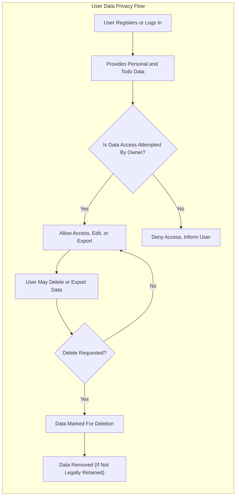

# Security and Privacy Requirements for Todo List Application

## Data Privacy Principles

THE Todo List application SHALL treat all user-provided data, including account credentials and todo contents, as strictly confidential and accessible only by the authenticated user who owns the data.

WHEN a user submits account or todo data, THE application SHALL collect, store, and process only as much information as is strictly required for minimal todo list operation. THE system SHALL NOT collect unnecessary data nor use collected data for unauthorized purposes such as advertising, profiling, or resale, unless the user gives explicit, informed consent.

IF anyone except the rightful authenticated user attempts to access data belonging to another user, THEN THE system SHALL deny access and SHALL clearly inform the requester that such access is unavailable for privacy reasons.

WHEN a user deletes their account or todo items, THE application SHALL ensure full and permanent erasure of all user-facing data within a timeline not to exceed 7 days, except where legal requirements mandate retention. THE system SHALL NOT retain or use deleted user data for any purpose, unless required for legal or regulatory reasons, in which case these SHALL be clearly communicated to the user before deletion is confirmed.

## User Data Ownership and Control

THE user SHALL retain complete ownership and control over all account and todo data within the service. THE system SHALL provide a feature for users to export their data securely and efficiently, ensuring exported data is only accessible to the authenticated owner via a clear, secure process.

WHEN a user requests deletion of their account, THE system SHALL initiate a business process for erasure of all personally identifiable information and todo content belonging to that user. IF deletion cannot be completed immediately due to regulatory constraints, THEN THE system SHALL provide clear language describing retention requirements, expected duration, and user rights regarding remaining data.

WHEN a user requests an export of their data, THE system SHALL ensure the data is packaged in a widely accessible format (e.g., CSV or JSON), and SHALL verify the authenticated identity of the requestor before export.

IF legal regulations or contractual obligations require post-deletion retention of certain data (e.g., for investigation, dispute resolution, or compliance), THEN THE Todo List application SHALL present these obligations to the user before processing deletion, stating: what data will be retained, why, and the anticipated duration, in plain and accessible language.

## Session and Token Management

THE Todo List service SHALL require user authentication for all operations involving access or modification of todos or sensitive personal information. WHEN a user logs in, THE system SHALL issue a secure session token valid for a maximum, finite period (e.g., 24 hours max per session) and SHALL enforce automatic logout upon session expiration.

IF a user logs out manually or system detects inactivity for a set threshold (e.g., 30 minutes), THEN THE session token SHALL be immediately invalidated, terminating access. IF a token is expired, malformed, or tampered with, THEN THE system SHALL prevent any access or action for that token and SHALL notify the user if appropriate.

WHEN suspicious activities occur, such as logins from unfamiliar or geographically distant locations, repeated failed logins, or unusual access patterns, THE system SHALL proactively notify the affected user, provide instructions on how to secure their account (e.g., change password, review session activity), and escalate to support if risk persists.

## Basic Security Expectations

THE system SHALL protect all credentials and user data from unauthorized access, alteration, or disclosure by both internal personnel and external parties. All access controls SHALL be built on strict authentication and user verification. Accessible features SHALL be limited based on user session state and explicit permissions.

WHEN personally identifiable data is accessed or updated, THE system SHALL guarantee that no party except the authenticated user can read, modify, delete, or export such data.

THE system SHALL provide clear user messaging for all security-significant actions such as login from a new device, password reset, account changes, unauthorized attempt alerts, or policy violations. WHEN notification is required, THE content SHALL be direct, actionable, and worded for non-technical users.

IF a privacy or security bug, incident, or policy violation is identified or poses risk to user data, THEN THE system SHALL promptly notify all affected users with a clear summary of the issue, recommended protective actions, and a method to contact support or request further remediation.

WHEN laws (such as data protection or user rights regulations) apply, THE system SHALL guarantee these rights to every user, including data access, correction, erasure, and portability, regardless of user country.

## Business Workflow Diagram: Data Privacy and Ownership

## User Messaging and Transparency Requirements

THE service SHALL provide users with accessible, plain-language explanations of all important data handling practices, including private account controls, export processes, deletion timing, and what information is collected and why.

WHEN a significant change occurs to privacy, security, or data policy, THE user SHALL be notified in advance with a clear summary and any required user actions. WHEN user action is required (e.g., password reset for account take-over protection), THE system SHALL give step-by-step instructions and accessible support contact information.

## Summary — Trust and Business Guarantees

THE Todo List application SHALL consistently maintain user trust by implementing the above privacy, data ownership, session management, and security principles across all user facing and internal services. ALL requirements above represent non-negotiable, business-level service guarantees for every user of the minimal Todo List feature set.