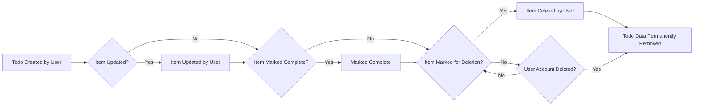

# Todo Item Data Lifecycle Requirements

## 1. Todo Item Lifecycle Overview

A user interacts with their personal todo list by creating, editing, marking complete/incomplete, and deleting tasks. The lifecycle of each todo item is dictated exclusively by user intent, from the moment of creation until permanent removal. Todo items persist in the user's experience until the user consciously deletes them or deletes their entire account. No automatic, scheduled, or system-initiated lifecycle events change the status of a todo or its data; all state changes are driven solely by explicit user actions.

## 2. Retention and Deletion Rules

- WHEN a user creates a todo, THE system SHALL retain the todo until the user takes explicit action to remove it or deletes their account.
- WHEN a user marks a todo as complete, THE system SHALL retain the todo and update its status only—data SHALL NOT be deleted or archived.
- WHEN a user edits a todo, THE system SHALL update the todo’s content and reflect most recent changes, making the edited values instantly visible to the user.
- IF a user requests to delete a todo, THEN THE system SHALL permanently remove that todo from all user-facing and business application processes without delay.
- WHEN a user deletes their account, THE system SHALL permanently delete all associated todos as an intrinsic part of account removal, erasing them from the business context completely.
- THERE SHALL be no background process or system logic that deletes or archives todos automatically for any reason unrelated to direct user or account deletion action.

## 3. User-Initiated Data Removal Workflows

- WHEN a user deletes a todo, THE system SHALL immediately exclude the todo from their task list and any business logic referencing active tasks.
- WHEN a user requests deletion of a todo that they do not own, THEN THE system SHALL refuse the action and produce a clear, user-facing authorization error that does not disclose the existence or non-existence of the target todo.
- WHEN a user deletes their account, THE system SHALL irreversibly erase all relevant todos alongside user data, with no possibility of later recovery.
- THERE SHALL be no administrative or system-initiated mechanism to restore or recover deleted todos under any circumstances.
- WHEN a user requests to delete an already-deleted todo, THE system SHALL respond with a meaningful error message without any backend side effects.
- WHEN any user action targets another user’s todo for read, update, completion, or deletion, THE system SHALL deny the action, confirming item-level access control is in place.

## 4. Data Consistency and Transaction Scenarios

- WHEN a user rapidly issues multiple updates or deletes targeting the same todo, THE system SHALL process these actions sequentially and SHALL guarantee that only the latest user intent is persistently reflected.
- IF a delete and an update request are received in close succession for a todo, THEN THE system SHALL process them in a manner that always results in either a fully deleted item or a correctly updated item, with no partial or intermediate state ever visible to the user.
- WHEN a user attempts to access a todo immediately after deleting it, THE system SHALL return a clear, explicit error and SHALL NOT allow the todo to be accidentally read.
- WHEN multiple requests target unrelated todos, THE system SHALL guarantee isolation: no operation on one item SHALL affect the business state or visibility of any other todo.
- THE system SHALL always reflect the user’s action instantly; the todo list SHALL never display outdated results including deleted or changed todos after the relevant operation completes.

## 5. Permissions and Privacy Boundaries

- THE system SHALL allow each user to access, modify, or delete only their own todos. No user SHALL ever access, see, or act on another user’s todos in any circumstance.
- WHEN a user tries any operation (view, update, delete, mark complete) on a todo belonging to another user, THE system SHALL provide an error explaining access is denied, without leaking any existence or content details about the targeted todo.
- WHEN data is deleted by user intent or account deletion, THE system SHALL guarantee such data is unrecoverable by users, administrators, or any system operator.
- THERE SHALL be no business logic or workflow that enables system-driven recovery, backup restoration for a single todo, or forced retention after user/account-initiated removal.

## 6. Business Rationale and Edge Cases

- The above lifecycle ensures user expectations for data privacy, ownership, and consent are strictly met at all times.
- Irreversible deletion by user action or account deletion is a hard business requirement: all data must vanish from business (not just technical) perspectives, supporting privacy law compliance and user trust.
- WHEN errors occur due to race conditions (rapid multi-action), THE system SHALL always display business-consistent feedback, guaranteeing no partial, orphaned, or ghost items remain visible or interactable.
- No part of the workflow relies on user knowledge about storage or backend logic; every requirement describes only what the user can observe and control via the business process.

---