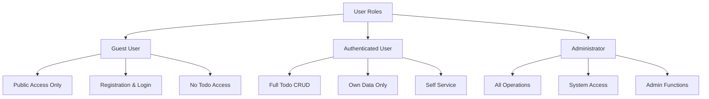

# Security and Compliance Requirements for Todo List Application

## 1. Security Requirements Overview

### 1.1 Purpose and Scope

THE Todo list application SHALL implement comprehensive security measures to protect user data, prevent unauthorized access, and ensure system integrity. This document defines all security and compliance requirements from a business perspective, specifying WHAT security controls must be implemented without prescribing HOW to implement them.

THESE security requirements apply to:
- User authentication and account management
- Authorization checks for all operations
- Data protection during storage and transmission
- Input validation for all user-provided data
- Session and token management
- Error handling that protects system information
- Administrative access controls
- Audit logging and monitoring
- Compliance with regulatory standards

### 1.2 Security Objectives

THE security framework SHALL achieve these objectives:
- Protect user credentials from unauthorized access and compromise
- Ensure only authenticated users can access their personal todos
- Prevent unauthorized data modification or deletion
- Protect data in transit through encryption
- Protect data at rest through encryption
- Maintain data integrity and consistency
- Provide secure error handling that does not expose system internals
- Support user privacy and data protection rights
- Enable compliance with applicable regulations (GDPR, CCPA, etc.)
- Support incident detection and response

### 1.3 Security Principles

THESE principles guide all security decisions:
- **Defense in Depth**: Multiple layers of security controls rather than relying on single mechanism
- **Least Privilege**: Users and processes have minimum required permissions
- **Fail Secure**: Errors result in secure state, not open access
- **User-Centric**: Security enables rather than hinders legitimate user activities
- **Transparency**: Security measures are documented and explained
- **Regularity Testing**: Security controls are tested and validated regularly

---

## 2. Authentication System

### 2.1 Authentication Overview

WHEN a user accesses the Todo application, THE system SHALL verify the user's identity through secure authentication before granting access to protected resources.

THE system SHALL use JWT (JSON Web Tokens) as the primary authentication mechanism for session management and API access.

### 2.2 User Registration Process

WHEN a user initiates account registration, THE system SHALL follow this complete workflow:

1. **Registration Initiation**
   - User navigates to registration page
   - System displays registration form with email and password fields
   
2. **Input Collection and Initial Validation**
   - User enters email address
   - User enters password
   - User confirms password
   - User clicks "Register" button

3. **Email Validation**
   - WHEN user submits email, THE system SHALL validate email format conforms to RFC 5321 standard
   - IF email format is invalid, THE system SHALL display error "Please enter a valid email address" and remain on registration page
   - IF email format is valid, THE system SHALL check email uniqueness

4. **Email Uniqueness Check**
   - WHEN email format is valid, THE system SHALL query user database to verify email is not already registered
   - IF email already exists, THE system SHALL display error "This email is already registered. Please log in or use a different email address" and remain on registration page
   - IF email is unique, THE system SHALL proceed to password validation

5. **Password Strength Validation**
   - WHEN email is unique, THE system SHALL validate password meets security requirements:
     * Minimum 8 characters in length
     * Includes at least one uppercase letter (A-Z)
     * Includes at least one lowercase letter (a-z)
     * Includes at least one numeric digit (0-9)
     * Includes at least one special character (!@#$%^&*)
   - IF password fails validation, THE system SHALL display specific error message explaining requirement not met (e.g., "Password must contain at least one uppercase letter")
   - THE system SHALL remain on registration page allowing user to modify password
   - IF password passes validation, THE system SHALL proceed to account creation

6. **Account Creation**
   - WHEN all validations pass, THE system SHALL create user account with:
     * User email address
     * Hashed and salted password (NOT plaintext)
     * Account creation timestamp
     * User status: "active"
   - THE system SHALL generate unique user ID for account identification

7. **Account Confirmation**
   - THE system SHALL send verification email to registered address
   - Email SHALL contain verification link with time-limited token
   - THE system SHALL set token expiration to 24 hours
   - User MUST verify email within 24 hours to fully activate account

8. **Registration Success**
   - WHEN account created successfully, THE system SHALL display success message "Registration successful. Verification email sent to [email]. Please verify your email to complete registration."
   - THE system SHALL redirect user to email verification page or login page
   - User can now log in with registered credentials after email verification

### 2.3 User Login Process

WHEN an existing user attempts to log in, THE system SHALL follow this complete workflow:

1. **Login Page Access**
   - User navigates to login page
   - System displays form with email and password fields

2. **Credential Submission**
   - User enters registered email address
   - User enters account password
   - User clicks "Log In" button
   - System receives login request

3. **Email Existence Verification**
   - WHEN login request received, THE system SHALL search database for user account with matching email
   - IF no account exists with provided email, THE system SHALL proceed to password validation failure (see step 5)
   - IF account exists, THE system SHALL proceed to password verification

4. **Password Verification**
   - WHEN user account found, THE system SHALL retrieve stored password hash for user
   - WHEN submitted password provided, THE system SHALL hash the submitted password using same algorithm and salt as stored hash
   - THE system SHALL compare computed hash to stored hash
   - IF hashes match, proceed to token generation (step 6)
   - IF hashes do not match, proceed to authentication failure (step 5)

5. **Authentication Failure Handling**
   - IF email not found OR password incorrect, THE system SHALL:
     * Display generic error message: "Invalid email or password. Please try again."
     * NOT indicate whether email exists or password is wrong (prevents user enumeration attacks)
     * Track failed login attempt in security logs
     * Count failed attempts for account
   - WHEN failed login attempts reach 5 within 15 minutes, THE system SHALL:
     * Lock the account temporarily
     * Display message: "Account temporarily locked due to multiple failed login attempts. Please try again in 15 minutes."
     * Send notification email to account holder: "Multiple failed login attempts detected on your account"
     * Remain on login page allowing user to try again after lockout period

6. **JWT Token Generation**
   - WHEN password verification succeeds, THE system SHALL generate JWT token containing:
     * **User ID**: Unique identifier for authenticated user
     * **Email**: User's email address
     * **Role**: User role (authenticatedUser or administrator)
     * **Issued At (iat)**: Timestamp when token was created (Unix time)
     * **Expiration (exp)**: Timestamp when token expires (Unix time, 15 minutes from iat)
     * **Token Type**: "Bearer" indicating JWT format
   - THE system SHALL sign token using secure cryptographic algorithm (HMAC-SHA256 or stronger)
   - THE system SHALL encrypt token for transit security

7. **Token Delivery to Client**
   - WHEN token generated, THE system SHALL transmit token to client application
   - PREFERRED: Token transmitted via httpOnly cookie (prevents JavaScript access)
   - ALTERNATIVE: Token transmitted in response body for client-side storage
   - Token SHALL be transmitted ONLY over HTTPS/TLS encrypted connection

8. **Session Establishment**
   - WHEN token received by client, THE system SHALL:
     * Store token securely in httpOnly cookie or secure client storage
     * Establish user session with 30-minute idle timeout
     * Set session creation timestamp
   - THE system SHALL track active session in server (optional, for monitoring)

9. **Login Success**
   - WHEN session established, THE system SHALL:
     * Display success message "Login successful. Redirecting to your todos..."
     * Redirect user to todo dashboard
     * Initialize todo list retrieval
     * Display user's todos

10. **Session Initialization**
    - WHEN user redirected to dashboard, THE system SHALL:
      * Include JWT token in all subsequent requests (Authorization header: "Bearer [token]")
      * Retrieve user's todos using authenticated user ID
      * Display personalized todo list
      * Maintain token for 30 minutes of activity

### 2.4 JWT Token Specifications

WHEN creating JWT tokens, THE system SHALL adhere to these specifications:

**Token Structure**: Header.Payload.Signature format

**Header**:
```json
{
  "alg": "HS256",
  "typ": "JWT"
}
```

**Payload for Authenticated User**:
```json
{
  "userId": "user_550e8400",
  "email": "user@example.com",
  "role": "authenticatedUser",
  "iat": 1634567890,
  "exp": 1634571490
}
```

**Payload for Administrator**:
```json
{
  "userId": "admin_456",
  "email": "admin@example.com",
  "role": "administrator",
  "isAdmin": true,
  "iat": 1634567890,
  "exp": 1634655290
}
```

**Token Validity Period**:
- Access token expiration: 15 minutes (900 seconds)
- Refresh token expiration: 7 days (if refresh token implemented)
- Token cannot be extended; user must re-authenticate after expiration

**Token Security**:
- WHEN token is created, THE system SHALL sign using secure key stored separately from application code
- THE system SHALL use HMAC-SHA256 or stronger algorithm for signing
- THE system SHALL NEVER include sensitive information (passwords, API keys) in token payload
- THE system SHALL NEVER log complete tokens in system logs (log only token identifier if necessary)

### 2.5 Password Security Requirements

WHEN storing user passwords, THE system SHALL follow these requirements:

**Password Hashing**:
- WHEN user password received, THE system SHALL NOT store password in plaintext
- THE system SHALL hash password using secure cryptographic hash function (bcrypt, Argon2, or PBKDF2)
- THE system SHALL generate unique salt for each password
- THE system SHALL apply salt before hashing
- THE system SHALL use password hashing cost factor of at least 10 iterations (bcrypt rounds)

**Password Transmission**:
- WHEN user submits password, THE system SHALL accept password ONLY over HTTPS/TLS encrypted connection
- THE system SHALL NEVER transmit passwords over unencrypted HTTP
- THE system SHALL NOT include password in URL parameters or query strings
- THE system SHALL NEVER log passwords in any log files or error messages

**Password Reset Functionality**:
- WHEN user requests password reset, THE system SHALL:
  1. Accept email address from user
  2. Generate time-limited reset token (valid 1 hour)
  3. Send reset email containing reset link with token
  4. Display message "Password reset email sent if account exists"
- WHEN user clicks reset link, THE system SHALL:
  1. Verify reset token is valid and not expired
  2. Display password reset form
  3. Accept new password meeting requirements
  4. Hash and store new password
  5. Invalidate all existing JWT tokens for security
  6. Display message "Password reset successful. Please log in with new password"

**Password Policy**:
- Minimum length: 8 characters
- Maximum length: 128 characters
- Must contain uppercase letter, lowercase letter, number, special character
- Cannot reuse last 5 passwords
- System does NOT expire passwords (modern security practice)

---

## 3. Authorization and Access Control

### 3.1 Role-Based Access Control (RBAC) System

THE Todo application implements role-based access control with three distinct roles:



### 3.2 Guest User Role (Unauthenticated)

**Role Definition**: Users who have not authenticated to the system

**Permitted Operations**:
- THE system SHALL allow guest users to access registration page
- THE system SHALL allow guest users to access login page
- THE system SHALL allow guest users to view public information (landing page, help information)
- THE system SHALL allow guest users to initiate password recovery process

**Restricted Operations**:
- WHEN guest user attempts to create todo, THE system SHALL deny operation and display "Please log in to create todos"
- WHEN guest user attempts to view todos, THE system SHALL deny operation and redirect to login page
- WHEN guest user attempts to modify any data, THE system SHALL deny operation
- WHEN guest user attempts to access administrative functions, THE system SHALL deny operation

**API Access**:
- Guest users CANNOT access authenticated endpoints
- Request to authenticated endpoint WITHOUT valid JWT token SHALL result in 401 Unauthorized response

### 3.3 Authenticated User Role (Primary User)

**Role Definition**: Registered user who successfully logged in with valid credentials

**Permitted Operations**:

1. **Todo Creation**
   - WHEN authenticated user submits create todo request, THE system SHALL allow operation
   - THE system SHALL associate created todo with authenticated user's ID
   - THE system SHALL NOT allow user to create todo for another user

2. **Todo Reading**
   - WHEN authenticated user requests their todos, THE system SHALL return all todos belonging to that user
   - THE system SHALL NOT return todos created by other users
   - THE system SHALL return complete todo data (ID, title, status, timestamps)

3. **Todo Updating**
   - WHEN authenticated user submits update request, THE system SHALL verify user owns the todo
   - IF user owns todo, THE system SHALL allow title update
   - IF user owns todo, THE system SHALL allow status update
   - IF user does not own todo, THE system SHALL deny with error "Unauthorized to modify this todo"

4. **Todo Deletion**
   - WHEN authenticated user submits delete request, THE system SHALL verify user owns the todo
   - IF user owns todo, THE system SHALL allow permanent deletion
   - IF user does not own todo, THE system SHALL deny with error "Unauthorized to delete this todo"

5. **Status Toggle**
   - WHEN authenticated user marks todo complete, THE system SHALL update status to "completed"
   - WHEN authenticated user marks todo incomplete, THE system SHALL update status to "incomplete"
   - THE system SHALL apply changes only to user's own todos

6. **Account Management**
   - THE system SHALL allow user to view their account email
   - THE system SHALL allow user to change their password
   - THE system SHALL allow user to request email verification
   - THE system SHALL allow user to logout

**Restrictions for Authenticated Users**:
- WHEN authenticated user attempts to view another user's todos, THE system SHALL deny access
- WHEN authenticated user attempts to modify administrator settings, THE system SHALL deny access
- WHEN authenticated user attempts to access system logs, THE system SHALL deny access
- WHEN authenticated user attempts to manage other user accounts, THE system SHALL deny access

### 3.4 Administrator Role

**Role Definition**: System operator with elevated privileges

**Permitted Operations**:
- THE system SHALL allow administrator to perform all authenticated user operations
- THE system SHALL allow administrator to create todos and manage their own todo list
- THE system SHALL allow administrator to access system monitoring endpoints
- THE system SHALL allow administrator to view system status and health information
- THE system SHALL allow administrator to access system logs for troubleshooting (audit logs only)
- THE system SHALL allow administrator to manage user accounts (if multi-user future)
- THE system SHALL allow administrator to configure system settings
- THE system SHALL allow administrator to reset user passwords in emergency situations

**Administrative Restrictions**:
- WHEN administrator attempts unauthorized administrative actions, THE system SHALL enforce same restrictions as authenticated users
- Administrators do NOT have automatic access to other users' todos (must follow same authorization rules)
- Administrative access SHALL be logged for audit trail

### 3.5 Authorization Enforcement Mechanism

WHEN any authenticated request is received, THE system SHALL perform authorization checks in this order:

1. **Authentication Verification**
   - Extract JWT token from request (Authorization header or cookie)
   - Validate token signature and expiration
   - IF token invalid or expired, return 401 Unauthorized and redirect to login

2. **Role Identification**
   - Extract user role from token payload
   - Identify required role(s) for requested operation
   - IF user role does not match required role, return 403 Forbidden

3. **Resource Ownership Verification**
   - For resource-specific operations (update, delete), extract resource ID
   - Query database for resource owner
   - Compare resource owner to authenticated user ID
   - IF user does not own resource, return 403 Forbidden with message "Unauthorized to access this resource"

4. **Operation Permission Check**
   - Verify user role permits the requested operation (CREATE, READ, UPDATE, DELETE)
   - Consult permission matrix (see section 3.6)
   - IF operation not permitted, return 403 Forbidden

5. **Rate Limiting Check** (Optional)
   - Check if user has exceeded rate limits for operation
   - IF limit exceeded, return 429 Too Many Requests

### 3.6 Complete Permission Matrix

| Operation | Guest | Authenticated User | Administrator | Notes |
|-----------|:-----:|:------------------:|:--------------:|-------|
| Register Account | ✅ | ❌ | ❌ | Only new users |
| Login | ✅ | ✅ | ✅ | All users can login |
| View Login Page | ✅ | ✅ | ✅ | Authenticated redirected to dashboard |
| Logout | ❌ | ✅ | ✅ | Requires authentication |
| Create Todo | ❌ | ✅ | ✅ | Only own todos |
| View Own Todos | ❌ | ✅ | ✅ | Cannot view others' todos |
| View All Todos | ❌ | ❌ | ✅ | Admin only for monitoring |
| Update Own Todo | ❌ | ✅ | ✅ | Only own todos |
| Update Any Todo | ❌ | ❌ | ✅ | Admin only if needed |
| Delete Own Todo | ❌ | ✅ | ✅ | Only own todos |
| Delete Any Todo | ❌ | ❌ | ✅ | Admin only if needed |
| Mark Todo Complete | ❌ | ✅ | ✅ | Own todos only |
| Change Password | ❌ | ✅ | ✅ | Own account only |
| View Account Info | ❌ | ✅ | ✅ | Own account only |
| Access Admin Panel | ❌ | ❌ | ✅ | System administration |
| View System Status | ❌ | ❌ | ✅ | Monitoring and health |
| Manage Users | ❌ | ❌ | ✅ | User administration |
| View Audit Logs | ❌ | ❌ | ✅ | System monitoring |

---

## 4. Data Protection and Encryption

### 4.1 Encryption Requirements

**Data in Transit**:
- WHEN user submits any data to server, THE system SHALL transmit ONLY over HTTPS/TLS encrypted connection
- THE system SHALL enforce minimum TLS version 1.2 (recommend 1.3)
- THE system SHALL NOT accept unencrypted HTTP connections for any authenticated operation
- THE system SHALL obtain valid SSL/TLS certificate from trusted certificate authority
- THE system SHALL validate certificate on every request

**Data at Rest**:
- WHEN sensitive data stored in database, THE system SHALL encrypt using AES-256 encryption
- THE system SHALL use secure key derivation for encryption keys
- Encryption keys SHALL be stored separately from encrypted data
- THE system SHALL NOT store encryption keys in application source code
- THE system SHALL implement secure key rotation mechanism

**Sensitive Data Elements**:
- User passwords (hashed with salt, never plaintext)
- User email addresses
- Todo content (titles and descriptions)
- JWT tokens in transit
- Session identifiers

### 4.2 Password Storage Security

WHEN storing user passwords, THE system SHALL:
- NOT store passwords in plaintext under any circumstances
- Hash passwords using bcrypt with minimum 10 rounds OR Argon2 with equivalent strength
- Generate unique random salt for each password
- Apply salt before hashing
- Store hash and salt (salted hash includes salt)
- Compare submitted password to stored hash, never plaintext comparison

**Password Hashing Verification**:
- WHEN user logs in, submitted password hashed using same algorithm
- Computed hash compared to stored hash (never the plaintext)
- If hashes match, user authenticated
- If hashes don't match, authentication fails

### 4.3 Secure Data Storage

**Database Security**:
- Database connection requires authentication credentials
- Database user account has minimal required permissions (principle of least privilege)
- Database access restricted to authorized application servers only
- Database does NOT accept direct internet connections
- Database communications use SSL/TLS encryption

**Access Control**:
- Database credentials stored in secure configuration management system
- Database credentials NOT committed to version control
- Database credentials rotated periodically
- Access to database credentials limited to authorized personnel

**Backup Security**:
- Database backups encrypted using same encryption as production data
- Backup encryption keys stored separately from backups
- Backups stored in secure location with access restrictions
- Backup restore process tested regularly to ensure recovery capability

### 4.4 Sensitive Data Handling

**Data NOT Logged**:
- THE system SHALL NEVER log passwords in any form
- THE system SHALL NEVER log complete JWT tokens
- THE system SHALL NEVER log plaintext credit card numbers (not applicable here)
- THE system SHALL NEVER log personal identification information in audit logs

**Data NOT Exposed in Errors**:
- Error messages SHALL NOT reveal database structure
- Error messages SHALL NOT reveal system file paths
- Error messages SHALL NOT reveal internal IP addresses
- Error messages SHALL NOT reveal technology stack details

**Data NOT in URLs**:
- Sensitive data SHALL NOT appear in URL parameters
- Passwords SHALL NOT be passed in URL query strings
- JWT tokens SHALL NOT appear in URLs
- User identifiers should not be exposed in URLs if possible

---

## 5. Input Validation and Sanitization

### 5.1 Server-Side Validation Requirement

WHEN user submits any data, THE system SHALL validate all inputs on server side (NOT relying on client-side validation alone)

Client-side validation improves user experience but does NOT provide security. Server-side validation is mandatory.

### 5.2 Todo Title Validation

WHEN user creates or updates todo with title/description, THE system SHALL validate:

1. **Non-Empty Requirement**
   - IF title is empty string, THE system SHALL reject with error "Title cannot be empty"
   - IF title contains only whitespace (spaces, tabs, newlines), THE system SHALL reject

2. **Length Validation**
   - WHEN title length less than 1 character after trimming, THE system SHALL reject
   - WHEN title length greater than 255 characters, THE system SHALL reject with error "Title cannot exceed 255 characters"

3. **Character Type Validation**
   - THE system SHALL accept all UTF-8 characters in titles
   - THE system SHALL accept letters, numbers, spaces, punctuation, special characters, emojis
   - THE system SHALL NOT reject titles for character content

4. **Trimming**
   - THE system SHALL trim leading whitespace before storing
   - THE system SHALL trim trailing whitespace before storing
   - THE system SHALL preserve internal spaces and formatting

### 5.3 Email Address Validation

WHEN user registers or updates email, THE system SHALL validate:

1. **Format Validation**
   - Email must match standard email format: localpart@domain
   - Email must contain exactly one @ symbol
   - Email domain must have at least one dot (example.com)
   - Email must follow RFC 5321 standard

2. **Length Validation**
   - Email must not exceed 254 characters (RFC standard)

3. **Uniqueness Validation**
   - WHEN user registers with email, THE system SHALL check database for existing account
   - IF email already exists, THE system SHALL reject registration
   - IF email is unique, registration may proceed

### 5.4 Password Strength Validation

WHEN user creates or updates password, THE system SHALL validate:

1. **Length Requirements**
   - Minimum 8 characters
   - Maximum 128 characters

2. **Complexity Requirements**
   - MUST contain at least one uppercase letter (A-Z)
   - MUST contain at least one lowercase letter (a-z)
   - MUST contain at least one numeric digit (0-9)
   - MUST contain at least one special character (!@#$%^&*)

3. **History Check**
   - IF user is changing password, THE system SHALL NOT allow reuse of last 5 passwords
   - THE system SHALL store salted hash of previous passwords for comparison
   - THE system SHALL never store plaintext previous passwords

### 5.5 Cross-Site Scripting (XSS) Prevention

WHEN displaying user-provided content (todo titles), THE system SHALL:

1. **HTML Escaping**
   - Escape HTML special characters: &, <, >, ", '
   - Convert to HTML entities: & becomes &amp;, < becomes &lt;, etc.

2. **Content Security Policy**
   - THE system SHALL implement Content-Security-Policy header
   - CSP SHALL restrict script sources to trusted locations
   - CSP SHALL disallow inline scripts

3. **Input Sanitization**
   - THE system SHALL remove or encode potentially dangerous HTML tags
   - Script tags SHALL be removed before storage if present
   - Event handlers (onload, onclick, etc.) SHALL be removed

4. **Output Encoding**
   - When rendering todo title, THE system SHALL encode as appropriate for context (HTML, JSON, URL)
   - THE system SHALL use context-appropriate encoding library

### 5.6 SQL Injection Prevention

WHEN querying database, THE system SHALL:

1. **Parameterized Queries**
   - THE system SHALL use parameterized queries or prepared statements
   - User input SHALL NEVER be concatenated into SQL query strings
   - Query parameters SHALL be bound separately from SQL code

2. **Example Safe Query**
   ```sql
   -- SAFE: Parameterized query
   SELECT * FROM todos WHERE user_id = ? AND title = ?
   [userId, userTitle]
   
   -- UNSAFE: String concatenation
   SELECT * FROM todos WHERE user_id = '" + userId + "' AND title = '" + title + "'"
   ```

3. **Database Escaping**
   - IF parameterized queries not available, THE system SHALL use database-specific escaping
   - Escape function SHALL be appropriate for database engine (MySQL, PostgreSQL, etc.)

### 5.7 CSRF (Cross-Site Request Forgery) Protection

WHEN implementing state-changing operations (CREATE, UPDATE, DELETE), THE system SHALL:

1. **CSRF Token Implementation**
   - Generate unique CSRF token per user session
   - Include CSRF token in forms and AJAX requests
   - Token SHALL be unique and not reusable

2. **Token Validation**
   - WHEN form submitted, THE system SHALL verify CSRF token matches session token
   - IF tokens don't match, THE system SHALL reject request with error
   - THE system SHALL NOT process request without valid CSRF token

3. **Token Refresh**
   - Tokens SHALL be regenerated after successful login
   - Tokens MAY be regenerated periodically for additional security

### 5.8 Request Rate Limiting

WHEN receiving requests, THE system SHALL implement rate limiting:

1. **Login Rate Limiting**
   - After 5 failed login attempts in 15 minutes, lock account temporarily
   - Account unlock automatic after 15 minutes OR via email link
   - Display clear message: "Account locked due to multiple failed attempts. Try again in 15 minutes."

2. **API Rate Limiting**
   - Limit authenticated user to 100 requests per minute (configurable)
   - Limit guest user to 10 requests per minute (registration, login endpoints)
   - Return 429 Too Many Requests when limit exceeded

3. **Rate Limit Headers**
   - THE system SHALL include rate limit info in response headers:
     * X-RateLimit-Limit: Maximum requests
     * X-RateLimit-Remaining: Remaining requests
     * X-RateLimit-Reset: When limit resets

---

## 6. Error Handling Security

### 6.1 Secure Error Messages

WHEN operation fails, THE system SHALL provide error feedback WITHOUT revealing:
- Database error details or SQL queries
- System file paths or directory structure
- Internal IP addresses or server names
- Stack traces or debugging information
- Whether specific email exists in system (prevents user enumeration)
- Technical implementation details

### 6.2 Error Message Examples

**SECURE ERROR MESSAGES** (Appropriate for users):
- "Invalid email or password. Please try again."
- "Unable to create todo. Please try again."
- "Connection lost. Please check your internet and refresh."
- "Your session expired. Please log in again."

**INSECURE ERROR MESSAGES** (Do NOT use):
- "SQLException: Column 'users.email' not found in database"
- "NullPointerException at Line 145 of TodoController.java"
- "Server error: /var/www/app/database/todos.db connection failed"
- "User record not found for email test@example.com"

### 6.3 Authentication Error Responses

WHEN login fails, THE system SHALL:
- Display same message whether email doesn't exist OR password incorrect
- NOT indicate which factor failed (prevents user enumeration)
- Track failed attempts for security monitoring
- Lock account after multiple failures

**Error Message**: "Invalid email or password. Please try again."

### 6.4 Authorization Error Responses

WHEN user lacks permission for operation, THE system SHALL:
- Return HTTP 403 Forbidden status code
- Display message: "You don't have permission to perform this action"
- NOT reveal why permission denied (prevents information leakage)
- Log unauthorized attempt for security audit

### 6.5 Validation Error Responses

WHEN user input validation fails, THE system SHALL:
- Explain specifically what validation failed
- Suggest correction (e.g., "Email must contain @ symbol")
- Display message without exposing system details
- Allow user to correct and retry

### 6.6 Security Event Logging

THE system SHALL log these security events:
- Failed login attempts (email address, timestamp, IP if available)
- Successful logins (user ID, timestamp, IP if available)
- Unauthorized access attempts (resource, user, timestamp)
- Input validation failures (type, user, timestamp)
- Permission check failures (operation, user, resource)
- Suspicious patterns (multiple failures, rapid requests)

**Log Content Restrictions**:
- Logs SHALL NOT contain passwords or tokens
- Logs SHALL NOT contain complete email addresses if possible
- Logs SHALL use consistent format for correlation
- Logs SHALL include timestamp, user ID, action, result

---

## 7. Session Security

### 7.1 Session Creation and Management

WHEN user logs in successfully, THE system SHALL:
- Create new session with unique session identifier
- Generate JWT token with 15-minute expiration
- Issue httpOnly secure cookie containing token
- Set session creation timestamp
- Initialize session timeout timer

### 7.2 Session Duration and Timeout

**Access Token Expiration**: 15 minutes
- WHEN 15 minutes elapses, access token expires automatically
- Requests with expired token return 401 Unauthorized
- User must re-authenticate (login again)

**Idle Session Timeout**: 30 minutes
- WHEN no authenticated requests received for 30 minutes, session invalidated
- User automatically logged out
- Re-authentication required for next access

**Absolute Session Timeout**: 24 hours
- WHEN 24 hours elapses since login, session expires regardless of activity
- All tokens invalidated
- User must re-authenticate

### 7.3 Session Invalidation

WHEN user logs out, THE system SHALL:
- Invalidate JWT token immediately
- Clear session data from server (if session tracking implemented)
- Remove token from client (cookie or storage)
- Delete any session-specific data
- Prevent reuse of invalidated token

### 7.4 Token Refresh Mechanism (Optional Enhancement)

IF implemented, refresh tokens SHALL:
- Have longer expiration (7 days) than access tokens (15 minutes)
- Allow obtaining new access token without re-login
- Be usable only once (one-time use)
- Be invalidated on logout
- Support token rotation for additional security

**Refresh Token Flow**:
1. User logs in, receives access token (15 min) + refresh token (7 days)
2. User makes requests with access token
3. When access token nearing expiration (< 5 min), client requests new access token
4. Client sends refresh token to server
5. Server validates refresh token (valid, not expired, not reused)
6. Server issues new access token + new refresh token
7. Old refresh token marked as used, cannot be reused

### 7.5 Multi-Device Session Handling

THE system SHALL support user accessing from multiple devices:
- Each device/browser gets independent JWT token
- Tokens expire independently on each device
- Logout on one device does NOT logout other devices
- Each session is completely independent

---

## 8. Data Privacy

### 8.1 Privacy Principles

THE system SHALL collect and handle user data according to:
- **Data Minimization**: Collect only data required for functionality
- **Purpose Limitation**: Use data only for stated purposes
- **Storage Limitation**: Retain data only as long as necessary
- **Integrity and Confidentiality**: Protect data from unauthorized access
- **Accountability**: Maintain records of data handling practices

### 8.2 Data Collection

THE system collects ONLY:
- User email address (for authentication and contact)
- Password hash (for authentication security)
- Todo content (titles and descriptions)
- Completion status (for functionality)
- Timestamps (creation and modification)

THE system does NOT collect:
- User location data
- User browsing history
- User device information (beyond technical requirement)
- User demographics
- User payment information
- User contact information beyond email

### 8.3 Data Usage

WHEN processing user data, THE system SHALL:
- Use data exclusively for providing todo application functionality
- NOT sell or share user data with third parties
- NOT use data for marketing without explicit consent
- NOT use data for profiling or behavioral analysis
- NOT use data for purposes other than stated to user

### 8.4 Data Retention

**Todo Data Retention**:
- WHEN user creates todo, system retains indefinitely until user deletes
- WHEN user deletes todo, system removes permanently within 24 hours
- System does NOT maintain indefinite archive of deleted todos

**Account Data Retention**:
- WHEN user account active, system retains email and password hash
- WHEN user requests account deletion, system deletes all data within 30 days
- After 30 days, no user data remains in system

**Log Data Retention**:
- Security/audit logs retained minimum 90 days
- After 90 days, logs may be deleted or archived
- Sensitive information (emails, IPs) removed from logs before archival

### 8.5 User Data Access Rights

THE system SHALL enable user to:
- Access their account information (email address)
- Download their todo data in standard format (if requested)
- Update their email address
- Change their password
- Delete their account and all associated data

---

## 9. Compliance Requirements

### 9.1 Security Standards and Best Practices

THE system SHALL follow these recognized standards:
- **OWASP Top 10**: Address top security risks
- **NIST Cybersecurity Framework**: Risk management approach
- **CWE Top 25**: Avoid common software weaknesses
- **SANS Top 25**: Prevent high-risk vulnerabilities

### 9.2 Regulatory Compliance

Depending on user location, THE system MAY need to comply with:

**GDPR (General Data Protection Regulation)** - EU Users:
- User right to data access
- User right to data deletion ("right to be forgotten")
- Data breach notification within 72 hours
- Privacy policy clearly explaining data use
- Data processing agreements if applicable

**CCPA (California Consumer Privacy Act)** - California Users:
- User right to know what data collected
- User right to delete personal information
- User right to opt-out of data sale
- Non-discrimination for exercising rights

### 9.3 Security Testing and Validation

BEFORE release, THE system SHALL undergo:
- Security code review by qualified security professional
- Input validation testing with malicious payloads
- Authentication and authorization testing
- Encryption verification
- Session security testing
- Error handling security review

### 9.4 Vulnerability Management Process

THE system SHALL maintain process for:
- Identifying vulnerabilities (code review, security tools, responsible disclosure)
- Assessing severity and impact
- Prioritizing fixes
- Testing patches
- Deploying patches
- Documenting remediation

### 9.5 Incident Response Plan

THE system SHALL have documented plan for:
- Detecting security incidents (suspicious logs, alerts, reports)
- Containing incident (isolate systems, preserve evidence)
- Investigating incident (root cause, scope, impact)
- Notifying affected users (if data breach)
- Recovering systems to normal operation
- Post-incident review and improvements

---

## 10. Security Implementation Checklist

Before deployment, verify:

### Authentication
- [ ] JWT token library supports HS256 or stronger
- [ ] Password hashing uses bcrypt, Argon2, or PBKDF2
- [ ] Unique salt generated for each password
- [ ] Login rate limiting implemented (5 attempts in 15 minutes)
- [ ] Password reset requires email verification
- [ ] Session timeout implemented (30 minutes idle, 24 hours absolute)

### Authorization
- [ ] Role-based access control implemented for all three roles
- [ ] Resource ownership verified before operations
- [ ] Permission matrix enforced for all operations
- [ ] Administrators cannot bypass authorization checks
- [ ] API endpoints validate token on every request

### Data Protection
- [ ] HTTPS/TLS configured with minimum TLS 1.2
- [ ] SSL/TLS certificate obtained from trusted CA
- [ ] Database encryption implemented for sensitive data
- [ ] Database connections use credentials and SSL
- [ ] Backup encryption configured
- [ ] Encryption keys stored separately from data

### Input Validation
- [ ] Server-side validation implemented for all inputs
- [ ] SQL injection prevention via parameterized queries
- [ ] XSS prevention via HTML escaping
- [ ] Email format validation implemented
- [ ] Password strength validation enforced
- [ ] CSRF tokens implemented for state-changing operations

### Error Handling
- [ ] Error messages don't reveal system details
- [ ] Passwords never logged or displayed
- [ ] SQL errors not shown to users
- [ ] Stack traces not displayed to users
- [ ] Security events logged appropriately
- [ ] Sensitive data excluded from logs

### Session Security
- [ ] httpOnly cookies used for token storage
- [ ] Secure flag set on cookies (HTTPS only)
- [ ] Token signature validation on every request
- [ ] Token expiration checked on every request
- [ ] Logout invalidates tokens
- [ ] Multi-device sessions handled correctly

---

## 11. Security Responsibility Matrix

| Area | Development | Operations | Security |
|------|:----------:|:----------:|:--------:|
| **Code Security** | ✅ Lead | ⚠️ Monitor | ✅ Review |
| **Infrastructure** | ⚠️ Input | ✅ Lead | ✅ Review |
| **Key Management** | ❌ None | ✅ Lead | ✅ Policy |
| **Vulnerability Scanning** | ✅ Run | ⚠️ Monitor | ✅ Lead |
| **Security Testing** | ✅ Execute | ⚠️ Monitor | ✅ Lead |
| **Incident Response** | ✅ Triage | ✅ Execute | ✅ Lead |
| **Patch Management** | ✅ Apply | ✅ Deploy | ✅ Monitor |
| **Compliance** | ✅ Implement | ⚠️ Assist | ✅ Lead |
| **Audit Logging** | ✅ Implement | ✅ Monitor | ✅ Review |

**Legend**: ✅ = Primary responsibility | ⚠️ = Secondary/Supporting | ❌ = Not involved

---

## 12. Summary

The security and compliance requirements define a comprehensive framework ensuring the Todo application protects user data, prevents unauthorized access, and maintains system integrity. 

**Key Security Characteristics**:
- **Strong Authentication**: JWT tokens with 15-minute expiration
- **Granular Authorization**: Role-based access with ownership verification
- **Data Encryption**: In-transit (TLS) and at-rest encryption
- **Input Security**: Server-side validation and XSS/SQL injection prevention
- **Secure Sessions**: Session timeouts and logout mechanisms
- **Privacy Protection**: Data minimization and user rights support
- **Compliance Ready**: Standards-based approach to regulatory requirements

All security controls balance security effectiveness with user experience, ensuring the application is both secure and usable for daily todo management.

---

> *Developer Note: This document defines **business security requirements only**. All technical implementations (encryption libraries, key management systems, authentication frameworks, specific TLS configurations, database security features, etc.) are at the discretion of the development team. This document specifies WHAT security controls must be implemented and WHY, not HOW to implement them technically.*