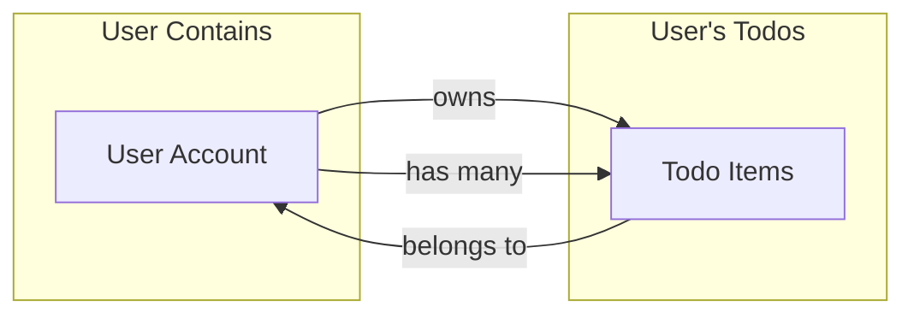

# Todo List Application - Complete Requirements Analysis

## Executive Summary

This comprehensive requirements analysis provides the complete specification for a minimal yet fully functional Todo List application. The application is designed as a personal task management system enabling individual users to create, organize, track, and manage their daily tasks securely and efficiently.

The requirements are organized into 11 primary documentation files covering all aspects of the application from business vision through technical environment specifications. This document serves as the authoritative source for all backend development, testing, and deployment activities.

---

## 1. Service Overview (01-service-overview.md)

### Purpose
The service overview establishes the foundational business context for the Todo List application, explaining its purpose, value proposition, and core functionality.

### Key Content
- **Business Justification**: The application addresses the gap between simple paper-based notes and complex team collaboration tools by providing a focused personal task management solution
- **Core Features**: Seven minimum viable features including user authentication, todo creation/retrieval/update/deletion, and user profile management
- **User Personas**: Four primary personas (busy professionals, students, home managers, casual users) with distinct usage patterns
- **Success Metrics**: Engagement metrics (MAU, DAU, session frequency), functionality metrics, user satisfaction metrics, and system health metrics
- **Key Principles**: Simplicity first, data privacy and security, reliability and uptime, user control

### Business Model
The application operates on a freemium model with core functionality available free to all authenticated users. Future premium features may include advanced filtering, priority tagging, and export functionality, while core features remain free.

---

## 2. User Actors and Authentication (02-user-actors-authentication.md)

### Two User Actors Defined

**Guest Actor (Unauthenticated)**
- Can access registration and login endpoints
- Cannot create, view, or manage todos
- Cannot access authenticated user features
- Transitions to User actor upon successful registration or login

**User Actor (Authenticated Member)**
- Can create, view, update, and delete todos
- Can manage account settings and change password
- Can log out (single device or all devices)
- Complete data isolation - can only access own todos
- Exclusive ownership of all created todos

### Complete Authentication System

**Registration Requirements**
- Email validation: Valid format, unique across system
- Password validation: Minimum 8 characters, uppercase, lowercase, number required
- Account creation: Immediate activation upon verification
- Email verification: Required within 24 hours

**Login Requirements**
- Credential validation: Email and password verification
- JWT token generation: 15-minute access token, 30-day refresh token
- Session establishment: Track login timestamp and device information
- Error handling: Generic "Invalid email or password" message (prevents enumeration attacks)

**JWT Token Management**

**Access Token Structure**
```json
{
  "userId": "unique-user-id",
  "email": "user@example.com",
  "role": "user",
  "iat": 1234567890,
  "exp": 1234568890,
  "jti": "unique-token-id"
}
```
- Lifespan: 15 minutes
- Usage: Sent with every API request in Authorization header
- Purpose: Grant temporary authenticated access

**Refresh Token**
- Lifespan: 30 days
- Storage: httpOnly cookie (secure storage)
- Purpose: Obtain new access tokens without re-authentication
- Revocation: On logout, password change, or explicit session termination

### Token Refresh Mechanism
WHEN an access token approaches expiration, THE user **SHALL** use the refresh token to obtain a new access token without logging in again.

**Token Refresh Process**:
1. Client detects access token about to expire (within 2 minutes)
2. Client sends refresh token to token refresh endpoint
3. System validates refresh token (signature, expiration, session validity)
4. System generates new access token with 15-minute expiration
5. System returns new access token to client
6. Client uses new token for subsequent requests

IF the refresh token is invalid, expired, or session is no longer valid, THEN THE system **SHALL** reject the request and require the user to log in again.

### Permission Matrix

| Action | Guest | User |
|--------|:-----:|:----:|
| Register | ✅ | ❌ |
| Login | ✅ | ❌ |
| Logout | ❌ | ✅ |
| Create Todo | ❌ | ✅ |
| View Own Todos | ❌ | ✅ |
| Edit Own Todo | ❌ | ✅ |
| Delete Own Todo | ❌ | ✅ |
| View Other User's Todo | ❌ | ❌ |
| Edit Other User's Todo | ❌ | ❌ |
| Change Password | ❌ | ✅ |
| Access Admin Functions | ❌ | ❌ |

### Session Management

**Multi-Device Support**
- Users can maintain multiple simultaneous sessions from different devices
- Each device has independent access token and refresh token
- Per-device logout: Only that device's session ends
- Global logout: All device sessions terminate simultaneously

**Session Timeout**
- Absolute timeout: 30 days maximum session duration
- Inactivity timeout: 7 days of no API requests
- Active sessions: Maintained indefinitely if user remains active
- Expired sessions: Require user re-authentication

**Token Revocation**
- Logout: All tokens for that session immediately invalidated
- Password change: All tokens across all sessions revoked
- Global logout: All tokens for all sessions revoked
- Token blacklist: Invalid tokens tracked until original expiration time

---

## 3. Functional Requirements (03-functional-requirements.md)

### Complete Feature Set

The Todo List application provides the following functional capabilities:

### 3.1 User Authentication Functions

**User Registration**
WHEN a guest user provides email address and password, THE system **SHALL** validate all fields, check email uniqueness, and create a new user account with hashed password.

Required fields:
- Email address (required, unique, valid format)
- Password (required, minimum 8 characters, must include uppercase, lowercase, number)
- Display name (required, 2-50 characters)

**User Login**
WHEN a registered user provides email and password, THE system **SHALL** validate credentials within 2 seconds and return JWT tokens for successful authentication.

IF credentials are invalid, THEN THE system **SHALL** return HTTP 401 with generic error message "Invalid email or password"

**User Logout**
WHEN an authenticated user chooses to log out, THE system **SHALL** immediately invalidate their session tokens and clear authentication state.

### 3.2 Todo Creation

**Create New Todo**
WHEN an authenticated user submits a new todo, THE system **SHALL** validate input, store the todo with owner information, and return the created todo with unique ID.

Required input:
- Title (required, 1-200 characters, non-empty)
- Description (optional, 0-1000 characters)
- Due date (optional, ISO 8601 format, not in past)
- Priority (optional, one of: "low", "medium", "high", defaults to "medium")

**Validation Requirements**
- Title cannot be empty or whitespace-only
- Title cannot exceed 200 characters
- Description cannot exceed 1000 characters
- Due date must be today or future date
- Priority must be one of allowed values

**Response on Success**
THE system **SHALL** return HTTP 201 (Created) with complete todo object including:
- Generated unique todo ID
- All provided fields
- Creation timestamp
- Owner user ID
- Completion status (initially false)

### 3.3 Todo Retrieval

**Retrieve All User Todos**
WHEN an authenticated user requests their todo list, THE system **SHALL** return all todos owned by that user in paginated format.

Default behavior:
- Page size: 20 todos per page
- Sort order: By creation date, newest first
- Includes: Total count of all todos

**Pagination Parameters**
- Page number (optional, defaults to 1)
- Page size (optional, 10-100, defaults to 20)
- Sort field (optional, defaults to creation date)
- Filter (optional, by completion status)

**Response Format**
THE system **SHALL** return HTTP 200 with:
- Array of todo objects (up to page size)
- Total count of todos matching filter
- Current page number and page size
- Pagination metadata

**Retrieve Single Todo**
WHEN an authenticated user requests a specific todo by ID, THE system **SHALL** verify the user owns the todo and return complete details.

IF the todo doesn't exist, THEN THE system **SHALL** return HTTP 404
IF the user doesn't own the todo, THEN THE system **SHALL** return HTTP 403

### 3.4 Todo Update

**Update Todo Title and Description**
WHEN an authenticated user modifies a todo, THE system **SHALL** validate new values, verify ownership, update the todo, and record modification timestamp.

Updatable fields:
- Title (1-200 characters, required)
- Description (0-1000 characters, optional)
- Completion status (boolean)
- Priority (low/medium/high, optional)
- Due date (ISO 8601 format, optional)

**Validation on Update**
- All validation rules from creation apply to updates
- User must own the todo
- Title cannot be empty
- Character limits enforced

**Response on Success**
THE system **SHALL** return HTTP 200 with updated todo object.

### 3.5 Todo Deletion

**Delete Individual Todo**
WHEN an authenticated user deletes a todo, THE system **SHALL** verify ownership and permanently remove the todo from the database.

IF the todo doesn't exist, THEN THE system **SHALL** return HTTP 404
IF the user doesn't own the todo, THEN THE system **SHALL** return HTTP 403

**Response on Success**
THE system **SHALL** return HTTP 204 (No Content) or HTTP 200 with success confirmation.

### 3.6 Todo Completion

**Mark Todo Complete/Incomplete**
WHEN a user marks a todo as complete, THE system **SHALL** change the completion status and record the completion timestamp.

WHEN a user marks a completed todo as incomplete, THE system **SHALL** change status and clear the completion timestamp.

Completion does not prevent editing - completed todos can still be modified.

### 3.7 Search and Filtering

**Filter by Completion Status**
WHEN a user filters todos, THE system **SHALL** support:
- Show all todos
- Show only completed todos
- Show only incomplete/pending todos

**Search Todo Titles**
WHEN a user provides search query, THE system **SHALL** search for matching todos by title (case-insensitive substring match).

**Sort Options**
THE system **SHALL** support sorting by:
- Creation date (ascending/descending)
- Modified date (ascending/descending)
- Due date (earliest first, null values last)
- Priority level (low to high or reverse)

Default sort: Creation date descending (newest first)

### 3.8 Data Validation Requirements

**Field Length Constraints**
- Todo title: 1-200 characters
- Todo description: 0-1000 characters
- Email address: Valid format, unique across system
- Password: Minimum 8 characters (no maximum in constraints)

**Character Handling**
- System accepts UTF-8 characters in titles and descriptions
- Whitespace trimmed from beginning/end of text fields
- Emojis and special characters supported

**Timestamp Validation**
- Timestamps recorded in UTC timezone
- ISO 8601 format for all timestamp values
- Due dates cannot be in the past
- Timestamps immutable after recording

**User Limits**
- Maximum 10,000 todos per user
IF user reaches limit, THEN system **SHALL** reject new todo creation and inform user they must delete todos to continue

---

## 4. User Scenarios and Workflows (04-user-scenarios-workflows.md)

### Complete User Journeys

The application supports the following primary user scenarios:

### 4.1 User Registration Scenario

**Complete Registration Flow**

1. **Access Registration**: User navigates to registration interface
2. **Enter Email**: User provides valid email address
3. **Enter Password**: User provides password meeting requirements (minimum 8 chars, uppercase, lowercase, number)
4. **Confirm Password**: User re-enters password to prevent typos
5. **System Validation**: System checks email format, password strength, email uniqueness
6. **Email Verification**: System sends verification email to user
7. **Verification Completion**: User clicks verification link within 24 hours
8. **Account Activation**: Account becomes active and user can log in

**Success Confirmation**: "Your email has been verified. You can now log in."

**Error Scenarios**
- Invalid email format → "Please enter a valid email address"
- Email already registered → "An account with this email already exists"
- Password too weak → "Password must contain uppercase, lowercase, number, and special character"
- Passwords don't match → "Passwords do not match"
- Registration submission fails → "Registration failed. Please try again."
- Verification email not received → Can request resend, valid for 24 hours

### 4.2 User Login Scenario

**Complete Login Flow**

1. **Access Login Page**: User navigates to login interface
2. **Enter Credentials**: User provides email and password
3. **Submit Login**: User submits login form
4. **Credential Verification**: System validates email and password
5. **Token Generation**: System creates JWT access and refresh tokens
6. **Session Creation**: System establishes authenticated session
7. **Redirect to Dashboard**: User redirected to todo list view
8. **Display Welcome**: "Welcome back, [user email]"

**Error Scenarios**
- Email not found → "Invalid email or password"
- Incorrect password → "Invalid email or password" (same generic message)
- Account not verified → "Please verify your email before logging in"
- Account locked (after 5 failed attempts) → "Account temporarily locked. Try again in 15 minutes"
- Login submission fails → "Login failed. Please try again"

### 4.3 Creating a Todo Scenario

**Complete Todo Creation Flow**

1. **Initiate Creation**: User selects "New Todo" option
2. **Enter Title**: User provides todo title (required field)
3. **Enter Description**: User optionally provides details
4. **Set Due Date**: User optionally selects due date (must be today or future)
5. **Set Priority**: User optionally selects priority level
6. **Form Validation**: System validates all fields before submission
7. **Submit Todo**: User submits form
8. **Confirmation**: System displays "Todo created successfully"
9. **Display in List**: New todo appears immediately in user's list

**Field Validations**
- Title: Required, 1-200 characters
- Description: Optional, 0-1000 characters
- Due date: Must be today or future (past dates rejected)
- Priority: One of low/medium/high (defaults to medium)

**Error Scenarios**
- Missing title → "Title is required"
- Title too long → "Title cannot exceed 200 characters"
- Description too long → "Description cannot exceed 1000 characters"
- Past due date → "Due date cannot be in the past"
- Session expired → "Your session has expired. Please log in again"
- System error → "Failed to create todo. Please try again"
- User at quota → "You have reached the maximum number of todos (10,000). Please delete some todos before creating new ones"

### 4.4 Viewing Todo List Scenario

**Complete List Viewing Flow**

1. **Access Dashboard**: Authenticated user navigates to their todo list
2. **System Retrieves Todos**: System fetches all todos for authenticated user
3. **Apply Filters**: User optionally filters by completion status
4. **Apply Sort**: User optionally changes sort order
5. **Display List**: System displays todos with title, due date, priority, completion status
6. **Show Statistics**: System displays total todo count and pending count
7. **User Interaction**: User can edit, complete, delete, or create todos

**Default Display**
- Sort: By creation date, newest first
- Show: All todos (including completed)
- Format: Clear, readable list with essential information

**Error Scenarios**
- No todos exist → "No todos yet. Create your first todo to get started."
- Session expired → "Your session has expired. Please log in again"
- Cannot retrieve todos → "Unable to load todos. Please try again"

### 4.5 Completing a Todo Scenario

**Complete Todo Completion Flow**

1. **Identify Todo**: User sees pending todo in list
2. **Initiate Completion**: User clicks completion action/checkbox
3. **Update Status**: System changes completion status to true
4. **Record Timestamp**: System records completion timestamp
5. **Display Confirmation**: "Todo marked as complete"
6. **Update Visual**: Todo appears as completed (strikethrough or color change)
7. **Update Statistics**: Pending todo count decreases

**Behavior**
- Completed todos remain visible to user
- Completed todos can be edited and uncompleted
- Completion status toggle works instantly
- Filtering by "pending only" hides completed todos

**Error Scenarios**
- Todo not found → "Todo not found. It may have been deleted"
- Session expired → "Your session has expired. Please log in again"
- Permission denied → "You do not have permission to modify this todo"
- Todo deleted elsewhere → "This todo has been deleted and is no longer available"

### 4.6 Editing a Todo Scenario

**Complete Todo Editing Flow**

1. **Select Todo**: User identifies todo to edit
2. **Open Edit Form**: System displays form pre-populated with current values
3. **Modify Fields**: User updates title, description, due date, or priority
4. **Validate Input**: System validates changes in real-time
5. **Submit Changes**: User submits updated form
6. **Confirm Update**: System displays "Todo updated successfully"
7. **Display Changes**: Updated values appear in list and detail views

**Editable Fields**
- Title (1-200 characters, required)
- Description (0-1000 characters, optional)
- Due date (today or future, optional)
- Priority (low/medium/high, optional)
- Completion status (can edit while completing)

**Error Scenarios**
- Title made empty → "Title is required"
- Title exceeds limit → "Title cannot exceed 200 characters"
- Description exceeds limit → "Description cannot exceed 1000 characters"
- Invalid due date → "Due date cannot be in the past"
- Todo deleted elsewhere → "This todo has been deleted and is no longer available"
- Concurrent modification → "This todo was modified elsewhere. Please refresh and try again"

### 4.7 Deleting a Todo Scenario

**Complete Todo Deletion Flow**

1. **Select Todo**: User identifies todo to delete
2. **Request Confirmation**: System displays confirmation dialog
3. **Confirm Deletion**: User confirms deletion (cannot be undone)
4. **Permanent Removal**: System deletes todo from database
5. **Confirmation Message**: "Todo deleted successfully"
6. **Update List**: Todo immediately disappears from view
7. **Update Count**: Total todo count decreases

**Confirmation Requirements**
- User must explicitly confirm deletion
- System displays todo title in confirmation to prevent accidental deletion
- Message: "Are you sure you want to delete this todo? This action cannot be undone."

**Deletion Behavior**
- Deletion is permanent and irreversible
- Deleted todos cannot be recovered
- Deletion completes immediately (no queuing)
- All views update automatically

**Error Scenarios**
- User cancels deletion → Todo remains intact, no error
- Todo not found → "Todo not found. It may have already been deleted"
- Session expired → "Your session has expired. Please log in again"
- Permission denied → "You do not have permission to delete this todo"
- Concurrent deletion → "This todo has already been deleted"

### 4.8 User Logout Scenario

**Complete Logout Flow**

1. **Initiate Logout**: User selects logout option
2. **Clear Session**: System invalidates JWT tokens
3. **Revoke Refresh Token**: System marks refresh token as used/revoked
4. **Clear Client Data**: Client-side session and cached data cleared
5. **Redirect to Login**: User redirected to login page
6. **Confirmation**: "You have been logged out successfully"
7. **Session Terminated**: User must log in again to access todos

**Session Cleanup**
- Access token invalidated immediately
- Refresh token revoked and blacklisted
- All session data cleared from server
- Client-side authentication state cleared

**Error Scenarios**
- Session already expired → "You have been logged out"
- Logout request fails → "Logout failed. Please try again"
- User closes browser → Session eventually expires on server, next login required

---

## 5. Business Rules and Constraints (05-business-rules-constraints.md)

### Complete Business Rules

### 5.1 Todo Creation Rules

WHEN a user creates a new todo, THE system **SHALL** record the todo with unique identifier, creation timestamp, and completion status of incomplete.

WHEN a user creates a todo, THE system **SHALL** associate the todo exclusively with that user and prevent any other user from accessing it.

WHEN a user attempts to create a todo, THE system **SHALL** require a non-empty title field.

THE system **SHALL** limit each user to maximum 10,000 todos per account to prevent resource exhaustion.

IF a user attempts to create a todo when they have 10,000 todos, THEN THE system **SHALL** reject creation with error: "You have reached the maximum number of todos (10,000). Please delete some todos before creating new ones."

### 5.2 Title Requirements

THE todo title **SHALL** be between 1 and 255 characters in length (after trimming whitespace).

THE todo title **SHALL** be stored exactly as entered, preserving capitalization, spaces, and special characters.

THE system **SHALL** accept any Unicode characters in titles (letters, numbers, punctuation, emojis, special symbols).

IF a user submits a title containing only whitespace, THEN THE system **SHALL** reject as invalid.

### 5.3 Description Rules

WHE a user provides a description, THE system **SHALL** accept descriptions up to 5,000 characters in length.

IF a description exceeds 5,000 characters, THEN THE system **SHALL** reject the submission.

WHERE a user does not provide a description, THE todo **SHALL** be created successfully with empty/null description (optional field).

### 5.4 Todo Ownership Rules

THE system **SHALL** enforce strict ownership: each todo belongs to exactly one user.

WHEN a todo is created, THE system **SHALL** permanently associate it with the user who created it and prevent ownership transfer.

WHILE a user is authenticated, THE user **SHALL** be able to access and modify only todos they personally created.

IF a user attempts to access a todo created by another user, THEN THE system **SHALL** deny the request and prevent the operation.

### 5.5 Data Isolation

THE system **SHALL** ensure complete data isolation between users: each user's todo list is completely separate and inaccessible to other users.

WHEN a user retrieves their todo list, THE system **SHALL** return only todos created by that user, never including todos from other users.

IF one user is deleted, THEN all todos created by that user **SHALL** also be deleted to maintain data consistency.

### 5.6 Completion Status Rules

THE completion status of a todo **SHALL** be a boolean value: either complete (true) or incomplete (false).

WHEN a user marks a todo complete, THE system **SHALL** set completion status to true and record completion timestamp.

WHEN a user marks a completed todo incomplete, THE system **SHALL** set status to false and clear completion timestamp.

THE system **SHALL** allow editing of completed todos (title, description, etc.) without changing completion status unless explicitly updated.

### 5.7 Timestamp Management

THE system **SHALL** automatically record creation timestamps in UTC for all todos (users cannot manually set).

THE system **SHALL** automatically record updated timestamps whenever a todo is modified.

THE system **SHALL** store timestamps in ISO 8601 format for consistency.

WHEN a todo is retrieved, THE system **SHALL** include both created and updated timestamps in response.

### 5.8 Validation Rules

THE todo title is required and cannot be null, empty, or whitespace-only.

THE title length must be between 1 and 255 characters (inclusive).

THE description is optional and may be 0-5,000 characters.

THE system **SHALL** validate each field independently before saving (all-or-nothing approach).

IF any field fails validation, THEN THE system **SHALL** reject entire operation and return specific error for each failed field.

### 5.9 Email and Account Rules

WHEN a user registers, THE email address **SHALL** be unique across the entire system.

IF a user attempts to register with an email already in use, THEN THE system **SHALL** reject registration.

THE email address **SHALL** follow valid email format requirements (contains @, valid domain).

WHEN comparing emails for uniqueness, THE system **SHALL** use case-insensitive comparison.

### 5.10 Password Requirements

WHEN a user creates or changes password, THE password **SHALL** be minimum 8 characters.

THE password **SHALL** be stored securely using password hashing (not plaintext, not simple encryption).

THE user's plaintext password **SHALL** never be stored, logged, or displayed.

WHERE a user logs in, THE system **SHALL** compare provided password against stored hash using secure comparison.

### 5.11 System Constraints

THE system **SHALL** allow each user to maintain maximum 10,000 active todos.

IF a user reaches 10,000 todos and attempts to create another, THEN THE system **SHALL** reject creation.

WHERE a user reaches the limit, THE user **SHALL** be able to delete todos to make room for new ones.

WHEN a todo is deleted, THE system **SHALL** permanently remove it (no recovery available to users).

WHEN a user account is deleted, THE system **SHALL** permanently delete all todos associated with that account.

---

## 6. Error Handling and Recovery (06-error-handling-recovery.md)

### Complete Error Specification

The system implements comprehensive error handling across all functional areas:

### 6.1 Authentication Errors

**Invalid Login Credentials**
- HTTP Status: 401 Unauthorized
- Error Code: AUTH_INVALID_CREDENTIALS
- Message: "Invalid email or password. Please check your credentials and try again."
- Recovery: Attempt login again or use password reset

**Email Not Registered**
- HTTP Status: 401 Unauthorized
- Error Code: AUTH_EMAIL_NOT_FOUND
- Message: "No account found with this email address. Please register first or try a different email."
- Recovery: Navigate to registration to create new account

**Account Not Verified**
- HTTP Status: 403 Forbidden
- Error Code: AUTH_EMAIL_NOT_VERIFIED
- Message: "Your account is not yet activated. Please check your email for the verification link."
- Recovery: Click verification link in email (valid 24 hours) or request new verification email

**Session Expired**
- HTTP Status: 401 Unauthorized
- Error Code: AUTH_SESSION_EXPIRED
- Message: "Your session has expired. Please log in again to continue."
- Recovery: Click "Log In Again" button to return to login page

**Invalid or Malformed Token**
- HTTP Status: 401 Unauthorized
- Error Code: AUTH_INVALID_TOKEN
- Message: "Your authentication token is invalid. Please log in again."
- Recovery: Clear session/localStorage and log in to obtain fresh token

**Missing Authentication Token**
- HTTP Status: 401 Unauthorized
- Error Code: AUTH_MISSING_TOKEN
- Message: "Authentication required. Please log in to access this feature."
- Recovery: Log in to obtain authentication token

**Token Refresh Failed**
- HTTP Status: 401 Unauthorized
- Error Code: AUTH_REFRESH_FAILED
- Message: "Unable to refresh your session. Please log in again."
- Recovery: Must log in to establish new authenticated session

### 6.2 Validation Errors

**Missing Required Field**
- HTTP Status: 400 Bad Request
- Error Code: VALIDATION_MISSING_REQUIRED_FIELD
- Message: "The following fields are required: [field names]. Please fill them in and try again."
- Recovery: Fill in missing required fields and resubmit

**Invalid Email Format**
- HTTP Status: 400 Bad Request
- Error Code: VALIDATION_INVALID_EMAIL_FORMAT
- Message: "Please enter a valid email address (e.g., user@example.com)."
- Recovery: Review email address, correct typos, and resubmit

**Email Already Registered**
- HTTP Status: 409 Conflict
- Error Code: VALIDATION_EMAIL_ALREADY_EXISTS
- Message: "This email address is already registered. Please log in or use a different email address."
- Recovery: Log in if you have account, or register with different email

**Password Too Short**
- HTTP Status: 400 Bad Request
- Error Code: VALIDATION_PASSWORD_TOO_SHORT
- Message: "Password must be at least 8 characters long."
- Recovery: Enter longer password (minimum 8 characters)

**Todo Title Missing**
- HTTP Status: 400 Bad Request
- Error Code: VALIDATION_TODO_TITLE_REQUIRED
- Message: "Todo title is required. Please enter a title for your todo."
- Recovery: Provide non-empty title and resubmit

**Todo Title Too Long**
- HTTP Status: 400 Bad Request
- Error Code: VALIDATION_TODO_TITLE_TOO_LONG
- Message: "Todo title must be 255 characters or fewer. You have entered [current length] characters."
- Recovery: Shorten title to 255 characters or fewer

**Todo Description Too Long**
- HTTP Status: 400 Bad Request
- Error Code: VALIDATION_TODO_DESCRIPTION_TOO_LONG
- Message: "Todo description must be 5,000 characters or fewer. You have entered [current length] characters."
- Recovery: Shorten description to 5,000 characters or fewer

**Invalid Data Type**
- HTTP Status: 400 Bad Request
- Error Code: VALIDATION_INVALID_DATA_TYPE
- Message: "Invalid data format for [field name]. Expected [expected type], received [actual type]."
- Recovery: Correct data to expected format and resubmit

**Invalid Date Format**
- HTTP Status: 400 Bad Request
- Error Code: VALIDATION_INVALID_DATE_FORMAT
- Message: "Please enter a valid date in the format YYYY-MM-DD (e.g., 2024-12-25)."
- Recovery: Enter date in correct format (YYYY-MM-DD)

### 6.3 Permission Errors

**Insufficient Permissions**
- HTTP Status: 403 Forbidden
- Error Code: PERMISSION_INSUFFICIENT_PRIVILEGES
- Message: "You do not have permission to perform this action."
- Recovery: Cannot perform action; contact administrator if you believe this is incorrect

**Cannot Modify Other User's Todo**
- HTTP Status: 403 Forbidden
- Error Code: PERMISSION_CANNOT_MODIFY_OTHER_USER_TODO
- Message: "You can only modify your own todos. This todo belongs to another user."
- Recovery: Only work with your own todos

**Cannot View Other User's Todo**
- HTTP Status: 403 Forbidden
- Error Code: PERMISSION_CANNOT_VIEW_OTHER_USER_TODO
- Message: "You do not have permission to view this todo."
- Recovery: Only view and work with your own todos

### 6.4 Data Not Found Errors

**Todo Not Found**
- HTTP Status: 404 Not Found
- Error Code: NOT_FOUND_TODO
- Message: "The todo you are looking for could not be found. It may have been deleted or the ID is incorrect."
- Recovery: Navigate to todo list to see available todos

**User Account Not Found**
- HTTP Status: 404 Not Found
- Error Code: NOT_FOUND_USER_ACCOUNT
- Message: "Your account could not be found. Please log in again or contact support."
- Recovery: Log out and log back in; contact support if problem persists

### 6.5 System Constraint Errors

**Too Many Todos**
- HTTP Status: 400 Bad Request
- Error Code: CONSTRAINT_TOO_MANY_TODOS
- Message: "You have reached the maximum number of todos (10,000). Please delete some todos before creating new ones."
- Recovery: Delete existing todos to make room for new ones

**Rate Limit Exceeded**
- HTTP Status: 429 Too Many Requests
- Error Code: CONSTRAINT_RATE_LIMIT_EXCEEDED
- Message: "You are making requests too quickly. Please wait a moment and try again."
- Recovery: Wait 1 minute before making additional requests

### 6.6 Concurrent Modification Errors

**Todo Modified by Another Session**
- HTTP Status: 409 Conflict
- Error Code: CONCURRENCY_TODO_MODIFIED
- Message: "This todo was modified elsewhere before you saved your changes. Your changes could not be saved to avoid losing the other changes. Please refresh and try again."
- Recovery: Refresh todo list and try editing again with current data

**Deleted During Edit**
- HTTP Status: 410 Gone
- Error Code: CONCURRENCY_TODO_DELETED
- Message: "The todo you were editing has been deleted. Your changes could not be saved."
- Recovery: Go back to todo list; deleted todo is not recoverable

### 6.7 Error Response Structure

All error responses follow consistent structure:

```json
{
  "success": false,
  "error": {
    "code": "[ERROR_CODE]",
    "message": "[User-friendly message]",
    "details": "[Optional technical details]",
    "timestamp": "[ISO 8601 timestamp]"
  }
}
```

---

## 7. Performance Expectations (07-performance-expectations.md)

### Performance Targets by Operation

**Authentication Operations**
- User Registration: ≤ 2 seconds (includes validation, account creation, verification email)
- User Login: ≤ 1 second (credential validation, JWT generation)
- JWT Token Refresh: ≤ 500 milliseconds (must be faster than login)

**Todo Operations**
- Create Todo: ≤ 1 second (validation, persistence, response)
- Retrieve All Todos: 500ms - 2 seconds (varies by todo count, paginated for 100+)
- Retrieve Single Todo: ≤ 500 milliseconds
- Update Todo: ≤ 1 second (validation, persistence, response)
- Delete Todo: ≤ 1 second (removal operation)

**List Management**
- Search Todos: 1-2 seconds (varies by search complexity)
- Filter/Sort Todos: ≤ 1.5 seconds (includes filtering and sorting logic)
- Per-Page Retrieval: ≤ 1 second (for paginated lists)

### Response Time Standards

**Performance Perception**
- ≤ 1 second: Perceived as immediate and responsive
- 1-3 seconds: Noticeable but acceptable
- > 3 seconds: Feels slow and impacts user satisfaction

**Progressive Loading**
IF an operation requires > 1 second to complete, THEN THE system **SHALL** provide loading indicator or progress indication within 500 milliseconds of starting the operation.

### Concurrent User Support

THE system **SHALL** support minimum 1,000 concurrent authenticated users simultaneously.

WHEN 1,000 users are actively using the system simultaneously, THEN THE system **SHALL** maintain individual response time targets for each user regardless of other users' activity.

### Data Size Limits

**Todos Per User**
- Efficient support: Up to 1,000 todos without performance degradation
- Acceptable performance: Up to 10,000 todos with pagination
- Pagination recommended: When user has 100+ todos

**List Retrieval Performance**
| Todo Count | Target Response |
|------------|---------------|
| 1-100 | 500 ms |
| 101-500 | 1 second |
| 501-1000 | 1.5 seconds |
| 1001-10000 | 2 seconds (paginated) |

### Performance Degradation

IF the system approaches maximum concurrent user capacity (near 1,000 users), THEN THE system **SHALL** maintain critical operation performance (1-2 seconds) while non-critical operations may degrade to 3-5 seconds.

---

## 8. Data Model Concepts (08-data-model-concepts.md)

### Conceptual Data Structures

### 8.1 User Data Concepts

**User Identity**
- Unique identifier (internal system reference)
- Email address (login credential, must be unique)
- Password (securely hashed, never stored plaintext)
- Display name (user-visible account name)

**User Account Information**
- Account creation date (timestamp of registration)
- Last login timestamp (track recent activity)
- Account status (active, suspended, or deleted)
- Authentication history (login timestamps, devices)

**User Lifecycle**
1. Registration Phase: Guest creates account with email/password
2. Active Phase: User successfully authenticates and accesses todos
3. Inactive Phase: User exists but hasn't accessed system recently
4. Deletion Phase: User account marked for deletion or permanently removed

### 8.2 Todo Data Concepts

**Essential Todo Information**
- Unique identifier (internal reference, unique per user's todos)
- Title (what the todo is about, required)
- Description (optional details, up to 5,000 characters)
- Completion status (true=complete, false=incomplete)
- Owner/Creator (which user owns this todo)

**Todo Tracking Information**
- Created timestamp (when todo was created, immutable)
- Last modified timestamp (when todo was last changed)
- Completed timestamp (when todo was marked complete, null if not completed)

**Additional Todo Properties**
- Due date (optional, must be today or future)
- Priority level (optional, one of: low/medium/high)

**Todo Lifecycle**
1. Creation: User creates new todo with title
2. Active/Pending: Todo exists and user is working on it
3. Completed: User marks todo as done
4. Modified: User edits todo details
5. Deleted: User removes todo permanently

### 8.3 Data Relationships

**User-to-Todo Relationship**



**Relationship Rules**
- One user can own many todos
- Each todo belongs to exactly one user (creator)
- Users have exclusive ownership of their todos
- No sharing between users (all private/personal)
- No cross-user access or references

### 8.4 Data Isolation

THE system **SHALL** maintain complete data isolation between users.

WHEN a user views their todos, THE system **SHALL** display only todos they created, never including todos from other users.

THE system implements isolation at every level:
- Query level: All todo queries filtered by user ID
- API level: Verify user ownership before returning data
- Authorization level: Deny access to todos from other users
- Database level: Foreign key constraints link todos to users

### 8.5 Data Ownership Rules

THE owner of a todo is the only user who can:
- View that todo
- Edit that todo's information
- Mark that todo complete/incomplete
- Delete that todo

THE system **SHALL** verify ownership before allowing any operation on a todo.

### 8.6 Data Validation Scope

**User Data Validation**
- Email: Valid format (contains @, domain), must be unique
- Password: Minimum 8 chars, uppercase, lowercase, number, special character
- Display name: 2-50 characters

**Todo Data Validation**
- Title: 1-255 characters, required, not whitespace-only
- Description: 0-5,000 characters, optional
- Due date: ISO 8601 format, today or future only
- Priority: One of low/medium/high
- Completion status: Boolean (true/false)

### 8.7 Data Retention and Cleanup

**Active Data Retention**
- User data: Retained indefinitely while account is active
- Todo data: Retained indefinitely unless user deletes
- Completed todos: Retained for user history/reference

**Deletion Handling**
- User deletion: All todos owned by that user are deleted
- Todo deletion: Todo permanently removed, no recovery
- Soft deletes: Not used (permanent hard deletes)

**Audit Trail** (Optional Enhancement)
- Creation timestamp: When todo was created
- Modified timestamp: When todo was last changed
- Completion timestamp: When marked complete
- Provides users with history of activity

---

## 9. Security and Compliance (09-security-compliance.md)

### Comprehensive Security Requirements

### 9.1 Authentication Security

**JWT Token Implementation**
THE system **SHALL** use JSON Web Tokens (RFC 7519) for stateless user authentication.

WHEN a user logs in successfully, THE system **SHALL** generate JWT containing:
- User ID
- User email
- User role ("user" or "guest")
- Token issuance timestamp (iat)
- Token expiration timestamp (exp)
- Unique token identifier (jti)

**Token Signing**
- Algorithm: HMAC-SHA256 (HS256) or RSA-256 (RS256)
- Secret key: Minimum 256 bits entropy, stored securely
- Signature validation: Required on every authenticated request

**Token Expiration**
- Access token: 15 minutes from issuance
- Refresh token: 30 days from issuance
- Session timeout: 30 days absolute, 7 days inactivity

### 9.2 Login Security

WHEN a user attempts to log in, THE system **SHALL**:
1. Validate email and password fields provided
2. Verify email exists in system
3. Validate password against stored hash
4. Proceed with login only if both validations pass

THE system **SHALL NOT** reveal whether email exists in system (prevents user enumeration).

THE system **SHALL** return HTTP 401 "Invalid email or password" for all failed logins (same message for both email and password failures).

THE system **SHALL** log all login attempts (successful and failed) with timestamp and IP address.

### 9.3 Session Management

**Session Initialization**
WHEN a user successfully logs in, THE system **SHALL** create new session with:
- Unique session ID
- Device information (user agent, IP address)
- Login timestamp
- Token association

**Session Timeout**
- Absolute: Maximum 30 days session duration
- Inactivity: 7 days without API requests
- Token expiration: Access token expires after 15 minutes

WHEN a session expires, THE system **SHALL** require user to re-authenticate.

**Session Invalidation**
WHEN a user logs out, THE system **SHALL**:
1. Immediately invalidate access token
2. Immediately invalidate refresh token
3. Clear all session data
4. Prevent token reuse after logout

THE system **SHALL** maintain token blacklist for duration of original expiration time.

**Multi-Device Sessions**
- Users can have multiple concurrent sessions from different devices
- Each device maintains independent tokens
- Per-device logout: Only that session ends
- Global logout: All sessions terminate

### 9.4 Password Requirements

THE system **SHALL** enforce password requirements:
- Minimum length: 8 characters
- Maximum length: 128 characters  
- Must contain uppercase letter (A-Z)
- Must contain lowercase letter (a-z)
- Must contain numeric digit (0-9)
- Must contain special character from: !@#$%^&*()_+-=[]{}|;:,.<>?

THE system **SHALL** reject passwords not meeting requirements with specific error message.

### 9.5 Password Storage

THE system **SHALL NEVER** store user passwords in plain text.

THE system **SHALL** hash all passwords using secure algorithm:
- Preferred: bcrypt with cost factor ≥ 10
- Alternative: Argon2id or PBKDF2 with 100,000+ iterations

THE system **SHALL** use unique salt for each password (provided by hashing algorithm).

WHEN comparing passwords during login, THE system **SHALL** use secure comparison functions resistant to timing attacks.

### 9.6 Data Protection

**Encryption in Transit**
THE system **SHALL** use HTTPS (TLS 1.2 or higher) for all client-server communication.

THE system **SHALL**:
- Redirect all HTTP to HTTPS
- Set HSTS header with max-age ≥ 31,536,000 seconds
- Use strong TLS cipher suites (TLS_ECDHE_RSA_WITH_AES_128_GCM_SHA256 or stronger)
- Require TLS certificate validation

**Encryption at Rest**
THE system **SHALL** encrypt sensitive data in database using AES-256-GCM.

Encryption keys:
- Stored in separate key management system
- Rotated regularly (minimum annually)
- Never stored with encrypted data

**Data Integrity**
THE system **SHALL** verify data integrity using:
- Cryptographic hashing (SHA-256 or stronger)
- Checksums for critical data
- Database referential integrity
- Transaction support for multi-step operations

### 9.7 Input Security

**Server-Side Validation**
THE system **SHALL** validate ALL user input at server side (never trust client validation).

Validation requirements:
- Email: Valid format
- Password: Meets complexity requirements
- Todo title: Non-empty, 1-255 characters
- Todo description: 0-5,000 characters
- Status: Boolean values only

THE system **SHALL** reject invalid input with HTTP 400 and specific error.

**SQL Injection Prevention**
THE system **SHALL** prevent SQL injection by:
- Using parameterized queries (prepared statements) for ALL database operations
- Never concatenating user input into SQL queries
- Using ORM frameworks providing SQL injection protection
- Escaping special characters appropriately

**Cross-Site Scripting (XSS) Prevention**
THE system **SHALL** prevent XSS by:
- Encoding all user-provided content before returning in responses
- Never executing user input as code or scripts
- Properly escaping special characters in HTML/JavaScript/CSS contexts
- Setting Content-Security-Policy headers

**Input Length Limits**
THE system **SHALL** enforce maximum lengths:
- Email: 255 characters
- Password: 128 characters
- Todo title: 255 characters
- Todo description: 5,000 characters
- Search query: 100 characters

IF request exceeds length limits, THEN THE system **SHALL** reject with HTTP 400.

### 9.8 Security Headers

THE system **SHALL** implement security headers in all responses:

```
Strict-Transport-Security: max-age=31536000; includeSubDomains
X-Content-Type-Options: nosniff
X-Frame-Options: DENY
Content-Security-Policy: default-src 'self'
X-XSS-Protection: 1; mode=block
```

### 9.9 API Security

THE system **SHALL** implement API security:
- All endpoints require HTTPS
- API rate limiting: Maximum 100 requests per minute per IP
IF rate limit exceeded, THEN THE system **SHALL** return HTTP 429
- Request size limit: Maximum 10 KB per request
- Request timeout: 30 seconds maximum
- HTTP method validation: Proper methods for operations (GET, POST, PUT, DELETE)

### 9.10 Security Logging

THE system **SHALL** log security events:
- User registration (timestamp)
- User login attempts, successful and failed (IP address, timestamp)
- User logout (timestamp)
- Password changes (timestamp)
- Failed authentication attempts (IP address, count)
- Unauthorized access attempts (user ID, resource)
- Token validation failures

THE system **SHALL NEVER** log:
- User passwords or password hashes
- Full JWT tokens
- Sensitive user data in plain text

**Log Retention**
- Login/authentication: 90 days minimum
- Password changes: 1 year
- User registration: 1 year
- Failed attempts: 90 days
- Archived logs: Securely stored

### 9.11 Security Monitoring

THE system **SHALL** monitor for suspicious activities:
- Multiple failed login attempts from single IP (trigger alert after 5 failures in 15 minutes)
- Requests from multiple countries in short timeframe
- Attempts to access resources of other users
- Rapid API requests exceeding rate limits
- Requests with malformed input or injection attempts

WHEN suspicious activities detected, THEN THE system **SHALL** alert administrators.

### 9.12 OWASP Top 10 Coverage

**A1: Broken Authentication**
- JWT-based authentication with secure tokens
- Passwords hashed with bcrypt (cost ≥ 10)
- Session management with timeout and invalidation
- Password requirements enforced

**A2: Broken Access Control**
- User ownership verification for all operations
- Role-based access control (guest vs. user)
- Proper HTTP status codes (401, 403, 404)

**A3: Injection**
- Parameterized queries for all database operations
- Input validation for all user data
- Output encoding for all displayed content

**A5: Security Misconfiguration**
- HTTPS-only communication (TLS 1.2+)
- Security headers (HSTS, CSP, etc.)
- Secure cookie attributes

**A7: Identification and Authentication Failures**
- Strong password requirements
- JWT tokens with proper expiration
- Secure password storage (bcrypt)

---

## 10. Technical Environment (10-technical-environment.md)

### Technical Infrastructure Overview

### 10.1 System Architecture

**Client-Server Architecture**
- Frontend Client: Separate UI communicates exclusively via APIs
- Backend Server: Provides RESTful APIs for business logic and data persistence
- Stateless Design: Each request contains all needed information (via JWT)
- Separation of Concerns: Authentication, business logic, data layers separated

**Technology Stack Orientation**
- Backend Framework: Node.js-based framework (TypeScript for type safety)
- Runtime: JavaScript runtime optimized for I/O operations
- Language: TypeScript with strong typing
- API Style: RESTful API following HTTP standards

### 10.2 API Architecture

**RESTful Design Principles**
- Resource-based URLs (e.g., `/users`, `/todos`)
- HTTP methods map to operations (GET, POST, PUT, PATCH, DELETE)
- Stateless communication (authentication via JWT)
- Standard HTTP status codes for responses

**Request/Response Structure**
- Request: JSON body, Authorization header with Bearer token
- Response: JSON format with status code and data/error
- Errors: Include error code, message, and details

**Example Request/Response**
```
REQUEST: GET /todos HTTP/1.1
Authorization: Bearer {jwt_token}

RESPONSE: 200 OK
{
  "success": true,
  "data": [{"id": "todo1", "title": "Task", "completed": false}]
}
```

### 10.3 Authentication Protocol

**JWT Implementation** (See section 9.1 for detailed requirements)

**Token Structure**
```
header.payload.signature

Header: {"alg":"HS256","typ":"JWT"}
Payload: {"userId":"...","email":"...","role":"user","iat":...,"exp":...}
Signature: HMAC(header.payload, secret_key)
```

**Token Flow**
1. User logs in with email/password
2. Server validates credentials
3. Server generates access + refresh tokens
4. Client stores tokens securely
5. Client includes access token in every API request
6. Server validates token on each request
7. When access token expires, client uses refresh token to get new token

### 10.4 Database Requirements

**Data Persistence Needs**
- User Accounts: Email, password hash, profile, timestamps
- Todos: Title, description, status, owner, timestamps
- Sessions: Active sessions, tokens, device info (optional)
- Audit Trail: User actions, modifications (optional but recommended)

**Storage Capacity Estimates**
- Initial: 1,000-10,000 users with 5,000-100,000 total todos
- Average todo: ~500 bytes
- Total: 50 MB - 500 MB initial, growing to gigabytes at scale

**Data Integrity Requirements**
- User uniqueness: One email per account
- Todo ownership: Each todo belongs to exactly one user
- Referential integrity: Todos reference valid users
- Transaction safety: All-or-nothing updates
- No orphaned records: Cascade deletes on user deletion

### 10.5 External Services

**Email Services** (Optional but recommended)
- Email verification during registration
- Password reset links
- Optional: Todo reminders, activity digests
- Requirement: Reliable delivery within minutes
- Recommended: Third-party service (SendGrid, Mailgun, AWS SES)

**Logging Services**
- Centralized logging infrastructure
- Application logs: Info, warnings, errors
- Request logs: HTTP method, path, status, duration
- Authentication logs: Login attempts, token issues
- Error logs: Stack traces, detailed error info
- Structured logging (JSON format) for parsing
- Retention: Minimum 30 days for logs

**Monitoring and Alerting**
- Uptime monitoring: Track application availability
- Performance metrics: CPU, memory, disk, database connections
- API metrics: Request rate, response time, error rate
- Alerting: Automatic notifications on threshold violations
- Options: ELK Stack, Prometheus+Grafana, or cloud services

### 10.6 Environment Tiers

**Development Environment**
- Local machine deployment
- Auto-reload code on changes
- Verbose logging and detailed errors
- Test data fixtures
- Loose security constraints

**Staging Environment**
- Production-like configuration
- Real database structure
- Realistic data volume
- All external services active
- Same monitoring as production
- Full security controls

**Production Environment**
- High-availability setup with redundancy
- Database replication and automated backups
- Load balancing for traffic spikes
- Strict access controls and security
- 24/7 monitoring and incident response
- Backup and disaster recovery

### 10.7 Deployment Process

**Automated Deployment Pipeline**
1. Developer commits code to Git
2. Automated tests run; deployment blocked on failure
3. Code built and dependencies compiled
4. Staging deployment automated
5. Testing on staging environment
6. Production deployment (manual approval gate)
7. Health checks verify deployment
8. Rollback capability for failures

**Deployment Frequency**
- Development: Multiple times per day
- Staging: Daily to weekly
- Production: As needed (typically daily)

### 10.8 Configuration Management

**Environment-Specific Settings**
- Database URLs (different per tier)
- API keys (different credentials per environment)
- Feature flags (enable/disable features)
- Log level (verbose in dev, warnings only in prod)
- CORS settings (restrict origins appropriately)
- Rate limiting (relaxed in dev, strict in prod)

**Secure Configuration Storage**
- Environment variables for sensitive data
- Configuration files for non-sensitive settings
- Secrets management system (AWS Secrets Manager, HashiCorp Vault)
- Never commit secrets to version control

### 10.9 Monitoring and Logging

**Application Logging Strategy**
THE application **SHALL** log all significant events in structured JSON format.

**Log Types**
- Request logging: Method, path, status, duration, request ID
- User actions: Login, logout, todo creation/modification, deletion
- Errors: Error type, stack trace, context information
- Performance: Slow queries, slow requests
- Security: Authentication attempts, permission denials

**Log Format Example**
```json
{
  "timestamp": "2024-01-15T10:30:45.123Z",
  "level": "INFO",
  "component": "TodoService",
  "message": "Todo created",
  "userId": "user123",
  "todoId": "todo456",
  "duration": 42
}
```

**Performance Metrics to Track**
- API response times (p50, p95, p99 percentiles)
- Request throughput (requests per second)
- Error rate (percentage of failed requests)
- Database query performance
- Server resources (CPU, memory, disk)
- Active sessions

**Performance Targets**
- API responses: 95% under 500ms, 99% under 2 seconds
- Database queries: 95% under 100ms
- Error rate: Under 0.1%
- System availability: 99.9% uptime

**Error Tracking**
- Error aggregation: Collect and group errors
- Stack traces: Full traces for debugging
- Error rate monitoring: Track frequency over time
- Alerting: Alert when error rate exceeds threshold
- Investigation: Search errors by user, timestamp, type

### 10.10 Development Standards

**Version Control**
- All code in Git repository
- Meaningful commit messages
- Branch strategy (main, develop, feature branches)
- Code review before merging
- Commit history preserved

**Code Quality**
- Consistent formatting and naming
- Linting tools enforce style
- Code readability prioritized
- Comments for complex logic only

**Type Safety**
- TypeScript with strict type checking
- No `any` types; proper types defined
- Type definitions for external dependencies

**Testing Requirements**
- Unit tests: 80%+ code coverage, fast execution
- Integration tests: Test API endpoints with database
- End-to-end tests: Complete user workflows
- Automated test suite runs on commit
- New features require corresponding tests

### 10.11 Infrastructure Scalability

**Expected Growth**
- Year 1: 1,000-10,000 users
- Year 2: 10,000-100,000 users
- Year 3: 100,000+ users

**Scaling Strategy**

**Horizontal Scaling** (Recommended)
- Multiple application servers
- Load balancer distributes requests
- Stateless design enables easy scaling
- New servers added without stopping service

**Vertical Scaling** (Initial)
- Bigger servers sufficient for startup phase
- Database optimization before horizontal scaling
- Move to horizontal scaling at capacity limits

**Database Scaling**
- Read replicas for distributing load
- Connection pooling for efficiency
- Caching layer for frequently accessed data
- Query optimization and indexing

**Load Balancing**
- Distribute requests across servers
- Health checks detect unhealthy servers
- Session affinity for stateful operations
- Geographic distribution for global users (future)

### 10.12 Data Governance

**Backup and Recovery**
- Automated daily backups
- Point-in-time recovery (7-30 days)
- Off-site backup storage
- Regular restoration testing

**Data Retention Policies**
- Active accounts: All data retained
- Closed accounts: 30-90 day grace period
- Legal holds: Retained per requirement
- After retention: Permanent deletion

**Privacy and Data Protection**
- Encryption in transit (HTTPS/TLS)
- Encryption at rest (sensitive data)
- Access controls: Only authorized personnel
- Password security: Hashed, never plaintext
- User deletion: On request, data removed (with audit log preservation)

---

## Summary

The Todo List Application is a comprehensively specified personal task management system designed for simplicity, security, and reliability. The complete requirements specification encompasses:

✅ **Service Overview** - Business justification, features, success metrics
✅ **User Actors & Authentication** - Complete authentication flows, JWT management
✅ **Functional Requirements** - All CRUD operations in EARS format
✅ **User Scenarios** - Complete user journeys from registration through todo management
✅ **Business Rules** - Comprehensive constraints, validation rules, limits
✅ **Error Handling** - All error scenarios with codes, messages, recovery paths
✅ **Performance Expectations** - Response time targets, scalability limits
✅ **Data Model Concepts** - Conceptual data structures and relationships
✅ **Security & Compliance** - Authentication, authorization, encryption, OWASP coverage
✅ **Technical Environment** - Infrastructure, API architecture, deployment

This specification provides the authoritative requirements for all backend development, testing, quality assurance, and deployment activities. The application is designed to deliver a simple yet secure personal task management experience while supporting 1,000+ concurrent users with sub-2-second response times.

---

> **Developer Note**: This requirements specification defines business and functional requirements only. All technical implementation decisions regarding frameworks, databases, libraries, deployment tools, and architectural patterns are at the discretion of the development team. The requirements focus on what the system must do and how users will interact with it, not how to build it technically.