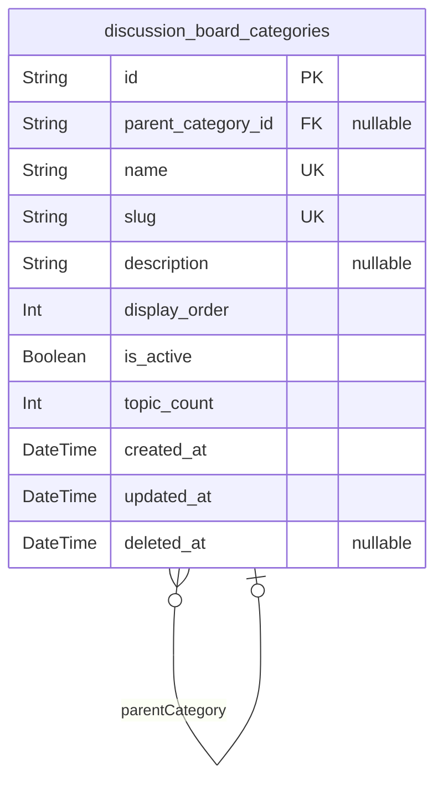
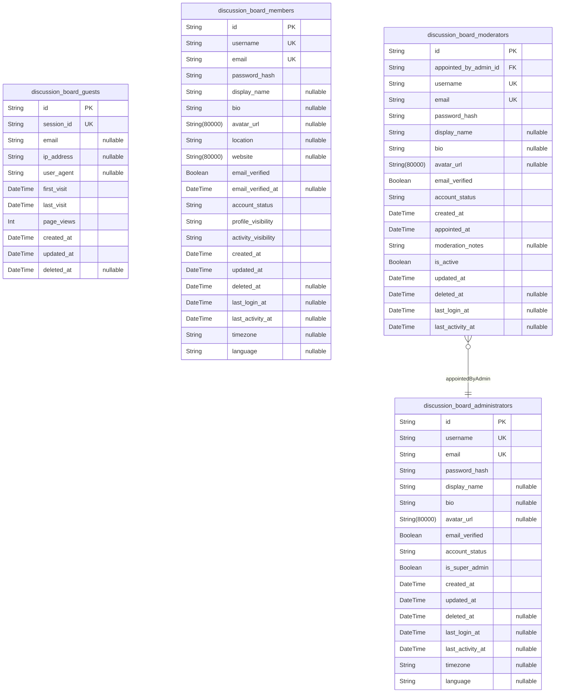
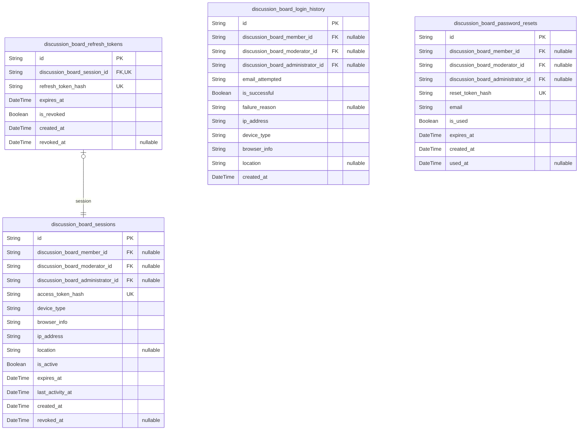
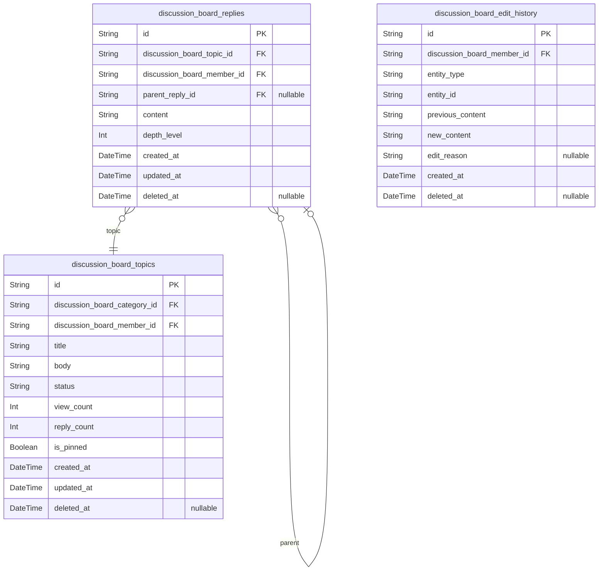
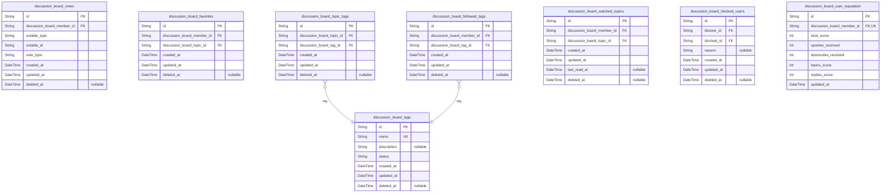
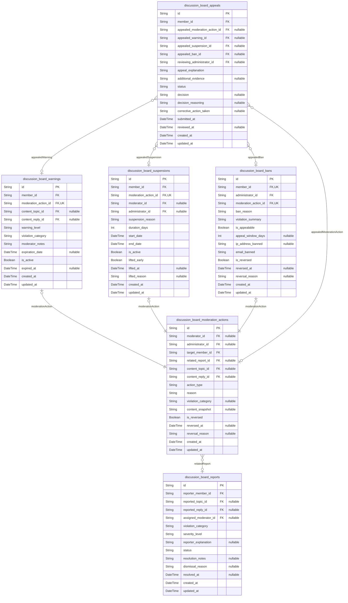
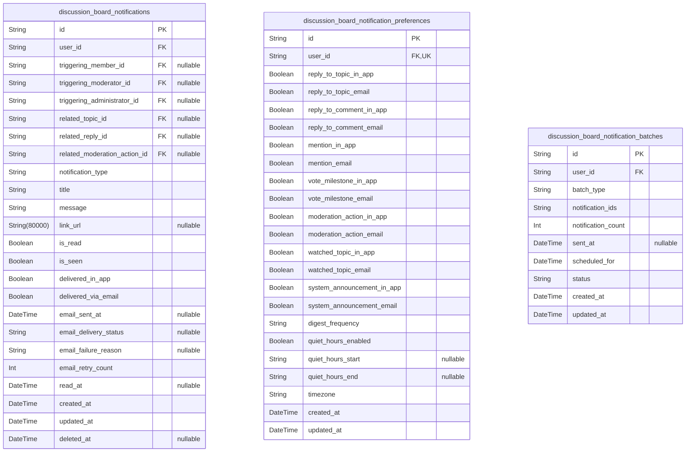
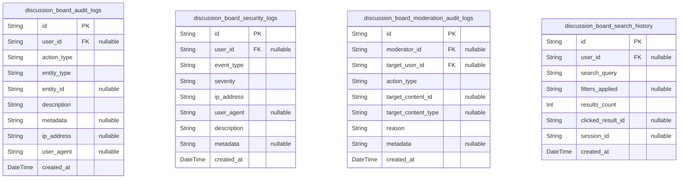
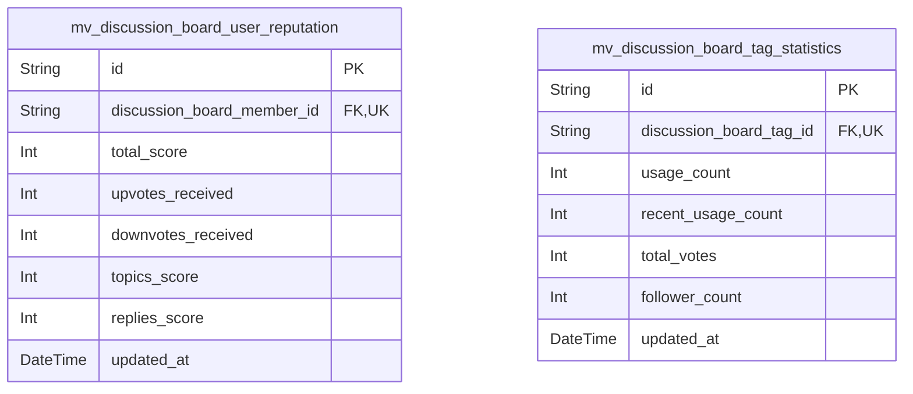

# Prisma Markdown

> Generated by [`prisma-markdown`](https://github.com/samchon/prisma-markdown)

- [Systematic](#systematic)
- [Actors](#actors)
- [Authentication](#authentication)
- [Discussions](#discussions)
- [Engagement](#engagement)
- [Moderation](#moderation)
- [Notifications](#notifications)
- [Audit](#audit)
- [default](#default)

## Systematic

### `discussion_board_categories`

Foundational organizational structure for classifying discussion topics
into Economics and Politics domains. Categories provide the primary
taxonomy for content organization, supporting hierarchical structures
with parent-child relationships (e.g., Economics > Macroeconomics). This
table enables users to browse organized discussions and administrators to
manage the discussion board's organizational structure. Categories are
independently managed entities that support the platform's dual focus on
economic and political discourse.

Properties as follows:

- `id`: Primary Key.
- `parent_category_id`
  > Parent category for hierarchical organization. Null for top-level
  > categories (Economics, Politics), references parent for subcategories
  > (Macroeconomics references Economics). Enables multi-level category
  > taxonomy. [discussion_board_categories.id](#discussion_board_categories)
- `name`
  > Category name displayed throughout the platform (e.g., 'Economics',
  > 'Macroeconomics', 'Politics', 'International Relations'). Must be unique
  > across all categories. Length: 3-50 characters per business rules. Used
  > in navigation menus, category selection, and content organization.
- `slug`
  > URL-friendly identifier derived from category name. Used for clean,
  > readable category URLs (e.g., '/category/macroeconomics'). Must be unique
  > for proper routing. Lowercase alphanumeric with hyphens.
- `description`
  > Detailed explanation of the category's purpose and scope. Helps users
  > understand what discussion topics belong in this category. Displayed on
  > category pages and selection interfaces. Optional but recommended for
  > user clarity.
- `display_order`
  > Controls the order in which categories appear in listings and navigation
  > menus. Lower numbers appear first, enabling administrators to prioritize
  > category display (e.g., Economics=1, Politics=2). Allows custom
  > organization beyond alphabetical sorting.
- `is_active`
  > Whether the category is currently visible and available for use. Inactive
  > categories (false) are hidden from category selection but existing topics
  > remain accessible. Allows temporary disabling without deletion. Default:
  > true.
- `topic_count`
  > Number of discussion topics currently assigned to this category. Updated
  > when topics are created or deleted. Used for displaying category activity
  > levels and helping users identify active discussion areas. Maintained via
  > application logic or triggers. Default: 0.
- `created_at`
  > Timestamp when the category was created. Used for audit trail and
  > tracking category establishment history. Automatically set on record
  > creation.
- `updated_at`
  > Timestamp of the most recent modification to category information (name,
  > description, status, etc.). Used for audit trail and change tracking.
  > Automatically updated on record modification.
- `deleted_at`
  > Soft delete timestamp enabling category recovery. When set, category is
  > hidden from active use but preserved for audit trail and data integrity.
  > Null for active categories. Supports 30-day recovery window per platform
  > policy.

## Actors

### `discussion_board_guests`

Represents unauthenticated visitors to the discussion board platform.
Guests can browse public content but cannot create topics, post replies,
or vote. Tracked for analytics, conversion metrics, and potential
newsletter signups. Guest sessions are temporary and may convert to
member accounts upon registration.

Properties as follows:

- `id`: Primary Key.
- `session_id`
  > Temporary session identifier for tracking guest browsing activity during
  > their visit. Must be unique across all guest sessions.
- `email`
  > Optional email address if guest subscribes to newsletter or creates
  > account later. Used for conversion tracking and marketing outreach. Not
  > unique - same email may be entered across different guest sessions.
- `ip_address`
  > IP address of the guest for analytics, abuse prevention, and geographic
  > tracking. IPv4 or IPv6 format.
- `user_agent`
  > Browser user agent string for device type identification and
  > compatibility analysis.
- `first_visit`
  > Timestamp of the guest's first visit to the platform for conversion
  > funnel analysis.
- `last_visit`
  > Timestamp of the guest's most recent activity on the platform. Updated on
  > each page view.
- `page_views`: Count of pages viewed during all guest sessions for engagement metrics.
- `created_at`: Timestamp when this guest record was created in the system.
- `updated_at`: Timestamp when this guest record was last updated.
- `deleted_at`
  > Soft delete timestamp for guest session termination. Preserves historical
  > analytics data while marking session as ended. Null for active guest
  > sessions.

### `discussion_board_members`

Represents registered, authenticated users who are the core participants
of the discussion board. Members can create topics, post replies, vote on
content, customize their profiles, report violations, and manage
preferences. This is the primary user role after email verification.
Members accumulate reputation through quality contributions and can
progress to moderator status when appointed by administrators.

Properties as follows:

- `id`: Primary Key.
- `username`
  > Unique username chosen during registration, immutable after account
  > creation. 3-30 characters, alphanumeric with hyphens and underscores.
  > Used for @mentions and profile URLs.
- `email`
  > Email address for authentication, notifications, and account recovery.
  > Must be verified before full platform access.
- `password_hash`
  > Cryptographically hashed password using bcrypt with minimum cost factor
  > 12. Never stored in plain text.
- `display_name`
  > User's preferred public display name, can differ from username. 1-50
  > characters, supports Unicode, can be changed anytime.
- `bio`
  > User biography or about me section. Maximum 500 characters, plain text
  > with auto-detected links.
- `avatar_url`
  > URL to user's profile picture. Either uploaded image or default avatar
  > generated from username.
- `location`
  > Optional geographic location (country/city) displayed on user profile.
  > Maximum 100 characters.
- `website`
  > Optional personal website or blog URL displayed on user profile. Must be
  > valid HTTP/HTTPS URL.
- `email_verified`
  > Whether the user has verified their email address by clicking
  > verification link. Required for full posting privileges.
- `email_verified_at`: Timestamp when email verification was completed. Null if not yet verified.
- `account_status`
  > Current operational status of the account: active (normal operation),
  > pending_verification (email not verified), suspended (temporary
  > restriction), banned (permanent block), or deactivated (user-initiated).
  > Provides single source of truth for account state.
- `profile_visibility`
  > Privacy setting for profile page: public (visible to all), members_only
  > (authenticated users), or private (hidden from search).
- `activity_visibility`
  > Privacy setting for activity history: public, members_only, or private.
  > Independent from profile visibility.
- `created_at`: Timestamp when the member account was created (registration date).
- `updated_at`
  > Timestamp when the member account was last updated (profile changes,
  > settings modifications).
- `deleted_at`
  > Soft delete timestamp. When set, account is marked for deletion but
  > retained for 30-day recovery period. Null for active accounts.
- `last_login_at`
  > Timestamp of the user's most recent successful login for activity
  > tracking and retention analysis.
- `last_activity_at`
  > Timestamp of the user's most recent platform activity (any authenticated
  > action). Used for accurate engagement tracking and identifying truly
  > active users versus dormant accounts.
- `timezone`
  > User's preferred timezone for displaying timestamps. Standard timezone
  > identifier (e.g., 'America/New_York', 'Europe/London').
- `language`
  > User's preferred interface language. ISO 639-1 language code (e.g., 'en',
  > 'es', 'de').

### `discussion_board_moderators`

Represents trusted community members elevated to help maintain discourse
standards and enforce community guidelines. Moderators can review
reported content, hide or remove inappropriate posts, issue warnings,
temporarily suspend users, lock discussions, and feature quality topics.
Appointed by administrators based on contribution history, reputation,
and demonstrated understanding of guidelines. All moderator actions are
logged for accountability and administrator review.

Properties as follows:

- `id`: Primary Key.
- `appointed_by_admin_id`
  > Administrator who appointed this user as moderator. References {@link
  > discussion_board_administrators.id}.
- `username`
  > Unique username for the moderator account. 3-30 characters, alphanumeric
  > with hyphens and underscores.
- `email`
  > Email address for moderator authentication and official communications
  > about moderation duties.
- `password_hash`
  > Cryptographically hashed password using bcrypt with minimum cost factor
  > 12. Never stored in plain text.
- `display_name`
  > Moderator's preferred public display name shown on moderation actions and
  > communications.
- `bio`
  > Moderator biography or description. May include areas of expertise or
  > moderation focus.
- `avatar_url`: URL to moderator's profile picture with moderator badge overlay.
- `email_verified`
  > Whether the moderator has verified their email address. Required for
  > moderation duties.
- `account_status`
  > Current operational status of the moderator account: active (normal
  > moderation duties), suspended (temporarily restricted), or deactivated
  > (no longer serving as moderator). Provides single source of truth for
  > moderator account state.
- `created_at`: Timestamp when the moderator account was initially created in the system.
- `appointed_at`
  > Timestamp when this user was promoted to moderator role by an
  > administrator. May differ from created_at if account existed before
  > moderator appointment.
- `moderation_notes`
  > Internal notes about this moderator's appointment, performance, or areas
  > of responsibility. Visible only to administrators.
- `is_active`
  > Whether this moderator account is currently active and has moderation
  > privileges. False if temporarily suspended from moderation duties.
- `updated_at`: Timestamp when the moderator account was last updated.
- `deleted_at`
  > Soft delete timestamp. When set, moderator privileges are revoked but
  > account history is retained for audit purposes.
- `last_login_at`: Timestamp of the moderator's most recent login for activity monitoring.
- `last_activity_at`
  > Timestamp of the moderator's most recent platform activity including
  > moderation actions. Used for tracking moderator engagement and
  > identifying inactive moderators.

### `discussion_board_administrators`

Represents platform operators with full system control and ultimate
authority over all operations. Administrators can appoint and remove
moderators, permanently ban users, manage categories and site-wide
settings, access all audit logs, configure platform parameters, and
override any moderation decisions. This role is limited to platform
owners and senior staff. All administrator actions are logged for
security and accountability.

Properties as follows:

- `id`: Primary Key.
- `username`
  > Unique username for the administrator account. 3-30 characters,
  > alphanumeric with hyphens and underscores.
- `email`
  > Email address for administrator authentication and critical system
  > notifications.
- `password_hash`
  > Cryptographically hashed password using bcrypt with minimum cost factor
  > 12. Never stored in plain text.
- `display_name`
  > Administrator's preferred public display name shown on administrative
  > communications and actions.
- `bio`
  > Administrator biography or description. May include role and
  > responsibilities.
- `avatar_url`: URL to administrator's profile picture with administrator badge overlay.
- `email_verified`
  > Whether the administrator has verified their email address. Required for
  > administrative operations.
- `account_status`
  > Current operational status of the administrator account: active (normal
  > operations), suspended (temporarily restricted), or deactivated (no
  > longer serving as administrator). Provides single source of truth for
  > admin account state.
- `is_super_admin`
  > Whether this administrator has super admin privileges (platform owner).
  > Super admins can create other administrators and have unrestricted
  > access.
- `created_at`: Timestamp when the administrator account was created in the system.
- `updated_at`: Timestamp when the administrator account was last updated.
- `deleted_at`
  > Soft delete timestamp. When set, administrative privileges are revoked
  > but account is retained for complete audit trail.
- `last_login_at`
  > Timestamp of the administrator's most recent login for security
  > monitoring and activity tracking.
- `last_activity_at`
  > Timestamp of the administrator's most recent platform activity including
  > administrative actions. Used for tracking administrator engagement and
  > security monitoring.
- `timezone`
  > Administrator's preferred timezone for displaying timestamps in admin
  > interfaces. Standard timezone identifier.
- `language`: Administrator's preferred interface language. ISO 639-1 language code.

## Authentication

### `discussion_board_sessions`

Active user sessions for authenticated users. Each session represents a
logged-in user on a specific device with an associated JWT access token.
Sessions track device information, location, and activity for security
monitoring. Users can view and revoke their own sessions across multiple
devices. This is a PRIMARY stance table as users independently manage
their active sessions.

Properties as follows:

- `id`: Primary Key.
- `discussion_board_member_id`
  > Reference to the member who owns this session. {@link
  > discussion_board_members.id}. Null if session belongs to moderator or
  > administrator.
- `discussion_board_moderator_id`
  > Reference to the moderator who owns this session. {@link
  > discussion_board_moderators.id}. Null if session belongs to member or
  > administrator.
- `discussion_board_administrator_id`
  > Reference to the administrator who owns this session. {@link
  > discussion_board_administrators.id}. Null if session belongs to member or
  > moderator.
- `access_token_hash`
  > Hashed JWT access token identifier for secure token validation. Never
  > store plain tokens. Used to identify and validate active sessions.
- `device_type`
  > Type of device used for this session. Examples: Desktop, Mobile, Tablet.
  > Extracted from user agent string.
- `browser_info`
  > Browser name and version information extracted from user agent. Examples:
  > Chrome 120.0, Firefox 121.0, Safari 17.0.
- `ip_address`
  > IP address from which the session was created. Used for security
  > monitoring and location approximation.
- `location`
  > Approximate geographic location based on IP address. City-level
  > precision. Example: New York, USA. May be null if location cannot be
  > determined.
- `is_active`
  > Whether this session is currently active. False when session is revoked
  > by user or invalidated by system (logout, password change, expiration).
- `expires_at`
  > Timestamp when the access token expires. Access tokens expire after 30
  > minutes. Session must use refresh token to obtain new access token after
  > expiration.
- `last_activity_at`
  > Timestamp of the last activity in this session. Updated on each
  > authenticated request. Used to track session usage and identify inactive
  > sessions.
- `created_at`: Timestamp when the session was created (user logged in).
- `revoked_at`
  > Timestamp when the session was revoked. Null if session is still active.
  > Sessions can be revoked by user logout, password change, or administrator
  > action.

### `discussion_board_refresh_tokens`

Refresh tokens for obtaining new access tokens without re-authentication.
Each refresh token is associated with exactly one session and allows the
client to request new access tokens when the current access token
expires. Refresh tokens have longer expiration (7-30 days) than access
tokens (30 minutes). This is a SUBSIDIARY stance table as tokens are
managed automatically through the session lifecycle.

Properties as follows:

- `id`: Primary Key.
- `discussion_board_session_id`
  > Reference to the session this refresh token belongs to. {@link
  > discussion_board_sessions.id}. One-to-one relationship - each session has
  > exactly one refresh token.
- `refresh_token_hash`
  > Hashed refresh token for secure validation. Never store plain tokens.
  > Used to authenticate refresh token requests and issue new access tokens.
- `expires_at`
  > Timestamp when the refresh token expires. Standard expiration is 7 days.
  > Extended to 30 days when user selects Remember Me option during login.
- `is_revoked`
  > Whether this refresh token has been revoked. True when session ends, user
  > logs out, password changes, or token is compromised. Revoked tokens
  > cannot be used to obtain new access tokens.
- `created_at`: Timestamp when the refresh token was created (same as session creation).
- `revoked_at`
  > Timestamp when the refresh token was revoked. Null if token is still
  > valid. Set when session is terminated or security event occurs.

### `discussion_board_login_history`

Comprehensive audit trail of all login attempts including successful
logins and failed authentication attempts. Records device information, IP
address, location, and failure reasons for security monitoring and breach
detection. Used to implement account lockout after repeated failures and
alert users to suspicious login activity. This is a SNAPSHOT stance table
as it provides immutable historical audit data.

Properties as follows:

- `id`: Primary Key.
- `discussion_board_member_id`
  > Reference to the member account associated with this login attempt.
  > [discussion_board_members.id](#discussion_board_members). Null if login attempt was for
  > moderator or administrator account.
- `discussion_board_moderator_id`
  > Reference to the moderator account associated with this login attempt.
  > [discussion_board_moderators.id](#discussion_board_moderators). Null if login attempt was for
  > member or administrator account.
- `discussion_board_administrator_id`
  > Reference to the administrator account associated with this login
  > attempt. [discussion_board_administrators.id](#discussion_board_administrators). Null if login
  > attempt was for member or moderator account.
- `email_attempted`
  > Email address used in the login attempt. Stored even for failed attempts
  > to track brute force attacks and credential stuffing attempts.
- `is_successful`
  > Whether the login attempt was successful. True for successful
  > authentication, false for failed attempts (wrong password, account
  > locked, etc.).
- `failure_reason`
  > Reason for login failure. Examples: incorrect_password, account_locked,
  > account_suspended, email_not_verified, account_not_found. Null for
  > successful logins.
- `ip_address`
  > IP address from which the login attempt was made. Critical for security
  > monitoring and identifying suspicious patterns.
- `device_type`
  > Type of device used for login attempt. Examples: Desktop, Mobile, Tablet.
  > Extracted from user agent string.
- `browser_info`
  > Browser name and version information. Examples: Chrome 120.0, Firefox
  > 121.0. Used to identify login from new or unfamiliar devices.
- `location`
  > Approximate geographic location based on IP address. City-level
  > precision. Example: London, UK. May be null if location cannot be
  > determined.
- `created_at`
  > Timestamp when the login attempt occurred. Used for security analysis and
  > identifying attack patterns over time.

### `discussion_board_password_resets`

Temporary tokens for secure password reset workflow. When a user forgets
their password, a unique reset token is generated and emailed to them.
Tokens are single-use with 15-minute expiration for security. After
successful password reset, the token is marked as used to prevent reuse.
This is a SNAPSHOT stance table as password reset tokens capture
historical security events in an append-only pattern.

Properties as follows:

- `id`: Primary Key.
- `discussion_board_member_id`
  > Reference to the member requesting password reset. {@link
  > discussion_board_members.id}. Null if password reset is for moderator or
  > administrator account.
- `discussion_board_moderator_id`
  > Reference to the moderator requesting password reset. {@link
  > discussion_board_moderators.id}. Null if password reset is for member or
  > administrator account.
- `discussion_board_administrator_id`
  > Reference to the administrator requesting password reset. {@link
  > discussion_board_administrators.id}. Null if password reset is for member
  > or moderator account.
- `reset_token_hash`
  > Hashed password reset token for secure validation. Never store plain
  > tokens. Cryptographically random token (minimum 32 bytes) sent to user
  > email and validated when they submit new password.
- `email`
  > Email address to which the reset token was sent. Used to verify the reset
  > request targets the correct account and prevent enumeration attacks.
- `is_used`
  > Whether this reset token has been used to successfully reset the
  > password. True after password reset completes. Used tokens cannot be
  > reused even if still within expiration window.
- `expires_at`
  > Timestamp when the reset token expires. Tokens are valid for 15 minutes
  > from creation for security. Expired tokens are rejected even if unused.
- `created_at`
  > Timestamp when the password reset was requested and token was generated.
  > Used to enforce 15-minute expiration window.
- `used_at`
  > Timestamp when the reset token was successfully used to reset password.
  > Null if token has not been used yet. Set when user completes password
  > reset flow.

## Discussions

### `discussion_board_topics`

Discussion topics created by members on economic and political subjects.
Represents the primary content entities that initiate conversations.
Topics are organized by category, can have various states (active,
locked, archived, deleted), and support pinning for important
discussions. Tracks view counts and reply counts for engagement metrics.
References category for organization and member for authorship.

Properties as follows:

- `id`: Primary Key.
- `discussion_board_category_id`
  > Category this topic belongs to. Target category's {@link
  > discussion_board_categories.id}.
- `discussion_board_member_id`
  > Author who created this topic. Target member's {@link
  > discussion_board_members.id}.
- `title`
  > Topic title between 10 and 200 characters. Displayed in topic listings
  > and search results.
- `body`
  > Topic body content between 20 and 50,000 characters. Supports Markdown
  > formatting for rich text discussion content.
- `status`
  > Current status of the topic: active (open for replies), locked (no new
  > replies allowed), archived (old inactive topic), or deleted (soft deleted
  > topic).
- `view_count`
  > Number of times this topic has been viewed. Incremented once per user per
  > 24 hours to prevent artificial inflation.
- `reply_count`
  > Total number of replies to this topic. Updated when replies are created
  > or deleted.
- `is_pinned`
  > Whether this topic is pinned to the top of category listings by
  > moderators or administrators.
- `created_at`: Timestamp when the topic was created.
- `updated_at`: Timestamp when the topic was last updated (edited or received new reply).
- `deleted_at`
  > Timestamp when the topic was soft deleted. Null for active topics.
  > Supports 30-day recovery window.

### `discussion_board_replies`

Threaded replies to discussion topics and other replies. Supports
hierarchical conversations up to 10 levels deep. Each reply belongs to a
topic and optionally references a parent reply for threading. Tracks
depth level to enforce maximum nesting constraints. Content length ranges
from 1 to 10,000 characters. References topic for the parent discussion
and member for authorship. Self-referential parent relationship enables
threaded discussion structure.

Properties as follows:

- `id`: Primary Key.
- `discussion_board_topic_id`
  > Topic this reply belongs to. Target topic's {@link
  > discussion_board_topics.id}.
- `discussion_board_member_id`
  > Member who authored this reply. Target member's {@link
  > discussion_board_members.id}.
- `parent_reply_id`
  > Parent reply this is responding to for threaded conversations. Null for
  > top-level replies directly to the topic. Self-referential to {@link
  > discussion_board_replies.id}.
- `content`
  > Reply content between 1 and 10,000 characters. Supports Markdown
  > formatting.
- `depth_level`
  > Nesting depth of this reply in the thread hierarchy. 0 for top-level
  > replies to topic, increments for each nested level. Maximum depth is 10.
- `created_at`: Timestamp when the reply was posted.
- `updated_at`: Timestamp when the reply was last edited.
- `deleted_at`
  > Timestamp when the reply was soft deleted. Null for active replies.
  > Supports recovery and maintains thread structure.

### `discussion_board_edit_history`

Audit trail tracking all edits to topics and replies for transparency and
accountability. Captures snapshots of content before and after each
modification. Polymorphic relationship through entity_type and entity_id
fields allows tracking edits for both topics and replies. Records who
made each edit and when. Optional edit_reason provides context for
modifications. Implements append-only pattern for audit integrity.
References member for editor identification.

Properties as follows:

- `id`: Primary Key.
- `discussion_board_member_id`
  > Member who performed this edit. Target member's {@link
  > discussion_board_members.id}.
- `entity_type`
  > Type of entity being edited: topic or reply. Used with entity_id to
  > reference the edited content.
- `entity_id`
  > ID of the edited entity. References either discussion_board_topics.id or
  > discussion_board_replies.id based on entity_type.
- `previous_content`
  > Snapshot of content before the edit. Preserves historical state for audit
  > and potential rollback.
- `new_content`
  > Snapshot of content after the edit. Shows what changed in this
  > modification.
- `edit_reason`
  > Optional explanation for why the edit was made. Provides context for
  > content modifications.
- `created_at`
  > Timestamp when this edit occurred. Represents the moment the content was
  > modified.
- `deleted_at`
  > Timestamp if this edit history record is soft deleted. Normally null as
  > edit history is preserved.

## Engagement

### `discussion_board_votes`

Tracks upvotes and downvotes on discussion content (topics and replies).
Each vote records which user voted, what they voted on, and the vote
direction. Users can only cast one vote per content item, and can change
their vote within allowed time windows. Vote data drives content ranking
algorithms and user reputation calculations. Supports polymorphic voting
pattern to handle both topics and replies efficiently.

Properties as follows:

- `id`: Primary Key.
- `discussion_board_member_id`: Member who cast this vote. [discussion_board_members.id](#discussion_board_members)
- `votable_type`
  > Type of content being voted on. Either 'topic' or 'reply' to support
  > polymorphic voting on different content types.
- `votable_id`
  > ID of the content being voted on (references either
  > discussion_board_topics.id or discussion_board_replies.id depending on
  > votable_type).
- `vote_type`
  > Direction of the vote. Either 'upvote' (positive, agrees/supports
  > content) or 'downvote' (negative, disagrees/low quality content).
- `created_at`
  > Timestamp when the vote was cast. Used for vote change time window
  > validation and activity tracking.
- `updated_at`
  > Timestamp when the vote was last modified (vote direction changed). Used
  > for audit trail and tracking vote changes.
- `deleted_at`
  > Soft delete timestamp enabling vote recovery if content is restored. Null
  > for active votes. Supports 30-day recovery window per platform policy.

### `discussion_board_favorites`

Tracks user bookmarks/favorites on discussion topics. Allows users to
save topics for later reference and quick access. Favorited topics appear
in user's personal collection and may trigger notifications for new
activity based on user preferences. Supports soft deletion for recovery
of accidentally removed bookmarks.

Properties as follows:

- `id`: Primary Key.
- `discussion_board_member_id`: Member who favorited the topic. [discussion_board_members.id](#discussion_board_members)
- `discussion_board_topic_id`: Topic that was favorited. [discussion_board_topics.id](#discussion_board_topics)
- `created_at`
  > Timestamp when the topic was favorited. Used for sorting user's favorites
  > by recency.
- `updated_at`
  > Timestamp when the favorite record was last modified. Used for audit
  > trail.
- `deleted_at`
  > Soft delete timestamp enabling bookmark recovery. Null for active
  > favorites. Supports accidental removal recovery.

### `discussion_board_tags`

Master tag vocabulary for categorizing and organizing discussion topics.
Tags provide additional categorization beyond primary categories,
enabling cross-category topic discovery. Users can search, filter, and
follow tags. Tags are created through topic creation workflow and managed
by moderators. Tag lifecycle includes active, pending review, disabled,
and merged states.

Properties as follows:

- `id`: Primary Key.
- `name`
  > Tag name, normalized to lowercase for consistency. Must be unique across
  > all tags. Length 2-30 characters, alphanumeric with spaces and hyphens
  > allowed.
- `description`
  > Optional description explaining what this tag represents and when to use
  > it. Helps users apply tags consistently.
- `status`
  > Tag lifecycle status: active (available for use), pending_review
  > (awaiting moderator approval), disabled (hidden from selection), merged
  > (consolidated into another tag).
- `created_at`
  > Timestamp when the tag was first created. Used for tracking tag evolution
  > and identifying emerging tags.
- `updated_at`
  > Timestamp when the tag was last modified (name, description, or status
  > change). Used for audit trail.
- `deleted_at`
  > Soft delete timestamp enabling tag recovery. Null for active tags.
  > Supports 30-day recovery window per platform policy.

### `discussion_board_topic_tags`

Junction table establishing many-to-many relationship between topics and
tags. Allows topics to be tagged with multiple relevant tags (up to 5 per
topic per business rules), and tags to be applied to many topics.
Supports topic discovery through tag-based filtering and search.

Properties as follows:

- `id`: Primary Key.
- `discussion_board_topic_id`: Topic being tagged. [discussion_board_topics.id](#discussion_board_topics)
- `discussion_board_tag_id`: Tag applied to the topic. [discussion_board_tags.id](#discussion_board_tags)
- `created_at`
  > Timestamp when the tag was applied to the topic. Used for tracking tag
  > application history.
- `updated_at`
  > Timestamp when the topic-tag association was last modified. Used for
  > audit trail.
- `deleted_at`
  > Soft delete timestamp enabling tag association recovery. Null for active
  > associations. Supports recovery if tags removed accidentally.

### `discussion_board_followed_tags`

Tracks which tags users follow for personalized content recommendations
and notifications. When users follow tags, they receive notifications
about new topics with those tags and see followed tags prioritized in
their feed. Supports user interest management and content
personalization. Maximum 50 followed tags per user per business rules.

Properties as follows:

- `id`: Primary Key.
- `discussion_board_member_id`: Member following the tag. [discussion_board_members.id](#discussion_board_members)
- `discussion_board_tag_id`: Tag being followed by the member. [discussion_board_tags.id](#discussion_board_tags)
- `created_at`
  > Timestamp when the user started following this tag. Used for tracking
  > user interest evolution and follow recency.
- `updated_at`
  > Timestamp when the follow relationship was last modified. Used for audit
  > trail.
- `deleted_at`
  > Soft delete timestamp enabling follow relationship recovery. Null for
  > active follows. Supports unfollow recovery.

### `discussion_board_watched_topics`

Tracks topics users are watching for notifications on new activity (new
replies, votes, etc.). Users can explicitly watch topics they're
interested in to receive updates. Includes last_read_at timestamp to
detect new activity since last view and show 'unread' indicators.
Supports notification batching to prevent overwhelming users with
excessive alerts.

Properties as follows:

- `id`: Primary Key.
- `discussion_board_member_id`: Member watching the topic. [discussion_board_members.id](#discussion_board_members)
- `discussion_board_topic_id`: Topic being watched. [discussion_board_topics.id](#discussion_board_topics)
- `created_at`
  > Timestamp when the user started watching this topic. Used for tracking
  > watch duration.
- `updated_at`
  > Timestamp when the watch relationship was last modified (last_read_at
  > updated). Used for audit trail.
- `last_read_at`
  > Timestamp when the user last viewed this topic. Used to determine if
  > there is new activity (replies, votes) since their last visit to show
  > unread indicators and notification triggers.
- `deleted_at`
  > Soft delete timestamp enabling watch relationship recovery. Null for
  > active watches. Supports unwatch recovery.

### `discussion_board_blocked_users`

Tracks user blocking relationships for content filtering. When user A
blocks user B, A no longer sees B's topics, replies, or receives
notifications from B. Blocking is asymmetric (A blocking B does not mean
B blocks A). Includes optional reason for accountability and support
purposes. Maximum 100 blocked users per account per business rules.

Properties as follows:

- `id`: Primary Key.
- `blocker_id`: Member who initiated the block. [discussion_board_members.id](#discussion_board_members)
- `blocked_id`: Member who is being blocked. [discussion_board_members.id](#discussion_board_members)
- `reason`
  > Optional user-provided reason for blocking this user. Helps support team
  > if blocking is reported as abuse, and helps user remember why they
  > blocked someone.
- `created_at`
  > Timestamp when the block was created. Used for tracking block duration
  > and history.
- `updated_at`
  > Timestamp when the block relationship was last modified. Used for audit
  > trail.
- `deleted_at`
  > Soft delete timestamp enabling block relationship recovery (unblock
  > recovery). Null for active blocks. Supports accidental unblock recovery.

### `discussion_board_user_reputation`

Aggregated reputation score for each user based on community voting on
their content. Reputation represents contribution quality and community
trust. Calculated from upvotes/downvotes received on topics and replies.
Denormalized for performance to enable reputation-based features
(leaderboards, privilege unlocking) without expensive vote aggregation
queries. Updated when votes are cast, changed, or removed.

Properties as follows:

- `id`: Primary Key.
- `discussion_board_member_id`: Member whose reputation is tracked. [discussion_board_members.id](#discussion_board_members)
- `total_score`
  > Total reputation score calculated from all votes on user's content.
  > Weighted formula: (topic upvotes × 5) - (topic downvotes × 2) + (reply
  > upvotes × 2) - (reply downvotes × 1). Used for leaderboards and privilege
  > unlocking.
- `upvotes_received`
  > Total number of upvotes received across all user's topics and replies.
  > Used for reputation calculation and user statistics display.
- `downvotes_received`
  > Total number of downvotes received across all user's topics and replies.
  > Used for reputation calculation and quality monitoring.
- `topics_score`
  > Reputation score derived from votes on user's topics only. Allows
  > separate tracking of topic quality vs reply quality.
- `replies_score`
  > Reputation score derived from votes on user's replies only. Allows
  > separate tracking of reply quality vs topic quality.
- `updated_at`
  > Timestamp when reputation was last recalculated. Used for cache
  > invalidation and tracking reputation changes over time.

## Moderation

### `discussion_board_reports`

Content reports submitted by members flagging topics or replies that
violate community guidelines. Each report captures the violation
category, reporter's explanation, and resolution status. Reports feed
into the moderation queue for review by moderators and administrators.

Properties as follows:

- `id`: Primary Key.
- `reporter_member_id`: Member who submitted the report. [discussion_board_members.id](#discussion_board_members)
- `reported_topic_id`
  > Reported topic if violation is in a topic. {@link
  > discussion_board_topics.id}
- `reported_reply_id`
  > Reported reply if violation is in a reply. {@link
  > discussion_board_replies.id}
- `assigned_moderator_id`
  > Moderator assigned to review this report. {@link
  > discussion_board_moderators.id}
- `violation_category`
  > Category of violation reported: personal_attack, hate_speech,
  > misinformation, spam, offensive_language, off_topic, threats, doxxing,
  > trolling, or other.
- `severity_level`
  > Severity level of the violation: critical, high, medium, or low. Used for
  > prioritization in moderation queue.
- `reporter_explanation`
  > Optional additional context provided by the reporter explaining why this
  > content violates guidelines. Maximum 500 characters.
- `status`
  > Current status of the report: pending, under_review, resolved, or
  > dismissed.
- `resolution_notes`
  > Moderator's notes explaining the resolution decision. Required when
  > status changes to resolved or dismissed.
- `dismissal_reason`
  > Reason for dismissal if report was dismissed: no_violation,
  > within_guidelines, malicious_report, insufficient_evidence, or other.
- `resolved_at`: Timestamp when the report was resolved or dismissed by a moderator.
- `created_at`: Timestamp when the report was submitted.
- `updated_at`: Timestamp when the report was last updated.

### `discussion_board_moderation_actions`

Comprehensive log of all moderation actions taken by moderators and
administrators. Each action records what was done, to whom, by whom, and
why. This table serves as the central audit trail for all content
governance activities on the platform.

Properties as follows:

- `id`: Primary Key.
- `moderator_id`: Moderator who performed the action. [discussion_board_moderators.id](#discussion_board_moderators)
- `administrator_id`
  > Administrator who performed the action. {@link
  > discussion_board_administrators.id}
- `target_member_id`
  > Member who is the target of this moderation action. {@link
  > discussion_board_members.id}
- `related_report_id`
  > Report that triggered this moderation action, if applicable. {@link
  > discussion_board_reports.id}
- `content_topic_id`
  > Topic that was subject to moderation action. {@link
  > discussion_board_topics.id}
- `content_reply_id`
  > Reply that was subject to moderation action. {@link
  > discussion_board_replies.id}
- `action_type`
  > Type of moderation action: hide_content, delete_content, issue_warning,
  > suspend_user, ban_user, restore_content, or dismiss_report.
- `reason`
  > Detailed explanation of why this moderation action was taken. Minimum 20
  > characters required for accountability.
- `violation_category`
  > Category of guideline violation that prompted this action. Same
  > categories as reports.
- `content_snapshot`
  > Preserved snapshot of the content exactly as it appeared when the action
  > was taken. Maintained even if user edits or deletes later.
- `is_reversed`
  > Whether this moderation action was reversed on appeal or administrative
  > review.
- `reversed_at`: Timestamp when the action was reversed, if applicable.
- `reversal_reason`: Explanation for why the action was reversed.
- `created_at`: Timestamp when the moderation action was taken.
- `updated_at`: Timestamp when the moderation action record was last updated.

### `discussion_board_warnings`

Formal warnings issued to members for guideline violations. Implements a
three-tier escalation system (first, second, final) with automatic
expiration. Warnings escalate to suspensions and potential bans if
violations continue within the warning period.

Properties as follows:

- `id`: Primary Key.
- `member_id`: Member who received the warning. [discussion_board_members.id](#discussion_board_members)
- `moderation_action_id`
  > Moderation action that issued this warning. {@link
  > discussion_board_moderation_actions.id}
- `content_topic_id`: Topic that triggered the warning. [discussion_board_topics.id](#discussion_board_topics)
- `content_reply_id`: Reply that triggered the warning. [discussion_board_replies.id](#discussion_board_replies)
- `warning_level`
  > Level of warning in escalation system: first_warning, second_warning, or
  > final_warning.
- `violation_category`: Category of guideline violation that prompted the warning.
- `moderator_notes`
  > Internal notes from the moderator explaining the warning decision and
  > context.
- `expiration_date`
  > Date when this warning expires. First warnings expire after 90 days,
  > second after 180 days, final warnings may not expire.
- `is_active`
  > Whether this warning is currently active and counts toward escalation.
  > False if expired or user account in good standing.
- `expired_at`: Timestamp when the warning expired naturally without further violations.
- `created_at`: Timestamp when the warning was issued.
- `updated_at`: Timestamp when the warning record was last updated.

### `discussion_board_suspensions`

Temporary account suspensions that restrict member posting privileges for
a specified duration. Suspensions prevent content creation and voting
while allowing read access. Automatically expire and restore full
privileges when the suspension period ends.

Properties as follows:

- `id`: Primary Key.
- `member_id`: Member who is suspended. [discussion_board_members.id](#discussion_board_members)
- `moderation_action_id`
  > Moderation action that initiated this suspension. {@link
  > discussion_board_moderation_actions.id}
- `moderator_id`
  > Moderator who issued the suspension. {@link
  > discussion_board_moderators.id}
- `administrator_id`
  > Administrator who issued the suspension if it was an admin action. {@link
  > discussion_board_administrators.id}
- `suspension_reason`
  > Detailed explanation of why the member was suspended. Shown to the
  > suspended user.
- `duration_days`
  > Length of suspension in days. Common durations: 1, 7, 14, or 30 days
  > based on violation severity.
- `start_date`: Timestamp when the suspension begins and restrictions take effect.
- `end_date`
  > Timestamp when the suspension expires and full privileges are
  > automatically restored.
- `is_active`
  > Whether this suspension is currently in effect. False if expired or
  > manually lifted.
- `lifted_early`: Whether the suspension was manually lifted before the scheduled end date.
- `lifted_at`
  > Timestamp when the suspension was manually lifted by a moderator or
  > administrator.
- `lifted_reason`: Explanation for why the suspension was lifted early.
- `created_at`: Timestamp when the suspension was created.
- `updated_at`: Timestamp when the suspension record was last updated.

### `discussion_board_bans`

Permanent account bans that completely prevent platform access. Issued
only by administrators for severe or repeated violations. Bans may be
appealable or non-appealable based on violation severity. All user
content is hidden but preserved for audit purposes.

Properties as follows:

- `id`: Primary Key.
- `member_id`: Member who is permanently banned. [discussion_board_members.id](#discussion_board_members)
- `administrator_id`
  > Administrator who issued the permanent ban. {@link
  > discussion_board_administrators.id}
- `moderation_action_id`
  > Moderation action that initiated this ban. {@link
  > discussion_board_moderation_actions.id}
- `ban_reason`
  > Comprehensive justification for the permanent ban. Minimum 100 characters
  > required due to severity of action.
- `violation_summary`
  > Summary of all violations that led to the ban decision. Provides
  > historical context.
- `is_appealable`
  > Whether the banned user is permitted to submit an appeal. False for
  > severe violations like illegal content or threats.
- `appeal_window_days`
  > Number of days the user has to submit an appeal if ban is appealable.
  > Typically 30 days.
- `ip_address_banned`: IP address at time of ban to help prevent re-registration attempts.
- `email_banned`
  > Email address banned from future registration to prevent account
  > recreation.
- `is_reversed`
  > Whether the ban was reversed after successful appeal or administrative
  > review.
- `reversed_at`: Timestamp when the ban was reversed and account access restored.
- `reversal_reason`: Explanation for why the ban was reversed.
- `created_at`: Timestamp when the ban was issued.
- `updated_at`: Timestamp when the ban record was last updated.

### `discussion_board_appeals`

Appeals submitted by users contesting moderation decisions including
warnings, suspensions, bans, and content removals. Each appeal provides
user explanation and goes through administrator review. Appeals can be
approved (reversing the decision), denied (upholding the decision), or
result in modified penalties.

Properties as follows:

- `id`: Primary Key.
- `member_id`: Member submitting the appeal. [discussion_board_members.id](#discussion_board_members)
- `appealed_moderation_action_id`
  > Moderation action being appealed. {@link
  > discussion_board_moderation_actions.id}
- `appealed_warning_id`: Warning being appealed. [discussion_board_warnings.id](#discussion_board_warnings)
- `appealed_suspension_id`: Suspension being appealed. [discussion_board_suspensions.id](#discussion_board_suspensions)
- `appealed_ban_id`: Ban being appealed. [discussion_board_bans.id](#discussion_board_bans)
- `reviewing_administrator_id`
  > Administrator assigned to review this appeal. {@link
  > discussion_board_administrators.id}
- `appeal_explanation`
  > User's written explanation of why the moderation decision should be
  > reversed. Between 100 and 1000 characters required.
- `additional_evidence`
  > Optional additional context or evidence the user provides to support
  > their appeal.
- `status`
  > Current status of the appeal: pending_review, under_review, approved,
  > denied, or modified.
- `decision`
  > Administrator's decision on the appeal: uphold_original (deny),
  > reverse_decision (approve), or modify_penalty.
- `decision_reasoning`
  > Detailed explanation from administrator about why the appeal was
  > approved, denied, or modified. Minimum 50 characters.
- `corrective_action_taken`
  > Description of any corrective actions taken if appeal was approved
  > (content restored, warning removed, suspension lifted, etc.).
- `submitted_at`: Timestamp when the user submitted the appeal.
- `reviewed_at`
  > Timestamp when the administrator completed their review and made a
  > decision.
- `created_at`: Timestamp when the appeal record was created.
- `updated_at`: Timestamp when the appeal record was last updated.

## Notifications

### `discussion_board_notifications`

Stores individual notification records delivered to users for various
platform events including replies, mentions, votes, moderation actions,
and system announcements. Each notification represents a discrete event
that users can view, mark as read, and interact with through the
notification center. Notifications support both in-app and email delivery
channels with separate tracking for each. Uses explicit foreign keys
instead of polymorphic pattern to ensure referential integrity with
discussion topics, replies, moderation actions, and triggering users
(members, moderators, administrators).

Properties as follows:

- `id`: Primary Key.
- `user_id`
  > Recipient user who receives this notification. {@link
  > discussion_board_members.id}
- `triggering_member_id`
  > Member whose action triggered this notification (e.g., posted reply, cast
  > vote). Null for moderator/admin actions or system notifications. {@link
  > discussion_board_members.id}
- `triggering_moderator_id`
  > Moderator whose action triggered this notification (e.g., moderation
  > action). Null for member/admin actions. {@link
  > discussion_board_moderators.id}
- `triggering_administrator_id`
  > Administrator whose action triggered this notification (e.g., system
  > announcement, admin moderation). Null for member/moderator actions.
  > [discussion_board_administrators.id](#discussion_board_administrators)
- `related_topic_id`
  > Discussion topic related to this notification (for reply_to_topic,
  > topic-related events). Null if notification not topic-related. {@link
  > discussion_board_topics.id}
- `related_reply_id`
  > Discussion reply related to this notification (for reply_to_comment,
  > reply-related events). Null if notification not reply-related. {@link
  > discussion_board_replies.id}
- `related_moderation_action_id`
  > Moderation action related to this notification (for moderation_action
  > type notifications). Null for non-moderation notifications. {@link
  > discussion_board_moderation_actions.id}
- `notification_type`
  > Type of notification: reply_to_topic, reply_to_comment, mention,
  > vote_milestone, moderation_action, system_announcement,
  > watched_topic_update, welcome
- `title`
  > Notification headline displayed to user (e.g., 'New reply to your topic',
  > 'You were mentioned')
- `message`
  > Notification content preview or detailed message (first 200 characters of
  > reply, moderation reason, etc.)
- `link_url`
  > Deep link URL to the relevant content (topic, reply, profile, etc.). Null
  > for notifications without specific target content.
- `is_read`
  > Whether user has marked this notification as read (clicked or explicitly
  > marked read)
- `is_seen`
  > Whether user has seen this notification in the notification center
  > (viewed but not necessarily read)
- `delivered_in_app`: Whether this notification was delivered through in-app notification center
- `delivered_via_email`
  > Whether this notification was delivered via email to user's registered
  > address
- `email_sent_at`
  > Timestamp when email notification was successfully sent. Null if email
  > not sent or delivery failed.
- `email_delivery_status`
  > Email delivery status: queued, sent, failed, bounced. Null if email
  > delivery not attempted.
- `email_failure_reason`
  > Reason for email delivery failure if status is failed or bounced. Null
  > for successful deliveries.
- `email_retry_count`
  > Number of email delivery retry attempts. Incremented on each retry,
  > maximum 3 retries per requirements.
- `read_at`: Timestamp when user marked notification as read. Null if unread.
- `created_at`: Timestamp when notification was created and queued for delivery
- `updated_at`
  > Timestamp when notification record was last updated (status changes, read
  > status, etc.)
- `deleted_at`
  > Soft delete timestamp for user-deleted notifications. Supports 90-day
  > retention window before permanent cleanup. Null for active notifications.

### `discussion_board_notification_preferences`

Stores user notification preferences controlling which events trigger
notifications and through which channels (in-app, email). Supports
granular per-event-type configuration, digest modes (hourly, daily,
weekly), and quiet hours settings. Each user has exactly one preference
record with default values applied at registration.

Properties as follows:

- `id`: Primary Key.
- `user_id`
  > User who owns these notification preferences. {@link
  > discussion_board_members.id}
- `reply_to_topic_in_app`: Enable in-app notifications when someone replies to user's topic
- `reply_to_topic_email`: Enable email notifications when someone replies to user's topic
- `reply_to_comment_in_app`: Enable in-app notifications when someone replies to user's comment
- `reply_to_comment_email`: Enable email notifications when someone replies to user's comment
- `mention_in_app`: Enable in-app notifications when user is mentioned with @username
- `mention_email`: Enable email notifications when user is mentioned with @username
- `vote_milestone_in_app`
  > Enable in-app notifications when user's content reaches vote milestones
  > (10, 25, 50, 100, etc.)
- `vote_milestone_email`: Enable email notifications when user's content reaches vote milestones
- `moderation_action_in_app`
  > Enable in-app notifications for moderation actions affecting user
  > (warnings, suspensions, content removal)
- `moderation_action_email`: Enable email notifications for moderation actions affecting user
- `watched_topic_in_app`: Enable in-app notifications for updates to topics user is watching
- `watched_topic_email`: Enable email notifications for updates to topics user is watching
- `system_announcement_in_app`
  > Enable in-app notifications for system-wide announcements from
  > administrators
- `system_announcement_email`: Enable email notifications for system-wide announcements
- `digest_frequency`
  > Email notification batching frequency: realtime (immediate), hourly,
  > daily, weekly
- `quiet_hours_enabled`
  > Whether quiet hours are active (suppress email notifications during
  > specified hours)
- `quiet_hours_start`
  > Quiet hours start time in HH:mm format (24-hour). Null if quiet hours
  > disabled.
- `quiet_hours_end`
  > Quiet hours end time in HH:mm format (24-hour). Null if quiet hours
  > disabled.
- `timezone`
  > User's timezone for digest scheduling and quiet hours calculation (IANA
  > timezone identifier)
- `created_at`
  > Timestamp when preference record was created (typically at user
  > registration)
- `updated_at`: Timestamp when preferences were last modified by user

### `discussion_board_notification_batches`

Tracks batched and digest notifications to optimize delivery and prevent
duplicate notifications. System creates batch records for
hourly/daily/weekly digests and for similar notifications occurring
within batching windows. Batch records track which individual
notifications are included, delivery status, and scheduling information.
Uses JSONB for efficient storage and querying of notification ID arrays.

Properties as follows:

- `id`: Primary Key.
- `user_id`
  > User receiving this batched notification delivery. {@link
  > discussion_board_members.id}
- `batch_type`
  > Type of batch: hourly_digest, daily_digest, weekly_digest,
  > batched_replies, batched_mentions, batched_watched_topic
- `notification_ids`
  > JSONB array of notification UUIDs included in this batch. Stored as JSONB
  > for efficient querying and indexing. Example: ["uuid1", "uuid2", "uuid3"]
- `notification_count`: Total number of individual notifications combined in this batch
- `sent_at`
  > Timestamp when batch notification was successfully delivered. Null if
  > pending or failed.
- `scheduled_for`
  > Timestamp when batch is scheduled for delivery (considering user
  > preferences, quiet hours, digest frequency)
- `status`
  > Batch delivery status: pending (not yet sent), sent (successfully
  > delivered), failed (delivery failed after retries)
- `created_at`: Timestamp when batch record was created
- `updated_at`
  > Timestamp when batch record was last updated (status changes, delivery
  > attempts)

## Audit

### `discussion_board_audit_logs`

General audit trail for all significant user and system actions across
the platform. Records create, update, delete operations on topics,
replies, votes, and user profile changes. Provides comprehensive activity
tracking for compliance, security analysis, and user activity monitoring.
Immutable records ensure audit integrity.

Properties as follows:

- `id`: Primary Key.
- `user_id`
  > User who performed the action. [discussion_board_members.id](#discussion_board_members).
  > Nullable for system-initiated events.
- `action_type`
  > Type of action performed (e.g., topic_created, reply_posted, vote_cast,
  > profile_updated, content_deleted).
- `entity_type`
  > Type of entity affected by the action (e.g., topic, reply, vote, user,
  > tag).
- `entity_id`
  > UUID of the affected entity. Nullable if action does not target a
  > specific entity.
- `description`: Human-readable description of the action for audit review and reporting.
- `metadata`
  > JSON blob containing additional context about the action (before/after
  > values, affected fields, request parameters).
- `ip_address`
  > IP address from which the action was performed. Nullable for
  > system-initiated actions.
- `user_agent`
  > Browser user agent string for device and browser tracking. Nullable for
  > API or system actions.
- `created_at`
  > Timestamp when the audit log entry was created. Immutable audit records
  > have no updated_at.

### `discussion_board_security_logs`

Security-specific event logging for authentication attempts, permission
denials, account lockouts, and suspicious activities. Tracks login
successes and failures, account security events, rate limit violations,
and potential security threats. Critical for security monitoring,
incident response, and compliance with security audit requirements.

Properties as follows:

- `id`: Primary Key.
- `user_id`
  > User associated with the security event. {@link
  > discussion_board_members.id}. Nullable for failed login attempts with
  > invalid credentials.
- `event_type`
  > Type of security event (e.g., login_success, login_failed,
  > account_locked, permission_denied, suspicious_activity,
  > rate_limit_exceeded).
- `severity`
  > Severity level of the security event: low, medium, high, or critical.
  > Used for prioritizing security response.
- `ip_address`
  > IP address from which the security event originated. Required for
  > security analysis and IP-based blocking.
- `user_agent`
  > Browser user agent string for device fingerprinting and bot detection.
  > Nullable for some automated events.
- `description`
  > Human-readable description of the security event for incident review and
  > reporting.
- `metadata`
  > JSON blob containing detailed security event context (failed login
  > reason, permission attempted, threat indicators).
- `created_at`
  > Timestamp when the security event occurred. Used for security timeline
  > analysis and incident investigation.

### `discussion_board_moderation_audit_logs`

Comprehensive audit trail of all moderation actions for accountability,
transparency, and appeals processing. Logs content removal, user
warnings, suspensions, bans, and moderator interventions. Includes
moderator identity, target user/content, action rationale, and preserved
content snapshots. Essential for moderator performance review and user
appeal investigations.

Properties as follows:

- `id`: Primary Key.
- `moderator_id`
  > Moderator who performed the action. {@link
  > discussion_board_moderators.id}. Nullable for automated moderation
  > actions.
- `target_user_id`
  > User targeted by the moderation action. {@link
  > discussion_board_members.id}. Nullable for content-only actions.
- `action_type`
  > Type of moderation action (e.g., content_hidden, content_removed,
  > warning_issued, user_suspended, user_banned, appeal_approved).
- `target_content_id`
  > UUID of the content affected by moderation. Nullable for user-level
  > actions without specific content.
- `target_content_type`
  > Type of content affected (topic or reply). Nullable for user-level
  > actions.
- `reason`
  > Moderator's explanation for the action. Required for transparency and
  > appeals process.
- `metadata`
  > JSON blob containing additional context (original content snapshot,
  > violation category, previous warnings, action duration for suspensions).
- `created_at`
  > Timestamp when the moderation action was performed. Immutable for audit
  > integrity.

### `discussion_board_search_history`

Tracks user search queries for search analytics, query improvement, and
personalized recommendations. Records search terms, applied filters,
result counts, and user engagement with results. Used for identifying
common search patterns, improving search algorithms, and understanding
user information needs. Supports both authenticated users and guest
searches.

Properties as follows:

- `id`: Primary Key.
- `user_id`
  > User who performed the search. [discussion_board_members.id](#discussion_board_members).
  > Nullable for guest searches.
- `search_query`
  > The actual search text entered by the user. Used for search analytics and
  > query pattern identification.
- `filters_applied`
  > JSON blob containing search filters (category, date range, vote
  > threshold, tag filters). Nullable if no filters used.
- `results_count`
  > Number of search results returned. Used to identify zero-result queries
  > and search effectiveness.
- `clicked_result_id`
  > UUID of the search result the user clicked on. Nullable if user did not
  > click any result. Used for relevance tracking.
- `session_id`
  > Session identifier to track related searches within a session. Nullable
  > for one-off searches.
- `created_at`
  > Timestamp when the search was performed. Used for search trend analysis
  > over time.

## default

### `mv_discussion_board_user_reputation`

Materialized view aggregating reputation scores for each user based on
community voting on their content. Reputation represents contribution
quality and community trust. Calculated from votes received on topics and
replies using weighted formula: (topic upvotes × 5) - (topic downvotes ×
2) + (reply upvotes × 2) - (reply downvotes × 1). This denormalized view
enables reputation-based features (leaderboards, privilege unlocking,
reputation badges) without expensive real-time vote aggregation queries.
Refreshed periodically or on vote events.

Properties as follows:

- `id`: Primary Key.
- `discussion_board_member_id`: Member whose reputation is tracked. [discussion_board_members.id](#discussion_board_members)
- `total_score`
  > Total reputation score calculated from all votes on user's content.
  > Weighted formula: (topic upvotes × 5) - (topic downvotes × 2) + (reply
  > upvotes × 2) - (reply downvotes × 1). Used for leaderboards and privilege
  > unlocking.
- `upvotes_received`
  > Total number of upvotes received across all user's topics and replies.
  > Used for reputation calculation and user statistics display.
- `downvotes_received`
  > Total number of downvotes received across all user's topics and replies.
  > Used for reputation calculation and quality monitoring.
- `topics_score`
  > Reputation score derived from votes on user's topics only. Allows
  > separate tracking of topic quality vs reply quality.
- `replies_score`
  > Reputation score derived from votes on user's replies only. Allows
  > separate tracking of reply quality vs topic quality.
- `updated_at`
  > Timestamp when reputation was last recalculated. Used for cache
  > invalidation and tracking reputation changes over time.

### `mv_discussion_board_tag_statistics`

Materialized view providing aggregated statistics for tags including
usage counts, trending metrics, and activity indicators. Denormalizes
data from topic_tags junction table for efficient tag cloud generation,
popular tags display, and tag discovery features. Refreshed periodically
to reflect current tag usage patterns without impacting normalized base
tables.

Properties as follows:

- `id`: Primary Key.
- `discussion_board_tag_id`: Tag for which statistics are calculated. [discussion_board_tags.id](#discussion_board_tags)
- `usage_count`
  > Number of topics currently tagged with this tag. Aggregated from
  > topic_tags junction table. Used for popular tags display and tag cloud
  > generation.
- `recent_usage_count`
  > Number of topics tagged in the last 7 days. Used for identifying trending
  > tags and emerging topics.
- `total_votes`
  > Sum of all votes (upvotes + downvotes) on topics with this tag. Indicates
  > tag engagement level.
- `follower_count`
  > Number of users following this tag. Aggregated from followed_tags
  > junction table. Indicates tag popularity.
- `updated_at`
  > Timestamp when these statistics were last recalculated. Used for cache
  > invalidation and refresh scheduling.
