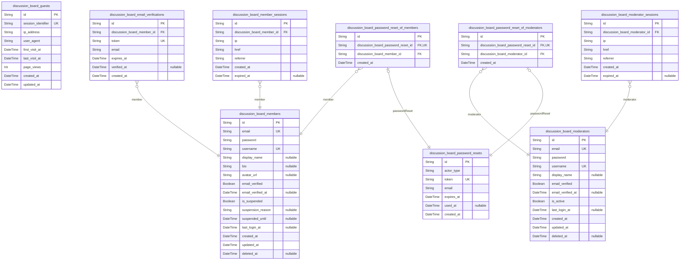
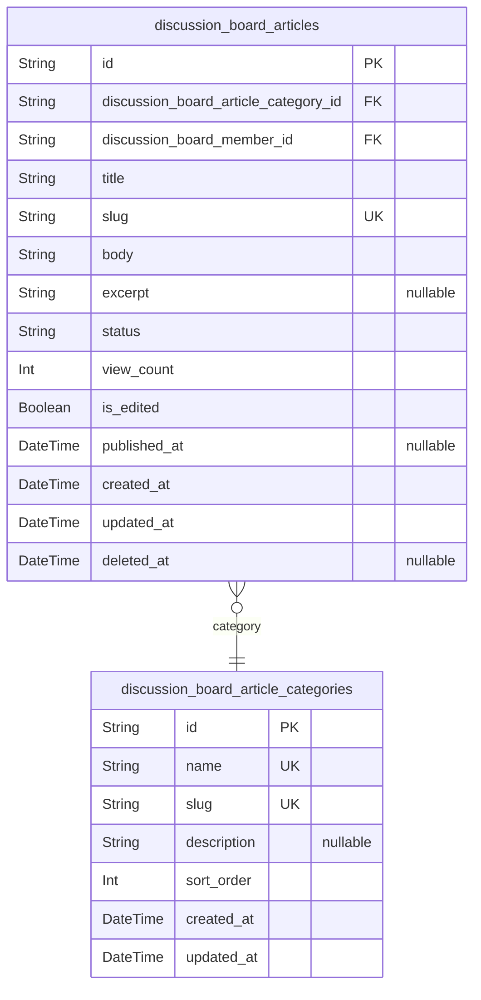
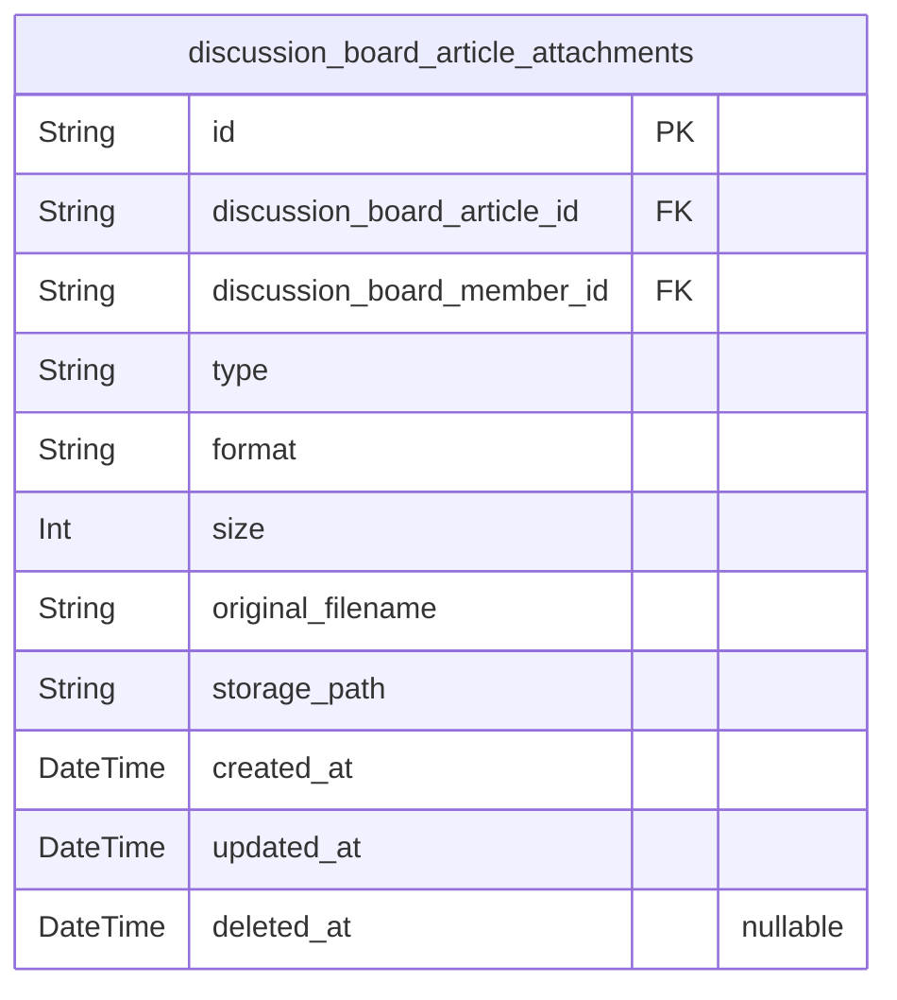
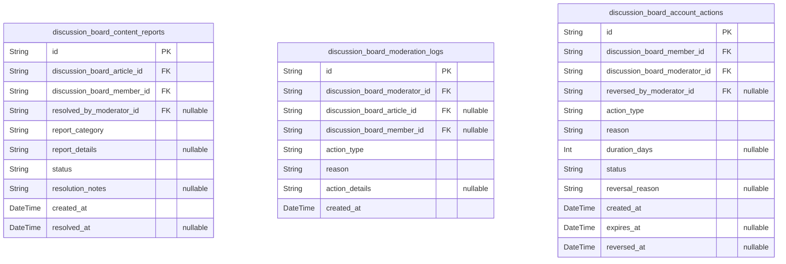

# Prisma Markdown

> Generated by [`prisma-markdown`](https://github.com/samchon/prisma-markdown)

- [Actors](#actors)
- [Articles](#articles)
- [Attachments](#attachments)
- [Moderation](#moderation)

## Actors

```mermaid
erDiagram
"discussion_board_guests" {
  String id PK
  String session_identifier UK
  String ip_address
  String user_agent
  DateTime first_visit_at
  DateTime last_visit_at
  Int page_views
  DateTime created_at
  DateTime updated_at
}
"discussion_board_members" {
  String id PK
  String email UK
  String password
  String username UK
  String display_name "nullable"
  String bio "nullable"
  String avatar_url "nullable"
  Boolean email_verified
  DateTime email_verified_at "nullable"
  Boolean is_suspended
  String suspension_reason "nullable"
  DateTime suspended_until "nullable"
  DateTime last_login_at "nullable"
  DateTime created_at
  DateTime updated_at
  DateTime deleted_at "nullable"
}
"discussion_board_moderators" {
  String id PK
  String email UK
  String password
  String username UK
  String display_name "nullable"
  Boolean email_verified
  DateTime email_verified_at "nullable"
  Boolean is_active
  DateTime last_login_at "nullable"
  DateTime created_at
  DateTime updated_at
  DateTime deleted_at "nullable"
}
"discussion_board_member_sessions" {
  String id PK
  String discussion_board_member_id FK
  String ip
  String href
  String referrer
  DateTime created_at
  DateTime expired_at "nullable"
}
"discussion_board_moderator_sessions" {
  String id PK
  String discussion_board_moderator_id FK
  String ip
  String href
  String referrer
  DateTime created_at
  DateTime expired_at "nullable"
}
"discussion_board_email_verifications" {
  String id PK
  String discussion_board_member_id FK
  String token UK
  String email
  DateTime expires_at
  DateTime verified_at "nullable"
  DateTime created_at
}
"discussion_board_password_resets" {
  String id PK
  String actor_type
  String token UK
  String email
  DateTime expires_at
  DateTime used_at "nullable"
  DateTime created_at
}
"discussion_board_password_reset_of_members" {
  String id PK
  String discussion_board_password_reset_id FK,UK
  String discussion_board_member_id FK
  DateTime created_at
}
"discussion_board_password_reset_of_moderators" {
  String id PK
  String discussion_board_password_reset_id FK,UK
  String discussion_board_moderator_id FK
  DateTime created_at
}
"discussion_board_member_sessions" }o--|| "discussion_board_members" : member
"discussion_board_moderator_sessions" }o--|| "discussion_board_moderators" : moderator
"discussion_board_email_verifications" }o--|| "discussion_board_members" : member
"discussion_board_password_reset_of_members" |o--|| "discussion_board_password_resets" : passwordReset
"discussion_board_password_reset_of_members" }o--|| "discussion_board_members" : member
"discussion_board_password_reset_of_moderators" |o--|| "discussion_board_password_resets" : passwordReset
"discussion_board_password_reset_of_moderators" }o--|| "discussion_board_moderators" : moderator
```

### `discussion_board_guests`

Unauthenticated visitor tracking for browsing analytics and potential
conversion to membership.

Guests represent anonymous users who browse the discussion board without
creating an account. This table enables basic analytics on guest
behavior, traffic patterns, and conversion funnels from guest to
registered member. Each guest record is identified by a unique session
identifier rather than personal information, maintaining privacy while
enabling meaningful analytics.

Guests have read-only access to published articles and can view all
public content. When a guest registers, they transition to member status
and this guest record may be linked to track the conversion journey.

Properties as follows:

- `id`: Primary Key.
- `session_identifier`
  > Unique session identifier for tracking guest browsing activity across
  > visits. Generated on first visit and stored in browser.
- `ip_address`
  > IP address of the guest for basic analytics and abuse prevention. Used
  > only for security monitoring and traffic analysis.
- `user_agent`
  > Browser user agent string for device and platform analytics. Helps
  > understand guest device preferences.
- `first_visit_at`
  > Timestamp of the guest's first visit to the platform. Used to calculate
  > visitor recency and lifetime.
- `last_visit_at`
  > Timestamp of the guest's most recent visit. Updated on each session to
  > track engagement frequency.
- `page_views`
  > Total number of page views by this guest across all visits. Indicates
  > engagement level.
- `created_at`: Timestamp when this guest record was created.
- `updated_at`: Timestamp when this guest record was last updated.

### `discussion_board_members`

Registered members who create and participate in economic and political
discussions.

Members are authenticated users who have completed registration and email
verification. They can create articles, upload attachments, edit their
own content, and engage with the discussion board beyond read-only
access. Each member has a unique email address and username for
authentication and public identification.

Members must verify their email address before gaining full content
creation privileges. The verification status and password are managed to
ensure security and account ownership. Members can update their profile
information, change passwords, and manage their account lifecycle
including voluntary account deletion.

Properties as follows:

- `id`: Primary Key.
- `email`
  > Email address for authentication and communication. Must be unique across
  > all members and verified before full access.
- `password`
  > Hashed password for authentication. Stored using bcrypt with work factor
  > 10+. Never stored or transmitted in plain text.
- `username`
  > Unique username for public identification in articles and profiles.
  > Displayed as author name. Must be 3-30 characters.
- `display_name`
  > Optional display name for public profile. If not set, username is used
  > for display. Can be updated by member.
- `bio`
  > Optional member biography or description for public profile. Maximum 500
  > characters. Allows members to introduce themselves.
- `avatar_url`
  > URL to profile avatar image. JPEG or PNG format, resized to 200x200
  > pixels. Optional member profile picture.
- `email_verified`
  > Whether the member's email address has been verified. Must be true before
  > allowing article creation and full member privileges.
- `email_verified_at`
  > Timestamp when email verification was completed. Null until member
  > verifies their email address.
- `is_suspended`
  > Whether the member account is currently suspended by moderators.
  > Suspended members cannot login or create content.
- `suspension_reason`
  > Reason for account suspension provided by moderator. Displayed to member
  > on login attempt during suspension.
- `suspended_until`
  > Timestamp when suspension expires and account is automatically
  > reactivated. Null if not suspended or permanently banned.
- `last_login_at`
  > Timestamp of member's most recent successful login. Used for activity
  > tracking and security monitoring.
- `created_at`: Timestamp when the member account was created through registration.
- `updated_at`: Timestamp when the member account was last updated.
- `deleted_at`
  > Timestamp when the member account was deleted. Supports soft deletion
  > with 30-day retention before permanent removal.

### `discussion_board_moderators`

Trusted administrators with elevated privileges for content moderation
and community management.

Moderators are authenticated users with special permissions to review,
edit, and remove any content on the platform. They manage community
guidelines enforcement, handle reported content, and can suspend or ban
member accounts. Moderator privileges are granted by system
administrators and cannot be self-assigned.

Moderators maintain transparency and accountability through comprehensive
action logging. All moderation actions including content edits,
deletions, and account suspensions are recorded with moderator identity
and reasoning. Moderators have similar authentication requirements as
members but with elevated access levels.

Properties as follows:

- `id`: Primary Key.
- `email`
  > Email address for moderator authentication and communication. Must be
  > unique across all moderators and verified.
- `password`
  > Hashed password for moderator authentication. Stored using bcrypt with
  > work factor 10+. Never stored or transmitted in plain text.
- `username`
  > Unique username for moderator identification in moderation logs and
  > actions. Displayed when moderator edits content.
- `display_name`
  > Optional display name for moderator profile. If not set, username is used
  > for display.
- `email_verified`
  > Whether the moderator's email address has been verified. Must be true
  > before granting moderation privileges.
- `email_verified_at`
  > Timestamp when email verification was completed for this moderator
  > account.
- `is_active`
  > Whether the moderator account is currently active. Inactive moderators
  > cannot perform moderation actions or login.
- `last_login_at`
  > Timestamp of moderator's most recent successful login. Used for activity
  > tracking and security monitoring.
- `created_at`: Timestamp when the moderator account was created by system administrator.
- `updated_at`: Timestamp when the moderator account was last updated.
- `deleted_at`
  > Timestamp when moderator privileges were revoked and account deleted.
  > Supports soft deletion for audit trail.

### `discussion_board_member_sessions`

Active authentication sessions for registered members enabling secure
stateless authentication.

Each session represents a member's authenticated connection to the
platform. Sessions are created upon successful login and used to validate
member identity for subsequent requests. Session management uses JWT
tokens with 30-minute access token expiration and 7-day refresh token
expiration.

Sessions track connection context including IP address and referrer for
security monitoring and abuse detection. Multiple concurrent sessions are
supported allowing members to access the platform from different devices.
Sessions are invalidated on logout or token expiration.

Properties as follows:

- `id`: Primary Key.
- `discussion_board_member_id`
  > Member who owns this authentication session. {@link
  > discussion_board_members.id}.
- `ip`
  > IP address of the member's connection for this session. Used for security
  > monitoring and geographic analysis.
- `href`
  > Connection URL where the session was initiated. Typically the login page
  > or authentication endpoint.
- `referrer`
  > Referrer URL indicating how the member arrived at the login page. Used
  > for traffic source analysis.
- `created_at`: Timestamp when this session was created through successful member login.
- `expired_at`
  > Timestamp when this session expired or was terminated. Null for active
  > sessions, set on logout or token expiration.

### `discussion_board_moderator_sessions`

Active authentication sessions for moderators enabling secure access to
moderation tools.

Each session represents a moderator's authenticated connection to the
platform. Sessions are created upon successful moderator login and used
to validate moderator identity and privileges for moderation operations.
Session management uses JWT tokens with 30-minute access token expiration
and 7-day refresh token expiration.

Moderator sessions track connection context for security auditing and
accountability. All moderation actions performed during a session can be
traced back to the specific moderator and session for comprehensive audit
trails.

Properties as follows:

- `id`: Primary Key.
- `discussion_board_moderator_id`
  > Moderator who owns this authentication session. {@link
  > discussion_board_moderators.id}.
- `ip`
  > IP address of the moderator's connection for this session. Used for
  > security monitoring and access control.
- `href`
  > Connection URL where the moderator session was initiated. Typically the
  > moderator login page.
- `referrer`: Referrer URL indicating how the moderator arrived at the login page.
- `created_at`
  > Timestamp when this moderator session was created through successful
  > login.
- `expired_at`
  > Timestamp when this session expired or was terminated. Null for active
  > sessions, set on logout or token expiration.

### `discussion_board_email_verifications`

Email verification tokens for confirming member email address ownership
during registration.

Email verification is required before members can create articles and
access full platform features. Upon registration, a verification token is
generated and sent to the member's email address. The member must click
the verification link within 24 hours to activate their account.

Each verification record contains a unique token with expiration
timestamp. Tokens are single-use and invalidated after successful
verification or expiration. Members can request new verification emails
if the original token expires.

Properties as follows:

- `id`: Primary Key.
- `discussion_board_member_id`
  > Member account requiring email verification. {@link
  > discussion_board_members.id}.
- `token`
  > Unique verification token sent to member's email address. Generated using
  > cryptographically secure random string.
- `email`
  > Email address being verified. Stored to ensure verification links work
  > even if member changes their email.
- `expires_at`
  > Timestamp when this verification token expires. Tokens are valid for 24
  > hours from creation.
- `verified_at`
  > Timestamp when the member successfully verified their email using this
  > token. Null if not yet verified.
- `created_at`
  > Timestamp when this verification token was generated and sent to the
  > member.

### `discussion_board_password_resets`

Password reset requests for secure password recovery supporting both
members and moderators.

This main entity stores the core password reset data including the unique
token, target email address, and expiration timestamp. The actor_type
field discriminates between member and moderator reset requests, enabling
polymorphic ownership while maintaining proper normalization.

Each reset request generates a cryptographically secure token sent to the
user's registered email address. Tokens expire after 1 hour for security.
The token allows users to set a new password without knowing their
current password. Reset tokens are single-use and invalidated after
successful password change.

The actual relationship to the specific member or moderator is maintained
through separate subtype tables
(discussion_board_password_reset_of_members and
discussion_board_password_reset_of_moderators), following the Compatible
Actor Pattern for proper 3NF normalization.

Properties as follows:

- `id`: Primary Key.
- `actor_type`
  > Type of actor requesting password reset. Valid values: 'member' or
  > 'moderator'. Discriminator field for polymorphic ownership pattern.
- `token`
  > Unique password reset token sent to user's email address. Generated using
  > cryptographically secure random string for security.
- `email`
  > Email address where the reset link was sent. Stored to validate reset
  > requests against current account email.
- `expires_at`
  > Timestamp when this reset token expires. Tokens are valid for 1 hour from
  > creation for security.
- `used_at`
  > Timestamp when this reset token was successfully used to change password.
  > Null if not yet used.
- `created_at`: Timestamp when this password reset request was created and token was sent.

### `discussion_board_password_reset_of_members`

Member-specific password reset context linking reset requests to member
accounts.

This subtype entity maintains the 1:1 relationship between password reset
requests and specific member accounts. It enables proper normalization of
the polymorphic ownership pattern where password resets can be initiated
by either members or moderators.

Each record associates a password reset token with the member who
requested it, enabling the system to validate reset requests and apply
password changes to the correct account. The unique constraint on
discussion_board_password_reset_id ensures each reset request is
associated with exactly one member.

Properties as follows:

- `id`: Primary Key.
- `discussion_board_password_reset_id`
  > Password reset request associated with this member. {@link
  > discussion_board_password_resets.id}.
- `discussion_board_member_id`
  > Member account requesting password reset. {@link
  > discussion_board_members.id}.
- `created_at`: Timestamp when this member password reset association was created.

### `discussion_board_password_reset_of_moderators`

Moderator-specific password reset context linking reset requests to
moderator accounts.

This subtype entity maintains the 1:1 relationship between password reset
requests and specific moderator accounts. It enables proper normalization
of the polymorphic ownership pattern where password resets can be
initiated by either members or moderators.

Each record associates a password reset token with the moderator who
requested it, enabling the system to validate reset requests and apply
password changes to the correct account. The unique constraint on
discussion_board_password_reset_id ensures each reset request is
associated with exactly one moderator.

Properties as follows:

- `id`: Primary Key.
- `discussion_board_password_reset_id`
  > Password reset request associated with this moderator. {@link
  > discussion_board_password_resets.id}.
- `discussion_board_moderator_id`
  > Moderator account requesting password reset. {@link
  > discussion_board_moderators.id}.
- `created_at`: Timestamp when this moderator password reset association was created.

## Articles

```mermaid
erDiagram
"discussion_board_article_categories" {
  String id PK
  String name UK
  String slug UK
  String description "nullable"
  Int sort_order
  DateTime created_at
  DateTime updated_at
}
"discussion_board_articles" {
  String id PK
  String discussion_board_article_category_id FK
  String discussion_board_member_id FK
  String title
  String slug UK
  String body
  String excerpt "nullable"
  String status
  Int view_count
  Boolean is_edited
  DateTime published_at "nullable"
  DateTime created_at
  DateTime updated_at
  DateTime deleted_at "nullable"
}
"discussion_board_articles" }o--|| "discussion_board_article_categories" : category
```

### `discussion_board_article_categories`

Predefined discussion categories for organizing articles by topic area.

Stores the available category options (Economic Discussion, Political
Discussion, General Discussion) that members select when creating
articles. Categories help users discover relevant discussions and browse
articles by topic focus.

Each category has a unique name and optional description explaining the
types of discussions that belong to it. Categories are managed by
administrators and provide the organizational taxonomy for the entire
discussion board.

Properties as follows:

- `id`: Primary Key.
- `name`
  > Category display name shown to users. Examples: 'Economic Discussion',
  > 'Political Discussion', 'General Discussion'. Must be unique across all
  > categories.
- `slug`
  > URL-friendly category identifier derived from name. Used in category
  > filter URLs and routing. Must be unique and lowercase with hyphens.
- `description`
  > Optional explanation of what types of articles belong in this category.
  > Helps members choose the appropriate category when creating articles. Can
  > include topic guidelines and examples.
- `sort_order`
  > Display order for category lists. Lower numbers appear first. Allows
  > administrators to prioritize category presentation in UI.
- `created_at`
  > Timestamp when this category was created by administrators. Used for
  > category management and audit purposes.
- `updated_at`
  > Timestamp when category details (name, description, sort order) were last
  > modified. Updated whenever administrators edit category information.

### `discussion_board_articles`

Discussion articles created by members on economic and political topics.

Represents the core content of the discussion board where members share
their perspectives, analyses, and discussions. Each article has a title,
rich text body content, belongs to exactly one category, and is authored
by a registered member.

Articles progress through lifecycle states: draft (work in progress),
published (publicly visible), and archived (hidden but preserved). The
deleted_at timestamp enables soft deletion for content that is removed
but may need recovery.

Members can create unlimited articles, edit their own articles at any
time, and delete their own content. Moderators have elevated permissions
to edit any article for quality control or delete articles that violate
community guidelines.

Articles support rich text formatting, can include image and file
attachments (stored in separate attachment tables), and track engagement
through view counts. Edit history is preserved through updated_at
timestamps and is_edited flags for transparency.

Properties as follows:

- `id`: Primary Key.
- `discussion_board_article_category_id`
  > Category this article belongs to. References
  > discussion_board_article_categories {@link
  > discussion_board_article_categories.id}. Required for article
  > organization and discovery.
- `discussion_board_member_id`
  > Member who authored this article. References discussion_board_members
  > [discussion_board_members.id](#discussion_board_members). Establishes article ownership and
  > attribution.
- `title`
  > Article title summarizing the discussion topic. Must be between 5 and 200
  > characters. Displayed in article lists and detail pages for content
  > discovery.
- `slug`
  > URL-friendly identifier derived from title. Used in article URLs for
  > readability and SEO. Must be unique across all articles to ensure
  > distinct URLs.
- `body`
  > Main article content with rich text formatting. Contains the full
  > discussion text including paragraphs, headings, bold, italic, lists, and
  > blockquotes. Minimum 50 characters, maximum 50,000 characters to ensure
  > substantive content.
- `excerpt`
  > Brief preview text extracted from the first 200 characters of body
  > content. Used in article listings to help users identify relevant
  > discussions without reading full content.
- `status`
  > Publication state of the article. Valid values: 'draft' (work in
  > progress, visible only to author), 'published' (publicly visible to all
  > users), 'archived' (hidden from public view but preserved). Controls
  > article visibility and lifecycle.
- `view_count`
  > Number of times this article has been viewed by any user. Incremented
  > each time a user accesses the article detail page. Used to identify
  > popular content and measure engagement.
- `is_edited`
  > Flag indicating whether this article has been edited after initial
  > publication. Set to true when a published article is modified. Provides
  > transparency about content revisions to readers.
- `published_at`
  > Timestamp when this article was first published (transitioned from draft
  > to published state). Null for articles that have never been published.
  > Used for chronological sorting and publication date display.
- `created_at`
  > Timestamp when this article was initially created, regardless of
  > publication state. Used for tracking content creation patterns and
  > article age.
- `updated_at`
  > Timestamp when article content (title, body, category) was last modified.
  > Updated on every edit. Displayed to readers to indicate content freshness
  > and recent revisions.
- `deleted_at`
  > Soft deletion timestamp indicating when this article was deleted by
  > author or moderator. Null for active articles. Enables 30-day retention
  > period for potential recovery before permanent deletion.

## Attachments

```mermaid
erDiagram
"discussion_board_article_attachments" {
  String id PK
  String discussion_board_article_id FK
  String discussion_board_member_id FK
  String type
  String format
  Int size
  String original_filename
  String storage_path
  DateTime created_at
  DateTime updated_at
  DateTime deleted_at "nullable"
}
```

### `discussion_board_article_attachments`

Image and file attachments supporting discussion articles with visual
evidence, charts, documents, and reference materials.

Each attachment belongs to exactly one article and is uploaded by a
specific member during article creation or editing. The unified table
handles both image attachments (JPEG, PNG, GIF, WebP up to 5MB, maximum
10 per article) and document attachments (PDF, DOC, DOCX, XLS, XLSX, TXT,
CSV up to 10MB, maximum 5 per article).

Attachments are managed exclusively through their parent articles. When
articles are deleted, all associated attachments are removed. The type
field discriminates between image and file attachments, while format
specifies the exact file format. Size and original filename are preserved
for display and download purposes.

Storage paths reference the physical file location in the storage system.
Attachments undergo security validation including file type verification,
size limit enforcement, and malware scanning during upload. Soft deletion
is supported to maintain attachment lifecycle management and enable
recovery if needed.

Properties as follows:

- `id`: Primary Key.
- `discussion_board_article_id`
  > Parent article that this attachment belongs to. {@link
  > discussion_board_articles.id}
- `discussion_board_member_id`: Member who uploaded this attachment. [discussion_board_members.id](#discussion_board_members)
- `type`
  > Attachment type discriminator. Valid values: 'image' for visual content
  > (JPEG, PNG, GIF, WebP), 'file' for documents (PDF, DOC, DOCX, XLS, XLSX,
  > TXT, CSV). Determines size limits and display handling.
- `format`
  > File format extension indicating the specific attachment format.
  > Examples: 'jpeg', 'png', 'gif', 'webp', 'pdf', 'doc', 'docx', 'xls',
  > 'xlsx', 'txt', 'csv'. Used for validation and download MIME type
  > determination.
- `size`
  > File size in bytes. Used to enforce size limits (images: 5MB max,
  > documents: 10MB max) and display file size to users in human-readable
  > format.
- `original_filename`
  > Original filename provided by user during upload. Preserved for display
  > purposes and download filename. Maximum 255 characters.
- `storage_path`
  > Internal storage path or reference to the physical file location in the
  > storage system. Used by application to retrieve and serve the file. Not
  > exposed to end users.
- `created_at`: Timestamp when the attachment was uploaded and created in the system.
- `updated_at`
  > Timestamp of the last modification to the attachment record. Updated when
  > attachment metadata changes.
- `deleted_at`
  > Soft deletion timestamp. When set, indicates the attachment has been
  > removed and should not be displayed. Null for active attachments. Enables
  > recovery and maintains referential integrity during deletion workflows.

## Moderation

```mermaid
erDiagram
"discussion_board_content_reports" {
  String id PK
  String discussion_board_article_id FK
  String discussion_board_member_id FK
  String resolved_by_moderator_id FK "nullable"
  String report_category
  String report_details "nullable"
  String status
  String resolution_notes "nullable"
  DateTime created_at
  DateTime resolved_at "nullable"
}
"discussion_board_moderation_logs" {
  String id PK
  String discussion_board_moderator_id FK
  String discussion_board_article_id FK "nullable"
  String discussion_board_member_id FK "nullable"
  String action_type
  String reason
  String action_details "nullable"
  DateTime created_at
}
"discussion_board_account_actions" {
  String id PK
  String discussion_board_member_id FK
  String discussion_board_moderator_id FK
  String reversed_by_moderator_id FK "nullable"
  String action_type
  String reason
  Int duration_days "nullable"
  String status
  String reversal_reason "nullable"
  DateTime created_at
  DateTime expires_at "nullable"
  DateTime reversed_at "nullable"
}
```

### `discussion_board_content_reports`

Member-submitted reports flagging articles for policy violations or
inappropriate content.

Stores community-driven content moderation reports where members flag
articles that may violate community guidelines, contain spam,
misinformation, offensive content, or other policy violations. Each
report captures the reporting member's concerns, selected violation
category, and optional detailed explanation.

Reports are added to the moderation queue for moderator review. Multiple
members can report the same article independently, with each report
tracked separately. Moderators review reports and take appropriate action
(approve content, edit content, or remove content), then mark reports as
resolved.

The reporting system enables collaborative content quality management by
empowering the community to identify problematic content while
maintaining moderator oversight and final decision authority.

Properties as follows:

- `id`: Primary Key.
- `discussion_board_article_id`
  > Reported article that allegedly violates community guidelines. {@link
  > discussion_board_articles.id}.
- `discussion_board_member_id`
  > Member who submitted this content report. {@link
  > discussion_board_members.id}.
- `resolved_by_moderator_id`
  > Moderator who reviewed and resolved this report. Null if report is still
  > pending review. [discussion_board_moderators.id](#discussion_board_moderators).
- `report_category`
  > Category of policy violation being reported. Valid values include 'Spam',
  > 'Offensive Content', 'Misinformation', 'Off-Topic', 'Other'. Helps
  > moderators prioritize and categorize reports.
- `report_details`
  > Optional detailed explanation from the reporter describing the specific
  > policy violation or concern. Provides context to help moderators
  > understand the issue.
- `status`
  > Current resolution status of the report. Valid values: 'pending'
  > (awaiting moderator review), 'reviewed_no_action' (moderator found no
  > violation), 'reviewed_edited' (moderator edited content),
  > 'reviewed_removed' (moderator removed content). Tracks report lifecycle.
- `resolution_notes`
  > Moderator's notes explaining the resolution decision. Provides
  > transparency about why the report was handled in a specific way. Null if
  > report is still pending.
- `created_at`
  > Timestamp when the report was submitted by the member. Used for
  > prioritizing older reports and tracking moderation response time.
- `resolved_at`
  > Timestamp when the report was reviewed and resolved by a moderator. Null
  > if report is still pending. Used for measuring moderation response time.

### `discussion_board_moderation_logs`

Comprehensive audit trail of all moderator actions for accountability and
transparency.

Records every content moderation and user management action taken by
moderators, including article edits, article deletions, attachment
removals, account suspensions, and account bans. Each log entry captures
what action was taken, which moderator performed it, what content or user
was affected, when it occurred, and the moderator's documented reason.

The moderation log serves multiple critical purposes: accountability
(tracking who did what and why), transparency (allowing review of
moderation decisions), dispute resolution (providing evidence for
appeals), and pattern analysis (identifying problematic content or users
requiring escalated action).

Log entries are immutable and retained indefinitely per business
requirements. Moderators and administrators can search and filter logs by
action type, moderator, affected content, affected user, or time period
to review moderation history, investigate specific incidents, or generate
moderation activity reports.

This comprehensive audit trail ensures moderation decisions are
documented, reviewable, and consistent with community guidelines.

Properties as follows:

- `id`: Primary Key.
- `discussion_board_moderator_id`
  > Moderator who performed this moderation action. {@link
  > discussion_board_moderators.id}.
- `discussion_board_article_id`
  > Article that was moderated (edited, deleted, or had attachments removed).
  > Null if action was user account management rather than content
  > moderation. [discussion_board_articles.id](#discussion_board_articles).
- `discussion_board_member_id`
  > Member whose account was affected by moderator action (suspension, ban,
  > or account restoration). Null if action was content moderation rather
  > than account management. [discussion_board_members.id](#discussion_board_members).
- `action_type`
  > Type of moderation action performed. Valid values: 'article_edited'
  > (moderator edited article content), 'article_deleted' (moderator removed
  > article), 'attachment_removed' (moderator deleted specific attachment),
  > 'account_suspended' (member account temporarily suspended),
  > 'account_banned' (member account permanently banned), 'account_restored'
  > (suspension or ban reversed). Categorizes the moderation action.
- `reason`
  > Moderator's documented explanation for taking this action. Required for
  > all moderation actions to ensure accountability and transparency.
  > Examples: 'Removed spam content', 'Suspended for harassment', 'Edited to
  > remove personal information'.
- `action_details`
  > Additional contextual details about the moderation action. May include
  > what was changed in an edit, which attachment was removed, or specific
  > policy violations. Provides complete context for audit trail.
- `created_at`
  > Timestamp when the moderation action was performed. Used for
  > chronological audit trail, moderation activity reporting, and tracking
  > response times.

### `discussion_board_account_actions`

Record of account-level moderation actions including suspensions and bans.

Tracks all temporary suspensions and permanent bans applied to member
accounts, maintaining a complete history of disciplinary actions. Each
record captures which member was affected, which moderator applied the
action, the reason for the action, the duration (for suspensions), and
the current status (active, expired, or reversed).

Temporary suspensions prevent members from logging in and creating
content for a specified duration (1, 7, 14, or 30 days). When the
suspension period expires, the account is automatically restored to
active status. Permanent bans prevent all future access and are typically
reserved for severe or repeated policy violations.

Moderators can reverse suspensions or bans if they were applied in error.
All status changes are tracked with timestamps to maintain a complete
audit trail. The action history helps moderators make informed decisions
about escalating enforcement (warnings → short suspension → long
suspension → permanent ban) based on violation patterns.

This table enables moderators to search and filter account actions by
affected member, moderating moderator, action type, or time period to
review enforcement history and ensure consistent application of community
guidelines.

Properties as follows:

- `id`: Primary Key.
- `discussion_board_member_id`
  > Member whose account was suspended or banned. {@link
  > discussion_board_members.id}.
- `discussion_board_moderator_id`
  > Moderator who applied this account suspension or ban. {@link
  > discussion_board_moderators.id}.
- `reversed_by_moderator_id`
  > Moderator who reversed or lifted this suspension or ban. Null if action
  > has not been reversed. [discussion_board_moderators.id](#discussion_board_moderators).
- `action_type`
  > Type of account action applied. Valid values: 'suspension' (temporary
  > account block), 'ban' (permanent account block). Determines whether the
  > action has an expiration date.
- `reason`
  > Moderator's documented reason for suspending or banning the account.
  > Required for accountability and to inform the affected member. Examples:
  > 'Repeated spam violations', 'Harassment of other members', 'Severe policy
  > violation'.
- `duration_days`
  > Duration of suspension in days (1, 7, 14, or 30 days). Null for permanent
  > bans which have no expiration. Used to calculate expiration timestamp for
  > temporary suspensions.
- `status`
  > Current status of the account action. Valid values: 'active' (currently
  > in effect), 'expired' (suspension period ended), 'reversed' (moderator
  > lifted the action). Determines whether the member is currently blocked.
- `reversal_reason`
  > Explanation for why the suspension or ban was reversed by a moderator.
  > Null if action has not been reversed. Examples: 'Applied in error', 'User
  > successfully appealed', 'Circumstances changed'.
- `created_at`
  > Timestamp when the suspension or ban was applied. Used to calculate
  > expiration time for temporary suspensions and to track enforcement
  > history chronologically.
- `expires_at`
  > Timestamp when a temporary suspension will automatically expire and the
  > account will be restored. Null for permanent bans. System automatically
  > updates status to 'expired' when this time is reached.
- `reversed_at`
  > Timestamp when a moderator reversed or lifted the suspension or ban. Null
  > if action has not been reversed. Tracks when account access was manually
  > restored.
