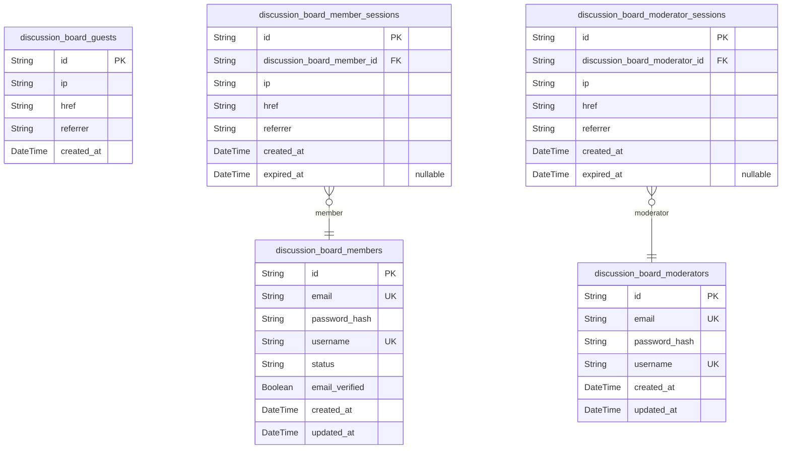
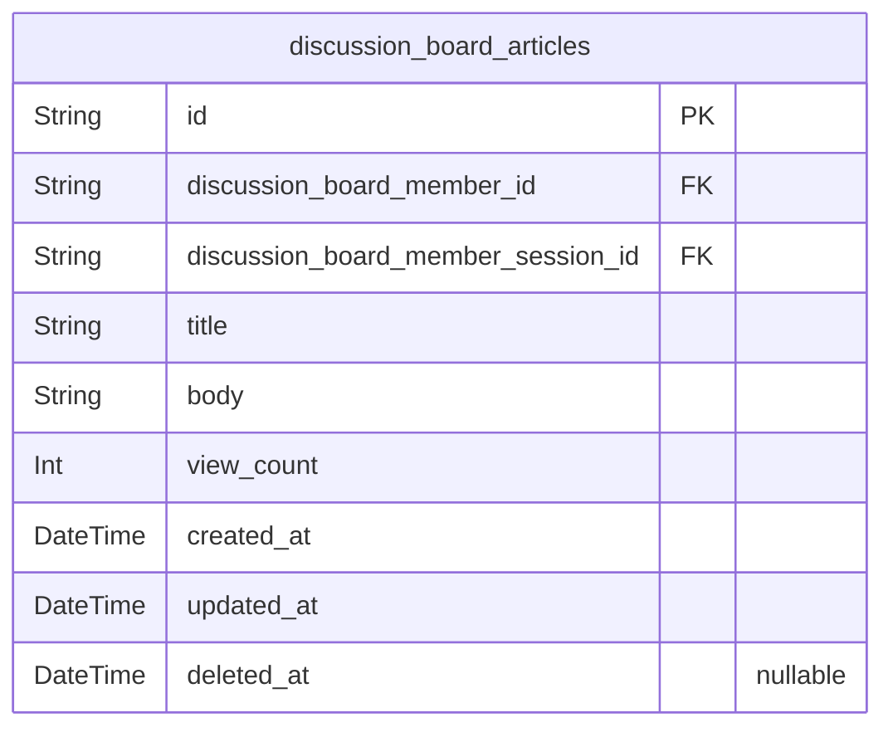
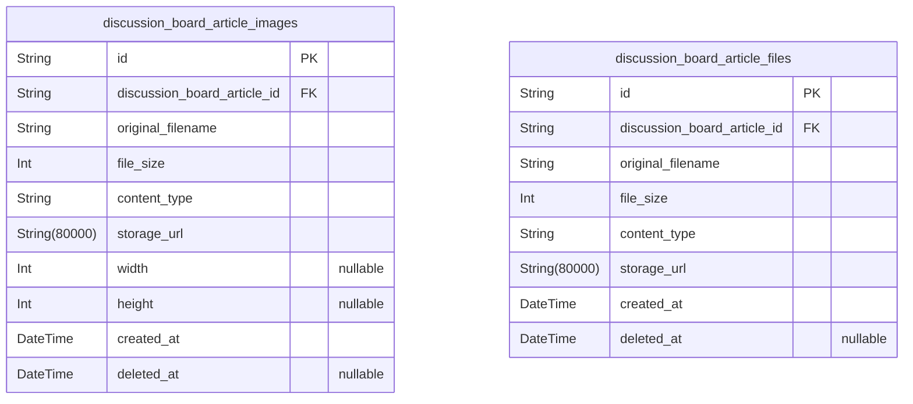
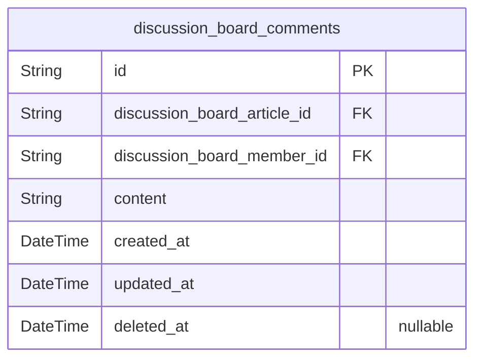

# Prisma Markdown

> Generated by [`prisma-markdown`](https://github.com/samchon/prisma-markdown)

- [Actors](#actors)
- [Articles](#articles)
- [Attachments](#attachments)
- [Comments](#comments)

## Actors

```mermaid
erDiagram
"discussion_board_guests" {
  String id PK
  String ip
  String href
  String referrer
  DateTime created_at
}
"discussion_board_members" {
  String id PK
  String email UK
  String password_hash
  String username UK
  String status
  Boolean email_verified
  DateTime created_at
  DateTime updated_at
}
"discussion_board_member_sessions" {
  String id PK
  String discussion_board_member_id FK
  String ip
  String href
  String referrer
  DateTime created_at
  DateTime expired_at "nullable"
}
"discussion_board_moderators" {
  String id PK
  String email UK
  String password_hash
  String username UK
  DateTime created_at
  DateTime updated_at
}
"discussion_board_moderator_sessions" {
  String id PK
  String discussion_board_moderator_id FK
  String ip
  String href
  String referrer
  DateTime created_at
  DateTime expired_at "nullable"
}
"discussion_board_member_sessions" }o--|| "discussion_board_members" : member
"discussion_board_moderator_sessions" }o--|| "discussion_board_moderators" : moderator
```

### `discussion_board_guests`

Guest visitors who browse the discussion board without authentication.

Guests represent unauthenticated users who can view published articles,
read comments, and browse public content. They are tracked for analytics
purposes to understand visitor behavior and traffic patterns.

Guests cannot create content, post comments, or interact with the
platform beyond read-only operations. To gain full participation
capabilities, guests must register as members.

This table tracks guest browsing sessions for analytics and monitoring
purposes, helping identify conversion opportunities from guest to member
registration.

Properties as follows:

- `id`: Primary Key.
- `ip`: IP address of the guest visitor for tracking and analytics purposes.
- `href`: Current page URL being accessed by the guest.
- `referrer`: Referrer URL indicating where the guest came from.
- `created_at`: Timestamp when the guest session was first created.

### `discussion_board_members`

Registered members who actively participate in discussions.

Members are authenticated users who have completed registration and email
verification. They can create articles with rich content including images
and file attachments, write comments on any published article, and manage
their own content.

Each member has unique authentication credentials (email and password)
allowing secure login access. The system tracks member account status to
support suspension capabilities for moderation purposes.

Members represent the core user base of the discussion board,
contributing content and engaging in economic and political discussions.
Their profiles display contribution history including article and comment
counts.

Properties as follows:

- `id`: Primary Key.
- `email`
  > Member email address used for authentication and communication. Must be
  > unique across all members.
- `password_hash`
  > Hashed password for member authentication. Stored using bcrypt with
  > minimum cost factor of 10.
- `username`
  > Display name shown on articles, comments, and profile pages. Must be
  > unique across all members.
- `status`
  > Account status for moderation purposes. Valid values: active, suspended,
  > locked. Active accounts have full access, suspended accounts are
  > temporarily restricted by moderators, locked accounts are temporarily
  > frozen due to security concerns.
- `email_verified`
  > Whether the member has verified their email address. Members must verify
  > email before gaining full access to the platform.
- `created_at`: Timestamp when the member account was created (registration date).
- `updated_at`: Timestamp when the member account information was last modified.

### `discussion_board_member_sessions`

Authentication sessions for registered members.

Tracks active login sessions for members to enable secure authentication
and session management. Each session represents a member's authenticated
connection to the platform from a specific device or browser.

Sessions include connection context (IP address, access URL, referrer)
for security monitoring and audit purposes. The expired_at timestamp
allows for session expiration and timeout handling.

This table supports JWT token refresh workflows and enables features like
logout from all devices by invalidating all user sessions.

Properties as follows:

- `id`: Primary Key.
- `discussion_board_member_id`
  > Reference to the member who owns this session. {@link
  > discussion_board_members.id}
- `ip`: IP address from which the member established this session.
- `href`: Connection URL where the session was initiated.
- `referrer`
  > Referrer URL indicating where the member came from when starting the
  > session.
- `created_at`: Timestamp when the session was created (login time).
- `expired_at`
  > Timestamp when the session expired or was terminated. Null indicates an
  > active session.

### `discussion_board_moderators`

Moderators who maintain community standards and manage the platform.

Moderators are trusted administrators with elevated privileges to manage
content and enforce community guidelines. They can edit or delete any
article or comment, manage user accounts including suspension
capabilities, and access moderation dashboards.

Each moderator has unique authentication credentials (email and password)
for secure administrative access. Moderators have all capabilities of
regular members plus comprehensive moderation tools.

Moderators ensure discussions remain civil, on-topic, and compliant with
community standards. They review reported content, handle user account
issues, and maintain the overall quality of the discussion board.

Properties as follows:

- `id`: Primary Key.
- `email`
  > Moderator email address used for authentication and administrative
  > communication. Must be unique across all moderators.
- `password_hash`
  > Hashed password for moderator authentication. Stored using bcrypt with
  > minimum cost factor of 10.
- `username`
  > Display name shown when moderators take actions or interact with the
  > platform. Must be unique across all moderators.
- `created_at`: Timestamp when the moderator account was created.
- `updated_at`: Timestamp when the moderator account information was last modified.

### `discussion_board_moderator_sessions`

Authentication sessions for moderators.

Tracks active login sessions for moderators to enable secure
administrative access and session management. Each session represents a
moderator's authenticated connection for performing moderation duties.

Sessions include connection context (IP address, access URL, referrer)
for security auditing and monitoring of administrative actions. The
expired_at timestamp allows for session expiration and timeout handling.

This table supports JWT token refresh workflows for moderators and
enables security features like logout from all devices by invalidating
all moderator sessions. Critical for maintaining audit trails of
administrative access.

Properties as follows:

- `id`: Primary Key.
- `discussion_board_moderator_id`
  > Reference to the moderator who owns this session. {@link
  > discussion_board_moderators.id}
- `ip`: IP address from which the moderator established this session.
- `href`: Connection URL where the session was initiated.
- `referrer`
  > Referrer URL indicating where the moderator came from when starting the
  > session.
- `created_at`: Timestamp when the session was created (moderator login time).
- `expired_at`
  > Timestamp when the session expired or was terminated. Null indicates an
  > active moderator session.

## Articles

```mermaid
erDiagram
"discussion_board_articles" {
  String id PK
  String discussion_board_member_id FK
  String discussion_board_member_session_id FK
  String title
  String body
  Int view_count
  DateTime created_at
  DateTime updated_at
  DateTime deleted_at "nullable"
}
```

### `discussion_board_articles`

Core content entity representing articles published by members for
economic and political discussions.

Articles are the primary business value of the discussion board, allowing
members to share comprehensive analysis, perspectives, and arguments on
economic policies and political developments. Each article contains a
title and body content with support for rich text formatting.

Articles are created by authenticated members through their active
sessions and immediately published for public viewing by all users
including guests. The author can edit their articles at any time, and
moderators can edit or remove any article for community standards
enforcement.

The view_count field tracks how many times an article has been accessed,
providing engagement metrics. Articles support attachments through
separate image and file entities, enabling evidence-based discussions
with supporting materials like charts, data, and reference documents.

Soft deletion is supported through deleted_at to maintain discussion
continuity when content is moderated or removed, preserving references
from comments and other entities while hiding content from public view.

Properties as follows:

- `id`: Primary Key.
- `discussion_board_member_id`
  > Author who created this article. References the member's {@link
  > discussion_board_members.id}.
- `discussion_board_member_session_id`
  > Authentication session through which this article was created. References
  > the session's [discussion_board_member_sessions.id](#discussion_board_member_sessions) for audit trail
  > purposes.
- `title`
  > Article title summarizing the topic or main argument. Must be between 5
  > and 200 characters to ensure meaningful yet concise titles.
- `body`
  > Full article content containing the member's analysis, arguments, and
  > discussion points. Supports rich text formatting including paragraphs and
  > line breaks. Must be between 10 and 50,000 characters to ensure
  > substantive content.
- `view_count`
  > Number of times this article has been viewed by any user including
  > guests. Incremented each time the article detail page is accessed,
  > providing engagement metrics.
- `created_at`
  > Timestamp when the article was originally created and published.
  > Preserved permanently even when article is edited.
- `updated_at`
  > Timestamp of the most recent edit to the article. Updated whenever the
  > title, body, or attachments are modified by the author or a moderator.
- `deleted_at`
  > Soft deletion timestamp indicating when the article was removed by the
  > author or a moderator. When set, the article is hidden from public view
  > but preserved in the database to maintain referential integrity with
  > comments and audit trails.

## Attachments

```mermaid
erDiagram
"discussion_board_article_images" {
  String id PK
  String discussion_board_article_id FK
  String original_filename
  Int file_size
  String content_type
  String(80000) storage_url
  Int width "nullable"
  Int height "nullable"
  DateTime created_at
  DateTime deleted_at "nullable"
}
"discussion_board_article_files" {
  String id PK
  String discussion_board_article_id FK
  String original_filename
  Int file_size
  String content_type
  String(80000) storage_url
  DateTime created_at
  DateTime deleted_at "nullable"
}
```

### `discussion_board_article_images`

Image attachments enriching articles with visual supporting content.

Stores uploaded images (JPEG, PNG, GIF, WebP formats) that members attach
to articles to provide visual evidence, charts, graphs, infographics, or
illustrative content. Each image is associated with exactly one parent
article and is managed through article creation and editing workflows.

The system enforces a maximum of 10 images per article with individual
file size limit of 10 MB. Images are validated for format and integrity
before storage. When articles are deleted, all associated images are
removed from storage.

Image metadata includes original filename for user reference, file size
for storage tracking, content type for proper browser rendering, and
storage URL for retrieval. Creation timestamp tracks when images were
uploaded.

Properties as follows:

- `id`: Primary Key.
- `discussion_board_article_id`
  > Parent article that this image attachment belongs to. {@link
  > discussion_board_articles.id}
- `original_filename`
  > Original filename of the uploaded image as provided by the user.
  > Preserved for user reference and download purposes. May contain file
  > extension indicating image format.
- `file_size`
  > Size of the image file in bytes. Used for storage tracking and enforcing
  > the 10 MB maximum file size limit. Must be positive integer value.
- `content_type`
  > MIME type of the image file for proper browser rendering. Valid values
  > include image/jpeg, image/png, image/gif, image/webp corresponding to
  > supported formats.
- `storage_url`
  > URL or storage path where the image file is stored. Used by the system to
  > retrieve and serve the image to users viewing the article. May be CDN URL
  > or internal storage path.
- `width`
  > Width of the image in pixels. Captured during upload for display
  > optimization and layout calculations. Null if dimensions could not be
  > determined.
- `height`
  > Height of the image in pixels. Captured during upload for display
  > optimization and layout calculations. Null if dimensions could not be
  > determined.
- `created_at`
  > Timestamp when the image was uploaded to the system. Tracks upload time
  > for audit trail and chronological ordering of attachments.
- `deleted_at`
  > Timestamp when the image was soft deleted. Null if the image is currently
  > active. Enables recovery and audit trail before permanent removal from
  > storage.

### `discussion_board_article_files`

Document file attachments providing supporting evidence and reference
materials for articles.

Stores uploaded document files (PDF, DOC, DOCX, XLS, XLSX, TXT, CSV, ZIP
formats) that members attach to articles to provide supporting data,
research papers, spreadsheets, policy documents, or other reference
materials. Each file is associated with exactly one parent article and is
managed through article creation and editing workflows.

The system enforces a maximum of 5 files per article with individual file
size limit of 25 MB. Files are validated for format and scanned for
integrity before storage. When articles are deleted, all associated files
are removed from storage.

File metadata includes original filename for user reference and download,
file size for storage tracking and limit enforcement, content type for
proper browser handling and download behavior, and storage URL for
retrieval. Creation timestamp tracks when files were uploaded for audit
purposes.

Properties as follows:

- `id`: Primary Key.
- `discussion_board_article_id`
  > Parent article that this file attachment belongs to. {@link
  > discussion_board_articles.id}
- `original_filename`
  > Original filename of the uploaded document as provided by the user.
  > Preserved for user reference and used as download filename. Includes file
  > extension indicating document type.
- `file_size`
  > Size of the document file in bytes. Used for storage tracking and
  > enforcing the 25 MB maximum file size limit. Must be positive integer
  > value.
- `content_type`
  > MIME type of the document file for proper browser handling and download
  > behavior. Examples include application/pdf, application/msword,
  > application/vnd.openxmlformats-officedocument.wordprocessingml.document,
  > text/plain, text/csv, application/zip corresponding to supported formats.
- `storage_url`
  > URL or storage path where the document file is stored. Used by the system
  > to retrieve and serve the file for download to users. May be CDN URL or
  > internal storage path.
- `created_at`
  > Timestamp when the file was uploaded to the system. Tracks upload time
  > for audit trail and chronological ordering of attachments.
- `deleted_at`
  > Timestamp when the file was soft deleted. Null if the file is currently
  > active. Enables recovery and audit trail before permanent removal from
  > storage.

## Comments

```mermaid
erDiagram
"discussion_board_comments" {
  String id PK
  String discussion_board_article_id FK
  String discussion_board_member_id FK
  String content
  DateTime created_at
  DateTime updated_at
  DateTime deleted_at "nullable"
}
```

### `discussion_board_comments`

User comments on discussion board articles.

Stores community member comments and discussions on published articles.
Each comment is created by an authenticated member and associated with a
specific article. Comments enable engagement and conversation around
economic and political topics.

Comments support independent management operations including
cross-article search for user activity tracking, moderation workflows for
content review, and direct edit or delete actions by comment authors or
moderators.

The comment content is limited to 2000 characters as specified in
requirements. Comments are displayed chronologically by creation time to
maintain discussion flow.

Soft deletion is supported through the deleted_at field to preserve
discussion context while allowing content moderation. Moderators can
remove inappropriate comments while maintaining the overall discussion
thread integrity.

Properties as follows:

- `id`: Primary Key.
- `discussion_board_article_id`: The article this comment belongs to. [discussion_board_articles.id](#discussion_board_articles).
- `discussion_board_member_id`: The member who created this comment. [discussion_board_members.id](#discussion_board_members).
- `content`
  > Comment text content. Contains the member's written response or
  > discussion contribution to the article. Limited to 2000 characters as per
  > requirements. Supports line breaks and basic text formatting.
- `created_at`
  > Timestamp when the comment was created. Used for chronological ordering
  > of comments within article discussions.
- `updated_at`
  > Timestamp when the comment was last modified. Updated whenever the
  > comment content is edited by the author or moderator.
- `deleted_at`
  > Soft deletion timestamp. When set, indicates the comment has been removed
  > by the author or moderator. Supports content moderation while preserving
  > discussion context.
