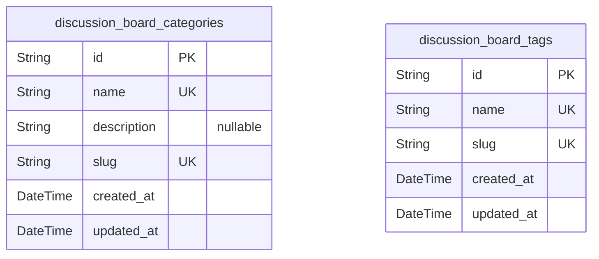
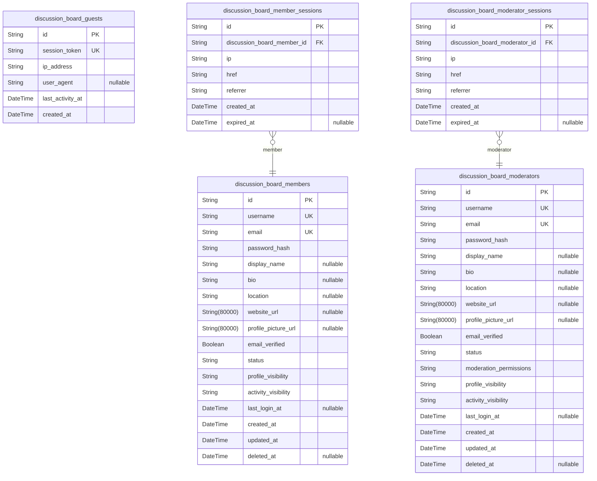
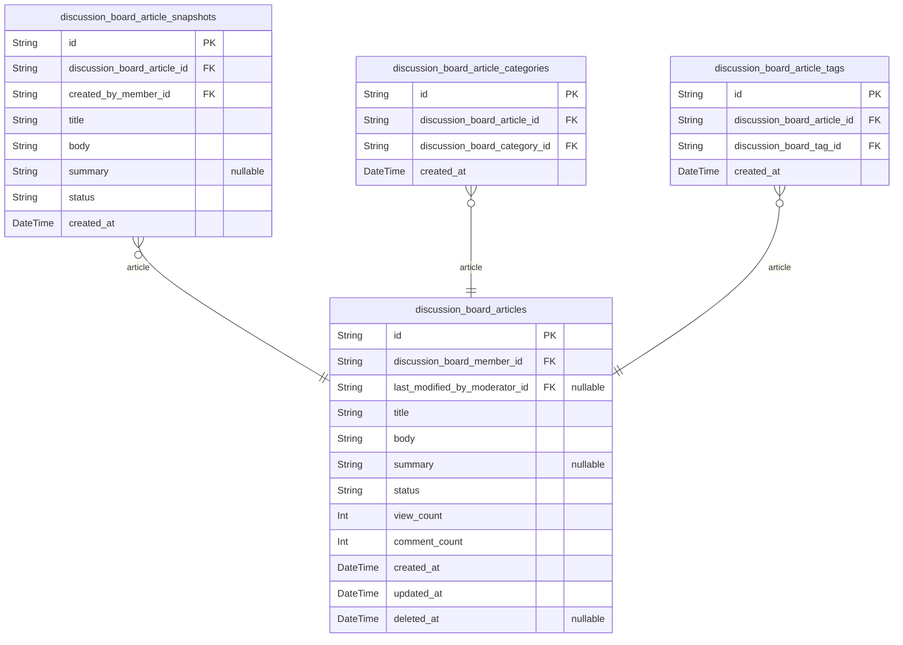
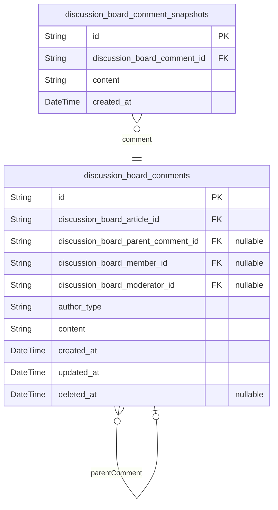
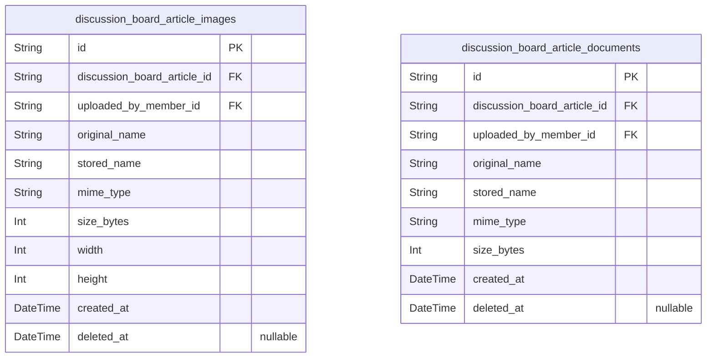
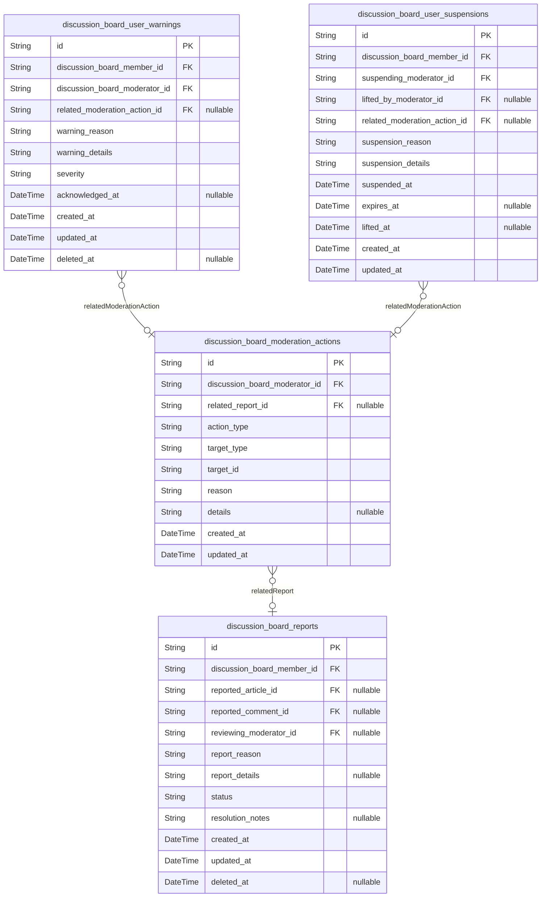

# Prisma Markdown

> Generated by [`prisma-markdown`](https://github.com/samchon/prisma-markdown)

- [Systematic](#systematic)
- [Actors](#actors)
- [Articles](#articles)
- [Comments](#comments)
- [Attachments](#attachments)
- [Moderation](#moderation)

## Systematic

```mermaid
erDiagram
"discussion_board_categories" {
  String id PK
  String name UK
  String description "nullable"
  String slug UK
  DateTime created_at
  DateTime updated_at
}
"discussion_board_tags" {
  String id PK
  String name UK
  String slug UK
  DateTime created_at
  DateTime updated_at
}
```

### `discussion_board_categories`

Article categories for organizing economic and political discussion
topics. Categories provide the primary taxonomy structure for content
organization, enabling users to browse articles by subject area (e.g.,
Economic Policy, Political Analysis, International Trade). Referenced by
discussion_board_article_categories for many-to-many article
relationships.

Properties as follows:

- `id`: Primary Key.
- `name`
  > Category display name (e.g., Economic Policy, Political Analysis).
  > Human-readable label shown in UI.
- `description`
  > Detailed explanation of the category's purpose and scope. Helps users
  > understand what content belongs in this category.
- `slug`
  > URL-friendly identifier derived from name (e.g., economic-policy). Used
  > in routes and permalinks for SEO-friendly URLs.
- `created_at`
  > Timestamp when this category was created. Automatically set on record
  > creation.
- `updated_at`
  > Timestamp when this category was last modified. Automatically updated on
  > any change.

### `discussion_board_tags`

Flexible topic tags for article labeling and discovery. Tags provide
granular, user-generated keywords that complement the formal category
structure, enabling detailed content filtering and discovery (e.g.,
monetary-policy, climate-change, taxation). Tags are normalized to
lowercase for consistency. Referenced by discussion_board_article_tags
for many-to-many article relationships.

Properties as follows:

- `id`: Primary Key.
- `name`
  > Tag name normalized to lowercase (e.g., monetary-policy,
  > healthcare-reform). Ensures consistency and prevents duplicate tags with
  > different capitalization.
- `slug`
  > URL-friendly identifier derived from name. Used in routes and tag
  > browsing pages for SEO-friendly URLs.
- `created_at`
  > Timestamp when this tag was first created. Automatically set when tag is
  > added to system.
- `updated_at`
  > Timestamp when this tag was last modified. Updated when tag is renamed or
  > merged with another tag.

## Actors

```mermaid
erDiagram
"discussion_board_guests" {
  String id PK
  String session_token UK
  String ip_address
  String user_agent "nullable"
  DateTime last_activity_at
  DateTime created_at
}
"discussion_board_members" {
  String id PK
  String username UK
  String email UK
  String password_hash
  String display_name "nullable"
  String bio "nullable"
  String location "nullable"
  String(80000) website_url "nullable"
  String(80000) profile_picture_url "nullable"
  Boolean email_verified
  String status
  String profile_visibility
  String activity_visibility
  DateTime last_login_at "nullable"
  DateTime created_at
  DateTime updated_at
  DateTime deleted_at "nullable"
}
"discussion_board_member_sessions" {
  String id PK
  String discussion_board_member_id FK
  String ip
  String href
  String referrer
  DateTime created_at
  DateTime expired_at "nullable"
}
"discussion_board_moderators" {
  String id PK
  String username UK
  String email UK
  String password_hash
  String display_name "nullable"
  String bio "nullable"
  String location "nullable"
  String(80000) website_url "nullable"
  String(80000) profile_picture_url "nullable"
  Boolean email_verified
  String status
  String moderation_permissions
  String profile_visibility
  String activity_visibility
  DateTime last_login_at "nullable"
  DateTime created_at
  DateTime updated_at
  DateTime deleted_at "nullable"
}
"discussion_board_moderator_sessions" {
  String id PK
  String discussion_board_moderator_id FK
  String ip
  String href
  String referrer
  DateTime created_at
  DateTime expired_at "nullable"
}
"discussion_board_member_sessions" }o--|| "discussion_board_members" : member
"discussion_board_moderator_sessions" }o--|| "discussion_board_moderators" : moderator
```

### `discussion_board_guests`

Guest users who browse the discussion board without authentication.
Guests have read-only access to public content and cannot create articles
or post comments. This table tracks guest sessions for analytics and rate
limiting purposes.

Properties as follows:

- `id`: Primary Key.
- `session_token`: Unique session identifier for tracking guest activity across requests.
- `ip_address`: IP address of the guest user for security monitoring and rate limiting.
- `user_agent`: Browser user agent string for analytics and compatibility tracking.
- `last_activity_at`: Timestamp of the guest's most recent activity for session management.
- `created_at`: Timestamp when the guest session was created.

### `discussion_board_members`

Registered and authenticated users who can create articles, post
comments, and engage in discussions. Members are the core participants of
the discussion board with full content creation and interaction
privileges. Supports email verification, soft deletion for account
recovery, and comprehensive privacy controls.

Properties as follows:

- `id`: Primary Key.
- `username`
  > Unique username for member identification and login. Must be 3-30
  > characters, alphanumeric with underscores and hyphens only.
- `email`
  > Email address for authentication, notifications, and account recovery.
  > Must be unique and verified.
- `password_hash`: Securely hashed password for authentication. Never stored in plain text.
- `display_name`: Optional display name shown publicly instead of username. 1-50 characters.
- `bio`: Optional member biography or self-description. Maximum 500 characters.
- `location`: Optional geographic location (free text). Maximum 100 characters.
- `website_url`: Optional personal or professional website URL.
- `profile_picture_url`: URL of the member's profile picture. Falls back to default avatar if null.
- `email_verified`
  > Whether the member's email address has been verified. Must be true to
  > post content.
- `status`: Account status: pending_email_verification, active, suspended, or deleted.
- `profile_visibility`: Profile visibility setting: public, members_only, or private.
- `activity_visibility`: Activity history visibility: public, members_only, or hidden.
- `last_login_at`: Timestamp of the member's most recent successful login.
- `created_at`: Timestamp when the member account was created.
- `updated_at`: Timestamp when the member profile was last modified.
- `deleted_at`: Timestamp when the member account was soft-deleted. Null if active.

### `discussion_board_member_sessions`

Active session tracking for authenticated members. Records login sessions
for security auditing, concurrent session management, and activity
tracking. Follows standardized session table pattern with exact required
fields.

Properties as follows:

- `id`: Primary Key.
- `discussion_board_member_id`: Belonged member's [discussion_board_members.id](#discussion_board_members).
- `ip`: IP address from which the member connected for this session.
- `href`: Connection URL where the session was initiated.
- `referrer`: Referrer URL that led to this session creation.
- `created_at`: Session creation time.
- `expired_at`: Session end time (nullable).

### `discussion_board_moderators`

Trusted users with elevated permissions to manage content, enforce
community guidelines, and moderate discussions. Moderators can edit or
delete any content and manage user accounts for community health.
Supports same authentication and profile features as members plus
moderation-specific permissions.

Properties as follows:

- `id`: Primary Key.
- `username`
  > Unique username for moderator identification and login. Must be 3-30
  > characters, alphanumeric with underscores and hyphens only.
- `email`
  > Email address for authentication, notifications, and moderation alerts.
  > Must be unique and verified.
- `password_hash`: Securely hashed password for authentication. Never stored in plain text.
- `display_name`: Optional display name shown publicly instead of username. 1-50 characters.
- `bio`: Optional moderator biography or self-description. Maximum 500 characters.
- `location`: Optional geographic location (free text). Maximum 100 characters.
- `website_url`: Optional personal or professional website URL.
- `profile_picture_url`
  > URL of the moderator's profile picture. Falls back to default avatar if
  > null.
- `email_verified`
  > Whether the moderator's email address has been verified. Must be true for
  > moderation actions.
- `status`: Account status: pending_email_verification, active, suspended, or deleted.
- `moderation_permissions`
  > JSON string defining specific moderation permissions and access levels
  > for this moderator.
- `profile_visibility`: Profile visibility setting: public, members_only, or private.
- `activity_visibility`: Activity history visibility: public, members_only, or hidden.
- `last_login_at`: Timestamp of the moderator's most recent successful login.
- `created_at`: Timestamp when the moderator account was created.
- `updated_at`: Timestamp when the moderator profile was last modified.
- `deleted_at`: Timestamp when the moderator account was soft-deleted. Null if active.

### `discussion_board_moderator_sessions`

Active session tracking for authenticated moderators. Records login
sessions for security auditing, concurrent session management, and
moderation activity tracking. Follows standardized session table pattern
with exact required fields.

Properties as follows:

- `id`: Primary Key.
- `discussion_board_moderator_id`: Belonged moderator's [discussion_board_moderators.id](#discussion_board_moderators).
- `ip`: IP address from which the moderator connected for this session.
- `href`: Connection URL where the session was initiated.
- `referrer`: Referrer URL that led to this session creation.
- `created_at`: Session creation time.
- `expired_at`: Session end time (nullable).

## Articles

```mermaid
erDiagram
"discussion_board_articles" {
  String id PK
  String discussion_board_member_id FK
  String last_modified_by_moderator_id FK "nullable"
  String title
  String body
  String summary "nullable"
  String status
  Int view_count
  Int comment_count
  DateTime created_at
  DateTime updated_at
  DateTime deleted_at "nullable"
}
"discussion_board_article_snapshots" {
  String id PK
  String discussion_board_article_id FK
  String created_by_member_id FK
  String title
  String body
  String summary "nullable"
  String status
  DateTime created_at
}
"discussion_board_article_categories" {
  String id PK
  String discussion_board_article_id FK
  String discussion_board_category_id FK
  DateTime created_at
}
"discussion_board_article_tags" {
  String id PK
  String discussion_board_article_id FK
  String discussion_board_tag_id FK
  DateTime created_at
}
"discussion_board_article_snapshots" }o--|| "discussion_board_articles" : article
"discussion_board_article_categories" }o--|| "discussion_board_articles" : article
"discussion_board_article_tags" }o--|| "discussion_board_articles" : article
```

### `discussion_board_articles`

Main article entity for economic and political discussions. Articles are
the primary content type created by members and moderators, containing
title, body content, and metadata. Articles can have multiple categories
and tags through junction tables, and maintain version history through
snapshots. Supports soft deletion for content recovery.

Properties as follows:

- `id`: Primary Key.
- `discussion_board_member_id`
  > Author member who created this article. {@link
  > discussion_board_members.id}
- `last_modified_by_moderator_id`
  > Moderator who last modified this article, if applicable. {@link
  > discussion_board_moderators.id}
- `title`
  > Article title, between 5 and 200 characters. Used for display in listings
  > and search results.
- `body`
  > Main article content, between 20 and 50000 characters. Supports rich text
  > formatting and contains the full article text.
- `summary`
  > Optional article excerpt or summary, maximum 500 characters. Used for
  > previews in article listings.
- `status`
  > Publication status of the article. Values: published, draft, archived.
  > Controls article visibility and lifecycle.
- `view_count`
  > Number of times this article has been viewed. Incremented on each article
  > page visit.
- `comment_count`
  > Cached count of comments on this article. Updated when comments are added
  > or removed.
- `created_at`
  > Timestamp when the article was originally created. Immutable after
  > creation.
- `updated_at`
  > Timestamp when the article was last modified. Updated on each edit
  > operation.
- `deleted_at`
  > Soft deletion timestamp. When set, article is hidden from public view but
  > retained for recovery and audit purposes.

### `discussion_board_article_snapshots`

Historical snapshots of article content for version control and audit
trails. Each snapshot captures the complete state of an article at a
specific point in time, preserving title, body, and metadata. Snapshots
are created on article creation and each subsequent edit, enabling
rollback and change tracking.

Properties as follows:

- `id`: Primary Key.
- `discussion_board_article_id`
  > Reference to the parent article this snapshot belongs to. {@link
  > discussion_board_articles.id}
- `created_by_member_id`
  > Member who created this snapshot version, either the original author or
  > an editor. [discussion_board_members.id](#discussion_board_members)
- `title`
  > Article title at the time of this snapshot. Preserved for historical
  > accuracy.
- `body`
  > Article body content at the time of this snapshot. Complete content
  > preserved for version comparison.
- `summary`: Article summary at the time of this snapshot, if provided.
- `status`
  > Article status at the time of this snapshot. Values: published, draft,
  > archived.
- `created_at`
  > Timestamp when this snapshot was created. Marks the point in time this
  > version was saved.

### `discussion_board_article_categories`

Junction table establishing many-to-many relationship between articles
and categories. Articles can belong to multiple categories for flexible
organization, and categories can contain multiple articles. Used for
article organization and category-based browsing.

Properties as follows:

- `id`: Primary Key.
- `discussion_board_article_id`
  > Reference to the article in this relationship. {@link
  > discussion_board_articles.id}
- `discussion_board_category_id`
  > Reference to the category in this relationship. {@link
  > discussion_board_categories.id}
- `created_at`: Timestamp when this article-category association was created.

### `discussion_board_article_tags`

Junction table establishing many-to-many relationship between articles
and tags. Articles can have multiple tags for detailed topic
classification, and tags can be applied to multiple articles. Used for
tag-based search and content discovery.

Properties as follows:

- `id`: Primary Key.
- `discussion_board_article_id`
  > Reference to the article in this relationship. {@link
  > discussion_board_articles.id}
- `discussion_board_tag_id`
  > Reference to the tag in this relationship. {@link
  > discussion_board_tags.id}
- `created_at`: Timestamp when this article-tag association was created.

## Comments

```mermaid
erDiagram
"discussion_board_comments" {
  String id PK
  String discussion_board_article_id FK
  String discussion_board_parent_comment_id FK "nullable"
  String discussion_board_member_id FK "nullable"
  String discussion_board_moderator_id FK "nullable"
  String author_type
  String content
  DateTime created_at
  DateTime updated_at
  DateTime deleted_at "nullable"
}
"discussion_board_comment_snapshots" {
  String id PK
  String discussion_board_comment_id FK
  String content
  DateTime created_at
}
"discussion_board_comments" }o--o| "discussion_board_comments" : parentComment
"discussion_board_comment_snapshots" }o--|| "discussion_board_comments" : comment
```

### `discussion_board_comments`

User comments on articles in the discussion board. Comments enable
discussion and engagement on economic and political topics. Supports
single-level threading where comments can be top-level (direct responses
to articles) or replies to other top-level comments. Comments can be
created by both members and moderators, with authorship tracked through
author_type discriminator and corresponding foreign keys.

Properties as follows:

- `id`: Primary Key.
- `discussion_board_article_id`
  > Parent article this comment belongs to. {@link
  > discussion_board_articles.id}
- `discussion_board_parent_comment_id`
  > Parent comment for single-level reply threading. Null for top-level
  > comments, references another top-level comment for replies. {@link
  > discussion_board_comments.id}
- `discussion_board_member_id`
  > Member author if comment was created by a member. Mutually exclusive with
  > discussion_board_moderator_id. [discussion_board_members.id](#discussion_board_members)
- `discussion_board_moderator_id`
  > Moderator author if comment was created by a moderator. Mutually
  > exclusive with discussion_board_member_id. {@link
  > discussion_board_moderators.id}
- `author_type`
  > Discriminator indicating author type. Valid values are member or
  > moderator. Determines which author foreign key is populated.
- `content`
  > Comment text content. User-submitted comment on the article or reply to
  > another comment. Length between 1 and 5000 characters as per
  > requirements.
- `created_at`: Timestamp when the comment was originally created.
- `updated_at`: Timestamp when the comment was last modified. Updated on edits.
- `deleted_at`
  > Soft delete timestamp. Null if comment is active, set to deletion time if
  > comment was deleted. Enables comment recovery and audit trail.

### `discussion_board_comment_snapshots`

Historical snapshots of comment edits for audit trail and version
control. Each snapshot captures the comment state at a specific point in
time, enabling comment edit history tracking and potential rollback.
Snapshots are append-only and never modified after creation.

Properties as follows:

- `id`: Primary Key.
- `discussion_board_comment_id`
  > Comment this snapshot belongs to. Multiple snapshots track edit history.
  > [discussion_board_comments.id](#discussion_board_comments)
- `content`
  > Denormalized snapshot of comment content at the time of this snapshot
  > creation. Preserves historical content even if parent comment is later
  > modified or deleted.
- `created_at`
  > Timestamp when this snapshot was created. Represents the point in time
  > this version of the comment existed.

## Attachments

```mermaid
erDiagram
"discussion_board_article_images" {
  String id PK
  String discussion_board_article_id FK
  String uploaded_by_member_id FK
  String original_name
  String stored_name
  String mime_type
  Int size_bytes
  Int width
  Int height
  DateTime created_at
  DateTime deleted_at "nullable"
}
"discussion_board_article_documents" {
  String id PK
  String discussion_board_article_id FK
  String uploaded_by_member_id FK
  String original_name
  String stored_name
  String mime_type
  Int size_bytes
  DateTime created_at
  DateTime deleted_at "nullable"
}
```

### `discussion_board_article_images`

Image attachments for discussion board articles. Stores images in
supported formats (JPEG, PNG, GIF, WebP) with a maximum size of 5MB per
image. Images are displayed inline within articles and can be viewed at
full resolution. Each image is associated with a parent article and
tracked with uploader information and upload timestamp.

Properties as follows:

- `id`: Primary Key.
- `discussion_board_article_id`
  > Parent article that this image is attached to. {@link
  > discussion_board_articles.id}
- `uploaded_by_member_id`
  > Member who uploaded this image attachment. {@link
  > discussion_board_members.id}
- `original_name`: Original filename of the uploaded image as provided by the user.
- `stored_name`: Unique filename used for storage to prevent conflicts and ensure security.
- `mime_type`
  > MIME type of the image file (e.g., image/jpeg, image/png, image/gif,
  > image/webp) for validation and proper content delivery.
- `size_bytes`: File size in bytes. Maximum allowed is 5MB (5,242,880 bytes) for images.
- `width`
  > Image width in pixels. Used for validation (minimum 50px, maximum 8000px)
  > and display optimization.
- `height`
  > Image height in pixels. Used for validation (minimum 50px, maximum
  > 8000px) and display optimization.
- `created_at`: Timestamp when the image was uploaded to the system.
- `deleted_at`
  > Timestamp when the image was soft deleted. Null if the image is active.
  > Images are deleted when parent article is deleted or when removed by
  > author/moderator.

### `discussion_board_article_documents`

Document attachments for discussion board articles. Stores documents in
supported formats (PDF, DOCX, DOC, TXT, RTF, ODT) with a maximum size of
10MB per document. Documents are provided as downloadable links with file
metadata. Each document is associated with a parent article and tracked
with uploader information and upload timestamp.

Properties as follows:

- `id`: Primary Key.
- `discussion_board_article_id`
  > Parent article that this document is attached to. {@link
  > discussion_board_articles.id}
- `uploaded_by_member_id`
  > Member who uploaded this document attachment. {@link
  > discussion_board_members.id}
- `original_name`: Original filename of the uploaded document as provided by the user.
- `stored_name`: Unique filename used for storage to prevent conflicts and ensure security.
- `mime_type`
  > MIME type of the document file (e.g., application/pdf,
  > application/vnd.openxmlformats-officedocument.wordprocessingml.document,
  > text/plain) for validation and proper content delivery.
- `size_bytes`
  > File size in bytes. Maximum allowed is 10MB (10,485,760 bytes) for
  > documents.
- `created_at`: Timestamp when the document was uploaded to the system.
- `deleted_at`
  > Timestamp when the document was soft deleted. Null if the document is
  > active. Documents are deleted when parent article is deleted or when
  > removed by author/moderator.

## Moderation

```mermaid
erDiagram
"discussion_board_reports" {
  String id PK
  String discussion_board_member_id FK
  String reported_article_id FK "nullable"
  String reported_comment_id FK "nullable"
  String reviewing_moderator_id FK "nullable"
  String report_reason
  String report_details "nullable"
  String status
  String resolution_notes "nullable"
  DateTime created_at
  DateTime updated_at
  DateTime deleted_at "nullable"
}
"discussion_board_moderation_actions" {
  String id PK
  String discussion_board_moderator_id FK
  String related_report_id FK "nullable"
  String action_type
  String target_type
  String target_id
  String reason
  String details "nullable"
  DateTime created_at
  DateTime updated_at
}
"discussion_board_user_warnings" {
  String id PK
  String discussion_board_member_id FK
  String discussion_board_moderator_id FK
  String related_moderation_action_id FK "nullable"
  String warning_reason
  String warning_details
  String severity
  DateTime acknowledged_at "nullable"
  DateTime created_at
  DateTime updated_at
  DateTime deleted_at "nullable"
}
"discussion_board_user_suspensions" {
  String id PK
  String discussion_board_member_id FK
  String suspending_moderator_id FK
  String lifted_by_moderator_id FK "nullable"
  String related_moderation_action_id FK "nullable"
  String suspension_reason
  String suspension_details
  DateTime suspended_at
  DateTime expires_at "nullable"
  DateTime lifted_at "nullable"
  DateTime created_at
  DateTime updated_at
}
"discussion_board_moderation_actions" }o--o| "discussion_board_reports" : relatedReport
"discussion_board_user_warnings" }o--o| "discussion_board_moderation_actions" : relatedModerationAction
"discussion_board_user_suspensions" }o--o| "discussion_board_moderation_actions" : relatedModerationAction
```

### `discussion_board_reports`

Content reports submitted by members flagging articles or comments that
potentially violate community guidelines. Reports are reviewed by
moderators who can take appropriate action. Each report targets either an
article or a comment (polymorphic relationship) and tracks the reporter,
reason, status, and resolution.

Properties as follows:

- `id`: Primary Key.
- `discussion_board_member_id`: Reporter who submitted this report. [discussion_board_members.id](#discussion_board_members).
- `reported_article_id`
  > Reported article if the report targets an article. {@link
  > discussion_board_articles.id}. Mutually exclusive with
  > reported_comment_id.
- `reported_comment_id`
  > Reported comment if the report targets a comment. {@link
  > discussion_board_comments.id}. Mutually exclusive with
  > reported_article_id.
- `reviewing_moderator_id`
  > Moderator currently reviewing or who resolved this report. {@link
  > discussion_board_moderators.id}. Nullable when report is pending.
- `report_reason`
  > Category of the violation being reported (e.g., spam, harassment,
  > misinformation, offensive content).
- `report_details`
  > Detailed explanation provided by the reporter describing why the content
  > violates guidelines.
- `status`
  > Current status of the report: pending (not yet reviewed), under_review
  > (moderator is reviewing), resolved (action taken), dismissed (no
  > violation found).
- `resolution_notes`
  > Notes from the moderator explaining the decision or action taken on this
  > report.
- `created_at`: Timestamp when the report was submitted.
- `updated_at`
  > Timestamp when the report was last updated (status change, moderator
  > assignment, resolution).
- `deleted_at`
  > Soft delete timestamp for audit trail. When set, the report is hidden but
  > preserved for historical records.

### `discussion_board_moderation_actions`

Audit log of all moderation actions taken by moderators. Records every
moderator intervention including content edits, deletions, user warnings,
suspensions, and bans. Provides complete accountability and traceability
for all moderation decisions.

Properties as follows:

- `id`: Primary Key.
- `discussion_board_moderator_id`
  > Moderator who performed this action. {@link
  > discussion_board_moderators.id}.
- `related_report_id`
  > Report that triggered this moderation action if applicable. {@link
  > discussion_board_reports.id}. Nullable for proactive moderation not
  > triggered by reports.
- `action_type`
  > Type of moderation action: edit_content, delete_content, restore_content,
  > warn_user, suspend_user, ban_user, lift_suspension, dismiss_report.
- `target_type`: Type of entity targeted by this action: article, comment, user, report.
- `target_id`
  > UUID of the targeted entity (article ID, comment ID, user ID, or report
  > ID depending on target_type).
- `reason`: Reason or justification for taking this moderation action.
- `details`
  > Additional details or notes about the action taken, including what was
  > changed or why the decision was made.
- `created_at`: Timestamp when the moderation action was performed.
- `updated_at`: Timestamp when the action record was last updated.

### `discussion_board_user_warnings`

Warnings issued to users for policy violations. Part of progressive
discipline system where users receive warnings before suspensions or
bans. Tracks warning severity, acknowledgment, and relationship to
moderation actions.

Properties as follows:

- `id`: Primary Key.
- `discussion_board_member_id`: User who received this warning. [discussion_board_members.id](#discussion_board_members).
- `discussion_board_moderator_id`: Moderator who issued this warning. [discussion_board_moderators.id](#discussion_board_moderators).
- `related_moderation_action_id`
  > Moderation action that resulted in this warning. {@link
  > discussion_board_moderation_actions.id}. Nullable for warnings issued
  > independently.
- `warning_reason`
  > Category or type of violation that triggered this warning (e.g., spam,
  > harassment, off-topic content).
- `warning_details`: Detailed explanation of the violation and what behavior needs to change.
- `severity`
  > Severity level of the warning: minor, moderate, severe. Used for
  > progressive discipline tracking.
- `acknowledged_at`
  > Timestamp when the user acknowledged receipt of this warning. Nullable if
  > not yet acknowledged.
- `created_at`: Timestamp when the warning was issued.
- `updated_at`: Timestamp when the warning record was last updated.
- `deleted_at`
  > Soft delete timestamp if the warning is retracted or removed. Nullable
  > for active warnings.

### `discussion_board_user_suspensions`

Account suspensions preventing users from logging in and participating.
Tracks suspension duration, reason, and who issued or lifted the
suspension. Part of enforcement actions for serious or repeated
violations.

Properties as follows:

- `id`: Primary Key.
- `discussion_board_member_id`: User whose account is suspended. [discussion_board_members.id](#discussion_board_members).
- `suspending_moderator_id`
  > Moderator who issued this suspension. {@link
  > discussion_board_moderators.id}.
- `lifted_by_moderator_id`
  > Moderator who lifted the suspension early if applicable. {@link
  > discussion_board_moderators.id}. Nullable for suspensions that expired
  > naturally or are still active.
- `related_moderation_action_id`
  > Moderation action that resulted in this suspension. {@link
  > discussion_board_moderation_actions.id}. Nullable for suspensions issued
  > independently.
- `suspension_reason`: Category or type of violation that resulted in suspension.
- `suspension_details`
  > Detailed explanation of why the suspension was issued and what violations
  > occurred.
- `suspended_at`: Timestamp when the suspension began and the account was locked.
- `expires_at`
  > Timestamp when the suspension is scheduled to end. Nullable for permanent
  > bans.
- `lifted_at`
  > Timestamp when the suspension was lifted early by a moderator. Nullable
  > for suspensions that expired naturally or are still active.
- `created_at`: Timestamp when the suspension record was created.
- `updated_at`: Timestamp when the suspension record was last updated.
