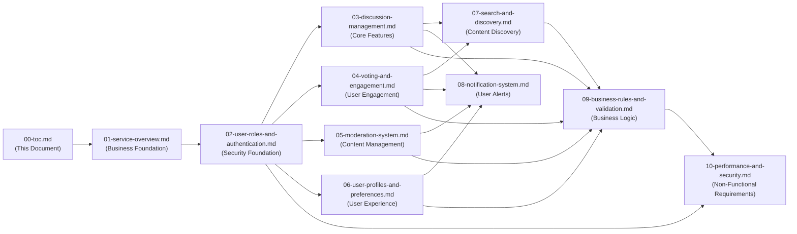

# Discussion Board Documentation - Table of Contents

## Introduction

This documentation suite provides comprehensive business requirements for developing an economic and political discussion board platform. The documentation is organized into 11 interconnected documents that cover business strategy, functional requirements, user experience, and system constraints.

**Target Audience**: This documentation is written primarily for backend developers who will implement the discussion board system. Business stakeholders and project managers will also find the strategic and functional requirements valuable for understanding the platform's scope and objectives.

**Documentation Philosophy**: These documents focus on **business requirements only**. All technical implementation decisions—including architecture, API design, database schemas, technology stack, and deployment strategies—are at the discretion of the development team.

## Project Context

The **Discussion Board** platform is a specialized online community designed for civil, organized discussions on economic and political topics. The platform addresses the need for structured, moderated conversations on sensitive subjects while maintaining high standards of discourse quality.

**Core Platform Capabilities**:
- User registration and role-based access control
- Topic creation and threaded discussion management
- Content voting and engagement mechanisms
- Community-driven moderation with professional oversight
- Advanced search and content discovery
- Personalized user experience with notifications
- Comprehensive business rules ensuring platform integrity

## Documentation Structure

The documentation is organized into three logical categories:

### Business Foundation Documents
Documents that establish the strategic context and business model:
- **01-service-overview.md** - Business strategy and market positioning

### Core Functional Requirements
Documents defining the primary platform functionality:
- **02-user-roles-and-authentication.md** - Security and access control foundation
- **03-discussion-management.md** - Core discussion features
- **04-voting-and-engagement.md** - User interaction mechanisms
- **05-moderation-system.md** - Content management and community standards
- **06-user-profiles-and-preferences.md** - User personalization
- **07-search-and-discovery.md** - Content discovery features
- **08-notification-system.md** - User engagement and alerts

### System Rules and Constraints
Documents defining business logic and system requirements:
- **09-business-rules-and-validation.md** - Platform-wide business rules
- **10-performance-and-security.md** - Non-functional requirements

## Document Summaries

### 00-toc.md (This Document)
**Purpose**: Provides navigation guidance and overview of the complete documentation suite.

**Key Content**: Document organization, reading recommendations, dependency relationships.

**Audience**: All stakeholders seeking to understand the documentation structure.

---

### [Service Overview](./01-service-overview.md)
**Purpose**: Establishes the foundational business context, market need, and strategic vision for the discussion board platform.

**Key Content**:
- Executive summary of the platform vision
- Problem statement and market opportunity
- Target audience and user demographics
- Business model and revenue strategy
- Competitive landscape analysis
- Success metrics and KPIs
- Long-term strategic goals

**Why Read This**: Understand the "why" behind the platform—what market need it addresses, how it generates value, and what makes it unique in the discussion board landscape.

**Audience**: Business stakeholders, product managers, development team leads.

---

### [User Roles and Authentication](./02-user-roles-and-authentication.md)
**Purpose**: Defines the complete authentication system and user role hierarchy that forms the security foundation of the platform.

**Key Content**:
- User registration and email verification process
- Login, logout, and session management
- JWT token strategy and management
- Complete user role hierarchy (Guest, Member, Moderator, Administrator)
- Comprehensive permission matrix for all roles
- Password security and account recovery
- Role transition rules and requirements

**Why Read This**: Understand how users authenticate, what each role can do, and how the platform controls access to features based on user permissions.

**Audience**: Backend developers, security engineers, QA teams.

**Dependencies**: Foundation for all subsequent functional documents.

---

### [Discussion Management](./03-discussion-management.md)
**Purpose**: Details the core discussion functionality—topic creation, threading, categorization, and organization.

**Key Content**:
- Discussion topic creation workflow
- Category system for Economics and Politics
- Threaded reply structure and hierarchy
- Post editing and deletion rules
- Discussion search and filtering
- Topic organization and sorting
- Discussion status management

**Why Read This**: Understand the primary value proposition of the platform—how users create, organize, and participate in economic and political discussions.

**Audience**: Backend developers, UX designers, product managers.

**Dependencies**: Requires understanding of user roles from 02-user-roles-and-authentication.md.

---

### [Voting and Engagement](./04-voting-and-engagement.md)
**Purpose**: Specifies user interaction mechanisms including voting, favoriting, and engagement features that surface quality content.

**Key Content**:
- Upvote and downvote mechanics
- Vote counting and display rules
- Content ranking algorithm requirements
- Favorite and bookmark functionality
- User reputation system
- Engagement notifications
- Anti-gaming and vote manipulation prevention

**Why Read This**: Understand how users interact with content, how quality contributions are rewarded, and how the platform prevents abuse.

**Audience**: Backend developers, product managers.

**Dependencies**: Builds on discussion management (03) and user roles (02).

---

### [Moderation System](./05-moderation-system.md)
**Purpose**: Defines the content moderation workflow critical for maintaining civil discourse on sensitive economic and political topics.

**Key Content**:
- Content reporting and flagging system
- Moderation queue and workflow
- Moderator tools and actions
- User warning system
- Suspension and ban mechanics
- Appeal process for moderation decisions
- Moderation audit trail
- Community guidelines enforcement

**Why Read This**: Understand how inappropriate content is identified, reviewed, and handled to maintain platform integrity and civil discourse.

**Audience**: Backend developers, community managers, moderators.

**Dependencies**: Requires user roles (02) and discussion management (03) context.

---

### [User Profiles and Preferences](./06-user-profiles-and-preferences.md)
**Purpose**: Specifies user profile management and personalization features that enhance user experience.

**Key Content**:
- User profile structure and information
- Profile editing and customization
- User activity history tracking
- Notification preference controls
- Privacy settings management
- Blocked users functionality
- Email and display preferences

**Why Read This**: Understand how users manage their accounts, customize their experience, and control their privacy.

**Audience**: Backend developers, UX designers.

**Dependencies**: Builds on user authentication (02) and notification system (08).

---

### [Search and Discovery](./07-search-and-discovery.md)
**Purpose**: Details search functionality and content discovery mechanisms that help users find relevant discussions efficiently.

**Key Content**:
- Full-text search across topics and replies
- Search filters and advanced options
- Search result ranking algorithm
- Trending topics identification
- Recommended discussion features
- Category and tag-based browsing
- Discovery mechanisms for new users

**Why Read This**: Understand how users find relevant economic and political discussions through search, trending, and recommendations.

**Audience**: Backend developers, search engineers.

**Dependencies**: Requires discussion management (03) and voting system (04) context.

---

### [Notification System](./08-notification-system.md)
**Purpose**: Specifies the notification system that keeps users engaged by alerting them to relevant activity.

**Key Content**:
- Notification types and triggering events
- In-app notification delivery
- Email notification system
- Notification delivery rules
- User notification preferences
- Notification history and management
- Notification batching to prevent spam

**Why Read This**: Understand how users stay informed about replies, mentions, votes, and other platform activity.

**Audience**: Backend developers, email system engineers.

**Dependencies**: Relates to user preferences (06) and all feature documents that trigger notifications.

---

### [Business Rules and Validation](./09-business-rules-and-validation.md)
**Purpose**: Consolidates all business rules, validation requirements, and constraints that govern platform behavior.

**Key Content**:
- Content validation rules and constraints
- User input validation requirements
- Rate limiting rules to prevent abuse
- Reputation and privilege requirements
- Content length and formatting limits
- Time-based restrictions (editing windows, etc.)
- Automated content checks
- Cross-cutting business logic constraints

**Why Read This**: Understand the comprehensive set of business rules that ensure consistent platform behavior and prevent abuse.

**Audience**: Backend developers, QA engineers.

**Dependencies**: Synthesizes rules from all functional documents (03-08).

---

### [Performance and Security](./10-performance-and-security.md)
**Purpose**: Defines performance expectations, security requirements, and compliance needs for the platform.

**Key Content**:
- Response time requirements for user actions
- System scalability expectations
- Security measures and data protection
- Privacy compliance requirements
- Error handling strategy from user perspective
- System availability expectations
- Concurrent user handling requirements

**Why Read This**: Understand the non-functional requirements that ensure the platform is fast, secure, reliable, and compliant.

**Audience**: Backend developers, DevOps engineers, security teams.

**Dependencies**: Applies to all functional requirements defined in documents 02-08.

---

## Reading Guide

### For Backend Developers (Complete Implementation)
**Recommended Reading Order**:

1. **Start Here**: [Service Overview](./01-service-overview.md) - Understand the business context
2. **Security Foundation**: [User Roles and Authentication](./02-user-roles-and-authentication.md) - Implement authentication first
3. **Core Features** (Read in Order):
   - [Discussion Management](./03-discussion-management.md) - Core platform functionality
   - [Voting and Engagement](./04-voting-and-engagement.md) - User interaction features
   - [Moderation System](./05-moderation-system.md) - Content management
4. **User Experience Features**:
   - [User Profiles and Preferences](./06-user-profiles-and-preferences.md) - Profile management
   - [Search and Discovery](./07-search-and-discovery.md) - Content discovery
   - [Notification System](./08-notification-system.md) - User engagement
5. **System Rules**: [Business Rules and Validation](./09-business-rules-and-validation.md) - Comprehensive validation
6. **Non-Functional Requirements**: [Performance and Security](./10-performance-and-security.md) - System quality attributes

### For Business Stakeholders
**Recommended Reading Order**:

1. [Service Overview](./01-service-overview.md) - Complete business strategy and model
2. [User Roles and Authentication](./02-user-roles-and-authentication.md) - Understand user types and access control
3. [Discussion Management](./03-discussion-management.md) - Core platform capabilities
4. [Moderation System](./05-moderation-system.md) - Content quality and community management
5. [Business Rules and Validation](./09-business-rules-and-validation.md) - Platform governance rules

### For Project Managers
**Recommended Reading Order**:

1. [Service Overview](./01-service-overview.md) - Project vision and scope
2. All functional requirements documents (02-08) - Feature scope understanding
3. [Business Rules and Validation](./09-business-rules-and-validation.md) - Constraint awareness
4. [Performance and Security](./10-performance-and-security.md) - Quality requirements

### For QA Engineers
**Recommended Reading Order**:

1. [User Roles and Authentication](./02-user-roles-and-authentication.md) - Test different user permissions
2. All functional requirements documents (03-08) - Feature testing scenarios
3. [Business Rules and Validation](./09-business-rules-and-validation.md) - Validation test cases
4. [Performance and Security](./10-performance-and-security.md) - Non-functional testing requirements

## Document Dependency Map

**Dependency Explanation**:

- **Service Overview** provides business context for all documents
- **User Roles and Authentication** is the security foundation required by all functional features
- **Core functional documents** (03-05) depend on the authentication foundation
- **User experience documents** (06-08) build on core features
- **Business Rules** synthesize validation requirements from all functional documents
- **Performance and Security** applies to the entire implemented system

## How to Use This Documentation

### Quick Reference
- Use this ToC to quickly navigate to specific functional areas
- Click document links to jump directly to detailed requirements
- Refer to the dependency map to understand document relationships

### Implementation Planning
- Follow the recommended reading order for your role
- Start with foundational documents (01-02) before implementation
- Implement features following the dependency order shown in the map
- Cross-reference related documents when implementing interconnected features

### Requirement Clarification
- Each document includes specific "Key Questions" it answers
- Use document summaries to identify which document contains specific information
- Follow document links in the "Dependencies" sections for related context

### Continuous Reference
- Keep this ToC open as a quick reference during development
- Use it to verify you've consulted all relevant requirements for a feature
- Refer back when questions arise about platform scope or business rules

## Document Conventions

### EARS Format
All applicable requirements throughout the documentation use **EARS (Easy Approach to Requirements Syntax)** format:
- **WHEN** [trigger], **THE** [system] **SHALL** [function] (Event-driven)
- **WHILE** [state], **THE** [system] **SHALL** [function] (State-driven)
- **IF** [condition], **THEN THE** [system] **SHALL** [function] (Unwanted behavior)
- **WHERE** [feature], **THE** [system] **SHALL** [function] (Optional features)
- **THE** [system] **SHALL** [function] (Ubiquitous requirements)

### Diagram Usage
- **Mermaid diagrams** illustrate complex workflows, user journeys, and system states
- **Markdown tables** present structured data like permission matrices
- All visual elements include descriptive captions

### Linking Conventions
- All document links use descriptive text (not raw filenames)
- Links use relative paths within the documentation folder
- Cross-references help navigate between related requirements

## Project Scope Summary

**In Scope**:
- User authentication and role-based access control
- Discussion topic creation and threaded replies
- Voting and engagement mechanisms
- Content moderation and community management
- User profiles and personalization
- Search and content discovery
- Notification system
- Business rules and validation
- Performance and security requirements

**Out of Scope** (Technical Implementation Details):
- Database schema design and ERD
- API endpoint specifications
- Frontend UI/UX design
- System architecture and infrastructure
- Technology stack selection
- Deployment strategies

## Getting Started

**New to the Project?**
1. Read [Service Overview](./01-service-overview.md) to understand the business vision
2. Review this ToC to familiarize yourself with the documentation structure
3. Follow the reading guide for your role
4. Keep this ToC bookmarked for quick navigation

**Ready to Implement?**
1. Start with [User Roles and Authentication](./02-user-roles-and-authentication.md) as the foundation
2. Progress through functional documents in dependency order
3. Reference [Business Rules and Validation](./09-business-rules-and-validation.md) throughout implementation
4. Validate against [Performance and Security](./10-performance-and-security.md) requirements

**Questions or Clarifications?**
- Each document includes "Key Questions" sections to help you find answers
- Cross-reference related documents using the dependency map
- All requirements use specific, measurable EARS format for clarity

---

> *Developer Note: This document defines **business requirements only**. All technical implementations (architecture, APIs, database design, etc.) are at the discretion of the development team.*
