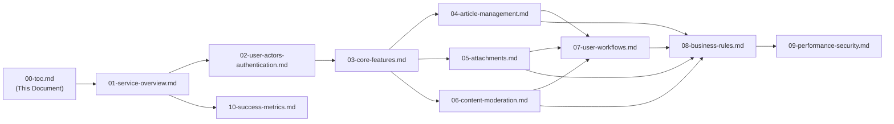

# Discussion Board Project - Documentation Overview

Welcome to the comprehensive documentation for the Discussion Board project, a simple yet effective platform for economic and political discussions with support for articles, image attachments, and file uploads.

This documentation set provides complete business requirements for building the discussion board system. All documents are written in natural language to describe WHAT the system should do, while leaving technical implementation decisions (architecture, APIs, database design, etc.) to the development team.

## How to Use This Documentation

### For All Stakeholders
Start with the **Service Overview** to understand the project vision, then explore documents relevant to your role and interests.

### For Business Stakeholders
Focus on:
- Service Overview (business model and value proposition)
- Core Features (what users can do)
- Success Metrics (how we measure success)

### For Development Team
We recommend reading in this order:
1. Service Overview (understand the context)
2. User Actors & Authentication (foundation for permissions)
3. Core Features (essential capabilities)
4. Article Management, Attachments, Content Moderation (detailed feature requirements)
5. User Workflows (end-to-end scenarios)
6. Business Rules (validation and constraints)
7. Performance & Security (non-functional requirements)

### For Moderators and Community Managers
Focus on:
- User Actors & Authentication (understanding user roles)
- Content Moderation (your tools and capabilities)
- Business Rules (policies you'll enforce)

## Complete Documentation List

### [Service Overview](./01-service-overview.md)
**Purpose**: Establishes the foundation by explaining what the discussion board is, why it exists, and what problem it solves for users interested in economic and political discussions.

**Key Topics**: Service vision, problem statement, target audience, core value proposition, business model, success criteria, and project scope.

**Read this first** to understand the big picture and business context.

---

### [User Actors and Authentication](./02-user-actors-authentication.md)
**Purpose**: Defines all user types (guest, member, moderator) and the complete authentication system, establishing who can do what in the system.

**Key Topics**: User actor definitions, permission hierarchy, registration and login flows, JWT-based authentication, session management, password security, and complete permission matrix.

**Critical foundation document** that affects all other features.

---

### [Core Features](./03-core-features.md)
**Purpose**: Documents the essential features that make the discussion board functional, covering fundamental capabilities users expect from the platform.

**Key Topics**: Article browsing and discovery, article creation and publishing, content categorization, search functionality, user profile management, and notification system.

**Defines the minimum viable feature set** for a functional discussion board.

---

### [Article Management](./04-article-management.md)
**Purpose**: Provides detailed requirements for the central feature—creating, editing, viewing, and managing discussion articles about economic and political topics.

**Key Topics**: Article structure and components, creation and editing process, publishing states (draft, published, archived), deletion and archiving, visibility controls, and metadata requirements.

**The heart of the discussion board** functionality.

---

### [Attachments](./05-attachments.md)
**Purpose**: Specifies how image and file attachments work, supporting discussion articles with visual evidence, documents, and reference materials.

**Key Topics**: Supported attachment types and formats (images, PDFs, documents), file upload process, size and quantity limits, storage and retrieval, security validation, and attachment management.

**Essential for rich content** in economic and political discussions.

---

### [Content Moderation](./06-content-moderation.md)
**Purpose**: Defines how moderators manage content quality and enforce community standards to maintain productive, civil economic and political discussions.

**Key Topics**: Moderation capabilities, content review and removal process, user management by moderators, reporting and flagging system, moderation activity logging, and community guidelines enforcement.

**Critical for maintaining discussion quality** and community standards.

---

### [User Workflows](./07-user-workflows.md)
**Purpose**: Documents step-by-step user journeys for all actor types, ensuring complete end-to-end scenarios are well-defined and the system supports real-world usage patterns.

**Key Topics**: Guest browsing journey, member registration and first article creation, creating articles with attachments, reading and discovering content, editing own content, moderator review workflow, and error handling scenarios.

**Shows how everything works together** from the user's perspective.

---

### [Business Rules](./08-business-rules.md)
**Purpose**: Consolidates all business logic, validation rules, and operational constraints that govern how the discussion board operates and maintains quality.

**Key Topics**: Content validation rules, user permission rules, article publishing rules, attachment validation rules, account management rules, moderation policy rules, and data retention policies.

**The rulebook** for system behavior and validation.

---

### [Performance and Security](./09-performance-security.md)
**Purpose**: Specifies non-functional requirements for performance, security, and reliability to ensure the discussion board is fast, safe, and dependable.

**Key Topics**: Performance expectations, response time requirements, security measures, data protection and privacy, system reliability, scalability considerations, and backup and recovery.

**Ensures quality attributes** beyond functional features.

---

### [Success Metrics](./10-success-metrics.md)
**Purpose**: Defines how to measure whether the discussion board is successful and meeting its goals, providing clear indicators for business value and user satisfaction.

**Key Topics**: Key performance indicators, user engagement metrics, content quality metrics, technical performance metrics, growth and retention metrics, success criteria, and monitoring approach.

**Measures whether we're achieving** our goals.

---

## Quick Reference Guide

### By Common Task

| What You Need to Know | Relevant Documents |
|----------------------|-------------------|
| Project vision and goals | [Service Overview](./01-service-overview.md) |
| User types and permissions | [User Actors and Authentication](./02-user-actors-authentication.md) |
| How users register and log in | [User Actors and Authentication](./02-user-actors-authentication.md) |
| What features the platform has | [Core Features](./03-core-features.md) |
| How articles work | [Article Management](./04-article-management.md) |
| How file uploads work | [Attachments](./05-attachments.md) |
| How moderation works | [Content Moderation](./06-content-moderation.md) |
| Complete user journeys | [User Workflows](./07-user-workflows.md) |
| Validation and business logic | [Business Rules](./08-business-rules.md) |
| Security and performance needs | [Performance and Security](./09-performance-security.md) |
| How to measure success | [Success Metrics](./10-success-metrics.md) |

### By User Role

**Guest Users** (unauthenticated visitors):
- [User Actors and Authentication](./02-user-actors-authentication.md) - Understand guest capabilities
- [Core Features](./03-core-features.md) - Learn what you can browse and read
- [User Workflows](./07-user-workflows.md) - See the guest browsing journey

**Members** (registered users):
- [User Actors and Authentication](./02-user-actors-authentication.md) - Registration and login process
- [Article Management](./04-article-management.md) - How to create and edit articles
- [Attachments](./05-attachments.md) - How to upload images and files
- [User Workflows](./07-user-workflows.md) - Complete member journeys

**Moderators** (administrators):
- [User Actors and Authentication](./02-user-actors-authentication.md) - Moderator permissions
- [Content Moderation](./06-content-moderation.md) - Your moderation tools and responsibilities
- [Business Rules](./08-business-rules.md) - Policies you'll enforce
- [User Workflows](./07-user-workflows.md) - Moderation workflows

**Developers**:
- Read all documents in the recommended order above
- Pay special attention to [User Workflows](./07-user-workflows.md) and [Business Rules](./08-business-rules.md) for implementation guidance

**Business Stakeholders**:
- [Service Overview](./01-service-overview.md) - Vision and business model
- [Success Metrics](./10-success-metrics.md) - How we measure success
- [Core Features](./03-core-features.md) - What we're building

## Project Scope Summary

This is a **simple, focused discussion board** for economic and political discussions. Key characteristics:

- **Three user types**: Guests (read-only), Members (can create content), Moderators (can manage all content)
- **Core capability**: Creating and reading discussion articles with text, images, and file attachments
- **Moderation support**: Tools for maintaining quality discussions
- **Simple and minimal**: Avoiding over-engineering and unnecessary complexity
- **User-friendly**: Designed to be accessible to non-technical users

## Documentation Principles

All documents in this set follow these principles:

1. **Business Requirements Focus**: Documents describe WHAT the system should do from a user and business perspective, not HOW to build it technically
2. **Natural Language**: Requirements are written in clear, understandable language
3. **EARS Format**: Where applicable, requirements use the EARS (Easy Approach to Requirements Syntax) format for clarity and testability
4. **Developer Autonomy**: Technical implementation decisions (architecture, APIs, database design, infrastructure) are left to the development team
5. **Simplicity First**: Staying true to the project's goal of being straightforward and minimal

## Document Relationships

```mermaid
graph LR
    A["00-toc.md<br/>(This Document)"] --> B["01-service-overview.md"]
    B --> C["02-user-actors-authentication.md"]
    C --> D["03-core-features.md"]
    D --> E["04-article-management.md"]
    D --> F["05-attachments.md"]
    D --> G["06-content-moderation.md"]
    E --> H["07-user-workflows.md"]
    F --> H
    G --> H
    H --> I["08-business-rules.md"]
    E --> I
    F --> I
    G --> I
    I --> J["09-performance-security.md"]
    B --> K["10-success-metrics.md"]
```

The diagram above shows the logical dependencies between documents. While you can read documents in any order, following the arrows provides the most coherent understanding.

## Getting Started

1. **New to the project?** Start with [Service Overview](./01-service-overview.md)
2. **Ready to build?** Read [User Actors and Authentication](./02-user-actors-authentication.md), then proceed through the feature documents
3. **Need specific information?** Use the Quick Reference Guide above to jump to relevant sections
4. **Want the complete picture?** Read all documents in the recommended order

## Questions or Feedback

This documentation set is designed to be comprehensive and clear. If you find areas that need clarification or have questions about requirements, please work with your project stakeholders to refine the documentation.

---

**Developer Note**: This documentation defines business requirements only. All technical implementations (architecture, APIs, database design, etc.) are at the discretion of the development team.