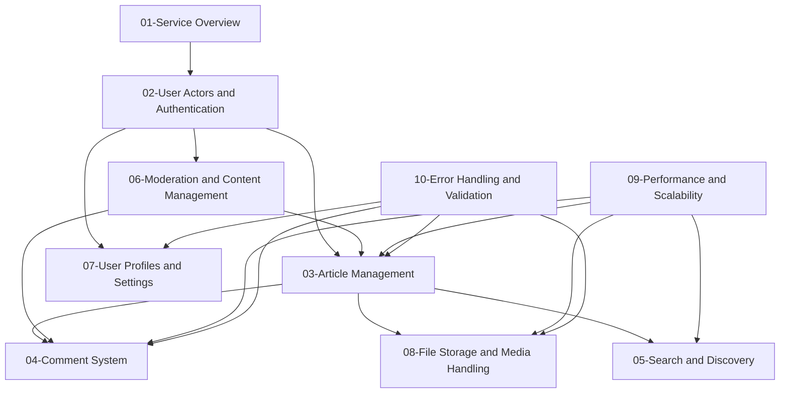

# Table of Contents - Economic/Political Discussion Board Requirements

## Welcome to the Project Documentation

This documentation set defines the complete business requirements for a web-based discussion board focused on economic and political discourse. The platform enables users to publish articles with supporting materials (images and documents), engage in discussions through comments, and discover content through search and categorization.

The documentation follows a waterfall approach, where each document builds upon previous foundations to create a comprehensive specification for backend development. All requirements are written in natural language from a business perspective, giving developers complete autonomy over technical implementation decisions.

## Project Context

**Project Name**: Economic/Political Discussion Board  
**Service Prefix**: `discussion`  
**Primary Goal**: Create a simple, focused platform for substantive discussions on economic and political topics  
**Core Philosophy**: Simplicity over complexity - essential features only, executed excellently

**User Actors**:
- **Guest**: Unauthenticated visitors who can browse and read content
- **Member**: Registered users who can create articles, post comments, and manage their profiles
- **Moderator**: Trusted users with elevated permissions to manage content and enforce community guidelines

## Documentation Structure

This documentation set consists of 10 comprehensive requirement documents, each focusing on a specific aspect of the discussion board system. Together, they provide complete business specifications for backend implementation.

### Core Documents

#### [01 - Service Overview](./01-service-overview.md)
Establishes the foundational vision, business justification, and success criteria for the discussion board platform.

**What You'll Find**:
- Service vision and purpose: Why this platform exists and what problems it solves
- Target audience and user demographics: Who will use this platform
- Core value proposition: What makes this platform valuable to users
- Business model and justification: How the platform sustains itself
- Key differentiators: What sets this platform apart from alternatives
- Success criteria and metrics: How success will be measured

**Why It Matters**: Provides business context for all technical decisions. Understanding the "why" helps developers make informed choices about the "how."

**Who Should Read**: Everyone - this is the foundation for understanding the entire project.

---

#### [02 - User Actors and Authentication](./02-user-actors-and-authentication.md)
Defines all user types, their permissions, and the complete authentication system.

**What You'll Find**:
- User actor definitions: Guest, Member, and Moderator roles with complete capability descriptions
- Permission matrix: Detailed table showing exactly what each user type can and cannot do
- Authentication requirements: JWT-based authentication specifications
- User registration and login flows: Complete business process for user onboarding
- Session management: How user sessions are maintained and secured
- Password management and recovery: Processes for password changes and resets
- Account security requirements: Security measures to protect user accounts

**Why It Matters**: Authentication is the foundation of access control. Every feature in the system depends on correctly identifying and authorizing users.

**Who Should Read**: All developers, especially those implementing authentication, authorization, and user management features.

---

#### [03 - Article Management](./03-article-management.md)
Specifies all requirements for creating, reading, updating, and deleting articles, including attachment handling.

**What You'll Find**:
- Article structure and data model: All fields and properties of an article
- Article creation requirements: Complete workflow for publishing articles
- Image and file attachment requirements: Supported formats, size limits, and validation rules
- Article editing and deletion rules: Who can modify or remove articles and when
- Article visibility and access control: Permission-based article access
- Article listing and pagination: How articles are displayed in lists
- Article categorization and tagging: Organization and discovery features

**Why It Matters**: Articles are the primary content type. This document defines the core functionality of the platform.

**Who Should Read**: All backend developers, particularly those implementing content management and file handling.

---

#### [04 - Comment System](./04-comment-system.md)
Defines how users engage in discussions through comments on articles.

**What You'll Find**:
- Comment creation requirements: How users post comments
- Comment structure and fields: Data model for comments
- Comment threading and nesting: Single-level reply structure
- Comment editing and deletion rules: Ownership and permission rules
- Comment moderation requirements: How moderators manage comments
- Comment listing and ordering: Display and pagination of comments

**Why It Matters**: Comments enable discussion and community engagement, transforming articles from static content into dynamic conversations.

**Who Should Read**: Developers implementing commenting functionality and moderation tools.

---

#### [05 - Search and Discovery](./05-search-and-discovery.md)
Specifies how users find content through search, filtering, and browsing features.

**What You'll Find**:
- Search functionality requirements: Keyword search across articles
- Filtering options: Category, tag, author, and date-based filtering
- Sorting capabilities: Multiple sort orders for content display
- Category and tag browsing: Topic-based content discovery
- Search results display: How results are presented to users
- Performance expectations for search: Response time requirements

**Why It Matters**: Content discovery is essential for user engagement. Users must be able to find relevant discussions easily.

**Who Should Read**: Developers implementing search, filtering, and content discovery features.

---

### Supporting Documents

#### [06 - Moderation and Content Management](./06-moderation-and-content-management.md)
Defines moderation capabilities, content reporting, and administrative functions.

**What You'll Find**:
- Moderator capabilities: Complete list of moderator permissions and tools
- Content reporting system: How users report inappropriate content
- Content review and approval workflows: Moderation processes
- User management for moderators: Account suspension, banning, and warnings
- Moderation action logging: Audit trail requirements
- Community guidelines enforcement: Violation categories and progressive discipline

**Why It Matters**: Maintaining discussion quality requires effective moderation. This document ensures moderators have the tools they need.

**Who Should Read**: Developers implementing moderation features and administrative tools.

---

#### [07 - User Profiles and Settings](./07-user-profiles-and-settings.md)
Specifies user profile information, account settings, and personalization options.

**What You'll Find**:
- User profile information: Required and optional profile fields
- Profile editing capabilities: What users can customize
- Account settings: Password, email, and preference management
- Privacy controls: Visibility settings for profiles and activity
- User activity history: Tracking and displaying user contributions
- Account deletion and data export: GDPR-compliant data management

**Why It Matters**: User profiles establish identity and enable personalization. Privacy controls build user trust.

**Who Should Read**: Developers implementing user management and privacy features.

---

#### [08 - File Storage and Media Handling](./08-file-storage-and-media-handling.md)
Defines requirements for handling file uploads, storage, and delivery of images and documents.

**What You'll Find**:
- File upload requirements: Complete upload workflow
- Supported file types: Images (JPEG, PNG, GIF, WebP) and documents (PDF, DOCX, TXT, etc.)
- File size limits: Individual and total attachment limits
- Image processing requirements: Thumbnail generation and optimization
- File storage and retrieval: Performance and access requirements
- File access control: Permission-based file access
- File deletion and cleanup: Lifecycle management

**Why It Matters**: Supporting evidence through attachments is core to the platform's value proposition for informed discussions.

**Who Should Read**: Developers implementing file upload, storage, and media delivery systems.

---

#### [09 - Performance and Scalability](./09-performance-and-scalability.md)
Specifies performance expectations and scalability requirements from a user experience perspective.

**What You'll Find**:
- Response time expectations: Page load and API response times
- Concurrent user support: Expected user load and peak handling
- Content loading performance: Article and comment display speed
- Search performance requirements: Search response time expectations
- File upload and download performance: Transfer speed requirements
- System availability expectations: Uptime targets and maintenance windows

**Why It Matters**: Performance directly impacts user satisfaction. Clear expectations ensure developers optimize appropriately.

**Who Should Read**: All developers, particularly those responsible for architecture and optimization.

---

#### [10 - Error Handling and Validation](./10-error-handling-and-validation.md)
Defines how the system validates input and handles errors gracefully.

**What You'll Find**:
- Input validation requirements: Validation rules for all user inputs
- Error message standards: Guidelines for clear, helpful error messages
- Common error scenarios: Expected error conditions and handling
- User feedback mechanisms: How errors are communicated to users
- Data validation rules: Field-specific validation requirements
- Error recovery processes: Auto-save, draft recovery, and graceful degradation

**Why It Matters**: Effective error handling prevents data loss and frustration. Good validation ensures data integrity.

**Who Should Read**: All developers - every feature requires validation and error handling.

---

## How to Use This Documentation

### For First-Time Readers

**Start Here**:
1. **Service Overview** (Document 01) - Understand the business context and goals
2. **User Actors and Authentication** (Document 02) - Understand who uses the system and how
3. **Article Management** (Document 03) - Understand the core content functionality

**Then Explore Based on Your Role**:
- **Backend Developers**: Read all documents sequentially for comprehensive understanding
- **Frontend Developers**: Focus on user interaction flows, validation, and error handling
- **Business Stakeholders**: Service Overview, User Actors, and Success Criteria sections
- **Project Managers**: Service Overview and all "Why It Matters" sections

### Recommended Reading Order

**For Backend Implementation**:
1. Service Overview - Business foundation
2. User Actors and Authentication - Access control foundation
3. Article Management - Core feature
4. Comment System - Engagement feature
5. File Storage and Media Handling - Supporting feature
6. User Profiles and Settings - User management
7. Search and Discovery - Content discovery
8. Moderation and Content Management - Quality maintenance
9. Performance and Scalability - Non-functional requirements
10. Error Handling and Validation - Quality assurance

**For Understanding User Journeys**:
1. Service Overview - What users will experience
2. User Actors and Authentication - How users join and access
3. Article Management - How users create and consume content
4. Comment System - How users engage in discussions
5. Search and Discovery - How users find content
6. User Profiles and Settings - How users manage their presence

### Document Relationships

```mermaid
graph TB
    A["01-Service Overview"]
    B["02-User Actors and Authentication"]
    C["03-Article Management"]
    D["04-Comment System"]
    E["05-Search and Discovery"]
    F["06-Moderation and Content Management"]
    G["07-User Profiles and Settings"]
    H["08-File Storage and Media Handling"]
    I["09-Performance and Scalability"]
    J["10-Error Handling and Validation"]
    
    A --> B
    B --> C
    B --> G
    C --> D
    C --> H
    C --> E
    B --> F
    F --> C
    F --> D
    I --> C
    I --> D
    I --> E
    I --> H
    J --> C
    J --> D
    J --> G
    J --> H
```

**Key Relationships**:
- **Service Overview** provides context for all other documents
- **User Actors and Authentication** is referenced by all feature documents
- **Article Management** is central, connecting to comments, files, search, and moderation
- **Performance** and **Error Handling** are cross-cutting concerns affecting all features

### Cross-Document References

Many documents reference each other to avoid duplication. When you see a reference like "[User Actors and Authentication Document](./02-user-actors-and-authentication.md)", it points to related requirements in another document.

**Common Reference Patterns**:
- Permission checks reference User Actors document
- Content features reference Article Management and Comment System
- File operations reference File Storage document
- All features reference Error Handling for validation rules

### Finding Specific Information

**Use Case Examples**:

**"How do users create articles?"**
→ [Article Management](./03-article-management.md) - Article Creation section

**"What can moderators do?"**
→ [User Actors and Authentication](./02-user-actors-and-authentication.md) - Moderator definition  
→ [Moderation and Content Management](./06-moderation-and-content-management.md) - Complete capabilities

**"What file types are supported?"**
→ [File Storage and Media Handling](./08-file-storage-and-media-handling.md) - Supported File Types section

**"How fast should pages load?"**
→ [Performance and Scalability](./09-performance-and-scalability.md) - Response Time Expectations

**"What validation is needed for user input?"**
→ [Error Handling and Validation](./10-error-handling-and-validation.md) - Input Validation Requirements

## Documentation Principles

### Business Requirements, Not Technical Specifications

All documents focus on **WHAT** the system should do from a business and user perspective, not **HOW** to implement it technically.

**You WILL Find**:
- User workflows and scenarios
- Business rules and validation requirements
- Permission and access control rules
- Performance expectations in user-experience terms
- Error scenarios and user feedback requirements

**You WILL NOT Find**:
- Database schemas or table definitions
- API endpoint specifications
- Technology stack recommendations
- Code examples or implementation patterns
- Architecture diagrams

**Developer Autonomy**: Backend developers have complete freedom to choose technologies, design APIs, structure databases, and implement architecture as they see fit, as long as the business requirements are met.

### EARS Format for Requirements

Many requirements use the EARS (Easy Approach to Requirements Syntax) format for clarity and testability:

- **WHEN** [trigger/condition] **THE system SHALL** [required behavior]
- **IF** [condition] **THEN THE system SHALL** [consequence]
- **WHILE** [state] **THE system SHALL** [behavior during that state]
- **WHERE** [feature exists] **THE system SHALL** [requirement for that feature]

**Example**:
- "WHEN a member creates an article, THE system SHALL validate the title is between 5 and 200 characters."

This format makes requirements unambiguous and testable.

### Completeness and Specificity

Requirements are detailed and comprehensive to eliminate ambiguity. Each document includes:
- Complete user workflows
- Specific validation rules
- Error scenarios and handling
- Success criteria
- Business rules and constraints

If something is not specified, developers should make reasonable decisions aligned with the overall simplicity philosophy.

## Project Scope and Constraints

### In Scope
- Article creation, editing, and deletion with rich media attachments
- Comment-based discussions with single-level threading
- User registration, authentication, and profile management
- Category and tag-based content organization
- Keyword search and filtering
- Moderator tools for content management
- File upload and storage for images and documents

### Out of Scope (Explicitly NOT Included)
- Social networking features (followers, friends, direct messaging)
- Real-time chat or instant messaging
- Video or audio content
- Advanced analytics or reporting dashboards
- Multi-language content support (English only initially)
- Mobile native applications (responsive web only)
- Payment processing or monetization features (initially)

### Core Constraints
1. **Simplicity First**: Every feature must justify its existence. When in doubt, leave it out.
2. **Focus on Content**: The platform prioritizes quality discussions over social features.
3. **Performance Matters**: Users expect fast, responsive interactions.
4. **Privacy by Design**: User data protection is non-negotiable.
5. **Moderation Enabled**: Community health requires effective moderation tools.

## Success Criteria

The documentation is successful when:

1. **Developers Can Build Without Ambiguity**: Every business requirement is clear enough to implement without guessing
2. **Stakeholders Can Validate**: Business stakeholders can verify that requirements match their vision
3. **Testers Can Verify**: Requirements are specific enough to create test cases
4. **Users Will Benefit**: The implemented system delivers the intended user experience

## Getting Help

### Understanding Requirements

If requirements seem unclear or contradictory:
1. Check cross-referenced documents for additional context
2. Review related user scenarios and workflows
3. Consider the simplicity principle - the simpler interpretation is usually correct
4. Refer to the Service Overview for business context

### Developer Autonomy

When technical implementation details are not specified:
- Developers have full autonomy to make technical decisions
- Choose technologies and approaches that best serve the business requirements
- Optimize for maintainability, performance, and simplicity
- Document technical decisions for future reference

### Feedback and Improvements

This documentation represents the initial requirements baseline. As development progresses:
- Clarifications may be needed and should be documented
- Edge cases may be discovered and should be addressed
- Improvements may be identified and should be considered for future versions

---

**Developer Note**: This documentation set provides complete business requirements for a simple yet functional discussion board focused on economic and political discourse. The emphasis on simplicity is intentional - this is not a complex social network, but a focused platform for substantive discussions with essential features executed well. Developers have complete technical autonomy to implement these requirements using their expertise and best judgment.