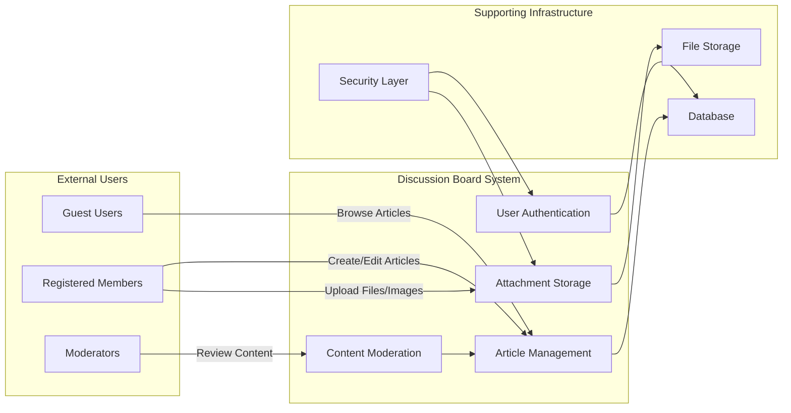

# Service Overview: Economic and Political Discussion Board

## Introduction

This economic and political discussion board service provides a focused platform for substantive conversations about economic and political topics. Users can share articles with image and file attachments to support evidence-based discussions. The platform emphasizes simplicity and accessibility while maintaining the core functionality needed for meaningful discourse.

## Service Vision and Purpose

### Vision Statement

To provide a straightforward, accessible platform for civil discourse on economic and political topics, where users can share well-supported arguments, reference materials, and engage in evidence-based discussions without unnecessary complexity.

### Core Purpose

The discussion board facilitates informed conversations about economics and politics through:

**Enabling Knowledge Sharing**: Members create articles on economic and political topics, supporting their arguments with attached documents, research papers, charts, and images. WHEN a member creates an article, THE system SHALL allow attachment of supporting materials to enhance credibility and provide evidence.

**Promoting Evidence-Based Discussion**: File and image attachments allow users to reference credible sources, data visualizations, and supporting materials. WHEN a user reads an article, THE system SHALL display all attached files and images to provide complete context.

**Building a Focused Community**: By concentrating on economic and political discussions, the platform attracts users with shared interests in these domains. WHEN users browse content, THE system SHALL present articles organized by economic and political topics to maintain focus.

**Maintaining Simplicity**: Unlike feature-bloated platforms, this board prioritizes core functionality over bells and whistles. WHEN users interact with the system, THE interface SHALL present only essential features to minimize complexity.

### Why This Service Needs to Exist

Economic and political discussions on mainstream social media platforms suffer from several critical problems:

**Information Overload**: Too many features distract from substantive discussion. Users seeking serious economic analysis encounter entertainment content, advertisements, and algorithmic recommendations that dilute focus.

**Limited Reference Capability**: Difficulty sharing supporting documents and detailed evidence. Twitter limits attachment types and counts, Reddit relies heavily on external links that break over time, and Facebook compresses images reducing chart readability.

**Lack of Focus**: General-purpose platforms dilute topic-specific communities. Economic discussions appear alongside unrelated content, making it difficult to build concentrated expertise communities.

**Poor Content Organization**: Important discussions get lost in algorithmic feeds designed for engagement rather than substance. Valuable analysis published last week becomes effectively invisible.

This service addresses these issues by providing a purpose-built, minimal platform specifically for economic and political discourse where content organization prioritizes substance over viral engagement.

## Problem Statement

### The Current Landscape Gap

Individuals interested in serious economic and political discussions face significant challenges across existing platforms:

**Problem 1: Fragmented Discussion Environments**

General social media platforms prioritize engagement over depth, measuring success by shares and reactions rather than thoughtful discourse. Academic platforms like ResearchGate or SSRN are too formal and inaccessible for non-academics who want to discuss economic policy without peer review processes. Comment sections on news sites like The Economist or Financial Times lack community features, user profiles, or content organization. Forum software like phpBB or vBulletin is often outdated with 1990s-era interfaces that confuse modern users.

**Problem 2: Inadequate Support for Evidence-Based Arguments**

Twitter/X limits users to 4 images per tweet and 280 characters, making it impossible to share comprehensive economic analysis with supporting data tables, research PDFs, and explanatory charts in a single coherent post. Reddit supports link sharing but not integrated file storage, meaning attached documents disappear when external hosting expires. Facebook groups lack proper content organization, so a well-researched post about monetary policy from three months ago is practically impossible to find again. LinkedIn is professional-focused rather than discussion-focused, discouraging controversial political topics that might affect professional reputation.

**Problem 3: Complexity Barriers**

Many discussion platforms require technical knowledge to set up or use effectively. Discourse requires server management and complex configuration. Medium requires understanding of paywalls and publication settings. Substack focuses on newsletters rather than discussion boards. Feature overload makes simple discussion unnecessarily complicated—platforms add reactions, stories, live streaming, polls, and dozens of other features that overwhelm users who just want to write and discuss economic topics. New users face steep learning curves trying to understand which features are relevant and which can be ignored. Moderation tools are either non-existent (allowing spam and abuse) or overly complex (requiring moderators to learn intricate rule systems and automation tools).

### The Opportunity

There is a clear need for a **simple, focused discussion board** that:

- Allows thoughtful article creation on economic and political topics with sufficient space for comprehensive analysis
- Supports image attachments for charts, graphs, infographics, and screenshots of relevant data
- Supports file attachments for research papers, spreadsheets, policy documents, and reference materials
- Maintains a clean, understandable user experience with intuitive navigation
- Provides basic moderation tools to maintain discussion quality without requiring moderator training
- Remains accessible to non-technical users who have never managed a blog or forum

WHEN users access the platform, THE system SHALL provide these capabilities through straightforward interfaces that require no technical training or prior platform experience.

## Target Audience

### Primary Users

**Economic and Political Enthusiasts**

Individuals interested in discussing economic policy, political theory, and current events form the core user base. Age range primarily spans 25-65 years old, including young professionals interested in policy, mid-career individuals with accumulated expertise, and retired professionals who maintain interest in economic and political developments. Education levels vary from self-educated readers who consume economic news and analysis regularly to academics with formal training in economics, political science, or related fields. Technical proficiency ranges from low to medium—users should not require programming skills, command-line knowledge, or understanding of web hosting to participate effectively.

**Content Creators (Members)**

Users who want to share analysis, opinions, and research on economic and political topics need tools to support arguments with charts, graphs, documents, and images. They value a focused audience interested in substantive discussion rather than viral reach among general audiences. They prefer straightforward content creation tools over complex content management systems—creating an article should be as simple as writing an email with attachments, not as complex as configuring a WordPress site with plugins.

WHEN a member creates content, THE system SHALL provide simple article creation interfaces with clear attachment options, requiring no technical knowledge beyond basic computer file management skills.

**Community Moderators**

Trusted individuals who maintain discussion quality ensure civil discourse and enforce community guidelines. They need effective moderation tools but not highly technical ones—moderators should be able to review content, remove guideline violations, and manage users through clear, obvious interfaces. They value efficiency and clarity in moderation workflows, preferring simple "review, approve/reject, done" processes over complex automation rules or scripting.

WHEN moderators perform moderation tasks, THE system SHALL provide clear content review interfaces with obvious action buttons and confirmation prompts, requiring no moderation system training or technical expertise.

### Secondary Users

**Casual Readers (Guests)**

Visitors who want to browse discussions without registering represent potential future members. They may convert to members if they find valuable content, discover discussions matching their interests, or feel compelled to contribute their own perspectives. They need easy access to read articles and understand discussions without registration walls or forced sign-ups.

WHEN a guest visits the platform, THE system SHALL allow full article reading and attachment viewing without requiring registration, maximizing content accessibility and member conversion potential.

## Core Value Proposition

### For Content Creators (Members)

**Easy Article Publishing**: Create economic and political discussion articles without technical barriers. No need to understand HTML, markdown syntax, or content management systems. WHEN a member wants to publish an article, THE system SHALL provide a simple text editor with basic formatting options requiring only word-processor-level skills.

**Rich Content Support**: Attach images including charts, infographics, screenshots, and graphs to illustrate economic data and political concepts. Attach files including PDFs of research papers, Excel spreadsheets with economic data, Word documents with policy analysis, and other reference materials. WHEN a member uploads attachments, THE system SHALL accept common file formats (JPEG, PNG, GIF, PDF, DOC, DOCX, XLS, XLSX) and store them reliably for long-term access.

**Focused Audience**: Reach readers specifically interested in economic and political topics rather than general social media audiences who may scroll past substantive content. The platform attracts users who choose to visit specifically for economic and political discussion, ensuring your analysis reaches interested readers.

**Content Ownership**: Manage and edit your own articles and contributions. WHEN a member publishes an article, THE system SHALL allow unlimited editing and updating of that article's content and attachments, providing full control over published material.

**Simple Tools**: No learning curve for basic content creation. Creating an article should take minutes to learn, not hours of tutorial-watching.

### For Readers (Guests and Members)

**Quality Content Discovery**: Browse articles on economic and political topics organized clearly by category, recent activity, or simple search. WHEN a reader wants to find content about specific economic topics, THE system SHALL provide straightforward browsing and search interfaces showing relevant articles.

**Evidence-Based Discussions**: Access supporting materials and references attached to articles. WHEN reading an article claiming specific economic data or citing research, THE system SHALL display attached charts, papers, and reference documents directly within the article view.

**Focused Community**: Avoid off-topic noise common on general platforms. Visit knowing that content will be relevant to economic and political interests without wading through unrelated posts.

**Easy Navigation**: Find content without complex search syntax, advanced filtering, or tag management. WHEN a reader browses the platform, THE system SHALL present clear navigation showing article categories and recent discussions without requiring search expertise.

**No Barriers**: Guests can read without registration; members can participate easily. WHEN a guest finds interesting content, THE system SHALL allow full reading access, with registration required only for content creation and participation.

### For Moderators

**Effective Moderation Tools**: Simple but powerful tools to manage content and users. WHEN a moderator reviews flagged content, THE system SHALL provide clear interfaces showing the content, the reason for flagging, and obvious action options (approve, remove, edit).

**Community Quality Control**: Maintain civil, on-topic discussions through content review and user management capabilities. WHEN content violates community guidelines, THE system SHALL allow moderators to remove it and optionally provide explanation to the author.

**Clear Permissions**: Well-defined moderation capabilities without confusion about what moderators can and cannot do. Moderators can review any content, edit or remove guideline violations, and manage user accounts, but cannot access system configuration or database-level controls.

**Activity Transparency**: Track moderation actions and maintain accountability. WHEN moderators take action, THE system SHALL log those actions for administrative review and community transparency.

## Business Model

### Why This Business Exists

The discussion board creates value by solving the specific need for a focused, simple platform for economic and political discussions. Existing platforms either lack focus (general social media), lack accessibility (academic platforms), or lack simplicity (complex forum software). By addressing this gap, the platform provides genuine utility to users interested in substantive economic and political discourse.

WHEN users evaluate discussion platforms, THE platform SHALL offer clear advantages in focus, simplicity, and attachment support compared to mainstream alternatives.

### Value Creation

**User Value Creation:**

**Knowledge Exchange**: Users gain insights from diverse economic and political perspectives. A user interested in monetary policy can read analyses from monetarists, Keynesians, and Austrian school perspectives, each supporting their arguments with attached research and data. WHEN users engage with content, THE system SHALL facilitate exposure to multiple perspectives through clear content organization.

**Community Building**: Like-minded individuals form a community around shared interests. Users interested in trade policy, fiscal policy, political theory, or current political analysis can find others with similar interests. WHEN users participate regularly, THE system SHALL support community formation through consistent user profiles and content authorship attribution.

**Resource Access**: Attached files and images provide valuable reference materials. A discussion of unemployment trends becomes more valuable when the author attaches Bureau of Labor Statistics data, charts showing historical trends, and academic papers analyzing causes. WHEN users access articles, THE system SHALL provide permanent, reliable access to all attached reference materials.

**Intellectual Engagement**: Platform facilitates deeper thinking and evidence-based argumentation. Unlike platforms optimized for quick reactions, this platform encourages thoughtful analysis supported by evidence. WHEN users create content, THE system SHALL provide sufficient space and attachment support to enable comprehensive, well-supported arguments.

**Platform Value Creation:**

**Content Library**: Accumulated articles become a valuable resource repository. Over time, the platform builds a searchable library of economic and political analysis. A new user interested in inflation can find months or years of accumulated discussions with attached research and data.

**Community Network Effects**: More quality contributors attract more engaged readers, who may become contributors themselves. As the community grows, the diversity of perspectives and expertise increases, making the platform more valuable to all participants.

**Niche Positioning**: Focus on economic and political topics creates distinct market position. Unlike general platforms, this board becomes known specifically for economic and political discourse, attracting users specifically interested in these topics.

### Revenue Strategy (Future Considerations)

While the initial version is simple and minimal, potential revenue models could support long-term sustainability:

**Freemium Model:**
- Free tier: Basic article creation with standard attachment limits (e.g., 5 images and 3 files per article, 10MB per file)
- Premium tier: Enhanced attachment storage (e.g., unlimited attachments, 50MB per file), advanced formatting options, and priority support
- Estimated premium conversion: 5-10% of active members based on typical freemium conversion rates

**Community Sponsorship:**
- Organizations interested in economic and political discourse could sponsor the platform, including think tanks (Brookings Institution, Cato Institute, etc.), research institutions, educational organizations, or foundations supporting civic discourse
- Non-intrusive sponsorship maintaining platform independence and editorial freedom
- Sponsorship supports operational costs without affecting user experience

**Advertising (Minimal):**
- Contextual ads related to books, online courses, research publications, and educational content relevant to economics and politics
- Maintained at low volume to preserve user experience (e.g., single sidebar ad, no interstitials or pop-ups)
- Target advertisers: Economic and political content publishers, educational institutions, book publishers

### Growth Strategy

**Phase 1: Foundation (Months 1-6)**

Launch minimal viable platform with core features including user registration, article creation, attachment upload, browsing, and basic moderation. Focus on stability and user experience, ensuring the platform works reliably without bugs or confusing interfaces. Attract initial user base through targeted outreach in existing economic and political communities on Reddit, Twitter, specialized forums, and interest groups.

Goal: 100-500 registered members, 50+ quality articles demonstrating platform value, stable technical performance with minimal downtime.

**Phase 2: Community Building (Months 7-12)**

Encourage active participation and regular content creation through featured content highlighting quality articles, simple user profiles showing contribution history, and community recognition of valuable contributors. Implement basic moderation and community guidelines with clear standards for civil discourse and on-topic content. Improve content discovery and organization based on early user feedback about navigation and search.

Goal: 500-2,000 members, 200+ articles covering diverse economic and political topics, established moderation team of 3-5 trusted community members.

**Phase 3: Optimization (Year 2)**

Refine features based on user feedback collected through surveys, usage analytics, and direct community input. Enhance search and content organization with better categorization, tagging, or filtering. Consider premium features or sustainability model based on community size and operational costs.

Goal: 2,000-10,000 members, active daily discussions with multiple new articles posted each day, sustainable operational model covering hosting and maintenance costs.

### Success Metrics and KPIs

**User Engagement:**

Monthly Active Users (MAU): Target 60% of registered members. WHEN measuring platform success, THE system SHALL track unique users who view articles or create content within a 30-day period, with success defined as at least 60% of registered members remaining active.

Daily Active Users (DAU): Target 20% of registered members. WHEN measuring daily engagement, THE system SHALL track unique users each day, with healthy engagement defined as at least 20% of the member base visiting daily.

Article creation rate: Target 10+ new articles per week. WHEN measuring content creation health, THE platform SHALL track new article publications, with sustainability defined as steady weekly creation of substantive content.

Guest-to-member conversion: Target 5-10%. WHEN guests visit and read content, THE platform SHALL track registration rates, with success defined as converting 5-10% of engaged guest readers into registered members.

**Content Quality:**

Articles with attachments: Target 70%+ include supporting files or images. WHEN measuring evidence-based discussion quality, THE platform SHALL track attachment usage, with success defined as most articles including supporting materials rather than unsupported opinions.

Average article length: Target 500+ words indicating substantive content. WHEN measuring content depth, THE platform SHALL track article word counts, with quality discussions characterized by comprehensive analysis rather than brief statements.

Moderation removal rate: Target <5% indicating quality community. WHEN measuring community health, THE platform SHALL track percentage of articles requiring moderator removal, with healthy community defined by minimal guideline violations.

User-reported content: Low rate indicates healthy community. WHEN users flag content for review, THE platform SHALL track flagging frequency, with healthy community characterized by rare reports of guideline violations.

**Technical Performance:**

Page load time: Target <2 seconds for article browsing. WHEN users access article lists or individual articles, THE system SHALL load and display content within 2 seconds under normal network conditions to ensure good user experience.

File upload success rate: Target >95%. WHEN members upload attachments, THE system SHALL successfully process and store files in at least 95% of attempts, with failures only from invalid files or network interruptions.

System uptime: Target 99%+ availability. WHEN users access the platform at any time, THE system SHALL be available and functional at least 99% of the time, allowing for brief maintenance windows.

User satisfaction: Target 4+ out of 5 rating. WHEN surveying users about platform experience, THE system SHALL achieve average ratings of at least 4 out of 5 for ease of use, usefulness, and overall satisfaction.

## Scope and Boundaries

### What Is Included (In Scope)

**Core Features:**

User registration and authentication supporting three actor types: guests (unauthenticated visitors with read-only access), members (registered users who create content), and moderators (trusted users with content management capabilities).

Article creation with rich text content on economic and political topics. WHEN a member creates an article, THE system SHALL provide text editor supporting basic formatting including bold, italic, headings, paragraphs, and lists without requiring HTML or markdown knowledge.

Image attachment support for JPEG, PNG, and GIF formats. WHEN a member attaches images to an article, THE system SHALL accept these common formats and display them within the article view for all readers.

File attachment support for PDF, DOC, DOCX, XLS, and XLSX formats. WHEN a member attaches files to an article, THE system SHALL accept these common document and spreadsheet formats and provide download links within the article view.

Article browsing and reading for all users including guests. WHEN any user accesses the platform, THE system SHALL display article lists and allow reading full article content without requiring registration.

Basic search and content discovery. WHEN users want to find specific topics, THE system SHALL provide search functionality matching article titles and content with simple keyword queries.

Member profile management. WHEN a member manages their account, THE system SHALL allow updating profile information, changing passwords, and viewing their published articles.

Content moderation tools for moderators. WHEN moderators review content, THE system SHALL provide interfaces to view any article, edit content for guideline compliance, remove violating content, and manage user accounts.

Article editing and deletion by creators. WHEN a member views their own article, THE system SHALL provide edit and delete capabilities, allowing content updates or removal at any time.

Basic categorization or tagging of articles. WHEN members create articles, THE system SHALL allow selecting categories or adding tags to improve content organization and discovery.

**User Capabilities:**

Guests: Browse and read articles, view all attachments, search content, discover discussions without registration barriers.

Members: All guest capabilities plus create articles, edit own articles, delete own articles, upload image attachments, upload file attachments, manage personal profile and account settings.

Moderators: All member capabilities plus review any article, edit any article for guideline compliance, remove any article, delete inappropriate attachments, manage user accounts (suspend, ban, activate), view moderation activity logs.

**Technical Scope:**

Backend API supporting all business requirements with endpoints for authentication, article management, attachment upload, content browsing, search, and moderation. Secure file storage for attachments with access control and file type validation. User authentication and session management supporting login, logout, session persistence, and password security. Database for articles, users, attachments, and moderation logs. Basic security measures including input validation, file type verification, file size limits, and malicious file scanning.

### What Is Excluded (Out of Scope)

**Explicitly Excluded Features:**

Real-time chat or instant messaging: Users communicate through articles only, not real-time conversations. Video attachments or streaming: Platform supports images and documents only, not video hosting. Complex recommendation algorithms: Content discovery uses simple chronological, category, and search approaches without machine learning recommendations. Social features like friends, followers, or private messaging: Platform focuses on public discussions without social networking features. Advanced analytics dashboards: Simple metrics only, not comprehensive analytics or visualization tools. Mobile native applications: Web-first approach with responsive design, no iOS or Android native apps initially. Multi-language support: English-first launch, no internationalization or translation features initially. Integration with external social media platforms: No Facebook login, Twitter sharing, or social media cross-posting. Voting or ranking systems for articles: No upvotes, likes, or algorithmic ranking of content. Commenting threads: Focus is on article-level discussion initially, not nested comment systems. Email newsletters or digests: No automated email sending for content updates or summaries. Advanced text formatting beyond basic rich text: No custom HTML, LaTeX for math equations, or advanced layout tools.

**Complexity Constraints:**

Avoid over-engineering solutions: Choose simpler implementations even if more complex approaches might offer marginal benefits. No features requiring significant technical knowledge to use: Every user-facing feature must be usable by non-technical users without training. No administrative features requiring database access: All administration through web interfaces, not database queries. Keep user interface simple and intuitive: Prefer obvious interfaces over feature-rich but confusing ones. Limit attachment file sizes to reasonable limits: Prevents infrastructure complexity and storage cost explosion (e.g., 10MB per file limit).

### Design Philosophy and Principles

**Principle 1: Simplicity First**

Every feature must justify its existence. WHEN evaluating new feature requests, THE decision process SHALL require clear explanation of how the feature supports core economic and political discussion goals. When in doubt, choose the simpler implementation. If two approaches achieve the same goal, select the one with fewer components, less configuration, and clearer user experience. Prefer clarity over cleverness in all design decisions. Code that is obvious and straightforward is better than code that is technically impressive but hard to understand.

**Principle 2: Focus Over Feature Creep**

Economic and political discussion is the core purpose. Features must directly support this purpose. WHEN considering features, THE evaluation SHALL prioritize how they improve economic and political discussion quality or accessibility. Resist adding "nice to have" features that distract. Features that might be useful but don't directly support the core purpose should be declined even if users request them.

**Principle 3: Accessibility for Non-Technical Users**

No feature should require programming knowledge. WHEN designing user interfaces, THE design SHALL assume users have basic computer skills (email, web browsing, file management) but no technical training. User interfaces should be self-explanatory. WHEN users encounter a feature, THE interface SHALL be immediately understandable without referring to documentation. Error messages should be clear and actionable. WHEN errors occur, THE system SHALL explain what went wrong and how to fix it in plain language.

**Principle 4: Evidence-Based Discussion**

Attachment support is crucial for substantive arguments. WHEN users create content, THE system SHALL prominently feature attachment capabilities to encourage evidence-based discussion. Content should encourage citation and reference. WHEN users read articles, THE system SHALL display attached sources and references clearly to promote evidence evaluation. Quality over quantity in discussions. Platform design prioritizes thoughtful, well-supported content over viral reach or engagement metrics.

**Principle 5: Effective Moderation**

Moderators need simple but powerful tools. WHEN moderators perform moderation tasks, THE system SHALL provide clear, efficient interfaces requiring minimal clicks to review and act on content. Community standards should be enforceable. WHEN guideline violations occur, THE system SHALL provide moderators with tools to address them effectively. Transparency in moderation actions. WHEN moderators remove content or manage users, THE system SHALL log actions for administrative review and community accountability.

## System Context and Boundaries

## User Actor Overview

The system supports three distinct user actor types, each with specific permissions and capabilities:

### Guest (Unauthenticated Visitor)

**Primary Role**: Browse and consume content without registration

**Capabilities**:

View article lists and individual articles. WHEN a guest accesses the platform, THE system SHALL display all public articles with full content visible without login walls.

See all public discussions and content. WHEN a guest browses, THE system SHALL show the same article content visible to members, ensuring guests can fully evaluate platform value before registering.

Access and download public attachments. WHEN a guest views an article with attached files or images, THE system SHALL allow viewing images inline and downloading attached files without authentication.

Search and discover content. WHEN a guest wants to find specific topics, THE system SHALL provide full search functionality identical to member search capabilities.

**Restrictions**:

Cannot create articles or upload attachments. WHEN a guest attempts to create content, THE system SHALL prompt for registration and login. Cannot edit or delete any content. WHEN a guest views articles, THE system SHALL not display edit or delete controls. Cannot access member-specific features. WHEN a guest accesses the platform, THE system SHALL provide read-only access throughout. Read-only access throughout the system.

### Member (Registered User)

**Primary Role**: Active participant who creates and shares content

**Capabilities**:

All guest capabilities. WHEN a member uses the platform, THE system SHALL provide full reading and browsing access identical to guest capabilities.

Create articles on economic and political topics. WHEN a member wants to publish content, THE system SHALL provide article creation interface with text editor and attachment upload options.

Upload image attachments to articles in JPEG, PNG, and GIF formats. WHEN a member creates or edits an article, THE system SHALL accept image uploads in these formats up to configured size limits.

Upload file attachments to articles in PDF, DOC, DOCX, XLS, and XLSX formats. WHEN a member creates or edits an article, THE system SHALL accept document uploads in these formats up to configured size limits.

Edit and update own articles. WHEN a member views their own published article, THE system SHALL provide edit functionality allowing content and attachment changes.

Delete own articles. WHEN a member views their own published article, THE system SHALL provide delete functionality with confirmation prompt.

Manage personal profile and account settings. WHEN a member accesses account settings, THE system SHALL allow updating profile information, changing password, and managing account preferences.

**Restrictions**:

Cannot edit or delete articles created by other members. WHEN a member views another member's article, THE system SHALL not display edit or delete controls. Cannot access moderation functions. WHEN a member uses the platform, THE system SHALL not provide access to moderation interfaces or capabilities. Cannot manage other users' accounts. WHEN a member accesses account settings, THE system SHALL only allow managing their own account.

### Moderator (Community Administrator)

**Primary Role**: Maintain content quality and enforce community standards

**Capabilities**:

All member capabilities. WHEN a moderator uses the platform, THE system SHALL provide full article creation and management capabilities identical to regular members.

Review any article in the system. WHEN a moderator accesses any article, THE system SHALL provide moderation interface showing content details and action options.

Edit any article for quality or guideline compliance. WHEN a moderator finds content requiring modification, THE system SHALL allow editing any article's content to enforce guidelines.

Delete any article that violates community standards. WHEN a moderator determines content violates guidelines, THE system SHALL allow removing the article with optional explanation to author.

Remove inappropriate attachments. WHEN a moderator finds policy-violating attachments, THE system SHALL allow deleting specific attachments without removing entire articles.

Manage user accounts. WHEN a moderator reviews user behavior, THE system SHALL provide capabilities to suspend, ban, or reactivate user accounts.

Access moderation activity logs. WHEN a moderator or administrator reviews moderation actions, THE system SHALL provide logs showing what actions were taken, by whom, and when.

Enforce community guidelines across all content. WHEN moderators maintain community standards, THE system SHALL provide tools to review flagged content, proactively review recent posts, and take appropriate actions.

**Restrictions**:

Cannot access system-level configuration. WHEN moderators manage content, THE system SHALL not provide access to server settings, database configuration, or infrastructure controls. Cannot modify database directly. WHEN moderators perform actions, THE system SHALL enforce all actions through web interfaces with proper validation and logging. Must follow documented moderation policies. WHEN moderators take action, THE policies SHALL guide decisions ensuring consistent, fair enforcement.

## Success Criteria

### Platform Success Indicators

The discussion board will be considered successful when it achieves the following measurable outcomes:

**User Adoption**: At least 500 registered members within the first year. WHEN measuring first-year success, THE platform SHALL track total member registrations, with target of 500+ indicating sufficient market fit and value proposition.

**Content Quality**: 70% or more articles include supporting attachments (images or files). WHEN measuring content quality, THE platform SHALL track attachment usage, with 70%+ attachment rate indicating users embrace evidence-based discussion approach.

**Engagement**: 60% of members remain active monthly. WHEN measuring community health, THE platform SHALL track monthly active users as percentage of total members, with 60%+ indicating strong engagement and value delivery.

**Community Health**: Less than 5% of content requires moderator removal. WHEN measuring community standards compliance, THE platform SHALL track moderation removal rate, with <5% indicating healthy community that self-regulates effectively.

**Technical Performance**: Page loads complete within 2 seconds for browsing. WHEN measuring user experience, THE platform SHALL track page load times, with <2 second average indicating acceptable technical performance.

**User Satisfaction**: Positive feedback from members on simplicity and usability. WHEN surveying users, THE platform SHALL achieve majority positive feedback regarding ease of use and value delivered.

### Business Success Criteria

**Value Creation Indicators:**

Platform becomes a recognized resource for economic and political discussion. WHEN users search for economic or political topics, THE platform SHALL appear in results and gain recognition in relevant communities. Community develops self-sustaining engagement with members returning regularly without external prompting. Content library grows to 200+ substantive articles covering diverse economic and political topics. Moderation team effectively maintains discussion quality with clear guidelines and consistent enforcement. Platform operates within reasonable infrastructure costs that can be sustained through freemium model or sponsorship.

**Sustainability Indicators:**

Clear path to covering operational costs if monetization pursued, with freemium conversion rates or sponsorship interest sufficient for sustainability. Active moderator participation maintaining community health without requiring paid moderation staff. Steady new member registration indicating organic growth through word-of-mouth and content discovery. Low support burden due to simple, intuitive design requiring minimal user assistance.

## Next Steps and Related Documentation

This service overview provides the foundational context for the discussion board. The following documents provide detailed specifications:

- **User Actors and Authentication**: Complete authentication system and actor permissions
- **Core Features**: Essential features for browsing, creating, and discovering content
- **Article Management**: Detailed article creation, editing, and lifecycle requirements
- **Attachments**: Image and file upload specifications
- **Content Moderation**: Moderation capabilities and community management
- **User Workflows**: Step-by-step user journeys and interaction flows
- **Business Rules**: Validation rules and operational constraints
- **Performance and Security**: Non-functional requirements
- **Success Metrics**: Detailed measurement and monitoring criteria

## Conclusion

The economic and political discussion board is designed to be a simple, focused platform that solves a specific problem: providing a straightforward space for evidence-based discussions on economic and political topics. By maintaining simplicity, supporting attachment uploads, and focusing on core functionality, the service delivers value to users interested in substantive discourse without the complexity and distractions of mainstream platforms.

The key to success lies in maintaining this simplicity while ensuring quality discussions through effective moderation and community guidelines. This overview establishes the foundation for all subsequent technical and business requirements, ensuring that every feature and decision aligns with the core mission of facilitating focused, evidence-supported economic and political discussions. WHEN the platform launches and grows, THE system SHALL maintain these core principles of simplicity, focus, and evidence-based discourse to deliver sustained value to the economic and political discussion community.