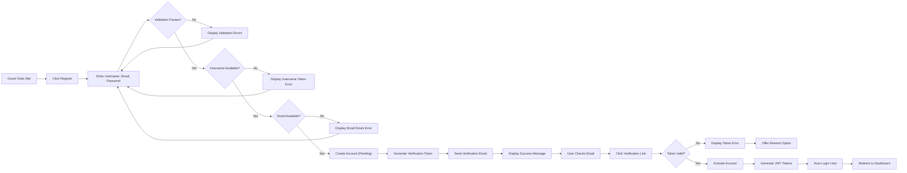
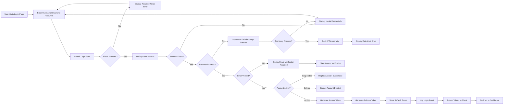
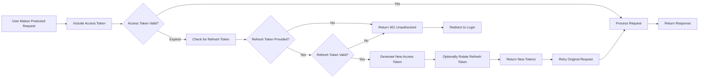
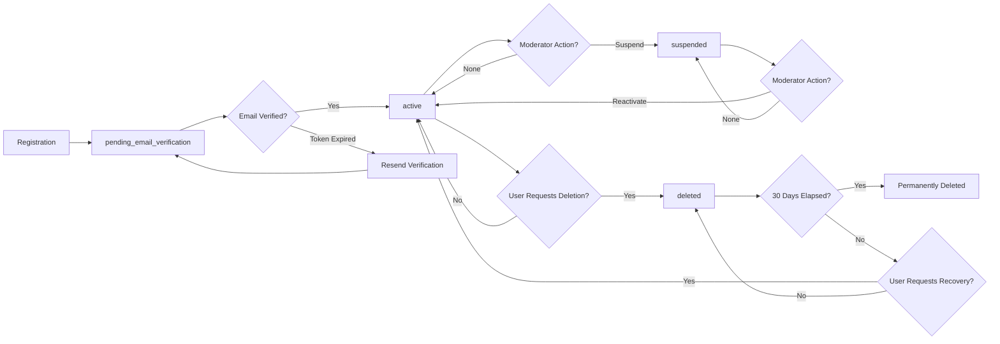

# User Actors and Authentication

## Introduction

This document defines the user actors, their permissions, and authentication requirements for the economic/political discussion board system. It establishes who can access the system, what actions each user type can perform, and how users authenticate and manage their accounts.

The discussion board supports three distinct user actors: Guests (unauthenticated visitors), Members (registered users), and Moderators (administrative users). Each actor has specific capabilities aligned with their role in maintaining a quality discussion environment.

## User Actor Definitions

### Guest

**Definition**: Unauthenticated visitors who access the discussion board without logging in.

**Primary Capabilities**:
- Browse and read all public articles
- Read all comments on articles
- View article categories and tags
- Search for articles and content
- View user profiles (public information only)
- Access registration and login pages

**Restrictions**:
- Cannot create articles or comments
- Cannot vote, like, or interact with content
- Cannot access user settings or preferences
- Cannot upload files or images
- Cannot report content or flag inappropriate posts
- Cannot edit or delete any content

**Business Purpose**: Guests allow the discussion board to reach a wider audience, enabling content discovery without registration barriers. This increases visibility of discussions and encourages new user registration when visitors want to participate.

### Member

**Definition**: Registered and authenticated users who have completed account creation and email verification.

**Primary Capabilities**:
- All Guest capabilities, plus:
- Create new articles with titles, content, categories, and tags
- Attach images and files to articles (up to configured limits)
- Edit their own articles within allowed timeframes
- Delete their own articles
- Post comments on any article
- Edit their own comments within allowed timeframes
- Delete their own comments
- Manage their user profile information
- Change account settings and preferences
- Change their password
- View their own activity history
- Report inappropriate content to moderators
- Log out and end their session

**Restrictions**:
- Cannot edit or delete other users' articles or comments
- Cannot access moderator functions
- Cannot manage other user accounts
- Cannot bypass content validation rules
- Cannot delete their account without following proper deletion workflow

**Business Purpose**: Members are the core participants who create and engage with content. They drive discussions, contribute diverse perspectives on economic and political topics, and build the community through active participation.

### Moderator

**Definition**: Trusted users with elevated administrative permissions who maintain discussion quality and enforce community guidelines.

**Primary Capabilities**:
- All Member capabilities, plus:
- Edit any article regardless of author
- Delete any article across the entire platform
- Edit any comment regardless of author
- Delete any comment across the entire platform
- Review reported content and take action
- Suspend or ban user accounts
- Reactivate suspended accounts
- View complete moderation activity logs
- Access moderation dashboard and tools
- Manage article categories and tags system-wide
- Pin important articles to featured positions
- Lock articles to prevent further comments
- Bulk delete spam or inappropriate content
- View detailed user activity reports
- Force password resets for compromised accounts

**Restrictions**:
- Cannot permanently delete user accounts (users must self-delete)
- Cannot access or change other users' passwords
- Cannot modify system configuration settings
- Cannot grant or revoke moderator privileges (requires system administrator)

**Business Purpose**: Moderators ensure the discussion board remains a constructive space for economic and political discourse. They enforce community guidelines, remove harmful content, and maintain the quality standards that make the platform valuable for serious discussions.

## Permission Matrix

The following table defines exactly what each user actor can and cannot do across all system features:

| Action / Feature | Guest | Member | Moderator |
|-----------------|-------|---------|-----------|
| **Article Management** |
| Browse article list | ✅ | ✅ | ✅ |
| Read article content | ✅ | ✅ | ✅ |
| Search articles | ✅ | ✅ | ✅ |
| Create new article | ❌ | ✅ | ✅ |
| Edit own article | ❌ | ✅ | ✅ |
| Edit any article | ❌ | ❌ | ✅ |
| Delete own article | ❌ | ✅ | ✅ |
| Delete any article | ❌ | ❌ | ✅ |
| Attach images to article | ❌ | ✅ | ✅ |
| Attach files to article | ❌ | ✅ | ✅ |
| Pin article | ❌ | ❌ | ✅ |
| Lock article | ❌ | ❌ | ✅ |
| **Comment Management** |
| Read comments | ✅ | ✅ | ✅ |
| Post comment | ❌ | ✅ | ✅ |
| Edit own comment | ❌ | ✅ | ✅ |
| Edit any comment | ❌ | ❌ | ✅ |
| Delete own comment | ❌ | ✅ | ✅ |
| Delete any comment | ❌ | ❌ | ✅ |
| **Content Organization** |
| View categories | ✅ | ✅ | ✅ |
| View tags | ✅ | ✅ | ✅ |
| Apply tags to own article | ❌ | ✅ | ✅ |
| Manage category system | ❌ | ❌ | ✅ |
| **User Management** |
| Register new account | ✅ | ❌ | ❌ |
| Login | ✅ | ✅ | ✅ |
| Logout | N/A | ✅ | ✅ |
| View own profile | N/A | ✅ | ✅ |
| Edit own profile | ❌ | ✅ | ✅ |
| View other user profiles | ✅ | ✅ | ✅ |
| Change own password | ❌ | ✅ | ✅ |
| Reset forgotten password | ✅ | ✅ | ✅ |
| Delete own account | ❌ | ✅ | ✅ |
| Suspend user accounts | ❌ | ❌ | ✅ |
| View user activity reports | ❌ | Own only | All users |
| **Moderation** |
| Report content | ❌ | ✅ | ✅ |
| Review reported content | ❌ | ❌ | ✅ |
| Access moderation dashboard | ❌ | ❌ | ✅ |
| View moderation logs | ❌ | ❌ | ✅ |
| Take moderation actions | ❌ | ❌ | ✅ |
| **File Access** |
| View uploaded images | ✅ | ✅ | ✅ |
| Download attached files | ✅ | ✅ | ✅ |
| Upload files | ❌ | ✅ | ✅ |
| Delete uploaded files | ❌ | Own only | Any file |

## Authentication Requirements

### Core Authentication Principles

THE system SHALL use JWT (JSON Web Tokens) for all user authentication and session management.

WHEN a user successfully authenticates, THE system SHALL issue two tokens: an access token and a refresh token.

THE access token SHALL expire after 30 minutes of issuance.

THE refresh token SHALL expire after 30 days of issuance.

THE system SHALL store refresh tokens securely and associate them with specific user sessions.

WHEN an access token expires, THE system SHALL allow users to obtain a new access token using a valid refresh token without re-entering credentials.

WHEN a refresh token expires or is invalidated, THE system SHALL require full re-authentication with username and password.

### JWT Payload Structure

THE access token JWT payload SHALL include the following claims:
- User ID (unique identifier)
- User role (guest, member, moderator)
- Username
- Email verification status
- Token issuance timestamp
- Token expiration timestamp

THE refresh token JWT payload SHALL include the following claims:
- User ID
- Token family ID (for token rotation security)
- Token issuance timestamp
- Token expiration timestamp

### Token Storage and Security

THE system SHALL sign all JWT tokens with a secure secret key stored in environment configuration.

THE system SHALL use HS256 (HMAC with SHA-256) algorithm for JWT signing at minimum.

WHEN a user logs out, THE system SHALL invalidate the user's current refresh token to prevent reuse.

WHEN suspicious activity is detected on an account, THE system SHALL invalidate all active refresh tokens for that user, requiring fresh authentication.

THE system SHALL never expose the JWT secret key in client-side code or API responses.

## User Registration Flow

### Registration Process

WHEN a new visitor chooses to register, THE system SHALL display a registration form requesting the following information:
- Username (3-50 characters, alphanumeric and underscores only)
- Email address (valid email format)
- Password (minimum 8 characters, must contain at least one uppercase letter, one lowercase letter, one number, and one special character)
- Password confirmation (must match password exactly)

WHEN a user submits the registration form, THE system SHALL validate all input fields according to the specified rules.

IF any validation fails, THEN THE system SHALL display specific error messages indicating which fields have issues and what corrections are needed.

WHEN all validation passes, THE system SHALL check if the username or email already exists in the system.

IF the username already exists, THEN THE system SHALL reject registration and display message "Username is already taken. Please choose a different username."

IF the email already exists, THEN THE system SHALL reject registration and display message "An account with this email already exists. Please login or use password recovery."

WHEN username and email are both available, THE system SHALL create a new user account with status "pending_email_verification".

WHEN the account is created, THE system SHALL generate a unique email verification token with 24-hour expiration.

WHEN the verification token is generated, THE system SHALL send an email to the user's registered email address containing a verification link.

THE verification email SHALL include:
- Welcome message
- Link to verify email (containing the verification token)
- Expiration notice (24 hours)
- Instructions if link doesn't work

WHEN the user clicks the verification link, THE system SHALL validate the token and mark the email as verified.

WHEN email verification succeeds, THE system SHALL change account status from "pending_email_verification" to "active".

WHEN email verification succeeds, THE system SHALL automatically log the user in by issuing JWT tokens.

IF the verification token is expired, THEN THE system SHALL display an error message and offer to resend a new verification email.

IF the user doesn't verify email within 24 hours, THEN THE system SHALL allow the user to request a new verification email from the login page.

### Registration Validation Rules

THE username SHALL be unique across all user accounts.

THE username SHALL contain only alphanumeric characters (A-Z, a-z, 0-9) and underscores (_).

THE username SHALL be between 3 and 50 characters in length.

THE email address SHALL be unique across all user accounts.

THE email address SHALL match standard email format validation (contains @ symbol, valid domain structure).

THE password SHALL be at least 8 characters long.

THE password SHALL contain at least one uppercase letter (A-Z).

THE password SHALL contain at least one lowercase letter (a-z).

THE password SHALL contain at least one number (0-9).

THE password SHALL contain at least one special character (e.g., !@#$%^&*).

THE password confirmation field SHALL exactly match the password field.

## User Login Flow

### Login Process

WHEN a user accesses the login page, THE system SHALL display a login form requesting username or email and password.

WHEN a user submits login credentials, THE system SHALL validate that both fields are provided.

IF either field is empty, THEN THE system SHALL display message "Please enter both username/email and password."

WHEN both fields are provided, THE system SHALL look up the user account by username or email.

IF no account matches the provided username or email, THEN THE system SHALL display message "Invalid username/email or password" without revealing which part was incorrect.

WHEN a matching account is found, THE system SHALL verify the provided password against the stored password hash.

IF the password is incorrect, THEN THE system SHALL display message "Invalid username/email or password" without revealing which part was incorrect.

IF the password is correct but the email is not verified, THEN THE system SHALL display message "Please verify your email address before logging in. Check your inbox for the verification link or request a new one."

IF the password is correct but the account is suspended, THEN THE system SHALL display message "Your account has been suspended. Please contact support for assistance."

WHEN login credentials are valid and email is verified and account is active, THE system SHALL generate a new access token and refresh token.

WHEN tokens are generated, THE system SHALL return both tokens to the client.

WHEN tokens are successfully returned, THE system SHALL log the user activity including login timestamp and IP address for security purposes.

THE system SHALL respond to successful login within 2 seconds under normal load conditions.

### Failed Login Handling

WHEN a user enters incorrect credentials, THE system SHALL not reveal whether the username/email exists or the password was wrong.

THE system SHALL use identical error messages for non-existent users and incorrect passwords to prevent username enumeration attacks.

WHEN a user fails to login 5 times within 15 minutes from the same IP address, THE system SHALL temporarily block login attempts from that IP for 30 minutes.

WHEN login is temporarily blocked, THE system SHALL display message "Too many failed login attempts. Please try again in 30 minutes or use password recovery."

THE system SHALL track failed login attempts per account and per IP address separately for security monitoring.

## Session Management

### Active Session Handling

WHEN a user is logged in, THE system SHALL maintain the user's session using the access token.

THE system SHALL validate the access token on every request to protected resources.

WHEN the access token is valid, THE system SHALL extract user identity and permissions from the token claims.

WHEN the access token is expired but the user has a valid refresh token, THE system SHALL allow the user to obtain a new access token.

THE refresh token mechanism SHALL work transparently without requiring user interaction.

WHEN a refresh token is used to obtain a new access token, THE system SHALL optionally rotate the refresh token for enhanced security.

### Session Expiration

THE access token SHALL expire 30 minutes after issuance.

THE refresh token SHALL expire 30 days after issuance.

WHEN a user's refresh token expires, THE system SHALL require the user to log in again with username and password.

THE system SHALL display message "Your session has expired. Please log in again." when refresh token expiration requires re-authentication.

### Multiple Device Sessions

THE system SHALL allow users to be logged in from multiple devices simultaneously.

THE system SHALL maintain separate refresh tokens for each device/browser session.

WHEN a user logs out from one device, THE system SHALL only invalidate the refresh token for that specific device.

WHEN a user changes their password, THE system SHALL invalidate all refresh tokens across all devices, requiring fresh login everywhere.

### Logout Process

WHEN a user clicks logout, THE system SHALL invalidate the current refresh token.

WHEN logout completes, THE system SHALL clear the access token and refresh token from client storage.

WHEN logout completes, THE system SHALL redirect the user to the homepage or login page.

THE system SHALL respond to logout requests within 1 second.

## Password Management

### Password Requirements

THE system SHALL enforce password complexity rules during registration and password changes.

Passwords SHALL meet the following requirements:
- Minimum 8 characters in length
- Maximum 128 characters in length
- At least one uppercase letter (A-Z)
- At least one lowercase letter (a-z)
- At least one digit (0-9)
- At least one special character from the set: !@#$%^&*()_+-=[]{}|;:,.<>?

THE system SHALL store passwords using secure one-way hashing with salt (never store plaintext passwords).

### Change Password Process

WHEN a logged-in user wants to change their password, THE system SHALL display a change password form requesting:
- Current password
- New password
- New password confirmation

WHEN the user submits the change password form, THE system SHALL validate the current password matches the user's stored password.

IF the current password is incorrect, THEN THE system SHALL display message "Current password is incorrect."

WHEN the current password is correct, THE system SHALL validate the new password meets all complexity requirements.

IF the new password fails complexity requirements, THEN THE system SHALL display specific messages indicating which requirements are not met.

WHEN the new password meets all requirements, THE system SHALL update the user's password hash.

WHEN the password is successfully changed, THE system SHALL invalidate all existing refresh tokens for the user.

WHEN refresh tokens are invalidated, THE system SHALL issue a new refresh token for the current session.

WHEN password change completes, THE system SHALL send a confirmation email to the user's registered email address.

THE confirmation email SHALL inform the user that their password was changed and provide instructions if the change was unauthorized.

### Forgot Password Process

WHEN a user clicks "Forgot Password" from the login page, THE system SHALL display a password recovery form requesting the user's email address.

WHEN the user submits an email address, THE system SHALL validate the email format.

WHEN the email format is valid, THE system SHALL check if an account exists with that email address.

IF no account exists with the email, THE system SHALL still display success message "If an account exists with this email, you will receive password reset instructions" to prevent email enumeration.

WHEN an account exists with the provided email, THE system SHALL generate a unique password reset token with 1-hour expiration.

WHEN the reset token is generated, THE system SHALL send an email to the user containing a password reset link.

THE password reset email SHALL include:
- Link to reset password (containing the reset token)
- Expiration notice (1 hour)
- Security notice that if user didn't request this, they can ignore the email
- Instructions if link doesn't work

WHEN the user clicks the password reset link, THE system SHALL validate the token.

IF the token is expired or invalid, THEN THE system SHALL display message "This password reset link has expired or is invalid. Please request a new one."

WHEN the token is valid, THE system SHALL display a form requesting:
- New password
- New password confirmation

WHEN the user submits the new password, THE system SHALL validate it meets all complexity requirements.

WHEN the new password is valid, THE system SHALL update the user's password hash.

WHEN the password is reset successfully, THE system SHALL invalidate all existing refresh tokens for the user.

WHEN password reset completes, THE system SHALL send a confirmation email to the user.

WHEN password reset completes, THE system SHALL redirect user to login page with message "Your password has been reset successfully. Please log in with your new password."

THE password reset link SHALL be single-use and invalidated immediately after successful password reset.

### Password Security Measures

THE system SHALL never display passwords in plain text at any point.

THE system SHALL never send passwords via email.

THE system SHALL use secure password hashing algorithms (bcrypt, Argon2, or PBKDF2 with appropriate work factors).

WHEN a password reset is requested, THE system SHALL send reset instructions only to the email address on file, never to a different email.

THE system SHALL log all password change and reset activities for security auditing.

## Account Security Requirements

### Email Verification

THE system SHALL require email verification before users can fully access member privileges.

WHEN a new account is created, THE system SHALL set account status to "pending_email_verification".

WHILE account status is "pending_email_verification", THE system SHALL prevent the user from logging in.

WHEN a user attempts to login with an unverified email, THE system SHALL display message "Please verify your email address. Check your inbox for the verification link."

THE system SHALL provide an option to resend the verification email from the login page.

WHEN a user requests to resend verification email, THE system SHALL generate a new verification token and send a new email.

THE system SHALL limit verification email resend requests to once every 5 minutes per email address to prevent abuse.

### Account Activation States

User accounts SHALL exist in one of the following states:
- **pending_email_verification**: New account awaiting email confirmation
- **active**: Verified account in good standing, full access to member features
- **suspended**: Account temporarily disabled by moderator action
- **deleted**: Account marked for deletion, pending cleanup period

WHILE account status is "pending_email_verification", THE system SHALL deny login attempts.

WHILE account status is "active", THE system SHALL grant full member permissions.

WHILE account status is "suspended", THE system SHALL deny login and display message "Your account has been suspended. Contact support for assistance."

WHILE account status is "deleted", THE system SHALL deny login and display message "This account has been deleted."

### Security Event Logging

THE system SHALL log the following security events for each user:
- Registration timestamp and IP address
- Email verification timestamp
- Login successes and failures with timestamps and IP addresses
- Password change events with timestamps
- Password reset requests with timestamps and IP addresses
- Logout events with timestamps
- Account suspension/reactivation events with moderator ID and timestamps

THE system SHALL retain security logs for at least 90 days for security auditing and investigation.

WHEN suspicious activity is detected (e.g., multiple failed logins, login from unusual location), THE system SHALL optionally send a security alert email to the user.

### Two-Factor Authentication (Future Consideration)

WHILE two-factor authentication is not required in the initial simple implementation, THE system architecture SHOULD accommodate future addition of 2FA without major restructuring.

## Account State Management

### Account Creation

WHEN a new user completes registration, THE system SHALL create account with status "pending_email_verification".

THE system SHALL assign user role "member" to all newly registered accounts.

THE system SHALL store the following core account information:
- Unique user ID (generated by system)
- Username (user-provided)
- Email address (user-provided)
- Password hash (derived from user password)
- Account status (initially "pending_email_verification")
- User role (initially "member")
- Registration timestamp
- Email verification status (initially false)
- Email verification token (generated for verification)
- Token expiration timestamp

### Email Verification State Transition

WHEN a user successfully verifies their email, THE system SHALL transition account status from "pending_email_verification" to "active".

WHEN account becomes "active", THE system SHALL set email verification status to true.

WHEN account becomes "active", THE system SHALL delete or nullify the email verification token.

### Account Suspension

WHEN a moderator suspends a user account, THE system SHALL transition account status from "active" to "suspended".

WHEN account is suspended, THE system SHALL record the moderator ID who performed the suspension.

WHEN account is suspended, THE system SHALL record the suspension timestamp.

WHEN account is suspended, THE system SHALL optionally record a suspension reason.

WHEN account is suspended, THE system SHALL invalidate all active refresh tokens for that user.

WHEN a suspended user attempts to login, THE system SHALL deny access and display suspension message.

### Account Reactivation

WHEN a moderator reactivates a suspended account, THE system SHALL transition account status from "suspended" to "active".

WHEN account is reactivated, THE system SHALL record the moderator ID who performed the reactivation.

WHEN account is reactivated, THE system SHALL record the reactivation timestamp.

WHEN account is reactivated, THE system SHALL allow the user to login normally.

### Account Deletion

WHEN a member requests account deletion, THE system SHALL transition account status to "deleted".

WHEN account status becomes "deleted", THE system SHALL invalidate all refresh tokens.

WHEN account status becomes "deleted", THE system SHALL prevent any future logins.

THE system SHALL retain "deleted" accounts for 30 days before permanent deletion to allow recovery if requested.

WHEN 30 days pass after account deletion, THE system SHALL permanently remove all user personal data.

WHEN permanent deletion occurs, THE system SHALL optionally anonymize the user's articles and comments rather than deleting them, changing author to "Deleted User".

### Role Changes

WHEN a system administrator grants moderator privileges to a member, THE system SHALL change user role from "member" to "moderator".

WHEN role changes to "moderator", THE system SHALL update the user's JWT claims on next token refresh.

WHEN a moderator is demoted, THE system SHALL change user role from "moderator" to "member".

WHEN role is downgraded, THE system SHALL invalidate all existing refresh tokens to force re-authentication with updated permissions.

## Security Best Practices Summary

THE system authentication SHALL implement the following security measures:
- Secure password hashing with salt
- JWT token-based stateless authentication
- Short-lived access tokens (30 minutes)
- Longer-lived refresh tokens (30 days) with rotation capability
- Protection against brute force attacks through rate limiting
- Email verification before account activation
- Secure password reset process with time-limited tokens
- Single-use password reset links
- Comprehensive security event logging
- Protection against username enumeration
- Identical error messages for non-existent users and incorrect passwords
- Session invalidation on password change
- Token invalidation on account suspension

THE system SHALL respond to authentication requests with appropriate timing:
- Login: within 2 seconds
- Registration: within 3 seconds
- Password reset email: within 5 seconds
- Token refresh: within 1 second
- Logout: within 1 second

These response times ensure a smooth user experience while maintaining security integrity.

## Authentication Workflows

### Complete User Registration Workflow

### Complete User Login Workflow

### Password Reset Workflow

```mermaid
graph LR
    A["User Clicks Forgot Password"] --> B["Enter Email Address"]
    B --> C["Submit Reset Request"]
    C --> D{"Email Format Valid?"}
    D -->|"No"| E["Display Email Format Error"]
    E --> B
    D -->|"Yes"| F["Lookup Account by Email"]
    F --> G{"Account Exists?"}
    G -->|"No"| H["Display Generic Success Message"]
    G -->|"Yes"| I["Generate Reset Token"]
    I --> J["Send Password Reset Email"]
    J --> H
    H --> K["User Checks Email"]
    K --> L["Click Reset Link"]
    L --> M{"Token Valid?"}
    M -->|"No"| N["Display Token Invalid/Expired"]
    N --> O["Offer New Reset Request"]
    M -->|"Yes"| P["Display New Password Form"]
    P --> Q["Enter New Password"]
    Q --> R["Submit New Password"]
    R --> S{"Password Meets Requirements?"}
    S -->|"No"| T["Display Password Requirements"]
    T --> Q
    S -->|"Yes"| U["Update Password Hash"]
    U --> V["Invalidate All Refresh Tokens"]
    V --> W["Invalidate Reset Token"]
    W --> X["Send Confirmation Email"]
    X --> Y["Display Success Message"]
    Y --> Z["Redirect to Login"]
```

### Session Token Refresh Workflow

### Account State Transition Workflow

---

This document establishes the complete authentication framework for the discussion board. All user interactions with the system must respect these actor definitions and authentication requirements to maintain security and proper access control.