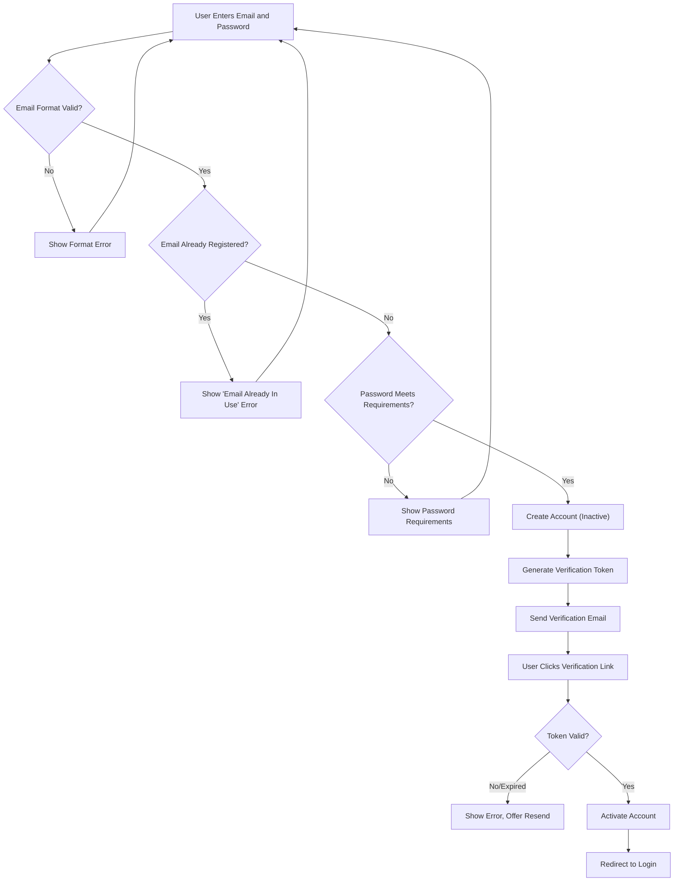
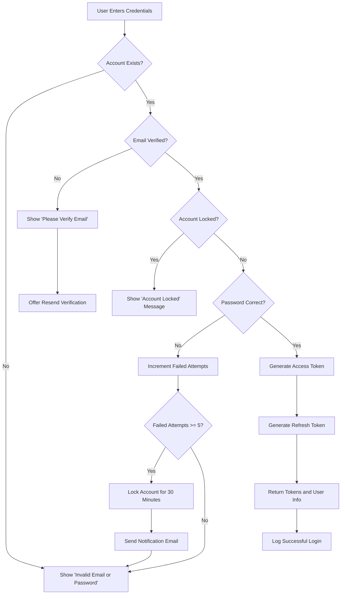
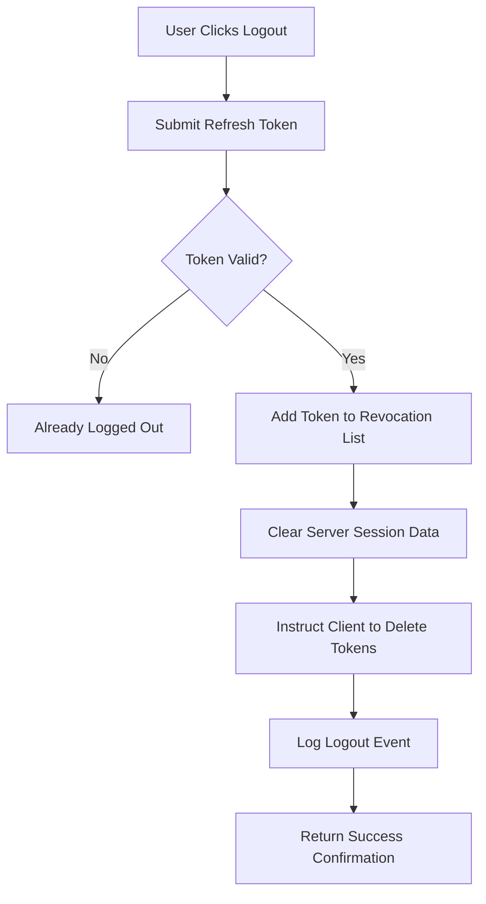
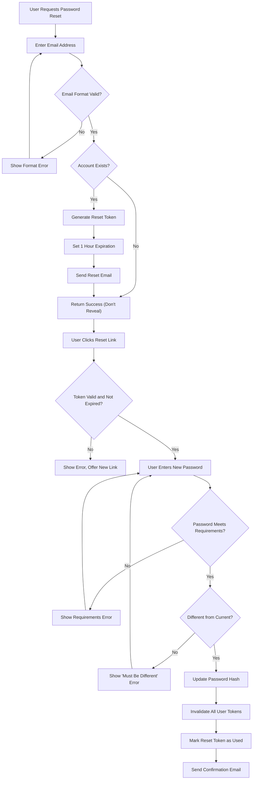
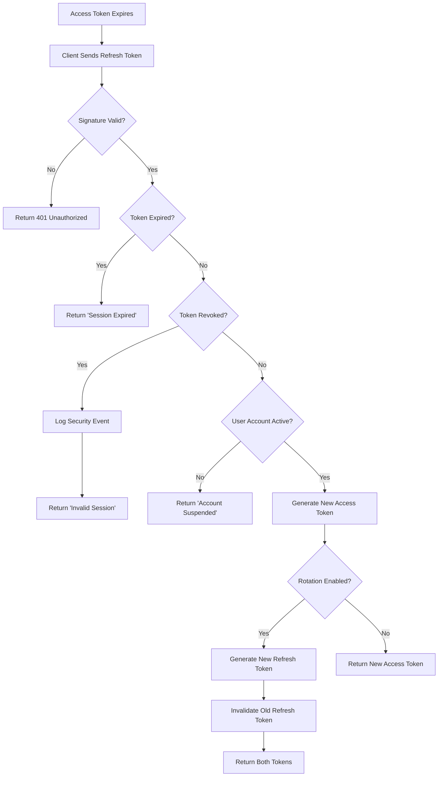

# User Actors and Authentication Requirements

## Introduction

This document defines all user actors (types) in the discussion board system, their permissions, and the complete authentication system requirements. It provides backend developers with clear business requirements for implementing user management, access control, and authentication workflows.

The discussion board supports three distinct user actors: Guests (unauthenticated visitors), Members (registered users), and Moderators (administrators). Each actor has specific permissions that control what they can and cannot do within the system.

## User Actor Definitions

### Guest (Unauthenticated Visitor)

**Role**: Unauthenticated visitors who browse the discussion board without creating an account.

**Purpose**: Allow public access to discussion content to encourage discovery and potential member registration.

**Capabilities**:
- Browse and read published articles
- View article details including text content and attached images
- Read comments on articles
- Search for articles by keywords or topics
- View public user profiles
- Navigate discussion categories
- Download attached files from articles

**Limitations**:
- Cannot create articles or comments
- Cannot upload files or images
- Cannot edit any content
- Cannot vote or interact with content
- Cannot access member-only features
- No personalization or saved preferences
- Cannot report content to moderators
- Cannot manage account settings

### Member (Registered User)

**Role**: Registered authenticated users who actively participate in discussions.

**Purpose**: Enable full participation in the discussion board community through content creation and interaction.

**Capabilities**:
- All Guest capabilities plus:
- Create new articles with titles, content, and optional attachments
- Upload and attach images to articles (up to 10 images per article)
- Upload and attach files to articles (up to 5 files per article)
- Write comments on any published article
- Edit their own articles at any time
- Edit their own comments within 24 hours of posting
- Delete their own articles (if no comments exist, or request moderator assistance)
- Delete their own comments at any time
- Manage their user profile information
- Change their account password
- View their content history (articles and comments)
- Report inappropriate content to moderators
- Request password reset via email
- Delete their own account and associated content

**Limitations**:
- Cannot edit or delete other users' content
- Cannot moderate or manage other users
- Cannot access administrative functions
- Cannot bypass content publishing rules set by moderators
- Cannot view moderation dashboard or reports
- Cannot manage user accounts or suspend users
- Cannot configure system settings or categories

### Moderator (Administrator)

**Role**: Trusted administrators who maintain community standards and manage the platform.

**Purpose**: Ensure discussions remain civil, on-topic, and compliant with community guidelines while managing platform operations.

**Capabilities**:
- All Member capabilities plus:
- Review all articles and comments regardless of author
- Delete any inappropriate articles with reason documentation
- Delete any inappropriate comments with reason documentation
- Edit any article to remove inappropriate content (preserving original author)
- Edit any comment to remove inappropriate content (preserving original commenter)
- Manage user accounts (suspend, activate, delete)
- Access moderation dashboard and content reports
- View complete content history across all users
- Monitor platform activity and usage statistics
- Configure discussion categories and topics
- Set and enforce community guidelines
- Override content visibility settings
- View moderation action logs for accountability
- Reactivate suspended user accounts
- Prioritize and review user-reported content

**Limitations**:
- Must follow fair moderation practices
- Should document reasons for moderation actions
- Cannot access users' private passwords or password hashes
- Cannot bypass security protocols
- Should apply guidelines consistently across all users

## Permission Matrix

| Action | Guest | Member | Moderator |
|--------|-------|--------|-----------|
| **Article Management** |
| Browse published articles | ✅ | ✅ | ✅ |
| View article details | ✅ | ✅ | ✅ |
| Create new article | ❌ | ✅ | ✅ |
| Edit own article | ❌ | ✅ | ✅ |
| Delete own article | ❌ | ✅ | ✅ |
| Edit other's article | ❌ | ❌ | ✅ |
| Delete other's article | ❌ | ❌ | ✅ |
| **Commenting** |
| Read comments | ✅ | ✅ | ✅ |
| Write comments | ❌ | ✅ | ✅ |
| Edit own comments | ❌ | ✅ | ✅ |
| Delete own comments | ❌ | ✅ | ✅ |
| Edit other's comments | ❌ | ❌ | ✅ |
| Delete other's comments | ❌ | ❌ | ✅ |
| **File Attachments** |
| View attached images | ✅ | ✅ | ✅ |
| Download attached files | ✅ | ✅ | ✅ |
| Upload images to article | ❌ | ✅ | ✅ |
| Upload files to article | ❌ | ✅ | ✅ |
| Remove own attachments | ❌ | ✅ | ✅ |
| **Search and Discovery** |
| Search articles | ✅ | ✅ | ✅ |
| Filter by category | ✅ | ✅ | ✅ |
| View user profiles | ✅ | ✅ | ✅ |
| Sort articles by date/engagement | ✅ | ✅ | ✅ |
| **User Management** |
| Register account | ✅ | ❌ | ❌ |
| Login to account | ❌ | ✅ | ✅ |
| Edit own profile | ❌ | ✅ | ✅ |
| Change own password | ❌ | ✅ | ✅ |
| Delete own account | ❌ | ✅ | ✅ |
| Manage other users | ❌ | ❌ | ✅ |
| Suspend user accounts | ❌ | ❌ | ✅ |
| View user account details | ❌ | Own only | ✅ |
| **Moderation** |
| Report content | ❌ | ✅ | ✅ |
| Review reports | ❌ | ❌ | ✅ |
| Access moderation tools | ❌ | ❌ | ✅ |
| Configure categories | ❌ | ❌ | ✅ |
| View moderation logs | ❌ | ❌ | ✅ |

## Authentication System Requirements

### Core Authentication Functions

THE system SHALL provide user registration with email and password.

THE system SHALL provide user login to access authenticated features.

THE system SHALL provide user logout to terminate sessions securely.

THE system SHALL maintain user sessions using JWT tokens.

THE system SHALL provide email verification for new accounts.

THE system SHALL provide password reset functionality for users who forget their credentials.

THE system SHALL allow users to change their password after authentication.

THE system SHALL allow users to revoke access from all devices by invalidating all tokens.

### Registration Requirements

WHEN a user submits registration information, THE system SHALL validate the email address format.

WHEN a user submits registration information, THE system SHALL check that the email is not already registered.

WHEN a user registers, THE system SHALL require a password with minimum 8 characters including at least one letter and one number.

WHEN a user completes registration, THE system SHALL send an email verification link to the provided address.

WHEN a user clicks the verification link, THE system SHALL activate the account and allow login.

IF a user attempts to login without email verification, THEN THE system SHALL deny access and prompt for verification.

WHEN registration validation fails, THE system SHALL provide specific error messages indicating which field requires correction.

THE system SHALL limit registration attempts to 3 per hour per IP address to prevent spam accounts.

### Login Requirements

WHEN a user submits login credentials, THE system SHALL validate the email and password combination.

WHEN login credentials are valid, THE system SHALL generate JWT access and refresh tokens.

WHEN login credentials are valid, THE system SHALL return user information including actor type (member or moderator).

WHEN login succeeds, THE system SHALL respond within 2 seconds under normal conditions.

IF login credentials are invalid, THEN THE system SHALL return an error message without revealing which field was incorrect.

IF a user attempts login 5 times with incorrect credentials within 15 minutes, THEN THE system SHALL temporarily lock the account for 30 minutes.

WHEN an account is locked, THE system SHALL send notification email to the account owner.

THE system SHALL allow users to unlock their account via email verification link.

### Session Management Requirements

THE system SHALL use JWT (JSON Web Tokens) for session management.

THE system SHALL issue access tokens with 30 minute expiration time.

THE system SHALL issue refresh tokens with 7 day expiration time.

WHEN an access token expires, THE system SHALL allow the user to obtain a new access token using a valid refresh token.

WHEN a user logs out, THE system SHALL invalidate the current refresh token.

THE system SHALL include user ID, actor role, and permissions array in the JWT payload.

THE system SHALL store tokens securely in the client using httpOnly cookies or secure localStorage.

WHEN a refresh token is used, THE system SHALL optionally generate a new refresh token (refresh token rotation for enhanced security).

IF a refresh token is used after it has been revoked, THEN THE system SHALL reject the request and log a security event.

### Password Recovery Requirements

WHEN a user requests password reset, THE system SHALL send a secure reset link to the registered email address.

THE system SHALL generate password reset tokens that expire after 1 hour.

WHEN a user clicks a password reset link, THE system SHALL verify the token is valid and not expired.

WHEN a user submits a new password via reset link, THE system SHALL validate password strength requirements.

WHEN password reset completes successfully, THE system SHALL invalidate all existing sessions for that user.

IF a password reset token is invalid or expired, THEN THE system SHALL display an error and offer to send a new reset link.

THE system SHALL always return success message when password reset is requested, regardless of whether email exists (security measure to prevent email enumeration).

THE system SHALL limit password reset requests to 3 per hour per email address.

### Password Change Requirements

WHEN an authenticated user requests to change password, THE system SHALL require the current password for verification.

WHEN changing password, THE system SHALL validate the new password meets strength requirements.

WHEN password change succeeds, THE system SHALL invalidate all other sessions except the current one.

WHEN password change succeeds, THE system SHALL send a confirmation email to the user's registered address.

THE system SHALL check that the new password is different from the current password.

IF the current password verification fails, THEN THE system SHALL return error message "Current password is incorrect".

## JWT Token Specification

### Token Structure

THE system SHALL use JWT tokens for authentication and authorization.

THE JWT access token payload SHALL include:
- User ID (unique identifier)
- Actor role (guest, member, or moderator)
- Permissions array (list of allowed actions)
- Token issue timestamp
- Token expiration timestamp

THE JWT refresh token payload SHALL include:
- User ID (unique identifier)
- Token ID (for revocation tracking)
- Token issue timestamp
- Token expiration timestamp

### Token Expiration

THE system SHALL set access token expiration to 30 minutes from issue time.

THE system SHALL set refresh token expiration to 7 days from issue time.

WHEN an access token expires, THE system SHALL require the client to use the refresh token to obtain a new access token.

WHEN a refresh token expires, THE system SHALL require the user to login again with credentials.

### Token Storage and Security

THE system SHALL sign JWT tokens with a secure secret key stored in environment configuration.

THE system SHALL use HS256 (HMAC with SHA-256) algorithm for token signing.

THE system SHALL validate token signatures on every authenticated request.

IF a token signature is invalid, THEN THE system SHALL reject the request and return HTTP 401 Unauthorized.

THE system SHALL recommend storing tokens in httpOnly cookies for maximum security, with fallback to secure localStorage.

THE system SHALL never store JWT secret keys in source code or version control.

### Token Refresh Mechanism

WHEN a client presents a valid refresh token, THE system SHALL generate a new access token.

WHEN a client presents a valid refresh token, THE system SHALL optionally generate a new refresh token (refresh token rotation).

THE system SHALL allow token refresh requests without requiring full re-authentication.

IF a refresh token is used after it has been revoked, THEN THE system SHALL reject the request and log a security event.

WHEN refresh token rotation is enabled, THE system SHALL invalidate the old refresh token after issuing a new one.

THE system SHALL respond to token refresh requests within 500 milliseconds.

## Detailed Authentication Flows

### User Registration Flow

**Step 1: Registration Request**
- User provides email address and password
- User agrees to terms of service
- THE system SHALL validate email format is correct
- THE system SHALL check email is not already registered
- THE system SHALL validate password meets strength requirements (minimum 8 characters, at least one letter, one number)

**Step 2: Account Creation**
- WHEN validation passes, THE system SHALL create a new user account in inactive status
- THE system SHALL assign "member" actor role by default
- THE system SHALL generate a unique email verification token
- THE system SHALL store the verification token with 24 hour expiration

**Step 3: Email Verification**
- THE system SHALL send verification email to the provided address
- The email SHALL contain a verification link with the token
- WHEN user clicks verification link, THE system SHALL validate the token
- WHEN token is valid, THE system SHALL activate the user account
- WHEN activation succeeds, THE system SHALL redirect user to login page

**Step 4: Error Handling**
- IF email is already registered, THEN THE system SHALL return "Email already in use" error
- IF password is too weak, THEN THE system SHALL return specific password requirements
- IF email verification token expires, THEN THE system SHALL allow user to request a new verification email

**Step 5: Post-Registration**
- THE system SHALL log the successful registration event with timestamp
- THE system SHALL make the user profile publicly visible after activation
- THE system SHALL initialize user content counters (article count: 0, comment count: 0)

### Registration Flow Diagram

### Login Flow

**Step 1: Login Request**
- User provides email and password
- THE system SHALL validate both fields are provided
- THE system SHALL check if the account exists

**Step 2: Credential Verification**
- THE system SHALL verify the password matches the stored hash
- THE system SHALL check if the account is activated (email verified)
- THE system SHALL check if the account is not suspended or locked

**Step 3: Token Generation**
- WHEN credentials are valid, THE system SHALL generate JWT access token with 30 minute expiration
- THE system SHALL generate JWT refresh token with 7 day expiration
- THE system SHALL include user ID, actor role (member or moderator), and permissions in access token payload

**Step 4: Successful Login Response**
- THE system SHALL return access token and refresh token
- THE system SHALL return user profile information (ID, email, display name, actor role)
- THE system SHALL log the successful login event with timestamp

**Step 5: Error Handling**
- IF credentials are invalid, THEN THE system SHALL return "Invalid email or password" error without specifying which field is wrong
- IF account is not verified, THEN THE system SHALL return "Please verify your email address" with option to resend verification
- IF account is locked due to failed attempts, THEN THE system SHALL return "Account temporarily locked due to multiple failed login attempts"
- IF account is suspended, THEN THE system SHALL return "Account has been suspended, please contact support"

### Login Flow Diagram

### Logout Flow

**Step 1: Logout Request**
- Authenticated user requests to logout
- THE system SHALL validate the current refresh token is provided

**Step 2: Session Termination**
- THE system SHALL add the refresh token to a revocation list
- THE system SHALL mark the token as invalid in the database
- THE system SHALL clear any server-side session data

**Step 3: Client Cleanup**
- THE system SHALL instruct the client to delete stored tokens
- THE system SHALL return successful logout confirmation

**Step 4: Logging**
- THE system SHALL log the logout event with timestamp and user ID

### Logout Flow Diagram

### Password Reset Flow

**Step 1: Reset Request**
- User requests password reset by providing email address
- THE system SHALL validate email format
- THE system SHALL check if account exists (but not reveal this to prevent email enumeration)

**Step 2: Reset Token Generation**
- WHEN email exists in system, THE system SHALL generate a secure password reset token
- THE system SHALL set token expiration to 1 hour from generation
- THE system SHALL store the token associated with the user account

**Step 3: Email Delivery**
- THE system SHALL send password reset email to the registered address
- The email SHALL contain a secure reset link with the token
- THE system SHALL always return success message regardless of whether email exists (security measure)

**Step 4: Password Reset Submission**
- User clicks reset link and provides new password
- THE system SHALL validate the reset token is valid and not expired
- THE system SHALL validate new password meets strength requirements
- THE system SHALL check new password is different from current password

**Step 5: Password Update**
- WHEN validation passes, THE system SHALL update the password hash
- THE system SHALL invalidate all existing refresh tokens for the user
- THE system SHALL mark the reset token as used
- THE system SHALL send confirmation email that password was changed

**Step 6: Error Handling**
- IF reset token is expired, THEN THE system SHALL return "Reset link has expired, please request a new one"
- IF reset token is invalid, THEN THE system SHALL return "Invalid reset link"
- IF new password is too weak, THEN THE system SHALL return password requirement details

### Password Reset Flow Diagram

### Token Refresh Flow

**Step 1: Refresh Request**
- Client detects access token is expired or about to expire
- Client sends refresh token to token refresh endpoint
- THE system SHALL validate refresh token signature

**Step 2: Token Validation**
- THE system SHALL verify refresh token is not expired
- THE system SHALL check refresh token is not in revocation list
- THE system SHALL verify user account associated with token still exists and is active

**Step 3: New Token Generation**
- WHEN refresh token is valid, THE system SHALL generate new access token with fresh 30 minute expiration
- THE system SHALL copy user ID and actor role from refresh token
- THE system SHALL optionally generate new refresh token (refresh token rotation for enhanced security)

**Step 4: Response**
- THE system SHALL return new access token
- THE system SHALL return new refresh token if rotation is enabled
- IF rotation is enabled, THE system SHALL invalidate the old refresh token

**Step 5: Error Handling**
- IF refresh token is expired, THEN THE system SHALL return "Session expired, please login again" with HTTP 401
- IF refresh token is revoked, THEN THE system SHALL return "Invalid session" and log security event
- IF user account is suspended, THEN THE system SHALL return "Account suspended" and prevent token refresh

### Token Refresh Flow Diagram

## Actor-Specific Permissions in Detail

### Guest Permissions

**What Guests CAN Do:**
- THE system SHALL allow guests to browse all published articles without authentication
- THE system SHALL allow guests to view article content including text, images, and downloadable files
- THE system SHALL allow guests to read all comments on articles
- THE system SHALL allow guests to search articles by keywords
- THE system SHALL allow guests to filter articles by category or topic
- THE system SHALL allow guests to view public user profiles
- THE system SHALL allow guests to access the registration page
- THE system SHALL allow guests to sort articles by date, views, or comments

**What Guests CANNOT Do:**
- WHEN a guest attempts to create an article, THE system SHALL deny access and prompt for login
- WHEN a guest attempts to write a comment, THE system SHALL deny access and prompt for login
- WHEN a guest attempts to upload files, THE system SHALL deny access and prompt for login
- THE system SHALL prevent guests from accessing member-only features
- THE system SHALL prevent guests from editing any content
- THE system SHALL prevent guests from personalizing their experience
- THE system SHALL prevent guests from reporting content
- THE system SHALL prevent guests from deleting content

### Member Permissions

**Article Creation and Management:**
- THE system SHALL allow members to create new articles with title and content
- THE system SHALL allow members to attach up to 10 images per article
- THE system SHALL allow members to attach up to 5 files per article with maximum 25MB per file
- THE system SHALL allow members to edit their own articles at any time
- THE system SHALL allow members to delete their own articles if no comments exist
- IF a member attempts to delete an article with comments, THEN THE system SHALL prevent deletion and suggest requesting moderator assistance

**Commenting:**
- THE system SHALL allow members to write comments on any published article
- THE system SHALL allow members to edit their own comments within 24 hours of posting
- THE system SHALL allow members to delete their own comments at any time
- THE system SHALL limit comment length to 2000 characters
- WHEN a member posts a comment, THE system SHALL display it immediately without moderation

**File and Image Handling:**
- THE system SHALL allow members to upload JPEG, PNG, GIF, and WebP image formats
- THE system SHALL allow members to upload PDF, DOC, DOCX, XLS, XLSX, TXT, CSV, and ZIP file formats
- THE system SHALL validate file types before accepting uploads
- THE system SHALL scan uploaded files for malware before storage
- IF file upload fails due to size limit, THEN THE system SHALL display clear error message with maximum allowed size

**Profile Management:**
- THE system SHALL allow members to edit their display name
- THE system SHALL allow members to edit their profile description
- THE system SHALL allow members to change their password
- THE system SHALL allow members to view their article and comment history
- THE system SHALL allow members to delete their account and all associated content

**What Members CANNOT Do:**
- WHEN a member attempts to edit another user's article, THE system SHALL deny access with "You can only edit your own content" message
- WHEN a member attempts to delete another user's comment, THE system SHALL deny access
- THE system SHALL prevent members from accessing moderation tools
- THE system SHALL prevent members from managing other user accounts
- THE system SHALL prevent members from configuring system settings

### Moderator Permissions

**Content Moderation:**
- THE system SHALL allow moderators to view all articles and comments regardless of author
- THE system SHALL allow moderators to delete any article that violates community guidelines
- THE system SHALL allow moderators to delete any comment that violates community guidelines
- WHEN a moderator deletes content, THE system SHALL require a reason selection from predefined categories
- WHEN a moderator deletes content, THE system SHALL notify the content author via email
- THE system SHALL maintain a moderation log of all deleted content with moderator ID and reason

**User Management:**
- THE system SHALL allow moderators to suspend user accounts temporarily
- THE system SHALL allow moderators to permanently delete user accounts
- WHEN a moderator suspends an account, THE system SHALL require specifying suspension duration and reason
- WHEN a moderator suspends an account, THE system SHALL invalidate all user tokens immediately
- THE system SHALL allow moderators to reactivate suspended accounts
- THE system SHALL prevent moderators from viewing user passwords or password hashes

**Administrative Functions:**
- THE system SHALL provide moderators access to a moderation dashboard
- THE system SHALL show moderators recent activity reports and statistics
- THE system SHALL allow moderators to configure discussion categories and topics
- THE system SHALL allow moderators to create and update community guidelines
- THE system SHALL allow moderators to view content reports from members
- THE system SHALL prioritize reported content in the moderation queue

**Moderation Best Practices:**
- WHEN moderating content, moderators SHOULD document clear reasons for actions
- WHEN moderating content, moderators SHOULD apply guidelines consistently across all users
- Moderators SHOULD review reported content within 24 hours
- THE system SHALL log all moderation actions for accountability and audit purposes

## Security Requirements

### Password Security

THE system SHALL require passwords to be at least 8 characters long.

THE system SHALL require passwords to contain at least one letter and one number.

THE system SHALL recommend but not require special characters and mixed case for stronger passwords.

THE system SHALL hash all passwords using bcrypt with minimum cost factor of 10 before storage.

THE system SHALL never store passwords in plain text.

THE system SHALL never display or transmit passwords in clear text.

WHEN a user creates or changes password, THE system SHALL validate against common password lists to prevent easily guessable passwords.

THE system SHALL reject passwords that are identical to the user's email address.

### Account Protection

THE system SHALL implement rate limiting on login attempts to prevent brute force attacks.

WHEN a user fails login 5 times within 15 minutes, THE system SHALL temporarily lock the account for 30 minutes.

WHEN an account is locked due to failed attempts, THE system SHALL send notification email to the account owner.

THE system SHALL allow users to unlock their account via email verification link.

THE system SHALL monitor for suspicious login patterns (e.g., login attempts from multiple countries within short time).

IF suspicious activity is detected, THEN THE system SHALL send security alert email to the user.

THE system SHALL log all failed login attempts with IP address and timestamp for security analysis.

### Session Security

THE system SHALL use HTTPS for all authentication requests and token transmission.

THE system SHALL include CSRF tokens for state-changing operations when using cookie-based authentication.

THE system SHALL validate JWT token signatures on every authenticated request.

THE system SHALL reject expired tokens and return HTTP 401 Unauthorized.

THE system SHALL implement token refresh mechanism to minimize access token lifetime exposure.

WHEN a user changes password, THE system SHALL invalidate all existing sessions except the current one.

THE system SHALL provide "logout from all devices" functionality that invalidates all refresh tokens.

THE system SHALL set httpOnly and secure flags on authentication cookies when using cookie-based token storage.

### Data Privacy

THE system SHALL never expose user email addresses publicly without explicit user consent.

THE system SHALL hash and salt all passwords before storage.

THE system SHALL store JWT secret keys in secure environment variables, never in code.

THE system SHALL implement access controls to ensure users can only access their own data.

THE system SHALL log all authentication events (login, logout, password changes) for security auditing.

THE system SHALL anonymize or pseudonymize user data in system logs to protect privacy.

THE system SHALL comply with data protection regulations regarding user personal information.

### Rate Limiting

THE system SHALL limit login attempts to 5 per 15 minute window per IP address.

THE system SHALL limit registration attempts to 3 per hour per IP address to prevent spam accounts.

THE system SHALL limit password reset requests to 3 per hour per email address.

THE system SHALL limit token refresh requests to 10 per minute per user.

IF rate limit is exceeded, THEN THE system SHALL return HTTP 429 Too Many Requests with retry-after information.

THE system SHALL implement exponential backoff for repeated rate limit violations.

## Error Handling and User Feedback

### Authentication Failure Scenarios

**Invalid Credentials:**
- WHEN login credentials are incorrect, THE system SHALL return "Invalid email or password" message
- THE system SHALL not specify whether email or password was wrong to prevent account enumeration
- THE system SHALL log failed login attempts with timestamp and IP address
- THE system SHALL track failed attempt count for account locking mechanism

**Unverified Email:**
- WHEN a user attempts login without email verification, THE system SHALL return "Please verify your email address to login"
- THE system SHALL provide "Resend verification email" option
- WHEN user requests new verification email, THE system SHALL send it immediately if account exists
- THE system SHALL limit verification email resend requests to 3 per hour

**Account Locked:**
- WHEN a locked account attempts login, THE system SHALL return "Account temporarily locked due to multiple failed attempts. Please try again in X minutes"
- THE system SHALL include exact time remaining until unlock
- THE system SHALL provide email unlock option as alternative
- THE system SHALL send unlock instructions via email to account owner

**Account Suspended:**
- WHEN a suspended account attempts login, THE system SHALL return "Your account has been suspended. Please contact support for assistance"
- THE system SHALL include suspension reason if available
- THE system SHALL provide support contact information
- THE system SHALL log suspension-related login attempts

### Token Validation Errors

**Expired Access Token:**
- WHEN an expired access token is presented, THE system SHALL return HTTP 401 with "Access token expired, please refresh"
- THE system SHALL indicate that token refresh endpoint should be used
- THE system SHALL not process the request with expired token

**Invalid Token Signature:**
- WHEN a token with invalid signature is presented, THE system SHALL return HTTP 401 with "Invalid authentication token"
- THE system SHALL log the security event with details for investigation
- THE system SHALL not reveal technical details about signature validation

**Expired Refresh Token:**
- WHEN an expired refresh token is used, THE system SHALL return "Session expired, please login again"
- THE system SHALL clear any client-side stored tokens
- THE system SHALL redirect to login page

**Malformed Token:**
- WHEN a malformed token is presented, THE system SHALL return HTTP 401 with "Invalid authentication token"
- THE system SHALL log the malformed token attempt
- THE system SHALL not expose token parsing errors to the client

### Permission Denial

**Insufficient Permissions:**
- WHEN a user attempts an action they lack permission for, THE system SHALL return HTTP 403 Forbidden
- THE system SHALL provide clear message like "You don't have permission to perform this action"
- THE system SHALL suggest what actor role is required if appropriate

**Guest Access Attempt:**
- WHEN a guest attempts member-only action, THE system SHALL return "Please login to continue"
- THE system SHALL provide direct link to login page
- THE system SHALL preserve the intended action to redirect after successful login

**Member Attempting Admin Action:**
- WHEN a member attempts moderator-only action, THE system SHALL return "This action requires moderator privileges"
- THE system SHALL not provide instructions on how to become moderator
- THE system SHALL log the attempt for security monitoring

### Registration and Password Reset Errors

**Email Already Registered:**
- WHEN registration attempts with existing email, THE system SHALL return "An account with this email already exists"
- THE system SHALL suggest using password reset if user forgot their password
- THE system SHALL provide link to login page

**Weak Password:**
- WHEN password doesn't meet requirements, THE system SHALL return specific requirements not met
- THE system SHALL display "Password must be at least 8 characters and contain at least one letter and one number"
- THE system SHALL allow user to correct and resubmit

**Invalid Reset Token:**
- WHEN password reset token is invalid or expired, THE system SHALL return "This password reset link is invalid or has expired"
- THE system SHALL provide option to request new reset link
- THE system SHALL clear any stored token from URL

**Email Format Invalid:**
- WHEN email format is invalid during registration, THE system SHALL return "Please enter a valid email address"
- THE system SHALL provide examples of valid email formats
- THE system SHALL highlight the email field for correction

### Edge Cases

**Concurrent Session Conflicts:**
- WHEN user logs in from multiple devices, THE system SHALL allow all sessions to coexist
- WHEN password is changed from one device, THE system SHALL invalidate all other device sessions
- THE system SHALL notify user of active sessions when viewing account security settings

**Token Revocation Race Conditions:**
- WHEN a refresh token is used immediately after logout, THE system SHALL reject it as revoked
- THE system SHALL handle race conditions gracefully without exposing system errors
- THE system SHALL maintain token revocation list with sufficient TTL

**Account Deletion:**
- WHEN a user deletes their account, THE system SHALL immediately invalidate all tokens
- THE system SHALL mark all user content as "deleted user" rather than removing it to preserve discussion continuity
- THE system SHALL allow users to export their data before deletion if requested

**Email Verification Expiration:**
- WHEN a verification token expires, THE system SHALL allow requesting a new verification email
- THE system SHALL invalidate old verification tokens when new ones are generated
- THE system SHALL limit verification email requests to prevent abuse

## Performance Requirements

THE system SHALL respond to login requests within 2 seconds under normal load.

THE system SHALL respond to token refresh requests within 500 milliseconds.

THE system SHALL process registration requests within 3 seconds including email sending.

THE system SHALL handle at least 100 concurrent authentication requests without degradation.

WHEN database is under heavy load, THE system SHALL still validate JWT tokens locally without database queries for better performance.

THE system SHALL cache user permissions in JWT payload to avoid database lookups on every request.

THE system SHALL implement efficient indexing on user email and ID fields for fast authentication queries.

THE system SHALL send verification and password reset emails within 5 seconds of request.

---

*Developer Note: This document defines business requirements for user actors and authentication. All technical implementations (JWT library selection, database schema for user storage, password hashing implementation, token storage mechanisms, etc.) are at the discretion of the development team.*