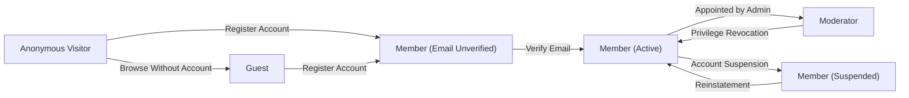
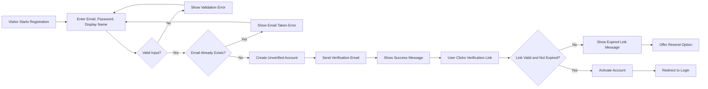
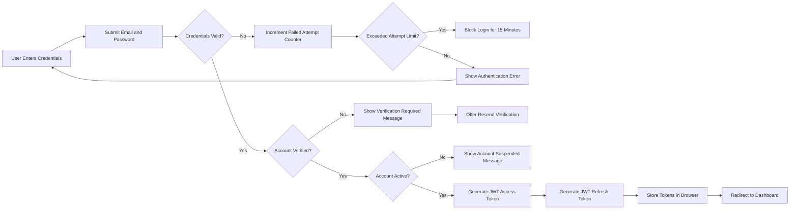
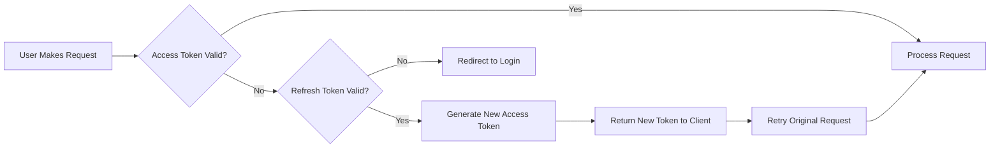

# User Actors and Authentication

## Introduction

This document defines all user actor types in the discussion board system and specifies the complete authentication and authorization requirements. The discussion board supports three distinct actor types—Guest, Member, and Moderator—each with specific permissions and capabilities designed to maintain a simple yet secure platform for economic and political discussions.

The authentication system uses JWT (JSON Web Tokens) to manage user sessions and enforce permission-based access control. This document focuses on business requirements and user-facing behavior, leaving technical implementation details to the development team.

For related information, see the [Core Features Document](./03-core-features.md) for feature-level capabilities and [Article Management Document](./04-article-management.md) for content-specific permissions.

## User Actor Definitions

### Guest

**Definition**: Unauthenticated visitors who access the discussion board without creating an account or logging in.

**Purpose**: Guests represent the public audience who want to explore economic and political discussions before committing to registration. They provide the foundation for content discovery and community growth.

**Capabilities**:
- Browse and read published articles
- View article lists organized by category or topic
- Search for articles using keywords
- View public discussion threads
- Access article metadata (author, publication date, category)
- View attached images within articles
- Navigate between pages and sections

**Limitations**:
- Cannot create, edit, or delete any content
- Cannot upload attachments or images
- Cannot participate in discussions or comment
- Cannot access member-only features or draft articles
- Cannot save preferences or personalize experience
- Cannot download file attachments

**Business Context**: Guests serve as potential future members and help drive content visibility through organic discovery. Their read-only access ensures content reaches a wide audience while protecting the platform from anonymous abuse.

### Member

**Definition**: Registered and authenticated users who have created an account and successfully logged in to the system.

**Purpose**: Members are the core contributors to the discussion board, creating economic and political articles, sharing insights, uploading supporting materials, and building the community knowledge base.

**Capabilities**:
- All Guest capabilities
- Create new discussion articles with rich text content
- Upload and attach images to articles (JPEG, PNG, GIF formats)
- Upload and attach document files to articles (PDF, DOC, DOCX, XLS, XLSX formats)
- Edit their own articles at any time
- Delete their own articles
- Manage their own attachments (add, remove, replace)
- View and manage their profile information
- Change their password
- Update account settings
- View their own draft and published articles
- Save articles as drafts before publishing

**Limitations**:
- Cannot edit or delete other members' content
- Cannot access moderator tools or administrative features
- Cannot modify other users' accounts or permissions
- Cannot bypass content validation rules
- Cannot restore deleted content without moderator assistance

**Business Context**: Members are authenticated contributors who drive the value of the platform through quality economic and political discourse. Their permissions balance creative freedom with accountability through content ownership.

### Moderator

**Definition**: Trusted administrators with elevated privileges to manage content quality, enforce community guidelines, and maintain the integrity of economic and political discussions.

**Purpose**: Moderators ensure the discussion board remains focused, civil, and valuable by reviewing content, managing inappropriate materials, and supporting the community.

**Capabilities**:
- All Member capabilities
- View, edit, or delete any article regardless of author
- Remove inappropriate attachments from any article
- Manage user accounts (activate, suspend, delete)
- Review reported content and take appropriate action
- Access moderation logs and activity history
- Enforce community guidelines
- Restore accidentally deleted content
- Override content validation rules when necessary
- View draft articles from any member
- Manage categories and organizational structures

**Limitations**:
- Cannot change system configuration or infrastructure settings
- Cannot access raw user passwords or sensitive authentication data
- Cannot grant or revoke moderator privileges (requires system administrator)

**Business Context**: Moderators are essential for maintaining discussion quality and preventing abuse. Their elevated permissions enable rapid response to issues while maintaining transparent oversight of community content.

## Actor Hierarchy and Transitions

### Permission Hierarchy

The discussion board implements a hierarchical permission model where higher-level actors inherit all capabilities from lower levels:

```
Moderator (highest privileges)
    ↑ inherits all from
Member (authenticated user privileges)
    ↑ inherits all from
Guest (public read-only access)
```

### Actor Lifecycle and Transitions



**Transition Rules**:

- **WHEN** an anonymous visitor completes registration, **THE** system **SHALL** create a Member account in unverified status.
- **WHEN** a new member verifies their email address, **THE** system **SHALL** activate their account and grant full Member privileges.
- **WHEN** a system administrator appoints a Member as Moderator, **THE** system **SHALL** grant elevated privileges immediately.
- **WHEN** a Moderator's privileges are revoked, **THE** system **SHALL** downgrade the account to standard Member status.
- **WHEN** a Member account is suspended, **THE** system **SHALL** revoke all content creation and editing privileges while maintaining account data.

## Authentication System Requirements

### Core Authentication Functions

The discussion board provides comprehensive authentication capabilities to manage user access securely and efficiently.

#### User Registration

**WHEN** a visitor chooses to register, **THE** system **SHALL** collect email address, password, and display name.

**THE** system **SHALL** validate that email addresses are in valid format before accepting registration.

**THE** system **SHALL** reject registration **IF** the email address is already associated with an existing account.

**THE** system **SHALL** enforce password requirements: minimum 8 characters, at least one letter and one number.

**WHEN** registration is submitted, **THE** system **SHALL** create an account in unverified status and send a verification email.

**THE** verification email **SHALL** contain a unique, time-limited verification link valid for 24 hours.

**WHEN** a user clicks the verification link, **THE** system **SHALL** activate the account and grant full Member privileges.

**IF** the verification link expires, **THE** system **SHALL** allow users to request a new verification email.

#### User Login

**WHEN** a user submits login credentials, **THE** system **SHALL** validate the email and password combination within 2 seconds.

**IF** credentials are valid and the account is active, **THE** system **SHALL** generate a JWT access token and refresh token.

**IF** credentials are invalid, **THE** system **SHALL** return an authentication error without revealing whether the email or password was incorrect.

**IF** the account is unverified, **THE** system **SHALL** deny login and prompt the user to verify their email.

**IF** the account is suspended, **THE** system **SHALL** deny login and display a suspension notice.

**THE** system **SHALL** limit login attempts to 5 failures per email address within 15 minutes to prevent brute force attacks.

**WHEN** login attempt limit is exceeded, **THE** system **SHALL** temporarily block login attempts for that email for 15 minutes.

#### Session Management with JWT

**THE** system **SHALL** use JWT (JSON Web Tokens) for managing authenticated sessions.

**THE** access token **SHALL** expire after 30 minutes of issuance.

**THE** refresh token **SHALL** expire after 7 days of issuance.

**THE** JWT payload **SHALL** include: user ID, actor role (member, moderator), email address, and issued-at timestamp.

**WHEN** an access token expires, **THE** system **SHALL** allow users to obtain a new access token using a valid refresh token.

**WHEN** a user logs out, **THE** system **SHALL** invalidate the current refresh token.

**THE** system **SHALL** store JWT tokens on the client side in browser localStorage for convenient access.

**WHEN** a user requests a protected resource, **THE** system **SHALL** validate the JWT token signature and expiration before granting access.

**IF** a JWT token is invalid or expired, **THE** system **SHALL** return HTTP 401 Unauthorized status.

#### Email Verification

**THE** system **SHALL** require email verification before granting full Member privileges.

**WHEN** a user registers, **THE** system **SHALL** automatically send a verification email to the provided address.

**THE** verification email **SHALL** include a clear call-to-action and verification link.

**WHEN** a user clicks the verification link, **THE** system **SHALL** mark the account as verified and redirect to the login page.

**IF** a user has not verified their email, **THE** system **SHALL** provide an option to resend the verification email.

**THE** system **SHALL** allow unlimited verification email resends with a rate limit of one email per 5 minutes.

#### Password Management

**WHEN** a user forgets their password, **THE** system **SHALL** provide a password reset flow initiated by email address.

**WHEN** password reset is requested, **THE** system **SHALL** send a password reset email with a unique, time-limited reset link valid for 1 hour.

**THE** password reset email **SHALL** be sent only to verified email addresses.

**WHEN** a user clicks the reset link, **THE** system **SHALL** allow them to set a new password meeting all password requirements.

**WHEN** a password is successfully reset, **THE** system **SHALL** invalidate all existing refresh tokens for that account.

**WHEN** an authenticated user changes their password, **THE** system **SHALL** require the current password for verification.

**WHEN** a password change is successful, **THE** system **SHALL** invalidate all refresh tokens except the current session.

#### Logout Process

**WHEN** a user initiates logout, **THE** system **SHALL** invalidate the current refresh token immediately.

**WHEN** logout completes, **THE** system **SHALL** clear all authentication tokens from browser storage.

**THE** system **SHALL** redirect users to the public homepage after logout.

**THE** system **SHALL** provide a "logout from all devices" option that invalidates all refresh tokens for the user account.

### Authentication Flow Diagrams

#### Registration and Verification Flow



#### Login Flow



#### Session Refresh Flow



## Authorization and Permission Model

### Permission Matrix

The following table defines the complete permission model for all major system actions across the three actor types:

| Action | Guest | Member | Moderator |
|--------|-------|--------|-----------|
| **Article Browsing** |
| View published articles | ✅ | ✅ | ✅ |
| View article lists | ✅ | ✅ | ✅ |
| Search articles | ✅ | ✅ | ✅ |
| View article metadata | ✅ | ✅ | ✅ |
| View draft articles (own) | ❌ | ✅ | ✅ |
| View draft articles (others) | ❌ | ❌ | ✅ |
| **Article Management** |
| Create new article | ❌ | ✅ | ✅ |
| Edit own article | ❌ | ✅ | ✅ |
| Edit others' articles | ❌ | ❌ | ✅ |
| Delete own article | ❌ | ✅ | ✅ |
| Delete others' articles | ❌ | ❌ | ✅ |
| Publish article | ❌ | ✅ | ✅ |
| Unpublish article (own) | ❌ | ✅ | ✅ |
| Unpublish article (others) | ❌ | ❌ | ✅ |
| **Attachment Management** |
| View images in articles | ✅ | ✅ | ✅ |
| Download file attachments | ❌ | ✅ | ✅ |
| Upload attachments (own article) | ❌ | ✅ | ✅ |
| Delete attachments (own article) | ❌ | ✅ | ✅ |
| Delete attachments (any article) | ❌ | ❌ | ✅ |
| **Account Management** |
| Register new account | ✅ | ❌ | ❌ |
| Login to account | ✅ | ✅ | ✅ |
| Logout | ❌ | ✅ | ✅ |
| Change own password | ❌ | ✅ | ✅ |
| Reset forgotten password | ✅ | ✅ | ✅ |
| Update own profile | ❌ | ✅ | ✅ |
| View own profile | ❌ | ✅ | ✅ |
| View others' profiles | ✅ | ✅ | ✅ |
| Suspend user accounts | ❌ | ❌ | ✅ |
| Delete user accounts | ❌ | ❌ | ✅ |
| **Moderation** |
| Report inappropriate content | ❌ | ✅ | ✅ |
| Review reported content | ❌ | ❌ | ✅ |
| Remove inappropriate content | ❌ | ❌ | ✅ |
| View moderation logs | ❌ | ❌ | ✅ |
| Restore deleted content | ❌ | ❌ | ✅ |

### Access Control Rules

**WHEN** a Guest attempts to access a Member-only feature, **THE** system **SHALL** redirect to the login page with a message indicating authentication is required.

**WHEN** a Member attempts to access a Moderator-only feature, **THE** system **SHALL** return HTTP 403 Forbidden with an access denied message.

**WHEN** a Member attempts to edit another member's article, **THE** system **SHALL** deny the request and return an ownership error message.

**WHEN** a Member attempts to delete another member's article, **THE** system **SHALL** deny the request and return an ownership error message.

**WHEN** a suspended Member attempts to create or edit content, **THE** system **SHALL** deny the request and display account suspension notice.

**THE** system **SHALL** validate user permissions on every protected action before processing the request.

**IF** a user's session expires during an action, **THE** system **SHALL** prompt for re-authentication before completing the action.

**WHEN** a Moderator edits another user's content, **THE** system **SHALL** log the moderation action with timestamp and moderator identity.

### Content Ownership Rules

**THE** system **SHALL** associate every article with the Member who created it as the owner.

**THE** system **SHALL** allow only the article owner to edit or delete their own articles, except for Moderators.

**THE** system **SHALL** allow only the article owner to manage attachments on their own articles, except for Moderators.

**WHEN** a Member's account is deleted, **THE** system **SHALL** either delete all their articles or reassign them to an anonymous author based on moderation policy.

**THE** system **SHALL** preserve author attribution permanently even if the account is later deleted.

## Actor-Specific Capabilities

### Guest User Capabilities

#### Content Discovery

**THE** system **SHALL** allow Guests to browse all published articles without authentication.

**THE** system **SHALL** display article lists organized by publication date, category, or topic to Guests.

**WHEN** a Guest searches for content, **THE** system **SHALL** return results from published articles only.

**THE** system **SHALL** display full article content including embedded images to Guests.

**THE** system **SHALL** show article metadata (author name, publication date, view count, category) to Guests.

#### Navigation and Exploration

**THE** system **SHALL** allow Guests to navigate between article pages, categories, and search results.

**THE** system **SHALL** provide Guests with pagination controls for article lists.

**WHEN** a Guest clicks on an article, **THE** system **SHALL** display the complete published article.

**THE** system **SHALL** suggest related articles to Guests based on category or topic.

#### Registration Prompts

**WHEN** a Guest attempts to perform a Member-only action (create article, download attachment), **THE** system **SHALL** prompt them to register or login.

**THE** system **SHALL** provide clear calls-to-action encouraging Guests to register for full access.

**WHEN** a Guest clicks register, **THE** system **SHALL** redirect to the registration page.

### Member Capabilities

#### Article Creation and Management

**WHEN** a Member creates a new article, **THE** system **SHALL** allow them to enter a title, rich text content, select category, and add tags.

**THE** system **SHALL** allow Members to save articles as drafts without publishing.

**THE** system **SHALL** allow Members to upload images during article creation and embed them in content.

**THE** system **SHALL** allow Members to attach document files (PDF, DOC, XLSX) to articles.

**WHEN** a Member publishes an article, **THE** system **SHALL** make it immediately visible to all users.

**WHEN** a Member edits their published article, **THE** system **SHALL** save changes and update the last-modified timestamp.

**WHEN** a Member deletes their article, **THE** system **SHALL** permanently remove it and all associated attachments.

#### Profile and Account Management

**THE** system **SHALL** allow Members to view and update their display name, bio, and profile information.

**THE** system **SHALL** allow Members to change their password by providing the current password.

**THE** system **SHALL** allow Members to view a list of all their articles (drafts and published).

**THE** system **SHALL** display account statistics to Members including total articles, total views, and account creation date.

#### Content Interaction

**THE** system **SHALL** allow Members to download file attachments from any published article.

**THE** system **SHALL** allow Members to view images in full resolution.

**WHEN** a Member encounters inappropriate content, **THE** system **SHALL** provide a report function to flag it for moderator review.

### Moderator Capabilities

#### Content Moderation

**THE** system **SHALL** allow Moderators to view all articles including drafts from any member.

**THE** system **SHALL** allow Moderators to edit any article regardless of author to fix issues or remove inappropriate content.

**THE** system **SHALL** allow Moderators to delete any article that violates community guidelines.

**THE** system **SHALL** allow Moderators to remove individual attachments from any article.

**WHEN** a Moderator deletes or edits another user's content, **THE** system **SHALL** log the action with timestamp, moderator identity, and reason.

**THE** system **SHALL** allow Moderators to unpublish articles and move them back to draft status.

**THE** system **SHALL** allow Moderators to restore recently deleted articles within 30 days of deletion.

#### User Management

**THE** system **SHALL** allow Moderators to view a list of all user accounts with registration dates and activity status.

**THE** system **SHALL** allow Moderators to suspend Member accounts, revoking their ability to create or edit content.

**THE** system **SHALL** allow Moderators to reactivate suspended accounts.

**THE** system **SHALL** allow Moderators to permanently delete user accounts and optionally remove or anonymize their content.

**WHEN** a Moderator suspends an account, **THE** system **SHALL** notify the affected user via email with the reason for suspension.

#### Moderation Tools and Reporting

**THE** system **SHALL** provide Moderators with a queue of reported content flagged by Members.

**THE** system **SHALL** allow Moderators to review reported content and take action (approve, edit, delete, or warn user).

**THE** system **SHALL** maintain a moderation activity log showing all moderation actions with timestamps and details.

**THE** system **SHALL** allow Moderators to view user activity history including all articles and moderation incidents.

**THE** system **SHALL** provide Moderators with statistics on content volume, reports handled, and user growth.

#### Category and Organization Management

**THE** system **SHALL** allow Moderators to create new article categories for organizing discussions.

**THE** system **SHALL** allow Moderators to edit or delete categories.

**THE** system **SHALL** allow Moderators to move articles between categories.

**THE** system **SHALL** allow Moderators to feature important articles on the homepage.

## Security Requirements

### Password Security

**THE** system **SHALL** enforce password requirements: minimum 8 characters, at least one letter, and at least one number.

**THE** system **SHALL** hash all passwords using industry-standard cryptographic hashing before storage.

**THE** system **SHALL** never store or transmit passwords in plain text.

**THE** system **SHALL** never display passwords back to users after creation.

**WHEN** a user enters a weak password, **THE** system **SHALL** reject it and display specific requirements.

**THE** system **SHALL** implement rate limiting on password reset requests to prevent abuse (maximum 3 requests per email per hour).

### JWT Token Security

**THE** system **SHALL** sign all JWT tokens using a secure secret key.

**THE** system **SHALL** validate JWT signatures on every authenticated request.

**THE** system **SHALL** reject expired tokens and require refresh or re-authentication.

**THE** system **SHALL** include token expiration time in the JWT payload.

**THE** system **SHALL** use HTTPS for all authentication requests to prevent token interception.

**IF** a token signature is invalid, **THE** system **SHALL** immediately reject the request and return HTTP 401 Unauthorized.

### Account Protection

**THE** system **SHALL** limit failed login attempts to 5 per email address within 15 minutes.

**WHEN** the login attempt limit is exceeded, **THE** system **SHALL** temporarily block that email from login attempts for 15 minutes.

**THE** system **SHALL** send email notifications to users when password is changed or reset.

**THE** system **SHALL** send email notifications when login occurs from a new device or location (optional security enhancement).

**THE** system **SHALL** provide users with the ability to logout from all devices simultaneously.

**THE** system **SHALL** invalidate all refresh tokens when a user changes their password.

### Session Security

**THE** system **SHALL** generate cryptographically random tokens for email verification and password reset.

**THE** system **SHALL** expire email verification links after 24 hours.

**THE** system **SHALL** expire password reset links after 1 hour.

**THE** system **SHALL** allow each verification or reset link to be used only once.

**WHEN** a user successfully resets their password, **THE** system **SHALL** invalidate the reset link immediately.

**THE** system **SHALL** prevent session fixation by generating new tokens upon login.

## Business Rules for User Management

### Account Creation Rules

**THE** system **SHALL** require unique email addresses for each account.

**THE** system **SHALL** require display names to be between 3 and 50 characters.

**THE** system **SHALL** reject registration with disposable or temporary email addresses (optional quality control).

**THE** system **SHALL** create all new accounts in unverified status until email verification is complete.

**THE** system **SHALL** allow users to register only as Members, not Moderators.

**THE** system **SHALL** prevent automated bot registration through rate limiting (maximum 5 registrations per IP address per hour).

### Account Status Management

**THE** system **SHALL** support account statuses: Unverified, Active, Suspended, Deleted.

**WHEN** an account is Unverified, **THE** system **SHALL** deny login and prompt for email verification.

**WHEN** an account is Active, **THE** system **SHALL** grant full permissions based on actor role.

**WHEN** an account is Suspended, **THE** system **SHALL** allow login but deny all content creation and editing actions.

**WHEN** an account is Deleted, **THE** system **SHALL** permanently remove authentication credentials and personal data.

**THE** system **SHALL** allow Moderators to change account status between Active and Suspended.

**THE** system **SHALL** retain deleted account usernames to prevent impersonation after deletion.

### User Data Privacy

**THE** system **SHALL** store only essential user information: email, hashed password, display name, account status, and registration date.

**THE** system **SHALL** allow users to view all their stored personal data upon request.

**THE** system **SHALL** allow users to request account deletion, which removes all personal data within 7 days.

**WHEN** an account is deleted, **THE** system **SHALL** anonymize or remove all associated content based on content retention policy.

**THE** system **SHALL** never share user email addresses publicly or with third parties.

**THE** system **SHALL** send authentication-related emails only (verification, password reset, security notifications).

### Moderator Appointment

**THE** system **SHALL** allow only system administrators to grant Moderator privileges to Member accounts.

**THE** system **SHALL** require Moderator candidates to have active Member accounts for at least 30 days.

**THE** system **SHALL** log all Moderator privilege grants and revocations with timestamps.

**THE** system **SHALL** notify users via email when they are granted or revoked Moderator privileges.

**WHEN** Moderator privileges are revoked, **THE** system **SHALL** immediately downgrade the account to standard Member permissions.

## Error Handling and Edge Cases

### Authentication Errors

**IF** a user attempts to register with an existing email, **THE** system **SHALL** return a clear error message indicating the email is already registered.

**IF** a user enters invalid credentials during login, **THE** system **SHALL** return a generic authentication error without revealing whether the email or password was incorrect.

**IF** a user's account is suspended, **THE** system **SHALL** display a suspension notice with reason and contact information for appeal.

**IF** a verification link is expired, **THE** system **SHALL** provide an option to resend the verification email.

**IF** a password reset link is expired or already used, **THE** system **SHALL** prompt the user to request a new reset link.

### Session and Token Errors

**IF** a JWT access token expires during a user session, **THE** system **SHALL** automatically attempt to refresh using the refresh token without interrupting the user.

**IF** both access and refresh tokens are expired, **THE** system **SHALL** redirect the user to login with a session expired message.

**IF** a JWT token signature is invalid, **THE** system **SHALL** immediately clear all tokens and redirect to login.

**IF** a user attempts to use the same verification or reset link twice, **THE** system **SHALL** reject it and display an "already used" message.

### Permission Errors

**IF** a Guest attempts a Member-only action, **THE** system **SHALL** redirect to login with a clear message about authentication requirements.

**IF** a Member attempts a Moderator-only action, **THE** system **SHALL** return HTTP 403 Forbidden with an access denied message.

**IF** a Member attempts to edit another member's article, **THE** system **SHALL** return an ownership error indicating they can only edit their own content.

**IF** a suspended user attempts to create content, **THE** system **SHALL** display a suspension notice and deny the action.

### Rate Limiting and Abuse Prevention

**IF** login attempts exceed 5 failures in 15 minutes for an email, **THE** system **SHALL** block further login attempts for 15 minutes.

**IF** verification email resend is requested more than once per 5 minutes, **THE** system **SHALL** reject the request and display a rate limit message.

**IF** password reset requests exceed 3 per hour for an email, **THE** system **SHALL** reject further requests and display a rate limit message.

**IF** registration attempts from a single IP exceed 5 per hour, **THE** system **SHALL** temporarily block registration from that IP for 1 hour.

## Summary

This document defines the complete user actor system and authentication requirements for the discussion board platform. The three actor types—Guest, Member, and Moderator—provide a clear hierarchy of permissions that balance openness with security and content quality.

The authentication system uses JWT-based tokens for session management, implements comprehensive security measures including rate limiting and account protection, and provides complete workflows for registration, login, email verification, and password management.

All permission rules are clearly defined in the permission matrix, ensuring backend developers understand exactly what each actor type can and cannot do. The system prioritizes simplicity while maintaining robust security and enabling effective content moderation for economic and political discussions.

For implementation details on how these actors interact with specific features, refer to:
- [Core Features Document](./03-core-features.md) for feature-level capabilities
- [Article Management Document](./04-article-management.md) for content-specific permissions
- [Content Moderation Document](./06-content-moderation.md) for moderator workflows
- [Attachments Document](./05-attachments.md) for file and image upload permissions