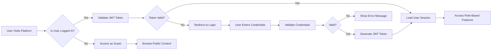
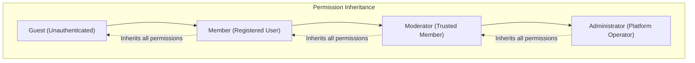

# User Roles and Authentication

## Document Overview

This document defines the complete authentication and authorization system for the economic and political discussion board platform. It establishes the security foundation that protects user accounts, manages access control, and ensures that users can only perform actions appropriate to their role and privileges.

All backend developers implementing any feature of this platform must reference this document to understand authentication requirements, user role capabilities, and permission enforcement rules.

## Authentication System Overview

The discussion board platform implements a role-based access control (RBAC) system with JWT (JSON Web Token) authentication. The authentication system is designed with the following core principles:

- **Security First**: User credentials and sessions are protected using industry-standard security practices
- **Stateless Authentication**: JWT tokens enable scalable, stateless authentication across distributed systems
- **Clear Role Hierarchy**: Four distinct user roles with well-defined permissions and responsibilities
- **User Privacy**: User data is protected and access is controlled based on privacy preferences
- **Graceful Degradation**: Unauthenticated users can browse content without full platform access

### Authentication Flow Overview



## User Registration and Verification

### Registration Process Requirements

#### Registration Workflow

WHEN a new user initiates registration, THE system SHALL collect the following required information:
- Email address (must be unique across the platform)
- Username (must be unique across the platform, 3-20 characters)
- Password (must meet security requirements defined below)
- Agreement to terms of service and community guidelines

THE system SHALL validate all registration inputs before account creation:
- Email must be valid format and not already registered
- Username must contain only alphanumeric characters, hyphens, and underscores
- Username must not contain offensive language or impersonate administrators
- Password must meet minimum security requirements
- All required fields must be completed

WHEN a user submits valid registration information, THE system SHALL:
1. Create a new user account in pending verification status
2. Hash the password using bcrypt with minimum cost factor of 12
3. Generate a unique email verification token
4. Send verification email to the provided email address
5. Return success message instructing user to check email

WHEN a user submits invalid registration information, THE system SHALL:
- Return specific validation error messages for each field
- Not reveal whether an email or username is already taken (security measure to prevent enumeration)
- Preserve valid field entries so user only corrects invalid fields

#### Email Verification Workflow

THE system SHALL send a verification email containing:
- Unique verification token valid for 24 hours
- Link to verification endpoint with token embedded
- Instructions for completing verification
- Resend verification option

WHEN a user clicks the verification link, THE system SHALL:
1. Validate the verification token
2. Check that token has not expired
3. Activate the user account
4. Change user status from pending to active
5. Assign Member role to the user
6. Redirect user to login page with success message

IF a verification token has expired, THEN THE system SHALL:
- Display expiration message
- Provide option to resend verification email
- Generate new verification token when resend is requested

WHEN a user attempts to login with an unverified account, THE system SHALL:
- Deny login access
- Display message indicating email verification is required
- Provide option to resend verification email

#### Registration Validation Rules

THE system SHALL enforce the following validation rules during registration:

**Email Validation**:
- Must match standard email format (user@domain.extension)
- Must be unique across all user accounts
- Maximum length: 255 characters
- Must not contain whitespace

**Username Validation**:
- Minimum length: 3 characters
- Maximum length: 20 characters
- Must contain only: letters (a-z, A-Z), numbers (0-9), hyphens (-), underscores (_)
- Must not start or end with hyphen or underscore
- Must be unique across all user accounts (case-insensitive)
- Must not contain reserved words: admin, moderator, system, bot, official

**Password Validation**:
- Minimum length: 8 characters
- Maximum length: 128 characters
- Must contain at least one uppercase letter
- Must contain at least one lowercase letter
- Must contain at least one number
- Must contain at least one special character (!@#$%^&*()_+-=[]{}|;:,.<>?)

#### Account Activation Rules

WHEN email verification completes successfully, THE system SHALL:
- Set account status to "active"
- Set account role to "member"
- Record activation timestamp
- Enable full member permissions

THE system SHALL prevent unverified accounts from:
- Logging into the platform
- Creating discussion topics
- Posting replies
- Voting on content
- Accessing member-only features

### Registration User Journey Example

**Complete Registration Flow:**

1. User navigates to platform homepage
2. User clicks "Sign Up" or "Register" button
3. System displays registration form with fields: email, username, password, password confirmation, terms acceptance checkbox
4. User enters email: "john.doe@example.com"
5. User enters username: "john_economist"
6. User enters password meeting all requirements
7. User confirms password (must match)
8. User checks "I agree to Terms of Service and Community Guidelines" checkbox
9. User clicks "Create Account" button
10. System validates all inputs:
    - Email format valid and unique ✓
    - Username valid and unique ✓
    - Password meets all complexity requirements ✓
    - Passwords match ✓
    - Terms accepted ✓
11. System creates account in pending status
12. System hashes password with bcrypt
13. System generates verification token: "a1b2c3d4e5f6..."
14. System sends verification email to john.doe@example.com
15. System displays: "Registration successful! Please check your email to verify your account."
16. User checks email inbox
17. User clicks verification link: "https://discussionboard.com/verify?token=a1b2c3d4e5f6..."
18. System validates token (valid, not expired)
19. System activates account and assigns Member role
20. System displays: "Email verified! You can now log in."
21. User redirected to login page
22. User can now log in with email and password

## Login and Session Management

### Login Process

WHEN a user submits login credentials, THE system SHALL:
1. Retrieve user account by email or username
2. Verify account exists and is active
3. Compare submitted password with stored password hash
4. Validate that account is not suspended or banned
5. Check that account email is verified
6. Generate JWT tokens upon successful validation
7. Return access token and refresh token to client

THE system SHALL respond to login attempts within 2 seconds under normal load conditions.

IF login credentials are invalid, THEN THE system SHALL:
- Return error message "Invalid email/username or password"
- Not reveal which credential was incorrect (security measure)
- Log failed login attempt
- Implement rate limiting to prevent brute force attacks

IF an account is suspended or banned, THEN THE system SHALL:
- Deny login access
- Return message indicating account status
- Provide contact information for appeals (if applicable)

#### Failed Login Protection

THE system SHALL implement account lockout protection:

WHEN a user fails 5 consecutive login attempts within 15 minutes, THE system SHALL:
- Temporarily lock the account for 30 minutes
- Send email notification to account owner about lockout
- Require CAPTCHA verification for next login attempt
- Log security event for monitoring

WHEN account lockout period expires, THE system SHALL:
- Automatically unlock the account
- Reset failed login attempt counter
- Allow normal login attempts to resume

### Login User Journey Example

**Successful Login Flow:**

1. User navigates to login page
2. User enters email: "john.doe@example.com"
3. User enters password
4. User clicks "Log In" button
5. System retrieves user account by email
6. System verifies account exists ✓
7. System verifies account status is "active" ✓
8. System verifies email is verified ✓
9. System compares password hash ✓
10. System generates JWT access token (expires in 30 minutes)
11. System generates JWT refresh token (expires in 30 days)
12. System returns tokens to client
13. Client stores access token in memory/localStorage
14. Client stores refresh token in httpOnly cookie
15. User redirected to homepage as authenticated member
16. User can now access all member features

**Failed Login with Account Lockout:**

1. User attempts login with wrong password (Attempt 1) - Failed
2. System increments failed attempt counter (1/5)
3. User attempts login with wrong password (Attempt 2) - Failed
4. System increments failed attempt counter (2/5)
5. User attempts login with wrong password (Attempt 3) - Failed
6. System increments failed attempt counter (3/5)
7. System adds CAPTCHA requirement to login form
8. User attempts login with wrong password (Attempt 4) - Failed
9. System increments failed attempt counter (4/5)
10. User attempts login with wrong password (Attempt 5) - Failed
11. System locks account for 30 minutes
12. System sends email: "Your account was locked due to multiple failed login attempts"
13. User attempts login again - Denied with message: "Account temporarily locked. Try again in 28 minutes."
14. User waits 30 minutes
15. System automatically unlocks account
16. User successfully logs in with correct password

### JWT Token Structure and Management

#### Access Token Specification

THE system SHALL use JWT (JSON Web Token) for authentication with the following structure:

**JWT Header**:
```json
{
  "alg": "HS256",
  "typ": "JWT"
}
```

**JWT Payload (Claims)**:
```json
{
  "userId": "unique-user-identifier",
  "username": "user-display-name",
  "email": "user@example.com",
  "role": "member|moderator|administrator",
  "permissions": ["create_topic", "post_reply", "vote", "..."],
  "iat": 1234567890,
  "exp": 1234569690
}
```

**Required Claims**:
- `userId`: Unique identifier for the user account
- `username`: User's display name
- `email`: User's email address
- `role`: User's current role (member, moderator, administrator)
- `permissions`: Array of specific permissions granted to this role
- `iat` (issued at): Token creation timestamp
- `exp` (expiration): Token expiration timestamp

#### Token Expiration and Refresh Strategy

THE system SHALL implement the following token lifecycle:

**Access Token**:
- Expiration time: 30 minutes from issuance
- Used for: All authenticated API requests
- Storage recommendation: localStorage or sessionStorage
- Validation: Required for every protected endpoint

**Refresh Token**:
- Expiration time: 30 days from issuance
- Used for: Obtaining new access tokens
- Storage recommendation: httpOnly cookie (more secure)
- Validation: Only at refresh endpoint

WHEN an access token expires, THE system SHALL:
- Return 401 Unauthorized status
- Include error message indicating token expiration
- Client should automatically request new access token using refresh token

WHEN a client requests token refresh, THE system SHALL:
1. Validate refresh token signature and expiration
2. Verify user account is still active and not banned
3. Check that refresh token has not been revoked
4. Generate new access token with current user permissions
5. Optionally generate new refresh token (refresh token rotation)
6. Return new tokens to client

IF a refresh token is invalid or expired, THEN THE system SHALL:
- Return 401 Unauthorized status
- Require user to login again with credentials
- Clear any existing session data

#### Token Security Requirements

THE system SHALL protect JWT tokens with the following measures:

- **Secret Key Management**: JWT signing secret must be cryptographically random, minimum 256 bits, stored securely in environment variables
- **HTTPS Only**: All token transmission must occur over HTTPS in production
- **Token Revocation**: System must maintain revocation list for compromised tokens
- **No Sensitive Data**: Tokens must not contain sensitive information like passwords or payment data
- **Signature Validation**: Every token must be validated for authentic signature before trusting claims

WHEN a user logs out, THE system SHALL:
- Add current access token to revocation list
- Add current refresh token to revocation list
- Tokens remain invalid until natural expiration
- Clear client-side token storage

WHEN a user changes password, THE system SHALL:
- Revoke all existing tokens for that user
- Terminate all active sessions
- Require re-login on all devices

### Multi-Device Session Handling

THE system SHALL support concurrent sessions across multiple devices:

- Users can be logged in on multiple devices simultaneously
- Each device receives independent access and refresh tokens
- Logout on one device does not affect other device sessions
- Users can view active sessions in account settings
- Users can remotely terminate specific sessions

WHEN a user views active sessions, THE system SHALL display:
- Device type or browser information
- Last activity timestamp
- IP address (partially masked for privacy)
- Session creation date
- Option to terminate each session

WHEN a user terminates a remote session, THE system SHALL:
- Revoke all tokens associated with that session
- Prevent further API access with those tokens
- Log security event for audit trail

### Session Management User Journey Example

**Token Refresh Flow:**

1. User logged in 25 minutes ago (access token expires in 5 minutes)
2. User performs action requiring authentication
3. Client sends request with access token in Authorization header
4. Access token is still valid - request succeeds
5. User continues browsing for 10 more minutes
6. Access token has now expired
7. User performs another action
8. Client sends request with expired access token
9. Server returns 401 Unauthorized: "Token expired"
10. Client automatically sends refresh token to /auth/refresh endpoint
11. Server validates refresh token (valid, not expired, not revoked)
12. Server generates new access token (expires in 30 minutes)
13. Server returns new access token to client
14. Client retries original request with new access token
15. Request succeeds - user doesn't notice any interruption

**Multi-Device Session Management:**

1. User logs in on Desktop Computer - Session A created
2. User logs in on Mobile Phone - Session B created
3. User logs in on Tablet - Session C created
4. User navigates to Account Settings > Active Sessions
5. System displays:
   - Desktop (Chrome on Windows) - Last active 2 hours ago - IP: 192.168.xxx.xxx - [Revoke]
   - Mobile (Safari on iPhone) - Last active 5 minutes ago - IP: 192.168.xxx.xxx - [Revoke] [Current Session]
   - Tablet (Chrome on iPad) - Last active 1 day ago - IP: 192.168.xxx.xxx - [Revoke]
6. User clicks [Revoke] on Tablet session
7. System invalidates all tokens for Session C
8. System logs security event
9. Tablet is immediately logged out on next request
10. Desktop and Mobile sessions remain active

## User Role Hierarchy

The discussion board platform defines four distinct user roles, each with specific capabilities and responsibilities. Roles form a hierarchy where higher-level roles inherit permissions from lower levels.

### Role Definitions

#### Guest (Unauthenticated User)

**Description**: Visitors who browse the platform without creating an account or logging in.

**Role Characteristics**:
- No authentication required
- Read-only access to public content
- Cannot interact with or create content
- Limited to browsing discussions and viewing public profiles
- No session persistence or personalization

**Purpose**: Guests enable content discovery and encourage registration by showing the value of the platform before commitment.

**Access Level**: Public content only

**Example Guest Actions:**
- Browse discussion topics in Economics and Politics categories
- Read discussion threads and replies
- View vote counts and trending topics
- Search for discussions
- View public user profiles
- Access community guidelines and help pages

**Restricted Guest Actions (Require Login):**
- Cannot create discussion topics
- Cannot post replies
- Cannot vote on content
- Cannot report inappropriate content
- Cannot bookmark or save discussions
- Cannot customize preferences

#### Member (Registered User)

**Description**: Authenticated users who have completed registration and email verification. Members form the core user base and can fully participate in discussions.

**Role Characteristics**:
- Full read and write access to discussions
- Can create topics, post replies, and edit own content
- Can vote on posts and engage with content
- Can customize profile and preferences
- Can report inappropriate content
- Represents standard platform participants

**Transition Requirements**:
- Complete registration process
- Verify email address
- Accept terms of service and community guidelines
- Account must remain in good standing (not suspended/banned)

**Access Level**: Full participation with self-moderation responsibilities

**Example Member Actions:**
- Create new discussion topics with title, content, category, and tags
- Post replies to discussions (including threaded replies)
- Edit own topics and replies within 24-hour window
- Delete own topics (if no replies) and own replies within time limits
- Upvote and downvote content from other users
- Bookmark discussions for later reference
- Report content that violates community guidelines
- Customize profile (bio, avatar, display name)
- Configure notification preferences
- Block other users
- Search with advanced filters
- Follow tags and categories

**Restricted Member Actions (Require Moderator Role):**
- Cannot review moderation queue
- Cannot hide or remove other users' content
- Cannot issue warnings or suspend users
- Cannot lock or pin discussions

#### Moderator (Trusted Community Member)

**Description**: Experienced members elevated to help maintain community standards, review reported content, and enforce guidelines for civil discourse on economic and political topics.

**Role Characteristics**:
- All member permissions plus moderation capabilities
- Can review reported content and take action
- Can hide, remove, or approve flagged posts
- Can issue warnings to users violating guidelines
- Can temporarily suspend users (time-limited)
- Cannot permanently ban users or modify system settings
- Focuses on content quality and community guidelines enforcement

**Transition Requirements**:
- Must be an active member in good standing
- Appointed by administrator based on:
  - Demonstrated understanding of community guidelines
  - History of quality contributions
  - Reputation score above threshold (if applicable)
  - Active participation over minimum time period
- Must accept moderator responsibilities and guidelines

**Access Level**: Content management and user warning capabilities

**Accountability**: Moderator actions are logged and reviewed by administrators

**Example Moderator Actions:**
- Review moderation queue showing reported content
- Hide inappropriate content (makes it invisible to regular users)
- Delete content that violates community guidelines
- Approve content falsely reported
- Issue first, second, or final warnings to users
- Temporarily suspend users for 1-30 days
- Lock discussion topics to prevent further replies
- Move topics to appropriate categories
- Add moderator notes to user accounts
- Pin important discussions to top of categories
- View complete user violation history
- Respond to user appeals for moderation decisions

**Restricted Moderator Actions (Require Administrator Role):**
- Cannot permanently ban users
- Cannot appoint or remove other moderators
- Cannot create or delete categories
- Cannot modify system settings
- Cannot access full audit logs for all moderators

#### Administrator (System Administrator)

**Description**: Platform operators with full system control, ultimate authority over all platform operations, and responsibility for overall platform health and policy.

**Role Characteristics**:
- All moderator and member permissions plus administrative capabilities
- Can appoint and remove moderators
- Can permanently ban users
- Can manage discussion categories and platform structure
- Can configure system settings and policies
- Can access all administrative functions
- Can review and override moderation decisions
- Full access to user management and platform configuration

**Transition Requirements**:
- Designated by platform owner or senior administrator
- Requires highest level of trust and responsibility
- Typically limited to platform operators and senior staff

**Access Level**: Unrestricted platform access and control

**Accountability**: Administrator actions are logged for audit and security purposes

**Example Administrator Actions:**
- Appoint members as moderators
- Remove moderator status from users
- Permanently ban users for severe violations
- Review and reverse moderation decisions on appeal
- Create new discussion categories (e.g., "Trade Policy", "Monetary Theory")
- Edit or delete discussion categories
- Configure platform-wide settings (rate limits, content policies)
- Access comprehensive audit logs for all moderation activity
- View detailed user analytics and platform statistics
- Manage system announcements
- Configure automated content filtering rules
- Override any content restrictions or locks
- Access backend administrative tools
- Export platform data for analysis

**Administrator Responsibilities:**
- Ensure fair and consistent moderation practices
- Review moderator performance and decisions
- Handle complex appeals and edge cases
- Maintain platform security and stability
- Enforce community guidelines at highest level

### Role Hierarchy Diagram



### Role Transition Rules

#### Guest to Member Transition

WHEN a guest completes registration and email verification, THE system SHALL:
- Automatically assign member role
- Grant full member permissions
- Enable authenticated session
- Allow immediate platform participation

THE transition is automatic and requires no administrator approval.

**Transition Example:**
1. Guest completes registration form
2. Guest verifies email by clicking link
3. System immediately assigns "member" role
4. Guest becomes Member with full participation rights
5. Member can now create topics, post replies, vote, etc.

#### Member to Moderator Transition

WHEN an administrator appoints a member as moderator, THE system SHALL:
1. Verify member account is in good standing
2. Update user role to moderator
3. Grant moderator permissions immediately
4. Send notification to user about new role
5. Log role change with administrator identifier and timestamp
6. Provide moderator onboarding information

THE system SHALL allow administrators to remove moderator status:

WHEN an administrator removes moderator privileges, THE system SHALL:
- Downgrade user role to member
- Revoke moderator permissions
- Preserve user's content and contribution history
- Send notification to affected user
- Log role change for audit trail

**Moderator Appointment Example:**

1. Administrator reviews member "jane_policy_expert"
2. Administrator verifies:
   - Member has 500+ reputation points ✓
   - Member has been active for 6+ months ✓
   - Member has demonstrated understanding of guidelines ✓
   - Member has no warnings or violations ✓
3. Administrator clicks "Appoint as Moderator"
4. System updates role from "member" to "moderator"
5. System sends notification: "Congratulations! You've been appointed as a moderator. Please review the moderator guidelines."
6. System grants access to moderation queue
7. Jane can now review reported content and take moderation actions
8. All moderator actions by Jane are logged with her moderator ID

#### Member to Administrator Transition

WHEN a new administrator is designated, THE system SHALL:
1. Verify authorization from existing administrator
2. Update user role to administrator
3. Grant full administrative permissions
4. Send notification to user about new role
5. Log role change with timestamp and authorizing administrator
6. Require immediate password change for security

Administrator role can only be assigned by existing administrators.

**Administrator Appointment Example:**

1. Senior Administrator "admin_chief" reviews moderator "alex_senior_mod"
2. Senior Administrator verifies trust and competency
3. Senior Administrator navigates to User Management > Appoint Administrator
4. System requires confirmation: "This will grant full administrative access. Confirm?"
5. Senior Administrator confirms appointment
6. System updates role from "moderator" to "administrator"
7. System sends notification requiring password change for security
8. Alex must change password before accessing administrator features
9. After password change, Alex has full administrative capabilities
10. Alex can now appoint moderators, ban users, configure system settings, etc.

#### Role Revocation and Demotion

WHEN a user violates community guidelines severely, THE system SHALL support:
- Temporary suspension (maintains role but blocks access)
- Permanent ban (revokes all permissions)
- Role demotion (moderator to member, for example)

WHEN a user is suspended, THE system SHALL:
- Block authentication and session creation
- Preserve user account and content
- Set suspension expiration date (for temporary suspensions)
- Send notification with reason and duration
- Automatically restore access when suspension expires

WHEN a user is permanently banned, THE system SHALL:
- Revoke all permissions and access
- Invalidate all active tokens
- Optionally hide or remove user content (administrator decision)
- Record ban reason and administrator
- Prevent re-registration with same email address

**Role Demotion Example:**

1. Moderator "mod_inactive" has not performed moderation duties for 3 months
2. Administrator reviews moderator activity logs
3. Administrator decides to revoke moderator status
4. Administrator clicks "Revoke Moderator Status" with reason: "Inactive for 3 months"
5. System downgrades role from "moderator" to "member"
6. System revokes access to moderation queue
7. System sends notification: "Your moderator status has been revoked due to inactivity. Thank you for your past service."
8. User retains all member permissions
9. User's past moderation actions remain valid
10. Role change logged in audit trail

## Comprehensive Permission Matrix

The following matrix defines exactly what each role can and cannot do across all platform features. Backend developers must enforce these permissions when implementing any feature.

### Discussion Management Permissions

| Action | Guest | Member | Moderator | Administrator |
|--------|-------|--------|-----------|---------------|
| View public discussions | ✅ | ✅ | ✅ | ✅ |
| Search discussions | ✅ | ✅ | ✅ | ✅ |
| Create discussion topics | ❌ | ✅ | ✅ | ✅ |
| Post replies to discussions | ❌ | ✅ | ✅ | ✅ |
| Edit own topics (within 24 hours) | ❌ | ✅ | ✅ | ✅ |
| Edit own replies (within 24 hours) | ❌ | ✅ | ✅ | ✅ |
| Delete own topics (if no replies) | ❌ | ✅ | ✅ | ✅ |
| Delete own replies | ❌ | ✅ | ✅ | ✅ |
| Edit any user's content | ❌ | ❌ | ❌ | ✅ |
| Delete any user's content | ❌ | ❌ | ✅ | ✅ |
| Hide inappropriate content | ❌ | ❌ | ✅ | ✅ |
| Pin important discussions | ❌ | ❌ | ❌ | ✅ |
| Lock discussions (prevent replies) | ❌ | ❌ | ✅ | ✅ |
| Move topics between categories | ❌ | ❌ | ✅ | ✅ |

### Voting and Engagement Permissions

| Action | Guest | Member | Moderator | Administrator |
|--------|-------|--------|-----------|---------------|
| View vote counts | ✅ | ✅ | ✅ | ✅ |
| Upvote posts | ❌ | ✅ | ✅ | ✅ |
| Downvote posts | ❌ | ✅ | ✅ | ✅ |
| Change vote on a post | ❌ | ✅ | ✅ | ✅ |
| Remove vote from a post | ❌ | ✅ | ✅ | ✅ |
| Favorite/bookmark discussions | ❌ | ✅ | ✅ | ✅ |
| Follow discussion topics | ❌ | ✅ | ✅ | ✅ |
| Receive engagement notifications | ❌ | ✅ | ✅ | ✅ |

### Moderation and Reporting Permissions

| Action | Guest | Member | Moderator | Administrator |
|--------|-------|--------|-----------|---------------|
| Report inappropriate content | ❌ | ✅ | ✅ | ✅ |
| View moderation queue | ❌ | ❌ | ✅ | ✅ |
| Review reported content | ❌ | ❌ | ✅ | ✅ |
| Approve reported content | ❌ | ❌ | ✅ | ✅ |
| Hide reported content | ❌ | ❌ | ✅ | ✅ |
| Remove content permanently | ❌ | ❌ | ✅ | ✅ |
| Issue warnings to users | ❌ | ❌ | ✅ | ✅ |
| Suspend users temporarily | ❌ | ❌ | ✅ | ✅ |
| Ban users permanently | ❌ | ❌ | ❌ | ✅ |
| Review moderation audit log | ❌ | ❌ | ❌ | ✅ |
| Reverse moderation actions | ❌ | ❌ | ❌ | ✅ |

### User Management Permissions

| Action | Guest | Member | Moderator | Administrator |
|--------|-------|--------|-----------|---------------|
| Create user account | ✅ | ✅ | ✅ | ✅ |
| View own profile | ❌ | ✅ | ✅ | ✅ |
| Edit own profile | ❌ | ✅ | ✅ | ✅ |
| View other user profiles | ✅ | ✅ | ✅ | ✅ |
| Change own password | ❌ | ✅ | ✅ | ✅ |
| Block other users | ❌ | ✅ | ✅ | ✅ |
| View blocked users list | ❌ | ✅ | ✅ | ✅ |
| Manage notification preferences | ❌ | ✅ | ✅ | ✅ |
| Appoint moderators | ❌ | ❌ | ❌ | ✅ |
| Remove moderator status | ❌ | ❌ | ❌ | ✅ |
| View all user accounts | ❌ | ❌ | ❌ | ✅ |
| Suspend user accounts | ❌ | ❌ | ✅ | ✅ |
| Ban user accounts | ❌ | ❌ | ❌ | ✅ |
| Delete user accounts | ❌ | ❌ | ❌ | ✅ |

### System Configuration Permissions

| Action | Guest | Member | Moderator | Administrator |
|--------|-------|--------|-----------|---------------|
| View discussion categories | ✅ | ✅ | ✅ | ✅ |
| Create discussion categories | ❌ | ❌ | ❌ | ✅ |
| Edit discussion categories | ❌ | ❌ | ❌ | ✅ |
| Delete discussion categories | ❌ | ❌ | ❌ | ✅ |
| Manage category order/hierarchy | ❌ | ❌ | ❌ | ✅ |
| Configure system settings | ❌ | ❌ | ❌ | ✅ |
| Access admin dashboard | ❌ | ❌ | ❌ | ✅ |
| View platform analytics | ❌ | ❌ | ❌ | ✅ |
| Manage community guidelines | ❌ | ❌ | ❌ | ✅ |

### Permission Enforcement Rules

THE system SHALL enforce permissions as follows:

WHEN a user attempts any action, THE system SHALL:
1. Validate user authentication status and token
2. Retrieve user's current role from JWT payload
3. Check permission matrix for role and requested action
4. Grant or deny access based on permission rules
5. Return appropriate success or error response

IF a user attempts an action without permission, THEN THE system SHALL:
- Return 403 Forbidden status code
- Include error message "You do not have permission to perform this action"
- Log unauthorized access attempt for security monitoring
- Not reveal system information or permission structure

THE system SHALL validate permissions server-side for every request:
- Client-side permission checks are for UX only (hiding buttons)
- All security enforcement happens on backend
- Tokens cannot be trusted without server validation
- Permission checks occur before any data modification

### Permission Enforcement Example

**Example: Member Attempting to Delete Another User's Post**

1. Member "user_bob" views discussion post created by "user_alice"
2. Bob clicks "Delete" on Alice's post
3. Client sends DELETE request to /api/posts/{post_id}
4. Server receives request with Bob's JWT token
5. Server validates JWT token signature ✓
6. Server extracts role from token: "member"
7. Server identifies action: "delete_other_user_content"
8. Server checks permission matrix: Member → Delete any user's content → ❌
9. Server returns 403 Forbidden
10. Server includes error: "You do not have permission to perform this action"
11. Server logs unauthorized attempt: "User bob (member) attempted to delete post {post_id} owned by alice"
12. Client displays error message to Bob
13. Bob cannot delete Alice's post

**Example: Moderator Hiding Inappropriate Content**

1. Moderator "mod_sarah" reviews reported content in moderation queue
2. Sarah determines content violates community guidelines
3. Sarah clicks "Hide Content"
4. Client sends POST request to /api/moderation/hide/{post_id}
5. Server receives request with Sarah's JWT token
6. Server validates JWT token signature ✓
7. Server extracts role from token: "moderator"
8. Server identifies action: "hide_inappropriate_content"
9. Server checks permission matrix: Moderator → Hide inappropriate content → ✅
10. Server processes hide action
11. Server marks content as hidden
12. Server logs moderation action: "Moderator mod_sarah hid post {post_id} - reason: {violation}"
13. Server returns success response
14. Content becomes invisible to regular members
15. Sarah sees confirmation: "Content hidden successfully"

## Password Security Requirements

### Password Complexity Rules

THE system SHALL enforce the following password requirements during registration and password changes:

**Minimum Requirements**:
- Length: 8-128 characters
- Must include at least one uppercase letter (A-Z)
- Must include at least one lowercase letter (a-z)
- Must include at least one number (0-9)
- Must include at least one special character from: !@#$%^&*()_+-=[]{}|;:,.<>?

WHEN a user submits a password that does not meet requirements, THE system SHALL:
- Reject the password
- Return specific validation messages indicating which requirements are not met
- Require user to submit compliant password

THE system SHALL prevent commonly compromised passwords:
- Maintain list of common/breached passwords (e.g., top 10,000 most common)
- Check submitted passwords against this list
- Reject passwords found in common password lists
- Encourage users to use unique, strong passwords

**Password Validation Examples:**

Valid passwords:
- "Tr0ub4dor&3" ✓ (meets all requirements)
- "MyP@ssw0rd123" ✓ (meets all requirements)
- "Econ0mics!Policy" ✓ (meets all requirements)

Invalid passwords:
- "password" ❌ (no uppercase, no number, no special character)
- "PASSWORD123" ❌ (no lowercase, no special character)
- "MyPassword!" ❌ (no number)
- "Pass1!" ❌ (too short, less than 8 characters)
- "Password123!" ❌ (common password, rejected)

### Password Storage and Hashing

THE system SHALL protect stored passwords using industry-standard hashing:

**Hashing Requirements**:
- Algorithm: bcrypt
- Cost factor: Minimum 12 (configurable for future increases)
- Automatic salt generation (bcrypt handles this)
- Never store passwords in plain text
- Never store reversibly encrypted passwords

WHEN a user registers or changes password, THE system SHALL:
1. Validate password meets complexity requirements
2. Hash password using bcrypt with configured cost factor
3. Store only the hash in the database
4. Discard plain text password from memory immediately
5. Never log or transmit plain text password

WHEN a user attempts to login, THE system SHALL:
1. Retrieve stored password hash for user
2. Hash submitted password with bcrypt
3. Compare hashes using constant-time comparison
4. Grant or deny access based on match
5. Never expose password hash to client

### Password Change Process

THE system SHALL allow authenticated users to change their password:

WHEN a user initiates password change, THE system SHALL require:
- Current password for verification (prevents unauthorized changes if session compromised)
- New password meeting all complexity requirements
- New password confirmation (must match new password)

THE password change process SHALL:
1. Verify user is authenticated with valid session
2. Validate current password matches stored hash
3. Verify new password meets all requirements
4. Verify new password differs from current password
5. Hash new password using bcrypt
6. Update stored password hash
7. Revoke all existing JWT tokens for this user
8. Terminate all active sessions
9. Send email notification about password change
10. Require user to login again with new password

IF current password verification fails, THEN THE system SHALL:
- Reject password change request
- Return error message "Current password is incorrect"
- Log failed password change attempt
- Rate limit password change attempts to prevent brute force

**Password Change User Journey:**

1. Member "emily_user" navigates to Account Settings > Security
2. Emily clicks "Change Password"
3. System displays password change form
4. Emily enters current password: "OldP@ssw0rd123"
5. Emily enters new password: "NewSecur3P@ss!"
6. Emily confirms new password: "NewSecur3P@ss!"
7. Emily clicks "Change Password"
8. System verifies current password matches stored hash ✓
9. System validates new password meets all requirements ✓
10. System verifies new password ≠ current password ✓
11. System hashes new password with bcrypt
12. System updates password hash in database
13. System revokes all Emily's existing JWT tokens
14. System terminates all active sessions (desktop, mobile, tablet)
15. System sends email to emily@example.com: "Your password was changed at [timestamp] from [IP address]"
16. System displays: "Password changed successfully. Please log in again."
17. Emily redirected to login page
18. Emily logs in with new password
19. New session created with fresh tokens

### Password Security Best Practices

THE system SHALL implement additional password security measures:

**Password Age and Rotation**:
- Passwords do not expire automatically (forced expiration discouraged by modern security standards)
- Users can change password at any time
- System encourages password changes if breach detected

**Breach Detection**:
- Check passwords against known breach databases during registration
- Notify users if their password appears in breach data
- Encourage immediate password change if breach detected

**Security Notifications**:
WHEN password is changed, THE system SHALL send email notification containing:
- Timestamp of password change
- IP address and device information
- Warning that if user did not make this change, they should contact support
- Link to secure password reset if unauthorized change detected

## Account Recovery Process

### Forgot Password Workflow

THE system SHALL provide secure password recovery for users who forget their password:

WHEN a user requests password reset, THE system SHALL:
1. Accept email address as identifier
2. Verify account exists (but do not reveal whether account exists to prevent enumeration)
3. Generate cryptographically random reset token
4. Store token hash with expiration timestamp (15 minutes validity)
5. Send password reset email if account exists
6. Always return success message regardless of account existence (security measure)

THE password reset email SHALL contain:
- Unique password reset link with embedded token
- Token expiration time (15 minutes)
- Warning not to share link with anyone
- Note that link can only be used once
- Information about ignoring email if not requested

WHEN a user clicks password reset link, THE system SHALL:
1. Validate reset token format and signature
2. Check token has not expired
3. Check token has not been used previously
4. Display password reset form if token valid
5. Display error message if token invalid or expired

WHEN a user submits new password via reset form, THE system SHALL:
1. Validate token again (ensure still valid)
2. Verify new password meets complexity requirements
3. Hash new password using bcrypt
4. Update user's password hash
5. Mark reset token as used (prevent reuse)
6. Revoke all existing JWT tokens for this user
7. Send confirmation email that password was reset
8. Redirect user to login page

**Password Reset User Journey:**

1. User "forgetful_user" navigates to login page
2. User clicks "Forgot Password?" link
3. System displays password reset request form
4. User enters email: "forgetful@example.com"
5. User clicks "Send Reset Link"
6. System checks if account exists for that email
7. System generates reset token: "abc123def456..."
8. System stores token hash with 15-minute expiration
9. System sends email to forgetful@example.com with reset link
10. System displays: "If an account exists for that email, a password reset link has been sent."
11. User checks email inbox
12. User clicks reset link: "https://discussionboard.com/reset-password?token=abc123def456..."
13. System validates token (valid, not expired, not used) ✓
14. System displays password reset form
15. User enters new password: "MyNewP@ssw0rd99"
16. User confirms new password: "MyNewP@ssw0rd99"
17. User clicks "Reset Password"
18. System validates password meets requirements ✓
19. System hashes new password with bcrypt
20. System updates password in database
21. System marks reset token as used
22. System revokes all existing sessions
23. System sends confirmation email: "Your password was reset"
24. System displays: "Password reset successful! Please log in."
25. User redirected to login page
26. User logs in with new password

### Password Reset Security Measures

THE system SHALL protect password reset from abuse:

**Token Security**:
- Tokens are cryptographically random (minimum 32 bytes)
- Tokens stored as hashes (not plain text)
- Tokens expire after 15 minutes
- Tokens can only be used once
- Tokens invalidated when new reset requested

**Rate Limiting**:
WHEN password reset is requested, THE system SHALL:
- Limit to 3 reset requests per email address per hour
- Limit to 10 reset requests per IP address per hour
- Return error if rate limit exceeded
- Log excessive reset requests for security monitoring

**Email Enumeration Prevention**:
THE system SHALL not reveal whether email address exists:
- Always return success message after reset request
- Send email only if account exists
- Response time should be constant regardless of account existence
- Error messages should not indicate account existence

**Security Notifications**:
WHEN password reset completes, THE system SHALL:
- Send confirmation email to account email address
- Include timestamp and IP address of reset
- Warn user to contact support if reset was unauthorized
- Provide link to re-secure account if compromised

### Account Recovery for Lost Email Access

IF a user loses access to registered email address, THEN THE system SHALL:
- Require user to contact platform support
- Verify user identity through alternative means
- Administrator manually updates email address after verification
- Send confirmation to both old and new email addresses
- Log email address change for security audit

THE system SHALL not provide automated email address changes (security risk).

**Lost Email Access Example:**

1. User "locked_out" no longer has access to registered email: "old@example.com"
2. User cannot receive password reset emails
3. User contacts platform support: support@discussionboard.com
4. Support team requests identity verification:
   - Username
   - Account creation date (approximate)
   - Recent discussion topics created
   - Security questions (if configured)
5. User provides verification information
6. Support team validates identity
7. Administrator manually updates email to "new@example.com"
8. Administrator logs change: "Email updated for locked_out from old@example.com to new@example.com - verified by support ticket #12345"
9. System sends notification to old@example.com: "Email address was changed"
10. System sends notification to new@example.com: "This email is now associated with your account"
11. User can now use password reset with new email address

## Session Security and Best Practices

### Secure Session Management

THE system SHALL implement secure session handling:

**Session Creation**:
WHEN a user successfully logs in, THE system SHALL:
- Generate unique session identifier
- Create JWT access and refresh tokens
- Store minimal session data server-side (token revocation list)
- Set secure session cookies if using cookie-based auth
- Record session metadata (IP address, user agent, timestamp)

**Session Validation**:
WHEN processing any authenticated request, THE system SHALL:
- Validate JWT signature and expiration
- Check token not in revocation list
- Verify user account still active and not banned
- Confirm user role has permission for requested action
- Reject request if any validation fails

**Session Termination**:
WHEN a user logs out, THE system SHALL:
- Add tokens to revocation list
- Clear client-side token storage
- Terminate server-side session
- Return success confirmation

### Security Event Logging

THE system SHALL log security-relevant events for audit and monitoring:

**Events to Log**:
- User registration and email verification
- Successful and failed login attempts
- Password changes and resets
- Role changes and permission grants
- Account suspensions and bans
- Token revocations and session terminations
- Failed permission checks and unauthorized access attempts
- Moderator and administrator actions

**Log Entry Requirements**:
Each security log entry SHALL include:
- Timestamp (UTC)
- Event type and description
- User identifier (if applicable)
- IP address and user agent
- Result (success/failure)
- Additional context (e.g., failed login reason)

**Log Protection**:
THE system SHALL protect security logs:
- Only administrators can access security logs
- Logs stored securely and cannot be modified
- Logs retained for minimum 90 days
- Sensitive data (passwords, tokens) never logged

**Security Logging Examples:**

Example log entries:
```
[2024-01-15 14:23:45 UTC] EVENT:LOGIN_SUCCESS | USER:john_economist | IP:192.168.1.100 | AGENT:Chrome/120.0 | RESULT:SUCCESS
[2024-01-15 14:25:12 UTC] EVENT:LOGIN_FAILED | USER:jane_policy | IP:192.168.1.101 | AGENT:Firefox/121.0 | RESULT:INVALID_PASSWORD | ATTEMPT:3/5
[2024-01-15 14:30:00 UTC] EVENT:ACCOUNT_LOCKED | USER:jane_policy | IP:192.168.1.101 | REASON:FAILED_LOGIN_ATTEMPTS | DURATION:30_MINUTES
[2024-01-15 15:00:00 UTC] EVENT:PASSWORD_CHANGED | USER:emily_user | IP:192.168.1.102 | AGENT:Safari/17.0 | RESULT:SUCCESS
[2024-01-15 15:05:30 UTC] EVENT:ROLE_CHANGE | USER:alex_mod | FROM:member | TO:moderator | CHANGED_BY:admin_chief | RESULT:SUCCESS
[2024-01-15 15:10:00 UTC] EVENT:UNAUTHORIZED_ACCESS | USER:bob_member | ACTION:delete_user_content | TARGET:post_12345 | RESULT:DENIED | ROLE:member
```

### Authentication Best Practices Summary

Backend developers implementing authentication SHALL:

1. **Always validate tokens server-side** - Never trust client-side permission checks
2. **Use HTTPS in production** - All authentication must occur over encrypted connections
3. **Implement rate limiting** - Prevent brute force attacks on login and password reset
4. **Hash passwords with bcrypt** - Never store or transmit plain text passwords
5. **Validate JWT signatures** - Ensure tokens have not been tampered with
6. **Check token revocation** - Verify tokens not in revocation list
7. **Enforce permission matrix** - Every action must check role permissions
8. **Log security events** - Maintain audit trail for security monitoring
9. **Fail securely** - Deny access by default, grant only when explicitly permitted
10. **Protect against enumeration** - Do not reveal account existence in error messages

## Conclusion

This User Roles and Authentication document provides comprehensive requirements for implementing a secure, role-based authentication and authorization system for the economic and political discussion board platform. The system ensures:

- **Secure user registration** with email verification and strong password requirements
- **Protected login process** with brute-force protection and account lockout
- **JWT-based session management** with access and refresh token lifecycle
- **Clear role hierarchy** with four distinct roles: Guest, Member, Moderator, Administrator
- **Comprehensive permission matrix** defining exact capabilities for each role
- **Strong password security** using bcrypt hashing and complexity requirements
- **Secure account recovery** with time-limited, single-use reset tokens
- **Detailed security event logging** for audit and monitoring
- **Multi-device session support** with remote session management

Backend developers have complete specifications for implementing authentication while maintaining flexibility in technical implementation choices. All requirements are expressed in clear, natural language with EARS format where applicable, focusing on business logic and security outcomes rather than prescriptive technical solutions.

---

> *Developer Note: This document defines **business requirements only**. All technical implementations (architecture, APIs, database design, etc.) are at the discretion of the development team.*
