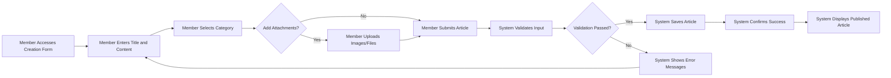
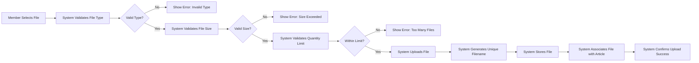
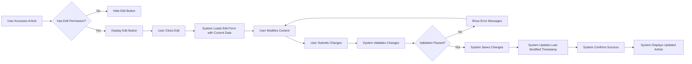
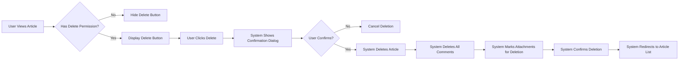

# Article Management Requirements

## 1. Introduction and Scope

### 1.1 Document Purpose

This document defines the complete business requirements for article management in the discussion board system. It specifies how users create, read, update, delete, and organize articles focused on economic and political discussions.

### 1.2 Article Management Overview

Articles are the primary content type in the discussion board. Members create articles to share their thoughts, analyses, and discussions on economic and political topics. Each article consists of text content, optional images, optional file attachments, and metadata such as title, author, category, and tags.

The article management system must support article creation with rich text content, multiple image attachments per article, multiple file attachments documents per article, article editing by owners and moderators, article deletion with appropriate permissions, categorization and tagging for organization, and efficient listing and pagination.

### 1.3 Relationship to Overall System

Article management is central to the discussion board system. It connects to the user authentication system which determines who can create edit and delete articles, the comment system where articles serve as parent entities for user comments, the file storage system which manages image and document attachments, the search system enabling content discovery, and the moderation system allowing content oversight and quality control. For detailed user actor permissions see the User Actors and Authentication document.

## 2. Article Structure and Data Model

### 2.1 Article Fields and Properties

Each article in the system contains core identification information including article ID as a unique system-generated identifier, creation timestamp indicating when the article was first created, last modified timestamp showing when the article was last edited, and author ID referencing the member who created the article.

Content fields include the article title which is the article headline and required, body content representing the main article text and also required, category indicating the primary topic area and required, tags providing additional topic keywords and optional, and summary or excerpt offering a brief article description which is optional.

Attachment references include image attachments as a list of attached image files and file attachments as a list of attached document files. Metadata includes view count showing the number of times the article has been viewed, comment count indicating the number of comments on the article, and status representing the publication status such as draft published archived or deleted.

### 2.2 Required vs Optional Information

Required for article creation are title with minimum 5 characters and maximum 200 characters, body content with minimum 20 characters and maximum 50000 characters, category which must be selected from predefined categories, and author information which is automatically captured from authenticated user.

Optional for article creation are tags with up to 5 tags per article, summary or excerpt with maximum 500 characters, image attachments from 0 to 10 images, and file attachments from 0 to 5 files.

### 2.3 Content Constraints

THE system SHALL enforce the following content constraints.

For title requirements WHEN a user creates or edits an article THE system SHALL require a title between 5 and 200 characters. THE system SHALL trim leading and trailing whitespace from titles. THE system SHALL prevent titles consisting only of special characters or numbers.

For body content requirements WHEN a user creates or edits an article THE system SHALL require body content between 20 and 50000 characters. THE system SHALL preserve paragraph breaks and basic formatting. THE system SHALL sanitize HTML input to prevent security vulnerabilities.

For category requirements THE system SHALL provide predefined categories including Economic Policy, Political Analysis, International Trade, Fiscal Policy, Monetary Policy, Electoral Politics, Public Policy, Economic Theory, Political Theory, and General Discussion. WHEN a user creates an article THE system SHALL require selection of exactly one category. THE system SHALL allow category changes when editing articles.

For tag requirements THE system SHALL support optional tags with maximum 5 tags per article. WHEN a user adds tags THE system SHALL enforce tag length between 2 and 30 characters per tag. THE system SHALL convert tags to lowercase for consistency. THE system SHALL trim whitespace from tags.

## 3. Article Creation Requirements

### 3.1 Article Creation Workflow

The article creation process follows this business flow. First the member accesses the article creation interface. Second the member enters required information including title body and category. Third the member optionally adds tags images and file attachments. Fourth the member optionally provides summary or excerpt. Fifth the member submits the article for publication. Sixth the system validates all input. Seventh the system saves article and attachments. Eighth the system confirms successful creation. Ninth the system displays the published article to the member.

The following diagram illustrates the article creation workflow:

### 3.2 User Permissions for Article Creation

For member permissions WHEN a member is authenticated THE system SHALL allow article creation. THE system SHALL automatically assign the authenticated member as the article author. THE system SHALL record the creation timestamp automatically.

For guest restrictions WHEN a guest attempts to access article creation THE system SHALL redirect to login page. THE system SHALL display a message indicating registration is required to create articles.

For moderator permissions WHEN a moderator creates an article THE system SHALL apply the same creation rules as regular members. THE system SHALL identify the moderator as the author not as a special moderator-created article.

### 3.3 Article Creation Validation Rules

THE system SHALL validate article creation with the following requirements.

For authentication validation WHEN a user attempts to create an article THE system SHALL verify the user is authenticated as a member or moderator. IF the user is not authenticated THEN THE system SHALL reject the creation request with error code AUTH_REQUIRED.

For title validation WHEN a user submits an article THE system SHALL validate the title is between 5 and 200 characters. IF the title is too short THEN THE system SHALL return error Title must be at least 5 characters. IF the title is too long THEN THE system SHALL return error Title cannot exceed 200 characters. IF the title contains only whitespace THEN THE system SHALL return error Title cannot be empty.

For body content validation WHEN a user submits an article THE system SHALL validate body content is between 20 and 50000 characters. IF the body is too short THEN THE system SHALL return error Article content must be at least 20 characters. IF the body is too long THEN THE system SHALL return error Article content cannot exceed 50000 characters. IF the body contains only whitespace THEN THE system SHALL return error Article content cannot be empty.

For category validation WHEN a user submits an article THE system SHALL validate a category is selected. IF no category is selected THEN THE system SHALL return error Please select a category. IF an invalid category is provided THEN THE system SHALL return error Invalid category selected.

For tag validation WHEN a user provides tags THE system SHALL validate no more than 5 tags are included. IF more than 5 tags are provided THEN THE system SHALL return error Maximum 5 tags allowed. WHEN a user provides a tag THE system SHALL validate each tag is between 2 and 30 characters. IF a tag is too short or too long THEN THE system SHALL return error Each tag must be between 2 and 30 characters.

For attachment validation WHEN a user uploads images THE system SHALL validate no more than 10 images are attached. WHEN a user uploads files THE system SHALL validate no more than 5 files are attached.

### 3.4 Article Creation Response

For successful creation WHEN article creation is successful THE system SHALL return the complete article information including generated article ID. THE system SHALL return HTTP 201 Created status. THE system SHALL include the article URL in the response. THE system SHALL set initial view count to 0. THE system SHALL set initial comment count to 0. THE system SHALL set status to published.

For failed creation WHEN article creation fails validation THE system SHALL return HTTP 400 Bad Request. THE system SHALL include specific error messages for each validation failure. THE system SHALL preserve user input so members can correct errors without re-entering all information. WHEN article creation fails due to server error THE system SHALL return HTTP 500 Internal Server Error. THE system SHALL log server errors for administrator review.

### 3.5 Draft and Publish Behavior

For initial implementation using the simple approach THE system SHALL publish all created articles immediately. THE system SHALL not support draft functionality in the initial version.

For future consideration WHERE draft functionality is implemented THE system SHALL allow members to save articles without publishing. WHERE draft functionality exists THE system SHALL allow members to edit drafts before publication. WHERE draft functionality exists THE system SHALL allow members to list their draft articles separately from published articles.

## 4. Image and File Attachment Requirements

### 4.1 Supported File Types

THE system SHALL support the following attachment types.

For image attachments the system supports JPEG/JPG format with extensions jpg and jpeg, PNG format with extension png, GIF format with extension gif, and WebP format with extension webp.

For document attachments the system supports PDF documents with extension pdf, Microsoft Word documents with extensions doc and docx, plain text files with extension txt, and Markdown files with extension md.

### 4.2 File Type Validation

For image file validation WHEN a user uploads an image THE system SHALL validate the file extension matches supported image types. WHEN a user uploads an image THE system SHALL validate the file MIME type matches the extension. IF an unsupported image type is uploaded THEN THE system SHALL return error Unsupported image format Please upload JPEG PNG GIF or WebP images.

For document file validation WHEN a user uploads a document THE system SHALL validate the file extension matches supported document types. WHEN a user uploads a document THE system SHALL validate the file MIME type matches the extension. IF an unsupported document type is uploaded THEN THE system SHALL return error Unsupported file format Please upload PDF Word TXT or Markdown files.

### 4.3 Attachment Limits

For quantity limits THE system SHALL allow up to 10 image attachments per article. THE system SHALL allow up to 5 document attachments per article. WHEN a user attempts to exceed image limit THE system SHALL return error Maximum 10 images allowed per article. WHEN a user attempts to exceed document limit THE system SHALL return error Maximum 5 files allowed per article.

For size limits THE system SHALL enforce maximum 5 MB per image file. THE system SHALL enforce maximum 10 MB per document file. THE system SHALL enforce maximum 100 MB total attachments per article meaning all images and files combined. WHEN an image exceeds 5 MB THE system SHALL return error Image file size cannot exceed 5 MB. WHEN a document exceeds 10 MB THE system SHALL return error Document file size cannot exceed 10 MB. WHEN total attachments exceed 100 MB THE system SHALL return error Total attachment size cannot exceed 100 MB.

### 4.4 Attachment Upload Process

The following diagram shows the upload workflow:

For upload requirements WHEN a member uploads an attachment THE system SHALL validate the file before accepting it. WHEN validation passes THE system SHALL generate a unique filename to prevent conflicts. THE system SHALL store the original filename for display purposes. THE system SHALL calculate and store file size. THE system SHALL record upload timestamp. WHEN upload is successful THE system SHALL confirm success to the user. WHEN upload fails THE system SHALL provide specific error messages.

### 4.5 Image Processing Requirements

For image handling WHEN an image is uploaded THE system SHALL preserve the original image. THE system SHALL generate a thumbnail version with maximum 200x200 pixels maintaining aspect ratio. THE system SHALL generate a medium version with maximum 800x800 pixels maintaining aspect ratio. THE system SHALL optimize images for web display while maintaining acceptable quality.

For image metadata THE system SHALL extract and store image dimensions including width and height. THE system SHALL store image file size. THE system SHALL store image format.

### 4.6 Attachment Display Requirements

For image display WHEN displaying an article THE system SHALL show thumbnail versions of attached images. WHEN a user clicks an image thumbnail THE system SHALL display the full-size image. THE system SHALL display images in the order they were uploaded. THE system SHALL show image filename below each image.

For document display WHEN displaying an article THE system SHALL list document attachments with filenames. THE system SHALL display file size next to each document. THE system SHALL display file type icon for each document. WHEN a user clicks a document THE system SHALL initiate download or display depending on file type and browser capability.

### 4.7 Attachment Management During Editing

For adding attachments to existing articles WHEN a member edits their article THE system SHALL allow adding new attachments. THE system SHALL apply the same validation rules as initial creation. THE system SHALL enforce the total attachment limits including existing attachments.

For removing attachments WHEN a member edits their article THE system SHALL allow removing existing attachments. WHEN an attachment is removed THE system SHALL mark the file for deletion. THE system SHALL permanently delete removed attachment files after successful article update. IF article update fails THEN THE system SHALL retain all attachments.

For replacing attachments THE system SHALL support removing old attachments and adding new ones in the same edit operation. THE system SHALL not support direct replacement meaning users must remove then add.

### 4.8 Attachment Access Control

For viewing attachments WHEN any user including guest member or moderator views an article THE system SHALL allow access to all article attachments. THE system SHALL generate secure URLs for attachment access. THE system SHALL validate attachment access requests to prevent unauthorized direct file access.

For attachment security THE system SHALL prevent directory traversal attacks in attachment URLs. THE system SHALL validate all attachment requests match existing article attachments. THE system SHALL scan uploaded files for malware and viruses. IF malware is detected THEN THE system SHALL reject the upload and notify the user.

## 5. Article Reading and Display

### 5.1 Article Viewing Requirements

For guest viewing WHEN a guest accesses an article URL THE system SHALL display the complete article content. THE system SHALL display all article fields including title author name creation date category tags body content and attachments. THE system SHALL display article images and file attachments. THE system SHALL increment the view count.

For member viewing WHEN a member accesses an article THE system SHALL display the article with the same information as guests. WHERE the member is the article author THE system SHALL display edit and delete options.

For moderator viewing WHEN a moderator accesses an article THE system SHALL display edit and delete options regardless of authorship. THE system SHALL indicate moderator-specific actions visually.

### 5.2 Article Display Format

For article header THE system SHALL display the article title prominently at the top. THE system SHALL display the author username below the title. THE system SHALL display the publication date in human-readable format such as January 15 2025 or 2 days ago. THE system SHALL display the category as a clickable element. WHERE tags exist THE system SHALL display tags as clickable elements.

For article body THE system SHALL display the full article body content with preserved formatting. THE system SHALL render paragraph breaks. THE system SHALL convert URLs in content to clickable links. THE system SHALL sanitize and safely render user-submitted content.

For article attachments THE system SHALL display image attachments in a gallery format below the article body. THE system SHALL display document attachments as a downloadable list below images. THE system SHALL show file metadata including filename size and type for each attachment.

For article footer THE system SHALL display view count. THE system SHALL display comment count. THE system SHALL display last modified date if different from creation date.

### 5.3 Article URL Structure

For URL format THE system SHALL provide clean readable URLs for articles. THE system SHALL include the article ID in the URL for uniqueness. THE system SHALL optionally include slugified title for readability. Example URL format is /articles/{article-id}/{title-slug} or /articles/{article-id}.

For URL behavior WHEN a user accesses an article URL THE system SHALL load and display the article. IF the article does not exist THEN THE system SHALL return HTTP 404 Not Found. IF the article is deleted THEN THE system SHALL return HTTP 410 Gone or redirect to article list.

### 5.4 View Count Tracking

For view count increment WHEN a user accesses an article THE system SHALL increment the view count by 1. THE system SHALL increment view count for all user types including guest member and moderator. THE system SHALL increment view count on each page load.

For view count display THE system SHALL display view count on the article page. THE system SHALL display view count in article lists. THE system SHALL format large view counts for readability such as 1.2K views or 15K views.

For future consideration WHERE more sophisticated analytics are needed THE system SHALL track unique views per user. WHERE view tracking is enhanced THE system SHALL prevent author own views from inflating count.

### 5.5 Performance Expectations for Article Display

For loading time WHEN a user accesses an article THE system SHALL load and display the article within 2 seconds under normal network conditions. WHEN an article has many images THE system SHALL use lazy loading to prioritize content display. THE system SHALL load article text and metadata before loading all attachment thumbnails.

For image loading THE system SHALL display image placeholders while images are loading. THE system SHALL load thumbnail versions first then full-size images on demand. THE system SHALL optimize image delivery for fast loading.

## 6. Article Editing Requirements

### 6.1 Edit Permission Rules

For author edit permissions WHEN a member is the article author THE system SHALL allow editing the article. THE system SHALL allow editing at any time after publication with no time restrictions in initial version.

For moderator edit permissions WHEN a moderator accesses any article THE system SHALL allow editing regardless of authorship. THE system SHALL log moderator edits for audit purposes. THE system SHALL optionally notify the original author when a moderator edits their article.

For guest edit restrictions WHEN a guest attempts to access article edit functionality THE system SHALL deny access. THE system SHALL redirect to login page with message Please log in to edit articles.

### 6.2 Article Editing Workflow

The following diagram shows the edit process:

### 6.3 Editable Fields

Fields that can be edited include title, body content, category, tags, summary or excerpt, image attachments meaning users can add new or remove existing, and file attachments meaning users can add new or remove existing.

Fields that cannot be edited include article ID which is system-generated and immutable, author because ownership cannot be transferred, creation timestamp which is a historical record, view count which is system-managed, and comment count which is system-managed.

### 6.4 Edit Validation Rules

THE system SHALL apply the same validation rules during editing as during creation.

For title validation WHEN a user edits an article title THE system SHALL validate the title is between 5 and 200 characters. THE system SHALL apply the same title validation rules as article creation.

For body content validation WHEN a user edits article body THE system SHALL validate content is between 20 and 50000 characters. THE system SHALL apply the same body validation rules as article creation.

For category validation WHEN a user changes article category THE system SHALL validate the category exists. THE system SHALL require a category selection.

For tag validation WHEN a user modifies tags THE system SHALL enforce maximum 5 tags. THE system SHALL validate each tag is between 2 and 30 characters.

For attachment validation WHEN a user adds attachments during edit THE system SHALL apply attachment validation rules. THE system SHALL enforce total attachment limits including existing attachments.

### 6.5 Last Modified Timestamp

For timestamp update WHEN an article is successfully edited THE system SHALL update the last modified timestamp to the current time. THE system SHALL preserve the original creation timestamp. WHEN displaying an article THE system SHALL show both creation date and last modified date if they differ.

For display logic IF last modified is same as creation date THEN THE system SHALL display only Published on date. IF last modified is different from creation date THEN THE system SHALL display Published on creation-date Last updated on modified-date.

### 6.6 Edit History and Versioning

For initial implementation THE system SHALL not track edit history in the initial version. THE system SHALL only maintain the current version of the article. THE system SHALL update the last modified timestamp on each edit.

For future consideration WHERE edit history is implemented THE system SHALL store previous versions of articles. WHERE edit history exists THE system SHALL allow viewing previous versions. WHERE edit history exists THE system SHALL show who made each edit and when.

### 6.7 Concurrent Edit Handling

For conflict prevention WHEN a user opens an article for editing THE system SHALL load the current article state. WHEN a user submits edits THE system SHALL save the changes. THE system SHALL not implement optimistic locking in the initial version meaning last edit wins.

For future consideration WHERE concurrent edit protection is needed THE system SHALL detect if the article was modified by another user since edit began. WHERE conflicts are detected THE system SHALL notify the user and provide options to review conflicts.

### 6.8 Edit Confirmation and Response

For successful edit WHEN article edit is successful THE system SHALL return HTTP 200 OK. THE system SHALL include the updated article in the response. THE system SHALL display a success message Article updated successfully. THE system SHALL redirect to the updated article view.

For failed edit WHEN article edit fails validation THE system SHALL return HTTP 400 Bad Request. THE system SHALL include specific error messages for each validation failure. THE system SHALL preserve user input to allow corrections. WHEN edit fails due to permission denial THE system SHALL return HTTP 403 Forbidden. WHEN edit fails due to article not found THE system SHALL return HTTP 404 Not Found.

## 7. Article Deletion Requirements

### 7.1 Deletion Permission Rules

For author deletion permissions WHEN a member is the article author THE system SHALL allow deleting the article. THE system SHALL allow deletion at any time after publication.

For moderator deletion permissions WHEN a moderator accesses any article THE system SHALL allow deletion regardless of authorship. THE system SHALL log moderator deletions for audit purposes. THE system SHALL optionally notify the original author when a moderator deletes their article.

For guest deletion restrictions WHEN a guest attempts to delete an article THE system SHALL deny access. THE system SHALL return HTTP 403 Forbidden with message Authentication required.

### 7.2 Deletion Workflow

The following diagram shows the deletion process:

### 7.3 Deletion Confirmation

For confirmation requirement WHEN a user initiates article deletion THE system SHALL require explicit confirmation. THE system SHALL display a warning message Are you sure you want to delete this article This action cannot be undone. THE system SHALL show the article title in the confirmation dialog. THE system SHALL provide Cancel and Delete options. WHEN a user cancels THE system SHALL abort the deletion and return to the article view.

### 7.4 Cascade Deletion Rules

For article deletion effects WHEN an article is deleted THE system SHALL delete all comments associated with the article. WHEN an article is deleted THE system SHALL delete all image attachments. WHEN an article is deleted THE system SHALL delete all file attachments. THE system SHALL remove all database records related to the article.

For deletion atomicity THE system SHALL perform article deletion as an atomic operation. IF any part of deletion fails THEN THE system SHALL rollback all changes. THE system SHALL ensure data consistency after deletion.

### 7.5 Soft Delete vs Hard Delete

For initial implementation using hard delete THE system SHALL permanently delete articles and all associated data. THE system SHALL not maintain deleted article records. THE system SHALL free up article IDs after deletion or not reuse them for data integrity.

For future consideration WHERE soft delete is implemented THE system SHALL mark articles as deleted without removing data. WHERE soft delete exists THE system SHALL hide soft-deleted articles from public view. WHERE soft delete exists THE system SHALL allow moderators to restore deleted articles. WHERE soft delete exists THE system SHALL permanently delete soft-deleted articles after a retention period.

### 7.6 Attachment Cleanup

For file deletion process WHEN an article is deleted THE system SHALL identify all associated image files. WHEN an article is deleted THE system SHALL identify all associated document files. THE system SHALL remove these files from storage. THE system SHALL free up storage space.

For orphaned file prevention THE system SHALL ensure no orphaned files remain after article deletion. THE system SHALL clean up storage references in the database.

### 7.7 Deletion Response

For successful deletion WHEN article deletion is successful THE system SHALL return HTTP 200 OK or HTTP 204 No Content. THE system SHALL display a success message Article deleted successfully. THE system SHALL redirect to the article list page or homepage.

For failed deletion WHEN deletion fails due to missing permissions THE system SHALL return HTTP 403 Forbidden. WHEN deletion fails due to article not found THE system SHALL return HTTP 404 Not Found. WHEN deletion fails due to server error THE system SHALL return HTTP 500 Internal Server Error. THE system SHALL display appropriate error messages to the user. THE system SHALL log deletion errors for administrator review.

### 7.8 Post-Deletion Behavior

For URL handling after deletion WHEN a user accesses the URL of a deleted article THE system SHALL return HTTP 404 Not Found. THE system SHALL display a message This article has been deleted or does not exist. THE system SHALL provide a link to return to the article list.

For user impact WHEN an author deletes their article THE system SHALL decrease their total article count. THE system SHALL update any statistics or metrics that included the deleted article.

## 8. Article Organization

### 8.1 Category System

THE system SHALL provide the following predefined categories for article classification: Economic Policy for articles about government economic strategies regulations and initiatives, Political Analysis for articles analyzing political events movements and trends, International Trade for articles about global trade tariffs and trade agreements, Fiscal Policy for articles about government spending taxation and budgets, Monetary Policy for articles about central banking interest rates and money supply, Electoral Politics for articles about elections campaigns and voting, Public Policy for articles about government policies affecting society, Economic Theory for articles discussing economic concepts and frameworks, Political Theory for articles discussing political philosophy and systems, and General Discussion for articles not fitting other categories.

For category selection WHEN a user creates an article THE system SHALL require selecting exactly one category. THE system SHALL display categories as a dropdown or radio button list. THE system SHALL prevent selecting multiple categories for a single article.

For category display WHEN displaying an article THE system SHALL show the article category prominently. THE system SHALL make the category clickable to view all articles in that category. WHEN displaying article lists THE system SHALL show each article category.

For category-based browsing WHEN a user clicks a category THE system SHALL display all articles in that category. THE system SHALL sort articles within a category by creation date with newest first by default. THE system SHALL allow sorting by other criteria including most viewed and most commented.

### 8.2 Tagging System

For tag creation WHEN a user creates or edits an article THE system SHALL allow adding up to 5 tags. THE system SHALL allow free-form tag entry. THE system SHALL convert tags to lowercase for consistency. THE system SHALL trim whitespace from tags. THE system SHALL prevent duplicate tags on the same article.

For tag validation WHEN a user enters a tag THE system SHALL validate the tag is between 2 and 30 characters. THE system SHALL allow alphanumeric characters hyphens and underscores in tags. THE system SHALL reject tags with special characters or spaces. IF a tag contains spaces THEN THE system SHALL suggest replacing spaces with hyphens.

For tag display WHEN displaying an article THE system SHALL show all associated tags. THE system SHALL make tags clickable to view all articles with the same tag. THE system SHALL display tags in a visually distinct format such as badges or chips.

For tag-based browsing WHEN a user clicks a tag THE system SHALL display all articles with that tag. THE system SHALL show tag name and article count. THE system SHALL sort tagged articles by creation date with newest first by default.

For popular tags THE system SHALL track tag usage frequency. THE system SHALL provide a popular tags view showing most-used tags. THE system SHALL display article count for each tag in popular tags view.

### 8.3 Article Sorting Options

For default sorting WHEN displaying article lists THE system SHALL sort by creation date with newest first by default.

Available sorting options include Newest First sorting by creation date descending with most recent first, Oldest First sorting by creation date ascending with oldest first, Most Viewed sorting by view count descending, Most Commented sorting by comment count descending, and Recently Updated sorting by last modified timestamp descending.

For sorting behavior WHEN a user selects a sorting option THE system SHALL re-order articles accordingly. THE system SHALL preserve the selected sorting preference during the user session. THE system SHALL apply sorting within category or tag filters if active.

### 8.4 Article Ordering and Prioritization

For standard ordering THE system SHALL not implement pinned or featured articles in the initial version. THE system SHALL treat all articles equally in sorting with no priority weighting.

For future consideration WHERE featured content is needed THE system SHALL allow moderators to pin articles to the top of lists. WHERE pinned articles exist THE system SHALL display them above regular articles regardless of sorting. WHERE article prioritization exists THE system SHALL visually indicate pinned or featured articles.

## 9. Article Listing and Discovery

### 9.1 Article List Views

For main article list THE system SHALL provide a main article list showing all published articles. THE system SHALL display articles in a clean scannable format. WHEN displaying the main list THE system SHALL show newest articles first by default.

For category-filtered lists WHEN a user selects a category THE system SHALL display only articles in that category. THE system SHALL show the category name prominently. THE system SHALL indicate how many articles are in the category.

For tag-filtered lists WHEN a user selects a tag THE system SHALL display only articles with that tag. THE system SHALL show the tag name prominently. THE system SHALL indicate how many articles have that tag.

For author-specific lists WHEN a user views an author profile THE system SHALL display all articles by that author. THE system SHALL show the author name and total article count. THE system SHALL sort author articles by creation date with newest first.

### 9.2 Article List Display Format

For each article in a list THE system SHALL display title as a clickable article title, author as author username clickable to view author articles, summary or excerpt showing first 200 characters of body if no summary provided or user-provided summary, category as article category clickable to filter by category, tags showing up to 3 tags displayed and clickable to filter by tag, metadata including creation date view count and comment count, and thumbnail showing first attached image as thumbnail if images exist.

For list item layout THE system SHALL use a card-based or list-based layout for easy scanning. THE system SHALL show article information in a consistent format. THE system SHALL make the entire article item clickable to view full article.

### 9.3 Pagination Requirements

For pagination strategy THE system SHALL paginate article lists to improve performance and user experience. THE system SHALL display 20 articles per page by default. THE system SHALL provide pagination controls at the bottom of the list.

For pagination controls THE system SHALL show current page number and total pages. THE system SHALL provide Previous and Next buttons. THE system SHALL provide direct page number links for nearby pages. THE system SHALL disable Previous on first page and Next on last page.

For pagination behavior WHEN a user navigates to a different page THE system SHALL load and display that page articles. THE system SHALL preserve sorting and filtering preferences across pages. THE system SHALL scroll to the top of the article list when changing pages.

For empty state WHEN no articles match the current filter or search THE system SHALL display a friendly message No articles found. THE system SHALL suggest removing filters or trying different search terms. THE system SHALL provide a link to view all articles.

### 9.4 Performance Expectations for Listing

For list loading time WHEN a user accesses an article list THE system SHALL load and display the list within 1 second. THE system SHALL prioritize loading article metadata and thumbnails. THE system SHALL use lazy loading for images as user scrolls.

For large list performance WHEN a category or tag has hundreds of articles THE system SHALL maintain fast pagination. THE system SHALL optimize database queries for listing performance. THE system SHALL cache frequently accessed lists.

### 9.5 List Filtering and Searching

For basic filtering THE system SHALL allow filtering by category via category selection. THE system SHALL allow filtering by tag via tag selection. THE system SHALL allow filtering by author via author profile or selection.

For filter combination THE system SHALL support combining filters such as category AND tag. WHEN multiple filters are active THE system SHALL show only articles matching ALL filters. THE system SHALL display active filters prominently. THE system SHALL allow clearing individual filters or all filters at once.

For search integration for detailed search functionality refer to the Search and Discovery document. THE system SHALL integrate search with filtering for refined content discovery.

## 10. Business Rules Summary

### 10.1 Content Validation Rules

Title validation rules include title minimum length of 5 characters, title maximum length of 200 characters, title cannot be only whitespace, title cannot consist only of special characters, and title must contain at least one alphanumeric character.

Body content validation rules include body minimum length of 20 characters, body maximum length of 50000 characters, body cannot be only whitespace, and body must contain meaningful content with at least one alphanumeric character.

Tag validation rules include tag minimum length of 2 characters, tag maximum length of 30 characters, tag must contain only alphanumeric characters hyphens and underscores, tag cannot contain spaces with the system suggesting hyphens instead, maximum 5 tags per article, and no duplicate tags on the same article.

### 10.2 Ownership Rules

For article ownership THE system SHALL assign article ownership to the authenticated user who creates the article. THE system SHALL not allow transferring article ownership to another user. THE system SHALL permanently associate articles with their original author even if the author account is deleted or handle account deletion separately.

For edit ownership WHEN a member is the article author THE system SHALL grant edit permissions. WHEN a moderator edits any article THE system SHALL maintain original authorship. THE system SHALL log moderator edits separately from author edits.

For deletion ownership WHEN a member is the article author THE system SHALL grant deletion permissions. WHEN a moderator deletes any article THE system SHALL log the deletion with moderator information.

### 10.3 Rate Limiting and Abuse Prevention

For article creation rate limits WHEN a member creates articles THE system SHALL limit to 10 articles per hour. WHEN a member exceeds the rate limit THE system SHALL return error You have reached the maximum number of articles per hour Please try again later. THE system SHALL reset the rate limit counter every hour.

For edit rate limits WHEN a member edits articles THE system SHALL limit to 20 edits per hour across all articles. WHEN edit rate limit is exceeded THE system SHALL return error Too many edits Please try again later.

For moderator exemptions WHEN a moderator creates or edits articles THE system SHALL not apply rate limits. THE system SHALL log high-frequency moderator activity for review.

### 10.4 Data Integrity Rules

For referential integrity THE system SHALL maintain referential integrity between articles and authors. THE system SHALL maintain referential integrity between articles and comments. THE system SHALL maintain referential integrity between articles and attachments.

For cascading operations WHEN an article is deleted THE system SHALL delete all associated comments. WHEN an article is deleted THE system SHALL delete all associated attachments. THE system SHALL ensure data consistency across all related entities.

For timestamp integrity THE system SHALL ensure creation timestamp is never modified after article creation. THE system SHALL ensure last modified timestamp is updated on every edit. THE system SHALL ensure last modified timestamp is never earlier than creation timestamp.

## 11. User Scenarios

### Scenario 1: Member Creates New Article About Economic Policy

A member wants to publish an article analyzing recent fiscal policy changes with supporting charts and a policy document. The member logs into their account and navigates to the create article page. The member enters a title Recent Changes in Federal Budget Policy, writes detailed body content analyzing the policy changes, selects the Fiscal Policy category, and adds tags including budget, federal-spending, and tax-policy. The member uploads 3 PNG chart images showing budget trends and 1 PDF policy document from the government. The system validates all inputs finds them acceptable and publishes the article. The member receives confirmation that the article was published successfully and is redirected to view the published article with all attachments visible.

### Scenario 2: Moderator Edits Article to Fix Formatting Issues

A moderator notices an article with formatting problems that make it hard to read. The moderator opens the article and clicks the edit button which is available to moderators regardless of authorship. The moderator corrects paragraph breaks removes excessive whitespace and fixes some typos. The moderator saves the changes and the system updates the last modified timestamp. The system logs this moderator edit for audit purposes. The original author optionally receives a notification that their article was edited by a moderator for formatting improvements.

### Scenario 3: Member Uploads Article with Too Many Attachments

A member tries to create an article about international trade with 15 image files showing trade statistics. The member fills in the title body and category fields correctly and begins uploading images. After the 10th image upload completes successfully the member attempts to upload the 11th image. The system validates the attachment count and returns an error Maximum 10 images allowed per article. The member reviews their attachments decides which images are most important and removes 6 less critical images keeping only 9 total. The member completes article creation with 9 images which is within the limit.

### Scenario 4: Guest Attempts to Create Article

A guest visitor reads several interesting articles and decides to contribute their own analysis. The guest clicks on a create article button or link. Because the guest is not authenticated the system redirects them to the login page and displays a message Registration is required to create articles. The guest decides to register for an account completes the registration process verifies their email address logs in and can now create articles as an authenticated member.

### Scenario 5: Author Deletes Their Own Article

A member published an article but later realizes it contains incorrect information. The member navigates to their article and clicks the delete button. The system displays a confirmation dialog asking Are you sure you want to delete this article This action cannot be undone and showing the article title. The member confirms the deletion. The system deletes the article all associated comments and all file attachments atomically. The system displays a success message Article deleted successfully and redirects the member to the article list. If anyone tries to access the deleted article URL they receive a 404 Not Found error with a message This article has been deleted or does not exist.

### Scenario 6: Member Searches Articles by Tag

A member is interested in articles about monetary policy. The member browses the article list and notices several articles have a monetary-policy tag. The member clicks on the monetary-policy tag. The system filters the article list to show only articles with that specific tag. The system displays the tag name prominently and shows the total count of articles with this tag. Articles are sorted by creation date with newest first. The member can combine this tag filter with a category filter or apply different sorting options to further refine their search.

## 12. Integration with Other System Components

### 12.1 Relationship to Article Management

Moderation actions on articles must respect the article lifecycle defined in this document. Deleted articles must properly handle associated comments and attachments. Moderation indicators must appear in article listings and detail views. Article edit history must distinguish between author edits and moderator edits.

### 12.2 Relationship to Comment System

Articles serve as parent entities for comments. WHEN an article is displayed THE system SHALL load and display associated comments. WHEN an article is deleted THE system SHALL delete all associated comments. The comment count metadata on articles must stay synchronized with the actual number of comments.

### 12.3 Relationship to User Authentication

Article permissions must be enforced through the authentication system. WHEN a user creates an article THE system SHALL verify the user is authenticated. WHEN a user edits or deletes an article THE system SHALL verify appropriate permissions. Moderator privileges must be recognized for editing and deleting any article.

## 13. Conclusion

This document establishes comprehensive business requirements for article management in the discussion board system. Backend developers have complete information to implement article creation reading updating and deletion with appropriate validation permissions and user experience. All requirements are specified in natural language focusing on business logic and user scenarios. Technical implementation decisions including database schema API design and architecture remain at the discretion of the development team.