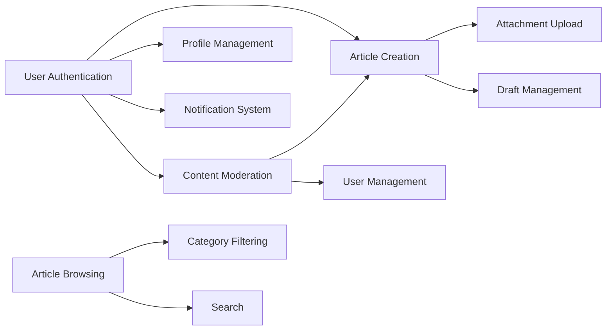

# Core Features - Discussion Board Requirements Specification

## 1. Introduction and Overview

### 1.1 Purpose of This Document

This document defines the core features required for the economic and political discussion board platform. It specifies the essential capabilities that enable users to create, discover, read, and manage discussion content in a simple and straightforward manner. This specification serves as the authoritative requirements source for backend developers implementing the NestJS + Prisma application.

### 1.2 Feature Philosophy

The discussion board follows a minimalist approach, focusing on essential features that support quality economic and political discussions without unnecessary complexity. Every feature serves a clear purpose in enabling productive discourse and content discovery. The platform intentionally avoids complex social networking features, gamification, or advanced analytics to maintain focus on the core mission: facilitating thoughtful discussions on economic and political topics.

### 1.3 Core Feature Categories

The platform's core features are organized into six primary categories:

- **Article Browsing and Discovery**: How users find and read discussion content through lists, categories, and featured articles
- **Article Creation and Publishing**: Tools for creating discussion articles with rich text formatting and file attachments
- **Content Categorization**: Organizing discussions into Economic and Political topics for easier discovery
- **Search Functionality**: Finding relevant discussions quickly through keyword search with filtering
- **User Profile Management**: Managing account settings, preferences, and viewing published articles
- **Notification System**: Staying informed about moderator actions and important account events

### 1.4 Feature Scope

**Included in Core Features:**
- Essential reading and browsing capabilities for all users including guests
- Straightforward article creation workflow with text editor and attachment support
- Basic categorization system for economic and political topics
- Simple keyword search functionality with category filtering
- User account management including profile editing and password changes
- Important activity notifications for moderator actions and account events

**Explicitly Excluded:**
- Advanced social features such as user-to-user following, direct messaging, or friend connections
- Complex recommendation algorithms or personalized content feeds
- Real-time chat, messaging, or collaborative editing
- Gamification elements including points, badges, or reputation scores
- Advanced analytics dashboards or detailed statistics for regular users
- Complex content workflows such as multi-stage approval processes
- Article commenting or discussion threads (focus is on article-level discourse)

## 2. Article Browsing and Discovery

### 2.1 Article List Display

#### 2.1.1 Main Article Feed

WHEN a user accesses the main article feed, THE system SHALL display a paginated list showing the most recent published articles first.

THE system SHALL display exactly 20 articles per page to balance content density with page load performance.

For each article in the list, THE system SHALL display the following information:
- Article title as a clickable link to the full article
- Author name as a clickable link to the author's public profile
- Publication date and time in the format "MMM DD, YYYY at HH:MM AM/PM"
- Category label ("Economic Discussion" or "Political Discussion") with distinctive visual styling
- Brief excerpt consisting of the first 200 characters of article content with ellipsis if truncated
- Attachment indicator showing the count of attached files and images (e.g., "3 attachments")
- Article thumbnail image if at least one image attachment exists, displayed as a small preview (150x150 pixels)

WHEN an article has no image attachments, THE system SHALL display a default category-appropriate placeholder image.

#### 2.1.2 Article Sorting Options

THE system SHALL provide the following sorting options accessible via a dropdown menu above the article list:
- "Newest first" (default) - Orders articles by publication date descending
- "Oldest first" - Orders articles by publication date ascending
- "Most recently updated" - Orders articles by last modification timestamp descending

WHEN a user selects a sorting option, THE system SHALL re-order the article list accordingly within 1 second and maintain the selection throughout the browsing session using session storage.

WHEN a user navigates to a different page, THE system SHALL preserve the selected sorting option across all pages in the current session.

#### 2.1.3 Pagination

THE system SHALL provide pagination controls at the bottom of the article list showing:
- Current page number highlighted with distinctive styling
- Total number of pages (e.g., "Page 3 of 15")
- "Next" button to advance to the next page (disabled on last page)
- "Previous" button to return to the previous page (disabled on first page)
- "First" button to jump to page 1 (disabled on first page)
- "Last" button to jump to the final page (disabled on last page)
- Direct page number links for up to 5 pages surrounding the current page

WHEN a user clicks any pagination control, THE system SHALL load and display the requested page within 1 second under normal network conditions.

WHEN loading a new page, THE system SHALL scroll the viewport to the top of the article list for user convenience.

### 2.2 Individual Article Viewing

#### 2.2.1 Article Display

WHEN a user clicks on an article title or excerpt from the list, THE system SHALL navigate to a dedicated article page displaying the complete article content.

THE system SHALL display the following article components in the order listed:
- Full article title in large, prominent typography
- Author information section containing author name (linked to profile), profile avatar if available, and publication timestamp
- Publication date and time in format "Published on MMM DD, YYYY at HH:MM AM/PM"
- Last updated date and time (only displayed if the article was edited after publication) in format "Last updated on MMM DD, YYYY at HH:MM AM/PM"
- Article category label with the same distinctive styling used in list views
- Complete article content with all rich text formatting preserved (bold, italic, headings, lists, links, quotes)
- All attached images displayed inline within an image gallery allowing users to view full-size versions
- All attached files as downloadable links showing file name, file type icon, and file size in KB or MB

WHEN displaying article content, THE system SHALL preserve all formatting applied during article creation including paragraph breaks, headings hierarchy, and list structures.

#### 2.2.2 Guest Access

WHEN a guest user (not authenticated) views an article, THE system SHALL display all article content in read-only mode without any editing controls.

THE system SHALL NOT require authentication or registration for viewing any published article, ensuring maximum accessibility for readers.

WHEN a guest user attempts to access article creation or editing features, THE system SHALL redirect to the login page with a message stating "Please log in to create or edit articles."

#### 2.2.3 Member and Moderator Access

WHEN a member views their own published article, THE system SHALL display "Edit" and "Delete" buttons prominently below the article title.

WHEN a member views another member's article, THE system SHALL display the article in read-only mode without editing controls.

WHEN a moderator views any article regardless of author, THE system SHALL display moderation controls including "Edit", "Delete", and "Feature Article" buttons to enable content management.

### 2.3 Category-Based Browsing

#### 2.3.1 Category Filtering

THE system SHALL provide category filter options accessible from a horizontal navigation menu above the article list:
- "All Articles" (default) - Displays articles from both Economic and Political categories
- "Economic Discussion" - Displays only articles categorized as Economic Discussion
- "Political Discussion" - Displays only articles categorized as Political Discussion

WHEN a user selects a category filter, THE system SHALL display only articles belonging to the selected category while maintaining the current sorting option.

THE system SHALL visually indicate the currently active category filter using highlighted or bold styling.

THE system SHALL maintain the selected category filter across page navigation within the browsing session, allowing users to browse multiple pages of filtered content without re-selecting the filter.

#### 2.3.2 Category Navigation

THE system SHALL provide a category navigation menu visible on all article list pages, positioned prominently in the main navigation or sidebar.

For each category, THE system SHALL display the count of published articles in that category (e.g., "Economic Discussion (127)").

WHEN the article count changes due to new publications or deletions, THE system SHALL update the displayed counts within 5 seconds to reflect current totals.

### 2.4 Discovery Features

#### 2.4.1 Recent Articles Widget

THE system SHALL display a "Recent Articles" widget in the sidebar showing the 5 most recently published articles across all categories.

For each article in the widget, THE system SHALL display the article title (truncated to 60 characters if necessary) and publication timestamp in relative format (e.g., "2 hours ago", "3 days ago").

WHEN a user clicks on an article title in the Recent Articles widget, THE system SHALL navigate to that article's full view page.

#### 2.4.2 Featured Articles

WHEN one or more moderators have marked articles as featured, THE system SHALL display featured articles prominently at the top of the main article feed in a distinctive visual container (e.g., highlighted background or border).

THE system SHALL limit the number of simultaneously featured articles to a maximum of 3 articles to prevent overwhelming the feed.

WHEN more than 3 articles are marked as featured, THE system SHALL display the 3 most recently featured articles.

Featured articles SHALL display a "Featured" badge or icon to distinguish them from regular articles.

### 2.5 Browsing Performance Requirements

WHEN a user requests an article list page, THE system SHALL respond and render the complete page within 1 second under normal network conditions with a database containing up to 10,000 articles.

WHEN a user opens an individual article page, THE system SHALL display the article text content within 1.5 seconds, with images loading progressively afterward if bandwidth is limited.

THE system SHALL implement caching for article lists to improve browsing performance, with cache invalidation occurring when new articles are published or existing articles are modified.

WHEN page load time exceeds 3 seconds, THE system SHALL display a loading indicator to provide user feedback.

## 3. Article Creation and Publishing

### 3.1 Article Creation Access

WHEN a member is authenticated and viewing any page on the platform, THE system SHALL provide a prominently displayed "Create Article" button visible in the main navigation header.

THE button SHALL also appear on the member's profile page in the "My Articles" section to provide contextual access.

WHEN a guest user attempts to access the article creation page directly via URL, THE system SHALL redirect to the login page with a message stating "Please log in or register to create articles."

WHEN a member clicks the "Create Article" button, THE system SHALL navigate to the article creation form page within 500 milliseconds.

### 3.2 Article Creation Form

#### 3.2.1 Required Article Fields

THE system SHALL require the following fields for article creation, marking them with a visual asterisk (*) or "Required" label:
- Article title field accepting minimum 10 characters and maximum 200 characters
- Article content field accepting minimum 100 characters and maximum 50,000 characters
- Category selection requiring exactly one choice between "Economic Discussion" and "Political Discussion"

WHEN a member attempts to submit an article with any required field incomplete or outside specified character limits, THE system SHALL prevent submission and display validation errors next to each problematic field indicating the specific issue (e.g., "Title must be at least 10 characters" or "Please select a category").

THE system SHALL display real-time character counters below the title and content fields showing current character count and maximum limit (e.g., "45 / 200 characters").

#### 3.2.2 Article Content Editor

THE system SHALL provide a rich text editor for article content supporting the following formatting options via toolbar buttons:
- Bold text formatting (Ctrl+B or Cmd+B keyboard shortcut)
- Italic text formatting (Ctrl+I or Cmd+I keyboard shortcut)
- Heading levels: H2, H3, and H4 for content structure
- Bulleted (unordered) lists
- Numbered (ordered) lists
- Hyperlinks with URL input dialog
- Block quotes for citing other sources
- Paragraph breaks and line spacing

THE system SHALL preserve all applied formatting when displaying published articles, maintaining the exact visual presentation intended by the author.

THE system SHALL auto-save draft content every 60 seconds to prevent data loss in case of browser crashes or accidental navigation.

#### 3.2.3 Category Selection

THE system SHALL provide a category selector presented as radio buttons with clear labels and descriptions:
- "Economic Discussion" - For articles about economic policy, markets, trade, labor, and economic analysis
- "Political Discussion" - For articles about political systems, governance, elections, policy, and international relations

THE system SHALL require exactly one category selection per article, preventing submission if no category is selected or if the selection is unclear.

WHEN a member selects a category, THE system SHALL visually highlight the selection to confirm the choice.

### 3.3 Attachment Management During Creation

#### 3.3.1 Image Attachment

WHEN creating an article, THE system SHALL allow members to upload up to 5 image files through a file picker interface or drag-and-drop area.

THE system SHALL accept images in the following formats: JPEG (.jpg, .jpeg), PNG (.png), GIF (.gif), and WebP (.webp).

THE system SHALL enforce a maximum file size limit of 5 MB per individual image file.

WHEN a member uploads an image, THE system SHALL:
- Display a preview thumbnail (200x200 pixels) of the uploaded image
- Show the image file name and file size below the thumbnail
- Provide a "Remove" button allowing the member to delete the image before publishing
- Display an upload progress indicator during the upload process

WHEN a member attempts to upload a 6th image after reaching the limit, THE system SHALL display an error message stating "Maximum 5 images allowed per article. Please remove an existing image to add a new one."

#### 3.3.2 File Attachment

WHEN creating an article, THE system SHALL allow members to upload up to 3 document files through a file picker interface or drag-and-drop area.

THE system SHALL accept files in the following formats: PDF (.pdf), Microsoft Word (.doc, .docx), Microsoft Excel (.xls, .xlsx), Plain Text (.txt), and CSV (.csv).

THE system SHALL enforce a maximum file size limit of 10 MB per individual file.

WHEN a member uploads a file, THE system SHALL:
- Display the file name with an appropriate file type icon
- Show the file size in KB or MB
- Provide a "Remove" button allowing the member to delete the file before publishing
- Display an upload progress bar during the upload process

WHEN a member attempts to upload a 4th file after reaching the limit, THE system SHALL display an error message stating "Maximum 3 files allowed per article. Please remove an existing file to add a new one."

#### 3.3.3 Attachment Validation

WHEN a member attempts to upload an image exceeding the 5 MB size limit, THE system SHALL immediately reject the upload and display an error message stating "Image file size exceeds 5 MB limit. Please choose a smaller image or compress the file."

WHEN a member attempts to upload a document file exceeding the 10 MB size limit, THE system SHALL immediately reject the upload and display an error message stating "File size exceeds 10 MB limit. Please choose a smaller file."

WHEN a member attempts to upload a file with an unsupported file type, THE system SHALL reject the upload and display an error message listing the supported formats: "Unsupported file type. Supported formats: Images (JPEG, PNG, GIF, WebP), Documents (PDF, DOC, DOCX, XLS, XLSX, TXT, CSV)."

THE system SHALL validate file types by examining file extensions and MIME types to prevent malicious file uploads disguised with fake extensions.

### 3.4 Draft and Publishing Workflow

#### 3.4.1 Save as Draft

THE system SHALL provide a "Save as Draft" button positioned next to the "Publish" button at the bottom of the article creation form.

WHEN a member clicks "Save as Draft", THE system SHALL validate that at minimum the title field contains some content (no minimum length requirement for drafts).

WHEN saving as draft, THE system SHALL:
- Store the article with a "draft" status flag in the database
- Store all entered content, selected category, and uploaded attachments
- Return the member to their profile page "Drafts" tab
- Display a success confirmation message stating "Draft saved successfully. You can continue editing anytime."

THE system SHALL NOT display draft articles in public article lists, search results, or category pages, ensuring drafts remain private to the author.

THE system SHALL NOT apply the strict validation requirements used for publishing (e.g., minimum content length) to draft saves, allowing members to save incomplete work in progress.

#### 3.4.2 Publish Article

THE system SHALL provide a prominent "Publish" button at the bottom of the article creation form to publish articles immediately.

WHEN a member clicks "Publish", THE system SHALL validate all required fields and attachments according to the complete validation rules.

IF all validation passes, THEN THE system SHALL:
- Change the article status from "draft" to "published" in the database
- Record the current timestamp as the publication date
- Make the article immediately visible in article lists, search results, and category pages
- Redirect the member to the published article's view page
- Display a success message stating "Article published successfully!"

IF validation fails, THEN THE system SHALL:
- Prevent publication
- Keep the article in draft status
- Display all validation error messages next to the corresponding fields
- Keep the member on the article creation form to make corrections

#### 3.4.3 Publish Validation

WHEN a member attempts to publish an article, THE system SHALL validate the following requirements:
- Title field is completed and contains between 10 and 200 characters
- Content field is completed and contains at least 100 characters and no more than 50,000 characters
- Exactly one category (Economic Discussion or Political Discussion) is selected
- All attached image files are within the 5 MB size limit and of supported formats
- All attached document files are within the 10 MB size limit and of supported formats
- Total number of image attachments does not exceed 5
- Total number of document attachments does not exceed 3

IF any validation rule fails, THEN THE system SHALL display specific, actionable error messages for each failure, such as:
- "Title must be between 10 and 200 characters. Current length: 5 characters."
- "Article content must be at least 100 characters. Current length: 47 characters."
- "Please select a category for your article."
- "Image 'photo.jpg' exceeds 5 MB size limit."

### 3.5 Article Editing

#### 3.5.1 Edit Access

WHEN a member views their own published article, THE system SHALL display an "Edit" button prominently below the article title alongside other article management controls.

WHEN a member clicks the "Edit" button, THE system SHALL navigate to the article editing form page, which uses the same interface as article creation but pre-populated with existing article data.

WHEN a moderator views any article regardless of authorship, THE system SHALL display the "Edit" button to enable content moderation and quality improvements.

#### 3.5.2 Edit Workflow

WHEN editing an article, THE system SHALL allow the member to modify:
- Article title within the same character limits (10-200 characters)
- Article content within the same character limits (100-50,000 characters)
- Category selection (change between Economic and Political)
- Image attachments (add new images up to the 5-image limit, remove existing images)
- Document attachments (add new files up to the 3-file limit, remove existing files)

THE system SHALL provide "Save Changes" and "Cancel" buttons at the bottom of the editing form.

WHEN a member clicks "Save Changes", THE system SHALL:
- Apply the same validation rules used for publishing
- Update the article content in the database if validation passes
- Update the article's "last updated" timestamp to the current date and time
- Maintain the original publication date unchanged
- Redirect to the updated article view page
- Display a success message stating "Article updated successfully."

WHEN a member clicks "Cancel", THE system SHALL:
- Discard all unsaved changes
- Return to the article view page without modifying the article
- Display a confirmation dialog if substantial edits were made: "Discard changes? Any unsaved edits will be lost."

#### 3.5.3 Moderator Editing

WHEN a moderator edits any article, THE system SHALL allow full editing capabilities identical to those available to the original author.

THE system SHALL log all moderator edit actions in a moderation log including:
- Moderator username
- Article ID and title
- Timestamp of edit
- Summary of changes made (optional moderator note)

WHEN a moderator saves changes to another member's article, THE system SHALL generate a notification to the original author stating "A moderator has edited your article: [Article Title]" with a link to view the updated article.

### 3.6 Article Deletion

#### 3.6.1 Member Deletion

WHEN a member views their own article (published or draft), THE system SHALL provide a "Delete" button displayed alongside the "Edit" button.

WHEN a member clicks the "Delete" button, THE system SHALL display a confirmation dialog stating: "Are you sure you want to delete this article? This action cannot be undone. All content and attachments will be permanently removed."

The confirmation dialog SHALL provide "Confirm Delete" and "Cancel" buttons.

WHEN deletion is confirmed, THE system SHALL:
- Permanently remove the article record from the database
- Delete all associated attachment files from storage
- Remove the article from all lists, search indexes, and category pages
- Redirect the member to their profile page
- Display a confirmation message stating "Article deleted successfully."

#### 3.6.2 Moderator Deletion

WHEN a moderator deletes any article regardless of authorship, THE system SHALL display a deletion dialog requiring:
- Confirmation checkbox acknowledging the permanent deletion
- Required text field for entering a deletion reason (minimum 10 characters)

WHEN moderator deletion is confirmed, THE system SHALL:
- Log the deletion in the moderation log including moderator username, article details, timestamp, and deletion reason
- Send a notification to the original author stating "Your article '[Article Title]' was removed by a moderator. Reason: [Deletion Reason]"
- Permanently remove the article and attachments from the system

### 3.7 Creation Performance Requirements

WHEN a member saves a draft or publishes an article without attachments, THE system SHALL complete the operation and provide confirmation within 2 seconds.

WHEN a member publishes an article with image or file attachments, THE system SHALL process all uploads, store all attachments, and publish the article within 10 seconds total processing time.

THE system SHALL provide real-time upload progress indicators for each attachment being uploaded, showing percentage complete and estimated time remaining.

WHEN uploading multiple attachments simultaneously, THE system SHALL process uploads in parallel to minimize total upload time.

## 4. Content Categorization and Organization

### 4.1 Category System Overview

THE system SHALL organize all articles into exactly two primary categories:
- Economic Discussion - For content focused on economic topics, policies, markets, and economic analysis
- Political Discussion - For content focused on political systems, governance, policy, and political analysis

THE system SHALL require every published article to belong to exactly one category, enforcing this requirement during article creation and editing.

THE system SHALL NOT support article assignments to multiple categories simultaneously, maintaining clear categorical boundaries.

### 4.2 Category Definitions

#### 4.2.1 Economic Discussion Category

The Economic Discussion category SHALL include articles related to the following topics:
- Economic policy and theory including macroeconomic and microeconomic subjects
- Financial markets, monetary policy, fiscal policy, and central banking
- International trade, trade agreements, tariffs, and global economics
- Labor economics, employment, wages, and workforce issues
- Economic development, growth strategies, and development economics
- Business economics, market structures, competition, and regulation
- Economic data analysis, indicators, trends, and forecasting
- Taxation, public finance, and government budgets

Members creating articles in this category SHALL focus content on economic aspects even when topics intersect with political issues.

#### 4.2.2 Political Discussion Category

The Political Discussion category SHALL include articles related to the following topics:
- Political systems, government structures, and institutional frameworks
- Elections, electoral systems, voting, and democratic processes
- Political theory, ideology, philosophy, and political movements
- Public policy, legislation, regulatory frameworks, and policymaking processes
- International relations, diplomacy, foreign policy, and geopolitics
- Political movements, parties, party systems, and political organization
- Government institutions, separation of powers, and constitutional matters
- Political sociology, political behavior, and civic engagement

Members creating articles in this category SHALL focus content on political aspects even when topics have economic implications.

### 4.3 Category Assignment

#### 4.3.1 Author Category Selection

WHEN creating an article, THE system SHALL require the author to select exactly one category before publication through a mandatory radio button selection.

THE system SHALL present category selection as a required field with clear descriptive labels explaining the scope of each category.

WHEN an author attempts to publish an article without selecting a category, THE system SHALL prevent publication and display an error message stating "Please select a category for your article: Economic Discussion or Political Discussion."

THE system SHALL position the category selector prominently in the article creation form, near the top below the title field.

#### 4.3.2 Category Changes

WHEN a member edits their own published article, THE system SHALL allow changing the article's category to the other category option.

WHEN a moderator edits any article, THE system SHALL allow changing the article's category as part of content moderation and organization.

WHEN an article's category is changed, THE system SHALL:
- Update the article's category assignment in the database immediately
- Update all article list views to reflect the new category within 5 seconds
- Move the article from one category page to the other
- Update category article counts to reflect the change
- Log the category change in the moderation log if performed by a moderator

### 4.4 Category-Based Navigation

#### 4.4.1 Category Filters

THE system SHALL provide category filter buttons on the main article feed, displayed as a horizontal navigation menu above the article list:
- "All Articles" - Default option displaying articles from both Economic and Political categories
- "Economic Discussion" - Displays only articles categorized as Economic Discussion
- "Political Discussion" - Displays only articles categorized as Political Discussion

WHEN a user clicks a category filter button, THE system SHALL:
- Display only articles from the selected category (or all categories for "All Articles")
- Visually highlight the active filter button using bold text, colored background, or border styling
- Update the URL to reflect the selected category (e.g., `/articles?category=economic`)
- Preserve the selected filter across pagination
- Reset to page 1 of the filtered results

THE system SHALL display article counts next to each filter button showing the total published articles in that category (e.g., "Economic Discussion (145)").

#### 4.4.2 Category Pages

THE system SHALL provide dedicated category pages accessible via clean URLs:
- `/articles/economic` - Displays all Economic Discussion articles
- `/articles/political` - Displays all Political Discussion articles
- `/articles` or `/articles/all` - Displays all articles regardless of category

WHEN a user accesses a category page directly via URL, THE system SHALL:
- Display articles from the specified category only
- Provide the same pagination controls as the main article feed (20 articles per page)
- Offer the same sorting options (newest first, oldest first, most recently updated)
- Display the category page title prominently (e.g., "Economic Discussion Articles")
- Show the total count of articles in the category

Category pages SHALL function identically to the filtered main feed, ensuring consistent user experience.

### 4.5 Category Display

#### 4.5.1 Visual Category Indicators

THE system SHALL display category labels on each article in list views using distinct visual styling to enable quick visual scanning:
- Economic Discussion: Blue color scheme with a badge or label reading "Economic"
- Political Discussion: Red color scheme with a badge or label reading "Political"

WHEN viewing an individual article page, THE system SHALL prominently display the article's category badge near the article title, using the same color coding scheme.

THE system SHALL ensure sufficient color contrast (WCAG AA standard minimum) between category labels and backgrounds for accessibility.

#### 4.5.2 Category Statistics

THE system SHALL display the total count of published articles in each category in the category navigation menu, updating counts dynamically as articles are published, deleted, or recategorized.

THE system SHALL update displayed category counts within 5 seconds of any article status change (publication, deletion, category change).

WHEN the article count exceeds 999, THE system SHALL display counts in abbreviated format (e.g., "1.2k" for 1,200 articles).

### 4.6 Category Search Integration

WHEN a user performs a search query, THE system SHALL allow filtering search results by category using the same filter buttons available on the main article feed.

THE system SHALL provide category facets in search results showing:
- Count of matching articles in Economic Discussion category
- Count of matching articles in Political Discussion category
- Total count of matching articles across all categories

WHEN a user applies a category filter to search results, THE system SHALL display only matching articles from the selected category while maintaining the search query.

The category filter selection SHALL persist when navigating between search result pages.

## 5. Search Functionality

### 5.1 Search Access and Interface

#### 5.1.1 Search Box Availability

THE system SHALL provide a search input box visible on all pages of the application, positioned prominently in the main navigation header for easy access.

THE system SHALL display a magnifying glass search icon inside or adjacent to the search input box to provide a clear visual indicator.

THE search box SHALL display placeholder text reading "Search discussions..." when empty to guide users on its purpose.

THE search box SHALL maintain a minimum width of 200 pixels on desktop displays and expand to full width on mobile devices.

#### 5.1.2 Search Initiation

WHEN a user types a search query into the search box and presses the Enter key or clicks the search button/icon, THE system SHALL execute the search and navigate to the search results page.

THE system SHALL require a minimum of 2 characters in the search query to perform a search, preventing overly broad or meaningless single-character searches.

WHEN a user attempts to search with fewer than 2 characters, THE system SHALL display a validation message below the search box stating "Please enter at least 2 characters to search."

THE system SHALL trim leading and trailing whitespace from search queries before processing.

### 5.2 Search Scope and Behavior

#### 5.2.1 Searchable Content

THE system SHALL search the following article fields when processing search queries:
- Article title field (highest relevance weighting)
- Article content field (medium relevance weighting)
- Author name/username (lower relevance weighting)

THE system SHALL NOT search the contents of attached files or images, as this would require complex file parsing and significantly impact performance.

THE system SHALL only search published articles that are visible to the current user's permission level (guests see only published articles; members see published articles; moderators see all published articles).

THE system SHALL NOT include draft articles in search results, ensuring private drafts remain hidden from search.

#### 5.2.2 Search Matching

THE system SHALL perform case-insensitive partial matching on search queries, treating "Economic", "economic", and "ECONOMIC" as identical search terms.

WHEN a user searches for multiple words (e.g., "economic policy"), THE system SHALL:
- Match articles containing "economic" OR "policy" OR both words
- Rank articles containing both words higher than articles containing only one word
- Consider word proximity, ranking articles where the words appear close together higher than articles where they appear far apart

THE system SHALL support exact phrase matching when search terms are enclosed in double quotes (e.g., "monetary policy" matches only articles containing that exact phrase).

THE system SHALL ignore common stop words (e.g., "the", "a", "an", "and", "or") when they appear alone but include them in exact phrase searches.

### 5.3 Search Results Display

#### 5.3.1 Results Page Layout

WHEN displaying search results, THE system SHALL show the following information at the top of the results page:
- Total number of matching articles (e.g., "Found 47 articles matching 'economic policy'")
- The exact search query used, displayed prominently
- Category filter buttons to narrow results by Economic or Political Discussion
- Sorting dropdown menu with options for relevance, newest first, oldest first

THE system SHALL display search results in a paginated list format showing 20 results per page.

WHEN no results match the search query, THE system SHALL display a "No results found" message with helpful suggestions (see section 5.6).

#### 5.3.2 Result Item Display

THE system SHALL display each search result item with the following information:
- Article title as a clickable link, with matching search terms highlighted in bold or colored text
- Content excerpt showing context around matching terms, limited to approximately 200 characters with ellipsis
- Author name as a clickable link to the author's profile
- Publication date in format "MMM DD, YYYY"
- Category label (Economic or Political) with distinctive visual styling
- Text snippet showing where search terms appear in the article content, with matching terms highlighted

WHEN search terms appear in the article title, THE system SHALL prioritize showing the title match over content matches.

WHEN multiple matches exist in article content, THE system SHALL show the first occurrence or the most relevant excerpt based on term density.

#### 5.3.3 Highlighting

THE system SHALL highlight all matching search terms in result titles and excerpts using bold font weight or a colored background (e.g., yellow highlight) to help users quickly identify relevant content.

THE system SHALL highlight partial word matches when appropriate (e.g., searching "economy" should highlight "economic" in results).

Highlighting SHALL apply to all matched terms in multi-word searches.

### 5.4 Search Filtering and Sorting

#### 5.4.1 Category Filtering

WHEN viewing search results, THE system SHALL provide category filter options displayed as buttons above the results list:
- "All categories" - Shows results from both Economic and Political Discussion (default)
- "Economic Discussion only" - Shows only Economic Discussion results matching the search query
- "Political Discussion only" - Shows only Political Discussion results matching the search query

WHEN a user clicks a category filter, THE system SHALL:
- Re-execute the search limited to the selected category
- Update the results list to show only matching articles from that category
- Update the result count to reflect the filtered total
- Maintain the current sorting option
- Visually highlight the active filter button

#### 5.4.2 Results Sorting

THE system SHALL provide the following sorting options for search results via a dropdown menu:
- "Relevance" (default) - Orders results by how closely they match the search query based on term frequency, position, and field weighting
- "Newest first" - Orders results by publication date descending, showing most recent articles first
- "Oldest first" - Orders results by publication date ascending, showing oldest articles first

WHEN a user selects "Relevance" sorting, THE system SHALL calculate relevance scores based on:
- Number of search term occurrences in the article
- Position of search terms (title matches rank higher than content matches)
- Proximity of search terms to each other in multi-word queries
- Exact phrase matches rank higher than word matches

WHEN a user changes the sorting option, THE system SHALL re-order results immediately and preserve the selection when paginating through results.

### 5.5 Search Performance

WHEN a user submits a search query, THE system SHALL process the search and return results within 2 seconds for databases containing up to 10,000 published articles under normal server load.

THE system SHALL display a loading indicator (spinner or progress bar) while processing search requests to provide user feedback.

IF search processing time exceeds 5 seconds due to high load or complex queries, THEN THE system SHALL display a message stating "Search is taking longer than expected. Please wait..." to manage user expectations.

THE system SHALL implement search result caching for frequently executed queries to improve response times for popular searches.

### 5.6 No Results Handling

WHEN a search query returns zero matching articles, THE system SHALL display a "No results found" message prominently with the following helpful suggestions:
- "Check your spelling and try again"
- "Try different keywords or synonyms"
- "Use fewer words or more general search terms"
- "Browse articles by category instead"
- Links to both category pages (Economic Discussion and Political Discussion)

THE system SHALL maintain the search query in the search box to allow easy editing and re-searching.

Optionally, THE system MAY suggest alternative search terms or display popular articles from a related category to keep users engaged.

### 5.7 Search History and Suggestions

THE system SHALL NOT store individual user search history or provide personalized search suggestions in the initial implementation, maintaining simplicity and user privacy.

THE system SHALL NOT implement autocomplete or search-as-you-type functionality in the initial implementation to reduce complexity.

WHERE future enhancement is desired based on user feedback, search suggestions, autocomplete, and trending searches MAY be added in subsequent releases.

## 6. User Profile Management

### 6.1 Profile Access

#### 6.1.1 Profile Navigation

WHEN a member is authenticated and logged into the system, THE system SHALL provide a "My Profile" link visible in the main navigation header or user account dropdown menu.

WHEN a member clicks "My Profile", THE system SHALL navigate to the member's personal profile page within 500 milliseconds.

THE profile page SHALL be accessible via a clean URL format such as `/profile` for the logged-in user's own profile or `/users/[username]` for public profiles.

#### 6.1.2 Public Profile View

WHEN any user (guest, member, or moderator) clicks on an author name displayed in an article or article list, THE system SHALL navigate to that author's public profile page.

THE system SHALL allow guest users to view public profiles without requiring authentication or registration, promoting content discovery and author recognition.

Public profiles SHALL display only non-sensitive information intended for public viewing (see section 6.2.1).

### 6.2 Profile Information Display

#### 6.2.1 Public Profile Information

THE system SHALL display the following information on public profile pages visible to all users:
- Username or display name prominently at the top of the profile
- Member since date showing the account registration date in format "Joined MMM YYYY"
- Total number of published articles authored by this member (e.g., "47 articles published")
- Paginated list of the member's published articles ordered by newest first (10 articles per page)
- User bio or description text (maximum 500 characters) if the member has provided one
- User avatar or profile picture if uploaded (optional feature)

THE system SHALL NOT display the member's email address, account status, or other sensitive information on public profiles.

#### 6.2.2 Private Profile Information

WHEN a member views their own profile page (logged in and viewing `/profile` or their own username URL), THE system SHALL additionally display:
- Email address currently registered for the account
- Account status indicator ("Active", "Suspended", etc.)
- Number of draft articles saved but not yet published
- "Edit Profile" button providing access to profile editing functionality
- "Account Settings" button providing access to password and notification preferences
- "View Drafts" tab or section listing all saved draft articles

These private details SHALL be visible only to the account owner and moderators, not to other members or guests.

### 6.3 Profile Editing

#### 6.3.1 Editable Profile Fields

WHEN a member clicks "Edit Profile" from their profile page, THE system SHALL navigate to a profile editing form allowing modification of:
- Display name field (required, 3-50 characters, alphanumeric with spaces, hyphens, and underscores allowed)
- Bio or description field (optional, maximum 500 characters, plain text or basic formatting)
- Email address field (required, must be valid email format)
- Profile picture/avatar upload (optional, JPEG or PNG, maximum 2 MB, displayed as circular avatar)

THE system SHALL provide "Save Changes" and "Cancel" buttons at the bottom of the editing form.

#### 6.3.2 Profile Update Validation

WHEN a member submits profile updates by clicking "Save Changes", THE system SHALL validate:
- Display name is between 3 and 50 characters in length
- Display name contains only letters, numbers, spaces, hyphens, and underscores (no special characters or symbols)
- Display name is unique among all users in the system (case-insensitive comparison)
- Email address is in valid email format (contains @ symbol and valid domain)
- Email address is unique among all users in the system (case-insensitive comparison)
- Bio text does not exceed 500 characters
- Profile picture file (if uploaded) is JPEG or PNG format and under 2 MB

IF any validation rule fails, THEN THE system SHALL:
- Prevent saving the changes
- Display specific error messages next to each field with validation failures
- Preserve all entered data in the form fields so the member can correct errors without re-entering valid data

WHEN all validation passes, THE system SHALL:
- Save the updated profile information to the database
- Update all existing articles and comments to reflect the new display name (if changed)
- Redirect to the profile view page
- Display a success confirmation message stating "Profile updated successfully."

### 6.4 Account Settings

#### 6.4.1 Password Change

WHEN a member accesses account settings via the "Account Settings" button, THE system SHALL provide a password change form containing:
- Current password field (required for security verification)
- New password field (required, minimum 8 characters)
- Confirm new password field (required, must match new password exactly)

THE system SHALL display password strength indicators showing whether the new password is weak, medium, or strong based on length, character variety, and common password checks.

WHEN a member submits the password change form, THE system SHALL validate:
- Current password is correct for the logged-in account
- New password is at least 8 characters long
- New password contains at least one letter and one number (basic strength requirement)
- New password matches the confirmation field exactly

IF the current password is incorrect, THEN THE system SHALL display an error message "Current password is incorrect. Please try again." and prevent the password change.

IF the new password does not meet requirements, THEN THE system SHALL display specific error messages explaining which requirements are not met.

WHEN password change validation succeeds, THE system SHALL:
- Update the password hash in the database
- Log out all other active sessions for this account (security measure to invalidate old sessions)
- Keep the current session logged in
- Display a confirmation message "Password changed successfully. All other sessions have been logged out for security."
- Optionally send a password change confirmation email to the account's email address

#### 6.4.2 Email Notification Preferences

THE system SHALL provide email notification preference controls in the account settings page allowing members to configure:
- Master email notifications toggle (enable/disable all email notifications)
- Notifications for moderator edits to the member's articles (on/off)
- Notifications for moderator deletions of the member's articles (on/off)
- Notifications for featured article status (when moderator features the member's article) (on/off)
- Account security notifications (password changes, login from new device) (always on, cannot be disabled)

WHEN a member changes notification preferences, THE system SHALL:
- Save the updated preferences to the database immediately
- Display a confirmation message "Notification preferences updated."
- Apply the new preferences to all future notifications (changes take effect immediately)

THE system SHALL set default notification preferences for new accounts with all optional notifications enabled.

### 6.5 My Articles Management

#### 6.5.1 Published Articles List

WHEN viewing their own profile page, THE system SHALL display the member's published articles in a dedicated "Published Articles" section or tab with:
- Article title as a clickable link to the article view
- Publication date in format "Published MMM DD, YYYY"
- Last updated date (if the article was edited) in format "Updated MMM DD, YYYY"
- Category label (Economic or Political)
- Article view count (optional feature showing how many times the article was viewed)
- "Edit" button providing quick access to edit the article
- "Delete" button providing quick access to delete the article

Articles SHALL be displayed in reverse chronological order (newest first) with pagination showing 10 articles per page.

#### 6.5.2 Draft Articles List

WHEN viewing their own profile page, THE system SHALL provide a "Drafts" tab or section showing all saved draft articles that have not yet been published.

THE system SHALL display draft articles with:
- Draft title (or "Untitled Draft" if the title field is empty)
- Last saved date and time in format "Last saved on MMM DD, YYYY at HH:MM AM/PM"
- Draft preview showing the first 100 characters of content
- "Continue Editing" button to resume editing the draft
- "Delete Draft" button to permanently remove the draft

WHEN a member clicks "Continue Editing" on a draft, THE system SHALL:
- Open the article creation/editing form
- Pre-populate all fields with the saved draft content
- Pre-load any uploaded attachments from the draft
- Allow the member to continue editing and either save again as draft or publish

### 6.6 Account Deactivation

#### 6.6.1 Self Deactivation

THE system SHALL provide a "Deactivate Account" option in the account settings page, displayed with a warning icon to indicate the serious nature of this action.

WHEN a member clicks "Deactivate Account", THE system SHALL display a modal dialog or dedicated page with:
- Clear warning text explaining consequences: "Deactivating your account will permanently remove your personal information. Your published articles will remain visible but will be attributed to 'Deleted User'. This action cannot be undone."
- Password confirmation field requiring the member to enter their current password
- Confirmation checkbox with text "I understand this action is permanent and cannot be reversed"
- "Confirm Deactivation" button (only enabled when password is entered and checkbox is checked)
- "Cancel" button to abort the deactivation process

WHEN deactivation is confirmed with valid password, THE system SHALL:
- Mark the account record as deactivated in the database
- Log out the user from all active sessions immediately
- Anonymize the user's email address (replace with a hashed value or remove)
- Anonymize the user's display name in the user record
- Update all published articles to show author as "Deleted User" instead of the original username
- Retain all published articles and their content (articles are preserved, only attribution is changed)
- Delete all draft articles permanently
- Prevent future logins with the deactivated account credentials

#### 6.6.2 Moderator Account Actions

WHEN a moderator views any user's public profile page, THE system SHALL display moderator-only action buttons:
- "Suspend Account" - Temporarily blocks the user from logging in and creating content
- "Reactivate Account" - Restores access to a previously suspended account
- "Ban Account" - Permanently prevents the user from accessing the platform

WHEN a moderator clicks "Suspend Account", THE system SHALL display a dialog requiring:
- Suspension reason (required text field, minimum 10 characters)
- Suspension duration (optional: 1 day, 7 days, 30 days, or indefinite)
- Confirmation button

WHEN suspension is confirmed, THE system SHALL:
- Mark the account as suspended in the database with the specified duration
- Log the suspension action including moderator username, timestamp, reason, and duration
- Send a notification to the suspended user explaining the suspension and reason
- Immediately log out the suspended user from all sessions
- Prevent the suspended user from logging in until the suspension expires or is lifted

WHEN a moderator clicks "Ban Account", THE system SHALL require an additional confirmation dialog with strong warning text about permanent nature, and then permanently disable the account similar to suspension but with no expiration.

## 7. Notification System

### 7.1 Notification Types

#### 7.1.1 Content-Related Notifications

THE system SHALL generate notifications for members when the following events occur related to their content:
- A moderator edits the member's article - Notification includes article title, moderator username (optional), and timestamp
- A moderator deletes the member's article - Notification includes article title, deletion reason provided by moderator, and timestamp
- A moderator features the member's article - Notification includes article title and timestamp, serving as positive feedback

These content-related notifications SHALL be generated immediately upon the moderator action completing (within 1 second).

#### 7.1.2 Account-Related Notifications

THE system SHALL generate notifications for members when the following account events occur:
- Account suspension - Notification includes suspension reason, duration if applicable, and moderator note
- Account reactivation after suspension - Notification confirms access has been restored
- Password change confirmation - Security notification confirming the password was changed (sent even if member disabled other notifications)
- Email address change confirmation - Security notification confirming the email was changed, sent to both old and new email addresses
- Login from a new device or location (optional security feature) - Notification alerts member to potentially unauthorized access

Account security notifications (password change, email change) SHALL always be sent regardless of the member's notification preferences to ensure account security.

### 7.2 Notification Delivery

#### 7.2.1 In-App Notifications

THE system SHALL display a notification icon (bell icon or similar) in the main navigation header visible when a member is logged in.

THE notification icon SHALL display a badge showing the count of unread notifications when the count is greater than zero (e.g., a red circle with number "3").

WHEN the unread count exceeds 9, THE system SHALL display "9+" instead of the exact number to conserve space.

WHEN a member clicks the notification icon, THE system SHALL display a dropdown panel listing the most recent notifications (up to 10) with:
- Notification type icon (edit, delete, feature, security, etc.)
- Descriptive message text explaining the event
- Relative timestamp for recent notifications (e.g., "2 hours ago", "Yesterday") or absolute date for older ones (e.g., "Jan 15, 2024")
- Visual indicator distinguishing read from unread notifications (e.g., bold text or colored background for unread)
- Clickable link to relevant content when applicable (e.g., link to the edited article)

WHEN a member clicks on a notification in the dropdown, THE system SHALL:
- Mark the notification as read immediately
- Update the unread count badge
- Navigate to the relevant article, profile page, or settings page (depending on notification type)
- Close the notification dropdown

#### 7.2.2 Email Notifications

WHERE a member has enabled email notifications in their account preferences, THE system SHALL send email notifications for applicable events to the member's registered email address.

THE system SHALL send email notifications for:
- Moderator actions on the member's content (edits, deletions, featured status) IF the member has enabled content notifications
- Account security events (password changes, email changes, suspensions) ALWAYS regardless of preferences

THE system SHALL send email notifications within 5 minutes of the triggering event to ensure timely delivery.

Email notifications SHALL include:
- Clear subject line describing the event (e.g., "Your article was featured", "Account password changed")
- Member's display name in the greeting
- Detailed description of the event
- Link to view the related content or account settings on the platform
- Instructions for managing notification preferences
- Unsubscribe link for non-security notifications

THE system SHALL NOT send email notifications if the member has disabled email notifications in preferences, EXCEPT for security-related notifications which always send.

### 7.3 Notification Display

#### 7.3.1 Notification Content

THE system SHALL display each notification with the following components:
- Notification type icon providing quick visual identification (e.g., pencil icon for edits, trash icon for deletions, star icon for featured articles)
- Descriptive message text clearly explaining what happened, such as:
  - "Your article '[Article Title]' was edited by a moderator"
  - "Your article '[Article Title]' was removed. Reason: [Deletion Reason]"
  - "Your article '[Article Title]' was featured on the homepage"
  - "Your account was suspended. Reason: [Suspension Reason]"
- Timestamp showing when the event occurred, using relative time for recent notifications ("5 minutes ago", "3 hours ago", "Yesterday") and absolute dates for older notifications ("Jan 15, 2024")
- Clickable link or button to view relevant content (the article, profile, or settings) when applicable
- Read/unread status indicator using visual styling (bold text for unread, normal text for read, or background color differences)

#### 7.3.2 Notification List Page

THE system SHALL provide an "All Notifications" page accessible via a "View All" link in the notification dropdown or a dedicated navigation link.

WHEN viewing the notification list page, THE system SHALL:
- Display all notifications in reverse chronological order (newest first)
- Paginate notifications showing 20 notifications per page
- Provide filtering options: "All", "Unread", "Content", "Account"
- Display a "Mark all as read" button at the top of the list
- Show the same notification information as the dropdown (icon, message, timestamp, link)
- Provide individual "Delete" buttons for each notification

WHEN a member clicks "Mark all as read", THE system SHALL:
- Update all unread notifications to read status
- Update the unread count badge to zero
- Refresh the notification list to reflect the updated read status
- Display a confirmation message "All notifications marked as read"

### 7.4 Notification Management

#### 7.4.1 Mark as Read

WHEN a member views a notification by clicking it in the dropdown or list, THE system SHALL automatically mark that notification as read.

THE system SHALL update the unread count badge immediately to reflect the change (decrement by 1).

WHEN viewing the notification list page, THE system SHALL provide a "Mark as read" button or icon next to each individual unread notification, allowing the member to mark it read without clicking through to the linked content.

WHEN a member marks a notification as read, THE system SHALL:
- Update the notification's read status in the database
- Change the visual styling to indicate read status (remove bold, change background color)
- Update the unread count if it was previously unread

#### 7.4.2 Notification Deletion

THE system SHALL provide a delete button (trash icon or "X" button) for individual notifications in the notification list page.

WHEN a member clicks the delete button for a notification, THE system SHALL:
- Display a brief confirmation dialog "Delete this notification?" with "Delete" and "Cancel" options
- Permanently remove the notification from the member's notification list when confirmed
- Update the unread count if the deleted notification was unread
- Refresh the notification list to remove the deleted item

THE system MAY optionally provide a "Delete all read notifications" bulk action to help members keep their notification list clean.

### 7.5 Notification Preferences

#### 7.5.1 Granular Control

THE system SHALL allow members to configure notification preferences in the account settings page with granular control over:
- Email notifications master toggle (on/off for all email notifications except security)
- In-app notifications master toggle (on/off for all in-app notifications except security)
- Individual toggles for specific notification types:
  - Moderator edits to my articles (on/off)
  - Moderator deletions of my articles (on/off)
  - Featured article notifications (on/off)
- Email notification frequency for non-urgent notifications:
  - Immediate (send email as events occur)
  - Daily digest (one email per day summarizing all notifications)
  - Weekly digest (one email per week summarizing all notifications)

WHEN a member disables a specific notification type, THE system SHALL:
- Stop generating in-app notifications for that type if in-app is disabled
- Stop sending email notifications for that type if email is disabled
- Continue to log events in moderation logs even if notifications are disabled

#### 7.5.2 Default Preferences

WHEN a new member registers an account, THE system SHALL set the following default notification preferences:
- Email notifications: Enabled
- In-app notifications: Enabled
- All individual notification types: Enabled
- Email frequency: Immediate

These defaults ensure new members stay informed about important events until they customize preferences to their liking.

### 7.6 Notification Performance

THE system SHALL generate and store notification records in the database within 1 second of the triggering event occurring (e.g., moderator saves an edited article).

THE system SHALL send email notifications asynchronously using a background job queue to avoid delaying the moderator's action or blocking the user interface.

WHEN a member opens the notification dropdown or list page, THE system SHALL retrieve and display notifications within 500 milliseconds.

WHEN a new notification is generated while a member is actively using the platform, THE system SHALL update the notification count badge in real-time (within 5 seconds) without requiring a page refresh, using polling or WebSocket connections.

## 8. Essential Feature Summary

### 8.1 Core Capabilities Matrix

The following table summarizes the capabilities available to each user actor type:

| Feature Category | Guest | Member | Moderator |
|-----------------|-------|--------|-----------|
| Browse article list | ✅ Yes | ✅ Yes | ✅ Yes |
| View individual articles | ✅ Yes | ✅ Yes | ✅ Yes |
| Filter by category | ✅ Yes | ✅ Yes | ✅ Yes |
| Search articles | ✅ Yes | ✅ Yes | ✅ Yes |
| View public profiles | ✅ Yes | ✅ Yes | ✅ Yes |
| Create articles | ❌ No | ✅ Yes | ✅ Yes |
| Edit own articles | ❌ No | ✅ Yes | ✅ Yes |
| Delete own articles | ❌ No | ✅ Yes | ✅ Yes |
| Upload attachments | ❌ No | ✅ Yes | ✅ Yes |
| Save drafts | ❌ No | ✅ Yes | ✅ Yes |
| Manage own profile | ❌ No | ✅ Yes | ✅ Yes |
| Receive notifications | ❌ No | ✅ Yes | ✅ Yes |
| Edit any article | ❌ No | ❌ No | ✅ Yes |
| Delete any article | ❌ No | ❌ No | ✅ Yes |
| Feature articles | ❌ No | ❌ No | ✅ Yes |
| Manage user accounts | ❌ No | ❌ No | ✅ Yes |

### 8.2 Feature Priorities

#### 8.2.1 Must-Have Features (Launch Requirements)

The following features are essential and must be implemented for the initial platform launch:
- Article browsing and viewing capabilities for all users
- Article creation with rich text content editor
- Image attachment upload and display (up to 5 images per article)
- File attachment upload and download (up to 3 files per article)
- Category organization system (Economic Discussion and Political Discussion)
- Basic keyword search functionality with result highlighting
- User registration and authentication system
- User profile pages (public and private views)
- Draft article saving capability
- Basic moderation tools (edit, delete, feature)

#### 8.2.2 Should-Have Features (Launch Nice-to-Have)

These features significantly enhance the platform and should be included if time permits before launch, or added shortly after:
- Notification system (in-app and email notifications)
- Featured articles section on homepage
- Advanced search filtering by category and date
- Profile editing with bio and avatar
- Email notification preferences
- Moderator activity logging
- Password strength indicators

#### 8.2.3 Could-Have Features (Future Enhancements)

These features may be added in future releases based on user feedback, platform growth, and strategic priorities:
- Article commenting system allowing threaded discussions
- User reputation or credibility scoring system
- Advanced content recommendation algorithms based on reading history
- Article analytics for authors (view counts, reading time, engagement metrics)
- RSS feeds for categories and individual authors
- Social media sharing integrations (Twitter, Facebook, LinkedIn)
- Article bookmarking or saving functionality
- Email newsletter subscriptions for new articles
- Advanced text editor features (tables, code blocks, embedded media)
- Multi-language support and internationalization

### 8.3 Feature Interdependencies

### 8.4 User Journey Integration

#### 8.4.1 Guest User Journey

1. Guest arrives at the homepage displaying the main article feed
2. Guest browses the article list, viewing titles, excerpts, and categories
3. Guest applies category filter to view only Economic Discussion articles
4. Guest uses search functionality to find articles about "monetary policy"
5. Guest clicks on an article title to read the full content
6. Guest clicks on the author name to view the author's public profile
7. Guest sees interesting discussions and decides to participate
8. Guest clicks "Register" to create a member account (transitions to Member role)

#### 8.4.2 Member User Journey

1. Member logs in using email and password
2. Member browses recent discussions on the homepage
3. Member decides to contribute and clicks "Create Article"
4. Member writes an article about economic policy with text formatting
5. Member uploads 2 image attachments and 1 PDF document to support the article
6. Member is not ready to publish, so clicks "Save as Draft"
7. Member returns later, accesses "My Profile" and clicks "Drafts" tab
8. Member continues editing the draft and clicks "Publish"
9. Member receives an in-app notification that a moderator featured the article
10. Member views their profile to see the published article with "Featured" badge
11. Member updates their profile bio to describe their expertise

#### 8.4.3 Moderator User Journey

1. Moderator logs in with moderator credentials
2. Moderator browses recent articles to review content quality
3. Moderator identifies a high-quality, well-researched article
4. Moderator clicks "Feature Article" to promote it on the homepage
5. Moderator notices another article with minor formatting issues
6. Moderator clicks "Edit" and improves the formatting and clarity
7. Moderator saves changes, automatically notifying the original author
8. Moderator reviews a reported article containing policy violations
9. Moderator clicks "Delete" and provides a deletion reason
10. Moderator reviews the problematic user's profile
11. Moderator clicks "Suspend Account" and enters suspension reason and duration

### 8.5 Performance and Quality Standards

#### 8.5.1 Response Time Requirements

THE system SHALL meet the following response time targets under normal load conditions:
- Article list page load: Within 1 second from request to full page render
- Individual article view: Within 1.5 seconds from request to content display
- Search results page: Within 2 seconds from query submission to results display
- Article publication (without attachments): Within 2 seconds from submission to confirmation
- Article publication with attachments: Within 10 seconds including file upload and processing
- Profile page load: Within 1 second from request to full page render
- Notification dropdown open: Within 500 milliseconds from click to display
- Draft auto-save: Within 1 second from trigger to save confirmation

WHEN response times exceed these targets by more than 50%, THE system SHALL log performance issues for investigation.

#### 8.5.2 Usability Standards

THE system SHALL provide clear, immediate feedback for all user actions within 100 milliseconds (e.g., button press acknowledgment, form input validation).

WHEN a user performs an action that takes longer than 1 second to complete, THE system SHALL display a loading indicator (spinner, progress bar, or skeleton screen) to indicate processing is occurring.

THE system SHALL display clear error messages in natural, non-technical language when operations fail, explaining:
- What went wrong in user-friendly terms
- Why it went wrong if the reason is known
- How to fix the problem or what to do next
- Who to contact if the problem persists (support email or link)

Error messages SHALL avoid technical jargon, stack traces, or system error codes visible to end users.

#### 8.5.3 Accessibility Considerations

THE system SHALL support full keyboard navigation for all core features, allowing users to navigate and perform all actions without a mouse.

THE system SHALL provide appropriate text alternatives (alt text) for all images, icons, and visual indicators to support screen readers.

THE system SHALL use sufficient color contrast ratios for all text and interactive elements, meeting WCAG AA standard minimum contrast ratio of 4.5:1 for normal text and 3:1 for large text.

THE system SHALL ensure interactive elements (buttons, links, form inputs) have sufficient size (minimum 44x44 pixels) for touch targets on mobile devices.

### 8.6 Feature Success Metrics

#### 8.6.1 Article Creation Metrics

Target metrics for measuring article creation feature success:
- Average time to create and publish an article: Target under 5 minutes for typical articles
- Draft-to-published conversion rate: Target above 60% (60% of saved drafts eventually get published)
- Articles with attachments: Target 40% of all published articles include at least one attachment
- Publishing success rate: Target above 95% (successful publications vs. failed attempts)

#### 8.6.2 Discovery and Engagement Metrics

Target metrics for measuring content discovery feature success:
- Search usage rate: Target 30% of user sessions include at least one search query
- Category filtering usage: Target 40% of browsing sessions use category filters
- Average articles viewed per session: Target 3 or more articles per visit
- Profile view rate: Target 20% of article views result in clicking through to view the author's profile
- Featured article click-through rate: Target 15% click-through from homepage views

#### 8.6.3 User Retention Metrics

Target metrics for measuring user engagement and retention:
- Member return rate within 7 days: Target 50% of new members return within first week
- Active contributors (published at least 1 article): Target 20% of registered members become content creators
- Member retention at 30 days: Target 40% of members remain active after 30 days
- Average session duration: Target 5+ minutes per session
- Monthly active users: Track trend over time with target growth

### 8.7 Feature Limitations and Constraints

#### 8.7.1 Intentional Limitations

To maintain simplicity and focus on core discussion functionality, the following features are intentionally excluded from the platform:
- Article commenting or discussion threads - Keeps focus on article-level discourse rather than fragmented conversations
- Direct messaging between users - Prevents the platform from becoming a social network and maintains public discussion focus
- Complex social networking features (follows, friends, activity feeds) - Avoids feature bloat and keeps the platform simple
- Real-time collaboration or co-authoring - Maintains single-author article ownership and simplifies content management
- Advanced analytics or statistics for regular members - Prevents gamification and keeps members focused on content quality rather than metrics
- User-generated tags or categories - Maintains clean, consistent categorization with two clear categories

#### 8.7.2 Technical Constraints

The following technical constraints are enforced to balance functionality with performance and user experience:
- Maximum 5 images per article - Prevents excessive storage usage and page load times while allowing adequate visual content
- Maximum 3 files per article - Maintains focus on written discussion rather than file sharing, keeps articles manageable
- Maximum 50,000 characters per article - Prevents extremely long content that degrades readability and performance
- Image size limit: 5 MB per file - Balances image quality with upload time and storage efficiency
- File size limit: 10 MB per file - Reasonable limit for typical documents (PDFs, spreadsheets) without enabling large file sharing
- Maximum 500 characters for user bio - Keeps profile bios concise and readable
- Maximum 200 characters for article titles - Ensures titles remain concise and display properly in lists
- Minimum 100 characters for article content - Ensures articles have substantive content rather than one-liner posts

#### 8.7.3 Scalability Considerations

WHEN the platform reaches 10,000 or more published articles, THE system SHALL maintain search performance within the 2-second response time target through database indexing and query optimization.

THE system SHALL support pagination for all list views (articles, profiles, notifications, search results) to handle growing content volume without performance degradation.

WHERE user growth exceeds 1,000 concurrent users, THE system SHALL maintain all performance requirements through appropriate infrastructure scaling (horizontal scaling, caching, load balancing).

THE system architecture SHALL support future scaling to 100,000+ articles and 10,000+ users without requiring fundamental redesign.

## 9. Conclusion

### 9.1 Feature Completeness

This document defines all core features necessary for a functional, focused discussion board platform dedicated to economic and political topics. The feature set prioritizes simplicity, usability, and essential functionality over complex or advanced capabilities. Every feature serves a clear purpose in enabling productive discourse, content discovery, and community management.

The requirements specified in this document provide complete guidance for backend developers to implement a production-ready system using NestJS and Prisma, with clear success criteria, performance targets, and user experience standards.

### 9.2 Implementation Guidance

Backend developers should implement these features in the following recommended order to ensure logical dependencies are satisfied:

1. **User authentication and actor system** - Foundation for all user-specific features
2. **Article creation and viewing (without attachments)** - Core content functionality
3. **Category system and filtering** - Basic content organization
4. **Attachment upload and display** - Enhanced content capabilities
5. **Search functionality** - Content discovery
6. **User profile management** - User account features
7. **Notification system** - User engagement and feedback
8. **Moderation tools** - Content and user management

This implementation order ensures that each phase builds upon completed functionality and allows for incremental testing and validation.

### 9.3 Related Documentation

For complete implementation details, backend developers should refer to the following related requirement documents:

- [User Actors and Authentication](./02-user-actors-authentication.md) - Detailed authentication flows, session management, and permission specifications
- [Article Management](./04-article-management.md) - Comprehensive article lifecycle, data structure, and state management requirements
- [Attachments](./05-attachments.md) - File upload specifications, storage requirements, and security validation
- [Content Moderation](./06-content-moderation.md) - Moderator capabilities, workflows, and logging requirements
- [User Workflows](./07-user-workflows.md) - Complete user journey scenarios with step-by-step interactions
- [Business Rules](./08-business-rules.md) - Validation rules, business logic constraints, and data integrity requirements
- [Performance and Security](./09-performance-security.md) - Performance targets, security requirements, and system reliability standards

### 9.4 Feature Evolution

This feature set represents the initial platform launch configuration. Future feature enhancements should be evaluated based on:

- **User feedback and actual usage patterns** - Real-world data showing which features users value and which gaps exist
- **Platform growth and scaling needs** - Technical requirements emerging as user base and content volume grow
- **Community needs for moderation and quality control** - Evolving requirements for maintaining discussion quality
- **Technical feasibility and maintenance considerations** - Resource availability and long-term sustainability

All proposed feature additions should be evaluated against the core principle of maintaining simplicity and focus on enabling quality economic and political discussions. Features that introduce complexity without clear value to the core mission should be avoided or deferred.