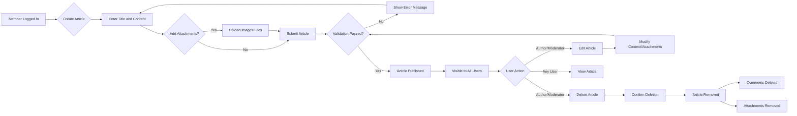
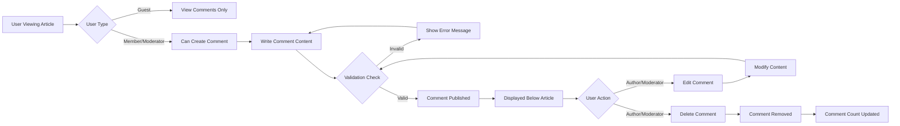
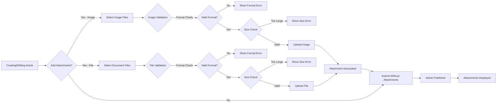
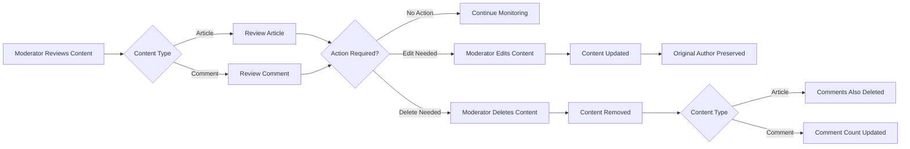

# Functional Requirements

## Introduction

This document provides comprehensive functional requirements for the economic/political discussion board system. It defines all business capabilities, user workflows, and system behaviors that developers must implement. These requirements focus on **what** the system should do from a business perspective, leaving technical implementation decisions to the development team.

This document is structured around major functional areas: article management, commenting, file attachments, content moderation, search, user profiles, and content organization. Each requirement is written to be specific, measurable, and testable.

**Target Audience**: Backend developers who will implement the discussion board system.

**Related Documents**: 
- [Service Overview](./01-service-overview.md) - Business context and objectives
- [User Actors and Authentication](./02-user-actors-authentication.md) - User types and authentication system

## Article Management

Articles are the core content type of the discussion board. Members create articles to share their thoughts on economic and political topics, while guests can view published content.

### Article Creation

**Access Control**:
- THE system SHALL allow only authenticated members and moderators to create new articles
- WHEN a guest attempts to create an article, THE system SHALL deny access and prompt for login
- THE system SHALL provide a clear message directing unauthenticated users to register or log in

**Article Content Requirements**:
- THE system SHALL require each article to have a title with minimum 5 characters and maximum 200 characters
- THE system SHALL require each article to have body content with minimum 10 characters and maximum 50,000 characters
- THE system SHALL support rich text formatting in article bodies including paragraphs, line breaks, and basic text formatting
- THE system SHALL allow articles to be created without attachments
- THE system SHALL allow articles to include one or more image attachments
- THE system SHALL allow articles to include one or more file attachments

**Article Metadata**:
- WHEN a member creates an article, THE system SHALL automatically record the author's identity
- THE system SHALL automatically record the creation timestamp for each article
- THE system SHALL automatically assign a unique identifier to each article
- THE system SHALL track the last modification timestamp whenever an article is edited

**Article Creation Validation**:
- IF an article title is shorter than 5 characters, THEN THE system SHALL reject the creation and display error message "Title must be at least 5 characters long"
- IF an article body is shorter than 10 characters, THEN THE system SHALL reject the creation and display error message "Article content must be at least 10 characters long"
- IF an article title exceeds 200 characters, THEN THE system SHALL reject the creation and display error message "Title cannot exceed 200 characters"
- IF an article body exceeds 50,000 characters, THEN THE system SHALL reject the creation and display error message "Article content cannot exceed 50,000 characters"

### Article Publication States

**Publication Workflow**:
- WHEN a member creates an article, THE system SHALL immediately publish the article as publicly visible
- THE system SHALL make newly published articles immediately available to all users including guests
- THE system SHALL not require moderator approval before publication for initial release
- WHERE moderation features are enabled in future iterations, THE system SHALL support draft and pending states

**Visibility Rules**:
- THE system SHALL display published articles to all users including guests
- THE system SHALL show article author information including username and publication date
- THE system SHALL display article view counts to all users
- THE system SHALL display comment counts for each article

### Article Editing

**Edit Permissions**:
- THE system SHALL allow article authors to edit their own articles at any time
- THE system SHALL allow moderators to edit any article regardless of authorship
- THE system SHALL prevent members from editing articles created by other members
- WHEN a member attempts to edit another member's article, THE system SHALL deny access with error message "You can only edit your own articles"

**Edit Tracking**:
- WHEN an article is edited, THE system SHALL update the last modification timestamp
- THE system SHALL preserve the original creation timestamp
- THE system SHALL maintain the original author information
- WHERE edit history features are desired, THE system SHALL support tracking modification history in future iterations

**Edit Validation**:
- THE system SHALL apply the same validation rules to edited articles as new articles
- IF edited content violates length constraints, THEN THE system SHALL reject the update and display appropriate error message
- THE system SHALL allow editing of article title and body content
- THE system SHALL allow adding or removing attachments during editing

### Article Deletion

**Delete Permissions**:
- THE system SHALL allow article authors to delete their own articles
- THE system SHALL allow moderators to delete any article
- THE system SHALL prevent members from deleting articles created by other members
- WHEN a member attempts to delete another member's article, THE system SHALL deny access with error message "You can only delete your own articles"

**Deletion Behavior**:
- WHEN an article is deleted, THE system SHALL remove the article from all public listings
- THE system SHALL remove all associated comments when an article is deleted
- THE system SHALL remove all associated file and image attachments when an article is deleted
- THE system SHALL make the deletion permanent and irreversible
- WHEN a user attempts to access a deleted article directly, THE system SHALL display error message "This article has been removed"

**Deletion Confirmation**:
- THE system SHALL require explicit confirmation before deleting an article
- THE system SHALL warn users that deletion is permanent and will remove all comments

### Article Listing and Discovery

**Article List Display**:
- THE system SHALL display articles in reverse chronological order with newest first by default
- THE system SHALL paginate article listings with 20 articles per page
- THE system SHALL display article preview information including title, author, creation date, view count, and comment count
- THE system SHALL display the first 200 characters of article body as preview text
- THE system SHALL indicate presence of attachments in article previews

**List Performance**:
- WHEN a user requests an article listing page, THE system SHALL respond within 2 seconds under normal load
- THE system SHALL handle pagination efficiently for large numbers of articles
- THE system SHALL display article listings instantly for typical page sizes

**Sorting Options**:
- THE system SHALL support sorting articles by publication date (newest first)
- THE system SHALL support sorting articles by publication date (oldest first)
- THE system SHALL support sorting articles by view count (most viewed first)
- THE system SHALL support sorting articles by comment count (most discussed first)
- WHEN a user selects a sorting option, THE system SHALL apply the sort and maintain it across pagination

### Article Detail Viewing

**Article Display**:
- THE system SHALL display complete article content including title, body, author, publication date, and modification date
- THE system SHALL display all image attachments embedded within or alongside article content
- THE system SHALL display all file attachments as downloadable links with file names and sizes
- THE system SHALL increment view count each time an article is accessed
- THE system SHALL display all comments associated with the article below the article content

**View Count Tracking**:
- WHEN any user views an article, THE system SHALL increment the view counter by 1
- THE system SHALL track view counts even for guest users
- THE system SHALL persist view counts permanently
- THE system SHALL display view counts to all users

**Access Control for Article Viewing**:
- THE system SHALL allow guests to view all published articles
- THE system SHALL allow members to view all published articles
- THE system SHALL allow moderators to view all published articles
- THE system SHALL provide full article content to all user types without restriction

### Article Workflow Diagram

## Comment System

Comments enable users to discuss and respond to articles. The comment system supports threaded discussions while maintaining simplicity.

### Comment Creation

**Access Control**:
- THE system SHALL allow only authenticated members and moderators to create comments
- WHEN a guest attempts to comment, THE system SHALL deny access and prompt for login
- THE system SHALL display a clear message directing unauthenticated users to register before commenting

**Comment Content Requirements**:
- THE system SHALL require each comment to have content with minimum 1 character and maximum 2,000 characters
- THE system SHALL allow line breaks in comment content
- THE system SHALL preserve whitespace and formatting in comment text
- THE system SHALL support basic text formatting in comments

**Comment Association**:
- THE system SHALL associate each comment with exactly one article
- WHEN a member creates a comment, THE system SHALL link the comment to the current article being viewed
- THE system SHALL automatically record the comment author's identity
- THE system SHALL automatically record the comment creation timestamp
- THE system SHALL assign a unique identifier to each comment

**Comment Validation**:
- IF a comment is empty or contains only whitespace, THEN THE system SHALL reject the comment with error message "Comment cannot be empty"
- IF a comment exceeds 2,000 characters, THEN THE system SHALL reject the comment with error message "Comment cannot exceed 2,000 characters"
- WHEN a comment is submitted on a deleted article, THE system SHALL reject the comment with error message "Cannot comment on removed article"

### Comment Display

**Comment Listing**:
- THE system SHALL display all comments associated with an article below the article content
- THE system SHALL display comments in chronological order with oldest first
- THE system SHALL show comment author username, creation timestamp, and content
- THE system SHALL display all comments on a single page without pagination for articles with fewer than 500 comments
- WHERE an article has more than 500 comments, THE system SHALL paginate comments with 100 comments per page

**Comment Metadata Display**:
- THE system SHALL display the comment author's username for each comment
- THE system SHALL display the comment creation timestamp in human-readable format
- THE system SHALL display edit indicators if a comment has been modified
- THE system SHALL show the last modification timestamp for edited comments

### Comment Threading Structure

**Simple Threading Approach**:
- THE system SHALL display comments in a flat list structure for initial release
- THE system SHALL order comments chronologically by creation time
- THE system SHALL not support nested reply threading in initial version
- WHERE reply threading is desired, THE system SHALL support nested comments in future iterations

**Future Threading Considerations**:
- IF reply threading is implemented, THEN comments SHALL support one level of nesting
- IF reply threading is implemented, THEN THE system SHALL limit reply depth to prevent excessive nesting
- The current simple design prioritizes clarity and ease of implementation

### Comment Editing

**Edit Permissions**:
- THE system SHALL allow comment authors to edit their own comments
- THE system SHALL allow moderators to edit any comment
- THE system SHALL prevent members from editing comments created by other members
- WHEN a member attempts to edit another member's comment, THE system SHALL deny access with error message "You can only edit your own comments"

**Edit Tracking**:
- WHEN a comment is edited, THE system SHALL update the last modification timestamp
- THE system SHALL preserve the original creation timestamp
- THE system SHALL display an "edited" indicator on modified comments
- THE system SHALL show both creation and last edit timestamps for edited comments

**Edit Validation**:
- THE system SHALL apply the same validation rules to edited comments as new comments
- IF edited comment content is empty, THEN THE system SHALL reject the edit
- IF edited comment exceeds 2,000 characters, THEN THE system SHALL reject the edit with appropriate error message

### Comment Deletion

**Delete Permissions**:
- THE system SHALL allow comment authors to delete their own comments
- THE system SHALL allow moderators to delete any comment
- THE system SHALL prevent members from deleting comments created by other members
- WHEN a member attempts to delete another member's comment, THE system SHALL deny access with error message "You can only delete your own comments"

**Deletion Behavior**:
- WHEN a comment is deleted, THE system SHALL remove the comment from the article's comment list
- THE system SHALL make comment deletion permanent and irreversible
- THE system SHALL update the article's comment count when a comment is deleted
- THE system SHALL not affect the parent article when a comment is deleted

**Cascade Deletion**:
- WHEN an article is deleted, THE system SHALL automatically delete all associated comments
- THE system SHALL remove all comments permanently when their parent article is removed

### Comment Workflow Diagram

## File and Image Attachment System

The attachment system allows members to enrich their articles with visual content and supporting documents, making discussions more informative and engaging.

### Image Attachments

**Supported Image Formats**:
- THE system SHALL support JPEG image format (.jpg, .jpeg)
- THE system SHALL support PNG image format (.png)
- THE system SHALL support GIF image format (.gif)
- THE system SHALL support WebP image format (.webp)
- IF a user attempts to upload an unsupported image format, THEN THE system SHALL reject the upload with error message "Supported image formats are: JPG, PNG, GIF, WebP"

**Image Size Limitations**:
- THE system SHALL limit individual image file size to maximum 10 MB
- IF an image exceeds 10 MB, THEN THE system SHALL reject the upload with error message "Image file size cannot exceed 10 MB"
- THE system SHALL allow multiple images per article up to a total of 10 images
- IF a user attempts to upload more than 10 images, THEN THE system SHALL reject additional uploads with error message "Maximum 10 images per article"

**Image Upload Process**:
- WHEN a member uploads an image, THE system SHALL validate the file format
- WHEN a member uploads an image, THE system SHALL validate the file size
- WHEN validation passes, THE system SHALL accept the image and prepare it for storage
- THE system SHALL generate a unique identifier for each uploaded image
- THE system SHALL associate uploaded images with the article being created or edited

**Image Display Requirements**:
- WHEN an article with images is viewed, THE system SHALL display all attached images
- THE system SHALL display images in the order they were uploaded
- THE system SHALL provide image file names as alt text or captions
- THE system SHALL allow images to be displayed at appropriate sizes for readability
- THE system SHALL support viewing full-size images when clicked

**Image Validation**:
- THE system SHALL verify that uploaded files are valid image files of the declared format
- IF an uploaded file is corrupted or invalid, THEN THE system SHALL reject the upload with error message "Invalid or corrupted image file"
- THE system SHALL scan uploaded images for basic integrity before accepting

### File Attachments

**Supported File Formats**:
- THE system SHALL support PDF documents (.pdf)
- THE system SHALL support Microsoft Word documents (.doc, .docx)
- THE system SHALL support Microsoft Excel spreadsheets (.xls, .xlsx)
- THE system SHALL support text files (.txt)
- THE system SHALL support CSV files (.csv)
- THE system SHALL support ZIP archives (.zip)
- IF a user attempts to upload an unsupported file format, THEN THE system SHALL reject the upload with error message "Supported file formats are: PDF, DOC, DOCX, XLS, XLSX, TXT, CSV, ZIP"

**File Size Limitations**:
- THE system SHALL limit individual file size to maximum 25 MB
- IF a file exceeds 25 MB, THEN THE system SHALL reject the upload with error message "File size cannot exceed 25 MB"
- THE system SHALL allow multiple files per article up to a total of 5 files
- IF a user attempts to upload more than 5 files, THEN THE system SHALL reject additional uploads with error message "Maximum 5 files per article"

**File Upload Process**:
- WHEN a member uploads a file, THE system SHALL validate the file format
- WHEN a member uploads a file, THE system SHALL validate the file size
- WHEN validation passes, THE system SHALL accept the file and prepare it for storage
- THE system SHALL generate a unique identifier for each uploaded file
- THE system SHALL associate uploaded files with the article being created or edited
- THE system SHALL preserve the original file name for user reference

**File Display and Download**:
- WHEN an article with file attachments is viewed, THE system SHALL display a list of all attached files
- THE system SHALL display file names, file types, and file sizes for each attachment
- THE system SHALL provide download links for each file attachment
- WHEN a user clicks a file download link, THE system SHALL serve the file for download
- THE system SHALL send files with appropriate content-type headers for browser handling
- THE system SHALL preserve original file names during download

**File Validation and Security**:
- THE system SHALL verify that uploaded files match their declared file extensions
- THE system SHALL reject executable files and scripts for security reasons
- IF a user attempts to upload an executable file, THEN THE system SHALL reject the upload with error message "Executable files are not permitted for security reasons"
- THE system SHALL scan uploaded files for basic integrity
- THE system SHALL prevent path traversal attacks in file names
- THE system SHALL sanitize file names to remove potentially dangerous characters

### Attachment Management

**Adding Attachments**:
- WHEN creating an article, members SHALL be able to select and upload multiple images
- WHEN creating an article, members SHALL be able to select and upload multiple files
- THE system SHALL provide clear upload progress indicators during file uploads
- THE system SHALL allow uploads to complete before article submission
- IF an upload fails, THEN THE system SHALL display error message with specific failure reason

**Removing Attachments**:
- WHEN editing an article, THE system SHALL allow authors to remove previously uploaded attachments
- WHEN editing an article, THE system SHALL allow authors to add new attachments
- WHEN an attachment is removed during editing, THE system SHALL delete the attachment from storage
- THE system SHALL update the article immediately when attachments are added or removed

**Attachment Storage**:
- WHEN an article is deleted, THE system SHALL delete all associated image and file attachments
- THE system SHALL remove attachment files from storage when no longer referenced
- THE system SHALL maintain attachment associations with their parent articles
- THE system SHALL ensure attachment availability as long as the parent article exists

### Upload Performance Requirements

**Upload Response Times**:
- WHEN uploading images under 5 MB, THE system SHALL complete uploads within 10 seconds under normal network conditions
- WHEN uploading files under 10 MB, THE system SHALL complete uploads within 15 seconds under normal network conditions
- THE system SHALL provide real-time upload progress feedback to users
- THE system SHALL handle multiple concurrent file uploads from different users

**Upload Error Handling**:
- IF a network error occurs during upload, THEN THE system SHALL display error message "Upload failed due to network error. Please try again."
- IF server storage is unavailable, THEN THE system SHALL display error message "Unable to upload file at this time. Please try again later."
- THE system SHALL allow users to retry failed uploads without losing article content
- THE system SHALL clean up incomplete uploads that were interrupted

### Attachment Workflow Diagram

## Content Moderation

Moderators maintain community standards by managing content and users. The moderation system provides tools to review, edit, and remove problematic content.

### Moderator Capabilities

**Content Management Authority**:
- THE system SHALL grant moderators permission to view all articles regardless of author
- THE system SHALL grant moderators permission to edit any article
- THE system SHALL grant moderators permission to delete any article
- THE system SHALL grant moderators permission to edit any comment
- THE system SHALL grant moderators permission to delete any comment

**Moderator Actions on Articles**:
- WHEN a moderator edits an article, THE system SHALL preserve the original author information
- WHEN a moderator deletes an article, THE system SHALL remove the article and all associated comments
- THE system SHALL allow moderators to modify article content to remove inappropriate material
- THE system SHALL allow moderators to delete articles that violate community standards

**Moderator Actions on Comments**:
- WHEN a moderator edits a comment, THE system SHALL preserve the original commenter information
- WHEN a moderator deletes a comment, THE system SHALL remove the comment immediately
- THE system SHALL allow moderators to modify comment content to remove inappropriate material
- THE system SHALL update comment counts when moderators delete comments

### Content Review Workflow

**Review Process**:
- THE system SHALL allow moderators to view all published content
- THE system SHALL provide moderators with the same content access as regular members plus edit/delete capabilities
- THE system SHALL display article and comment metadata to assist moderation decisions
- WHERE reporting mechanisms are implemented, THE system SHALL prioritize reported content for moderator review

**Moderation Actions**:
- WHEN a moderator determines content is inappropriate, THE system SHALL allow immediate deletion
- WHEN a moderator determines content needs correction, THE system SHALL allow editing
- THE system SHALL execute moderator actions immediately without additional approval
- THE system SHALL apply the same validation rules to moderator edits as member edits

### User Management

**User Account Controls**:
- WHERE user account suspension is required, THE system SHALL support account status management in future iterations
- WHERE user account termination is required, THE system SHALL support account deletion in future iterations
- The initial release focuses on content moderation rather than user account management
- Future releases may add user suspension and ban capabilities

**Content Ownership After Moderation**:
- WHEN a moderator deletes a user's article, THE system SHALL maintain a record of the deletion
- WHEN a moderator deletes a user's comment, THE system SHALL remove the comment completely
- THE system SHALL allow users to continue posting even after having content moderated
- THE system SHALL not automatically restrict users whose content is moderated

### Moderation Audit and Transparency

**Moderation Tracking**:
- WHERE audit logging is desired, THE system SHALL track moderator actions in future iterations
- WHERE transparency is required, THE system SHALL provide moderation logs to administrators
- The initial release focuses on moderation capabilities without detailed audit trails
- Future releases may add comprehensive moderation logging

**User Notification**:
- WHERE user notification of moderation is desired, THE system SHALL support notification features in future iterations
- The initial release does not notify users when their content is moderated
- Future releases may add notifications when content is edited or removed by moderators

### Moderation Workflow Diagram

## Search and Discovery

Users need effective ways to find articles and discussions relevant to their interests. The search system provides filtering, sorting, and search capabilities.

### Article Search

**Search Functionality**:
- THE system SHALL provide a search feature to find articles by keywords
- WHEN a user enters search terms, THE system SHALL search article titles and body content
- THE system SHALL return articles that contain any of the search keywords
- THE system SHALL display search results in the same format as article listings
- THE system SHALL highlight or indicate which search terms matched in results

**Search Behavior**:
- THE system SHALL perform case-insensitive keyword matching
- THE system SHALL treat multiple keywords as OR search by default
- THE system SHALL return results ranked by relevance with most relevant first
- WHERE advanced search is desired, THE system SHALL support phrase search in future iterations

**Search Performance**:
- WHEN a user submits a search query, THE system SHALL return results within 3 seconds under normal load
- THE system SHALL paginate search results with 20 articles per page
- THE system SHALL display total result count for search queries
- THE system SHALL handle searches efficiently even with large article databases

**Search Validation**:
- IF a search query is empty, THEN THE system SHALL display all articles in default order
- IF a search query contains only whitespace, THEN THE system SHALL display all articles
- THE system SHALL limit search query length to 200 characters
- IF a search returns no results, THEN THE system SHALL display message "No articles found matching your search"

### Filtering Options

**Filter by Author**:
- THE system SHALL allow filtering articles by author username
- WHEN a user clicks an author name, THE system SHALL display all articles by that author
- THE system SHALL display author article lists in reverse chronological order
- THE system SHALL show total article count for each author

**Filter by Date Range**:
- WHERE date range filtering is desired, THE system SHALL support filtering by publication date in future iterations
- The initial release provides chronological sorting without date range filters
- Future releases may add date range selection for filtering

**Filter by Engagement**:
- THE system SHALL allow filtering to show most viewed articles
- THE system SHALL allow filtering to show most commented articles
- WHEN users select engagement filters, THE system SHALL apply the filter and maintain it across pagination

### Sorting Capabilities

**Available Sort Options**:
- THE system SHALL provide sorting by publication date (newest first) as default
- THE system SHALL provide sorting by publication date (oldest first)
- THE system SHALL provide sorting by view count (highest first)
- THE system SHALL provide sorting by comment count (highest first)
- WHEN a user selects a sort option, THE system SHALL apply the sort immediately
- THE system SHALL maintain selected sort order across pagination

**Sort Behavior**:
- THE system SHALL remember the selected sort option during the user's session
- THE system SHALL apply the same sort order to search results
- THE system SHALL display sort selection clearly to users
- THE system SHALL provide smooth transitions when changing sort order

### Category and Topic Organization

**Simple Organization Approach**:
- THE system SHALL display all articles in a unified list for initial release
- THE system SHALL not implement category or tag systems in initial version
- WHERE categorization is desired, THE system SHALL support topic categories in future iterations
- The initial release prioritizes simplicity over complex organization

**Future Organization Options**:
- IF categories are implemented, THEN articles SHALL support a single category assignment
- IF tags are implemented, THEN articles SHALL support multiple tag assignments
- Future releases may add filtering by category or tag
- Future releases may add category-based navigation

### Recent Activity and Trending

**Recent Activity Display**:
- THE system SHALL show recently published articles on the main listing page
- THE system SHALL consider the default chronological sort as the "recent activity" view
- THE system SHALL update article listings immediately when new articles are published

**Trending Content**:
- WHERE trending content features are desired, THE system SHALL identify popular articles by view count
- THE system SHALL identify active discussions by comment count
- Users can discover trending content by sorting by views or comments
- Future releases may add dedicated trending sections

## User Profile Management

User profiles provide identity and content management capabilities for members of the discussion board.

### Profile Viewing

**Profile Information Display**:
- THE system SHALL provide a user profile page for each member
- THE system SHALL display username on profile pages
- THE system SHALL display member join date on profile pages
- THE system SHALL display total article count for the member
- THE system SHALL display total comment count for the member
- THE system SHALL allow all users including guests to view member profiles

**Profile Access**:
- WHEN a user clicks a username anywhere in the system, THE system SHALL navigate to that user's profile
- THE system SHALL provide consistent links to user profiles from articles and comments
- THE system SHALL allow direct access to profiles via URL with username or user ID

### User Content History

**Article History**:
- THE system SHALL display a list of all articles created by the member on their profile page
- THE system SHALL show article titles, publication dates, view counts, and comment counts
- THE system SHALL sort the user's articles by publication date with newest first
- THE system SHALL paginate user article lists with 20 articles per page
- WHEN a user clicks an article in the history, THE system SHALL navigate to the full article

**Comment History**:
- WHERE comment history is desired, THE system SHALL display recent comments on profile pages in future iterations
- The initial release focuses on article history
- Future releases may add comprehensive comment history with context

### Profile Editing

**Editable Profile Information**:
- THE system SHALL allow members to edit their own profile information
- THE system SHALL prevent members from editing other members' profiles
- THE system SHALL allow moderators to view all profiles but NOT edit other users' profile information
- WHEN a member attempts to edit another member's profile, THE system SHALL deny access with error message "You can only edit your own profile"

**Profile Fields**:
- WHERE additional profile fields are desired, THE system SHALL support bio or description fields in future iterations
- WHERE profile customization is desired, THE system SHALL support avatar images in future iterations
- The initial release provides minimal profile information focused on content contributions
- Future releases may add richer profile customization

**Profile Update Validation**:
- IF profile information fields are added, THEN THE system SHALL validate field length and content
- THE system SHALL apply appropriate validation rules to any editable profile fields
- THE system SHALL display clear error messages for validation failures

### Profile Privacy

**Public Information**:
- THE system SHALL make all member profiles publicly visible
- THE system SHALL make article and comment counts publicly visible
- THE system SHALL make user content history publicly accessible
- THE system SHALL not provide privacy controls for hiding profiles in initial release

**Future Privacy Options**:
- WHERE privacy controls are desired, THE system SHALL support profile visibility settings in future iterations
- WHERE content privacy is desired, THE system SHALL support hiding contribution history in future iterations
- The initial release prioritizes transparency and public discussion

## Content Organization Principles

The discussion board uses simple organizational principles to maintain clarity and ease of use.

### Unified Article Stream

**Primary Organization**:
- THE system SHALL present all articles in a single unified stream
- THE system SHALL not segregate articles into separate categories or sections initially
- THE system SHALL rely on chronological ordering and search for content discovery
- WHERE complex organization is needed, THE system SHALL support categories in future iterations

**Benefits of Simple Organization**:
- Users can browse all discussions in one place
- New content is immediately visible to all users
- Search and sort provide sufficient discovery mechanisms
- System remains simple and easy to understand

### Content Chronology

**Time-Based Organization**:
- THE system SHALL use publication timestamp as the primary organization principle
- THE system SHALL display newest articles first by default
- THE system SHALL preserve chronological history indefinitely
- THE system SHALL allow users to explore older content through pagination and search

**Timestamp Accuracy**:
- THE system SHALL record article creation timestamps with second-level precision
- THE system SHALL record comment creation timestamps with second-level precision
- THE system SHALL display timestamps in human-readable formats
- THE system SHALL maintain accurate timestamps across time zones

### Content Volume Management

**Handling Growth**:
- THE system SHALL scale pagination to handle thousands of articles
- THE system SHALL maintain performance as article and comment counts grow
- THE system SHALL provide efficient database queries for large content volumes
- THE system SHALL implement proper indexing for search and sort operations

**Archive Approach**:
- THE system SHALL keep all articles accessible indefinitely
- THE system SHALL not automatically archive or hide old content
- WHERE content archiving is needed, THE system SHALL support archival features in future iterations
- Users can access historical discussions through search and pagination

## Error Handling and Edge Cases

Robust error handling ensures users understand what went wrong and how to correct issues.

### Validation Errors

**Content Validation Errors**:
- IF an article title is too short, THEN THE system SHALL display error "Title must be at least 5 characters long"
- IF an article title is too long, THEN THE system SHALL display error "Title cannot exceed 200 characters"
- IF an article body is too short, THEN THE system SHALL display error "Article content must be at least 10 characters long"
- IF an article body is too long, THEN THE system SHALL display error "Article content cannot exceed 50,000 characters"
- IF a comment is empty, THEN THE system SHALL display error "Comment cannot be empty"
- IF a comment is too long, THEN THE system SHALL display error "Comment cannot exceed 2,000 characters"

**Upload Validation Errors**:
- IF an image file is too large, THEN THE system SHALL display error "Image file size cannot exceed 10 MB"
- IF an image format is unsupported, THEN THE system SHALL display error "Supported image formats are: JPG, PNG, GIF, WebP"
- IF too many images are uploaded, THEN THE system SHALL display error "Maximum 10 images per article"
- IF a document file is too large, THEN THE system SHALL display error "File size cannot exceed 25 MB"
- IF a file format is unsupported, THEN THE system SHALL display error "Supported file formats are: PDF, DOC, DOCX, XLS, XLSX, TXT, CSV, ZIP"
- IF too many files are uploaded, THEN THE system SHALL display error "Maximum 5 files per article"

### Permission Errors

**Authentication Errors**:
- WHEN a guest attempts to create an article, THE system SHALL display error "You must be logged in to create articles. Please register or log in."
- WHEN a guest attempts to create a comment, THE system SHALL display error "You must be logged in to comment. Please register or log in."
- WHEN a session expires during article creation, THE system SHALL display error "Your session has expired. Please log in again."

**Authorization Errors**:
- WHEN a member attempts to edit another member's article, THE system SHALL display error "You can only edit your own articles"
- WHEN a member attempts to delete another member's article, THE system SHALL display error "You can only delete your own articles"
- WHEN a member attempts to edit another member's comment, THE system SHALL display error "You can only edit your own comments"
- WHEN a member attempts to delete another member's comment, THE system SHALL display error "You can only delete your own comments"

### Data Integrity Issues

**Missing Content Errors**:
- WHEN a user attempts to view a deleted article, THE system SHALL display error "This article has been removed"
- WHEN a user attempts to comment on a deleted article, THE system SHALL display error "Cannot comment on removed article"
- WHEN a user attempts to access a non-existent article, THE system SHALL display error "Article not found"
- WHEN a user attempts to access a non-existent user profile, THE system SHALL display error "User not found"

**Concurrent Edit Conflicts**:
- WHERE concurrent editing is possible, THE system SHALL handle edit conflicts gracefully in future iterations
- IF an article is deleted while a user is editing, THEN THE system SHALL display error "This article has been removed and cannot be edited"
- The initial release accepts last-write-wins for concurrent edits

### Network and System Errors

**Upload Failures**:
- IF a network error occurs during file upload, THEN THE system SHALL display error "Upload failed due to network error. Please try again."
- IF server storage is unavailable, THEN THE system SHALL display error "Unable to upload file at this time. Please try again later."
- IF an upload is interrupted, THEN THE system SHALL allow users to retry without losing article content

**Server Errors**:
- IF the system encounters an unexpected error, THEN THE system SHALL display error "An unexpected error occurred. Please try again later."
- IF the database is unavailable, THEN THE system SHALL display error "Service temporarily unavailable. Please try again in a few moments."
- THE system SHALL log all errors for administrator review and debugging

**Timeout Handling**:
- IF a request exceeds the maximum processing time, THEN THE system SHALL display error "Request timed out. Please try again."
- IF a search query takes too long, THEN THE system SHALL display error "Search took too long. Please try a more specific query."

### User-Friendly Error Messages

**Error Message Principles**:
- THE system SHALL display error messages in clear, non-technical language
- THE system SHALL explain what went wrong in terms users can understand
- THE system SHALL provide guidance on how to correct the error when possible
- THE system SHALL avoid exposing technical implementation details in error messages

**Error Message Format**:
- THE system SHALL display error messages prominently near the relevant input fields
- THE system SHALL use distinctive styling to make errors easily noticeable
- THE system SHALL preserve user input when displaying validation errors
- THE system SHALL allow users to correct errors without re-entering all information

## Performance Requirements

The system must provide responsive user experiences even as content volume grows.

### Response Time Expectations

**Page Load Performance**:
- WHEN a user requests the article listing page, THE system SHALL respond within 2 seconds under normal load
- WHEN a user requests an article detail page, THE system SHALL respond within 2 seconds under normal load
- WHEN a user requests a user profile page, THE system SHALL respond within 2 seconds under normal load
- WHEN a user submits a search query, THE system SHALL return results within 3 seconds under normal load

**Action Performance**:
- WHEN a user creates an article without attachments, THE system SHALL complete the action within 1 second
- WHEN a user creates a comment, THE system SHALL complete the action within 1 second
- WHEN a user edits content, THE system SHALL save changes within 1 second
- WHEN a user deletes content, THE system SHALL complete deletion within 1 second

**Upload Performance**:
- WHEN uploading images under 5 MB, THE system SHALL complete uploads within 10 seconds under normal network conditions
- WHEN uploading files under 10 MB, THE system SHALL complete uploads within 15 seconds under normal network conditions
- THE system SHALL provide real-time upload progress feedback
- THE system SHALL handle upload processes asynchronously to maintain page responsiveness

### Concurrent User Handling

**Multi-User Support**:
- THE system SHALL support at least 100 concurrent users browsing content simultaneously
- THE system SHALL support at least 20 concurrent users creating or editing content simultaneously
- THE system SHALL handle concurrent file uploads from multiple users without performance degradation
- THE system SHALL maintain response time requirements under typical concurrent load

**Scalability Considerations**:
- THE system SHALL maintain performance as article count grows to 10,000+ articles
- THE system SHALL maintain performance as user count grows to 1,000+ registered members
- THE system SHALL implement efficient database indexing for scalability
- THE system SHALL use pagination to manage large result sets efficiently

### Database Query Performance

**Query Optimization**:
- THE system SHALL execute article listing queries efficiently with proper indexing
- THE system SHALL execute search queries efficiently even with large content volumes
- THE system SHALL execute sort operations efficiently using database indexes
- THE system SHALL minimize database queries per page load through efficient query design

**Data Volume Handling**:
- THE system SHALL handle articles with hundreds of comments without performance issues
- THE system SHALL handle user profiles with hundreds of articles efficiently
- THE system SHALL paginate large result sets to maintain consistent performance
- THE system SHALL implement lazy loading where appropriate to improve perceived performance

### User Experience Performance

**Perceived Performance**:
- THE system SHALL provide immediate feedback for all user actions
- THE system SHALL display loading indicators during longer operations
- THE system SHALL maintain UI responsiveness during background operations
- THE system SHALL provide progress feedback for file uploads

**Performance Degradation Handling**:
- IF system load is high, THE system SHALL maintain core functionality even if response times increase
- IF performance degrades, THE system SHALL prioritize read operations over write operations
- THE system SHALL display appropriate messages if operations are taking longer than expected
- THE system SHALL implement timeouts to prevent indefinite waiting

---

## Document Summary

This functional requirements document defines all business capabilities for the economic/political discussion board system. The system provides:

**Core Features**:
- Article creation, editing, and deletion with author and moderator permissions
- Comment system for discussion and engagement
- Image and file attachment support for enriched content
- Content moderation tools for maintaining community standards
- Search and discovery through keywords, sorting, and filtering
- User profiles displaying contribution history
- Simple organizational structure prioritizing ease of use

**Key Principles**:
- Simplicity and straightforwardness in all features
- Clear permission model with guests, members, and moderators
- Robust validation and error handling
- Performance targets for responsive user experience
- Natural language business requirements without technical implementation details

**Future Extensibility**:
- Category and tagging systems
- Enhanced user profile customization
- Comment threading and nested replies
- Advanced search capabilities
- Moderation audit logging
- User notification systems

All requirements are written in EARS format where applicable and focus on describing WHAT the system should do from a business perspective, leaving HOW to implement to the development team's expertise.

---

> *Developer Note: This document defines business requirements for all system features and capabilities. All technical implementations (database schema, API design, framework selection, caching strategies, file storage solutions, etc.) are at the discretion of the development team.*