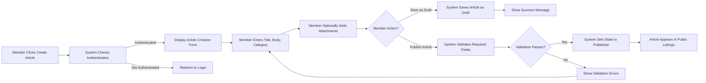
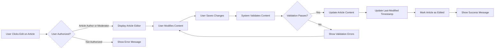
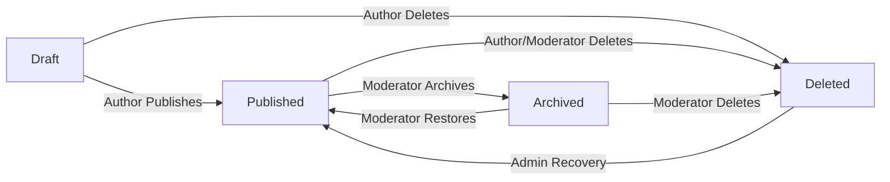
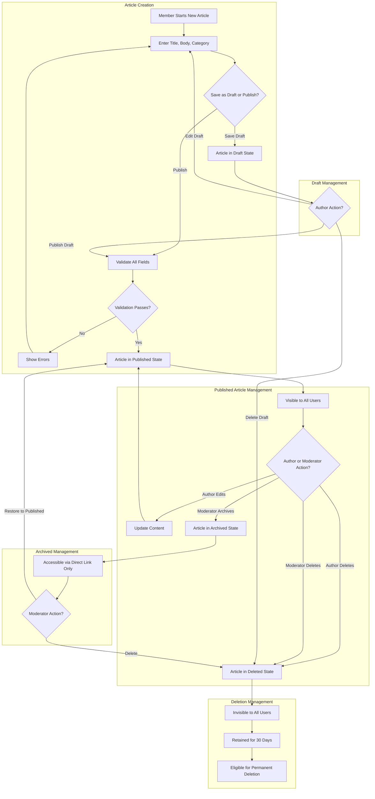

# Article Management Requirements

## Document Purpose

Articles are the core content type of this economic/political discussion board platform, where members share their perspectives, analyses, and discussions on economic and political topics. This document specifies what articles are, how they are created and managed, what states they can exist in, and who can perform various operations on them.

This specification focuses on business requirements and user needs, describing the article lifecycle from a user's perspective. All technical implementation decisions (database schemas, API endpoints, storage mechanisms) are at the discretion of the development team.

## Article Structure and Components

### Core Article Elements

Every article in the discussion board consists of the following components:

**Title**
- THE article SHALL have a title that summarizes the discussion topic
- The title must be clear and descriptive to help users understand the article's focus
- Titles are limited to 200 characters to ensure readability in article lists
- Titles must contain at least 5 characters to ensure meaningful content

**Body Content**
- THE article SHALL have a body containing the main discussion content
- The body supports rich text formatting including paragraphs, headings, bold, italic, underlined text, lists (ordered and unordered), and blockquotes
- The body must contain at least 50 characters to ensure substantive discussion content
- The body has a maximum length of 50,000 characters to prevent extremely long posts that are difficult to read

**Category**
- THE article SHALL be assigned to exactly one category to organize discussions by topic
- Categories include: "Economic Policy", "Political Analysis", "International Relations", "Domestic Policy", "Market Analysis", "Public Finance", "Social Policy", "Election and Democracy", "General Discussion"
- WHEN creating an article, THE member SHALL select a category from the predefined list
- Categories help users find relevant discussions and browse articles by topic area

**Attachments**
- Articles can include image attachments and file attachments to support arguments with visual evidence, documents, charts, or reference materials
- Image attachments are displayed inline within the article view
- File attachments are displayed as downloadable links with file names and sizes
- Attachment requirements are detailed in the Attachments Requirements document

**Author Information**
- THE article SHALL record the member who created it as the author
- The author's name is displayed with the article
- Author information cannot be changed after article creation (articles belong to the member who created them)

**Timestamps**
- THE system SHALL record when the article was created
- THE system SHALL record when the article was last updated
- WHEN a member edits an article, THE system SHALL update the last-modified timestamp
- Timestamps help users understand content recency and activity

**View Count**
- THE system SHALL track how many times the article has been viewed
- WHEN any user (guest, member, or moderator) views an article detail page, THE system SHALL increment the view count by one
- View counts help users identify popular or frequently accessed discussions

**Publication State**
- THE article SHALL have a publication state indicating its current status
- Publication states include: "draft", "published", "archived", and "deleted"
- The publication state determines article visibility and who can access it

### Article Metadata

In addition to visible components, articles track the following metadata:

**Unique Identifier**
- THE system SHALL assign a unique identifier to each article upon creation
- This identifier is used for accessing, referencing, and managing the article

**Edit History Tracking**
- THE system SHALL record whether an article has been edited after initial publication
- WHEN a published article is modified, THE system SHALL indicate that the article has been edited
- This transparency helps users understand that content has been revised

**Moderator Notes** (visible only to moderators)
- Moderators can add internal notes to articles for coordination and record-keeping
- These notes are not visible to regular members or guests
- Notes help moderators track moderation actions and decisions

## Article Creation Process

### Member Article Creation Workflow

**Initiating Article Creation**
- WHEN a member wants to create a new article, THE system SHALL provide an article creation interface
- Guests cannot create articles (read-only access only)
- THE member SHALL be authenticated before accessing article creation

**Composing the Article**
- THE member SHALL enter a title for the article
- THE member SHALL write the body content using the rich text editor
- THE member SHALL select one category from the available category list
- THE member MAY upload image attachments (optional)
- THE member MAY upload file attachments (optional)

**Saving as Draft**
- WHEN a member saves an article without publishing, THE system SHALL create the article in "draft" state
- Draft articles are only visible to the author (the member who created them)
- THE member SHALL be able to return to edit draft articles at any time
- Draft articles do not appear in public article listings

**Publishing the Article**
- WHEN a member publishes an article, THE system SHALL validate all required fields are complete
- IF the title is less than 5 characters, THEN THE system SHALL reject publication and show an error message
- IF the body is less than 50 characters, THEN THE system SHALL reject publication and show an error message
- IF no category is selected, THEN THE system SHALL reject publication and show an error message
- WHEN validation passes and the member confirms publication, THE system SHALL change the article state to "published"
- Published articles immediately become visible in article listings and accessible to all users

**Initial Publication Timestamp**
- WHEN an article transitions from draft to published for the first time, THE system SHALL record the publication timestamp
- This timestamp is displayed as the article's publication date

### Article Creation Business Rules

- Members can create unlimited articles (no quota restrictions for this simple discussion board)
- THE system SHALL process article creation instantly without requiring moderator approval for initial publication
- Article creation should feel immediate and straightforward to encourage participation
- All article data is saved as the member enters it to prevent data loss

### Article Creation Workflow Diagram

## Article Editing and Updating

### Who Can Edit Articles

**Author Editing Rights**
- WHEN a member views their own article, THE system SHALL provide an edit option
- THE member SHALL be able to edit articles they created at any time
- Members cannot edit articles created by other members

**Moderator Editing Rights**
- Moderators can edit any article regardless of author
- WHEN a moderator edits an article, THE system SHALL record the moderator action in moderation logs
- Moderators can edit articles to enforce community guidelines, correct misinformation, or remove inappropriate content

**Guest Editing Rights**
- Guests have no editing capabilities (read-only access)

### Article Editing Workflow

**Accessing the Editor**
- WHEN an authorized user (article author or moderator) clicks edit on an article, THE system SHALL display the article editing interface
- The editing interface is pre-populated with the current article content (title, body, category, attachments)

**Making Changes**
- The user can modify the title, body content, and category
- The user can add new attachments or remove existing attachments
- The user can change the rich text formatting of the body content

**Saving Changes**
- WHEN the user saves changes, THE system SHALL validate the modified content against the same rules as article creation
- IF validation fails, THEN THE system SHALL show error messages and prevent saving
- WHEN validation passes and changes are saved, THE system SHALL update the article content
- THE system SHALL update the last-modified timestamp to the current time
- THE system SHALL mark the article as edited (if it was previously published without edits)

**Publication State During Editing**
- IF the article is in "draft" state, THEN saving keeps it as draft unless the user chooses to publish
- IF the article is in "published" state, THEN saving maintains the published state and updates the content immediately
- Editing a published article does not require re-approval or moderation (edits are immediately visible)

### Edit History Transparency

- WHEN a published article is edited after initial publication, THE system SHALL display an "Edited" indicator with the last-modified timestamp
- This transparency helps readers understand that content has been revised
- The system does not maintain detailed version history (keeping this simple)

### Article Editing Business Rules

- Authors can edit their articles unlimited times
- There is no time window restriction (articles can be edited days, weeks, or months after publication)
- Edits to published articles are immediately visible without requiring moderation approval
- Moderators can edit any content but should document their actions through moderator notes

### Article Editing Workflow Diagram

## Article Publishing States

Articles exist in one of four states throughout their lifecycle: draft, published, archived, and deleted. Each state has specific visibility rules and allowed operations.

### Draft State

**Definition and Purpose**
- Draft articles are works in progress that the author is still composing
- Draft state allows members to save their work without making it publicly visible

**Visibility Rules**
- WHEN an article is in draft state, THE system SHALL make it visible only to the author
- Guests cannot see draft articles
- Other members cannot see draft articles (even if they know the article ID)
- Moderators cannot see draft articles (respecting member privacy for unpublished work)

**Allowed Operations**
- The author can edit draft articles
- The author can delete draft articles permanently
- The author can publish draft articles (transitioning to published state)

**Business Rules**
- THE system SHALL not include draft articles in public article listings or search results
- Draft articles do not have publication timestamps (only creation timestamps)
- Draft articles can remain in draft state indefinitely (no expiration)

### Published State

**Definition and Purpose**
- Published articles are publicly accessible and appear in article listings
- Published state indicates the article is ready for community viewing and discussion

**Visibility Rules**
- WHEN an article is in published state, THE system SHALL make it visible to all users (guests, members, and moderators)
- Published articles appear in article listings, search results, and category browsing
- Anyone can access a published article through its direct link

**Allowed Operations**
- The author can edit published articles (edits are immediately visible)
- The author can delete published articles (transition to deleted state, not immediate permanent deletion)
- Moderators can edit published articles
- Moderators can archive published articles (transition to archived state)
- Moderators can delete published articles

**Business Rules**
- Published articles are indexed by search and included in all public listings
- Published articles have both creation and publication timestamps
- Editing a published article updates the last-modified timestamp but retains the original publication date

### Archived State

**Definition and Purpose**
- Archived articles are older content that has been removed from active circulation but preserved for reference
- Archiving is a moderator action used to reduce clutter while maintaining content history

**Visibility Rules**
- WHEN an article is in archived state, THE system SHALL make it accessible through direct links but exclude it from standard article listings
- Archived articles do not appear in the main article list or category browsing
- Archived articles do not appear in search results
- IF a user accesses an archived article through a direct link, THEN THE system SHALL display the article with an "Archived" indicator
- Guests, members, and moderators can all view archived articles if they have the link

**Allowed Operations**
- Moderators can restore archived articles to published state
- Moderators can delete archived articles (transition to deleted state)
- Authors cannot edit archived articles (content is frozen)

**Business Rules**
- Archiving preserves content for reference while decluttering active listings
- Archived articles retain all their content, attachments, and metadata
- THE system SHALL display a clear visual indicator that the article is archived when viewed

### Deleted State

**Definition and Purpose**
- Deleted articles are content that has been removed by the author or moderators
- Deleted state is a soft-delete mechanism that hides content from all users but retains it in the system for potential recovery

**Visibility Rules**
- WHEN an article is in deleted state, THE system SHALL make it invisible to all users including the original author
- Deleted articles do not appear in any listings, searches, or direct access
- Only system administrators (through backend access) can view deleted articles

**Allowed Operations**
- System administrators can permanently delete articles from the system (hard delete)
- System administrators can restore deleted articles to published state (recovery operation)

**Business Rules**
- WHEN a member deletes their own article, THE system SHALL transition it to deleted state (soft delete)
- WHEN a moderator deletes an article, THE system SHALL transition it to deleted state and log the moderation action
- Deleted articles are retained for 30 days before being eligible for permanent deletion
- After 30 days, deleted articles may be permanently removed from the system during maintenance operations

### State Transition Rules

**Valid State Transitions**
- Draft → Published (author publishes)
- Draft → Deleted (author abandons draft)
- Published → Archived (moderator archives)
- Published → Deleted (author or moderator deletes)
- Archived → Published (moderator restores)
- Archived → Deleted (moderator deletes)
- Deleted → Published (admin recovery only)

**Invalid State Transitions**
- Published cannot transition directly to Draft (no unpublishing to draft)
- Archived cannot transition to Draft
- Deleted cannot transition to Draft or Archived

### Article State Diagram

## Article Deletion and Archiving

### Member Deletion Process

**Author Deleting Own Article**
- WHEN a member views their own article, THE system SHALL provide a delete option
- WHEN the member clicks delete, THE system SHALL request confirmation before proceeding
- The confirmation message should clearly state: "Are you sure you want to delete this article? It will be removed from public view."
- WHEN the member confirms deletion, THE system SHALL transition the article to deleted state
- THE system SHALL immediately remove the article from all public listings and search results
- The author can no longer access the deleted article

**What Happens to Deleted Content**
- The article content, attachments, and metadata are preserved in the system but hidden from all users
- Attachments associated with deleted articles remain in storage for potential recovery
- Deleted articles are retained for 30 days to allow for recovery if needed

**Permanent Deletion Timeline**
- After 30 days in deleted state, articles become eligible for permanent removal
- System administrators may permanently delete old deleted articles during maintenance operations
- Permanent deletion removes all article data and attachments completely from the system

### Moderator Archiving Process

**Purpose of Archiving**
- Moderators use archiving to manage older content that is no longer actively relevant but should be preserved for reference
- Archiving reduces clutter in active article listings while maintaining content history

**Archiving Workflow**
- WHEN a moderator views any published article, THE system SHALL provide an archive option
- WHEN the moderator clicks archive, THE system SHALL request confirmation
- WHEN the moderator confirms archiving, THE system SHALL transition the article to archived state
- THE system SHALL remove the article from active listings and search results
- THE system SHALL record the archiving action in moderation logs with the moderator's identity and timestamp

**Archived Article Access**
- Archived articles remain accessible through direct links
- WHEN a user accesses an archived article, THE system SHALL display the content with a prominent "This article has been archived" banner
- Archived articles preserve all original content, attachments, and metadata

### Moderator Deletion Process

**Moderator Deleting Articles**
- WHEN a moderator views any article (published or archived), THE system SHALL provide a delete option
- WHEN the moderator clicks delete, THE system SHALL request confirmation with a reason field
- The moderator should provide a brief reason for deletion (e.g., "spam", "violates community guidelines", "duplicate content")
- WHEN the moderator confirms deletion, THE system SHALL transition the article to deleted state
- THE system SHALL record the deletion action in moderation logs including the moderator's identity, timestamp, and reason

**Difference from Author Deletion**
- Moderator deletions include a documented reason for accountability
- Moderation logs preserve a record of what was deleted and why
- This transparency helps maintain consistent moderation standards

### Restoring Archived Articles

**Moderator Restoration**
- WHEN a moderator views an archived article, THE system SHALL provide a restore option
- WHEN the moderator clicks restore, THE system SHALL transition the article back to published state
- The article immediately reappears in active listings and search results
- The original publication date is preserved (not reset to the restoration date)

### Article Deletion and Archiving Business Rules

- Members can only delete their own articles, not articles by other members
- Moderators can archive or delete any article regardless of author
- Archiving is reversible; deletion is reversible only within the 30-day retention window
- All moderator actions (archiving, deletion, restoration) must be logged for accountability
- THE system SHALL send a notification to the article author when a moderator archives or deletes their article

## Article Visibility and Access Control

### Guest Access Rights

**What Guests Can Do**
- Guests can view all published articles in their entirety
- Guests can browse article listings and category pages
- Guests can search for published articles
- Guests can view article attachments (images and files)
- Guests can see article metadata (author, publication date, view count, category)

**What Guests Cannot Do**
- Guests cannot create articles
- Guests cannot edit any articles
- Guests cannot delete articles
- Guests cannot view draft articles
- Guests cannot access archived or deleted articles (except archived through direct links)
- Guests cannot perform any moderation actions

**Business Rules for Guest Access**
- THE system SHALL provide full read access to published content for guests to encourage community engagement
- WHEN a guest attempts to create or edit content, THE system SHALL prompt them to register or log in
- Guest access should feel seamless and encourage sign-up by demonstrating the platform's value

### Member Access Rights

**What Members Can Do**
- Members can view all published articles (same as guests)
- Members can create new articles
- Members can edit their own articles (both draft and published)
- Members can delete their own articles
- Members can view their own draft articles
- Members can access archived articles through direct links

**What Members Cannot Do**
- Members cannot edit articles created by other members
- Members cannot delete articles created by other members
- Members cannot view draft articles created by other members
- Members cannot archive articles
- Members cannot perform moderation actions on others' content

**Member-Specific Article Management**
- WHEN a member views their own article, THE system SHALL display edit and delete options
- WHEN a member views another member's article, THE system SHALL not display edit or delete options
- THE system SHALL provide members with a list of their own articles (all states: draft, published, deleted) in their profile area

### Moderator Access Rights

**What Moderators Can Do**
- Moderators can view all published and archived articles
- Moderators can edit any published or archived article regardless of author
- Moderators can archive any published article
- Moderators can delete any published or archived article
- Moderators can restore archived articles to published state
- Moderators can add internal moderator notes to articles

**What Moderators Cannot Do**
- Moderators cannot view draft articles (respecting member privacy for unpublished work)
- Moderators cannot permanently delete articles (only system administrators can hard-delete)
- Moderators cannot restore deleted articles (only system administrators can recover from deleted state)

**Moderator Interface Enhancements**
- WHEN a moderator views any article, THE system SHALL display moderator action options (edit, archive, delete)
- THE system SHALL provide a moderation dashboard showing recent articles, flagged content, and moderation activity
- WHEN a moderator performs an action, THE system SHALL require confirmation and log the action

### Access Control Business Rules

**Permission Hierarchy**
- Guest < Member < Moderator in terms of capabilities
- Each level inherits the read access of lower levels
- Write access is restricted based on ownership (members) or moderation role (moderators)

**Ownership and Authorization**
- THE system SHALL verify user authentication before allowing any write operations
- THE system SHALL check ownership before allowing member edit/delete operations
- THE system SHALL verify moderator status before allowing moderation actions
- IF an unauthorized user attempts a restricted action, THEN THE system SHALL deny access and display an appropriate error message

**Privacy and Security**
- Draft articles are private to their authors (not even moderators can access)
- Published articles are completely public
- Archived articles are semi-public (accessible via direct link but not listed)
- Deleted articles are completely hidden from all user-facing access

### Access Control Matrix

| Action | Guest | Member (Own Article) | Member (Others' Article) | Moderator |
|--------|-------|----------------------|--------------------------|-----------|
| View published article | ✅ | ✅ | ✅ | ✅ |
| View archived article (via link) | ✅ | ✅ | ✅ | ✅ |
| View draft article | ❌ | ✅ (own only) | ❌ | ❌ |
| Create article | ❌ | ✅ | N/A | ✅ |
| Edit article | ❌ | ✅ (own only) | ❌ | ✅ |
| Delete article | ❌ | ✅ (own only) | ❌ | ✅ |
| Archive article | ❌ | ❌ | ❌ | ✅ |
| Restore archived article | ❌ | ❌ | ❌ | ✅ |
| Add moderator notes | ❌ | ❌ | ❌ | ✅ |

## Article Metadata Requirements

### Essential Metadata Tracked

**Article Identification**
- Unique article ID (system-generated, immutable)
- URL-friendly slug derived from the title (for readable URLs)

**Authorship and Ownership**
- Author member ID (references the member who created the article)
- Author display name (stored at time of publication to preserve history even if member changes name)

**Temporal Metadata**
- Creation timestamp (when the article was first created, regardless of state)
- Publication timestamp (when the article first transitioned from draft to published, null for draft articles)
- Last-modified timestamp (updated every time the article is edited)
- Deletion timestamp (when the article was deleted, null for non-deleted articles)
- Archival timestamp (when the article was archived, null for non-archived articles)

**Engagement Metrics**
- View count (incremented each time any user views the article detail page)
- Comment count (number of comments on the article, if commenting is implemented in future)

**Content Classification**
- Category (single category from predefined list)
- Tags (optional keywords for additional classification, may be added in future enhancement)

**State and Status**
- Publication state (draft, published, archived, deleted)
- Edit flag (boolean indicating whether the article has been edited after initial publication)

**Moderation Metadata**
- Moderator notes (text field for internal moderation coordination, visible only to moderators)
- Moderation action log references (links to moderation log entries for actions taken on this article)
- Report count (number of times the article has been reported by users, for future moderation features)

### Metadata Usage

**Search and Discovery**
- Category, publication timestamp, and view count are used to organize and rank articles in listings
- THE system SHALL use metadata to power search functionality and filtering
- Popular articles (high view count) may be featured or highlighted

**Audit and Accountability**
- Temporal metadata provides a complete timeline of article lifecycle events
- Moderation metadata ensures transparency and accountability for moderator actions
- Edit flags and last-modified timestamps provide transparency to readers

**Performance and Optimization**
- View counts help identify popular content
- Timestamps enable efficient sorting and filtering in database queries
- Engagement metrics inform future content recommendations

## Article Listing and Display

### Article List Views

**Main Article Listing (Homepage)**
- THE system SHALL display published articles in reverse chronological order (newest first)
- Each article listing entry shows: title, author name, category, publication date, view count, and excerpt
- The excerpt is the first 200 characters of the article body with HTML tags stripped
- THE system SHALL paginate article listings with 20 articles per page
- Users can navigate through pages to browse older articles

**Category Browsing**
- WHEN a user selects a category, THE system SHALL display all published articles in that category
- Category listings follow the same format and pagination as the main listing
- THE system SHALL display the category name as a heading
- THE system SHALL show the total count of articles in the category

**Author Article Listings**
- WHEN a user clicks on an author's name, THE system SHALL display all published articles by that author
- Author listings follow the same format and pagination as the main listing
- THE system SHALL display the author's name as a heading

**Member's Own Articles Dashboard**
- WHEN a member accesses their article management dashboard, THE system SHALL display all their articles (draft, published, and deleted)
- Articles are grouped by state (drafts, published, deleted)
- Each group shows article title, state, creation date, and action buttons (edit, delete, publish)

### Article Detail View

**Full Article Display**
- WHEN a user accesses an article detail page, THE system SHALL display the complete article content
- Display includes: title, author name, category, publication date, last-modified date (if edited), view count, full body content, and all attachments

**Article Header Section**
- Title is prominently displayed at the top
- Metadata line shows: "By [Author Name] | Published on [Date] | Category: [Category] | Views: [Count]"
- IF the article has been edited, THEN THE system SHALL display: "Last edited on [Date]"

**Article Body Section**
- The rich text body content is rendered with proper formatting
- Images embedded in the body are displayed inline
- Links in the body content are clickable

**Attachments Section**
- IF the article has image attachments, THEN THE system SHALL display them in an image gallery below the body
- IF the article has file attachments, THEN THE system SHALL display them as a list of downloadable links with file names and sizes
- Each attachment is labeled clearly (e.g., "Image Attachments", "File Attachments")

**Article Footer Section**
- Author information and publication details
- Action buttons for authorized users (edit, delete for authors; edit, archive, delete for moderators)

**Archived Article Indicator**
- IF the article is in archived state, THEN THE system SHALL display a prominent banner at the top: "This article has been archived and is no longer active"

### Article Listing Business Rules

- Only published articles appear in public listings
- Archived articles do not appear in listings but are accessible via direct links
- Deleted articles do not appear anywhere in user-facing interfaces
- Draft articles appear only in the author's own article dashboard
- THE system SHALL load article listings quickly to provide a smooth browsing experience (target: under 1 second)

## Article Validation Rules

### Title Validation

**Required Constraints**
- WHEN a user attempts to save or publish an article, THE system SHALL validate that the title is not empty
- IF the title is empty, THEN THE system SHALL reject the operation and display: "Title is required"
- THE system SHALL validate that the title contains at least 5 characters
- IF the title is less than 5 characters, THEN THE system SHALL reject the operation and display: "Title must be at least 5 characters long"
- THE system SHALL validate that the title does not exceed 200 characters
- IF the title exceeds 200 characters, THEN THE system SHALL reject the operation and display: "Title cannot exceed 200 characters"

**Content Constraints**
- THE system SHALL trim leading and trailing whitespace from titles before validation
- THE system SHALL reject titles that consist only of whitespace characters

### Body Content Validation

**Required Constraints**
- WHEN a user attempts to publish an article, THE system SHALL validate that the body content is not empty
- IF the body is empty, THEN THE system SHALL reject publication and display: "Article body is required"
- THE system SHALL validate that the body contains at least 50 characters (excluding HTML tags)
- IF the body is less than 50 characters, THEN THE system SHALL reject publication and display: "Article body must be at least 50 characters long"
- THE system SHALL validate that the body does not exceed 50,000 characters
- IF the body exceeds 50,000 characters, THEN THE system SHALL reject the operation and display: "Article body cannot exceed 50,000 characters"

**Content Quality Constraints**
- THE system SHALL strip or sanitize potentially dangerous HTML tags and JavaScript from body content to prevent security issues
- THE system SHALL preserve safe rich text formatting (paragraphs, headings, lists, bold, italic, underline, blockquotes)
- THE system SHALL reject body content that consists only of whitespace or empty HTML tags

### Category Validation

**Required Constraints**
- WHEN a user attempts to publish an article, THE system SHALL validate that a category has been selected
- IF no category is selected, THEN THE system SHALL reject publication and display: "Please select a category"
- THE system SHALL validate that the selected category is from the predefined category list
- IF the category is invalid, THEN THE system SHALL reject the operation and display: "Invalid category selected"

### Attachment Validation

**File Count and Size Constraints**
- THE system SHALL limit each article to a maximum of 10 image attachments
- THE system SHALL limit each article to a maximum of 5 file attachments
- IF attachment limits are exceeded, THEN THE system SHALL reject the upload and display appropriate error messages
- Individual attachment size and format validation is detailed in the Attachments Requirements document

### Validation Timing

**Draft Saving**
- WHEN saving an article as draft, THE system SHALL perform minimal validation (no empty title)
- Draft saving allows incomplete articles to be saved for later completion
- THE system SHALL allow draft articles with validation errors that would prevent publication

**Publishing**
- WHEN publishing an article, THE system SHALL perform complete validation on all required fields
- ALL validation rules must pass before an article can transition to published state
- IF any validation fails, THEN THE system SHALL prevent publication and display all validation errors clearly

### Validation Error Display

**User-Friendly Error Messages**
- THE system SHALL display validation errors in clear, non-technical language
- THE system SHALL highlight the specific fields that have validation errors
- THE system SHALL allow users to correct errors and retry the operation immediately
- Multiple validation errors should be displayed together (not one at a time)

### Business Rules for Validation

- Validation exists to ensure content quality and prevent spam or low-effort posts
- Validation should be helpful, not obstructive (minimal requirements for genuine discussion)
- THE system SHALL perform validation on both client-side (immediate feedback) and server-side (security)
- Validation rules may be adjusted based on community needs and spam patterns

## Complete Article Lifecycle Workflow

## Summary of Article Management Requirements

**Article Structure**: Articles consist of title, body content, category, attachments, author information, timestamps, view counts, and publication state. All components are designed to support meaningful economic and political discussions with supporting evidence.

**Article Creation**: Members can create articles through a straightforward process, saving drafts for later or publishing immediately after validation. The creation process is designed to be simple and intuitive to encourage participation.

**Article Editing**: Authors can edit their own articles at any time, with changes immediately visible. Moderators can edit any published content for quality control. Editing transparency is maintained through last-modified timestamps and edit indicators.

**Publication States**: Articles progress through four distinct states (draft, published, archived, deleted), each with specific visibility rules and allowed operations. State transitions are controlled based on user roles and business rules.

**Deletion and Archiving**: Members can delete their own content, moderators can archive or delete any content, and all deletions are soft-deletes with a 30-day retention period. Archiving provides a middle ground between active publication and complete removal.

**Access Control**: Clear permission hierarchies define what guests, members, and moderators can do with articles. Ownership and authentication checks ensure users can only perform authorized operations.

**Validation**: Comprehensive validation rules ensure article quality while remaining accessible for genuine contributors. Validation balances content quality requirements with user-friendliness.

**Metadata**: Rich metadata supports search, discovery, engagement tracking, and moderation accountability. Metadata enables future enhancements without requiring fundamental changes to article structure.

All requirements are specified in natural language focusing on business needs and user workflows. Technical implementation decisions—including database design, API structure, storage mechanisms, and frontend frameworks—are entirely at the discretion of the development team.