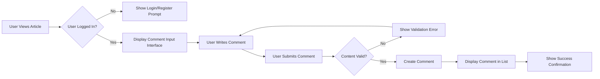
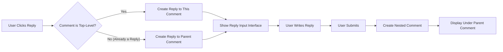
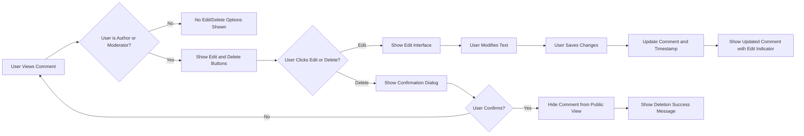
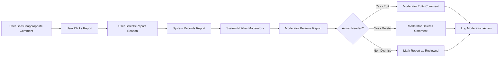
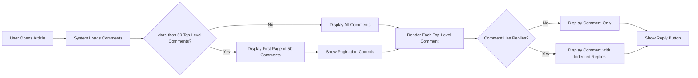
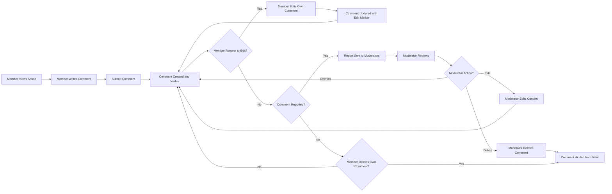

# Comment System Requirements

## Introduction and Purpose

This document defines the complete business requirements for the comment system of the economic/political discussion board. The comment system enables users to engage in discussions by posting responses to articles, fostering dialogue and debate on economic and political topics.

The comment system is designed with simplicity in mind while providing essential functionality for meaningful discussions. Comments allow registered members to share their perspectives, ask questions, and engage with article content and other community members.

This document specifies what users can do with comments, who has permission to perform various actions, how comments are organized and displayed, and the business rules governing comment behavior. All technical implementation decisions (API design, database schemas, architecture) are at the discretion of the development team.

## Comment Creation Requirements

### Comment Posting Capability

**Actor Permissions:**
- **Guests**: CANNOT post comments (read-only access)
- **Members**: CAN post comments on any article
- **Moderators**: CAN post comments on any article

### Functional Requirements

**REQ-COM-001**: WHEN a member is viewing an article, THE system SHALL display a comment input interface.

**REQ-COM-002**: WHEN a member submits a comment, THE system SHALL validate the comment content before accepting it.

**REQ-COM-003**: WHEN a guest attempts to post a comment, THE system SHALL deny the action and prompt the user to register or log in.

**REQ-COM-004**: THE comment input interface SHALL allow members to write text content up to 5,000 characters.

**REQ-COM-005**: WHEN a member submits a comment, THE system SHALL associate the comment with the member's account and the target article.

**REQ-COM-006**: WHEN a comment is successfully created, THE system SHALL display the new comment immediately in the comment list.

**REQ-COM-007**: WHEN a member posts a comment, THE system SHALL record the creation timestamp automatically.

### Comment Creation Business Rules

1. **Authentication Requirement**: Only authenticated members and moderators can post comments
2. **Content Requirement**: Comments must contain at least 1 character of text
3. **Length Limit**: Comments are limited to 5,000 characters maximum
4. **Article Association**: Every comment must be associated with a specific article
5. **Author Attribution**: Every comment must be attributed to the member who created it
6. **Immediate Visibility**: Comments appear immediately without requiring approval (moderation happens post-publication)

### Comment Creation User Flow

## Comment Structure and Fields

### Required Comment Information

Every comment in the system contains the following business information:

1. **Comment Content**: The text written by the user (1-5,000 characters)
2. **Author Information**: Reference to the member who created the comment
3. **Article Reference**: The article this comment belongs to
4. **Creation Timestamp**: When the comment was posted
5. **Last Modified Timestamp**: When the comment was last edited (if applicable)
6. **Parent Comment Reference**: For nested replies (optional, null for top-level comments)
7. **Visibility Status**: Whether the comment is visible or hidden by moderation

### Comment Display Information

When displaying a comment to users, the system presents:

1. **Author's Display Name**: The username of the comment author
2. **Comment Text**: The full content of the comment
3. **Posting Time**: Relative time (e.g., "2 hours ago") or absolute timestamp
4. **Edit Indicator**: Visual indication if the comment has been edited
5. **Action Controls**: Edit/Delete buttons (visible only to authorized users)
6. **Reply Button**: Option to reply to this comment (for members and moderators)

### Comment Metadata Requirements

**REQ-COM-008**: THE system SHALL store the author's user ID with each comment.

**REQ-COM-009**: THE system SHALL store the parent article ID with each comment.

**REQ-COM-010**: THE system SHALL automatically record creation and modification timestamps.

**REQ-COM-011**: WHEN displaying comments, THE system SHALL show the author's current display name.

**REQ-COM-012**: IF a comment has been edited, THE system SHALL indicate this to readers with an "edited" marker.

## Comment Threading and Nesting

### Threading Approach

To maintain simplicity while enabling direct responses, the comment system supports **one level of nesting**:

- **Top-level comments**: Direct responses to the article
- **Replies**: Responses to top-level comments (one level deep only)
- **No deep nesting**: Replies to replies are not supported (kept flat to avoid complexity)

### Threading Business Rules

1. **Single-Level Nesting**: Comments can be either top-level (parent comment is null) or replies (parent comment is a top-level comment)
2. **No Reply Chains**: Users cannot reply to a reply; they must reply to the top-level comment
3. **Reply Association**: Each reply maintains a reference to its parent comment
4. **Chronological Ordering**: Within each thread, replies are ordered by creation time (oldest first)

### Threading Functional Requirements

**REQ-COM-013**: WHEN a member clicks reply on a top-level comment, THE system SHALL allow the member to post a nested reply.

**REQ-COM-014**: WHEN a member clicks reply on a nested reply, THE system SHALL post the new comment as a reply to the original top-level comment, not to the nested reply.

**REQ-COM-015**: THE system SHALL display replies directly beneath their parent comment.

**REQ-COM-016**: WHEN displaying a comment thread, THE system SHALL visually indent replies to distinguish them from top-level comments.

**REQ-COM-017**: IF a top-level comment is deleted by a moderator, THE system SHALL also hide all its replies.

### Reply Creation Flow

## Comment Editing and Deletion Rules

### Edit Permissions

**Actor-Based Edit Rules:**
- **Guests**: CANNOT edit any comments
- **Members**: CAN edit ONLY their own comments
- **Moderators**: CAN edit ANY comment

### Functional Requirements for Editing

**REQ-COM-018**: WHEN a member views their own comment, THE system SHALL display an edit button.

**REQ-COM-019**: WHEN a member clicks edit on their own comment, THE system SHALL present an editing interface with the current comment text.

**REQ-COM-020**: WHEN a member saves edited comment content, THE system SHALL update the comment and record the modification timestamp.

**REQ-COM-021**: WHEN a comment is edited, THE system SHALL display an "edited" indicator to all readers.

**REQ-COM-022**: WHEN a moderator edits any comment, THE system SHALL update the content and mark it as edited.

**REQ-COM-023**: IF a member attempts to edit another member's comment, THE system SHALL deny the action and show an error message.

### Edit Time Restrictions

**REQ-COM-024**: THE system SHALL allow members to edit their own comments at any time after posting (no time limit for editing).

### Edit Business Rules

1. **Ownership Rule**: Members can only edit comments they authored
2. **Moderator Override**: Moderators can edit any comment regardless of authorship
3. **Edit Tracking**: All edits are timestamped and indicated to readers
4. **Content Preservation**: Edit history is not shown to users (only the fact that an edit occurred)
5. **Validation**: Edited comments must meet the same validation rules as new comments

### Delete Permissions

**Actor-Based Delete Rules:**
- **Guests**: CANNOT delete any comments
- **Members**: CAN delete ONLY their own comments
- **Moderators**: CAN delete ANY comment

### Functional Requirements for Deletion

**REQ-COM-025**: WHEN a member views their own comment, THE system SHALL display a delete button.

**REQ-COM-026**: WHEN a member clicks delete on their own comment, THE system SHALL ask for confirmation before proceeding.

**REQ-COM-027**: WHEN a member confirms deletion of their comment, THE system SHALL remove the comment from public view.

**REQ-COM-028**: WHEN a moderator deletes any comment, THE system SHALL remove it from public view immediately.

**REQ-COM-029**: IF a member attempts to delete another member's comment, THE system SHALL deny the action and show an error message.

**REQ-COM-030**: WHEN a top-level comment with replies is deleted, THE system SHALL hide both the parent comment and all its replies.

### Deletion Business Rules

1. **Soft Deletion**: Deleted comments are hidden from public view but retained in the system for potential recovery and audit purposes
2. **Cascade Hiding**: Deleting a parent comment hides all its replies
3. **Moderator Action**: Moderator deletions may include a reason (for internal tracking)
4. **No Permanent User Deletion**: Members cannot permanently erase comments; they can only hide them from public view
5. **Confirmation Required**: All deletions require user confirmation to prevent accidental deletion

### Edit and Delete Workflow

## Comment Moderation Requirements

### Moderator Capabilities

Moderators have comprehensive control over all comments to maintain discussion quality and enforce community guidelines.

**Moderator Permissions:**
- Edit any comment (to remove offensive content while preserving context)
- Delete any comment (to remove inappropriate content entirely)
- View all comments including those hidden by other moderators
- Access moderation history for audit purposes

### Functional Requirements for Moderation

**REQ-COM-031**: WHEN a moderator views any comment, THE system SHALL display moderation controls (edit, delete).

**REQ-COM-032**: WHEN a moderator edits a comment, THE system SHALL record which moderator made the change and when.

**REQ-COM-033**: WHEN a moderator deletes a comment, THE system SHALL record which moderator performed the deletion and when.

**REQ-COM-034**: THE system SHALL maintain an audit log of all moderator actions on comments.

**REQ-COM-035**: WHEN a moderator deletes multiple comments, THE system SHALL process each deletion individually with separate audit entries.

### Content Reporting

**REQ-COM-036**: WHEN a member views any comment, THE system SHALL display a "report" option.

**REQ-COM-037**: WHEN a member reports a comment, THE system SHALL prompt for a reason (e.g., spam, offensive, harassment).

**REQ-COM-038**: WHEN a comment is reported, THE system SHALL notify moderators of the reported content.

**REQ-COM-039**: WHEN moderators view reported comments, THE system SHALL display the report reason and reporter information.

**REQ-COM-040**: WHEN a moderator reviews a reported comment, THE system SHALL provide options to dismiss the report, edit the comment, or delete the comment.

### Moderation Business Rules

1. **Full Authority**: Moderators can modify or remove any comment regardless of author
2. **Audit Trail**: All moderator actions are logged with moderator ID, action type, and timestamp
3. **No Notification**: Authors are not automatically notified when moderators edit or delete their comments
4. **Report Processing**: Reported comments are queued for moderator review but remain visible until moderation action is taken
5. **Multiple Reports**: The same comment can be reported by multiple users; each report is tracked separately

### Content Reporting Workflow

## Comment Listing and Ordering

### Display Requirements

**REQ-COM-041**: WHEN a user views an article, THE system SHALL display all visible comments associated with that article.

**REQ-COM-042**: THE system SHALL paginate comments when an article has more than 50 top-level comments.

**REQ-COM-043**: WHEN displaying paginated comments, THE system SHALL show 50 top-level comments per page.

**REQ-COM-044**: THE system SHALL display all replies to a comment on the same page as the parent comment (replies are not separately paginated).

### Sorting Options

**Default Sorting**: Comments are displayed in chronological order (oldest first) to maintain conversation flow.

**REQ-COM-045**: THE system SHALL display top-level comments in chronological order by default (oldest comments first).

**REQ-COM-046**: THE system SHALL display replies to a comment in chronological order (oldest replies first).

**REQ-COM-047**: WHERE the user selects a different sorting option, THE system SHALL re-order top-level comments accordingly.

**Available Sorting Options:**
1. **Oldest First** (default): Comments ordered by creation time, oldest to newest
2. **Newest First**: Comments ordered by creation time, newest to oldest

### Comment Count Display

**REQ-COM-048**: WHEN displaying an article, THE system SHALL show the total number of comments (including both top-level and replies).

**REQ-COM-049**: WHEN displaying a top-level comment with replies, THE system SHALL show the number of replies to that comment.

### Listing Business Rules

1. **Visibility Filter**: Only non-deleted comments are shown to regular users
2. **Moderator View**: Moderators can optionally view deleted comments for reference
3. **Pagination Scope**: Pagination applies only to top-level comments; all replies to a visible parent are shown
4. **Reply Limit**: If a single comment has more than 100 replies, older replies are collapsed with a "show more" option
5. **Empty State**: If an article has no comments, the system displays an invitation to be the first commenter

### Comment Display Flow

## Comment Interaction Workflows

### Complete Comment Lifecycle

The following diagram illustrates the complete lifecycle of a comment from creation through potential moderation:

### Member Comment Interaction

**Typical Member Actions:**
1. View article and read existing comments
2. Write and post a new comment
3. Reply to an existing comment
4. Edit their own comment if they notice a mistake
5. Delete their own comment if they change their mind
6. Report inappropriate comments they encounter

### Guest Comment Interaction

**Guest Limitations:**
- Can read all comments
- Cannot post, edit, delete, or report comments
- Prompted to register/login when attempting any write action

**REQ-COM-050**: WHEN a guest attempts any comment write action, THE system SHALL display a registration or login prompt.

## Error Handling and Validation

### Input Validation Requirements

**REQ-COM-051**: WHEN a user submits a comment with no content, THE system SHALL reject it and display an error message "Comment cannot be empty."

**REQ-COM-052**: WHEN a user submits a comment exceeding 5,000 characters, THE system SHALL reject it and display an error message "Comment exceeds maximum length of 5,000 characters."

**REQ-COM-053**: WHEN a user submits a comment containing only whitespace, THE system SHALL reject it and display an error message "Comment must contain text content."

**REQ-COM-054**: IF a user attempts to comment on a non-existent article, THE system SHALL return an error "Article not found."

**REQ-COM-055**: IF a user attempts to reply to a non-existent comment, THE system SHALL return an error "Parent comment not found."

### Authentication and Authorization Errors

**REQ-COM-056**: WHEN an unauthenticated user attempts to post a comment, THE system SHALL return an error "You must be logged in to comment" with a login prompt.

**REQ-COM-057**: WHEN a member attempts to edit another member's comment, THE system SHALL return an error "You can only edit your own comments."

**REQ-COM-058**: WHEN a member attempts to delete another member's comment, THE system SHALL return an error "You can only delete your own comments."

### System Error Handling

**REQ-COM-059**: IF the system encounters an error while saving a comment, THE system SHALL display a user-friendly error message "Unable to post comment. Please try again."

**REQ-COM-060**: IF the system encounters an error while loading comments, THE system SHALL display a message "Unable to load comments. Please refresh the page."

**REQ-COM-061**: WHEN an error occurs during comment submission, THE system SHALL preserve the user's comment text so they can retry without rewriting.

### Validation Business Rules

1. **Content Length**: Minimum 1 character, maximum 5,000 characters (excluding leading/trailing whitespace)
2. **Whitespace Trimming**: Leading and trailing whitespace is removed before validation
3. **Special Characters**: All Unicode characters are allowed (no content filtering at validation level)
4. **Required Fields**: Comment content and article reference are mandatory
5. **Duplicate Prevention**: The system allows duplicate comment content (users can post similar comments multiple times)

### Error Recovery

**REQ-COM-062**: WHEN a validation error occurs, THE system SHALL highlight the specific issue and retain the user's input.

**REQ-COM-063**: WHEN a network error occurs during comment submission, THE system SHALL allow the user to retry without re-entering content.

## Performance Expectations

### Response Time Requirements

**REQ-COM-064**: WHEN a user posts a comment, THE system SHALL respond within 2 seconds under normal load.

**REQ-COM-065**: WHEN a user loads an article's comments, THE system SHALL display the first page within 1 second under normal load.

**REQ-COM-066**: WHEN a user navigates to a different comment page, THE system SHALL load the new page within 1 second.

**REQ-COM-067**: WHEN a user edits a comment, THE system SHALL save changes and refresh the display within 2 seconds.

### Concurrent User Support

**REQ-COM-068**: THE system SHALL support at least 100 concurrent users posting and reading comments simultaneously without degradation.

**REQ-COM-069**: THE system SHALL handle multiple users commenting on the same article simultaneously without data loss.

### Scalability Expectations

**REQ-COM-070**: THE system SHALL efficiently handle articles with up to 10,000 comments.

**REQ-COM-071**: WHEN an article has thousands of comments, THE system SHALL use pagination to maintain fast page load times.

### Performance Business Rules

1. **Instant Feedback**: Users should see immediate feedback when posting, editing, or deleting comments
2. **Progressive Loading**: Large comment threads load the first page quickly, then additional pages on demand
3. **Optimistic UI**: Comment posts appear immediately in the UI while saving in the background
4. **Load Distribution**: Pagination keeps comment loading performant even on heavily discussed articles
5. **Background Processing**: Non-critical operations like moderation logging happen asynchronously

### User Experience Expectations

- Comment posting should feel instant for the user
- Page scrolling and navigation should remain smooth even with many comments loaded
- Comment editing should feel responsive with immediate visual feedback
- Error messages should appear immediately when validation fails
- The system should maintain responsiveness during peak discussion times

## Summary

This document has defined the complete business requirements for the comment system of the economic/political discussion board. The comment system provides essential discussion functionality while maintaining simplicity:

**Core Capabilities:**
- Members can post comments on articles with up to 5,000 characters
- One level of comment threading (replies to comments) for focused discussions
- Members can edit and delete their own comments
- Moderators have full control to edit or delete any comment
- Members can report inappropriate comments for moderator review
- Comments are displayed chronologically with pagination for scalability

**Key Business Rules:**
- Only authenticated members can post, edit, or interact with comments
- Guests have read-only access to comments
- Moderators can manage all content with full audit logging
- Comments appear immediately without approval
- Deleted comments are soft-deleted and hidden from public view
- All moderation actions are tracked for accountability

**Simplicity Principles:**
- Single-level threading (no deeply nested conversations)
- Straightforward chronological ordering
- Minimal validation rules
- Clear permission structure
- Essential moderation capabilities without complexity

All technical implementation details including API design, database schemas, caching strategies, and system architecture are at the discretion of the development team.

> *This document describes WHAT the comment system should do from a business and user perspective, not HOW to implement it technically. Developers have full autonomy over all technical decisions.*