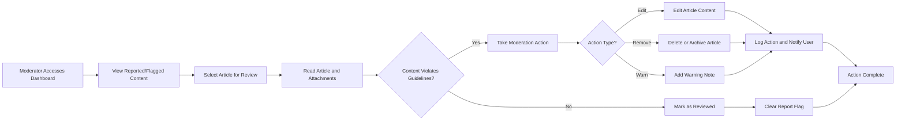
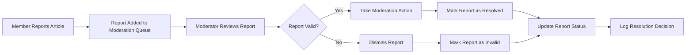

# Content Moderation

## Introduction

Content moderation is essential for maintaining the quality and civility of economic and political discussions on the platform. This document defines how moderators manage content, enforce community guidelines, and ensure the discussion board remains a productive space for thoughtful discourse.

Moderators are trusted community administrators with elevated permissions to review, edit, remove, and manage all user-generated content and user accounts. The moderation system balances the need for quality control with transparency and fairness.

## Moderator Capabilities

### Content Management Powers

**Article Management**
- THE moderator SHALL view all articles regardless of publication state (draft, published, archived)
- THE moderator SHALL edit any article's title, content, or category
- THE moderator SHALL delete any article permanently or move it to archived state
- THE moderator SHALL restore archived articles to published state
- THE moderator SHALL change article visibility settings
- THE moderator SHALL pin important articles to the top of article lists
- THE moderator SHALL unpin previously pinned articles

**Attachment Management**
- THE moderator SHALL view all attachments associated with any article
- THE moderator SHALL remove individual attachments from articles
- THE moderator SHALL replace inappropriate attachments with moderation notices
- THE moderator SHALL download attachments for review purposes

**User Account Management**
- THE moderator SHALL view all user accounts and their activity history
- THE moderator SHALL suspend user accounts temporarily
- THE moderator SHALL permanently ban user accounts
- THE moderator SHALL restore suspended or banned accounts
- THE moderator SHALL reset user passwords when necessary
- THE moderator SHALL view all content created by a specific user

**System-Wide Oversight**
- THE moderator SHALL access moderation dashboard showing flagged content
- THE moderator SHALL view content reports submitted by members
- THE moderator SHALL search and filter content by various criteria
- THE moderator SHALL view moderation activity logs

## Content Review Process

### Moderation Dashboard

WHEN a moderator logs into the system, THE system SHALL display a moderation dashboard showing:
- Number of pending content reports
- Recently published articles awaiting review
- Flagged articles requiring attention
- Recent moderation actions taken by all moderators
- User accounts with multiple reports

THE moderator SHALL access the moderation dashboard from the main navigation menu.

### Article Review Workflow

**Review Process Requirements**

WHEN a moderator selects an article for review, THE system SHALL display:
- Complete article content with all formatting
- All attached images and files
- Article metadata (author, publication date, edit history)
- All reports or flags associated with the article
- Author's account status and content history

WHEN reviewing content, THE moderator SHALL have options to:
- Approve content and clear flags
- Edit content to remove violations while preserving discussion value
- Archive content (removes from public view but preserves for records)
- Delete content permanently
- Suspend or ban the content author
- Add internal moderator notes visible only to other moderators

### Attachment Review

WHEN a moderator reviews article attachments, THE system SHALL allow:
- Viewing all images inline
- Downloading files for detailed inspection
- Removing individual attachments without deleting the entire article
- Viewing attachment metadata (filename, size, upload date, uploader)

IF an attachment violates guidelines, THEN THE moderator SHALL remove the attachment and optionally add a moderation note explaining the removal.

## Content Management Actions

### Editing Content

**Article Editing by Moderators**

WHEN a moderator edits an article, THE system SHALL:
- Preserve the original content in revision history
- Record the moderator's identity and edit timestamp
- Allow editing title, body content, and category
- Display "Edited by Moderator" indicator on the article
- Optionally notify the original author of the changes

THE moderator SHALL provide a reason for the edit when making changes to user content.

**Edit Reasons and Transparency**

WHEN a moderator edits user content, THE system SHALL require:
- A brief explanation of why the edit was made
- Selection of edit category (removing profanity, correcting misinformation, removing personal information, etc.)

THE system SHALL display edit history to the original author showing what was changed and why.

### Removing and Archiving Content

**Content Removal Options**

THE system SHALL provide two removal methods:
1. **Archive**: Content is hidden from public view but preserved in the system
2. **Permanent Delete**: Content is completely removed from the system

**Archive Process**

WHEN a moderator archives an article, THE system SHALL:
- Remove the article from all public article lists
- Prevent guests and members from viewing the article
- Preserve the article and all attachments in archived state
- Allow other moderators to view archived content
- Record the archiving moderator and timestamp
- Require a reason for archiving

WHEN viewing an archived article, THE moderator SHALL have the option to restore it to published state.

**Permanent Deletion**

WHEN a moderator permanently deletes an article, THE system SHALL:
- Require confirmation before deletion
- Require a detailed reason for permanent deletion
- Remove the article and all associated attachments from storage
- Preserve deletion record in moderation logs (without content)
- Notify the original author of the deletion
- Make the action irreversible

IF an article has been reported multiple times or violates serious guidelines, THEN permanent deletion SHALL be recommended over archiving.

### Pinning Articles

**Article Pinning for Visibility**

THE moderator SHALL pin articles to highlight important discussions.

WHEN a moderator pins an article, THE system SHALL:
- Display the pinned article at the top of article lists
- Show a "Pinned" indicator on the article
- Allow multiple articles to be pinned simultaneously
- Maintain pinned status across all article list views

THE moderator SHALL unpin articles when they are no longer priority content.

THE system SHALL display pinned articles in chronological order of pinning, with most recently pinned first.

## User Account Management by Moderators

### User Account Actions

**Account Suspension**

WHEN a moderator suspends a user account, THE system SHALL:
- Prevent the user from logging in during suspension period
- Display suspension reason and duration to the user on login attempt
- Preserve all user content during suspension
- Record the suspension in the user's account history
- Require the moderator to specify suspension duration and reason

THE moderator SHALL specify suspension duration (1 day, 7 days, 30 days, or indefinite).

WHEN a suspension period expires, THE system SHALL automatically restore account access.

**Account Banning**

WHEN a moderator bans a user account permanently, THE system SHALL:
- Prevent all future login attempts from the account
- Optionally archive or delete all content created by the user
- Record the ban reason in moderation logs
- Require confirmation and detailed justification for permanent bans

THE moderator SHALL choose whether to preserve, archive, or delete the banned user's content.

**Account Restoration**

WHEN a moderator restores a suspended or banned account, THE system SHALL:
- Re-enable login access immediately
- Restore any archived content associated with the account
- Record the restoration action in moderation logs
- Optionally notify the user of account restoration

### User Activity Review

**Viewing User History**

WHEN a moderator views a user's activity, THE system SHALL display:
- All articles created by the user
- Account creation date and registration information
- Number of reports received against the user's content
- Previous moderation actions taken on the account
- Current account status (active, suspended, banned)

THE system SHALL allow moderators to filter and search user content by date, category, or status.

## Reporting and Flagging System

### User-Driven Content Reporting

**Report Submission by Members**

THE system SHALL allow members to report articles that violate community guidelines.

WHEN a member views an article, THE system SHALL display a "Report Article" option.

WHEN a member submits a report, THE system SHALL:
- Require selection of report reason category
- Allow optional detailed explanation
- Submit the report to the moderation queue
- Confirm report submission to the reporter
- Keep reporter identity confidential from the article author

**Report Categories**

THE system SHALL provide these report reason categories:
- Spam or misleading content
- Harassment or abusive language
- Misinformation or false claims
- Inappropriate or offensive content
- Off-topic or irrelevant discussion
- Copyright violation
- Privacy violation (sharing personal information)
- Other (requires detailed explanation)

WHEN a member selects a report category, THE system SHALL require additional details if "Other" is selected.

### Report Management Workflow

**Moderator Report Review**

WHEN a moderator reviews a content report, THE system SHALL display:
- The reported article with full content
- Report reason and reporter's explanation
- Number of reports received for this article
- Reporter's account standing (if multiple reports from same user)

WHEN a moderator resolves a report, THE system SHALL:
- Mark the report as resolved or dismissed
- Record the moderator's decision and action taken
- Update the article status if action was taken
- Remove the report from pending queue

### Report Aggregation

IF an article receives multiple reports from different users, THEN THE system SHALL:
- Increase priority in the moderation queue
- Display report count prominently to moderators
- Group reports for the same article together

WHEN an article receives 5 or more reports, THE system SHALL automatically flag it for immediate moderator attention.

## Moderation Activity Logging

### Comprehensive Audit Trail

**All Moderation Actions Must Be Logged**

THE system SHALL create a log entry for every moderation action including:
- Action type (edit, archive, delete, suspend, ban, restore)
- Moderator identity who performed the action
- Target content or user account affected
- Timestamp of the action
- Reason provided by the moderator
- Previous state and new state of the content/account

**Log Retention**

THE system SHALL retain moderation logs indefinitely for transparency and accountability.

THE system SHALL prevent modification or deletion of log entries.

### Moderator Activity Dashboard

**Moderation Log Viewing**

WHEN a moderator accesses moderation logs, THE system SHALL display:
- Recent moderation actions across all moderators
- Ability to filter by action type, moderator, or date range
- Search functionality for specific content or users
- Export capability for generating moderation reports

THE system SHALL allow moderators to view all actions taken on a specific article or user account.

### Transparency and User Notification

**User Notification of Moderation Actions**

WHEN content is moderated, THE system SHALL notify the content author including:
- What action was taken (edited, archived, deleted)
- Which guideline was violated
- Moderator's reason for the action
- Information about appeal process (if applicable)
- Account status if suspension or ban was applied

WHEN a moderator edits user content, THE system SHALL show the changes in a comparison view to the original author.

## Community Guidelines Enforcement

### Content Quality Standards

**Guidelines for Economic and Political Discussions**

THE system SHALL enforce these content standards:

1. **Respectful Discourse**: Articles and discussions must remain civil and respectful, even when disagreeing
2. **Factual Accuracy**: Claims should be supported with evidence; misinformation should be corrected or removed
3. **Relevance**: Content must relate to economic or political topics
4. **No Personal Attacks**: Criticism of ideas is welcome; attacks on individuals are not permitted
5. **No Spam**: Promotional content, repetitive posts, and spam are prohibited
6. **Privacy Respect**: Personal information about individuals cannot be shared without consent
7. **Legal Compliance**: Content must comply with applicable laws regarding defamation, copyright, and protected speech

### Enforcement Actions Based on Violation Severity

**Minor Violations**

IF content contains minor violations (formatting issues, slightly off-topic content), THEN THE moderator SHALL:
- Edit the content to correct the issue
- Add a note explaining the correction
- Allow the article to remain published

**Moderate Violations**

IF content contains moderate violations (uncivil language, unsupported claims, borderline relevance), THEN THE moderator SHALL:
- Edit or archive the content
- Warn the author
- Track warnings in the user's account history

**Severe Violations**

IF content contains severe violations (harassment, spam, serious misinformation, illegal content), THEN THE moderator SHALL:
- Delete the content immediately
- Suspend or ban the author's account
- Report to authorities if legally required

### Progressive Enforcement

**Warning and Escalation System**

THE system SHALL track user violations with progressive consequences:

1. **First Violation**: Edit content and issue warning
2. **Second Violation**: Archive content and issue final warning
3. **Third Violation**: Temporary suspension (7 days)
4. **Fourth Violation**: Extended suspension (30 days)
5. **Fifth Violation**: Permanent ban

IF a violation is severe enough, THEN THE moderator SHALL skip progressive steps and apply immediate suspension or ban.

## Performance and User Experience Requirements

### Moderation Response Time

**Timely Content Review**

WHEN content is reported by users, THE system SHALL surface it in the moderation queue instantly.

WHILE moderators are actively using the system, THE moderation dashboard SHALL refresh automatically to show new reports.

**User Notification Timing**

WHEN a moderation action is taken, THE system SHALL notify the affected user within 2 seconds of the action.

THE notification SHALL appear in the user's account immediately upon their next login.

### Moderation Interface Usability

**Efficient Moderation Workflow**

THE moderation interface SHALL provide:
- Quick access to reported content without excessive navigation
- Bulk action capabilities for handling multiple similar reports
- Keyboard shortcuts for common moderation actions
- Clear visual indicators for priority reports
- Context-rich information to make informed decisions quickly

WHEN a moderator takes an action, THE system SHALL provide immediate visual feedback confirming the action within 1 second.

### Search and Filter Capabilities

**Finding Content for Review**

THE system SHALL allow moderators to search and filter by:
- Report status (pending, resolved, dismissed)
- Content type (article, attachment)
- Date range
- Report category
- Author username
- Keywords in article content

THE search results SHALL display within 2 seconds for common queries involving up to 10,000 records.

## Error Handling and Edge Cases

### Handling Moderation Conflicts

**Concurrent Moderation Actions**

IF two moderators attempt to moderate the same article simultaneously, THEN THE system SHALL:
- Allow the first action to complete
- Notify the second moderator that the content has been modified
- Refresh the content view to show current state
- Prevent conflicting actions from being applied

WHEN a moderation conflict occurs, THE system SHALL display a clear message: "This content was just modified by [moderator name]. Please review the current version before taking action."

### Restoring Mistakenly Moderated Content

**Moderation Reversal**

WHEN a moderator realizes content was incorrectly moderated, THE system SHALL:
- Allow restoration of archived content
- Allow reversal of account suspensions
- Preserve all moderation logs including the reversal action
- Notify the affected user of the correction

IF content was permanently deleted, THEN restoration SHALL NOT be possible, reinforcing the importance of using archive for uncertain cases.

WHEN reversing a moderation action, THE moderator SHALL provide a reason explaining why the original action was incorrect.

### Handling Appeals

**User Appeals Process**

WHEN a user believes their content was unfairly moderated, THE system SHALL provide:
- Appeal submission form with explanation field
- Notification to moderators of pending appeal
- Appeal review by a different moderator than who took the original action
- Formal response to the user with final decision within 7 days

THE system SHALL track appeals in moderation logs for transparency.

WHEN an appeal is submitted, THE system SHALL:
- Assign the appeal to a different moderator than who made the original decision
- Display the original content (if available), original moderation reason, and user's appeal explanation
- Allow the reviewing moderator to uphold or reverse the original decision
- Require a detailed response explaining the appeal decision

IF an appeal is upheld (original decision reversed), THEN THE system SHALL:
- Restore the content to its previous state
- Notify the user of the successful appeal
- Add a note to the moderation log indicating the reversal

IF an appeal is denied, THEN THE system SHALL:
- Notify the user with explanation of why the original decision stands
- Mark the appeal as resolved
- Prevent further appeals on the same moderation action

### Edge Case: Moderator Account Compromise

**Handling Suspicious Moderator Activity**

IF a moderator account shows suspicious activity patterns (mass deletions, unusual login location, rapid-fire actions), THEN THE system SHALL:
- Flag the activity for administrative review
- Optionally require re-authentication for high-impact actions
- Log all suspicious activity with enhanced detail
- Allow system administrators to temporarily suspend moderator privileges

### Edge Case: Mass Reporting Abuse

**Preventing Report Spam**

IF a single user submits more than 10 reports within 1 hour, THEN THE system SHALL:
- Flag the user's account for review
- Require additional justification for subsequent reports
- Notify moderators of potential report abuse

IF multiple users coordinate to mass-report a single article that doesn't violate guidelines, THEN THE moderator SHALL:
- Dismiss all related reports
- Mark the article as "reviewed and approved"
- Optionally investigate the coordinated reporting for abuse

### Edge Case: Deleted User Content

**Handling Content from Banned Users**

WHEN a user account is permanently banned, THE moderator SHALL choose one of these options:
1. **Preserve Content**: Keep all articles published under "Anonymous" or "[Deleted User]"
2. **Archive Content**: Move all articles to archived state, hidden from public view
3. **Delete Content**: Permanently remove all articles and attachments

THE system SHALL apply the chosen option consistently to all content created by the banned user.

IF valuable discussions exist on a banned user's articles, THEN THE moderator SHOULD preserve the content under "[Deleted User]" to maintain discussion continuity.

## Summary

Content moderation maintains the quality and civility of economic and political discussions on the platform. Moderators have comprehensive tools to review, edit, archive, and delete content, manage user accounts, and enforce community guidelines. The moderation system emphasizes transparency through detailed logging, user notifications, and clear communication of guidelines and enforcement actions.

The reporting system allows community members to flag problematic content, creating a collaborative approach to content quality. Progressive enforcement and clear guidelines ensure fair and consistent moderation practices while keeping the discussion board focused on thoughtful, respectful discourse.

Key capabilities include:
- Comprehensive content management (view, edit, archive, delete, pin)
- User account management (suspend, ban, restore)
- User-driven reporting system with multiple report categories
- Detailed moderation activity logging for transparency
- Appeal process for disputed moderation decisions
- Progressive enforcement based on violation severity
- Real-time moderation dashboard with search and filter capabilities

> *This document defines business requirements for content moderation. Technical implementation details such as database schemas, API endpoints, and system architecture are determined in subsequent development phases.*