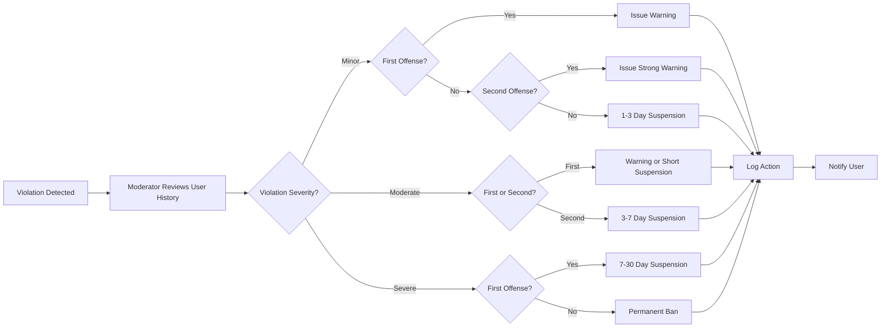
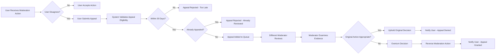

# Moderation and Content Management

## 1. Introduction

### 1.1 Purpose of Moderation

This document defines the moderation capabilities, content reporting mechanisms, and administrative functions required to maintain a healthy, respectful discussion environment on the economic/political discussion board. Moderation ensures that discussions remain civil, productive, and aligned with community standards while respecting freedom of expression within appropriate boundaries.

The moderation system serves three primary purposes:
- **Community Quality**: Maintaining high-quality discussions by removing spam, off-topic content, and disruptive behavior
- **Safety and Respect**: Protecting users from harassment, hate speech, and other harmful content
- **Guidelines Enforcement**: Ensuring consistent application of community standards across all discussions

### 1.2 Moderator Role

Moderators are trusted users with elevated permissions who serve as community stewards. Unlike regular members, moderators can manage content created by any user, review reported content, and take enforcement actions to maintain discussion quality. Moderators act as both administrators and community leaders, balancing enforcement with encouragement of healthy discourse.

### 1.3 Relationship to User Actors

This document builds upon the user actor definitions in the [User Actors and Authentication Document](./02-user-actors-and-authentication.md). The moderation capabilities defined here apply specifically to users with the moderator role. For reference:

- **Guests**: Cannot report content or access moderation features
- **Members**: Can report content but cannot access moderation tools
- **Moderators**: Have full access to all moderation capabilities defined in this document

## 2. Moderator Capabilities

### 2.1 Content Management Permissions

#### 2.1.1 Article Moderation

**EARS Requirements:**

- **THE** system **SHALL** allow moderators to view all articles regardless of author or status
- **THE** system **SHALL** allow moderators to edit any article title and content
- **THE** system **SHALL** allow moderators to delete any article
- **THE** system **SHALL** allow moderators to restore previously deleted articles
- **WHEN** a moderator edits an article, **THE** system **SHALL** preserve the original content in edit history
- **WHEN** a moderator deletes an article, **THE** system **SHALL** record the deletion reason
- **THE** system **SHALL** allow moderators to manage article attachments (add, remove, replace)
- **THE** system **SHALL** allow moderators to modify article categories and tags

#### 2.1.2 Comment Moderation

**EARS Requirements:**

- **THE** system **SHALL** allow moderators to view all comments regardless of author or status
- **THE** system **SHALL** allow moderators to edit any comment content
- **THE** system **SHALL** allow moderators to delete any comment
- **THE** system **SHALL** allow moderators to restore previously deleted comments
- **WHEN** a moderator edits a comment, **THE** system **SHALL** preserve the original content in edit history
- **WHEN** a moderator deletes a comment, **THE** system **SHALL** record the deletion reason
- **THE** system **SHALL** display a moderation indicator on moderator-edited content showing it was modified by a moderator

#### 2.1.3 Bulk Content Operations

**EARS Requirements:**

- **THE** system **SHALL** allow moderators to select multiple articles or comments for bulk actions
- **THE** system **SHALL** support bulk deletion of selected content items
- **THE** system **SHALL** require confirmation before executing bulk moderation actions
- **WHEN** performing bulk actions, **THE** system **SHALL** record a single moderation action with all affected content items
- **THE** system **SHALL** allow moderators to delete all content from a specific user in one operation

### 2.2 User Management Permissions

#### 2.2.1 User Account Actions

**EARS Requirements:**

- **THE** system **SHALL** allow moderators to view all user profiles and account information
- **THE** system **SHALL** allow moderators to view user activity history including all articles and comments
- **THE** system **SHALL** allow moderators to temporarily suspend user accounts
- **WHEN** a moderator suspends a user, **THE** system **SHALL** require suspension duration (in days) and reason
- **THE** system **SHALL** allow moderators to permanently ban user accounts
- **WHEN** a moderator bans a user, **THE** system **SHALL** require a ban reason
- **WHEN** a user is suspended or banned, **THE** system **SHALL** prevent that user from logging in
- **WHEN** a user is suspended or banned, **THE** system **SHALL** display the reason and duration (if applicable) on login attempts
- **THE** system **SHALL** allow moderators to lift suspensions or bans before expiration
- **THE** system **SHALL** automatically restore access when a suspension period expires

#### 2.2.2 User Warning System

**EARS Requirements:**

- **THE** system **SHALL** allow moderators to issue warnings to users without suspending their accounts
- **WHEN** issuing a warning, **THE** system **SHALL** require a warning reason and description
- **THE** system **SHALL** notify users immediately when they receive a warning
- **THE** system **SHALL** display warning details to the warned user in their account settings
- **THE** system **SHALL** maintain a record of all warnings issued to each user
- **THE** system **SHALL** allow moderators to view warning history for any user

### 2.3 Moderator-Specific Features

#### 2.3.1 Moderation Dashboard Access

**EARS Requirements:**

- **THE** system **SHALL** provide moderators with a dedicated moderation dashboard
- **THE** moderation dashboard **SHALL** display pending reports requiring review
- **THE** moderation dashboard **SHALL** display recent moderation activity across all moderators
- **THE** moderation dashboard **SHALL** show statistics including total reports, resolved reports, and pending reports
- **THE** moderation dashboard **SHALL** provide quick access to recently reported content
- **THE** system **SHALL** highlight urgent reports (multiple reports on same content) in the dashboard

#### 2.3.2 Search and Filter Capabilities

**EARS Requirements:**

- **THE** system **SHALL** allow moderators to search for content by author username
- **THE** system **SHALL** allow moderators to filter content by report status (reported, under review, resolved)
- **THE** system **SHALL** allow moderators to filter content by moderation status (normal, edited by moderator, deleted)
- **THE** system **SHALL** allow moderators to search moderation logs by moderator name, action type, or date range
- **THE** system **SHALL** allow moderators to view all content from a specific IP address (for spam detection)

## 3. Content Reporting System

### 3.1 User Reporting Capabilities

#### 3.1.1 Who Can Report

**EARS Requirements:**

- **THE** system **SHALL** allow authenticated members to report articles and comments
- **THE** system **SHALL** prevent guests from reporting content
- **THE** system **SHALL** prevent users from reporting their own content
- **THE** system **SHALL** allow users to report the same content only once
- **WHEN** a user attempts to report already-reported content, **THE** system **SHALL** inform them their report was already submitted

#### 3.1.2 Report Submission Process

**EARS Requirements:**

- **THE** system **SHALL** provide a "Report" button on every article and comment
- **WHEN** a user clicks the Report button, **THE** system **SHALL** display a report submission form
- **THE** report submission form **SHALL** require the user to select a report reason from predefined categories
- **THE** report submission form **SHALL** allow users to provide optional additional details (maximum 500 characters)
- **WHEN** a user submits a report, **THE** system **SHALL** validate that a report reason is selected
- **WHEN** a report is successfully submitted, **THE** system **SHALL** display a confirmation message
- **WHEN** a report is successfully submitted, **THE** system **SHALL** add the content to the moderation review queue

### 3.2 Report Categories

**EARS Requirements:**

- **THE** system **SHALL** support the following report reason categories:
  - Spam or advertising
  - Harassment or bullying
  - Hate speech or discrimination
  - Misinformation or false information
  - Off-topic or irrelevant content
  - Inappropriate language or profanity
  - Personal information disclosure
  - Other (requires explanation)
- **WHEN** a user selects "Other" as the report reason, **THE** system **SHALL** require additional details

### 3.3 Report Information Captured

**EARS Requirements:**

- **WHEN** a report is created, **THE** system **SHALL** record the reporting user's identity
- **WHEN** a report is created, **THE** system **SHALL** record the reported content (article or comment) with full details
- **WHEN** a report is created, **THE** system **SHALL** record the report reason category
- **WHEN** a report is created, **THE** system **SHALL** record any additional details provided
- **WHEN** a report is created, **THE** system **SHALL** record the timestamp of report submission
- **WHEN** a report is created, **THE** system **SHALL** assign the report a unique identifier
- **THE** system **SHALL** preserve report information even if the reported content is deleted

### 3.4 Report Notifications

**EARS Requirements:**

- **WHEN** a report is submitted, **THE** system **SHALL** notify all active moderators of the new report
- **WHEN** multiple users report the same content, **THE** system **SHALL** consolidate reports and increase priority
- **IF** content receives 5 or more reports, **THEN** **THE** system **SHALL** send urgent notification to all moderators
- **THE** system **SHALL** not notify the content author that their content was reported until moderation review is complete

## 4. Content Review and Moderation Workflows

### 4.1 Report Queue Management

#### 4.1.1 Accessing Reports

**EARS Requirements:**

- **THE** system **SHALL** provide moderators with a report queue listing all pending reports
- **THE** report queue **SHALL** display reports in order of priority (most reported content first)
- **THE** report queue **SHALL** show the following information for each report:
  - Content type (article or comment)
  - Content preview or excerpt
  - Report reason category
  - Number of reports for this content
  - Time since first report
  - Current review status
- **THE** system **SHALL** allow moderators to filter the report queue by content type, report reason, or date range
- **THE** system **SHALL** highlight reports pending for more than 24 hours

#### 4.1.2 Claiming Reports for Review

**EARS Requirements:**

- **WHEN** a moderator opens a report, **THE** system **SHALL** mark the report as "under review"
- **WHEN** a report is under review, **THE** system **SHALL** display which moderator is reviewing it
- **THE** system **SHALL** allow other moderators to view reports under review by colleagues
- **THE** system **SHALL** allow moderators to reassign reports to themselves if needed
- **IF** a report remains under review for more than 2 hours without action, **THEN** **THE** system **SHALL** return it to pending status

### 4.2 Report Review Interface

#### 4.2.1 Review Information Display

**EARS Requirements:**

- **WHEN** a moderator reviews a report, **THE** system **SHALL** display the complete reported content
- **WHEN** reviewing a report, **THE** system **SHALL** display all reports submitted for this content with reasons and details
- **WHEN** reviewing a report, **THE** system **SHALL** display the content author's username and account age
- **WHEN** reviewing a report, **THE** system **SHALL** display the content author's recent content history
- **WHEN** reviewing a report, **THE** system **SHALL** display any previous moderation actions on this user
- **WHEN** reviewing a report, **THE** system **SHALL** display the full context (for comments, show the parent article and surrounding comments)

#### 4.2.2 Moderation Decision Options

**EARS Requirements:**

- **THE** system **SHALL** provide moderators with the following decision options when reviewing a report:
  - Dismiss report (no action needed)
  - Edit content to remove violations
  - Delete content
  - Warn user
  - Suspend user
  - Ban user
- **WHEN** making any moderation decision, **THE** system **SHALL** require the moderator to provide a decision reason
- **THE** system **SHALL** allow moderators to take multiple actions (e.g., delete content AND warn user)
- **WHEN** a moderator dismisses a report, **THE** system **SHALL** mark the content as reviewed and remove it from the queue
- **WHEN** a moderator takes enforcement action, **THE** system **SHALL** mark all related reports as resolved

### 4.3 Communication with Content Authors

#### 4.3.1 Moderation Notifications

**EARS Requirements:**

- **WHEN** a moderator edits user content, **THE** system **SHALL** notify the content author
- **WHEN** a moderator deletes user content, **THE** system **SHALL** notify the content author with deletion reason
- **WHEN** a moderator issues a warning, **THE** system **SHALL** send detailed warning notification to the user
- **WHEN** a moderator suspends a user, **THE** system **SHALL** send suspension notification with duration and reason
- **WHEN** a moderator bans a user, **THE** system **SHALL** send ban notification with reason
- **THE** notification **SHALL** include the specific content that triggered moderation action
- **THE** notification **SHALL** include the community guideline violated (if applicable)
- **THE** notification **SHALL** provide information on how to appeal moderation decisions

#### 4.3.2 Appeal Process

**EARS Requirements:**

- **THE** system **SHALL** allow users to appeal moderation decisions within 30 days
- **WHEN** a user appeals a decision, **THE** system **SHALL** require appeal reason and explanation
- **WHEN** an appeal is submitted, **THE** system **SHALL** notify all moderators
- **THE** system **SHALL** allow a different moderator (not the original) to review appeals
- **WHEN** reviewing an appeal, **THE** system **SHALL** display the original moderation action and reason
- **THE** system **SHALL** allow moderators to uphold or overturn the original decision
- **WHEN** an appeal is decided, **THE** system **SHALL** notify the user of the final decision
- **THE** system **SHALL** limit users to one appeal per moderation action

## 5. Moderation Actions and Enforcement

### 5.1 Content Actions

#### 5.1.1 Content Editing

**EARS Requirements:**

- **WHEN** a moderator edits content, **THE** system **SHALL** preserve the original version in edit history
- **WHEN** editing content, **THE** system **SHALL** allow moderators to modify text, titles, and formatting
- **WHEN** editing content, **THE** system **SHALL** display a "Edited by Moderator" indicator on the content
- **THE** system **SHALL** record the moderator's username, timestamp, and edit reason in the edit history
- **THE** system **SHALL** allow viewing the complete edit history including original and all modified versions

#### 5.1.2 Content Deletion

**EARS Requirements:**

- **WHEN** a moderator deletes content, **THE** system **SHALL** mark it as deleted rather than permanently removing it
- **WHEN** content is deleted, **THE** system **SHALL** hide it from public view immediately
- **WHEN** content is deleted, **THE** system **SHALL** display a placeholder message indicating content was removed by moderation
- **THE** system **SHALL** allow moderators to view deleted content in the moderation interface
- **THE** system **SHALL** record the deleting moderator's username, timestamp, and deletion reason
- **WHEN** an article is deleted, **THE** system **SHALL** also hide all associated comments
- **THE** system **SHALL** allow moderators to choose between soft delete (can be restored) and permanent delete

#### 5.1.3 Content Restoration

**EARS Requirements:**

- **THE** system **SHALL** allow moderators to restore soft-deleted content
- **WHEN** content is restored, **THE** system **SHALL** make it visible to users again
- **WHEN** content is restored, **THE** system **SHALL** record the restoring moderator's username, timestamp, and restoration reason
- **WHEN** content is restored, **THE** system **SHALL** notify the content author of restoration
- **THE** system **SHALL** not allow restoration of permanently deleted content

### 5.2 User Enforcement Actions

#### 5.2.1 Warning System

**EARS Requirements:**

- **WHEN** a moderator issues a warning, **THE** system **SHALL** create a warning record in the user's account
- **THE** warning record **SHALL** include the moderator's username, timestamp, warning reason, and specific content that triggered the warning
- **THE** system **SHALL** send immediate email and in-platform notification to the warned user
- **THE** system **SHALL** display active warnings in the user's account settings
- **THE** system **SHALL** maintain permanent record of all warnings for moderator reference
- **THE** system **SHALL** allow users to acknowledge receipt of warnings
- **THE** system **SHALL** not restrict user actions based solely on warnings (warnings are informational)

#### 5.2.2 User Suspension

**EARS Requirements:**

- **WHEN** a moderator suspends a user, **THE** system **SHALL** require suspension duration in days (minimum 1 day, maximum 365 days)
- **WHEN** a moderator suspends a user, **THE** system **SHALL** require a suspension reason
- **WHEN** a user is suspended, **THE** system **SHALL** immediately terminate all active sessions
- **WHEN** a suspended user attempts to log in, **THE** system **SHALL** display suspension notification with end date and reason
- **WHEN** a user is suspended, **THE** system **SHALL** prevent creating new content (articles, comments)
- **WHEN** a user is suspended, **THE** system **SHALL** still allow viewing content as a guest
- **WHEN** the suspension period expires, **THE** system **SHALL** automatically restore full account access
- **THE** system **SHALL** send notification to the user when suspension is lifted

#### 5.2.3 User Banning

**EARS Requirements:**

- **WHEN** a moderator bans a user, **THE** system **SHALL** require a ban reason
- **WHEN** a user is banned, **THE** system **SHALL** immediately terminate all active sessions
- **WHEN** a banned user attempts to log in, **THE** system **SHALL** display ban notification with reason
- **WHEN** a user is banned, **THE** system **SHALL** permanently prevent account access
- **WHEN** a user is banned, **THE** system **SHALL** hide all their content from public view
- **THE** system **SHALL** allow moderators to unban users if the ban was issued in error
- **WHEN** a user is unbanned, **THE** system **SHALL** restore their content visibility
- **WHEN** a user is unbanned, **THE** system **SHALL** notify the user that access has been restored

### 5.3 Action Reversibility

**EARS Requirements:**

- **THE** system **SHALL** allow moderators to reverse the following actions:
  - Restore soft-deleted content
  - Lift user suspensions early
  - Unban users
  - Restore edited content to original version
- **THE** system **SHALL** not allow reversal of the following actions:
  - Permanent content deletion
  - Issued warnings (can only be annotated, not removed)
- **WHEN** a moderator reverses an action, **THE** system **SHALL** record the reversal with moderator username, timestamp, and reason
- **THE** system **SHALL** maintain complete history of all actions and reversals

## 6. Moderation Activity Logging and Audit Trail

### 6.1 Moderation Log Requirements

#### 6.1.1 Actions to Log

**EARS Requirements:**

- **THE** system **SHALL** log all moderator actions including:
  - Content edits with before/after snapshots
  - Content deletions and restorations
  - Report reviews and decisions
  - User warnings, suspensions, and bans
  - User account actions (unbanning, suspension lifts)
  - Bulk moderation operations
  - Appeal decisions
- **WHEN** any moderation action occurs, **THE** system **SHALL** create a log entry immediately
- **THE** system **SHALL** preserve moderation logs indefinitely

#### 6.1.2 Log Entry Information

**EARS Requirements:**

- **WHEN** creating a moderation log entry, **THE** system **SHALL** record:
  - Moderator username who performed the action
  - Action type (edit, delete, warn, suspend, ban, etc.)
  - Target content or user affected
  - Timestamp of action (with timezone)
  - Reason provided by moderator
  - Previous state and new state (for edits and status changes)
  - Associated report ID (if action taken in response to report)
- **THE** system **SHALL** assign each log entry a unique identifier

### 6.2 Audit Trail Access

#### 6.2.1 Moderator Access to Logs

**EARS Requirements:**

- **THE** system **SHALL** allow all moderators to view the complete moderation log
- **THE** system **SHALL** allow moderators to search logs by:
  - Moderator username
  - Action type
  - Date range
  - Affected user
  - Report ID
- **THE** system **SHALL** display log entries in reverse chronological order (newest first)
- **THE** system **SHALL** allow moderators to filter logs by multiple criteria simultaneously
- **THE** system **SHALL** display detailed log entry information including all recorded fields

#### 6.2.2 User Access to Their Moderation History

**EARS Requirements:**

- **THE** system **SHALL** allow users to view moderation actions taken on their own account
- **THE** user's moderation history **SHALL** include:
  - Warnings received with reasons
  - Content edited or deleted by moderators
  - Suspensions and bans with reasons and dates
  - Appeals submitted and their outcomes
- **THE** system **SHALL** not display the moderator's username to regular users (show "Moderator" instead)
- **THE** system **SHALL** not allow users to view moderation actions on other users' accounts

### 6.3 Transparency Requirements

**EARS Requirements:**

- **WHEN** content is modified by a moderator, **THE** system **SHALL** display a visible indicator to all users
- **THE** moderation indicator **SHALL** state "Edited by Moderator" or "Removed by Moderator"
- **THE** system **SHALL** not publicly display specific moderator names for individual actions
- **THE** system **SHALL** not publicly display internal moderation notes or reasons (only show generic "community guidelines violation")
- **THE** system **SHALL** provide detailed reasons only to the content author and moderators

## 7. Community Guidelines and Standards Enforcement

### 7.1 Violation Categories

**EARS Requirements:**

- **THE** system **SHALL** support the following violation severity levels:
  - **Minor Violation**: Off-topic content, minor formatting issues, borderline inappropriate language
  - **Moderate Violation**: Spam, repeated off-topic posting, disrespectful behavior, misleading information
  - **Severe Violation**: Harassment, hate speech, threats, doxxing, illegal content
- **THE** system **SHALL** allow moderators to tag each moderation action with violation severity
- **THE** system **SHALL** track violation history by severity for each user

### 7.2 Enforcement Guidelines

#### 7.2.1 Progressive Discipline

**EARS Requirements:**

- **THE** system **SHALL** support progressive discipline approach:
  - **First minor violation**: Warning
  - **Second minor violation**: Warning with stronger language
  - **Third minor violation**: 1-3 day suspension
  - **First moderate violation**: Warning or 1-3 day suspension (moderator discretion)
  - **Second moderate violation**: 3-7 day suspension
  - **Third moderate violation**: 7-30 day suspension
  - **First severe violation**: 7-30 day suspension or permanent ban (moderator discretion)
  - **Second severe violation**: Permanent ban
- **THE** system **SHALL** display user's violation history to moderators when reviewing reports
- **THE** system **SHALL** suggest appropriate action based on violation history
- **THE** system **SHALL** allow moderators to override suggested actions with justification

#### 7.2.2 Moderation Consistency

**EARS Requirements:**

- **THE** system **SHALL** provide moderators with written community guidelines accessible from the moderation dashboard
- **WHEN** moderators review similar violations, **THE** system **SHALL** display how previous similar cases were handled
- **THE** system **SHALL** allow moderators to add internal notes explaining their decision rationale
- **THE** system **SHALL** flag inconsistent moderation decisions (same violation type with different outcomes) for review
- **THE** system **SHALL** allow senior moderators to review and provide guidance on complex cases

### 7.3 Special Consideration Cases

#### 7.3.1 Context-Dependent Moderation

**EARS Requirements:**

- **THE** system **SHALL** allow moderators to consider context when making decisions:
  - Satire or parody that might appear to violate guidelines
  - Educational or informational content about controversial topics
  - Quotations or references that might contain prohibited language
  - Cultural or regional differences in expression
- **WHEN** moderators apply context-based judgment, **THE** system **SHALL** require detailed explanation in moderation notes
- **THE** system **SHALL** allow moderators to approve reported content with explanation when context justifies it

#### 7.3.2 Mass Content Issues

**EARS Requirements:**

- **IF** a user posts more than 10 pieces of content within 1 hour, **THEN** **THE** system **SHALL** flag the account for potential spam review
- **IF** a user posts identical or near-identical content multiple times, **THEN** **THE** system **SHALL** automatically flag for spam review
- **THE** system **SHALL** allow moderators to perform bulk deletion for confirmed spam accounts
- **WHEN** performing bulk deletion, **THE** system **SHALL** require confirmation and reason documentation

## 8. Performance and Usability Requirements

### 8.1 Response Time Expectations

**EARS Requirements:**

- **WHEN** a moderator accesses the moderation dashboard, **THE** system **SHALL** load within 2 seconds
- **WHEN** a moderator opens a report for review, **THE** system **SHALL** display complete report details within 1 second
- **WHEN** a moderator takes a moderation action, **THE** system **SHALL** process and confirm the action within 2 seconds
- **WHEN** searching moderation logs, **THE** system **SHALL** return results within 3 seconds
- **THE** system **SHALL** handle moderation operations without performance degradation even under high user load

### 8.2 Moderation Interface Usability

**EARS Requirements:**

- **THE** moderation dashboard **SHALL** be accessible from any page via a consistent navigation element
- **THE** system **SHALL** provide keyboard shortcuts for common moderation actions (approve, delete, warn)
- **THE** system **SHALL** display tooltips or help text explaining moderation options for new moderators
- **THE** report queue **SHALL** support pagination with configurable items per page (25, 50, 100)
- **THE** system **SHALL** remember moderator preferences for queue sorting and filtering
- **THE** system **SHALL** provide a "quick action" mode for reviewing multiple simple reports efficiently
- **WHEN** a moderator works on multiple reports, **THE** system **SHALL** preserve their position in the queue when returning from detailed review

### 8.3 Notification and Alert System

**EARS Requirements:**

- **WHEN** new reports are submitted, **THE** system **SHALL** display real-time notification to online moderators
- **THE** system **SHALL** display a badge count of pending reports on the moderation dashboard link
- **IF** urgent reports (5+ reports on same content) exist, **THEN** **THE** system **SHALL** display prominent alert in the dashboard
- **THE** system **SHALL** send email notification to moderators if critical reports remain unreviewed for 2 hours
- **THE** system **SHALL** allow moderators to configure their notification preferences (real-time, hourly digest, daily digest, or off)

### 8.4 Efficiency Features

**EARS Requirements:**

- **THE** system **SHALL** provide "recent actions" quick access showing the last 10 moderation actions taken
- **THE** system **SHALL** allow moderators to create and save common response templates for warnings and notifications
- **THE** system **SHALL** provide auto-complete for common moderation reasons based on previous entries
- **THE** system **SHALL** display statistics showing each moderator's activity (reports reviewed, actions taken) for the current day
- **THE** system **SHALL** allow batch processing of similar reports (same content, same violation type)

## 9. Moderation Scenarios and Workflows

### Scenario 1: Spam Article Report

**User Flow:**
1. Member discovers spam article promoting unrelated commercial service
2. Member clicks "Report" button and selects "Spam or advertising" as reason
3. System adds report to moderation queue
4. Moderator reviews report, confirms spam
5. Moderator deletes article and issues warning to author
6. System notifies article author of deletion with reason
7. System marks report as resolved

### Scenario 2: Heated Political Discussion with Personal Attacks

**User Flow:**
1. Multiple members report comments in political discussion thread for harassment
2. System consolidates reports and flags as high priority (multiple reports)
3. Moderator reviews entire discussion thread for context
4. Moderator identifies specific comments with personal attacks
5. Moderator deletes offensive comments and issues warnings to multiple users
6. Moderator posts moderator comment reminding all users of civil discussion guidelines
7. System notifies affected users of moderation actions
8. System marks all related reports as resolved

### Scenario 3: False Report / Report Dismissal

**User Flow:**
1. Member reports economic analysis article as "misinformation"
2. Moderator reviews report and article content
3. Moderator determines article presents legitimate economic perspective with citations
4. Moderator dismisses report with note explaining decision
5. System marks report as resolved with no action taken
6. No notification sent to article author (content remains untouched)

### Scenario 4: User Account Suspension for Repeated Violations

**User Flow:**
1. User receives third warning for posting off-topic content
2. Moderator reviews user's violation history
3. System suggests 3-day suspension based on progressive discipline
4. Moderator agrees and suspends user for 3 days with detailed reason
5. System immediately terminates user's active sessions
6. System sends suspension notification email to user
7. User attempts to log in and sees suspension message with end date
8. After 3 days, system automatically restores account access
9. System sends account restoration notification

### Scenario 5: Appeal of Content Deletion

**User Flow:**
1. User's article is deleted by moderator for violating community guidelines
2. User receives deletion notification and believes deletion was inappropriate
3. User submits appeal within 7 days with detailed explanation
4. System assigns appeal to different moderator for review
5. Reviewing moderator examines original article, deletion reason, and appeal explanation
6. Moderator determines original deletion was too harsh and restores article
7. System notifies user of successful appeal and article restoration
8. Restored article appears in user's profile and discussion board again

## 10. Business Process Diagrams

### 10.1 Report Submission and Review Process

```mermaid
graph LR
    A["Member Views Content"] --> B{"Content Violates Guidelines?"}
    B -->|"Yes"| C["Member Clicks Report Button"]
    B -->|"No"| D["Member Continues Browsing"]
    C --> E["Member Selects Report Reason"]
    E --> F["Member Provides Optional Details"]
    F --> G["Submit Report"]
    G --> H["System Creates Report Record"]
    H --> I["System Adds to Moderation Queue"]
    I --> J["System Notifies Moderators"]
    J --> K["Moderator Reviews Report"]
    K --> L{"Report Valid?"}
    L -->|"Yes"| M["Moderator Takes Action"]
    L -->|"No"| N["Moderator Dismisses Report"]
    M --> O["System Logs Moderation Action"]
    N --> P["System Marks Report Resolved"]
    O --> Q["System Notifies Content Author"]
    P --> R["Queue Updated"]
    Q --> R
```

### 10.2 Progressive Discipline Workflow

### 10.3 Appeal Review Process

## 11. Success Metrics for Moderation System

### 11.1 Effectiveness Metrics

**Business Requirements:**

- **Report Resolution Time**: Average time from report submission to moderator action should be less than 12 hours
- **Report Accuracy**: Percentage of reports resulting in moderation action should indicate appropriate community reporting (target: 40-60% action rate)
- **Appeal Success Rate**: Percentage of appeals that overturn original decisions should be low (target: less than 10%), indicating accurate initial moderation
- **Repeat Violations**: Percentage of users with multiple violations should decrease over time as warnings and suspensions deter behavior
- **User Satisfaction**: Reported content should be addressed before multiple users encounter it

### 11.2 Efficiency Metrics

**Business Requirements:**

- **Moderator Workload**: Each moderator should handle 20-50 reports per day comfortably
- **Average Review Time**: Simple reports should be reviewed in under 2 minutes, complex reports in under 10 minutes
- **Queue Clearance**: Moderation queue should be cleared (all reports reviewed) at least once daily
- **Response Consistency**: Similar violations should receive similar enforcement actions (measured by action type distribution)

## 12. Integration with Other System Components

### 12.1 Relationship to Article Management

**Business Requirements:**

- Moderation actions on articles must respect the article lifecycle defined in the [Article Management Document](./03-article-management.md)
- Deleted articles must properly handle associated comments and attachments
- Moderation indicators must appear in article listings and detail views
- Article edit history must distinguish between author edits and moderator edits

### 12.2 Relationship to Comment System

**Business Requirements:**

- Moderation actions on comments must respect threading and nesting defined in the [Comment System Document](./04-comment-system.md)
- Deleted comments should maintain thread structure with placeholder indicators
- Moderation of parent comments must consider impact on child comment visibility
- Comment moderation should support the same workflow as article moderation

### 12.3 Relationship to User Authentication

**Business Requirements:**

- Moderator permissions must be enforced through the authentication system defined in the [User Actors and Authentication Document](./02-user-actors-and-authentication.md)
- Suspended and banned users must have their JWT tokens invalidated
- Moderation actions must verify moderator authentication before execution
- User account status (active, suspended, banned) must be reflected in authentication responses