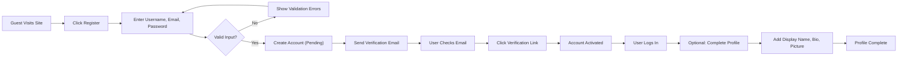
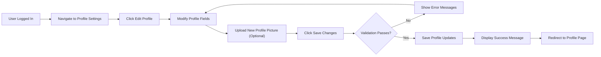
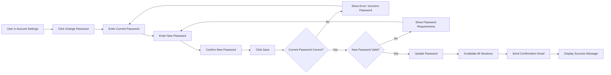
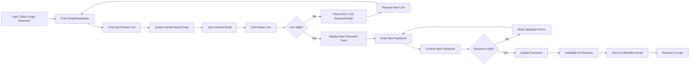
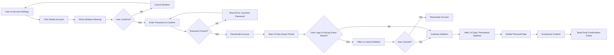
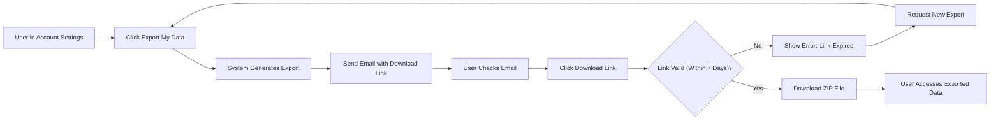

# User Profiles and Settings - Requirements Specification

## 1. Introduction and Overview

### 1.1 Document Purpose

This document defines the complete business requirements for user profile management, account settings, privacy controls, and data management in the Discussion Board system. It specifies what information users can manage about themselves, how they control their privacy, and how they interact with their account settings.

This document provides business requirements only. All technical implementation decisions (database schema, API design, storage architecture, etc.) are at the discretion of the development team.

### 1.2 Scope

This specification covers:

- User profile information structure and fields
- Profile creation, viewing, editing, and deletion capabilities
- Account settings and preferences management
- Privacy controls for profile and activity visibility
- User activity history tracking and display
- Account deletion and GDPR-compliant data export

This document focuses exclusively on business requirements and user needs. It does not specify technical implementation details, database schemas, or API structures.

### 1.3 Relationship to Overall System

User profiles serve as the foundation for user identity and personalization throughout the discussion board. Profiles connect to:

- **Authentication System**: Profiles are created during registration and linked to user credentials (see [User Actors and Authentication](./02-user-actors-and-authentication.md))
- **Article Management**: Articles are authored by users, and profile information appears in article attribution
- **Comment System**: Comments display author profile information
- **Moderation**: Moderators can view user profiles and activity for moderation purposes
- **Search and Discovery**: Users may search for content by author

### 1.4 Target Audience

This document is written for backend developers who will implement the user profile and account management features. All requirements are specified in natural language with business logic, validation rules, and user interaction flows.

### 1.5 Simplicity Principle

Following the overall system philosophy, user profiles are intentionally kept simple and minimal. The profile system includes only essential information needed for a functional discussion board focused on economic and political topics. Complex features like social networking, achievements, or gamification are explicitly excluded.

---

## 2. User Profile Information

### 2.1 Profile Information Overview

User profiles contain basic identification and contact information necessary for participation in the discussion board. Profiles support three user actor types: guests (no profile), members (full profile), and moderators (member profile with elevated permissions).

### 2.2 Required Profile Fields

THE system SHALL require the following information for all member and moderator accounts:

**Username**
- Unique identifier for the user across the system
- Used for login, content attribution, and public display
- WHEN a user registers, THE system SHALL require a username between 3 and 30 characters
- THE system SHALL enforce username uniqueness (case-insensitive)
- THE system SHALL allow usernames containing letters, numbers, underscores, and hyphens only
- THE system SHALL prohibit usernames containing offensive terms or reserved system keywords

**Email Address**
- Primary contact method and authentication identifier
- Used for account verification, password recovery, and notifications
- WHEN a user registers, THE system SHALL require a valid email address
- THE system SHALL enforce email address uniqueness (case-insensitive)
- THE system SHALL validate email format according to standard email specifications
- THE system SHALL send a verification email to confirm email ownership

**Password**
- Secure authentication credential (stored as hash, never plain text)
- WHEN a user registers, THE system SHALL require a password of at least 8 characters
- THE system SHALL require passwords to contain at least one letter and one number
- THE system SHALL provide password strength feedback during registration

**Account Creation Date**
- Timestamp of when the account was created
- THE system SHALL automatically record account creation timestamp
- Users cannot modify this field

**Account Status**
- Current state of the account (active, suspended, deleted)
- THE system SHALL set new accounts to "active" status after email verification
- THE system SHALL set accounts to "pending" status before email verification

### 2.3 Optional Profile Fields

THE system SHALL allow users to optionally provide the following information:

**Display Name**
- Alternative name for public display (if different from username)
- WHEN a user provides a display name, THE system SHALL use it instead of username for public display
- IF no display name is provided, THEN THE system SHALL use the username for display
- Display names can be 1 to 50 characters
- Display names can contain any characters except control characters

**Bio / About Me**
- Brief self-description (maximum 500 characters)
- Users can describe their interests, expertise, or perspective
- THE system SHALL limit bio text to 500 characters
- THE system SHALL allow basic text formatting (line breaks preserved)

**Location**
- Geographic location (free text, optional)
- Users can specify city, country, or region
- THE system SHALL limit location text to 100 characters
- No geocoding or location validation required

**Website URL**
- Personal or professional website link
- WHEN a user provides a website URL, THE system SHALL validate it as a properly formatted URL
- THE system SHALL support HTTP and HTTPS protocols

**Profile Picture**
- Avatar image representing the user
- WHEN a user uploads a profile picture, THE system SHALL accept JPEG, PNG, and GIF formats
- THE system SHALL limit profile picture file size to 5 MB
- THE system SHALL resize uploaded images to standard dimensions (e.g., 200x200 pixels for display)
- IF no profile picture is uploaded, THEN THE system SHALL display a default avatar

### 2.4 Automatically Tracked Profile Metadata

THE system SHALL automatically track the following metadata (not editable by users):

**Last Login Timestamp**
- WHEN a user successfully authenticates, THE system SHALL update their last login timestamp

**Article Count**
- THE system SHALL maintain a count of articles authored by the user
- WHEN a user publishes an article, THE system SHALL increment their article count
- WHEN a user's article is deleted, THE system SHALL decrement their article count

**Comment Count**
- THE system SHALL maintain a count of comments posted by the user
- WHEN a user posts a comment, THE system SHALL increment their comment count
- WHEN a user's comment is deleted, THE system SHALL decrement their comment count

**Account Role**
- Member or Moderator designation
- THE system SHALL assign "member" role to new registrations by default
- Only existing moderators or system administrators can promote users to moderator role

### 2.5 Profile Data Validation Rules

**Username Validation**
- THE system SHALL reject usernames shorter than 3 characters or longer than 30 characters
- THE system SHALL reject usernames containing spaces or special characters except underscore and hyphen
- THE system SHALL reject usernames that are already in use (case-insensitive comparison)
- THE system SHALL reject usernames matching reserved words: "admin", "moderator", "system", "anonymous", "deleted", "user"

**Email Validation**
- THE system SHALL validate email addresses against standard email format (contains @, valid domain structure)
- THE system SHALL reject email addresses already associated with an existing account
- THE system SHALL require email verification before account activation

**Text Field Validation**
- THE system SHALL remove or escape HTML/script tags from all text fields to prevent XSS attacks
- THE system SHALL preserve line breaks and basic text formatting in bio fields
- THE system SHALL truncate text exceeding maximum length limits

**Image Upload Validation**
- THE system SHALL reject profile pictures exceeding 5 MB file size
- THE system SHALL reject image files not in JPEG, PNG, or GIF format
- THE system SHALL scan uploaded images for inappropriate content (future enhancement consideration)

### 2.6 Profile Visibility Rules

**Public Profile Information (visible to all users including guests)**
- Username or display name
- Profile picture (or default avatar)
- Bio / about me
- Location (if provided)
- Website URL (if provided)
- Account creation date
- Article count
- Comment count

**Private Profile Information (visible only to the profile owner)**
- Email address
- Account status
- Last login timestamp
- Privacy settings
- Notification preferences

**Moderator-Visible Information (visible to moderators for moderation purposes)**
- All public profile information
- Email address
- Account status
- Last login timestamp
- Full activity history

---

## 3. Profile Management Capabilities

### 3.1 Profile Creation

**Registration Flow**

WHEN a guest user initiates account registration, THE system SHALL guide them through the following process:

1. **Initial Registration Form**
   - THE system SHALL present a registration form requesting username, email, and password
   - THE system SHALL validate all required fields in real-time as the user types
   - THE system SHALL display validation errors immediately for incorrect inputs
   - WHEN the user submits valid registration information, THE system SHALL create a pending account

2. **Email Verification**
   - WHEN an account is created, THE system SHALL send a verification email to the provided address
   - The verification email SHALL contain a unique verification link valid for 24 hours
   - WHEN the user clicks the verification link, THE system SHALL activate the account
   - IF the verification link expires, THEN THE system SHALL allow the user to request a new verification email

3. **Initial Profile Setup**
   - WHEN a user first logs in after verification, THE system SHALL prompt them to optionally complete their profile
   - Users can add display name, bio, location, website, and profile picture
   - Users can skip optional profile completion and add information later

**Profile Creation Business Rules**

- THE system SHALL create exactly one profile per user account
- THE system SHALL assign a unique user ID to each profile
- THE system SHALL set account creation timestamp automatically
- THE system SHALL initialize article count and comment count to zero
- THE system SHALL assign "member" role by default
- THE system SHALL set default privacy settings (profile public, activity visible to members)

### 3.2 Viewing Profiles

**Viewing Own Profile**

WHEN a member or moderator views their own profile, THE system SHALL display:
- All public profile information
- All private profile information
- Link to edit profile
- Link to account settings
- Link to view activity history
- Link to delete account

**Viewing Other Users' Profiles**

WHEN a user views another user's profile, THE system SHALL display:
- Public profile information only (based on privacy settings)
- List of recent articles by that user (if activity is public)
- Option to view all articles by that user

**Guest Access to Profiles**

WHEN a guest (unauthenticated user) views a user profile, THE system SHALL display:
- Public profile information only
- List of articles by that user (if available to guests)
- No access to activity history or private information

**Profile URL Structure**

- THE system SHALL provide a unique URL for each user profile
- Profile URLs should include the username for readability and SEO
- Example format: `/users/{username}` or `/profile/{username}`

### 3.3 Editing Profile

**Edit Profile Access**

WHEN a member or moderator accesses the edit profile function, THE system SHALL display a form pre-populated with current profile information.

**Editable Fields**

Users SHALL be able to edit the following fields:
- Display name
- Bio / about me
- Location
- Website URL
- Profile picture

Users SHALL NOT be able to edit:
- Username (permanent after registration)
- Email address (requires separate verification flow)
- Account creation date
- Article count / comment count
- Account role (only moderators can change roles)

**Email Change Process**

WHEN a user wants to change their email address, THE system SHALL require a separate verification process:

1. WHEN the user requests an email change, THE system SHALL send a verification email to the NEW email address
2. The verification email SHALL contain a unique link to confirm the email change
3. WHEN the user clicks the verification link, THE system SHALL update the email address
4. THE system SHALL send a notification to the OLD email address informing of the change
5. IF the verification link is not clicked within 24 hours, THEN THE system SHALL cancel the email change request

**Profile Edit Validation**

- THE system SHALL validate all edited fields against the same rules as profile creation
- WHEN a user saves profile changes, THE system SHALL validate all fields
- IF validation fails, THEN THE system SHALL display specific error messages for each invalid field
- IF validation succeeds, THEN THE system SHALL save changes and display a success confirmation

**Profile Picture Update**

WHEN a user uploads a new profile picture:
1. THE system SHALL validate the image file (format, size)
2. THE system SHALL resize/process the image for display
3. THE system SHALL replace the old profile picture with the new one
4. THE system SHALL delete the old profile picture file from storage
5. THE system SHALL display the new profile picture immediately

WHEN a user removes their profile picture:
1. THE system SHALL delete the current profile picture file
2. THE system SHALL display the default avatar instead

### 3.4 Profile Deletion

Profile deletion is covered comprehensively in Section 7 (Account Deletion and Data Export). In summary:

- Users can request account deletion from their profile settings
- THE system SHALL provide a clear account deletion process with confirmation
- THE system SHALL export user data before deletion (GDPR compliance)
- THE system SHALL handle content ownership transfer or anonymization

---

## 4. Account Settings

### 4.1 Account Settings Overview

Account settings allow users to manage their credentials, preferences, and system behavior. Settings are organized into logical groups for clarity.

### 4.2 Security Settings

**Password Management**

WHEN a member or moderator wants to change their password, THE system SHALL require:
1. Current password for verification
2. New password (meeting password strength requirements)
3. Confirmation of new password

WHEN a user submits a password change request:
- THE system SHALL validate the current password
- IF current password is incorrect, THEN THE system SHALL reject the change and display an error
- THE system SHALL validate the new password against strength requirements
- IF the new password is too weak, THEN THE system SHALL display specific requirements
- WHEN the new password is valid, THE system SHALL update the password and display confirmation
- THE system SHALL send an email notification to the user's email address confirming the password change

**Password Reset (Forgotten Password)**

WHEN a user forgets their password, THE system SHALL provide a password reset flow:

1. WHEN a user requests password reset, THE system SHALL ask for their email or username
2. THE system SHALL send a password reset email to the registered email address
3. The reset email SHALL contain a unique reset link valid for 2 hours
4. WHEN the user clicks the reset link, THE system SHALL present a form to set a new password
5. WHEN the user submits a new password, THE system SHALL validate password strength
6. THE system SHALL update the password and invalidate all existing login sessions
7. THE system SHALL send a confirmation email that the password was reset

**Session Management**

- WHEN a user logs in, THE system SHALL create a new session with a JWT token
- THE system SHALL set JWT access token expiration to 30 minutes
- THE system SHALL set JWT refresh token expiration to 14 days
- WHEN a user changes their password, THE system SHALL invalidate all existing sessions (logout from all devices)

Users SHALL have the option to:
- View active sessions (device/location information if available)
- Log out from all devices (invalidate all sessions except current)

**Two-Factor Authentication (Future Enhancement)**

The system may support two-factor authentication in future versions, but it is not required for the initial simple implementation.

### 4.3 Email and Notification Settings

**Email Notifications**

Users SHALL be able to control email notifications for:

1. **Comment Notifications**
   - WHEN someone comments on user's article, THE system SHALL send email (if enabled)
   - WHEN someone replies to user's comment, THE system SHALL send email (if enabled)
   - Default: Enabled

2. **System Notifications**
   - Password change confirmations
   - Email address change confirmations
   - Account security alerts
   - These notifications SHALL NOT be disabled (mandatory for security)

3. **Digest Emails**
   - Weekly or daily summary of new content in followed categories
   - Default: Disabled (future enhancement)

**Notification Preferences**

THE system SHALL provide the following notification settings:
- Enable/disable comment notifications on own articles
- Enable/disable reply notifications on own comments
- Email notification frequency (immediate, daily digest, weekly digest)

WHEN a user changes notification settings, THE system SHALL save preferences immediately and display confirmation.

### 4.4 Display and Interface Preferences

**Language Settings**

- THE system SHALL support English as the primary language
- Future versions may support additional languages (Korean, Spanish, etc.)
- WHEN language options are available, users can select their preferred language
- THE system SHALL display interface text in the selected language

**Content Display Preferences**

Users SHALL be able to configure:

1. **Articles Per Page**
   - Default: 20 articles per page
   - Options: 10, 20, 50, 100 articles per page
   - THE system SHALL remember the user's preference for article listing

2. **Comment Sorting**
   - Default: Newest first
   - Options: Newest first, Oldest first, Most active
   - THE system SHALL apply the user's preferred comment sorting

3. **Timezone**
   - THE system SHALL display all timestamps in the user's selected timezone
   - Default: System timezone (UTC or server timezone)
   - Users can select their local timezone from a standard timezone list

**Theme Preferences (Future Enhancement)**

The system may support light/dark theme toggle in future versions, but it is not required for initial implementation.

### 4.5 Privacy Settings

Privacy settings are covered comprehensively in Section 5 (Privacy Controls).

---

## 5. Privacy Controls

### 5.1 Privacy Controls Overview

Privacy controls allow users to manage the visibility of their profile information and activity. The discussion board balances transparency (necessary for credible discussions) with user privacy preferences.

### 5.2 Profile Visibility Settings

**Profile Visibility Levels**

Users SHALL be able to set their profile visibility to one of the following levels:

1. **Public** (Default)
   - Profile visible to all users including guests
   - Profile appears in search results
   - Articles and comments show full profile information
   - Anyone can view the user's profile page

2. **Members Only**
   - Profile visible only to authenticated members and moderators
   - Profile does NOT appear in public search results
   - Guests see only username and generic avatar on articles/comments
   - Only logged-in members can view full profile

3. **Private**
   - Profile visible only to moderators
   - Username and generic avatar shown on articles/comments
   - No profile page accessible to other users
   - Only moderators can view full profile for moderation purposes

**Profile Visibility Business Rules**

- THE system SHALL set new accounts to "Public" visibility by default
- WHEN a user changes profile visibility, THE system SHALL apply changes immediately
- THE system SHALL respect profile visibility in all areas: article listings, comment displays, search results, user directories
- Moderators SHALL always have access to all profiles regardless of visibility settings (for moderation purposes)

### 5.3 Activity Visibility Settings

**Activity Visibility Levels**

Users SHALL be able to control who can see their activity history:

1. **Public Activity** (Default)
   - Anyone can view the user's articles and comments
   - User's profile page shows list of articles and comments
   - Articles and comments appear in public searches and listings

2. **Members Only Activity**
   - Only authenticated members can view the user's activity history
   - Articles and comments still appear in public listings (content is public)
   - But the profile's activity tab is restricted to members

3. **Hidden Activity**
   - User's profile page does not display activity history
   - Articles and comments still exist but are not linked from profile
   - Users can still find content through search and category browsing

**Activity Visibility Business Rules**

- THE system SHALL set new accounts to "Public Activity" by default
- Activity visibility controls affect only the profile activity display, not the content itself
- Articles and comments remain accessible through normal browsing and search regardless of activity visibility
- THE system SHALL respect activity visibility when displaying user profiles

### 5.4 Email Privacy

**Email Address Visibility**

- THE system SHALL NEVER display email addresses publicly
- Email addresses are visible only to:
  - The account owner (in their own settings)
  - Moderators (for moderation purposes)
- THE system SHALL NOT provide email addresses to other members under any circumstances

**Email Communication Preferences**

- Users can control who can contact them via the platform (future enhancement: internal messaging system)
- THE system SHALL NOT share email addresses with third parties
- THE system SHALL NOT use email addresses for marketing without explicit consent

### 5.5 Data Sharing and Third-Party Access

**Data Sharing Principles**

- THE system SHALL NOT share user data with third parties except as required by law
- THE system SHALL NOT sell user data to advertisers or data brokers
- THE system SHALL clearly disclose any data collection in privacy policy

**Analytics and Tracking**

- THE system MAY collect anonymous usage statistics for system improvement
- THE system SHALL provide users with option to opt-out of analytics tracking
- THE system SHALL NOT track user activity across other websites

### 5.6 Privacy Controls for Moderators

**Moderator Access to Private Information**

Moderators have elevated access to user information for legitimate moderation purposes:

- Moderators can view all user profiles regardless of privacy settings
- Moderators can view email addresses for investigation of policy violations
- Moderators can view full activity history including deleted content

**Moderator Privacy Responsibilities**

- THE system SHALL log all moderator access to private user information
- THE system SHALL NOT allow moderators to export or share private user data
- Moderators are bound by privacy policies and code of conduct

### 5.7 GDPR and Privacy Compliance

**User Rights**

THE system SHALL support the following user rights for privacy compliance:

1. **Right to Access**
   - Users can view all data stored about them
   - Users can export their data (see Section 7.2)

2. **Right to Rectification**
   - Users can edit their profile information
   - Users can correct inaccurate data

3. **Right to Erasure**
   - Users can delete their accounts
   - THE system SHALL delete personal data upon request (see Section 7.1)

4. **Right to Data Portability**
   - Users can export their data in machine-readable format (JSON)

5. **Right to Object**
   - Users can opt-out of analytics and non-essential data processing

**Cookie and Tracking Disclosure**

- THE system SHALL display cookie consent banner for EU users
- THE system SHALL allow users to manage cookie preferences
- THE system SHALL only use essential cookies without consent

---

## 6. User Activity History

### 6.1 Activity History Overview

User activity history provides a record of a user's contributions to the discussion board. Activity tracking helps users find their own content, allows moderators to review user behavior, and provides transparency for the community.

### 6.2 Activity Types Tracked

THE system SHALL track the following user activities:

**Content Creation Activities**
1. **Articles Published**
   - Article title
   - Publication timestamp
   - Article category/tags
   - Article status (published, edited, deleted)
   - Link to article

2. **Comments Posted**
   - Comment text (preview or full text)
   - Comment timestamp
   - Article the comment was posted on
   - Comment status (active, edited, deleted)
   - Link to comment in context

**Account Activities**
1. **Profile Updates**
   - Timestamp of profile changes
   - Which fields were updated (not the values for privacy)

2. **Login History**
   - Login timestamps
   - Last 10 login events
   - Device/browser information (if available)

**Moderation Activities (for moderators only)**
1. **Moderation Actions Taken**
   - Content reviewed
   - Actions performed (edit, delete, warn user)
   - Timestamps of actions
   - Justification for actions

### 6.3 Viewing Own Activity

**Activity History Page**

WHEN a member or moderator accesses their activity history, THE system SHALL display:

1. **Activity Overview**
   - Total articles published
   - Total comments posted
   - Account age (days since registration)
   - Last login date

2. **Recent Activity Timeline**
   - Chronological list of recent activities (last 50 items)
   - Activity type (article, comment, profile update)
   - Timestamp
   - Link to related content

3. **Filtered Activity Views**
   - Filter by activity type (articles only, comments only)
   - Filter by date range (last week, last month, all time)
   - Search within own activity

**Activity Display Format**

WHEN displaying activity items, THE system SHALL show:
- Activity icon/type indicator
- Brief description of activity
- Timestamp (relative time, e.g., "2 hours ago")
- Link to view full content
- Status indicator (active, edited, deleted)

Example activity item:
```
[Article Icon] Published article: "Economic Impact of Trade Policies"
2 hours ago | Economics category | 15 comments
```

### 6.4 Activity Visibility to Others

**Public Activity Display**

WHEN another user views a member's profile, THE system SHALL display:
- List of recent articles (if activity visibility allows)
- List of recent comments (if activity visibility allows)
- Pagination for browsing all activity
- Respect privacy settings (see Section 5.3)

**Activity Visibility Rules**

- IF user's activity visibility is "Public", THEN anyone (including guests) can view activity
- IF user's activity visibility is "Members Only", THEN only authenticated members can view activity
- IF user's activity visibility is "Hidden", THEN no activity list is shown (but content still accessible via search)
- Moderators can always view full activity regardless of privacy settings

### 6.5 Activity Data Retention

**Retention Policies**

- THE system SHALL retain activity history for the lifetime of the account
- WHEN a user deletes their account, THE system SHALL delete activity history (see Section 7)
- THE system SHALL retain deleted content in activity history but mark as "deleted"

**Activity History Limits**

- THE system SHALL store unlimited activity history (no artificial limits)
- THE system MAY archive old activity (older than 2 years) to improve performance
- Archived activity remains accessible but may load more slowly

### 6.6 Activity Export

Users can export their complete activity history as part of the data export feature (see Section 7.2).

WHEN a user exports their data, THE activity export SHALL include:
- All articles with full text and metadata
- All comments with full text and metadata
- Profile update history (timestamps and fields changed)
- Login history

---

## 7. Account Deletion and Data Export

### 7.1 Account Deletion Process

**User-Initiated Account Deletion**

WHEN a member or moderator wants to delete their account, THE system SHALL provide a clear deletion process:

1. **Deletion Request Initiation**
   - WHEN a user accesses account settings, THE system SHALL provide a "Delete Account" option
   - The delete account option should be clearly visible but separated from other settings to prevent accidental clicks

2. **Deletion Confirmation**
   - WHEN a user clicks "Delete Account", THE system SHALL display a confirmation screen
   - The confirmation screen SHALL explain the consequences of account deletion:
     - Account cannot be recovered after deletion
     - Personal data will be permanently deleted
     - Published articles and comments will be anonymized or deleted (based on content policy)
     - Email address will be removed from the system
   
3. **Password Verification**
   - WHEN a user confirms deletion, THE system SHALL require password re-entry for security
   - IF password is incorrect, THEN THE system SHALL reject the deletion request

4. **Grace Period (Optional)**
   - THE system MAY provide a 14-day grace period before permanent deletion
   - During the grace period, the account is deactivated but not deleted
   - WHEN a user logs in during the grace period, THE system SHALL offer to cancel the deletion
   - IF the user does not cancel within 14 days, THEN THE system SHALL proceed with permanent deletion

5. **Final Deletion**
   - WHEN the grace period expires (or immediately if no grace period), THE system SHALL permanently delete the account
   - THE system SHALL send a final confirmation email to the user's email address

**Account Deletion Business Rules**

- THE system SHALL delete the following user data upon account deletion:
  - Email address
  - Password hash
  - Profile information (display name, bio, location, website)
  - Profile picture
  - Privacy settings
  - Notification preferences
  - Login history
  - Activity history

- THE system SHALL handle published content as follows:
  - **Articles**: Anonymize (change author to "Deleted User") OR delete entirely (based on community preference)
  - **Comments**: Anonymize (change author to "Deleted User") OR delete entirely
  - **File Attachments**: Delete if article is deleted, retain if article is anonymized

- THE system SHALL NOT delete:
  - Moderation logs that reference the deleted account (for audit purposes, but personal data is removed)
  - Aggregated anonymous statistics

**Moderator Account Deletion**

- WHEN a moderator requests account deletion, THE system SHALL notify other moderators
- IF the deleting moderator is the only moderator, THEN THE system SHALL prevent deletion until another moderator is appointed
- THE system SHALL transfer moderator responsibilities before account deletion

### 7.2 Data Export (GDPR Compliance)

**User Data Export Request**

WHEN a user requests to export their data, THE system SHALL provide a comprehensive data export:

1. **Export Request Initiation**
   - WHEN a user accesses account settings, THE system SHALL provide a "Export My Data" option
   - WHEN the user clicks "Export My Data", THE system SHALL begin generating the export

2. **Data Export Contents**
   - THE system SHALL export the following data in machine-readable JSON format:
     - **Account Information**: username, email, display name, account creation date, account status
     - **Profile Data**: bio, location, website, profile picture URL
     - **Articles**: All articles with full text, titles, timestamps, categories, tags, attachment metadata
     - **Comments**: All comments with full text, timestamps, associated article information
     - **Activity History**: Timeline of all user activities
     - **Settings**: All user preferences, privacy settings, notification settings
     - **Login History**: Last 100 login events with timestamps

3. **Export Delivery**
   - WHEN the export is complete, THE system SHALL send a download link to the user's email address
   - The download link SHALL be valid for 7 days
   - THE system SHALL provide the export as a downloadable ZIP file containing JSON files
   - THE export file SHALL be encrypted or password-protected for security

4. **Export Format**
   - THE system SHALL use JSON format for all exported data
   - THE system SHALL organize data into logical files (profile.json, articles.json, comments.json, etc.)
   - THE system SHALL include a README file explaining the export structure

**Export Business Rules**

- THE system SHALL generate exports within 24 hours of request
- Users can request data export at any time, unlimited times
- THE system SHALL delete export files after 7 days or after download
- THE system SHALL NOT include other users' private data in the export

**Sample Export Structure**

```
user_data_export.zip
├── README.txt (explanation of export contents)
├── profile.json (account and profile information)
├── articles.json (all published articles)
├── comments.json (all posted comments)
├── activity_history.json (activity timeline)
├── settings.json (user preferences)
└── attachments/ (folder containing uploaded files)
```

### 7.3 Data Retention After Deletion

**Personal Data Deletion**

WHEN an account is deleted, THE system SHALL permanently delete all personally identifiable information (PII):
- Email address is removed from all databases
- Profile information is deleted
- Login credentials are deleted
- User preferences are deleted

**Content Handling After Deletion**

The system has two options for handling content after account deletion:

**Option A: Content Anonymization** (Recommended)
- Articles remain on the site but author is changed to "Deleted User"
- Comments remain on the site but author is changed to "Deleted User"
- This preserves discussion continuity and context
- Community can still reference the content

**Option B: Content Deletion**
- All articles by the deleted user are permanently deleted
- All comments by the deleted user are permanently deleted
- This may disrupt ongoing discussions
- May be required for legal compliance in some jurisdictions

The system implementers should choose the approach based on community norms and legal requirements.

**Moderation Log Retention**

- THE system SHALL retain moderation logs for audit purposes
- BUT personal identifiable information is removed from logs after account deletion
- Logs reference account by ID or "Deleted User ID: [ID]" for traceability
- Logs are not accessible to public, only to moderators and system administrators

### 7.4 Account Deactivation (Alternative to Deletion)

As an alternative to permanent deletion, the system MAY offer account deactivation:

**Deactivation vs. Deletion**

- **Deactivation**: Account is hidden but data is retained, can be reactivated later
- **Deletion**: Account and personal data are permanently deleted, cannot be recovered

**Deactivation Process**

WHEN a user deactivates their account:
1. THE system SHALL hide the account from public view
2. THE system SHALL prevent login
3. THE system SHALL anonymize the user's articles and comments (author shown as "Inactive User")
4. THE system SHALL retain all data for potential reactivation
5. THE user can reactivate by logging in and confirming reactivation

**Deactivation Business Rules**

- Deactivated accounts can be reactivated within 90 days
- After 90 days of deactivation, the account may be automatically deleted
- WHEN an account is reactivated, THE system SHALL restore the user's profile and content attribution

---

## 8. Functional Requirements Summary

This section consolidates all functional requirements from previous sections into a comprehensive EARS-formatted list for easy reference by backend developers.

### 8.1 Profile Creation Requirements

- WHEN a guest user completes registration with valid information, THE system SHALL create a new user profile with default settings.
- WHEN an account is created, THE system SHALL send a verification email to the provided email address.
- WHEN a user clicks the email verification link, THE system SHALL activate the account and allow login.
- IF the verification link expires (after 24 hours), THEN THE system SHALL allow the user to request a new verification email.
- THE system SHALL enforce username uniqueness using case-insensitive comparison.
- THE system SHALL reject usernames shorter than 3 characters or longer than 30 characters.
- THE system SHALL reject usernames containing characters other than letters, numbers, underscores, and hyphens.
- THE system SHALL reject email addresses that are already associated with an existing account.
- THE system SHALL require passwords to be at least 8 characters with at least one letter and one number.
- THE system SHALL automatically set account creation timestamp when a profile is created.
- THE system SHALL initialize article count and comment count to zero for new accounts.
- THE system SHALL assign "member" role to all new registrations by default.

### 8.2 Profile Viewing Requirements

- WHEN a user views their own profile, THE system SHALL display all public and private profile information.
- WHEN a user views another user's profile, THE system SHALL display only public profile information based on privacy settings.
- WHEN a guest views a user profile, THE system SHALL display only publicly available information.
- THE system SHALL provide a unique URL for each user profile including the username.
- WHEN a user's profile visibility is set to "Members Only", THE system SHALL hide the profile from guests.
- WHEN a user's profile visibility is set to "Private", THE system SHALL hide the profile from all users except moderators.
- THE system SHALL always allow moderators to view all profiles regardless of privacy settings.

### 8.3 Profile Editing Requirements

- WHEN a user accesses the edit profile function, THE system SHALL display a form pre-populated with current profile information.
- THE system SHALL allow users to edit display name, bio, location, website URL, and profile picture.
- THE system SHALL NOT allow users to directly edit username, email, account creation date, or account role.
- WHEN a user saves profile changes, THE system SHALL validate all fields against defined validation rules.
- IF validation fails, THEN THE system SHALL display specific error messages for each invalid field.
- WHEN a user uploads a new profile picture, THE system SHALL validate file format (JPEG, PNG, GIF) and size (max 5 MB).
- WHEN a valid profile picture is uploaded, THE system SHALL resize the image to standard dimensions and replace the old picture.
- WHEN a user removes their profile picture, THE system SHALL delete the current picture and display a default avatar.
- THE system SHALL limit bio text to 500 characters.
- THE system SHALL limit location text to 100 characters.
- WHEN a user provides a website URL, THE system SHALL validate it as a properly formatted HTTP or HTTPS URL.

### 8.4 Email Change Requirements

- WHEN a user requests an email change, THE system SHALL send a verification email to the new email address.
- The verification email SHALL contain a unique link to confirm the email change, valid for 24 hours.
- WHEN the user clicks the verification link, THE system SHALL update the email address.
- WHEN an email address is successfully changed, THE system SHALL send a notification to the old email address.
- IF the verification link is not clicked within 24 hours, THEN THE system SHALL cancel the email change request.

### 8.5 Password Management Requirements

- WHEN a user changes their password, THE system SHALL require current password, new password, and new password confirmation.
- THE system SHALL validate the current password before allowing a password change.
- IF the current password is incorrect, THEN THE system SHALL reject the change and display an error message.
- THE system SHALL validate new passwords against strength requirements (minimum 8 characters, at least one letter and one number).
- WHEN a password is successfully changed, THE system SHALL send an email notification to the user.
- WHEN a user forgets their password, THE system SHALL provide a password reset flow via email.
- THE system SHALL send a password reset email containing a unique reset link valid for 2 hours.
- WHEN a user completes password reset, THE system SHALL invalidate all existing login sessions.

### 8.6 Session Management Requirements

- WHEN a user logs in, THE system SHALL create a new session with a JWT token.
- THE system SHALL set JWT access token expiration to 30 minutes.
- THE system SHALL set JWT refresh token expiration to 14 days.
- WHEN a user changes their password, THE system SHALL invalidate all existing sessions except the current one.
- THE system SHALL provide users with the option to log out from all devices.

### 8.7 Notification Settings Requirements

- THE system SHALL allow users to enable or disable comment notifications on their own articles.
- THE system SHALL allow users to enable or disable reply notifications on their own comments.
- THE system SHALL NOT allow users to disable mandatory security notifications (password changes, email changes).
- WHEN a user changes notification settings, THE system SHALL save preferences immediately and display confirmation.
- THE system SHALL send email notifications based on user preferences.

### 8.8 Display Preferences Requirements

- THE system SHALL allow users to select articles per page (10, 20, 50, or 100).
- THE system SHALL remember and apply the user's articles per page preference.
- THE system SHALL allow users to select comment sorting preference (newest first, oldest first, most active).
- THE system SHALL apply the user's preferred comment sorting.
- THE system SHALL allow users to select their timezone from a standard timezone list.
- THE system SHALL display all timestamps in the user's selected timezone.

### 8.9 Privacy Control Requirements

- THE system SHALL allow users to set profile visibility to Public, Members Only, or Private.
- THE system SHALL set new accounts to Public visibility by default.
- THE system SHALL apply profile visibility changes immediately.
- THE system SHALL allow users to control activity visibility (Public, Members Only, Hidden).
- THE system SHALL set new accounts to Public Activity by default.
- THE system SHALL NEVER display email addresses publicly.
- THE system SHALL make email addresses visible only to the account owner and moderators.
- THE system SHALL NOT share user data with third parties except as required by law.

### 8.10 Activity History Requirements

- THE system SHALL track all user activities including articles published, comments posted, and profile updates.
- WHEN a user accesses their activity history, THE system SHALL display an activity overview and recent activity timeline.
- THE system SHALL allow users to filter activity by type and date range.
- THE system SHALL respect activity visibility settings when displaying activity to other users.
- THE system SHALL allow moderators to view full activity history regardless of privacy settings.
- THE system SHALL retain activity history for the lifetime of the account.
- WHEN a user successfully authenticates, THE system SHALL update their last login timestamp.
- WHEN a user publishes an article, THE system SHALL increment their article count.
- WHEN a user posts a comment, THE system SHALL increment their comment count.

### 8.11 Account Deletion Requirements

- WHEN a user requests account deletion, THE system SHALL display a confirmation screen explaining the consequences.
- THE system SHALL require password re-entry to confirm account deletion.
- THE system SHALL provide a 14-day grace period before permanent deletion (optional).
- WHEN the grace period expires, THE system SHALL permanently delete all personal data.
- THE system SHALL send a final confirmation email when an account is deleted.
- THE system SHALL delete email address, password hash, profile information, privacy settings, and activity history upon deletion.
- THE system SHALL anonymize or delete published articles and comments based on content policy.
- THE system SHALL delete uploaded file attachments when associated content is deleted.
- IF a deleting moderator is the only moderator, THEN THE system SHALL prevent deletion until another moderator is appointed.

### 8.12 Data Export Requirements

- WHEN a user requests data export, THE system SHALL generate a comprehensive export in JSON format.
- THE system SHALL include account information, profile data, articles, comments, activity history, and settings in the export.
- THE system SHALL send a download link to the user's email address when the export is complete.
- The download link SHALL be valid for 7 days.
- THE system SHALL provide the export as a downloadable ZIP file.
- THE system SHALL generate exports within 24 hours of request.
- THE system SHALL delete export files after 7 days or after download.

### 8.13 Data Validation Requirements

- THE system SHALL remove or escape HTML/script tags from all text fields to prevent XSS attacks.
- THE system SHALL preserve line breaks and basic text formatting in bio fields.
- THE system SHALL truncate text exceeding maximum length limits.
- THE system SHALL reject profile pictures exceeding 5 MB file size.
- THE system SHALL reject image files not in JPEG, PNG, or GIF format.
- THE system SHALL validate email addresses against standard email format.

### 8.14 Moderator-Specific Requirements

- THE system SHALL allow moderators to view all user profiles regardless of privacy settings.
- THE system SHALL allow moderators to view email addresses for investigation of policy violations.
- THE system SHALL log all moderator access to private user information.
- THE system SHALL NOT allow moderators to export or share private user data.

---

## 9. Error Handling and Edge Cases

### 9.1 Registration and Profile Creation Errors

**Username Validation Errors**

- WHEN a user submits a username that is too short (< 3 characters), THE system SHALL display: "Username must be at least 3 characters long"
- WHEN a user submits a username that is too long (> 30 characters), THE system SHALL display: "Username cannot exceed 30 characters"
- WHEN a user submits a username with invalid characters, THE system SHALL display: "Username can only contain letters, numbers, underscores, and hyphens"
- WHEN a user submits a username that is already taken, THE system SHALL display: "This username is already in use. Please choose another."
- WHEN a user submits a reserved username, THE system SHALL display: "This username is reserved and cannot be used"

**Email Validation Errors**

- WHEN a user submits an invalid email format, THE system SHALL display: "Please enter a valid email address"
- WHEN a user submits an email that is already registered, THE system SHALL display: "An account with this email already exists. Please log in or use a different email."

**Password Validation Errors**

- WHEN a user submits a password shorter than 8 characters, THE system SHALL display: "Password must be at least 8 characters long"
- WHEN a user submits a password without a letter, THE system SHALL display: "Password must contain at least one letter"
- WHEN a user submits a password without a number, THE system SHALL display: "Password must contain at least one number"
- WHEN password and confirmation do not match, THE system SHALL display: "Passwords do not match"

**Email Verification Errors**

- WHEN a user clicks an expired verification link, THE system SHALL display: "This verification link has expired. Please request a new verification email."
- WHEN a user clicks an invalid verification link, THE system SHALL display: "This verification link is invalid. Please check your email or request a new link."
- WHEN a user tries to log in with an unverified account, THE system SHALL display: "Please verify your email address before logging in. Check your inbox for the verification email."

### 9.2 Profile Editing Errors

**Image Upload Errors**

- WHEN a user uploads a file exceeding 5 MB, THE system SHALL display: "Profile picture must be smaller than 5 MB. Please choose a smaller image."
- WHEN a user uploads a non-image file, THE system SHALL display: "Profile picture must be a JPEG, PNG, or GIF image"
- WHEN an image upload fails due to server error, THE system SHALL display: "Image upload failed. Please try again."

**Field Validation Errors**

- WHEN a user enters a bio exceeding 500 characters, THE system SHALL display: "Bio cannot exceed 500 characters. Current: [X] characters"
- WHEN a user enters a location exceeding 100 characters, THE system SHALL display: "Location cannot exceed 100 characters"
- WHEN a user enters an invalid website URL, THE system SHALL display: "Please enter a valid URL starting with http:// or https://"

### 9.3 Authentication and Security Errors

**Password Change Errors**

- WHEN a user enters an incorrect current password, THE system SHALL display: "Current password is incorrect"
- WHEN a new password fails validation, THE system SHALL display specific password strength requirements
- WHEN password change fails due to server error, THE system SHALL display: "Password change failed. Please try again later."

**Password Reset Errors**

- WHEN a user enters a non-existent email/username for password reset, THE system SHALL display: "If an account with this email exists, a password reset link has been sent" (do not reveal account existence for security)
- WHEN a password reset link expires, THE system SHALL display: "This reset link has expired. Please request a new password reset."
- WHEN a password reset link is invalid, THE system SHALL display: "This reset link is invalid. Please request a new password reset."

**Session Errors**

- WHEN a user's session expires, THE system SHALL redirect to login with message: "Your session has expired. Please log in again."
- WHEN a user tries to access profile settings while logged out, THE system SHALL redirect to login with message: "Please log in to access account settings"

### 9.4 Privacy and Permissions Errors

**Access Denied Errors**

- WHEN a guest tries to view a "Members Only" profile, THE system SHALL display: "This profile is only visible to members. Please log in."
- WHEN a member tries to view a "Private" profile, THE system SHALL display: "This profile is private"
- WHEN a user tries to edit another user's profile, THE system SHALL display: "You do not have permission to edit this profile"

### 9.5 Account Deletion Errors

**Deletion Prevention**

- WHEN the only moderator tries to delete their account, THE system SHALL display: "You are the only moderator. Please appoint another moderator before deleting your account."
- WHEN a user enters incorrect password during deletion confirmation, THE system SHALL display: "Incorrect password. Account deletion cancelled."

**Deletion Cancellation**

- WHEN a user logs in during the deletion grace period, THE system SHALL display: "Your account is scheduled for deletion on [DATE]. Do you want to cancel deletion?" with options to "Cancel Deletion" or "Proceed with Deletion"

### 9.6 Data Export Errors

**Export Generation Errors**

- WHEN data export generation fails, THE system SHALL send an email: "We encountered an error generating your data export. Please try again or contact support."
- WHEN a user clicks an expired export download link, THE system SHALL display: "This download link has expired. Please request a new data export."

### 9.7 General Error Handling

**Network and Server Errors**

- WHEN a profile save operation fails due to network error, THE system SHALL display: "Unable to save changes due to network error. Please check your connection and try again."
- WHEN the server is unavailable, THE system SHALL display: "Service temporarily unavailable. Please try again in a few minutes."

**Validation Summary**

- WHEN multiple validation errors occur, THE system SHALL display all errors together in a clear list format
- THE system SHALL highlight invalid fields with visual indicators (red border, error icon)

---

## 10. User Experience Flows

### 10.1 New User Registration and Profile Setup Flow



### 10.2 Profile Editing Flow



### 10.3 Password Change Flow



### 10.4 Password Reset Flow (Forgotten Password)



### 10.5 Account Deletion Flow



### 10.6 Data Export Flow



### 10.7 Privacy Settings Update Flow

```mermaid
graph LR
    A["User in Account Settings"] --> B["Navigate to Privacy Settings"]
    B --> C["Change Profile Visibility"]
    C --> D["Change Activity Visibility"]
    D --> E["Adjust Notification Preferences"]
    E --> F["Click Save Settings"]
    F --> G["System Saves Preferences"]
    G --> H["Display Success Confirmation"]
    H --> I["Privacy Settings Applied Immediately"]
```



---

## 11. Performance and Scalability Considerations

### 11.1 Profile Page Load Performance

**Performance Expectations**

- WHEN a user navigates to a profile page, THE system SHALL load and display the page within 2 seconds under normal conditions
- WHEN a user views their own profile with full activity history, THE system SHALL display initial content within 2 seconds
- THE system SHALL paginate activity history to maintain performance (20 items per page)

**Performance Requirements**

- Profile basic information (name, bio, picture) should load instantly (under 500ms)
- Activity history should load progressively (initial view fast, load more on scroll)
- Profile pictures should be cached and served via CDN for fast delivery

### 11.2 Data Export Performance

**Export Generation**

- THE system SHALL generate data exports asynchronously (background job)
- THE system SHALL complete export generation within 24 hours for standard accounts
- THE system SHALL notify users via email when export is ready (don't make users wait)

### 11.3 Profile Search and Discovery Performance

**Search Response Time**

- WHEN a user searches for profiles by username, THE system SHALL return results within 1 second
- THE system SHALL support autocomplete for username search with instant suggestions (under 300ms)

### 11.4 Concurrent User Support

**Session Management**

- THE system SHALL support at least 1,000 concurrent logged-in users
- THE system SHALL handle at least 100 profile edits per minute without performance degradation

### 11.5 Image Processing Performance

**Profile Picture Upload**

- WHEN a user uploads a profile picture, THE system SHALL process and display the image within 5 seconds
- THE system SHALL resize images asynchronously if processing takes longer than 5 seconds
- THE system SHALL show a progress indicator during image upload and processing

---

## 12. Security Considerations

### 12.1 Password Security

**Password Storage**

- THE system SHALL NEVER store passwords in plain text
- THE system SHALL hash all passwords using a strong hashing algorithm (e.g., bcrypt, Argon2)
- THE system SHALL use unique salts for each password

**Password Strength**

- THE system SHALL enforce minimum password strength requirements
- THE system SHALL provide real-time password strength feedback during registration and password changes
- THE system SHALL prevent use of commonly compromised passwords (check against breach databases)

### 12.2 Session Security

**Token Security**

- THE system SHALL use secure JWT tokens with appropriate expiration times
- THE system SHALL store refresh tokens securely (httpOnly cookies or secure storage)
- THE system SHALL invalidate tokens when suspicious activity is detected

**Session Hijacking Prevention**

- THE system SHALL bind sessions to IP addresses (with reasonable tolerance for mobile users)
- THE system SHALL detect and prevent concurrent sessions from vastly different locations
- THE system SHALL allow users to view active sessions and revoke suspicious sessions

### 12.3 Email Security

**Email Verification**

- THE system SHALL send verification emails only to the provided email address
- THE system SHALL use cryptographically secure tokens for email verification links
- THE system SHALL expire verification links after reasonable time (24 hours)

**Email Privacy**

- THE system SHALL NEVER expose email addresses in public APIs
- THE system SHALL NEVER send emails to unverified addresses except for verification

### 12.4 Input Validation and XSS Prevention

**User Input Sanitization**

- THE system SHALL sanitize all user-provided text fields to prevent XSS attacks
- THE system SHALL remove or escape HTML tags, scripts, and dangerous content
- THE system SHALL preserve safe text formatting (line breaks, basic text)

**File Upload Security**

- THE system SHALL validate file types by content, not just extension
- THE system SHALL scan uploaded images for malicious content
- THE system SHALL limit file sizes to prevent denial-of-service attacks

### 12.5 Account Takeover Prevention

**Password Reset Security**

- THE system SHALL NOT reveal whether an email/username exists during password reset
- THE system SHALL rate-limit password reset requests to prevent abuse
- THE system SHALL invalidate all sessions when password is reset

**Account Access Monitoring**

- THE system SHALL log all login attempts (successful and failed)
- THE system SHALL detect and block brute-force login attempts
- THE system SHALL notify users of suspicious login activity

---

## 13. Integration with Other System Components

### 13.1 Integration with Article Management

**Article Attribution**

- Articles are attributed to user profiles
- WHEN a user publishes an article, THE system SHALL link the article to the user's profile
- WHEN a user's profile is viewed, THE system SHALL display their published articles
- WHEN a user deletes their account, THE system SHALL anonymize article authorship

**Profile Links in Articles**

- Article pages display author profile information
- WHEN an article is displayed, THE system SHALL show author's username, display name, and profile picture
- Clicking author information should navigate to the author's profile page

### 13.2 Integration with Comment System

**Comment Attribution**

- Comments are attributed to user profiles
- WHEN a user posts a comment, THE system SHALL link the comment to the user's profile
- WHEN a user's profile is viewed, THE system SHALL display their recent comments
- WHEN a user deletes their account, THE system SHALL anonymize comment authorship

**Profile Links in Comments**

- Comment displays include author profile information
- Clicking a commenter's name should navigate to their profile page

### 13.3 Integration with Moderation System

**Moderator Access to Profiles**

- Moderators can view all user profiles regardless of privacy settings (see [Moderation and Content Management](./06-moderation-and-content-management.md))
- Moderators can view email addresses for investigation
- Moderators can view full activity history including deleted content

**Moderation Actions on Profiles**

- Moderators can suspend user accounts
- Moderators can ban users (prevent login)
- Moderators can delete user accounts in extreme cases
- All moderation actions are logged for audit

### 13.4 Integration with Search System

**Profile Search**

- Users can search for other users by username or display name (see [Search and Discovery](./05-search-and-discovery.md))
- Search results respect privacy settings
- WHEN a user's profile visibility is "Private", THE system SHALL exclude them from public search results

**Content Search by Author**

- Users can filter article and comment search by author
- Clicking author filter navigates to author's profile

### 13.5 Integration with Authentication System

**Authentication Foundation**

- User profiles are created during registration (see [User Actors and Authentication](./02-user-actors-and-authentication.md))
- Profile data is linked to authentication credentials
- JWT tokens include user ID for profile access
- Session management is tied to user accounts

**Role-Based Access Control**

- User actor roles (guest, member, moderator) determine profile capabilities
- Moderators have elevated permissions for profile viewing and management
- Guest users cannot create or edit profiles

---

## 14. Future Enhancements (Out of Scope for Initial Release)

The following features are potential future enhancements but are NOT required for the initial simple discussion board implementation:

### 14.1 Social Features
- Follow/unfollow other users
- Friend requests and friend lists
- Private messaging between users
- User reputation or karma system

### 14.2 Advanced Profile Features
- Custom profile themes or layouts
- Profile badges or achievements
- Profile banners or cover images
- Multiple profile pictures / photo galleries

### 14.3 Advanced Privacy Features
- Blocking users
- Muting users
- Fine-grained privacy controls (who can see specific profile fields)
- Anonymous browsing mode

### 14.4 Advanced Settings
- Two-factor authentication (2FA)
- Dark mode / light mode theme toggle
- Advanced notification settings (push notifications, SMS)
- Language selection (multi-language support)

### 14.5 Advanced Activity Tracking
- Detailed analytics dashboard (views, engagement metrics)
- Activity heatmaps
- Content performance insights

### 14.6 Integration Features
- Social media account linking (login with Google, Facebook, etc.)
- Import/export to other platforms
- OAuth provider (allow other apps to authenticate via this system)

---

## 15. Success Criteria

The user profile and settings system will be considered successful when:

### 15.1 Functional Success Criteria

1. **Profile Creation**
   - Users can successfully register and create profiles with required information
   - Email verification works reliably
   - All validation rules prevent invalid data

2. **Profile Management**
   - Users can view, edit, and update their profiles
   - Profile pictures upload and display correctly
   - Email changes are verified and processed securely

3. **Account Settings**
   - Users can change passwords securely
   - Password reset flow works reliably
   - Notification preferences are respected

4. **Privacy Controls**
   - Profile and activity visibility settings work as specified
   - Email addresses are never exposed publicly
   - Privacy settings are applied consistently across the system

5. **Activity History**
   - Users can view their complete activity history
   - Activity tracking is accurate and up-to-date
   - Activity visibility respects privacy settings

6. **Account Deletion and Data Export**
   - Users can delete their accounts successfully
   - Data exports include all user data in machine-readable format
   - Personal data is completely removed upon deletion

### 15.2 Performance Success Criteria

1. Profile pages load within 2 seconds
2. Profile edits save and update within 1 second
3. Profile picture uploads process within 5 seconds
4. Data exports generate within 24 hours
5. System supports 1,000+ concurrent users without degradation

### 15.3 Security Success Criteria

1. Passwords are stored securely (hashed and salted)
2. Email verification prevents account hijacking
3. Session management prevents unauthorized access
4. Input validation prevents XSS and injection attacks
5. File uploads are validated and secured

### 15.4 Usability Success Criteria

1. Registration process is intuitive and completes in under 3 minutes
2. Profile editing is straightforward with clear validation feedback
3. Privacy settings are easy to understand and configure
4. Error messages are helpful and actionable
5. Account deletion process is clear but includes appropriate safeguards

---

## 16. Constraints and Assumptions

### 16.1 Constraints

**Simplicity Constraint**
- Profile system must remain simple and focused
- No complex social features or gamification
- Minimal optional fields to avoid overwhelming users

**Privacy Constraint**
- Email addresses must never be publicly visible
- GDPR compliance is mandatory (data export and deletion)
- Users must have control over profile and activity visibility

**Security Constraint**
- Passwords must be hashed, never stored in plain text
- JWT tokens must be used for authentication
- Email verification is required for account activation

**Performance Constraint**
- Profile pages must load quickly (within 2 seconds)
- System must support at least 1,000 concurrent users
- Image processing must not block user interface

### 16.2 Assumptions

**User Assumptions**
- Users have access to email for verification and password reset
- Users understand basic profile concepts (username, display name, bio)
- Users can navigate web forms and upload images

**Technical Assumptions**
- Backend developers will implement secure password hashing
- Backend developers will choose appropriate JWT token library
- Backend developers will implement file upload security measures
- Backend developers will design efficient database schema for profiles

**Business Assumptions**
- The discussion board will start with modest user base (hundreds to thousands, not millions)
- User profiles are primarily for identification, not social networking
- Simplicity and privacy are higher priorities than advanced features

---

## 17. Glossary

**Account**: A user's credentials and authentication information (username, email, password)

**Profile**: A user's public and private information (display name, bio, picture, settings)

**Guest**: An unauthenticated visitor who can browse but not create content

**Member**: A registered and authenticated user with full discussion board access

**Moderator**: A trusted user with elevated permissions to manage content and users

**JWT (JSON Web Token)**: A secure token format used for user authentication

**Session**: A period of authenticated access between login and logout

**Activity History**: A record of a user's contributions (articles, comments, profile changes)

**Privacy Settings**: User preferences controlling visibility of profile and activity

**Data Export**: A machine-readable copy of all user data (GDPR compliance)

**Account Deletion**: Permanent removal of user account and personal data

**Grace Period**: A time window (e.g., 14 days) before permanent account deletion

**Verification Email**: An email sent to confirm email address ownership

**Password Reset**: A secure process to set a new password when the old one is forgotten

**Profile Visibility**: Settings controlling who can view a user's profile

**Activity Visibility**: Settings controlling who can view a user's activity history

**Bio**: A brief self-description in a user's profile (max 500 characters)

**Display Name**: An alternative name for public display (if different from username)

**Username**: A unique identifier for login and public display

**Avatar**: A profile picture representing the user

**Default Avatar**: A generic placeholder image when no profile picture is uploaded

---

> *Developer Note: This document defines **business requirements only**. All technical implementations (database schema, API design, authentication libraries, file storage, etc.) are at the discretion of the development team.*
