# User Workflows

## Introduction

This document defines comprehensive user workflows for the economic/political discussion board platform. It describes step-by-step journeys for all user actor types (guest, member, moderator) as they interact with the system, covering both successful operations and error scenarios.

### Purpose

This workflow documentation ensures that:
- All user interactions are clearly defined from start to finish
- Backend developers understand complete user journeys and can implement appropriate business logic
- Every actor type has well-documented interaction patterns
- Error handling and edge cases are properly addressed
- The system supports intuitive, straightforward user experiences

### How to Read This Document

Each workflow section includes:
- **Business process descriptions** in natural language
- **Visual flow diagrams** using Mermaid syntax for clarity
- **Specific requirements** written in EARS format
- **Error scenarios** and recovery processes
- **Actor-specific variations** where applicable

Workflows are organized by user actor type and primary tasks, progressing from simple (guest browsing) to complex (moderator content management).

---

## Guest User Workflows

### Browsing Articles as Guest

Guests are unauthenticated visitors who can browse and read public articles without creating an account.

#### Article List Browsing Flow

**WHEN a guest visits the discussion board homepage, THE system SHALL display a list of published articles ordered by newest first.**

**THE system SHALL display each article in the list with title, author name, publication date, and excerpt.**

**WHEN a guest scrolls to the bottom of the article list, THE system SHALL load additional articles automatically (pagination).**

**THE article list SHALL load within 2 seconds under normal network conditions.**

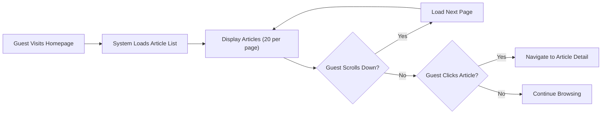

#### Article Detail Viewing Flow

**WHEN a guest clicks on an article from the list, THE system SHALL display the complete article content including all text, images, and file attachments.**

**THE system SHALL display image attachments inline within the article content.**

**THE system SHALL provide download links for file attachments with filename and file size displayed.**

**WHEN a guest attempts to access a non-existent article, THE system SHALL display a "Article Not Found" message and return to the article list.**

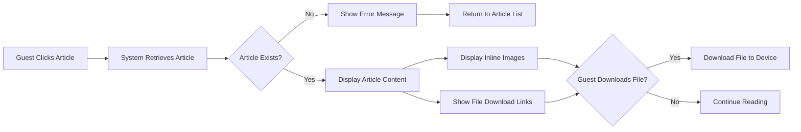

#### Search and Discovery Flow

**WHEN a guest uses the search function, THE system SHALL return matching articles based on title and content.**

**THE system SHALL display search results within 2 seconds.**

**IF no articles match the search query, THEN THE system SHALL display a "No results found" message with suggestions to try different keywords.**

**THE system SHALL allow guests to filter articles by category (economic topics, political topics, general discussions).**

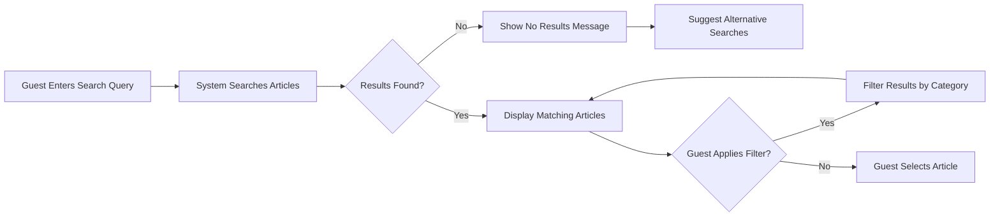

#### Registration Prompt Flow

**WHEN a guest attempts to create an article, THE system SHALL redirect to the registration page with a message explaining that account creation requires membership.**

**WHEN a guest attempts to comment on an article, THE system SHALL display a prompt to register or login.**

**THE system SHALL provide clear "Register" and "Login" links on all pages for guests.**

---

## Member Registration and Onboarding

### Complete Registration Workflow

**WHEN a guest clicks the "Register" button, THE system SHALL display a registration form requesting email, password, and username.**

**THE system SHALL validate that the email address is in proper email format.**

**THE system SHALL validate that the password is at least 8 characters long.**

**THE system SHALL validate that the username is unique and between 3-30 characters.**

**IF the email address is already registered, THEN THE system SHALL display an error message "Email already in use" and suggest logging in instead.**

**WHEN registration validation passes, THE system SHALL create a new member account and send a verification email.**

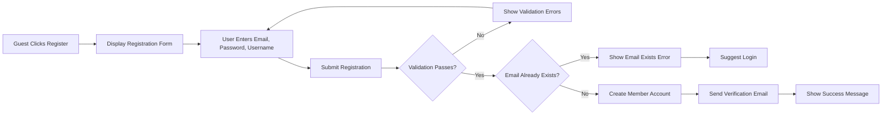

#### Email Verification Flow

**WHEN a new member receives the verification email, THE system SHALL include a unique verification link valid for 24 hours.**

**WHEN the member clicks the verification link, THE system SHALL verify the token and activate the account.**

**IF the verification link has expired, THEN THE system SHALL display an error message and provide an option to resend the verification email.**

**WHEN account verification succeeds, THE system SHALL automatically log in the member and redirect to their profile setup.**

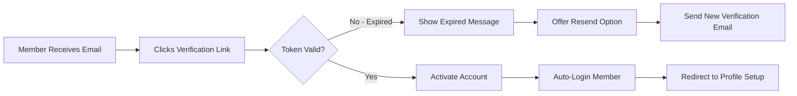

### First Login Experience

**WHEN a verified member logs in for the first time, THE system SHALL display a welcome message and prompt for profile completion.**

**THE system SHALL allow members to add optional profile information including display name, bio, and avatar image.**

**THE system SHALL allow members to skip profile setup and proceed directly to the discussion board.**

**WHEN profile setup is complete, THE system SHALL redirect the member to the article list homepage.**

### Creating First Article Journey

**WHEN a newly registered member navigates to create their first article, THE system SHALL display a simple tutorial tooltip explaining the article creation interface.**

**THE system SHALL guide the member through adding a title, content, and optionally attachments.**

**WHEN the member publishes their first article successfully, THE system SHALL display a congratulatory message and show the published article.**

---

## Article Creation Workflows

### Standard Article Creation Flow

**WHEN a member clicks "Create Article", THE system SHALL display the article creation form with fields for title, content, category, and attachments.**

**THE system SHALL validate that the article title is between 5-200 characters.**

**THE system SHALL validate that the article content is at least 20 characters long.**

**THE system SHALL require the member to select a category (Economic, Political, General).**

**WHEN a member clicks "Save Draft", THE system SHALL save the article in draft status without publishing.**

**WHEN a member clicks "Publish", THE system SHALL validate all required fields and publish the article immediately.**

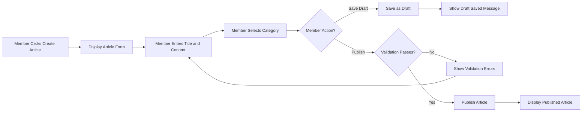

### Article Creation with Image Attachments

**WHEN a member clicks "Add Image" during article creation, THE system SHALL open a file selection dialog.**

**THE system SHALL accept image files in JPEG, PNG, and GIF formats only.**

**THE system SHALL validate that each image file is no larger than 5MB.**

**IF an image file exceeds 5MB, THEN THE system SHALL display an error message "Image file too large. Maximum size is 5MB" and reject the upload.**

**WHEN an image upload succeeds, THE system SHALL display a thumbnail preview with options to remove or replace the image.**

**THE system SHALL allow members to upload up to 10 images per article.**

**WHEN the member publishes the article, THE system SHALL embed all uploaded images inline within the article content in the order they were added.**

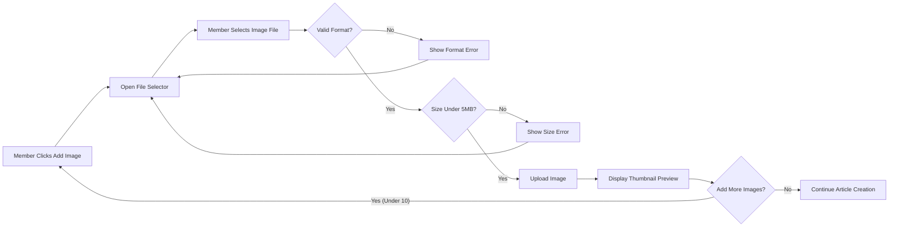

### Article Creation with File Attachments

**WHEN a member clicks "Add File" during article creation, THE system SHALL open a file selection dialog.**

**THE system SHALL accept file attachments in PDF, DOC, DOCX, XLS, XLSX, and TXT formats.**

**THE system SHALL validate that each file is no larger than 10MB.**

**IF a file exceeds 10MB, THEN THE system SHALL display an error message "File too large. Maximum size is 10MB" and reject the upload.**

**WHEN a file upload succeeds, THE system SHALL display the filename, file size, and a remove button.**

**THE system SHALL allow members to upload up to 5 file attachments per article.**

**WHEN the member publishes the article, THE system SHALL attach all uploaded files as downloadable links at the end of the article content.**

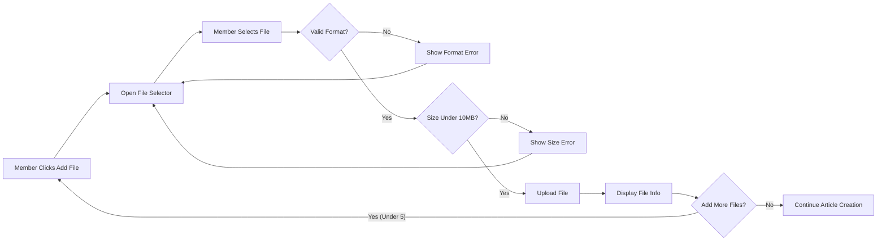

### Article Creation with Mixed Attachments

**THE system SHALL allow members to combine image attachments and file attachments in a single article.**

**WHEN a member adds both images and files, THE system SHALL display images inline within the content and files as download links at the end.**

**THE system SHALL enforce individual limits of 10 images and 5 files per article simultaneously.**

### Draft Saving and Publishing

**WHILE creating an article, THE system SHALL auto-save the draft every 60 seconds.**

**WHEN auto-save occurs, THE system SHALL display a brief "Draft saved" notification.**

**THE system SHALL preserve all content, attachments, and category selections in the draft.**

**WHEN a member returns to edit a draft, THE system SHALL restore all previously entered content and uploaded attachments.**

**WHEN a member publishes a draft, THE system SHALL change the article status from draft to published and make it visible to all users.**

---

## Article Reading and Discovery

### Browsing Article Lists

**WHEN a member views the article list, THE system SHALL display all published articles ordered by publication date (newest first).**

**THE system SHALL display 20 articles per page.**

**THE system SHALL show article title, author username, publication date, category, and first 200 characters of content as excerpt.**

**WHEN a member clicks on an article, THE system SHALL navigate to the full article detail page.**

### Reading Individual Articles

**WHEN a member views an article detail page, THE system SHALL display the complete article content with all formatting preserved.**

**THE system SHALL display all inline images embedded within the content.**

**THE system SHALL display file attachments as a list at the end of the article with download buttons.**

**WHEN a member clicks a file download button, THE system SHALL initiate the file download to the member's device.**

**THE system SHALL display the article author's username and publication date.**

**THE system SHALL display the article category.**

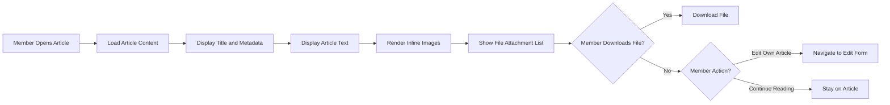

### Searching for Content

**WHEN a member enters a search query, THE system SHALL search article titles and content for matching text.**

**THE system SHALL return search results within 2 seconds.**

**THE system SHALL display search results in the same format as the article list (title, author, date, excerpt).**

**THE system SHALL highlight the search terms in the article excerpts when displaying results.**

**IF no results are found, THEN THE system SHALL display "No articles found matching your search" with a suggestion to try different keywords.**

### Filtering and Categorization

**THE system SHALL provide filter options for categories: Economic, Political, and General.**

**WHEN a member selects a category filter, THE system SHALL display only articles in that category.**

**THE system SHALL allow members to clear filters and return to viewing all articles.**

**THE system SHALL display the active filter selection clearly to the member.**

---

## Content Management Workflows

### Editing Own Articles

**WHEN a member views their own published article, THE system SHALL display an "Edit" button.**

**WHEN a member clicks "Edit" on their own article, THE system SHALL load the article editing form with all existing content and attachments.**

**THE system SHALL allow members to modify the title, content, category, and attachments.**

**WHEN a member saves changes, THE system SHALL update the article and preserve the original publication date.**

**THE system SHALL display an "Updated on [date]" indicator if the article has been edited after publication.**

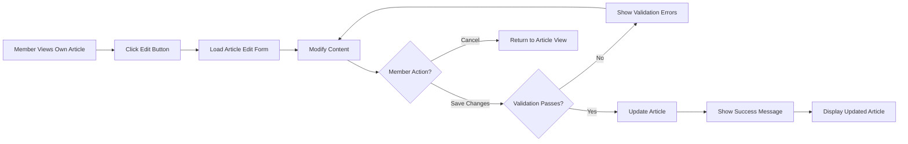

### Updating Attachments

**WHEN editing an article, THE system SHALL display all existing attachments with remove buttons.**

**WHEN a member clicks remove on an image attachment, THE system SHALL delete the image from the article.**

**WHEN a member clicks remove on a file attachment, THE system SHALL delete the file from the article.**

**THE system SHALL allow members to add new attachments while editing, subject to the same limits (10 images, 5 files).**

**WHEN a member saves the edited article, THE system SHALL persist all attachment changes.**

### Deleting Own Content

**WHEN a member views their own article, THE system SHALL display a "Delete" button.**

**WHEN a member clicks "Delete", THE system SHALL display a confirmation dialog "Are you sure you want to delete this article? This action cannot be undone."**

**IF the member confirms deletion, THEN THE system SHALL permanently remove the article and all associated attachments.**

**WHEN deletion succeeds, THE system SHALL redirect the member to the article list with a "Article deleted successfully" message.**

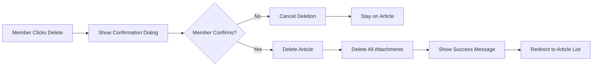

### Managing Drafts vs Published Articles

**WHEN a member views their profile or dashboard, THE system SHALL display separate lists for drafts and published articles.**

**THE system SHALL allow members to continue editing drafts at any time.**

**THE system SHALL allow members to delete drafts without confirmation dialogs.**

**WHEN a member publishes a draft, THE system SHALL move it from the drafts list to the published articles list.**

---

## Moderator Workflows

### Content Review Process

**WHEN a moderator views any article, THE system SHALL display moderator action buttons including "Edit", "Delete", and "Feature".**

**THE system SHALL allow moderators to edit any article regardless of author.**

**THE system SHALL allow moderators to view a moderation queue showing recently published articles for review.**

**WHEN a moderator reviews an article, THE system SHALL provide options to approve, edit, or remove the content.**

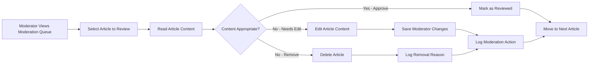

### Editing Any User's Content

**WHEN a moderator edits another user's article, THE system SHALL preserve the original author attribution.**

**THE system SHALL display "Edited by moderator on [date]" indicator on moderated articles.**

**WHEN a moderator saves changes to a user's article, THE system SHALL log the moderation action with moderator username, timestamp, and reason (if provided).**

**THE system SHALL allow moderators to edit article titles, content, categories, and remove inappropriate attachments.**

### Removing Inappropriate Content

**WHEN a moderator deletes an article, THE system SHALL provide a required "Reason for removal" field.**

**THE system SHALL log all content removals with moderator username, timestamp, article title, author, and removal reason.**

**IF a moderator removes an article, THEN THE system SHALL send a notification to the article author explaining the removal with the provided reason.**

**THE system SHALL permanently delete removed articles and all associated attachments.**

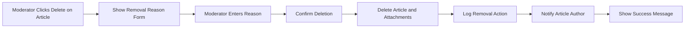

### User Management Actions

**THE system SHALL allow moderators to view member profiles and activity history.**

**THE system SHALL allow moderators to suspend user accounts temporarily with a specified duration.**

**WHEN a moderator suspends a user, THE system SHALL prevent that user from logging in until the suspension expires.**

**THE system SHALL allow moderators to permanently ban users for severe violations.**

**WHEN a moderator bans a user, THE system SHALL require a reason and log the action.**

### Handling Reported Content

**THE system SHALL provide a "Report" button on all articles for members to flag inappropriate content.**

**WHEN a member reports an article, THE system SHALL add it to the moderator review queue with the reporter's reason.**

**WHEN a moderator views reported content, THE system SHALL display the number of reports and all reported reasons.**

**WHEN a moderator takes action on reported content (approve or remove), THE system SHALL clear the report and log the resolution.**

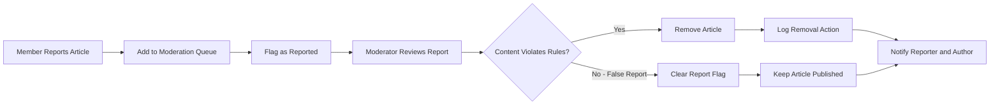

---

## Error and Edge Case Scenarios

### Failed Uploads

**IF an image upload fails due to network error, THEN THE system SHALL display "Image upload failed. Please try again" with a retry button.**

**IF a file upload fails during article creation, THEN THE system SHALL preserve all other article content and allow the member to retry the upload.**

**WHEN an upload fails repeatedly (3 times), THE system SHALL suggest "Please check your internet connection or try a smaller file."**

**THE system SHALL allow members to save drafts even if attachment uploads fail.**

### Authentication Failures

**WHEN a member's session expires during article creation, THE system SHALL preserve the draft content locally.**

**IF a member attempts to access member-only features with an expired session, THEN THE system SHALL redirect to the login page with a message "Your session has expired. Please log in again."**

**WHEN a member logs back in after session expiration, THE system SHALL restore any preserved draft content.**

**IF login credentials are invalid, THEN THE system SHALL display "Invalid email or password" after a 1-second delay to prevent brute force attacks.**

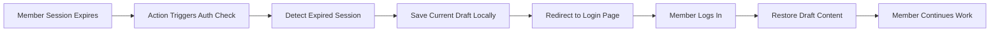

### Permission Denied Scenarios

**WHEN a member attempts to edit another member's article, THE system SHALL display "You don't have permission to edit this article" and return to article view.**

**WHEN a guest attempts to create an article, THE system SHALL redirect to registration page with message "Please register or log in to create articles."**

**WHEN a suspended member attempts to login, THE system SHALL display "Your account is temporarily suspended until [date]. Reason: [reason]."**

**WHEN a banned member attempts to login, THE system SHALL display "Your account has been permanently banned. Contact support for more information."**

### Network Errors During Operations

**IF the article list fails to load due to network error, THEN THE system SHALL display "Unable to load articles. Please check your connection and try again" with a retry button.**

**IF article creation fails due to server error, THEN THE system SHALL preserve the draft content and display "Something went wrong. Your draft has been saved. Please try publishing again."**

**WHEN a member clicks retry after a network error, THE system SHALL attempt the operation again with the preserved content.**

### Invalid Input Handling

**WHEN a member submits an article with a title shorter than 5 characters, THE system SHALL display "Title must be at least 5 characters long" next to the title field.**

**WHEN a member submits an article with content shorter than 20 characters, THE system SHALL display "Article content must be at least 20 characters long" next to the content field.**

**WHEN a member submits an article without selecting a category, THE system SHALL display "Please select a category for your article" next to the category dropdown.**

**THE system SHALL prevent form submission until all validation errors are resolved.**

**THE system SHALL display all validation errors simultaneously rather than one at a time.**

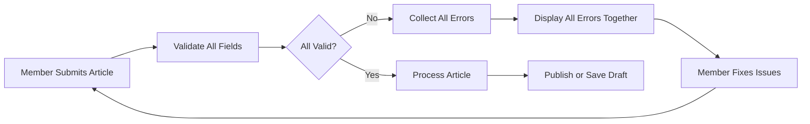

### File Size and Type Validation Failures

**WHEN a member attempts to upload an image larger than 5MB, THE system SHALL display "Image too large. Maximum size is 5MB. Current size: [actual size]."**

**WHEN a member attempts to upload a file larger than 10MB, THE system SHALL display "File too large. Maximum size is 10MB. Current size: [actual size]."**

**WHEN a member attempts to upload an unsupported file type, THE system SHALL display "File type not supported. Allowed types: PDF, DOC, DOCX, XLS, XLSX, TXT."**

**WHEN a member attempts to upload an unsupported image type, THE system SHALL display "Image type not supported. Allowed types: JPEG, PNG, GIF."**

**THE system SHALL prevent the upload from occurring and not charge it against the member's attachment limits.**

### Exceeding Attachment Limits

**WHEN a member attempts to add an 11th image to an article, THE system SHALL display "Maximum 10 images per article. Please remove an existing image before adding more."**

**WHEN a member attempts to add a 6th file to an article, THE system SHALL display "Maximum 5 files per article. Please remove an existing file before adding more."**

**THE system SHALL disable the "Add Image" button when 10 images are attached.**

**THE system SHALL disable the "Add File" button when 5 files are attached.**

### Database or Server Errors

**IF the system encounters a database error during article creation, THEN THE system SHALL preserve the draft content and display "We're experiencing technical difficulties. Your draft has been saved and you can try again later."**

**IF the system encounters an error during article deletion, THEN THE system SHALL display "Unable to delete article. Please try again later" and keep the article intact.**

**THE system SHALL log all server errors with timestamps, user IDs, and error details for debugging purposes.**

### Concurrent Editing Conflicts

**WHEN a moderator edits an article while the author is also editing it, THE system SHALL detect the conflict when the second person saves.**

**IF a save conflict occurs, THEN THE system SHALL display "This article was modified by another user. Please refresh and try again" to the second saver.**

**THE system SHALL preserve the first save and reject the second save to prevent data loss.**

---

## Workflow Summary

This document has defined comprehensive user workflows covering:

1. **Guest Workflows**: Browsing articles, viewing content, searching, and registration prompts
2. **Member Registration**: Complete signup, email verification, and onboarding processes
3. **Article Creation**: Standard creation, image uploads, file uploads, mixed attachments, and draft management
4. **Content Discovery**: Browsing, reading, searching, and filtering articles
5. **Content Management**: Editing own articles, updating attachments, deleting content, and managing drafts
6. **Moderator Workflows**: Content review, editing any content, removal processes, user management, and handling reports
7. **Error Scenarios**: Upload failures, authentication issues, permission denials, network errors, validation failures, and system errors

All workflows are designed to be simple, intuitive, and aligned with the three user actor types (guest, member, moderator) while maintaining the discussion board's focus on economic and political topics. The workflows support both successful operations and comprehensive error handling to ensure a robust user experience.

Backend developers should implement these workflows ensuring all EARS requirements are met, all validation rules are enforced, and all error scenarios are properly handled with clear user feedback.