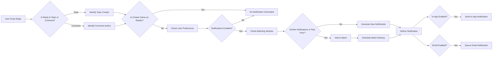
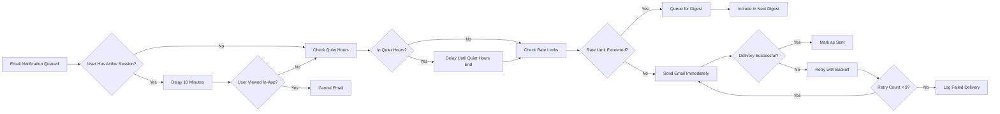
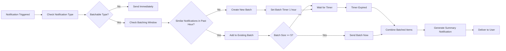

# Notification System Requirements

## 1. Introduction

### 1.1 Purpose

This document specifies the notification system for the economic and political discussion board platform. The notification system is a critical engagement mechanism that keeps users informed of relevant activities, replies, mentions, and important events. This document specifies all notification types, delivery channels, user preferences, batching logic, and business rules required for backend implementation.

## 2. Notification System Overview

### 2.1 Purpose and Importance

The notification system serves as the primary mechanism for keeping users engaged with ongoing discussions and community activities. By alerting users to replies, mentions, votes, and other relevant events, the system encourages return visits, sustained participation, and active community engagement.

For a platform focused on economic and political discussions, timely notifications help users:
- Stay informed about responses to their contributions
- Track ongoing debates and discussions they're interested in
- Receive important moderation or system updates
- Discover content relevant to their interests

### 2.2 Notification Channels

THE system SHALL support two primary notification channels:
1. **In-app notifications**: Real-time notifications displayed within the platform interface
2. **Email notifications**: Notifications delivered to the user's registered email address

Users have granular control over which events trigger notifications and which channels deliver them.

### 2.3 Notification Philosophy

The notification system balances engagement with user experience:
- **Relevance**: Only notify users of events directly relevant to their activity
- **Control**: Users have complete control over notification preferences
- **Non-intrusive**: Batching and throttling prevent notification fatigue
- **Timely**: Critical notifications are delivered in real-time
- **Clear**: Notifications provide clear context and actionable information

## 3. Notification Types and Triggers

### 3.1 Reply to Topic Notification

WHEN a user creates a discussion topic, THE system SHALL track that topic for reply notifications.

WHEN another user posts a reply to a topic the original user created, THE system SHALL generate a "reply to topic" notification for the topic creator.

THE notification SHALL include:
- Name of the user who replied
- Preview of the reply content (first 200 characters)
- Link to the specific reply
- Timestamp of the reply

### 3.2 Reply to Comment Notification

WHEN a user posts a comment/reply in a discussion thread, THE system SHALL track that comment for reply notifications.

WHEN another user posts a direct reply to that comment, THE system SHALL generate a "reply to comment" notification for the original comment author.

THE notification SHALL include:
- Name of the user who replied
- Preview of the reply content (first 200 characters)
- Context showing the original comment
- Link to the specific reply
- Timestamp of the reply

### 3.3 Mention Notification

WHEN a user mentions another user in a topic or comment using the @username syntax, THE system SHALL generate a mention notification for the mentioned user.

THE notification SHALL include:
- Name of the user who mentioned them
- Context showing the full sentence or paragraph containing the mention
- Link to the post containing the mention
- Timestamp of the mention

THE system SHALL validate that mentioned usernames exist before generating notifications.

IF a mentioned username does not exist, THEN THE system SHALL NOT generate a notification.

### 3.4 Vote Milestone Notification

WHEN a user's topic or comment reaches specific vote milestones, THE system SHALL generate a vote milestone notification.

THE vote milestones SHALL be:
- 10 upvotes
- 25 upvotes
- 50 upvotes
- 100 upvotes
- 250 upvotes
- 500 upvotes

THE notification SHALL include:
- The milestone reached (e.g., "Your post reached 50 upvotes")
- Link to the topic or comment
- Total current vote count

THE system SHALL generate only one notification per milestone per content item.

### 3.5 Moderation Action Notification

WHEN a moderator takes action on a user's content, THE system SHALL generate a moderation action notification for the affected user.

Moderation actions that trigger notifications include:
- Content removal or hiding
- Warning issued
- Account suspension
- Account ban
- Content restoration after appeal

THE notification SHALL include:
- Type of moderation action taken
- Reason for the action (if provided by moderator)
- Link to community guidelines
- Information about appeal process (if applicable)
- Timestamp of the action

### 3.6 System Announcement Notification

WHEN an administrator publishes a system-wide announcement, THE system SHALL generate a system announcement notification for all active users.

THE notification SHALL include:
- Announcement title
- Preview of announcement content (first 300 characters)
- Link to full announcement
- Timestamp of announcement

WHEN a user role is "administrator", THE user SHALL have the ability to create system announcements.

### 3.7 Watched Topic Update Notification

WHEN a user explicitly watches a discussion topic, THE system SHALL track that topic for update notifications.

WHEN new activity occurs on a watched topic (new reply, significant votes), THE system SHALL generate a watched topic update notification.

THE notification SHALL include:
- Summary of new activity (e.g., "3 new replies")
- Names of recent contributors
- Link to the topic
- Timestamp of latest activity

### 3.8 Welcome Notification

WHEN a new user completes registration and email verification, THE system SHALL generate a welcome notification.

THE notification SHALL include:
- Welcome message
- Quick start guide links
- Community guidelines link
- Encouragement to create first topic or comment

## 4. In-App Notifications

### 4.1 Notification Display Mechanism

THE system SHALL display in-app notifications through a notification center accessible from the main navigation bar.

THE notification center SHALL display:
- Unread notification count badge
- List of recent notifications (most recent first)
- Visual distinction between read and unread notifications
- Notification type icons for quick recognition

### 4.2 Notification Center Interface

THE notification center SHALL support the following user interactions:
- View list of all notifications
- Mark individual notification as read
- Mark all notifications as read
- Delete individual notification
- Filter notifications by type
- Filter notifications by read/unread status

WHEN a user clicks on a notification, THE system SHALL:
1. Mark the notification as read
2. Navigate the user to the relevant content
3. Update the notification center badge count

### 4.3 Real-Time Notification Delivery

THE system SHALL deliver in-app notifications in real-time when users are actively using the platform.

WHEN a notification-triggering event occurs AND the recipient user has an active session, THE system SHALL deliver the notification immediately without requiring page refresh.

THE system SHALL use WebSocket connections or similar real-time technology for instant notification delivery.

### 4.4 Notification Badges and Counters

THE system SHALL display an unread notification count badge on the notification center icon.

THE badge SHALL display:
- Count of unread notifications (up to 99)
- "99+" when unread count exceeds 99
- No badge when unread count is zero

THE system SHALL update the badge count in real-time as notifications are received and marked as read.

### 4.5 Notification Interaction

WHEN a user views the notification center, THE system SHALL mark notifications as "seen" but not automatically as "read".

WHEN a user explicitly clicks "Mark as read" on a notification, THE system SHALL change the notification status to read.

WHEN a user clicks on a notification to view the associated content, THE system SHALL automatically mark that notification as read.

## 5. Email Notifications

### 5.1 Email Notification Structure

THE system SHALL send email notifications to users based on their email notification preferences.

Each email notification SHALL include:
- Clear subject line indicating notification type
- User-friendly greeting
- Description of the triggering event
- Relevant content preview
- Direct link to the content on the platform
- One-click unsubscribe link
- Footer with platform branding and contact information

### 5.2 Email Formatting

THE system SHALL format email notifications using HTML templates for enhanced readability.

THE email templates SHALL:
- Use responsive design for mobile and desktop viewing
- Include clear calls-to-action with prominent buttons
- Maintain consistent branding with the platform
- Provide plain-text fallback for email clients that don't support HTML

### 5.3 Email Delivery Timing

THE system SHALL apply intelligent timing rules to email notifications to prevent overwhelming users.

WHEN multiple notification-triggering events occur within a short time period, THE system SHALL batch them into a single digest email.

WHEN a user has an active platform session, THE system SHALL delay email notifications for 10 minutes to allow users to see in-app notifications first.

IF the user does not view the in-app notification within 10 minutes, THEN THE system SHALL send the email notification.

### 5.4 Unsubscribe Mechanism

THE system SHALL include a one-click unsubscribe link in every email notification.

WHEN a user clicks the unsubscribe link, THE system SHALL:
1. Disable all email notifications for that user
2. Display a confirmation page
3. Provide options to customize notification preferences instead of complete unsubscribe
4. Allow re-enabling email notifications through user preferences

## 6. Notification Delivery Rules

### 6.1 Trigger Conditions

THE system SHALL evaluate trigger conditions for each notification type before generating notifications.

General trigger rules:
- Users do not receive notifications for their own actions
- Users do not receive notifications for content they cannot access
- Users do not receive notifications when their account is suspended or banned
- Users do not receive duplicate notifications for the same event

### 6.2 Self-Action Prevention

WHEN a user performs an action that would normally trigger a notification, THE system SHALL NOT send that notification to the same user.

Examples:
- User does not receive notification when they reply to their own topic
- User does not receive notification when they vote on their own content
- User does not receive notification when they mention themselves

### 6.3 Content Access Validation

WHEN a notification is triggered, THE system SHALL validate that the recipient has permission to view the associated content.

IF the content has been deleted or the user lacks permission to view it, THEN THE system SHALL NOT deliver the notification.

### 6.4 Timing and Batching Logic

THE system SHALL implement notification batching to prevent overwhelming users with excessive notifications.

WHEN multiple similar notifications are triggered within a 1-hour window, THE system SHALL batch them into a single notification.

Batching rules by notification type:
- **Reply notifications**: Batch multiple replies to the same topic/comment
- **Vote milestone notifications**: Do not batch (each milestone is unique)
- **Mention notifications**: Batch multiple mentions from the same discussion
- **Watched topic notifications**: Batch all activity on a watched topic within 1 hour

THE batched notification SHALL include:
- Summary count (e.g., "5 new replies to your topic")
- List of all contributing users
- Link to view all updates

### 6.5 Priority Levels

THE system SHALL assign priority levels to notifications:

**High Priority** (deliver immediately):
- Moderation action notifications
- System announcements
- Direct mentions

**Medium Priority** (may be batched):
- Reply to topic notifications
- Reply to comment notifications
- Vote milestone notifications

**Low Priority** (batched by default):
- Watched topic updates
- General activity summaries

### 6.6 Duplicate Prevention

THE system SHALL maintain a notification deduplication registry to prevent sending duplicate notifications for the same event.

WHEN a notification is generated, THE system SHALL check:
- If the same event already triggered a notification for this user
- If a similar notification was batched within the current batching window
- If the notification would be redundant given recent user activity

IF a duplicate is detected, THEN THE system SHALL NOT generate a new notification.

## 7. Notification Preferences

### 7.1 User Preference Controls

THE system SHALL provide users with granular control over their notification preferences through a dedicated settings interface.

Users can access notification preferences through:
- User profile settings
- Direct link from any notification
- Account settings menu

### 7.2 Granular Notification Settings

For each notification type, users SHALL be able to configure:
- **In-app notifications**: Enable/Disable
- **Email notifications**: Enable/Disable
- **Notification frequency**: Real-time, Hourly digest, Daily digest, Weekly digest

THE notification types that users can configure include:
- Replies to my topics
- Replies to my comments
- Mentions of my username
- Vote milestones on my content
- Moderation actions on my content
- Watched topic updates
- System announcements

### 7.3 Channel Selection Per Notification Type

THE system SHALL allow users to enable or disable each notification channel independently for each notification type.

Example configuration:
- Replies to my topics: In-app ✓, Email ✗
- Mentions: In-app ✓, Email ✓
- Vote milestones: In-app ✓, Email ✗
- Moderation actions: In-app ✓, Email ✓

### 7.4 Digest Options

THE system SHALL support notification digest modes that combine multiple notifications into periodic summaries.

Available digest frequencies:
- **Real-time**: Send each notification immediately (default)
- **Hourly digest**: Combine all notifications from the past hour
- **Daily digest**: Combine all notifications from the past 24 hours (sent at user's preferred time)
- **Weekly digest**: Combine all notifications from the past week (sent on user's preferred day)

WHEN a user selects digest mode, THE system SHALL batch all applicable notifications and send them as a single email at the specified frequency.

THE digest email SHALL include:
- Summary count of each notification type
- Grouped notifications by type
- Links to all mentioned content
- Clear visual hierarchy for easy scanning

### 7.5 Default Notification Preferences

WHEN a new user registers, THE system SHALL set the following default notification preferences:

**Enabled by default** (in-app and email):
- Replies to my topics
- Replies to my comments
- Mentions of my username
- Moderation actions on my content
- System announcements

**Enabled by default** (in-app only):
- Vote milestones on my content

**Disabled by default**:
- Watched topic updates (until user explicitly watches a topic)

Users can modify these defaults at any time.

## 8. Notification History and Management

### 8.1 Notification Retention

THE system SHALL retain notification history for each user for 90 days.

WHEN a notification is older than 90 days, THE system SHALL automatically archive or delete it.

Users SHALL be able to view their notification history within the 90-day retention period.

### 8.2 Read/Unread Status

THE system SHALL track read/unread status for each notification.

WHEN a notification is first delivered, THE system SHALL mark it as unread.

WHEN a user views the notification or clicks on it, THE system SHALL mark it as read.

THE system SHALL maintain separate read/unread status for in-app notifications and email notifications.

### 8.3 Notification Filtering

THE notification center SHALL support filtering notifications by:
- **Type**: Show only specific notification types (replies, mentions, votes, etc.)
- **Status**: Show only unread or only read notifications
- **Date range**: Show notifications from specific time periods

THE system SHALL remember user's filter preferences across sessions.

### 8.4 Bulk Actions

THE notification center SHALL support bulk actions:
- Mark all as read
- Delete all read notifications
- Delete all notifications

WHEN a user selects "Mark all as read", THE system SHALL update the status of all unread notifications to read.

WHEN a user selects "Delete all read notifications", THE system SHALL permanently remove all notifications marked as read.

## 9. Notification Batching and Throttling

### 9.1 Batching Strategy

THE system SHALL implement notification batching to prevent overwhelming users with excessive notifications.

**Batching window**: 1 hour for most notification types

WHEN multiple similar notifications are triggered within the batching window, THE system SHALL combine them into a single notification.

**Batch combination rules**:

1. **Multiple replies to the same topic**: Combine into "X new replies to your topic [Topic Title]"
2. **Multiple replies to the same comment**: Combine into "X new replies to your comment"
3. **Multiple mentions in the same discussion**: Combine into "X users mentioned you in [Topic Title]"
4. **Multiple watched topic updates**: Combine into "X new updates in [Topic Title]"

THE batched notification SHALL list:
- All unique users involved
- Total count of actions
- Time range of batched events
- Single link to view all updates

### 9.2 Digest Notifications

THE system SHALL support digest notification modes for users who prefer less frequent updates.

**Hourly Digest**:
- Collect all notifications triggered in the past hour
- Send single digest email on the hour
- Group notifications by type
- Include summary counts and links

**Daily Digest**:
- Collect all notifications triggered in the past 24 hours
- Send digest at user-specified time (default: 8:00 AM user's timezone)
- Provide comprehensive summary of all activity
- Highlight most important notifications first

**Weekly Digest**:
- Collect all notifications triggered in the past 7 days
- Send digest on user-specified day (default: Monday 8:00 AM)
- Provide high-level summary with trending discussions
- Include personalized content recommendations

WHEN a user enables digest mode for a notification channel, THE system SHALL NOT send individual notifications through that channel.

### 9.3 Rate Limiting

THE system SHALL implement rate limiting to prevent notification spam in exceptional cases.

**Email notification rate limits**:
- Maximum 50 email notifications per user per day
- Maximum 5 email notifications per user per hour (excluding digests)

**In-app notification rate limits**:
- Maximum 100 in-app notifications per user per hour

WHEN rate limits are exceeded, THE system SHALL:
1. Queue excess notifications for later delivery
2. Automatically switch to digest mode for that notification type
3. Log the rate limit event for monitoring

IF a user consistently triggers rate limits, THEN THE system SHALL send a notification suggesting digest mode.

### 9.4 Quiet Hours Support

THE system SHALL support user-defined quiet hours during which email notifications are suppressed.

Users can configure:
- Quiet hours start time (e.g., 10:00 PM)
- Quiet hours end time (e.g., 7:00 AM)
- Timezone for quiet hours calculation
- Days of week for quiet hours (e.g., every day, weekdays only, weekends only)

WHEN a notification is scheduled for delivery during quiet hours, THE system SHALL delay delivery until quiet hours end.

THE system SHALL batch all delayed notifications and deliver them as a digest when quiet hours end.

In-app notifications are not affected by quiet hours (users can disable them separately if needed).

## 10. Business Rules and Requirements

### 10.1 Notification Generation Requirements

**[NFR-001] Notification Trigger Validation**
WHEN an event occurs that could trigger a notification, THE system SHALL validate all trigger conditions before generating the notification.

**[NFR-002] Self-Action Exclusion**
THE system SHALL NOT generate notifications for users based on their own actions.

**[NFR-003] Permission Validation**
WHEN generating a notification, THE system SHALL verify the recipient has permission to access the associated content.

**[NFR-004] Duplicate Prevention**
THE system SHALL maintain deduplication logic to prevent sending duplicate notifications for the same event to the same user.

### 10.2 Delivery Requirements

**[NFR-005] Real-Time In-App Delivery**
WHEN a user has an active platform session AND a notification is triggered, THE system SHALL deliver the in-app notification within 2 seconds.

**[NFR-006] Email Delivery Timing**
WHEN an email notification is queued, THE system SHALL send it within 5 minutes unless batching or quiet hours rules apply.

**[NFR-007] Notification Ordering**
THE system SHALL display notifications in reverse chronological order (most recent first) in the notification center.

**[NFR-008] Preference Compliance**
THE system SHALL respect user notification preferences for all notification types and channels.

### 10.3 Batching and Throttling Requirements

**[NFR-009] Batching Window**
WHEN similar notifications are triggered within a 1-hour batching window, THE system SHALL combine them into a single batched notification.

**[NFR-010] Rate Limit Enforcement**
THE system SHALL enforce rate limits of maximum 50 email notifications per user per day and 5 email notifications per user per hour.

**[NFR-011] Quiet Hours Enforcement**
WHEN a user has configured quiet hours, THE system SHALL delay email notifications triggered during quiet hours until quiet hours end.

**[NFR-012] Digest Generation**
WHEN a user selects digest mode for a notification type, THE system SHALL collect all notifications of that type and send them as a single digest at the specified frequency.

### 10.4 Notification Content Requirements

**[NFR-013] Content Preview Length**
THE system SHALL limit notification content previews to 200 characters for efficiency and clarity.

**[NFR-014] User Information**
THE system SHALL include the triggering user's username in all applicable notifications.

**[NFR-015] Timestamp Inclusion**
THE system SHALL include a human-readable timestamp (e.g., "5 minutes ago", "2 hours ago") in all notifications.

**[NFR-016] Direct Links**
THE system SHALL include direct links to the relevant content in all notifications.

### 10.5 Email Notification Requirements

**[NFR-017] Unsubscribe Link**
THE system SHALL include a one-click unsubscribe link in every email notification.

**[NFR-018] HTML and Plain Text**
THE system SHALL send email notifications with both HTML and plain-text versions for compatibility.

**[NFR-019] Responsive Design**
THE system SHALL use responsive email templates that render correctly on mobile and desktop devices.

**[NFR-020] Sender Identification**
THE system SHALL send email notifications from a clearly identified sender address (e.g., notifications@discussionboard.com).

### 10.6 Notification History Requirements

**[NFR-021] Retention Period**
THE system SHALL retain notification history for 90 days.

**[NFR-022] Read Status Tracking**
THE system SHALL track and persist read/unread status for each notification.

**[NFR-023] Filtering Support**
THE notification center SHALL support filtering by type, status, and date range.

**[NFR-024] Bulk Operations**
THE system SHALL support bulk operations including "Mark all as read" and "Delete all read notifications".

### 10.7 Performance Requirements

**[NFR-025] Notification Center Load Time**
WHEN a user opens the notification center, THE system SHALL load and display notifications within 1 second.

**[NFR-026] Real-Time Delivery Latency**
THE system SHALL deliver real-time in-app notifications with less than 2 seconds latency from trigger event.

**[NFR-027] Email Queue Processing**
THE system SHALL process the email notification queue continuously to ensure timely delivery.

**[NFR-028] Badge Update Speed**
WHEN a notification status changes, THE system SHALL update the notification badge count within 1 second.

### 10.8 Validation and Error Handling

**[NFR-029] Invalid User Mention Handling**
IF a user mentions a non-existent username, THEN THE system SHALL NOT generate a mention notification and SHALL log the invalid mention attempt.

**[NFR-030] Deleted Content Handling**
IF content associated with a notification is deleted before the notification is viewed, THEN THE system SHALL display a message indicating the content is no longer available when the user clicks the notification.

**[NFR-031] Email Delivery Failure Handling**
IF an email notification fails to deliver, THEN THE system SHALL retry up to 3 times with exponential backoff, and SHALL log failed deliveries for administrator review.

**[NFR-032] Missing Preference Handling**
IF a user has not explicitly set preferences for a notification type, THEN THE system SHALL use the default preferences defined in this document.

### 10.9 Privacy and Security Requirements

**[NFR-033] Content Access Enforcement**
THE system SHALL NOT include content in notifications that the recipient does not have permission to view.

**[NFR-034] Email Address Privacy**
THE system SHALL NOT expose user email addresses in notification content or metadata to other users.

**[NFR-035] Notification Data Protection**
THE system SHALL transmit email notifications using secure protocols (TLS/SSL).

**[NFR-036] User Data in Notifications**
THE system SHALL only include necessary user data in notifications (username, public profile information) and SHALL NOT include sensitive personal information.

## 11. Integration with Other System Components

### 11.1 Integration with User Profiles and Preferences

The notification system integrates with the user profile system to:
- Retrieve notification preferences for each user
- Store and persist preference changes
- Access user email addresses for email notifications
- Respect user privacy settings when generating notifications

For detailed information on user profile management and preference storage, see the User Profiles and Preferences document.

### 11.2 Integration with Discussion Management

The notification system integrates with the discussion management system to:
- Detect events that trigger notifications (new replies, mentions, etc.)
- Access discussion content for notification previews
- Validate user permissions to view discussion content
- Track watched topics for update notifications

For detailed information on discussion functionality, see the Discussion Management document.

### 11.3 Integration with Authentication System

The notification system integrates with the authentication system to:
- Identify users for notification delivery
- Validate active user sessions for real-time in-app notifications
- Verify user roles for system announcement notifications
- Track user activity to optimize notification timing

For detailed information on user authentication and roles, see the User Roles and Authentication document.

### 11.4 Integration with Voting and Engagement

The notification system integrates with the voting and engagement system to:
- Track vote counts for milestone notifications
- Detect when content reaches vote thresholds
- Generate engagement-related notifications

For detailed information on voting mechanics, see the Voting and Engagement document.

### 11.5 Integration with Moderation System

The notification system integrates with the moderation system to:
- Notify users of moderation actions taken on their content
- Alert users to warnings, suspensions, or bans
- Provide information about appeal processes
- Track moderation events for audit purposes

For detailed information on moderation workflows, see the Moderation System document.

## 12. Notification Flow Diagrams

### 12.1 Reply Notification Flow

### 12.2 Email Notification Delivery Flow

### 12.3 Notification Batching Flow

## 13. Summary

This document has specified the comprehensive notification system for the economic and political discussion board platform. The notification system provides:

- **Multiple notification types** covering all relevant user activities (replies, mentions, votes, moderation, system announcements)
- **Dual delivery channels** with in-app and email notifications
- **Granular user control** over notification preferences, frequencies, and channels
- **Intelligent batching and throttling** to prevent notification fatigue
- **Real-time delivery** for in-app notifications with WebSocket support
- **Digest modes** for users who prefer consolidated updates
- **Quiet hours support** to respect user time preferences
- **Rate limiting** to prevent spam and abuse
- **90-day notification history** with filtering and bulk management
- **Performance requirements** ensuring responsive notification delivery

The notification system is designed to maximize user engagement while respecting user preferences and preventing notification overload. All requirements are specified in EARS format to ensure clarity and testability for backend developers.

Backend developers should implement this notification system with attention to real-time delivery mechanisms, preference management, batching logic, and integration with other platform components as described in the related documentation.
