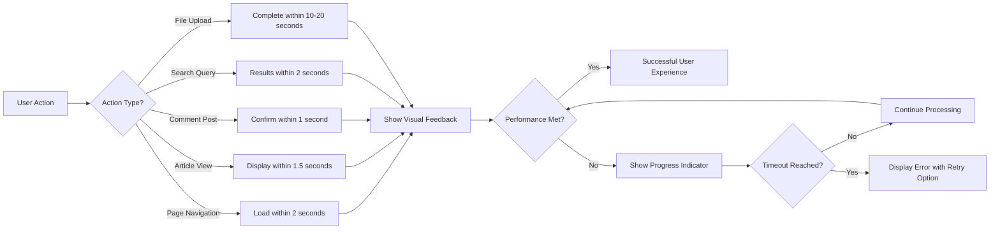

# Performance and Scalability Requirements

## Introduction

This document defines the performance expectations and scalability requirements for the economic/political discussion board from a user experience perspective. Performance is critical for user engagement - users expect fast, responsive interactions when browsing articles, posting comments, and searching for content. These requirements focus on ensuring the system delivers a smooth experience while maintaining the simplicity that is core to this platform's design.

The requirements in this document are written from the user's viewpoint, describing what users should experience rather than prescribing technical implementation details. All performance metrics are expressed in terms that users understand: "instant," "within seconds," "smooth scrolling," etc.

## Response Time Expectations

### Page Load Performance

**WHEN a user navigates to any page in the discussion board, THE system SHALL display the initial page content within 2 seconds under normal network conditions.**

**WHEN a user clicks on an article link, THE system SHALL display the article title and main content within 1.5 seconds.**

**WHEN a user accesses the homepage, THE system SHALL display the article listing within 2 seconds.**

**THE system SHALL render interactive elements (buttons, forms, navigation) within 1 second of page load so users can begin interacting immediately.**

### API Response Time Expectations

**WHEN a user submits an article creation request, THE system SHALL respond with confirmation within 3 seconds (excluding file upload time).**

**WHEN a user posts a comment, THE system SHALL display the new comment within 1 second.**

**WHEN a user performs a login operation, THE system SHALL authenticate and respond within 2 seconds.**

**WHEN a user requests article editing, THE system SHALL load the edit form with existing content within 1.5 seconds.**

**WHEN a user deletes content (article or comment), THE system SHALL confirm deletion within 1 second.**

### User Interaction Responsiveness

**WHEN a user types in a search box, THE system SHALL provide immediate visual feedback (loading indicator, suggestions) within 200 milliseconds.**

**WHEN a user clicks pagination controls, THE system SHALL load the next page of results within 1.5 seconds.**

**WHEN a user applies filters or sorting options, THE system SHALL update the content display within 2 seconds.**

**THE system SHALL acknowledge user actions (button clicks, form submissions) with visual feedback within 100 milliseconds to prevent users from clicking multiple times.**

## Concurrent User Support

### Expected User Load

**THE system SHALL support at least 100 concurrent users browsing and reading content simultaneously without performance degradation.**

**THE system SHALL support at least 20 concurrent users creating articles or posting comments simultaneously without performance degradation.**

**WHEN concurrent user count reaches 200 active users, THE system SHALL continue to function with response times no more than 50% slower than normal performance.**

### Peak Load Scenarios

**WHEN a popular article is published and attracts high traffic, THE system SHALL maintain readable performance for users accessing that article (response times under 5 seconds).**

**WHEN search functionality experiences high concurrent usage (50+ simultaneous searches), THE system SHALL return results within 5 seconds for each query.**

**IF system load exceeds capacity thresholds, THEN THE system SHALL prioritize read operations (browsing, viewing) over write operations (posting, editing) to maintain overall availability.**

### User Activity Patterns

**THE system SHALL handle typical usage patterns where 80% of users are reading content and 20% are creating or commenting.**

**THE system SHALL support activity spikes during peak hours (typically evenings and weekends) with up to 3x normal traffic without requiring manual intervention.**

**WHILE experiencing high traffic loads, THE system SHALL queue non-urgent operations (such as email notifications or activity logging) to prioritize user-facing interactions.**

## Content Loading Performance

### Article Listing Performance

**WHEN a user views the article list on the homepage, THE system SHALL display 20 articles per page within 2 seconds.**

**THE system SHALL paginate article listings to prevent excessive load times, showing no more than 50 articles per page.**

**WHEN a user scrolls through article listings, THE system SHALL load images progressively to avoid blocking page rendering.**

**THE system SHALL display article metadata (title, author, date, comment count) immediately, while loading thumbnail images in the background.**

### Individual Article Display

**WHEN a user opens an article, THE system SHALL display the article text and metadata within 1.5 seconds.**

**WHEN an article contains images, THE system SHALL display the article text immediately and load images progressively afterward.**

**WHEN an article has file attachments, THE system SHALL display attachment information (file names, sizes, types) within the initial 1.5-second load time.**

**THE system SHALL prioritize loading article content and the first 10 comments, deferring additional comments to user-triggered loading (pagination or "load more").**

### Comment Loading

**WHEN a user views an article, THE system SHALL display the first 20 comments within 2 seconds of the article loading.**

**WHEN a user clicks "load more comments," THE system SHALL display the next batch of comments within 1.5 seconds.**

**THE system SHALL indicate the total number of comments on an article without requiring users to load all comments.**

**WHILE comments are loading, THE system SHALL display a loading indicator to prevent user confusion.**

## Search Performance Requirements

### Search Query Response

**WHEN a user submits a search query, THE system SHALL return search results within 2 seconds for queries matching common terms.**

**WHEN a user searches for rare or complex terms, THE system SHALL return results within 5 seconds.**

**THE system SHALL display at least the first 20 search results within the initial response time, with pagination for additional results.**

**WHEN search queries return no results, THE system SHALL respond within 1 second with a "no results found" message.**

### Search Result Relevance

**THE system SHALL rank search results by relevance, displaying the most relevant articles first.**

**THE system SHALL highlight search terms within result snippets to help users quickly identify relevant content.**

**WHEN displaying search results, THE system SHALL show article title, author, publication date, and a text snippet containing the search term within 2 seconds.**

### Filtering and Sorting Performance

**WHEN a user applies category filters to search results or article listings, THE system SHALL update the display within 2 seconds.**

**WHEN a user changes sort order (e.g., newest first, most commented), THE system SHALL re-order content within 1.5 seconds.**

**THE system SHALL support combining multiple filters (category + date range) and return filtered results within 3 seconds.**

### Search Index Updates

**WHEN a new article is published, THE system SHALL make it searchable within 5 minutes.**

**WHEN an article is edited, THE system SHALL update search results to reflect changes within 10 minutes.**

**WHEN an article is deleted, THE system SHALL remove it from search results within 5 minutes.**

## File Upload and Download Performance

### Image Upload Experience

**WHEN a user uploads an image smaller than 5MB, THE system SHALL complete the upload within 10 seconds on typical broadband connections.**

**WHEN a user uploads multiple images simultaneously, THE system SHALL display individual progress indicators for each file.**

**THE system SHALL provide real-time upload progress (percentage or progress bar) for any upload taking longer than 2 seconds.**

**IF an image upload fails, THEN THE system SHALL notify the user immediately and allow retry without losing other form data.**

### Document Upload Performance

**WHEN a user uploads a document file (PDF, DOCX) smaller than 10MB, THE system SHALL complete the upload within 20 seconds on typical broadband connections.**

**WHEN a user uploads files larger than 5MB, THE system SHALL display upload progress continuously until completion.**

**THE system SHALL validate file types and sizes client-side immediately upon selection, before attempting upload, to prevent wasted time.**

### File Download Speed

**WHEN a user downloads an attached image, THE system SHALL begin serving the file within 1 second.**

**WHEN a user downloads a document attachment, THE system SHALL begin serving the file within 2 seconds.**

**THE system SHALL support resumable downloads for files larger than 5MB to handle connection interruptions.**

**THE system SHALL serve images in optimized formats (compressed JPEG/PNG) to minimize download time without requiring user intervention.**

### Progress Indicators

**WHEN any file operation (upload or download) takes longer than 2 seconds, THE system SHALL display a progress indicator.**

**THE system SHALL update progress indicators at least once per second to provide real-time feedback.**

**WHEN multiple files are being uploaded, THE system SHALL show both individual file progress and overall upload progress.**

## System Availability Expectations

### Uptime Targets

**THE system SHALL maintain 99% uptime on a monthly basis, calculated as the percentage of time the system is accessible to users.**

**THE system SHALL schedule any planned maintenance during low-traffic periods (late night or early morning hours in the primary user timezone).**

**WHEN planned maintenance is scheduled, THE system SHALL notify users at least 24 hours in advance through a visible site banner.**

### Maintenance Windows

**THE system SHALL limit planned maintenance windows to a maximum of 2 hours per month.**

**DURING planned maintenance, THE system SHALL display a clear maintenance message explaining when service will resume.**

**THE system SHALL complete most routine maintenance operations (database backups, minor updates) without taking the system offline.**

### Error Handling During High Load

**WHEN system load approaches capacity limits, THE system SHALL continue serving read requests (article viewing, browsing) even if write operations (posting, commenting) are temporarily slowed.**

**IF system resources become critically low, THEN THE system SHALL display a friendly message indicating high traffic and asking users to try again shortly, rather than showing technical error messages.**

**THE system SHALL log performance degradation events automatically so administrators can identify and address bottlenecks.**

### Graceful Degradation

**WHEN the search service is temporarily unavailable, THE system SHALL still allow users to browse articles by category and date.**

**WHEN file upload services are experiencing issues, THE system SHALL still allow users to create text-only articles and comments.**

**IF database query performance degrades, THEN THE system SHALL implement request queuing to prevent system crashes, informing users of slight delays.**

**THE system SHALL prioritize core functionality (reading and writing content) over optional features (email notifications, analytics) during resource constraints.**

## Performance Monitoring from User Perspective

### Key Performance Indicators

**THE system SHALL track and monitor average page load times for key pages: homepage, article view, search results.**

**THE system SHALL track and monitor API response times for critical operations: login, article creation, comment posting.**

**THE system SHALL track and monitor search query response times and identify slow queries for optimization.**

**THE system SHALL track concurrent user counts and identify peak usage periods.**

### Performance Degradation Thresholds

**WHEN average page load time exceeds 5 seconds for more than 5 consecutive minutes, THE system SHALL alert administrators automatically.**

**WHEN API response times exceed 10 seconds for more than 10% of requests in a 5-minute window, THE system SHALL trigger performance investigation alerts.**

**WHEN error rates exceed 5% of all requests, THE system SHALL escalate alerts to administrators immediately.**

### User Notification During Performance Issues

**WHEN the system is experiencing known performance degradation, THE system SHALL display a status banner informing users of the issue and expected resolution time.**

**THE system SHALL provide users with estimated wait times when operations are taking longer than usual due to high load.**

**WHEN specific features (search, file upload) are temporarily degraded, THE system SHALL inform users through contextual messages near affected features.**

## Performance Optimization Strategies

### Caching Requirements

**THE system SHALL implement caching for frequently accessed content to reduce database load and improve response times.**

**WHEN a user accesses the homepage, THE system SHALL serve cached article listings when content has not changed in the past 60 seconds.**

**WHEN a user views an article, THE system SHALL cache the article content for 5 minutes to handle multiple concurrent views efficiently.**

**THE system SHALL invalidate caches immediately when content is created, updated, or deleted to ensure users see fresh content.**

**THE system SHALL cache user profile information for 10 minutes to reduce repeated database queries.**

### Content Delivery Optimization

**THE system SHALL optimize image delivery by serving appropriately sized images based on display context (thumbnail, preview, full-size).**

**THE system SHALL compress images automatically to reduce file size while maintaining acceptable visual quality.**

**THE system SHALL implement lazy loading for images below the fold, loading images only as users scroll to them.**

**THE system SHALL minimize the number of network requests required to load a page by bundling resources efficiently.**

### Database Query Optimization

**THE system SHALL optimize database queries to return results efficiently, targeting query execution times under 100 milliseconds for common operations.**

**THE system SHALL implement pagination for all list views to limit the amount of data retrieved and transferred.**

**THE system SHALL use database indexing appropriately to speed up searches and queries on frequently accessed fields.**

**WHEN complex queries are necessary, THE system SHALL execute them asynchronously to avoid blocking user interactions.**

### Resource Loading Prioritization

**THE system SHALL prioritize loading critical resources (HTML, CSS, essential JavaScript) before non-critical resources (analytics, social widgets).**

**THE system SHALL load above-the-fold content first, deferring below-the-fold content until after initial page render.**

**THE system SHALL defer loading of non-essential features (comment voting, share buttons) until after core content is displayed.**

## Scalability Requirements

### Horizontal Scalability

**THE system SHALL be designed to support horizontal scaling by adding more server instances to handle increased load.**

**WHEN traffic increases beyond a single server's capacity, THE system SHALL distribute load across multiple servers automatically.**

**THE system SHALL maintain session consistency across multiple servers so users experience seamless interaction regardless of which server handles their request.**

### Database Scalability

**THE system SHALL support database scaling strategies to handle growing data volumes and increased query loads.**

**WHEN article and comment counts exceed 100,000 records, THE system SHALL maintain query performance through appropriate indexing and query optimization.**

**THE system SHALL implement database connection pooling to efficiently manage database connections across multiple concurrent users.**

### Storage Scalability

**THE system SHALL support growing file storage requirements as users upload images and documents.**

**WHEN file storage reaches 80% capacity, THE system SHALL alert administrators to provision additional storage.**

**THE system SHALL organize uploaded files efficiently to prevent file system performance degradation as file counts grow.**

### Traffic Growth Handling

**THE system SHALL support gradual traffic growth from initial launch (100 users) to mature state (10,000+ users) without major architectural changes.**

**WHEN user count doubles, THE system SHALL handle the increased load by scaling resources rather than requiring code changes.**

**THE system SHALL monitor resource utilization (CPU, memory, disk, network) and provide early warnings when scaling is needed.**

## Performance Testing Requirements

### Load Testing Scenarios

**THE system SHALL be tested under simulated load of 100 concurrent users performing typical browsing activities.**

**THE system SHALL be tested under simulated peak load of 200 concurrent users to verify graceful degradation.**

**THE system SHALL be tested with 20 concurrent users creating articles and posting comments to verify write operation performance.**

**THE system SHALL be tested with 50 concurrent users performing searches to verify search system performance.**

### Stress Testing Scenarios

**THE system SHALL be tested under gradually increasing load until failure points are identified.**

**THE system SHALL be tested with sudden traffic spikes (e.g., 50 to 300 users in 1 minute) to verify spike handling.**

**THE system SHALL be tested with sustained high load (150% of target capacity) for extended periods (1+ hours) to identify memory leaks or performance degradation.**

### Performance Benchmarks

**THE system SHALL establish performance baselines for key operations under normal load:**
- Homepage load: 2 seconds
- Article view: 1.5 seconds
- Article creation: 3 seconds
- Comment posting: 1 second
- Search query: 2 seconds
- Login: 2 seconds

**THE system SHALL maintain performance within 20% of baseline metrics under normal operating conditions.**

**WHEN performance degrades beyond 50% of baseline metrics, THE system SHALL trigger alerts and investigation.**

## User Experience Performance Requirements

### Perceived Performance

**THE system SHALL provide immediate visual feedback for all user actions to create perception of responsiveness even when backend processing takes longer.**

**WHEN a user submits a form, THE system SHALL disable the submit button and show a loading indicator within 100 milliseconds.**

**WHEN a user initiates an action that takes more than 500 milliseconds, THE system SHALL display a progress indicator or loading animation.**

**THE system SHALL use optimistic UI updates where appropriate, displaying expected results immediately while processing in the background.**

### Animation and Transitions

**THE system SHALL keep all UI animations under 300 milliseconds to maintain responsiveness.**

**THE system SHALL use smooth transitions between states to provide visual continuity and reduce jarring changes.**

**WHEN loading new content, THE system SHALL use fade-in or slide animations that complete within 200 milliseconds.**

### Progressive Enhancement

**THE system SHALL display basic content and functionality immediately, enhancing with additional features as they load.**

**WHEN JavaScript is loading, THE system SHALL ensure core content (articles, comments) remains readable and accessible.**

**THE system SHALL prioritize content visibility over interactive features during initial page load.**

### Mobile Performance

**WHEN a user accesses the system on a mobile device, THE system SHALL maintain performance targets within 50% (e.g., 3 seconds instead of 2 seconds for page loads).**

**THE system SHALL optimize for mobile network conditions by reducing payload sizes and minimizing network requests.**

**THE system SHALL support offline reading of recently viewed articles on mobile devices when technically feasible.**

## Performance Expectations Summary

## Conclusion

The discussion board is designed as a simple, focused platform for economic and political discourse. Performance requirements reflect this simplicity:

- **Read operations (browsing, viewing) should feel instant**: 1-2 seconds for most page loads
- **Write operations (posting, commenting) should complete quickly**: 1-3 seconds for most actions
- **Search should be responsive**: 2-5 seconds depending on query complexity
- **File operations should show clear progress**: Immediate feedback with progress indicators for uploads over 2 seconds
- **The system should handle 100+ concurrent users comfortably**: With graceful degradation up to 200+ users
- **Availability should be excellent**: 99% uptime with minimal maintenance disruption

These requirements prioritize user experience over technical metrics. Developers should focus on making the system feel fast and responsive from the user's perspective, even if that means implementing clever UX techniques like optimistic updates, progressive loading, or background processing.

The system should never leave users wondering what's happening - every action should have immediate feedback, every wait should have a progress indicator, and every error should have a clear, helpful message.

---

**Related Documentation:**
- For service context and overall system vision, see [Service Overview](./01-service-overview.md)
- For article management performance implications, see [Article Management Requirements](./03-article-management.md)
- For file handling performance details, see [File Storage and Media Handling](./08-file-storage-and-media-handling.md)
- For search performance details, see [Search and Discovery Requirements](./05-search-and-discovery.md)