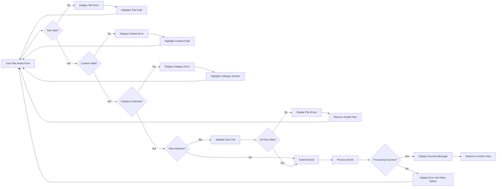
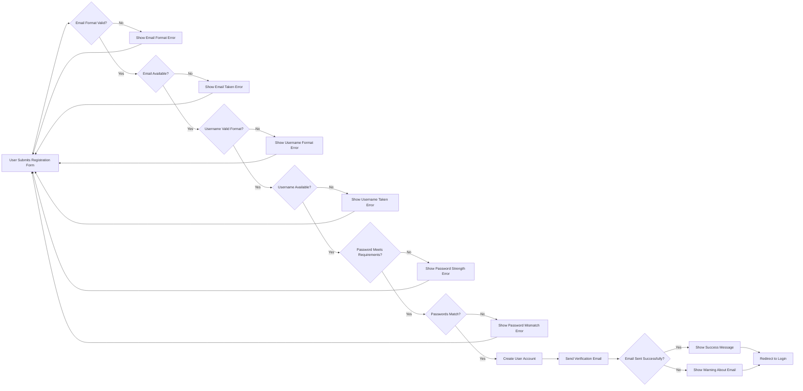
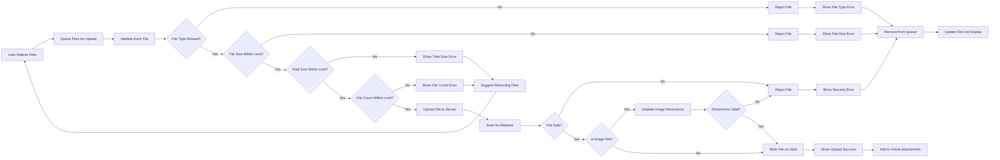

# Error Handling and Validation Requirements

## Introduction and Overview

### Purpose of This Document
This document defines comprehensive error handling and input validation requirements for the discussion board system. It establishes clear business rules for validating user input, handling error scenarios, communicating errors to users, and enabling recovery from error states. The goal is to ensure data integrity, system security, and an excellent user experience even when things go wrong.

### Scope of Error Handling and Validation
Error handling and validation span all user interactions with the discussion board, including:
- User registration and authentication processes
- Article creation, editing, and deletion
- Comment posting and management
- File and image uploads
- Profile updates and account settings
- Search and content discovery
- Moderation actions

### Relationship to User Experience
Effective error handling is crucial for user satisfaction. Users should:
- Understand exactly what went wrong in simple, clear language
- Know how to fix the problem without technical knowledge
- Never lose their work due to validation errors
- Receive immediate feedback during data entry
- Feel confident that the system protects them from mistakes

Poor error handling frustrates users and leads to abandoned actions. Good error handling builds trust and confidence.

## Input Validation Requirements

### User Registration and Authentication Validation

#### Registration Input Validation
WHEN a user submits registration information, THE system SHALL validate all required fields before creating the account.

**Username Validation:**
- THE system SHALL require usernames to be between 3 and 30 characters long.
- THE system SHALL allow only alphanumeric characters, underscores, and hyphens in usernames.
- THE system SHALL reject usernames that are already taken.
- THE system SHALL reject usernames containing offensive or inappropriate words.
- WHEN a username contains invalid characters, THE system SHALL display an error message "Username can only contain letters, numbers, underscores, and hyphens".

**Email Validation:**
- THE system SHALL validate that the email address follows standard email format (contains @ symbol, valid domain structure).
- THE system SHALL reject email addresses that are already registered.
- THE system SHALL verify email deliverability by sending a verification email.
- WHEN an email format is invalid, THE system SHALL display "Please enter a valid email address".
- WHEN an email is already registered, THE system SHALL display "This email address is already in use".

**Password Validation:**
- THE system SHALL require passwords to be at least 8 characters long.
- THE system SHALL require passwords to contain at least one uppercase letter, one lowercase letter, one number, and one special character.
- THE system SHALL reject commonly used passwords (e.g., "Password123!", "12345678").
- WHEN a password is too weak, THE system SHALL display specific requirements that are not met.
- THE system SHALL require password confirmation and validate that both entries match.

#### Login Validation
WHEN a user attempts to log in, THE system SHALL validate credentials and provide appropriate feedback.

- THE system SHALL validate that both email and password fields are filled.
- WHEN credentials are incorrect, THE system SHALL display "Invalid email or password" without specifying which is incorrect (for security).
- THE system SHALL implement rate limiting after 5 failed login attempts within 15 minutes.
- WHEN rate limiting is triggered, THE system SHALL display "Too many failed login attempts. Please try again in 15 minutes".
- THE system SHALL validate that the user's email is verified before allowing login.
- WHEN email is unverified, THE system SHALL display "Please verify your email address before logging in" with option to resend verification.

### Article Creation Validation

WHEN a user creates or edits an article, THE system SHALL validate all article fields before saving.

**Title Validation:**
- THE system SHALL require article titles to be between 5 and 200 characters long.
- THE system SHALL trim leading and trailing whitespace from titles.
- THE system SHALL reject titles containing only special characters or numbers.
- WHEN a title is too short, THE system SHALL display "Article title must be at least 5 characters long".
- WHEN a title is too long, THE system SHALL display "Article title cannot exceed 200 characters (currently X characters)" with real-time character count.

**Content Validation:**
- THE system SHALL require article content to be at least 20 characters long.
- THE system SHALL have a maximum content length of 50,000 characters.
- THE system SHALL sanitize HTML input to prevent XSS attacks while preserving basic formatting.
- THE system SHALL reject content containing excessive special characters or gibberish.
- WHEN content is too short, THE system SHALL display "Article content must be at least 20 characters long".
- WHEN content exceeds the limit, THE system SHALL display "Article content cannot exceed 50,000 characters (currently X characters)" with real-time character count.

**Category and Tag Validation:**
- THE system SHALL require at least one category to be selected for each article.
- THE system SHALL allow a maximum of 5 tags per article.
- THE system SHALL validate that selected categories exist in the system.
- THE system SHALL validate that tags are between 2 and 30 characters each.
- WHEN no category is selected, THE system SHALL display "Please select at least one category for your article".
- WHEN too many tags are added, THE system SHALL display "Maximum 5 tags allowed. Please remove some tags to continue".

**Attachment Validation:**
- THE system SHALL validate file attachments before allowing article submission (see File Upload Validation section).
- WHEN attachment validation fails, THE system SHALL prevent article submission until issues are resolved.
- THE system SHALL allow articles to be saved as drafts even with invalid attachments.

### Comment Submission Validation

WHEN a user posts a comment, THE system SHALL validate comment content and context.

**Comment Content Validation:**
- THE system SHALL require comments to be at least 3 characters long.
- THE system SHALL limit comments to 2,000 characters maximum.
- THE system SHALL trim leading and trailing whitespace from comments.
- THE system SHALL reject comments containing only special characters or emojis.
- WHEN a comment is too short, THE system SHALL display "Comment must be at least 3 characters long".
- WHEN a comment is too long, THE system SHALL display "Comment cannot exceed 2,000 characters (currently X characters)".

**Comment Context Validation:**
- THE system SHALL validate that the article being commented on exists and is accessible.
- THE system SHALL validate that the user has permission to comment on the article.
- WHEN an article no longer exists, THE system SHALL display "This article is no longer available".
- WHEN a user lacks permission, THE system SHALL display "You do not have permission to comment on this article".

**Comment Threading Validation:**
- WHEN a user replies to a comment, THE system SHALL validate that the parent comment exists.
- THE system SHALL limit comment nesting to 3 levels deep.
- WHEN maximum nesting is reached, THE system SHALL display "Maximum reply depth reached. Please start a new comment thread".

### File Upload Validation

WHEN a user uploads files or images, THE system SHALL perform comprehensive validation before accepting the upload.

**File Type Validation:**
- THE system SHALL accept only the following image formats: JPEG, JPG, PNG, GIF, WebP.
- THE system SHALL accept only the following document formats: PDF, DOCX, DOC, TXT, RTF.
- THE system SHALL validate file type by both file extension and MIME type.
- WHEN an unsupported file type is uploaded, THE system SHALL display "Unsupported file type. Allowed types: JPEG, PNG, GIF, WebP, PDF, DOCX, DOC, TXT, RTF".

**File Size Validation:**
- THE system SHALL limit individual image files to 5MB maximum.
- THE system SHALL limit individual document files to 10MB maximum.
- THE system SHALL limit total attachments per article to 25MB.
- WHEN a file exceeds size limits, THE system SHALL display "File size exceeds the limit. Maximum size: X MB (uploaded file: Y MB)".
- WHEN total attachments exceed limit, THE system SHALL display "Total attachment size exceeds 25MB limit. Please remove some files".

**File Count Validation:**
- THE system SHALL limit articles to 10 attachments maximum (images and documents combined).
- WHEN maximum attachments are reached, THE system SHALL display "Maximum 10 attachments allowed per article. Please remove some files to add more".

**File Content Validation:**
- THE system SHALL scan uploaded files for malware and viruses.
- THE system SHALL validate that image files contain valid image data.
- THE system SHALL validate that PDF files are not corrupted.
- WHEN malware is detected, THE system SHALL reject the file and display "File rejected: potential security threat detected".
- WHEN a file is corrupted, THE system SHALL display "File appears to be corrupted and cannot be uploaded".

**Image Dimension Validation:**
- THE system SHALL validate that images are at least 50x50 pixels.
- THE system SHALL validate that images do not exceed 8000x8000 pixels.
- WHEN image dimensions are invalid, THE system SHALL display appropriate error message with actual dimensions.

### Profile and Settings Validation

WHEN a user updates their profile or account settings, THE system SHALL validate all changes.

**Display Name Validation:**
- THE system SHALL allow display names between 2 and 50 characters.
- THE system SHALL allow letters, numbers, spaces, and common punctuation in display names.
- WHEN display name is invalid, THE system SHALL display specific validation error.

**Bio Validation:**
- THE system SHALL limit user bio to 500 characters.
- THE system SHALL sanitize bio content to prevent XSS attacks.
- THE system SHALL provide real-time character count during editing.

**Email Change Validation:**
- THE system SHALL validate new email format before accepting changes.
- THE system SHALL require email verification for new email addresses.
- THE system SHALL require current password confirmation for email changes.
- WHEN changing email, THE system SHALL send verification to the new address.

**Password Change Validation:**
- THE system SHALL require current password for password changes.
- THE system SHALL validate new password meets all strength requirements.
- THE system SHALL require new password to be different from current password.
- WHEN current password is incorrect, THE system SHALL display "Current password is incorrect".

### Search Query Validation

WHEN a user submits a search query, THE system SHALL validate and sanitize the input.

**Query Length Validation:**
- THE system SHALL require search queries to be at least 2 characters long.
- THE system SHALL limit search queries to 200 characters maximum.
- WHEN query is too short, THE system SHALL display "Please enter at least 2 characters to search".

**Query Content Validation:**
- THE system SHALL sanitize search queries to prevent SQL injection.
- THE system SHALL strip special characters that could cause security issues.
- THE system SHALL preserve basic search operators (quotes, plus, minus) for advanced search.

**Search Parameter Validation:**
- THE system SHALL validate that selected filters (categories, date ranges) are valid.
- THE system SHALL validate that sort options are from allowed list.
- WHEN invalid filters are detected, THE system SHALL ignore them and use default values.

## Data Validation Rules

### Text Field Validation

**General Text Input Rules:**
- THE system SHALL trim leading and trailing whitespace from all text inputs.
- THE system SHALL normalize multiple consecutive spaces to single spaces.
- THE system SHALL reject text containing null bytes or control characters.
- THE system SHALL preserve line breaks and paragraph structure in multi-line inputs.

**Content Sanitization:**
- THE system SHALL sanitize all user-generated content to prevent XSS attacks.
- THE system SHALL allow safe HTML tags for formatting (bold, italic, links, lists) in article content.
- THE system SHALL strip or escape potentially dangerous HTML tags and JavaScript.
- THE system SHALL validate that URLs in content point to allowed protocols (http, https).

**Profanity and Inappropriate Content:**
- THE system SHALL check all text inputs against a profanity filter.
- WHEN inappropriate content is detected, THE system SHALL display "Your submission contains inappropriate content. Please revise and try again".
- THE system SHALL allow moderators to override profanity filter for legitimate discussions.

### Email and Username Validation

**Email Format Validation:**
- THE system SHALL validate email format using RFC 5322 standard.
- THE system SHALL normalize email addresses to lowercase.
- THE system SHALL validate that email domain has valid DNS records.
- THE system SHALL reject disposable email addresses from known disposable email providers.

**Username Uniqueness and Availability:**
- THE system SHALL check username availability in real-time during registration.
- THE system SHALL perform case-insensitive username uniqueness check.
- THE system SHALL reserve system usernames (admin, moderator, support) from public registration.

### Password Strength Requirements

**Minimum Password Requirements:**
- THE system SHALL require passwords to be at least 8 characters long.
- THE system SHALL require at least one uppercase letter (A-Z).
- THE system SHALL require at least one lowercase letter (a-z).
- THE system SHALL require at least one number (0-9).
- THE system SHALL require at least one special character (!@#$%^&*).

**Password Strength Scoring:**
- THE system SHALL calculate password strength based on length, character variety, and predictability.
- THE system SHALL display password strength indicator (weak, medium, strong) during input.
- THE system SHALL encourage strong passwords but allow medium-strength passwords.

**Prohibited Passwords:**
- THE system SHALL reject passwords that match the user's email or username.
- THE system SHALL reject common passwords from a known list (e.g., "password123", "qwerty").
- THE system SHALL reject passwords containing repeated characters (e.g., "aaaaaaaa").

### File Type and Size Validation

**Supported Image Formats:**
- JPEG/JPG: Maximum 5MB, minimum 50x50px, maximum 8000x8000px
- PNG: Maximum 5MB, minimum 50x50px, maximum 8000x8000px
- GIF: Maximum 5MB, minimum 50x50px, maximum 8000x8000px (animated GIFs allowed)
- WebP: Maximum 5MB, minimum 50x50px, maximum 8000x8000px

**Supported Document Formats:**
- PDF: Maximum 10MB, must be valid PDF format
- DOCX/DOC: Maximum 10MB, Microsoft Word documents
- TXT: Maximum 5MB, plain text files
- RTF: Maximum 5MB, Rich Text Format

**File Validation Process:**
- THE system SHALL validate file extension matches declared MIME type.
- THE system SHALL read file headers to verify actual file type.
- THE system SHALL reject files with mismatched extension and content.
- THE system SHALL validate file integrity and reject corrupted files.

### URL and Link Validation

**URL Format Validation:**
- THE system SHALL validate URLs follow proper format (protocol, domain, path).
- THE system SHALL allow only http:// and https:// protocols.
- THE system SHALL reject javascript:, data:, and file:// protocols for security.
- THE system SHALL validate that URLs do not exceed 2000 characters.

**Link Safety Validation:**
- THE system SHALL check URLs against known malware and phishing databases.
- WHEN a suspicious URL is detected, THE system SHALL warn the user before allowing submission.
- THE system SHALL allow users to override warnings for legitimate links.

### Category and Tag Validation

**Category Validation:**
- THE system SHALL validate that selected categories exist in the predefined list.
- THE system SHALL require at least one category per article.
- THE system SHALL limit articles to 3 categories maximum.

**Tag Validation:**
- THE system SHALL normalize tags to lowercase.
- THE system SHALL trim whitespace from tags.
- THE system SHALL limit tags to 2-30 characters each.
- THE system SHALL limit articles to 5 tags maximum.
- THE system SHALL reject tags containing special characters except hyphens.
- THE system SHALL suggest existing similar tags to prevent duplicates.

## Error Message Standards

### Error Message Principles

**Clarity and Simplicity:**
- Error messages MUST be written in plain language without technical jargon.
- Error messages MUST clearly explain what went wrong.
- Error messages MUST tell users how to fix the problem.

**User-Centric Approach:**
- Error messages MUST never blame the user.
- Error messages MUST be respectful and helpful in tone.
- Error messages MUST provide actionable guidance.

**Specificity:**
- Error messages MUST be specific about the problem, not generic.
- Error messages MUST identify which field or input caused the error.
- Error messages MUST provide context when multiple errors occur.

### Message Structure and Format

**Standard Error Message Format:**
```
[Field Name]: [Clear description of problem]. [How to fix it].
```

**Examples of Well-Formatted Error Messages:**
- "Email: This email address is already registered. Please use a different email or log in to your existing account."
- "Password: Password must be at least 8 characters long. Please enter a longer password."
- "Article Title: Title must be between 5 and 200 characters. Your title is currently 3 characters."

**Multi-Error Display:**
WHEN multiple validation errors occur, THE system SHALL:
- Display all errors at once rather than one at a time.
- Group errors by section or field proximity.
- Highlight or mark all fields with errors.
- Allow users to see all issues before resubmitting.

### Error Severity Levels

**Critical Errors (Red, Error Icon):**
- Authentication failures
- Permission denied
- Data integrity violations
- Security threats detected
- System unavailable

**Warning Errors (Yellow, Warning Icon):**
- Validation failures that can be corrected
- Quota or limit warnings
- Potential data loss warnings
- Unsaved changes warnings

**Informational Errors (Blue, Info Icon):**
- Helpful tips during validation
- Suggestions for improvement
- Alternative action suggestions

### User-Friendly Messaging Guidelines

**Avoid Technical Terms:**
- ❌ "Database constraint violation on unique index users_email_idx"
- ✅ "This email address is already registered"

**Be Specific, Not Generic:**
- ❌ "Invalid input"
- ✅ "Username can only contain letters, numbers, underscores, and hyphens"

**Provide Solutions:**
- ❌ "File upload failed"
- ✅ "File size exceeds 5MB limit. Please compress your image or choose a smaller file"

**Use Positive Language:**
- ❌ "You can't use that username"
- ✅ "Please choose a different username. This one is already taken"

**Show Progress and Limits:**
- ❌ "Title too long"
- ✅ "Article title cannot exceed 200 characters (currently 247 characters). Please shorten by 47 characters."

## Common Error Scenarios

### Authentication and Authorization Errors

**Login Failures:**
WHEN a user enters incorrect credentials, THE system SHALL display "Invalid email or password. Please try again."

WHEN a user's account is not verified, THE system SHALL display "Please verify your email address before logging in. Didn't receive the email? Click here to resend."

WHEN a user is temporarily locked out due to failed attempts, THE system SHALL display "Too many failed login attempts. For security, your account is temporarily locked. Please try again in 15 minutes."

**Session Expiration:**
WHEN a user's session expires during activity, THE system SHALL:
- Display "Your session has expired. Please log in again to continue."
- Preserve the user's work (draft content) when possible.
- Redirect to login page after user acknowledges the message.
- Restore the user's context after successful re-login.

**Permission Denied:**
WHEN a user attempts an action without proper permissions, THE system SHALL display specific permission error:
- Guest attempting to post: "Please log in to create articles."
- Member attempting moderation: "This action requires moderator privileges."
- User editing others' content: "You can only edit your own articles and comments."

### Content Creation Errors

**Article Creation Failures:**

WHEN article title validation fails, THE system SHALL:
- Highlight the title field in red.
- Display specific error message below the title field.
- Prevent form submission until corrected.
- Preserve all other entered content.

WHEN article content validation fails, THE system SHALL:
- Show character count and limit prominently.
- Highlight problematic sections if possible.
- Provide real-time validation feedback.
- Allow saving as draft even with validation errors.

WHEN required category is missing, THE system SHALL:
- Highlight category selection area.
- Display "Please select at least one category for your article."
- Scroll to category section if user attempts submission.

**Duplicate Content Detection:**
WHEN a user attempts to post identical or very similar content, THE system SHALL:
- Display "This content appears very similar to an article you posted recently."
- Show link to the previous article.
- Ask "Are you sure you want to post this?"
- Allow user to proceed or cancel.

**Draft Save Failures:**
WHEN auto-saving a draft fails, THE system SHALL:
- Display "Unable to save draft automatically. Please check your connection."
- Retry saving after 30 seconds.
- Keep content in browser storage as backup.
- Notify user when auto-save resumes successfully.

### File Upload Errors

**File Type Rejection:**
WHEN an unsupported file type is uploaded, THE system SHALL:
- Display "Unsupported file type: [detected type]."
- List all supported file types clearly.
- Remove the rejected file from upload queue.
- Allow user to select a different file.

**File Size Exceeded:**
WHEN file size exceeds limits, THE system SHALL:
- Display "File '[filename]' is too large ([actual size]). Maximum size: [limit]."
- Suggest compression or resizing for images.
- Suggest file splitting or alternative hosting for documents.
- Provide link to file size optimization tips.

**Total Attachment Limit Exceeded:**
WHEN total attachments exceed article limit, THE system SHALL:
- Display "Total attachment size is [current size], which exceeds the 25MB limit."
- Show breakdown of current attachments with individual sizes.
- Allow user to remove attachments to get under limit.
- Update total size in real-time as files are removed.

**File Upload Timeout:**
WHEN file upload times out due to slow connection, THE system SHALL:
- Display "Upload timed out. This may be due to a slow connection."
- Offer to retry the upload.
- Suggest reducing file size or checking internet connection.
- Preserve other uploaded files and content.

**Malware or Security Threat Detected:**
WHEN file scanning detects a threat, THE system SHALL:
- Display "File rejected: potential security threat detected."
- Remove file from upload queue immediately.
- Log the incident for administrator review.
- NOT provide specific details about the threat to prevent exploitation.

### Search and Discovery Errors

**No Search Results:**
WHEN a search returns no results, THE system SHALL:
- Display "No results found for '[search query]'."
- Suggest alternative search terms.
- Offer to browse popular categories.
- Show recently active articles as fallback.

**Search Query Too Short:**
WHEN search query is under 2 characters, THE system SHALL:
- Display "Please enter at least 2 characters to search."
- Show real-time character count.
- Disable search button until requirement is met.

**Search Service Unavailable:**
WHEN search functionality is temporarily unavailable, THE system SHALL:
- Display "Search is temporarily unavailable. Please try again in a few moments."
- Offer alternative navigation (browse by category, recent articles).
- Retry search availability in background.

### Data Consistency Errors

**Article Not Found:**
WHEN a user attempts to access a deleted or non-existent article, THE system SHALL:
- Display "This article is no longer available."
- Offer to browse similar articles in the same category.
- Redirect to homepage after 5 seconds.

**Comment on Deleted Article:**
WHEN a user attempts to comment on an article that was just deleted, THE system SHALL:
- Display "This article is no longer available and cannot be commented on."
- Preserve the user's written comment in browser storage.
- Offer to save comment text to clipboard.

**Concurrent Edit Conflict:**
WHEN two users edit the same article simultaneously, THE system SHALL:
- Detect that content has changed since editing began.
- Display "This article was modified by someone else while you were editing."
- Show a comparison of changes if possible.
- Allow user to choose: overwrite, merge, or cancel.

### Network and Timeout Errors

**Connection Lost:**
WHEN network connection is lost during user activity, THE system SHALL:
- Display "Connection lost. Trying to reconnect..."
- Preserve all unsaved content in browser storage.
- Automatically retry connection every 10 seconds.
- Notify user when connection is restored.
- Resume auto-save when online.

**Request Timeout:**
WHEN a request times out (e.g., slow server response), THE system SHALL:
- Display "Request timed out. Please try again."
- Offer to retry the operation immediately.
- Preserve user's input and context.
- Log timeout for system monitoring.

**Server Error:**
WHEN a server error occurs (5xx status codes), THE system SHALL:
- Display "Something went wrong on our end. Please try again in a few moments."
- Provide a reference ID for the error.
- NOT display technical error details to users.
- Log full error details for administrator review.
- Offer to retry the operation after a brief delay.

## User Feedback Mechanisms

### Real-Time Validation Feedback

**Inline Field Validation:**
THE system SHALL provide real-time validation feedback as users type or interact with form fields.

WHEN a user is entering text into a validated field, THE system SHALL:
- Show validation status with visual indicators (checkmark for valid, X for invalid).
- Display validation messages below the field.
- Update validation status in real-time after brief pause in typing (300ms debounce).
- Use color coding: green for valid, red for invalid, yellow for warnings.

**Character Count Indicators:**
WHEN a field has length limits (title, content, comment, bio), THE system SHALL:
- Display current character count and maximum limit.
- Update count in real-time as user types.
- Change color as user approaches limit (green → yellow at 80% → red at 100%).
- Show characters remaining when appropriate.

**Password Strength Indicator:**
WHEN a user creates or changes a password, THE system SHALL:
- Display visual strength meter (weak, medium, strong).
- Show which requirements are met with checkmarks.
- Update strength in real-time as user types.
- Provide specific suggestions for strengthening weak passwords.

### Form Validation Display

**Field-Level Validation:**
WHEN validation fails on a specific field, THE system SHALL:
- Highlight the field with red border or background.
- Display error icon next to the field.
- Show specific error message immediately below the field.
- Focus on the first invalid field when user attempts submission.

**Form-Level Validation Summary:**
WHEN a form has multiple validation errors, THE system SHALL:
- Display summary of all errors at top of form.
- Provide jump links to each error field.
- Number errors for easy reference.
- Keep error summary visible as user scrolls.

**Progressive Validation:**
THE system SHALL validate form sections progressively:
- Validate fields when user leaves the field (onBlur).
- Validate entire section when user proceeds to next section.
- Validate entire form on submission attempt.
- Allow users to save drafts without full validation.

### Success Confirmations

**Action Success Messages:**
WHEN a user successfully completes an action, THE system SHALL display confirmation:

- Article published: "Your article has been published successfully! View your article or create another."
- Comment posted: "Comment posted successfully!"
- Profile updated: "Your profile has been updated."
- Settings saved: "Settings saved successfully."

**Success Message Characteristics:**
- Display prominently at top of page or near action area.
- Use green color and checkmark icon.
- Auto-dismiss after 5 seconds or allow manual dismissal.
- Provide relevant next actions or links.

**Persistent Success Indicators:**
WHEN a user creates or updates content, THE system SHALL:
- Show success message immediately.
- Update UI to reflect new state (e.g., show published badge).
- Redirect to appropriate page (view article, profile page).
- Preserve success context if user navigates back.

### Warning Notifications

**Data Loss Warnings:**
WHEN a user attempts to navigate away from a page with unsaved changes, THE system SHALL:
- Display modal warning: "You have unsaved changes. Do you want to leave without saving?"
- Provide options: "Save and Leave", "Leave Without Saving", "Stay on Page".
- Highlight the recommended action (Save).

**Quota and Limit Warnings:**
WHEN a user approaches a limit (storage, attachments, etc.), THE system SHALL:
- Display warning when reaching 80% of limit.
- Show current usage and remaining capacity.
- Suggest actions to manage usage.
- Update warning in real-time as usage changes.

**Irreversible Action Warnings:**
WHEN a user attempts an irreversible action (delete account, delete article), THE system SHALL:
- Display clear warning about consequences.
- Require confirmation (checkbox or typing confirmation phrase).
- Use visual cues (red color, warning icon).
- Provide brief cooldown before confirming (e.g., "Please wait 3 seconds...").

### Error Notifications

**Inline Error Notifications:**
WHEN validation or processing errors occur, THE system SHALL:
- Display errors inline near the relevant field or section.
- Use red color and error icon consistently.
- Provide specific, actionable error messages.
- Keep error visible until user corrects the issue.

**Toast/Snackbar Error Notifications:**
WHEN system-level errors occur (network errors, server errors), THE system SHALL:
- Display toast notification at top or bottom of screen.
- Use red color scheme for errors.
- Auto-dismiss after 7-10 seconds (longer for errors than success).
- Allow manual dismissal via close button.
- Show newest notifications on top.

**Modal Error Dialogs:**
WHEN critical errors require immediate attention, THE system SHALL:
- Display modal dialog that blocks other interactions.
- Clearly explain the error and its impact.
- Provide clear actions: retry, cancel, or alternative action.
- Prevent modal dismissal until user chooses an action (for critical errors).

### Progress Indicators

**Upload Progress:**
WHEN a user uploads files, THE system SHALL:
- Display progress bar showing upload percentage.
- Show file name and size being uploaded.
- Display estimated time remaining for large files.
- Allow cancellation of ongoing uploads.
- Show success/error status for each file after upload completes.

**Processing Indicators:**
WHEN the system is processing user requests, THE system SHALL:
- Display loading spinner or progress indicator.
- Show descriptive text: "Publishing your article...", "Saving changes...", "Processing image...".
- Disable form controls to prevent duplicate submissions.
- Provide timeout indication for long operations.

**Multi-Step Progress:**
WHEN a process has multiple steps (e.g., article creation with file processing), THE system SHALL:
- Display step indicator (e.g., "Step 2 of 3").
- Show completed steps with checkmarks.
- Highlight current step.
- Allow navigation to previous steps if appropriate.

## Error Recovery Processes

### Graceful Degradation Strategies

**Network Failure Handling:**
WHEN network connectivity is lost, THE system SHALL:
- Store all unsaved content in browser's local storage.
- Display clear offline indicator.
- Queue actions for submission when connection is restored.
- Allow users to continue reading cached content.
- Automatically sync when connection returns.

**Partial Failure Handling:**
WHEN some system features are unavailable but others work, THE system SHALL:
- Continue providing available functionality.
- Clearly indicate which features are temporarily unavailable.
- Suggest alternative actions when possible.
- Automatically restore full functionality when services recover.

**Search Fallback:**
WHEN search functionality fails, THE system SHALL:
- Offer category browsing as alternative.
- Show recently popular or active articles.
- Provide simple client-side filtering if search index is unavailable.

### User-Initiated Recovery Actions

**Retry Operations:**
WHEN an operation fails, THE system SHALL:
- Provide prominent "Retry" button.
- Preserve all user input and context.
- Implement exponential backoff for automatic retries.
- Allow manual retry at any time.
- Indicate number of retry attempts if multiple failures occur.

**Cancel and Revert:**
WHEN editing content, THE system SHALL allow users to:
- Cancel ongoing changes and revert to saved version.
- Undo recent changes with "Undo" button.
- Compare current version with saved version before reverting.

**Alternative Action Suggestions:**
WHEN an action fails, THE system SHALL suggest alternatives:
- Upload failed? "Try reducing file size or using a different format."
- Article save failed? "Save as draft instead" or "Copy content to clipboard."
- Search failed? "Browse by category" or "View recent articles."

### Auto-Save and Draft Recovery

**Automatic Draft Saving:**
THE system SHALL automatically save article and comment drafts while users are writing.

- Auto-save every 30 seconds during active editing.
- Auto-save immediately when user navigates away.
- Store drafts in both server (if authenticated) and browser local storage.
- Display "Draft saved at [time]" confirmation after each auto-save.
- Display "Saving draft..." indicator during save operation.

**Draft Recovery After Errors:**
WHEN a user experiences an error or session loss, THE system SHALL:
- Automatically detect available drafts on next visit.
- Display "We found an unsaved draft from [time]. Would you like to restore it?"
- Provide options to restore draft or discard it.
- Show preview of draft content before restoration.

**Draft Management:**
THE system SHALL allow users to:
- View all their saved drafts in a dedicated section.
- Restore any saved draft to continue editing.
- Delete old drafts manually.
- Automatically clean up drafts older than 30 days.

### Session Recovery

**Session Expiration Handling:**
WHEN a user's session expires during activity, THE system SHALL:
- Detect session expiration before action submission.
- Preserve all unsaved work in browser storage.
- Display login modal overlay without navigating away.
- Restore user's work after successful re-authentication.
- Resume exactly where user left off.

**Browser Crash Recovery:**
WHEN a user's browser crashes or closes unexpectedly, THE system SHALL:
- Store work in browser's persistent storage (IndexedDB or localStorage).
- Detect unsaved work on next visit.
- Prompt user to recover unsaved content.
- Restore forms, draft articles, and uncommitted comments.

**Tab Recovery:**
WHEN a user accidentally closes a tab with unsaved work, THE system SHALL:
- Store content in browser storage continuously.
- Offer recovery when user returns to the site.
- Maintain multiple recovery points if user has multiple draft sessions.

### Data Loss Prevention

**Pre-Navigation Checks:**
WHEN a user attempts to navigate away from unsaved work, THE system SHALL:
- Intercept navigation event.
- Display confirmation dialog with unsaved changes warning.
- Offer to save before leaving.
- Allow user to stay on page to review changes.

**Browser Refresh Protection:**
WHEN a user attempts to refresh page with unsaved changes, THE system SHALL:
- Display browser's native "changes may not be saved" warning.
- Store content in session storage as backup.
- Restore content after refresh if user proceeds.

**Copy to Clipboard Safety:**
WHEN critical errors occur that might cause data loss, THE system SHALL:
- Offer "Copy to Clipboard" option for user's content.
- Allow user to save content externally.
- Preserve content in browser storage even if copy fails.

## Validation Flow Diagrams

### Article Creation Validation Flow



### User Registration Validation Flow



### File Upload Validation Flow



## Conclusion

This document establishes comprehensive error handling and validation requirements for the discussion board system. By implementing these requirements, the system will:

- **Protect data integrity** through thorough input validation
- **Enhance user experience** with clear, helpful error messages
- **Prevent security vulnerabilities** through sanitization and validation
- **Minimize user frustration** with graceful error recovery
- **Build user confidence** through reliable auto-save and draft recovery
- **Maintain system stability** through proper error handling

All validation rules, error messages, and recovery mechanisms defined in this document must be implemented to ensure a robust, user-friendly discussion board that handles errors gracefully and protects both users and the system from invalid or malicious input.

Backend developers should use these requirements to implement comprehensive validation logic, create consistent error messaging, and build reliable error recovery mechanisms throughout the application.