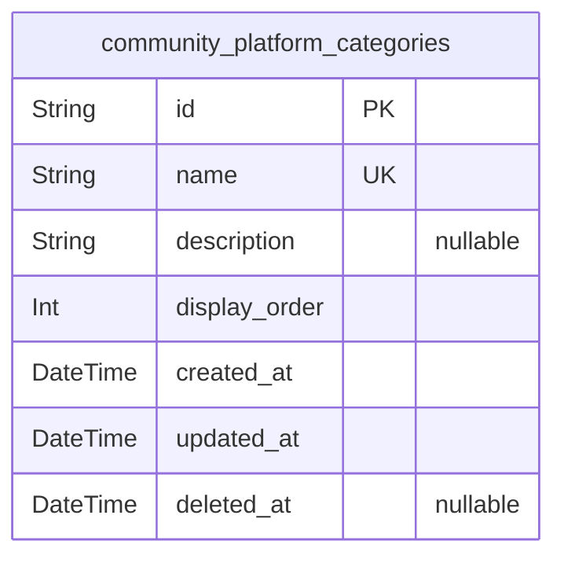
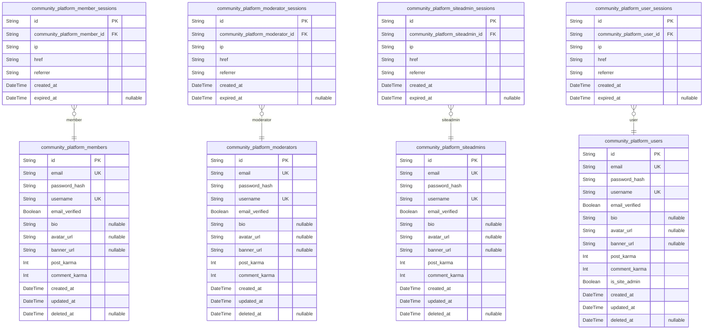
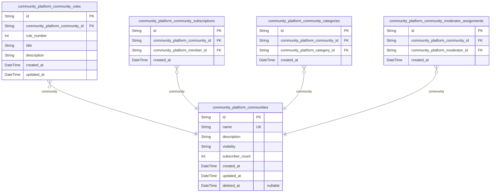
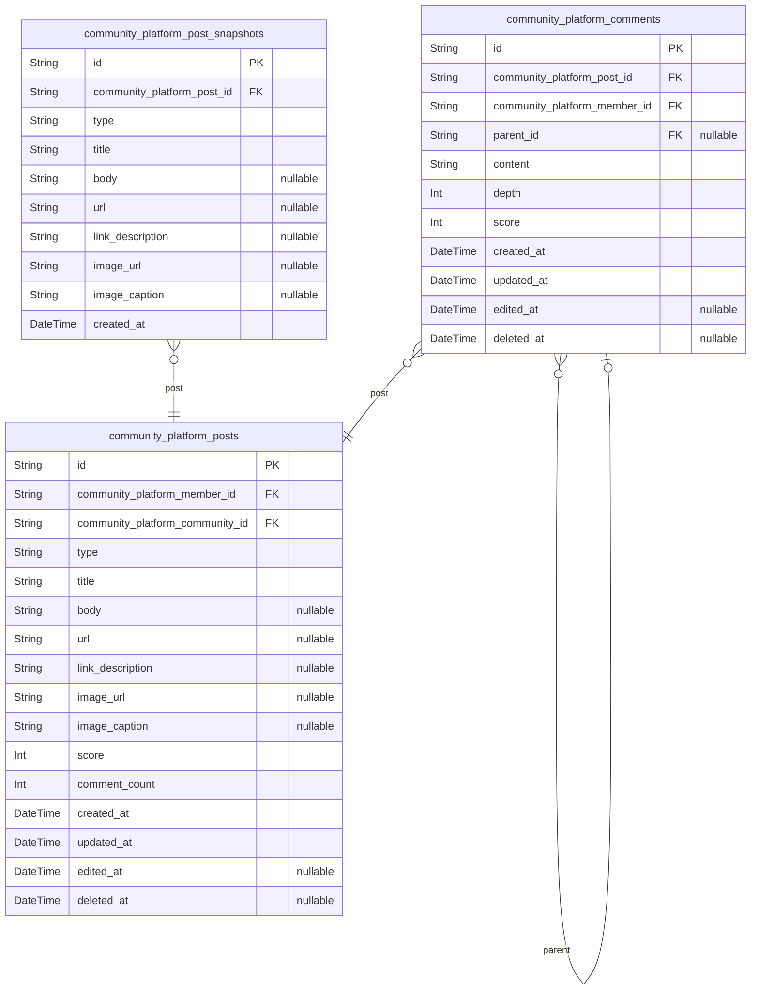
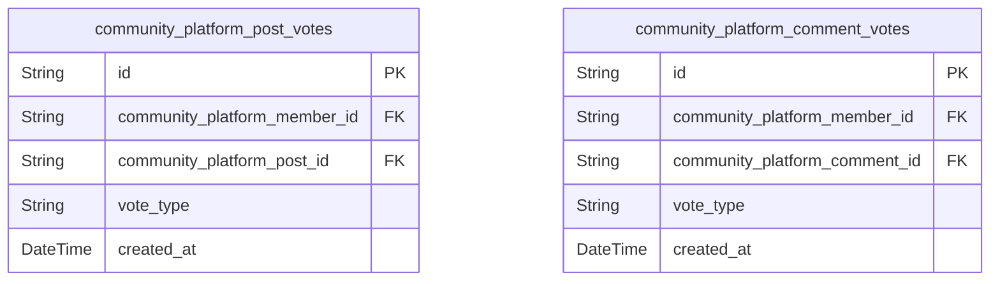
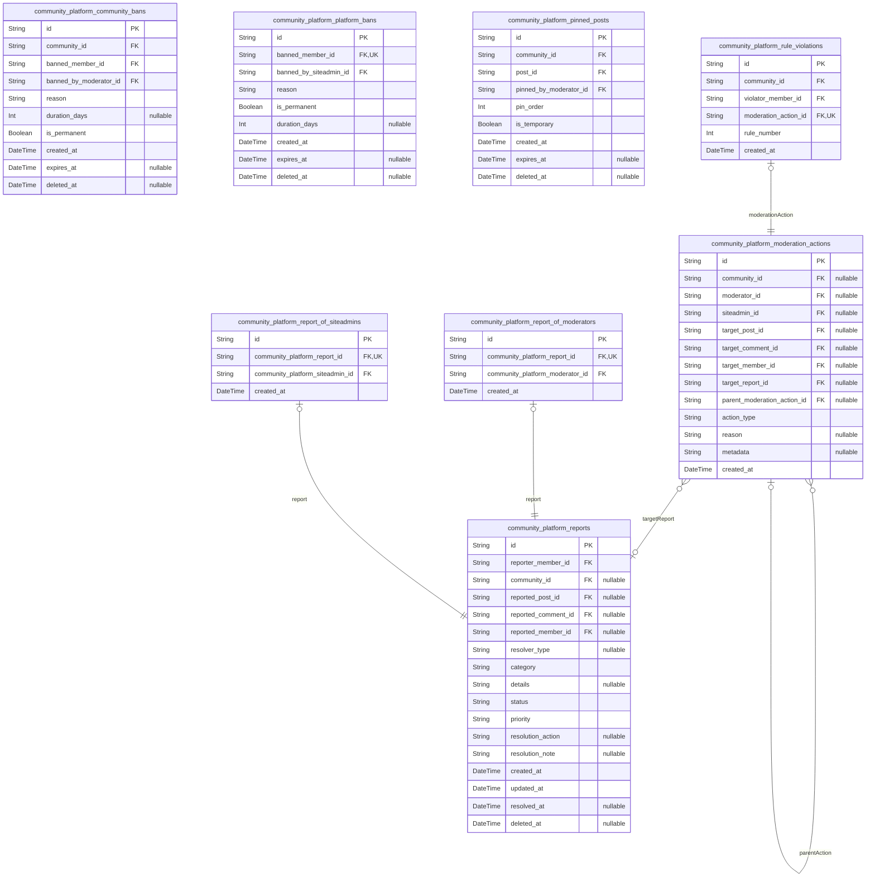
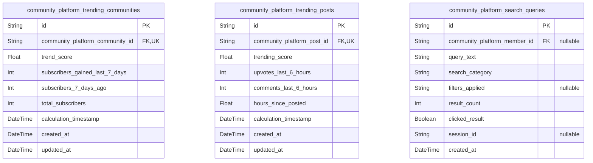

# Prisma Markdown

> Generated by [`prisma-markdown`](https://github.com/samchon/prisma-markdown)

- [Systematic](#systematic)
- [Actors](#actors)
- [Communities](#communities)
- [Content](#content)
- [Engagement](#engagement)
- [Moderation](#moderation)
- [Discovery](#discovery)

## Systematic

```mermaid
erDiagram
"community_platform_categories" {
  String id PK
  String name UK
  String description "nullable"
  Int display_order
  DateTime created_at
  DateTime updated_at
  DateTime deleted_at "nullable"
}
```

### `community_platform_categories`

System-level reference table defining predefined categories for
organizing and discovering communities. Categories enable users to filter
communities by topic areas such as Technology, Gaming, Sports, etc.
Managed by site administrators. Referenced by
community_platform_community_categories for community categorization.

Properties as follows:

- `id`: Primary Key.
- `name`
  > Category name displayed to users. Examples: Technology & Programming,
  > Gaming, Sports & Fitness, Entertainment & Media. Must be unique across
  > all categories.
- `description`
  > Detailed explanation of what types of communities belong in this
  > category. Helps administrators and users understand the category scope
  > and purpose.
- `display_order`
  > Integer controlling the presentation order of categories in UI elements
  > like dropdowns and filter lists. Lower numbers appear first. Allows
  > administrators to prioritize popular categories.
- `created_at`
  > Timestamp when this category was created. Used for audit trails and
  > tracking category system evolution.
- `updated_at`
  > Timestamp of the most recent update to this category. Updated whenever
  > name, description, or display_order changes.
- `deleted_at`
  > Soft delete timestamp. When set, the category is archived and hidden from
  > active use while preserving historical references in
  > community_platform_community_categories. Prevents breaking existing
  > community categorizations.

## Actors

```mermaid
erDiagram
"community_platform_members" {
  String id PK
  String email UK
  String password_hash
  String username UK
  Boolean email_verified
  String bio "nullable"
  String avatar_url "nullable"
  String banner_url "nullable"
  Int post_karma
  Int comment_karma
  DateTime created_at
  DateTime updated_at
  DateTime deleted_at "nullable"
}
"community_platform_member_sessions" {
  String id PK
  String community_platform_member_id FK
  String ip
  String href
  String referrer
  DateTime created_at
  DateTime expired_at "nullable"
}
"community_platform_moderators" {
  String id PK
  String email UK
  String password_hash
  String username UK
  Boolean email_verified
  String bio "nullable"
  String avatar_url "nullable"
  String banner_url "nullable"
  Int post_karma
  Int comment_karma
  DateTime created_at
  DateTime updated_at
  DateTime deleted_at "nullable"
}
"community_platform_moderator_sessions" {
  String id PK
  String community_platform_moderator_id FK
  String ip
  String href
  String referrer
  DateTime created_at
  DateTime expired_at "nullable"
}
"community_platform_siteadmins" {
  String id PK
  String email UK
  String password_hash
  String username UK
  Boolean email_verified
  String bio "nullable"
  String avatar_url "nullable"
  String banner_url "nullable"
  Int post_karma
  Int comment_karma
  DateTime created_at
  DateTime updated_at
  DateTime deleted_at "nullable"
}
"community_platform_siteadmin_sessions" {
  String id PK
  String community_platform_siteadmin_id FK
  String ip
  String href
  String referrer
  DateTime created_at
  DateTime expired_at "nullable"
}
"community_platform_users" {
  String id PK
  String email UK
  String password_hash
  String username UK
  Boolean email_verified
  String bio "nullable"
  String avatar_url "nullable"
  String banner_url "nullable"
  Int post_karma
  Int comment_karma
  Boolean is_site_admin
  DateTime created_at
  DateTime updated_at
  DateTime deleted_at "nullable"
}
"community_platform_user_sessions" {
  String id PK
  String community_platform_user_id FK
  String ip
  String href
  String referrer
  DateTime created_at
  DateTime expired_at "nullable"
}
"community_platform_member_sessions" }o--|| "community_platform_members" : member
"community_platform_moderator_sessions" }o--|| "community_platform_moderators" : moderator
"community_platform_siteadmin_sessions" }o--|| "community_platform_siteadmins" : siteadmin
"community_platform_user_sessions" }o--|| "community_platform_users" : user
```

### `community_platform_members`

Member accounts representing regular users of the community platform.
Members can create posts, comments, vote on content, subscribe to
communities, and earn karma based on community engagement. Each member
has authentication credentials and profile customization options.

Properties as follows:

- `id`: Primary Key.
- `email`
  > Email address for authentication and notifications. Must be unique across
  > all members.
- `password_hash`: Bcrypt hashed password for authentication. Never stored in plain text.
- `username`
  > Unique display name for the member. Used throughout the platform for
  > identification. Length 3-50 characters.
- `email_verified`
  > Whether the member has verified their email address. Unverified members
  > may have restricted access to certain features.
- `bio`
  > Optional self-description text written by the member. Maximum 500
  > characters. Displayed on member profile.
- `avatar_url`
  > URL to the member's profile picture. Uploaded images are stored
  > externally and referenced here.
- `banner_url`
  > URL to the member's profile banner image. Displayed at the top of their
  > profile page.
- `post_karma`
  > Karma points earned from upvotes on the member's posts. Can be negative
  > if posts receive more downvotes than upvotes.
- `comment_karma`
  > Karma points earned from upvotes on the member's comments. Can be
  > negative if comments receive more downvotes than upvotes.
- `created_at`
  > Timestamp when the member account was created. Used to calculate account
  > age.
- `updated_at`
  > Timestamp when the member account was last updated. Tracks profile
  > modifications.
- `deleted_at`
  > Timestamp when the member account was soft deleted. Null if account is
  > active. Soft delete preserves content history.

### `community_platform_member_sessions`

Authentication sessions for member accounts. Tracks active login sessions
with connection metadata for security audit trails. Multiple concurrent
sessions per member are supported.

Properties as follows:

- `id`: Primary Key.
- `community_platform_member_id`: Member who owns this session. [community_platform_members.id](#community_platform_members)
- `ip`
  > IP address from which the session was created. Used for security
  > monitoring and fraud detection.
- `href`
  > Full URL where the session connection was established. Tracks entry point
  > for analytics.
- `referrer`
  > HTTP referrer URL indicating where the user came from. Empty string if
  > direct navigation.
- `created_at`: Timestamp when the session was created. Session start time.
- `expired_at`
  > Timestamp when the session expired or was logged out. Null for active
  > sessions.

### `community_platform_moderators`

Moderator accounts with elevated permissions to manage specific
communities. Moderators can remove content, ban users from communities
they manage, review reports, and enforce community rules. Authentication
and profile features mirror member accounts.

Properties as follows:

- `id`: Primary Key.
- `email`
  > Email address for authentication and notifications. Must be unique across
  > all moderators.
- `password_hash`: Bcrypt hashed password for authentication. Never stored in plain text.
- `username`
  > Unique display name for the moderator. Used throughout the platform for
  > identification. Length 3-50 characters.
- `email_verified`
  > Whether the moderator has verified their email address. Unverified
  > moderators may have restricted access.
- `bio`
  > Optional self-description text written by the moderator. Maximum 500
  > characters.
- `avatar_url`: URL to the moderator's profile picture.
- `banner_url`: URL to the moderator's profile banner image.
- `post_karma`
  > Karma points earned from upvotes on the moderator's posts. Can be
  > negative.
- `comment_karma`
  > Karma points earned from upvotes on the moderator's comments. Can be
  > negative.
- `created_at`: Timestamp when the moderator account was created.
- `updated_at`: Timestamp when the moderator account was last updated.
- `deleted_at`
  > Timestamp when the moderator account was soft deleted. Null if account is
  > active.

### `community_platform_moderator_sessions`

Authentication sessions for moderator accounts. Tracks active login
sessions with connection metadata for security audit trails. Multiple
concurrent sessions per moderator are supported.

Properties as follows:

- `id`: Primary Key.
- `community_platform_moderator_id`: Moderator who owns this session. [community_platform_moderators.id](#community_platform_moderators)
- `ip`
  > IP address from which the session was created. Used for security
  > monitoring and fraud detection.
- `href`
  > Full URL where the session connection was established. Tracks entry point
  > for analytics.
- `referrer`
  > HTTP referrer URL indicating where the user came from. Empty string if
  > direct navigation.
- `created_at`: Timestamp when the session was created. Session start time.
- `expired_at`
  > Timestamp when the session expired or was logged out. Null for active
  > sessions.

### `community_platform_siteadmins`

Site administrator accounts with platform-wide elevated permissions. Site
admins can manage all communities, ban users platform-wide, delete
communities, remove any content, and handle escalated moderation issues.
Highest permission level on the platform.

Properties as follows:

- `id`: Primary Key.
- `email`
  > Email address for authentication and notifications. Must be unique across
  > all site admins.
- `password_hash`: Bcrypt hashed password for authentication. Never stored in plain text.
- `username`
  > Unique display name for the site admin. Used throughout the platform for
  > identification. Length 3-50 characters.
- `email_verified`: Whether the site admin has verified their email address.
- `bio`
  > Optional self-description text written by the site admin. Maximum 500
  > characters.
- `avatar_url`: URL to the site admin's profile picture.
- `banner_url`: URL to the site admin's profile banner image.
- `post_karma`
  > Karma points earned from upvotes on the site admin's posts. Can be
  > negative.
- `comment_karma`
  > Karma points earned from upvotes on the site admin's comments. Can be
  > negative.
- `created_at`: Timestamp when the site admin account was created.
- `updated_at`: Timestamp when the site admin account was last updated.
- `deleted_at`
  > Timestamp when the site admin account was soft deleted. Null if account
  > is active.

### `community_platform_siteadmin_sessions`

Authentication sessions for site administrator accounts. Tracks active
login sessions with connection metadata for security audit trails.
Multiple concurrent sessions per site admin are supported.

Properties as follows:

- `id`: Primary Key.
- `community_platform_siteadmin_id`: Site admin who owns this session. [community_platform_siteadmins.id](#community_platform_siteadmins)
- `ip`
  > IP address from which the session was created. Used for security
  > monitoring and fraud detection.
- `href`
  > Full URL where the session connection was established. Tracks entry point
  > for analytics.
- `referrer`
  > HTTP referrer URL indicating where the user came from. Empty string if
  > direct navigation.
- `created_at`: Timestamp when the session was created. Session start time.
- `expired_at`
  > Timestamp when the session expired or was logged out. Null for active
  > sessions.

### `community_platform_users`

Unified user accounts representing all platform users (members,
moderators, and site administrators). Users authenticate via email and
password, can customize profiles with avatars and bios, earn karma from
community engagement, and have role-based permissions. Moderator
permissions are community-specific through
community_platform_community_moderator_assignments. Site admin
permissions are platform-wide via is_site_admin flag.

Properties as follows:

- `id`: Primary Key.
- `email`
  > Email address for authentication and notifications. Must be unique across
  > all users. Used as primary authentication identifier.
- `password_hash`
  > Bcrypt hashed password with cost factor of at least 12. Never stored in
  > plain text. Used for authentication during login.
- `username`
  > Unique display name for the user. Used throughout the platform for
  > identification. Length 3-50 characters. Alphanumeric characters,
  > underscores, and hyphens only.
- `email_verified`
  > Whether the user has verified their email address through verification
  > link. Unverified users may have restricted access to features like
  > posting or community creation.
- `bio`
  > Optional self-description text written by the user. Maximum 500
  > characters. Supports line breaks. Displayed on user profile page.
- `avatar_url`
  > URL to the user's profile picture. Images uploaded by users are stored
  > externally (CDN or file storage) and referenced here. Maximum file size
  > 5MB, recommended 256x256 pixels.
- `banner_url`
  > URL to the user's profile banner image displayed at the top of their
  > profile page. Maximum file size 10MB, recommended 1920x384 pixels (5:1
  > aspect ratio).
- `post_karma`
  > Karma points earned from votes on the user's posts. Calculated as sum of
  > (upvotes - downvotes) across all posts. Can be negative if posts receive
  > more downvotes than upvotes. Updated when post votes change.
- `comment_karma`
  > Karma points earned from votes on the user's comments. Calculated as sum
  > of (upvotes - downvotes) across all comments. Can be negative if comments
  > receive more downvotes than upvotes. Updated when comment votes change.
- `is_site_admin`
  > Whether this user has platform-wide site administrator permissions. Site
  > admins can moderate all communities, ban users platform-wide, delete
  > communities, and access admin dashboards. Default false for regular
  > users.
- `created_at`
  > Timestamp when the user account was created during registration. Used to
  > calculate and display account age (e.g., 'Member for 2 years').
- `updated_at`
  > Timestamp when the user account was last updated. Updated whenever
  > profile information (bio, avatar, banner) or account settings change.
- `deleted_at`
  > Soft delete timestamp. When set, the account is deactivated and the user
  > cannot log in. Null for active accounts. Soft delete preserves content
  > history and karma while preventing access.

### `community_platform_user_sessions`

Authentication sessions for user accounts. Tracks active login sessions
with connection metadata (IP address, entry URL, referrer) for security
audit trails and fraud detection. Supports multiple concurrent sessions
per user across different devices. Sessions expire after 30 days (refresh
token lifetime) or when user logs out.

Properties as follows:

- `id`: Primary Key.
- `community_platform_user_id`
  > User who owns this authentication session. {@link
  > community_platform_users.id}
- `ip`
  > IP address from which the session was created. Used for security
  > monitoring, fraud detection, and identifying suspicious login patterns.
- `href`
  > Full URL where the session connection was established. Tracks entry point
  > for analytics and helps identify referral sources.
- `referrer`
  > HTTP referrer URL indicating where the user came from before
  > authentication. Empty string if direct navigation. Used for marketing
  > attribution.
- `created_at`
  > Timestamp when the session was created during login. Represents session
  > start time and is used for session age calculations.
- `expired_at`
  > Timestamp when the session expired or user logged out. Null for currently
  > active sessions. Used for session cleanup and security audit.

## Communities

```mermaid
erDiagram
"community_platform_communities" {
  String id PK
  String name UK
  String description
  String visibility
  Int subscriber_count
  DateTime created_at
  DateTime updated_at
  DateTime deleted_at "nullable"
}
"community_platform_community_rules" {
  String id PK
  String community_platform_community_id FK
  Int rule_number
  String title
  String description
  DateTime created_at
  DateTime updated_at
}
"community_platform_community_subscriptions" {
  String id PK
  String community_platform_community_id FK
  String community_platform_member_id FK
  DateTime created_at
}
"community_platform_community_categories" {
  String id PK
  String community_platform_community_id FK
  String community_platform_category_id FK
  DateTime created_at
}
"community_platform_community_moderator_assignments" {
  String id PK
  String community_platform_community_id FK
  String community_platform_moderator_id FK
  DateTime created_at
}
"community_platform_community_rules" }o--|| "community_platform_communities" : community
"community_platform_community_subscriptions" }o--|| "community_platform_communities" : community
"community_platform_community_categories" }o--|| "community_platform_communities" : community
"community_platform_community_moderator_assignments" }o--|| "community_platform_communities" : community
```

### `community_platform_communities`

Core community entity representing topic-based communities (similar to
subreddits). Communities are the fundamental organizational structure
where users create posts, engage in discussions, and build focused
interest groups. Each community has its own rules, moderators, and
subscriber base. Communities can be public (visible to all) or private
(requiring membership approval).

Properties as follows:

- `id`: Primary Key.
- `name`
  > Unique community name displayed to users. Must be between 3 and 50
  > characters, using letters, numbers, spaces, hyphens, and underscores
  > only. This is the human-readable identifier for the community.
- `description`
  > Community description explaining the purpose and topic of the community.
  > Must be between 20 and 500 characters. This helps users understand what
  > the community is about and whether they want to join.
- `visibility`
  > Community visibility status. Values: 'public' (visible to all users,
  > anyone can subscribe) or 'private' (requires membership approval, only
  > members can view content). Determines access control for the community.
- `subscriber_count`
  > Total number of members subscribed to this community. This count is
  > incremented when users subscribe and decremented when they unsubscribe.
  > Used for displaying community popularity and for trending calculations.
- `created_at`
  > Timestamp when the community was created. Used for displaying community
  > age and for sorting communities by creation date.
- `updated_at`
  > Timestamp when the community was last updated. Updated whenever community
  > settings, description, or other metadata changes.
- `deleted_at`
  > Timestamp when the community was soft-deleted by site administrators.
  > Null if the community is active. Soft deletion preserves community data
  > for audit purposes while hiding it from public view.

### `community_platform_community_rules`

Community-specific rules that members must follow when participating in a
community. Each community can define up to 10 rules with titles and
descriptions. Rules are numbered and displayed to users when creating
posts or reporting content. Moderators use these rules to enforce
community standards and explain content removal decisions.

Properties as follows:

- `id`: Primary Key.
- `community_platform_community_id`: Community that owns this rule. [community_platform_communities.id](#community_platform_communities).
- `rule_number`
  > Sequential rule number determining display order (1, 2, 3, etc.). Rules
  > are shown to users in ascending order. Moderators can reorder rules by
  > changing these numbers.
- `title`
  > Rule title summarizing the rule in 3-50 characters. Examples: 'Be
  > respectful', 'No spam', 'Stay on topic'. Displayed prominently in rule
  > lists.
- `description`
  > Detailed rule description explaining what the rule means and how it is
  > enforced. Must be between 10 and 200 characters. Provides context and
  > examples for users to understand community expectations.
- `created_at`: Timestamp when this rule was created by moderators.
- `updated_at`: Timestamp when this rule was last modified by moderators.

### `community_platform_community_subscriptions`

Junction table tracking member subscriptions to communities. When a
member subscribes to a community, a record is created linking the member
to the community. Subscriptions determine which community posts appear in
a member's personalized home feed. Members can subscribe to unlimited
communities.

Properties as follows:

- `id`: Primary Key.
- `community_platform_community_id`: Community being subscribed to. [community_platform_communities.id](#community_platform_communities).
- `community_platform_member_id`
  > Member who subscribed to the community. {@link
  > community_platform_members.id}.
- `created_at`
  > Timestamp when the member subscribed to this community. Used for
  > displaying subscription history and for sorting user's subscribed
  > communities by recency.

### `community_platform_community_categories`

Junction table linking communities to platform-wide categories.
Communities can be assigned up to 5 categories to help with discovery and
search. Categories like 'Technology', 'Gaming', 'Sports' help users find
communities matching their interests. This many-to-many relationship
allows flexible categorization.

Properties as follows:

- `id`: Primary Key.
- `community_platform_community_id`: Community being categorized. [community_platform_communities.id](#community_platform_communities).
- `community_platform_category_id`
  > Category assigned to the community. {@link
  > community_platform_categories.id}.
- `created_at`: Timestamp when this category was assigned to the community by moderators.

### `community_platform_community_moderator_assignments`

Junction table tracking moderator assignments to communities. When a
moderator is assigned to manage a community, a record is created granting
them moderation permissions for that specific community. Moderators can
manage multiple communities, and communities can have multiple
moderators. The community creator is automatically assigned as the first
moderator.

Properties as follows:

- `id`: Primary Key.
- `community_platform_community_id`: Community being moderated. [community_platform_communities.id](#community_platform_communities).
- `community_platform_moderator_id`
  > Moderator assigned to manage this community. {@link
  > community_platform_moderators.id}.
- `created_at`
  > Timestamp when this moderator was assigned to the community. Used for
  > tracking moderator seniority and assignment history.

## Content

```mermaid
erDiagram
"community_platform_posts" {
  String id PK
  String community_platform_member_id FK
  String community_platform_community_id FK
  String type
  String title
  String body "nullable"
  String url "nullable"
  String link_description "nullable"
  String image_url "nullable"
  String image_caption "nullable"
  Int score
  Int comment_count
  DateTime created_at
  DateTime updated_at
  DateTime edited_at "nullable"
  DateTime deleted_at "nullable"
}
"community_platform_post_snapshots" {
  String id PK
  String community_platform_post_id FK
  String type
  String title
  String body "nullable"
  String url "nullable"
  String link_description "nullable"
  String image_url "nullable"
  String image_caption "nullable"
  DateTime created_at
}
"community_platform_comments" {
  String id PK
  String community_platform_post_id FK
  String community_platform_member_id FK
  String parent_id FK "nullable"
  String content
  Int depth
  Int score
  DateTime created_at
  DateTime updated_at
  DateTime edited_at "nullable"
  DateTime deleted_at "nullable"
}
"community_platform_post_snapshots" }o--|| "community_platform_posts" : post
"community_platform_comments" }o--|| "community_platform_posts" : post
"community_platform_comments" }o--o| "community_platform_comments" : parent
```

### `community_platform_posts`

User-generated posts within communities. Supports three post types: text
posts with body content, link posts with URLs, and image posts with
uploaded images. Posts can be edited within 24 hours of creation and
deleted by authors or moderators. Voting and karma tracking handled
through [community_platform_post_votes](#community_platform_post_votes).

Properties as follows:

- `id`: Primary Key.
- `community_platform_member_id`: Post author's [community_platform_members.id](#community_platform_members).
- `community_platform_community_id`
  > Community where post was created {@link
  > community_platform_communities.id}.
- `type`: Post type discriminator: 'text', 'link', or 'image'.
- `title`: Post title, required for all post types. Length: 5-300 characters.
- `body`
  > Text content for text posts. Maximum 40,000 characters. Null for link and
  > image posts.
- `url`
  > External URL for link posts. Must be valid HTTP/HTTPS URL. Null for text
  > and image posts.
- `link_description`
  > Optional description for link posts. Maximum 2,000 characters. Null for
  > text and image posts.
- `image_url`: Uploaded image URL for image posts. Null for text and link posts.
- `image_caption`
  > Optional caption for image posts. Maximum 2,000 characters. Null for text
  > and link posts.
- `score`
  > Net vote score (upvotes minus downvotes). Calculated from {@link
  > community_platform_post_votes}.
- `comment_count`
  > Total number of comments on this post. Updated when comments are created
  > or deleted.
- `created_at`: Timestamp when post was created.
- `updated_at`: Timestamp when post was last modified (content updates).
- `edited_at`
  > Timestamp of last edit. Null if never edited. Edits allowed within 24
  > hours of creation.
- `deleted_at`
  > Soft delete timestamp. When set, post is hidden from public view but
  > preserved for audit.

### `community_platform_post_snapshots`

Historical snapshots of post content capturing state at each edit.
Created whenever a post is edited to maintain audit trail and version
history. Snapshots are immutable and preserve exact post state including
all content fields.

Properties as follows:

- `id`: Primary Key.
- `community_platform_post_id`
  > Original post [community_platform_posts.id](#community_platform_posts) this snapshot belongs
  > to.
- `type`: Post type at snapshot time: 'text', 'link', or 'image'.
- `title`: Post title at snapshot time.
- `body`
  > Text content at snapshot time for text posts. Null for link and image
  > posts.
- `url`: URL at snapshot time for link posts. Null for text and image posts.
- `link_description`: Link description at snapshot time. Null for text and image posts.
- `image_url`: Image URL at snapshot time for image posts. Null for text and link posts.
- `image_caption`: Image caption at snapshot time. Null for text and link posts.
- `created_at`: Timestamp when this snapshot was created (when the edit occurred).

### `community_platform_comments`

User comments on posts with support for nested threading up to 10 levels
deep. Comments can be edited within 15 minutes of creation and deleted by
authors or moderators. When deleted, childless comments are removed
completely, but comments with replies show [deleted] placeholder while
preserving thread structure. Voting and karma tracking handled through
[community_platform_comment_votes](#community_platform_comment_votes).

Properties as follows:

- `id`: Primary Key.
- `community_platform_post_id`: Post [community_platform_posts.id](#community_platform_posts) this comment belongs to.
- `community_platform_member_id`: Comment author's [community_platform_members.id](#community_platform_members).
- `parent_id`
  > Parent comment [community_platform_comments.id](#community_platform_comments) for nested replies.
  > Null for top-level comments directly on the post.
- `content`
  > Comment text content. Minimum 1 character, maximum 10,000 characters.
  > Supports markdown formatting.
- `depth`
  > Nesting depth in thread. 0 for top-level comments, increments by 1 for
  > each reply level. Maximum depth 10.
- `score`
  > Net vote score (upvotes minus downvotes). Calculated from {@link
  > community_platform_comment_votes}.
- `created_at`: Timestamp when comment was created.
- `updated_at`: Timestamp when comment was last modified.
- `edited_at`
  > Timestamp of last edit. Null if never edited. Edits allowed within 15
  > minutes of creation.
- `deleted_at`
  > Soft delete timestamp. When set, comment content is hidden but structure
  > preserved if comment has replies.

## Engagement

```mermaid
erDiagram
"community_platform_post_votes" {
  String id PK
  String community_platform_member_id FK
  String community_platform_post_id FK
  String vote_type
  DateTime created_at
}
"community_platform_comment_votes" {
  String id PK
  String community_platform_member_id FK
  String community_platform_comment_id FK
  String vote_type
  DateTime created_at
}
```

### `community_platform_post_votes`

Vote records for posts, tracking member upvotes and downvotes. Each
member can cast one vote (upvote or downvote) per post. Votes contribute
to post scoring and member karma calculations. Vote changes are handled
by deleting the old vote and creating a new one.

Properties as follows:

- `id`: Primary Key.
- `community_platform_member_id`: Member who cast this vote. [community_platform_members.id](#community_platform_members).
- `community_platform_post_id`: Post that received this vote. [community_platform_posts.id](#community_platform_posts).
- `vote_type`
  > Type of vote cast: 'upvote' for positive vote or 'downvote' for negative
  > vote. Used to calculate post score and member karma.
- `created_at`
  > Timestamp when the vote was cast. Used for vote velocity calculations in
  > trending algorithms and karma tracking.

### `community_platform_comment_votes`

Vote records for comments, tracking member upvotes and downvotes. Each
member can cast one vote (upvote or downvote) per comment. Votes
contribute to comment scoring and member karma calculations. Vote changes
are handled by deleting the old vote and creating a new one.

Properties as follows:

- `id`: Primary Key.
- `community_platform_member_id`: Member who cast this vote. [community_platform_members.id](#community_platform_members).
- `community_platform_comment_id`: Comment that received this vote. [community_platform_comments.id](#community_platform_comments).
- `vote_type`
  > Type of vote cast: 'upvote' for positive vote or 'downvote' for negative
  > vote. Used to calculate comment score and member karma.
- `created_at`
  > Timestamp when the vote was cast. Used for vote velocity calculations in
  > trending algorithms and karma tracking.

## Moderation

```mermaid
erDiagram
"community_platform_reports" {
  String id PK
  String reporter_member_id FK
  String community_id FK "nullable"
  String reported_post_id FK "nullable"
  String reported_comment_id FK "nullable"
  String reported_member_id FK "nullable"
  String resolver_type "nullable"
  String category
  String details "nullable"
  String status
  String priority
  String resolution_action "nullable"
  String resolution_note "nullable"
  DateTime created_at
  DateTime updated_at
  DateTime resolved_at "nullable"
  DateTime deleted_at "nullable"
}
"community_platform_community_bans" {
  String id PK
  String community_id FK
  String banned_member_id FK
  String banned_by_moderator_id FK
  String reason
  Int duration_days "nullable"
  Boolean is_permanent
  DateTime created_at
  DateTime expires_at "nullable"
  DateTime deleted_at "nullable"
}
"community_platform_platform_bans" {
  String id PK
  String banned_member_id FK,UK
  String banned_by_siteadmin_id FK
  String reason
  Boolean is_permanent
  Int duration_days "nullable"
  DateTime created_at
  DateTime expires_at "nullable"
  DateTime deleted_at "nullable"
}
"community_platform_moderation_actions" {
  String id PK
  String community_id FK "nullable"
  String moderator_id FK "nullable"
  String siteadmin_id FK "nullable"
  String target_post_id FK "nullable"
  String target_comment_id FK "nullable"
  String target_member_id FK "nullable"
  String target_report_id FK "nullable"
  String parent_moderation_action_id FK "nullable"
  String action_type
  String reason "nullable"
  String metadata "nullable"
  DateTime created_at
}
"community_platform_pinned_posts" {
  String id PK
  String community_id FK
  String post_id FK
  String pinned_by_moderator_id FK
  Int pin_order
  Boolean is_temporary
  DateTime created_at
  DateTime expires_at "nullable"
  DateTime deleted_at "nullable"
}
"community_platform_report_of_moderators" {
  String id PK
  String community_platform_report_id FK,UK
  String community_platform_moderator_id FK
  DateTime created_at
}
"community_platform_report_of_siteadmins" {
  String id PK
  String community_platform_report_id FK,UK
  String community_platform_siteadmin_id FK
  DateTime created_at
}
"community_platform_rule_violations" {
  String id PK
  String community_id FK
  String violator_member_id FK
  String moderation_action_id FK,UK
  Int rule_number
  DateTime created_at
}
"community_platform_moderation_actions" }o--o| "community_platform_reports" : targetReport
"community_platform_moderation_actions" }o--o| "community_platform_moderation_actions" : parentAction
"community_platform_report_of_moderators" |o--|| "community_platform_reports" : report
"community_platform_report_of_siteadmins" |o--|| "community_platform_reports" : report
"community_platform_rule_violations" |o--|| "community_platform_moderation_actions" : moderationAction
```

### `community_platform_reports`

Content and user violation reports submitted by members. Supports
polymorphic reporting of posts, comments, or user accounts. Reports are
routed to community moderators or site administrators based on severity
and type. Tracks report status through lifecycle from submission to
resolution. Report resolution handled through separate subtype tables
(community_platform_report_of_moderators and
community_platform_report_of_siteadmins) to maintain referential
integrity.

Properties as follows:

- `id`: Primary Key.
- `reporter_member_id`: Member who submitted the report. [community_platform_members.id](#community_platform_members).
- `community_id`
  > Community context where reported content exists. Nullable for user
  > account reports. [community_platform_communities.id](#community_platform_communities).
- `reported_post_id`
  > Post being reported. Nullable - only populated for post reports. {@link
  > community_platform_posts.id}.
- `reported_comment_id`
  > Comment being reported. Nullable - only populated for comment reports.
  > [community_platform_comments.id](#community_platform_comments).
- `reported_member_id`
  > Member being reported. Nullable - only populated for user account
  > reports. [community_platform_members.id](#community_platform_members).
- `resolver_type`
  > Type of actor who resolved the report. Valid values: 'moderator',
  > 'siteadmin'. Used with Compatible Actor Pattern for polymorphic
  > resolution tracking. Nullable until report is resolved.
- `category`
  > Report category. Valid values: 'spam', 'harassment', 'inappropriate',
  > 'misinformation', 'illegal', 'rule_violation', 'other'. Used for report
  > routing and prioritization.
- `details`
  > Additional context provided by reporter. Maximum 1000 characters.
  > Optional explanation of why content is being reported.
- `status`
  > Report status. Valid values: 'pending', 'resolved', 'dismissed'. Tracks
  > report lifecycle through moderation process.
- `priority`
  > Report priority. Valid values: 'high' (illegal/harassment categories),
  > 'standard' (other categories). Used for queue prioritization.
- `resolution_action`
  > Action taken on resolution. Valid values: 'dismissed', 'content_removed',
  > 'user_banned', 'escalated'. Nullable until resolved.
- `resolution_note`
  > Note explaining resolution decision. Required when dismissing reports
  > with 3+ reporters for transparency. Nullable until resolved.
- `created_at`
  > Timestamp when report was submitted. Used for queue ordering and response
  > time tracking.
- `updated_at`
  > Timestamp of last status update. Tracks when report moved from pending to
  > resolved/dismissed.
- `resolved_at`
  > Timestamp when report was resolved or dismissed. Nullable until
  > resolution. Used for calculating moderation response times.
- `deleted_at`
  > Soft delete timestamp for report cleanup and archival. Preserves
  > historical report data while removing from active queues.

### `community_platform_community_bans`

Community-scoped user bans issued by community moderators. Prevents
banned members from posting, commenting, or voting in specific
communities. Supports temporary bans with expiration dates and permanent
bans. Soft delete pattern used for unbanning.

Properties as follows:

- `id`: Primary Key.
- `community_id`
  > Community where member is banned. {@link
  > community_platform_communities.id}.
- `banned_member_id`
  > Member who is banned from the community. {@link
  > community_platform_members.id}.
- `banned_by_moderator_id`: Moderator who issued the ban. [community_platform_moderators.id](#community_platform_moderators).
- `reason`: Explanation for why member was banned.
- `duration_days`: Ban duration in days for temporary bans. Null for permanent bans.
- `is_permanent`: Whether this is a permanent ban.
- `created_at`: Timestamp when ban was issued.
- `expires_at`: Expiration timestamp for temporary bans. Null for permanent bans.
- `deleted_at`: Soft delete timestamp representing unbanning.

### `community_platform_platform_bans`

Platform-wide user bans issued by site administrators. Prevents banned
members from accessing any platform functionality. Supports temporary and
permanent bans. Only one active platform ban per member allowed. Soft
delete pattern used for unbanning.

Properties as follows:

- `id`: Primary Key.
- `banned_member_id`
  > Member who is banned from the entire platform. {@link
  > community_platform_members.id}.
- `banned_by_siteadmin_id`
  > Site administrator who issued the platform ban. {@link
  > community_platform_siteadmins.id}.
- `reason`: Explanation for platform-wide ban.
- `is_permanent`: Whether this is a permanent platform ban.
- `duration_days`: Ban duration in days for temporary bans. Null for permanent bans.
- `created_at`: Timestamp when platform ban was issued.
- `expires_at`: Expiration timestamp for temporary bans. Null for permanent bans.
- `deleted_at`: Soft delete timestamp representing unbanning from platform.

### `community_platform_moderation_actions`

Immutable audit log of all moderation actions taken by moderators and
site administrators. Provides complete transparency and accountability
trail for content removal, user bans, report handling, and post pinning.
Append-only table preserving historical moderation decisions. Supports
action relationships for tracking appeals and escalations.

Properties as follows:

- `id`: Primary Key.
- `community_id`
  > Community context for moderation action. Null for platform-wide actions.
  > [community_platform_communities.id](#community_platform_communities).
- `moderator_id`
  > Moderator who performed the action. Null for admin actions. {@link
  > community_platform_moderators.id}.
- `siteadmin_id`
  > Site administrator who performed the action. Null for moderator actions.
  > [community_platform_siteadmins.id](#community_platform_siteadmins).
- `target_post_id`
  > Post targeted by moderation action. Nullable. {@link
  > community_platform_posts.id}.
- `target_comment_id`
  > Comment targeted by moderation action. Nullable. {@link
  > community_platform_comments.id}.
- `target_member_id`
  > Member targeted by moderation action (bans). Nullable. {@link
  > community_platform_members.id}.
- `target_report_id`
  > Report being processed by moderation action. Nullable. {@link
  > community_platform_reports.id}.
- `parent_moderation_action_id`
  > Parent moderation action this action is related to. Used for tracking
  > appeals that overturn previous decisions or escalations that follow up on
  > earlier actions. Null for original actions. {@link
  > community_platform_moderation_actions.id}.
- `action_type`
  > Type of moderation action. Valid values: 'remove_post', 'remove_comment',
  > 'ban_user', 'unban_user', 'pin_post', 'unpin_post', 'dismiss_report',
  > 'escalate_report', 'restore_content', 'appeal_approved', 'appeal_denied'.
  > Indicates what action was taken.
- `reason`
  > Explanation for the moderation action. Provides context for why action
  > was taken and helps with transparency and appeals.
- `metadata`
  > JSON-encoded additional context for the action. May include escalation
  > details, appeal information, or other structured data specific to action
  > type.
- `created_at`
  > Timestamp when moderation action was taken. Immutable audit trail
  > timestamp.

### `community_platform_pinned_posts`

Tracks posts pinned to the top of community feeds by moderators. Maximum
2 pinned posts per community. Supports temporary pins with expiration
dates. Soft delete pattern used for unpinning. Pin order determines
display sequence.

Properties as follows:

- `id`: Primary Key.
- `community_id`: Community where post is pinned. [community_platform_communities.id](#community_platform_communities).
- `post_id`: Post being pinned to community top. [community_platform_posts.id](#community_platform_posts).
- `pinned_by_moderator_id`: Moderator who pinned the post. [community_platform_moderators.id](#community_platform_moderators).
- `pin_order`: Display order for pinned post. Values 1 or 2 for maximum 2 pins.
- `is_temporary`: Whether pin has expiration date.
- `created_at`: Timestamp when post was pinned.
- `expires_at`: Expiration timestamp for temporary pins. Null for permanent pins.
- `deleted_at`: Soft delete timestamp representing unpinning.

### `community_platform_report_of_moderators`

Subtype table tracking reports resolved by community moderators. Part of
Compatible Actor Pattern for polymorphic report resolution. Maintains 1:1
relationship with community_platform_reports when resolver_type is
'moderator'. Ensures referential integrity for moderator resolution
tracking.

Properties as follows:

- `id`: Primary Key.
- `community_platform_report_id`: Report resolved by moderator. [community_platform_reports.id](#community_platform_reports).
- `community_platform_moderator_id`
  > Moderator who resolved this report. {@link
  > community_platform_moderators.id}.
- `created_at`
  > Timestamp when moderator resolved the report. Matches parent report's
  > resolved_at timestamp.

### `community_platform_report_of_siteadmins`

Subtype table tracking reports resolved by site administrators. Part of
Compatible Actor Pattern for polymorphic report resolution. Maintains 1:1
relationship with community_platform_reports when resolver_type is
'siteadmin'. Ensures referential integrity for site admin resolution
tracking.

Properties as follows:

- `id`: Primary Key.
- `community_platform_report_id`
  > Report resolved by site administrator. {@link
  > community_platform_reports.id}.
- `community_platform_siteadmin_id`
  > Site administrator who resolved this report. {@link
  > community_platform_siteadmins.id}.
- `created_at`
  > Timestamp when site admin resolved the report. Matches parent report's
  > resolved_at timestamp.

### `community_platform_rule_violations`

Tracks rule violations for each user within each community. Enables
moderators to identify repeat offenders and track violation patterns.
Each record links a content removal action to the specific community rule
that was violated. This subsidiary table supports the requirement to
track rule violation frequency per user per community.

Properties as follows:

- `id`: Primary Key.
- `community_id`
  > Community where the rule was violated. {@link
  > community_platform_communities.id}.
- `violator_member_id`
  > Member who violated the community rule. {@link
  > community_platform_members.id}.
- `moderation_action_id`
  > Moderation action that recorded this violation (content removal action).
  > [community_platform_moderation_actions.id](#community_platform_moderation_actions).
- `rule_number`
  > Community rule number that was violated (1-10). References the
  > rule_number from community_platform_community_rules. Used to track which
  > rules are violated most frequently.
- `created_at`
  > Timestamp when the violation was recorded. Matches the moderation action
  > timestamp.

## Discovery

```mermaid
erDiagram
"community_platform_trending_communities" {
  String id PK
  String community_platform_community_id FK,UK
  Float trend_score
  Int subscribers_gained_last_7_days
  Int subscribers_7_days_ago
  Int total_subscribers
  DateTime calculation_timestamp
  DateTime created_at
  DateTime updated_at
}
"community_platform_trending_posts" {
  String id PK
  String community_platform_post_id FK,UK
  Float trending_score
  Int upvotes_last_6_hours
  Int comments_last_6_hours
  Float hours_since_posted
  DateTime calculation_timestamp
  DateTime created_at
  DateTime updated_at
}
"community_platform_search_queries" {
  String id PK
  String community_platform_member_id FK "nullable"
  String query_text
  String search_category
  String filters_applied "nullable"
  Int result_count
  Boolean clicked_result
  String session_id "nullable"
  DateTime created_at
}
```

### `community_platform_trending_communities`

Trending communities calculated periodically based on subscriber growth
rate and activity metrics. This subsidiary table stores pre-calculated
trending scores to optimize discovery performance. Trending data is
recalculated every 6 hours as specified in requirements.

Properties as follows:

- `id`: Primary Key.
- `community_platform_community_id`
  > Reference to the trending community. {@link
  > community_platform_communities.id}
- `trend_score`
  > Calculated trending score based on subscriber growth rate. Formula:
  > (subscribers_gained_last_7_days / subscribers_7_days_ago) × 100. Higher
  > scores indicate faster growth.
- `subscribers_gained_last_7_days`
  > Number of new subscribers in the past 7 days. Used for trending
  > calculation and display.
- `subscribers_7_days_ago`
  > Total subscriber count as of 7 days ago. Used in trend_score formula
  > denominator to calculate growth rate percentage. Essential for accurate
  > trending calculation verification.
- `total_subscribers`
  > Total subscriber count at the time of trending calculation. Cached for
  > performance and display purposes.
- `calculation_timestamp`
  > Timestamp when the trending score was calculated. Updated every 6 hours
  > according to trending refresh schedule.
- `created_at`: Timestamp when this trending entry was first created.
- `updated_at`: Timestamp when this trending entry was last updated with new scores.

### `community_platform_trending_posts`

Trending posts calculated periodically based on engagement velocity
metrics including upvotes and comments received in the past 6 hours. This
subsidiary table stores pre-calculated trending scores to optimize the
Popular feed performance. Trending data is recalculated every 30 minutes
as specified in requirements.

Properties as follows:

- `id`: Primary Key.
- `community_platform_post_id`: Reference to the trending post. [community_platform_posts.id](#community_platform_posts)
- `trending_score`
  > Calculated trending score using formula: (upvotes_last_6_hours × 1.5 +
  > comments_last_6_hours × 2.0) / (hours_since_posted + 2). Higher scores
  > indicate more rapid engagement.
- `upvotes_last_6_hours`
  > Number of upvotes received in the past 6 hours. Used for trending
  > calculation.
- `comments_last_6_hours`
  > Number of comments received in the past 6 hours. Used for trending
  > calculation with higher weight than upvotes.
- `hours_since_posted`
  > Hours elapsed since post creation at time of calculation. Used in
  > trending score formula to favor recent posts.
- `calculation_timestamp`
  > Timestamp when the trending score was calculated. Updated every 30
  > minutes according to trending post refresh schedule.
- `created_at`: Timestamp when this trending entry was first created.
- `updated_at`: Timestamp when this trending entry was last updated with new scores.

### `community_platform_search_queries`

Search query history tracking all searches performed by members across
communities, posts, and users. This subsidiary table logs search queries
for analytics, improvement, and autocomplete suggestion generation.
Search logs are anonymized after 90 days by removing user identifiers
while retaining query patterns.

Properties as follows:

- `id`: Primary Key.
- `community_platform_member_id`
  > Reference to the member who performed the search. {@link
  > community_platform_members.id}. Set to null after 90 days for
  > anonymization.
- `query_text`
  > The search query text entered by the user. Normalized to lowercase with
  > trimmed whitespace. Maximum 200 characters as per search validation
  > requirements.
- `search_category`
  > Search category indicating what entity type was searched. Valid values:
  > 'all', 'communities', 'posts', 'users'. Indicates which search interface
  > was used.
- `filters_applied`
  > JSON string containing applied filters such as time range, minimum score,
  > post type, community selection. Stored as text for analytics purposes.
- `result_count`
  > Number of results returned for this search query. Used for zero-result
  > search analytics and search quality metrics.
- `clicked_result`
  > Whether the user clicked on at least one search result. Used for
  > click-through rate analytics to measure search quality.
- `session_id`
  > Anonymous session identifier for tracking search sequences. Used when
  > member_id is null (anonymous users) or after anonymization.
- `created_at`
  > Timestamp when the search query was performed. Used for analytics and
  > temporal analysis of search patterns.
