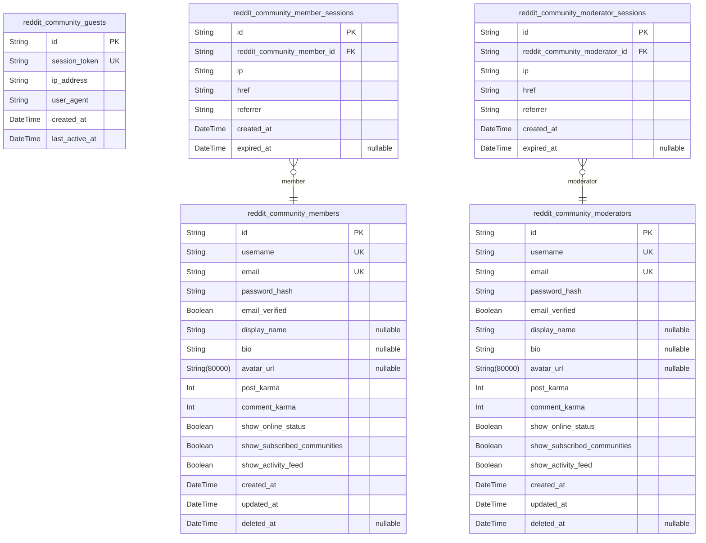
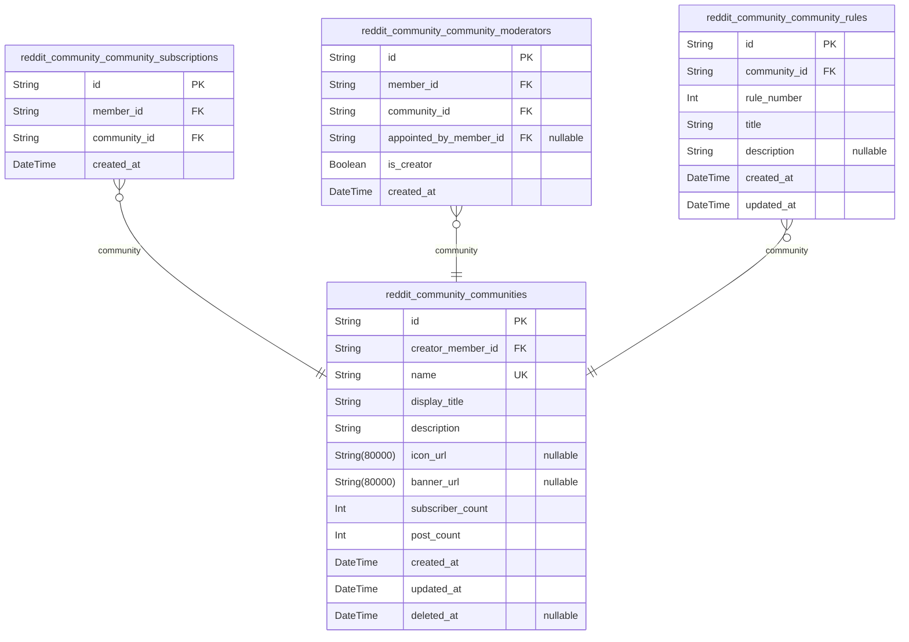
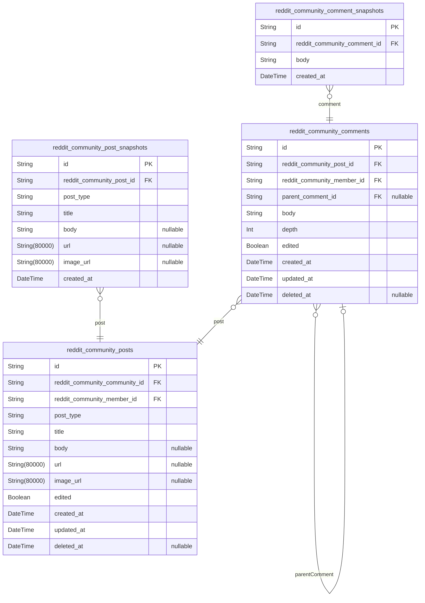
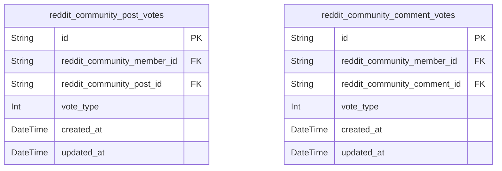
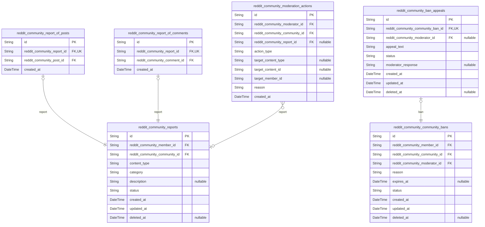
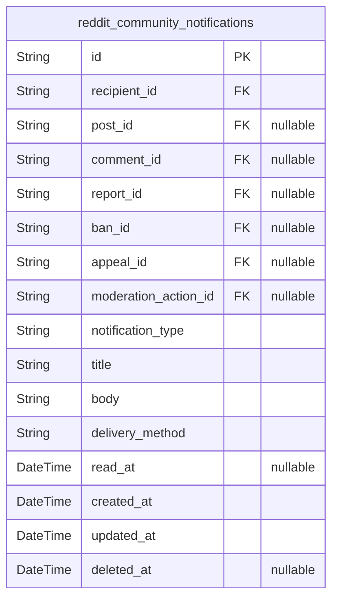

# Prisma Markdown

> Generated by [`prisma-markdown`](https://github.com/samchon/prisma-markdown)

- [Actors](#actors)
- [Communities](#communities)
- [Content](#content)
- [Voting](#voting)
- [Moderation](#moderation)
- [Notifications](#notifications)

## Actors

```mermaid
erDiagram
"reddit_community_guests" {
  String id PK
  String session_token UK
  String ip_address
  String user_agent
  DateTime created_at
  DateTime last_active_at
}
"reddit_community_members" {
  String id PK
  String username UK
  String email UK
  String password_hash
  Boolean email_verified
  String display_name "nullable"
  String bio "nullable"
  String(80000) avatar_url "nullable"
  Int post_karma
  Int comment_karma
  Boolean show_online_status
  Boolean show_subscribed_communities
  Boolean show_activity_feed
  DateTime created_at
  DateTime updated_at
  DateTime deleted_at "nullable"
}
"reddit_community_member_sessions" {
  String id PK
  String reddit_community_member_id FK
  String ip
  String href
  String referrer
  DateTime created_at
  DateTime expired_at "nullable"
}
"reddit_community_moderators" {
  String id PK
  String username UK
  String email UK
  String password_hash
  Boolean email_verified
  String display_name "nullable"
  String bio "nullable"
  String(80000) avatar_url "nullable"
  Int post_karma
  Int comment_karma
  Boolean show_online_status
  Boolean show_subscribed_communities
  Boolean show_activity_feed
  DateTime created_at
  DateTime updated_at
  DateTime deleted_at "nullable"
}
"reddit_community_moderator_sessions" {
  String id PK
  String reddit_community_moderator_id FK
  String ip
  String href
  String referrer
  DateTime created_at
  DateTime expired_at "nullable"
}
"reddit_community_member_sessions" }o--|| "reddit_community_members" : member
"reddit_community_moderator_sessions" }o--|| "reddit_community_moderators" : moderator
```

### `reddit_community_guests`

Unauthenticated visitors browsing the platform.

Guests represent users who access the platform without creating an
account or logging in. They can view all public content including
communities, posts, and comments, but cannot perform any interactive
actions such as voting, posting, commenting, or subscribing.

Guests are tracked through session mechanisms to enable eventual
conversion to registered members. When a guest decides to participate
actively, they transition to member status through the registration
process.

This table maintains minimal information about guest sessions for
analytics and conversion tracking purposes.

Properties as follows:

- `id`: Primary Key.
- `session_token`
  > Unique session identifier for tracking guest browsing activity. Used to
  > maintain state and enable conversion tracking when guests register.
- `ip_address`
  > IP address of the guest for analytics and security purposes. Helps track
  > geographic distribution and detect suspicious patterns.
- `user_agent`
  > Browser and device information from the HTTP user agent header. Used for
  > analytics and responsive design optimization.
- `created_at`
  > Timestamp when the guest session was first created. Tracks initial
  > platform access time.
- `last_active_at`
  > Timestamp of the guest's most recent activity on the platform. Updated on
  > each page view or interaction attempt.

### `reddit_community_members`

Registered users with full platform participation capabilities.

Members are authenticated users who have completed registration and can
fully participate in the community platform. They can create posts, write
comments, vote on content, subscribe to communities, earn karma, and
customize their profiles.

Members form the core user base driving content creation, engagement, and
community growth. The karma system incentivizes quality contributions
while full participation capabilities enable vibrant discussions and
community building.

Each member account includes authentication credentials, profile
customization options, reputation metrics, and activity tracking. Email
verification ensures account validity and enables password recovery.

Properties as follows:

- `id`: Primary Key.
- `username`
  > Unique display name for the member. Must be 3-20 alphanumeric characters
  > and underscores, starting with alphanumeric. Immutable after
  > registration.
- `email`
  > Email address for authentication and communication. Must be unique across
  > all members and follow valid email format.
- `password_hash`
  > Bcrypt hashed password with work factor of 12. Never stored in plain
  > text. Used for authentication during login.
- `email_verified`
  > Whether the member's email address has been verified. Set to true after
  > clicking verification link sent during registration.
- `display_name`
  > Optional customizable display name shown in place of username. Maximum 50
  > characters, supports Unicode. Defaults to username if not set.
- `bio`
  > User-written profile description supporting basic markdown. Maximum 500
  > characters. Displayed on user profile page.
- `avatar_url`
  > URL reference to uploaded profile avatar image. Supports JPEG, PNG, GIF,
  > WebP formats. Maximum 5MB file size.
- `post_karma`
  > Cumulative reputation points earned from net upvotes on the member's
  > posts. Calculated as sum of (upvotes - downvotes) across all posts.
- `comment_karma`
  > Cumulative reputation points earned from net upvotes on the member's
  > comments. Calculated as sum of (upvotes - downvotes) across all comments.
- `show_online_status`
  > Privacy setting controlling visibility of last seen timestamp. When
  > false, last active time is hidden from other users. Defaults to false.
- `show_subscribed_communities`
  > Privacy setting controlling public visibility of subscription list. When
  > false, subscribed communities are hidden from profile. Defaults to false.
- `show_activity_feed`
  > Privacy setting controlling public visibility of posts and comments on
  > profile. When false, activity is hidden from other users. Defaults to
  > true.
- `created_at`
  > Timestamp when the member account was created. Immutable registration
  > date used for account age calculation.
- `updated_at`
  > Timestamp of the last profile update. Modified when member edits profile,
  > changes settings, or updates email/password.
- `deleted_at`
  > Timestamp when the member account was deleted. Null for active accounts.
  > Soft deletion preserves content attribution while anonymizing personal
  > data.

### `reddit_community_member_sessions`

Authentication sessions for registered members.

Session records track authenticated member login instances for JWT
token-based authentication. Each session represents a member's active
connection from a specific device or browser, enabling concurrent
multi-device access.

Sessions store connection context including IP address, referrer, and
access URL for security auditing and fraud detection. Session expiration
is managed through JWT token lifetimes (30-minute access tokens, 30-day
refresh tokens).

All sessions are automatically created upon successful login and may be
invalidated through logout, password changes, or security events.

Properties as follows:

- `id`: Primary Key.
- `reddit_community_member_id`
  > Member who owns this authentication session. {@link
  > reddit_community_members.id}.
- `ip`
  > IP address from which the session was established. Used for security
  > monitoring and geographic analytics.
- `href`
  > Connection URL where the session was initiated. Tracks the page or
  > endpoint accessed during login.
- `referrer`
  > Referrer URL indicating how the user arrived at the login page. Useful
  > for tracking acquisition sources and navigation patterns.
- `created_at`
  > Timestamp when the session was created through successful authentication.
  > Marks the login time.
- `expired_at`
  > Timestamp when the session ended through logout, expiration, or
  > invalidation. Null for currently active sessions.

### `reddit_community_moderators`

Community moderators with content management authority.

Moderators are members who have been granted elevated permissions to
manage specific communities. They enforce community standards, remove
rule-violating content, ban users from their communities, and maintain
healthy community environments.

Moderator authority is scoped to specific communities only, not
platform-wide. The community creator automatically becomes the founding
moderator, and can appoint additional moderators to help manage community
growth.

Moderators have the same participation capabilities as regular members,
plus moderation tools including content removal, user banning, report
review, and community configuration. All moderation actions are logged
for transparency and accountability.

Properties as follows:

- `id`: Primary Key.
- `username`
  > Unique display name for the moderator. Must be 3-20 alphanumeric
  > characters and underscores. Immutable after account creation.
- `email`
  > Email address for authentication and moderation notifications. Must be
  > unique across all moderators and follow valid email format.
- `password_hash`
  > Bcrypt hashed password with work factor of 12. Never stored in plain
  > text. Used for authentication during login.
- `email_verified`
  > Whether the moderator's email address has been verified. Set to true
  > after clicking verification link.
- `display_name`
  > Optional customizable display name shown in place of username. Maximum 50
  > characters, supports Unicode. Defaults to username if not set.
- `bio`
  > User-written profile description supporting basic markdown. Maximum 500
  > characters. Displayed on moderator profile page.
- `avatar_url`
  > URL reference to uploaded profile avatar image. Supports JPEG, PNG, GIF,
  > WebP formats. Maximum 5MB file size.
- `post_karma`
  > Cumulative reputation points earned from net upvotes on the moderator's
  > posts. Calculated as sum of (upvotes - downvotes) across all posts.
- `comment_karma`
  > Cumulative reputation points earned from net upvotes on the moderator's
  > comments. Calculated as sum of (upvotes - downvotes) across all comments.
- `show_online_status`
  > Privacy setting controlling visibility of last seen timestamp. When
  > false, last active time is hidden from other users. Defaults to false.
- `show_subscribed_communities`
  > Privacy setting controlling public visibility of subscription list. When
  > false, subscribed communities are hidden from profile. Defaults to false.
- `show_activity_feed`
  > Privacy setting controlling public visibility of posts and comments on
  > profile. When false, activity is hidden from other users. Defaults to
  > true.
- `created_at`
  > Timestamp when the moderator account was created. Immutable registration
  > date used for account age calculation.
- `updated_at`
  > Timestamp of the last profile update. Modified when moderator edits
  > profile, changes settings, or updates email/password.
- `deleted_at`
  > Timestamp when the moderator account was deleted. Null for active
  > accounts. Soft deletion preserves moderation history while anonymizing
  > personal data.

### `reddit_community_moderator_sessions`

Authentication sessions for community moderators.

Session records track authenticated moderator login instances for JWT
token-based authentication. Each session represents a moderator's active
connection from a specific device or browser, enabling concurrent
multi-device access for moderation activities.

Sessions store connection context including IP address, referrer, and
access URL for security auditing and fraud detection. This is especially
important for moderators given their elevated permissions.

All sessions are automatically created upon successful login and may be
invalidated through logout, password changes, or security events. Session
management follows the same patterns as member sessions.

Properties as follows:

- `id`: Primary Key.
- `reddit_community_moderator_id`
  > Moderator who owns this authentication session. {@link
  > reddit_community_moderators.id}.
- `ip`
  > IP address from which the session was established. Used for security
  > monitoring and detecting unauthorized access patterns.
- `href`
  > Connection URL where the session was initiated. Tracks the page or
  > endpoint accessed during login.
- `referrer`
  > Referrer URL indicating how the moderator arrived at the login page.
  > Useful for tracking navigation patterns and security analysis.
- `created_at`
  > Timestamp when the session was created through successful authentication.
  > Marks the login time.
- `expired_at`
  > Timestamp when the session ended through logout, expiration, or
  > invalidation. Null for currently active sessions.

## Communities

```mermaid
erDiagram
"reddit_community_communities" {
  String id PK
  String creator_member_id FK
  String name UK
  String display_title
  String description
  String(80000) icon_url "nullable"
  String(80000) banner_url "nullable"
  Int subscriber_count
  Int post_count
  DateTime created_at
  DateTime updated_at
  DateTime deleted_at "nullable"
}
"reddit_community_community_subscriptions" {
  String id PK
  String member_id FK
  String community_id FK
  DateTime created_at
}
"reddit_community_community_moderators" {
  String id PK
  String member_id FK
  String community_id FK
  String appointed_by_member_id FK "nullable"
  Boolean is_creator
  DateTime created_at
}
"reddit_community_community_rules" {
  String id PK
  String community_id FK
  Int rule_number
  String title
  String description "nullable"
  DateTime created_at
  DateTime updated_at
}
"reddit_community_community_subscriptions" }o--|| "reddit_community_communities" : community
"reddit_community_community_moderators" }o--|| "reddit_community_communities" : community
"reddit_community_community_rules" }o--|| "reddit_community_communities" : community
```

### `reddit_community_communities`

Core community entity representing topic-based spaces where users share
content and engage in discussions.

Communities serve as the foundational organizing principle of the
platform, enabling decentralized content organization around specific
topics, interests, or themes. Each community is created and managed by
moderators who establish rules, enforce standards, and maintain community
culture.

Communities have unique names (used in URLs and references), customizable
descriptions, and optional rules that members must follow. Any
authenticated member can create a community and automatically becomes its
founding moderator with full administrative privileges.

Subscription mechanics allow members to follow communities, causing posts
from subscribed communities to appear in personalized homepage feeds.
Subscriber counts provide social proof and help users discover active
communities.

Communities support soft deletion to preserve historical data and
discussion context even when communities are removed. Deleted communities
remain in the database but are excluded from public discovery and access.

Properties as follows:

- `id`: Primary Key.
- `creator_member_id`
  > Founding member who created this community and serves as the original
  > moderator. [reddit_community_members.id](#reddit_community_members).
- `name`
  > Unique community name used in URLs and references. Must be 3-21
  > characters, lowercase alphanumeric and underscores only. Immutable after
  > creation to preserve URL stability and prevent confusion.
- `display_title`
  > Human-readable community title displayed in UI. Maximum 100 characters,
  > supports Unicode for international communities. Editable by moderators to
  > refine community presentation.
- `description`
  > Community description explaining purpose, topic, and culture. Maximum 500
  > characters. Displayed on community pages to help users understand what
  > the community is about. Editable by moderators.
- `icon_url`
  > Optional URL to community icon/avatar image. Displayed alongside
  > community name throughout the platform. Editable by moderators for visual
  > customization.
- `banner_url`
  > Optional URL to community banner image displayed on community page
  > header. Provides visual identity and customization. Editable by
  > moderators.
- `subscriber_count`
  > Total number of members subscribed to this community. Automatically
  > updated when users subscribe or unsubscribe. Used for popularity ranking
  > and social proof.
- `post_count`
  > Total number of posts created in this community. Incremented on post
  > creation, decremented on post deletion. Provides activity metrics for
  > community discovery.
- `created_at`
  > Timestamp when this community was created. Immutable. Used for
  > calculating community age and displaying tenure information.
- `updated_at`
  > Timestamp when community configuration was last modified (description,
  > rules, images). Updated automatically on any edit operation.
- `deleted_at`
  > Timestamp when community was deleted (soft delete). Null for active
  > communities. Deleted communities are excluded from discovery but
  > preserved for historical data and audit trails.

### `reddit_community_community_subscriptions`

Many-to-many relationship tracking which members are subscribed to which
communities.

Subscriptions enable personalized content feeds by determining which
communities' posts appear on a member's homepage. When a member
subscribes to a community, posts from that community are included in
their personalized feed aggregation.

Each subscription record represents a single member's interest in a
single community. Members can subscribe to unlimited communities, and
communities can have unlimited subscribers.

Subscriptions are created when members click subscribe buttons on
community pages and removed when they unsubscribe. The subscription
timestamp tracks when the member joined the community for tenure display
and analytics.

This table supports community discovery recommendations by analyzing
subscription patterns (users who subscribe to community A often subscribe
to community B).

Properties as follows:

- `id`: Primary Key.
- `member_id`
  > Member who subscribed to the community. {@link
  > reddit_community_members.id}.
- `community_id`
  > Community that the member subscribed to. {@link
  > reddit_community_communities.id}.
- `created_at`
  > Timestamp when the member subscribed to this community. Used for
  > calculating subscription tenure and displaying join date on member
  > profiles.

### `reddit_community_community_moderators`

Many-to-many relationship tracking which moderators have moderation
authority in which communities.

Moderators are members granted authority to manage specific communities,
including content removal, user banning, rule enforcement, and appointing
additional moderators. Moderation authority is scoped to specific
communities rather than platform-wide.

The founding community creator is automatically assigned as the first
moderator with permanent status. Additional moderators can be appointed
by existing moderators to help manage community growth and enforce
standards.

Each record represents a single moderator's authority over a single
community. Moderators can manage multiple communities, and communities
can have multiple moderators to distribute moderation workload.

The appointment timestamp tracks when moderation privileges were granted.
The is_creator flag distinguishes the founding moderator who has special
privileges like appointing/removing other moderators and cannot be
removed.

Properties as follows:

- `id`: Primary Key.
- `member_id`
  > Member who has moderation authority in this community. {@link
  > reddit_community_members.id}.
- `community_id`
  > Community where this member has moderation privileges. {@link
  > reddit_community_communities.id}.
- `appointed_by_member_id`
  > Member who appointed this moderator. Null for community creators who are
  > auto-appointed. [reddit_community_members.id](#reddit_community_members).
- `is_creator`
  > Whether this moderator is the founding community creator. Creators have
  > permanent status and cannot be removed by other moderators. Only one
  > creator per community.
- `created_at`
  > Timestamp when moderation privileges were granted. For creators, this
  > matches community creation time. For appointed moderators, this is the
  > appointment timestamp.

### `reddit_community_community_rules`

Community-specific rules that define acceptable behavior and content
standards.

Rules establish the norms and guidelines that members must follow when
posting and commenting within a community. Each community can define
custom rules tailored to their topic, culture, and moderation philosophy.

Rules are displayed on community pages and during post/comment creation
to help members understand expectations. When members report content,
community rules appear as report reason options to enable precise
violation classification.

Each rule has a short title for quick reference and an optional detailed
description explaining the rule's intent and enforcement. Rules are
numbered sequentially for easy citation in moderation actions.

Moderators can create, edit, reorder, and delete rules to adapt community
standards as the community evolves. Rule changes are logged with
timestamps to track policy evolution.

Properties as follows:

- `id`: Primary Key.
- `community_id`
  > Community that this rule applies to. {@link
  > reddit_community_communities.id}.
- `rule_number`
  > Sequential rule number within the community (1, 2, 3, etc.). Used for
  > ordering rules and citation in moderation actions. Moderators can reorder
  > rules by changing these numbers.
- `title`
  > Short rule title summarizing the rule. Maximum 100 characters. Displayed
  > in rule lists and report forms. Examples: 'No spam', 'Be respectful',
  > 'Stay on topic'.
- `description`
  > Detailed explanation of the rule, enforcement guidelines, and examples.
  > Maximum 500 characters per rule. Supports basic markdown formatting.
  > Helps members understand rule intent and moderators apply rules
  > consistently.
- `created_at`
  > Timestamp when this rule was created. Immutable. Used for tracking rule
  > history and policy evolution.
- `updated_at`
  > Timestamp when rule text was last modified. Updated automatically on edit
  > operations. Helps moderators track recent policy changes.

## Content

```mermaid
erDiagram
"reddit_community_posts" {
  String id PK
  String reddit_community_community_id FK
  String reddit_community_member_id FK
  String post_type
  String title
  String body "nullable"
  String(80000) url "nullable"
  String(80000) image_url "nullable"
  Boolean edited
  DateTime created_at
  DateTime updated_at
  DateTime deleted_at "nullable"
}
"reddit_community_post_snapshots" {
  String id PK
  String reddit_community_post_id FK
  String post_type
  String title
  String body "nullable"
  String(80000) url "nullable"
  String(80000) image_url "nullable"
  DateTime created_at
}
"reddit_community_comments" {
  String id PK
  String reddit_community_post_id FK
  String reddit_community_member_id FK
  String parent_comment_id FK "nullable"
  String body
  Int depth
  Boolean edited
  DateTime created_at
  DateTime updated_at
  DateTime deleted_at "nullable"
}
"reddit_community_comment_snapshots" {
  String id PK
  String reddit_community_comment_id FK
  String body
  DateTime created_at
}
"reddit_community_post_snapshots" }o--|| "reddit_community_posts" : post
"reddit_community_comments" }o--|| "reddit_community_posts" : post
"reddit_community_comments" }o--o| "reddit_community_comments" : parentComment
"reddit_community_comment_snapshots" }o--|| "reddit_community_comments" : comment
```

### `reddit_community_posts`

User-generated posts within communities supporting text, link, and image
content types.

Posts are the primary content type driving community engagement and
discussions. Each post belongs to a single community and is created by an
authenticated member. Posts can be one of three types: text (long-form
written content), link (external URL sharing), or image (uploaded visual
content).

Posts accumulate votes that determine visibility and contribute to author
karma. Members can edit their posts after creation, with edit history
tracked through snapshots. Moderators can remove posts that violate
community rules. Comments are attached to posts creating discussion
threads.

The post lifecycle supports creation, editing (with snapshot tracking),
voting, commenting, reporting, and deletion (soft delete preserving
discussion context).

Properties as follows:

- `id`: Primary Key.
- `reddit_community_community_id`
  > Community where this post is published. {@link
  > reddit_community_communities.id}.
- `reddit_community_member_id`: Member who created this post. [reddit_community_members.id](#reddit_community_members).
- `post_type`
  > Type of post content. Valid values: 'text' (long-form written content),
  > 'link' (external URL), 'image' (uploaded visual content). Determines
  > which content fields are populated.
- `title`
  > Post title or headline. Required for all post types. Minimum 3
  > characters, maximum 300 characters. Indexed for search functionality.
- `body`
  > Text content for text posts. Maximum 40,000 characters. Null for link and
  > image posts. Supports plain text with preserved formatting.
- `url`
  > External URL for link posts. Maximum 2,000 characters. Must start with
  > http:// or https://. Null for text and image posts. Stored exactly as
  > provided without normalization.
- `image_url`
  > Permanent URL for uploaded image in image posts. Generated after
  > successful image upload. Null for text and link posts. Images stored
  > server-side with unique identifiers.
- `edited`
  > Indicates whether this post has been edited after creation. Set to true
  > when post is modified after initial publication. Used to display edited
  > indicator to users.
- `created_at`
  > Timestamp when the post was originally created. Immutable. Used for
  > chronological sorting and age calculations.
- `updated_at`
  > Timestamp of the most recent edit. Updated automatically when post
  > content is modified. Equals created_at if never edited.
- `deleted_at`
  > Timestamp when the post was deleted (soft delete). Null for active posts.
  > Deleted posts are hidden from feeds but preserved for discussion context
  > and audit trails.

### `reddit_community_post_snapshots`

Historical point-in-time states of posts for edit history tracking and
audit trails.

Post snapshots capture the complete state of a post at specific moments
in time, primarily when edits occur. Each snapshot preserves the post's
content, metadata, and context as it existed at that instant, enabling
audit trails and potential content recovery.

Snapshots are created automatically when posts are edited after the
initial 15-minute grace period. They store denormalized data to maintain
historical accuracy even if the original post or related entities are
modified or deleted.

Snapshots support moderation review, user transparency (showing edit
history), and platform integrity by maintaining immutable records of
content changes.

Properties as follows:

- `id`: Primary Key.
- `reddit_community_post_id`: Original post being tracked. [reddit_community_posts.id](#reddit_community_posts).
- `post_type`
  > Type of post content at snapshot time. Denormalized from post for
  > historical accuracy. Valid values: 'text', 'link', 'image'.
- `title`
  > Post title as it existed at snapshot time. Denormalized for historical
  > preservation.
- `body`
  > Text content as it existed at snapshot time for text posts. Denormalized
  > for historical preservation. Null for non-text posts.
- `url`
  > External URL as it existed at snapshot time for link posts. Denormalized
  > for historical preservation. Null for non-link posts.
- `image_url`
  > Image URL as it existed at snapshot time for image posts. Denormalized
  > for historical preservation. Null for non-image posts.
- `created_at`
  > Timestamp when this snapshot was created. Represents the moment the post
  > was edited, triggering snapshot creation.

### `reddit_community_comments`

User comments on posts supporting nested threading with unlimited depth
for rich discussions.

Comments enable members to respond to posts and other comments, creating
hierarchical discussion threads. Each comment belongs to a specific post
and optionally references a parent comment for nested replies, supporting
conversation threading to any depth.

Comments accumulate votes contributing to author karma and can be edited
or deleted by their authors. Moderators can remove comments violating
community rules. The nested structure is preserved even when comments are
deleted to maintain discussion context.

Comments support the same lifecycle as posts: creation, editing (with
history tracking via snapshots if needed), voting, reporting, and soft
deletion. Vote scores and engagement metrics help surface quality
contributions.

Properties as follows:

- `id`: Primary Key.
- `reddit_community_post_id`: Post this comment belongs to. [reddit_community_posts.id](#reddit_community_posts).
- `reddit_community_member_id`: Member who created this comment. [reddit_community_members.id](#reddit_community_members).
- `parent_comment_id`
  > Parent comment for nested replies. [reddit_community_comments.id](#reddit_community_comments).
  > Null for top-level comments directly on the post. Self-referential
  > foreign key enabling unlimited nesting depth.
- `body`
  > Comment text content. Required field. Maximum 10,000 characters. Supports
  > plain text with preserved formatting and basic markdown.
- `depth`
  > Nesting depth level of this comment. Top-level comments (direct replies
  > to post) have depth 0. Each nested reply increments depth by 1. Used for
  > display indentation and threading visualization.
- `edited`
  > Indicates whether this comment has been edited after creation. Set to
  > true when comment is modified. Displays edited indicator with timestamp
  > to users.
- `created_at`
  > Timestamp when the comment was originally created. Immutable. Used for
  > chronological sorting and determining comment age.
- `updated_at`
  > Timestamp of the most recent edit. Updated automatically when comment
  > content is modified. Equals created_at if never edited.
- `deleted_at`
  > Timestamp when the comment was deleted (soft delete). Null for active
  > comments. Deleted comments show placeholder text but preserve thread
  > structure for context.

### `reddit_community_comment_snapshots`

Historical point-in-time states of comments for edit history tracking and
audit trails.

Comment snapshots capture the complete state of a comment at specific
moments in time when edits occur. Each snapshot preserves the comment's
content and metadata as it existed at that instant, enabling audit
trails, content recovery, and edit history transparency.

Snapshots are created automatically when comments are edited after the
initial grace period. They store denormalized data to maintain historical
accuracy even if the original comment or related entities are modified or
deleted.

Snapshots support moderation review, user transparency for showing edit
history, and platform integrity by maintaining immutable records of
comment modifications.

Properties as follows:

- `id`: Primary Key.
- `reddit_community_comment_id`: Original comment being tracked. [reddit_community_comments.id](#reddit_community_comments).
- `body`
  > Comment text content as it existed at snapshot time. Denormalized for
  > historical preservation. Maximum 10,000 characters.
- `created_at`
  > Timestamp when this snapshot was created. Represents the moment the
  > comment was edited, triggering snapshot creation.

## Voting

```mermaid
erDiagram
"reddit_community_post_votes" {
  String id PK
  String reddit_community_member_id FK
  String reddit_community_post_id FK
  Int vote_type
  DateTime created_at
  DateTime updated_at
}
"reddit_community_comment_votes" {
  String id PK
  String reddit_community_member_id FK
  String reddit_community_comment_id FK
  Int vote_type
  DateTime created_at
  DateTime updated_at
}
```

### `reddit_community_post_votes`

Records of member votes (upvotes and downvotes) on posts.

Tracks individual voting actions by members on posts to enable democratic
content curation and karma calculation. Each member can cast exactly one
vote per post, which can be an upvote (+1), downvote (-1), or removed
(deleted record).

Votes can be changed at any time - members may switch from upvote to
downvote or vice versa. The vote_type field stores 1 for upvote and -1
for downvote. Karma scores are calculated by aggregating vote_type values
across all votes for a post's author.

This table enforces the one-vote-per-user-per-post rule through a unique
constraint and supports efficient karma calculation queries through
indexed lookups on post_id and member_id.

Properties as follows:

- `id`: Primary Key.
- `reddit_community_member_id`: Member who cast the vote. [reddit_community_members.id](#reddit_community_members).
- `reddit_community_post_id`: Post being voted on. [reddit_community_posts.id](#reddit_community_posts).
- `vote_type`
  > Type of vote cast: 1 for upvote, -1 for downvote. This value is
  > aggregated to calculate post karma scores.
- `created_at`: Timestamp when the vote was first cast.
- `updated_at`
  > Timestamp when the vote was last modified. Updated when user changes vote
  > from upvote to downvote or vice versa.

### `reddit_community_comment_votes`

Records of member votes (upvotes and downvotes) on comments.

Tracks individual voting actions by members on comments to enable
discussion quality curation and comment karma calculation. Each member
can cast exactly one vote per comment, which can be an upvote (+1),
downvote (-1), or removed (deleted record).

Votes can be changed at any time - members may switch from upvote to
downvote or vice versa. The vote_type field stores 1 for upvote and -1
for downvote. Comment karma scores are calculated by aggregating
vote_type values across all votes for a comment's author.

This table enforces the one-vote-per-user-per-comment rule through a
unique constraint and supports efficient karma calculation queries
through indexed lookups on comment_id and member_id.

Properties as follows:

- `id`: Primary Key.
- `reddit_community_member_id`: Member who cast the vote. [reddit_community_members.id](#reddit_community_members).
- `reddit_community_comment_id`: Comment being voted on. [reddit_community_comments.id](#reddit_community_comments).
- `vote_type`
  > Type of vote cast: 1 for upvote, -1 for downvote. This value is
  > aggregated to calculate comment karma scores.
- `created_at`: Timestamp when the vote was first cast.
- `updated_at`
  > Timestamp when the vote was last modified. Updated when user changes vote
  > from upvote to downvote or vice versa.

## Moderation

```mermaid
erDiagram
"reddit_community_reports" {
  String id PK
  String reddit_community_member_id FK
  String reddit_community_community_id FK
  String content_type
  String category
  String description "nullable"
  String status
  DateTime created_at
  DateTime updated_at
  DateTime deleted_at "nullable"
}
"reddit_community_report_of_posts" {
  String id PK
  String reddit_community_report_id FK,UK
  String reddit_community_post_id FK
  DateTime created_at
}
"reddit_community_report_of_comments" {
  String id PK
  String reddit_community_report_id FK,UK
  String reddit_community_comment_id FK
  DateTime created_at
}
"reddit_community_moderation_actions" {
  String id PK
  String reddit_community_moderator_id FK
  String reddit_community_community_id FK
  String reddit_community_report_id FK "nullable"
  String action_type
  String target_content_type "nullable"
  String target_content_id "nullable"
  String target_member_id "nullable"
  String reason
  DateTime created_at
}
"reddit_community_community_bans" {
  String id PK
  String reddit_community_member_id FK
  String reddit_community_community_id FK
  String reddit_community_moderator_id FK
  String reason
  DateTime expires_at "nullable"
  String status
  DateTime created_at
  DateTime updated_at
  DateTime deleted_at "nullable"
}
"reddit_community_ban_appeals" {
  String id PK
  String reddit_community_community_ban_id FK,UK
  String reddit_community_moderator_id FK "nullable"
  String appeal_text
  String status
  String moderator_response "nullable"
  DateTime created_at
  DateTime updated_at
  DateTime deleted_at "nullable"
}
"reddit_community_report_of_posts" |o--|| "reddit_community_reports" : report
"reddit_community_report_of_comments" |o--|| "reddit_community_reports" : report
"reddit_community_moderation_actions" }o--o| "reddit_community_reports" : report
"reddit_community_ban_appeals" |o--|| "reddit_community_community_bans" : ban
```

### `reddit_community_reports`

Content violation reports submitted by members.

Members can report posts or comments they believe violate community
standards or platform policies.
Each report is associated with a specific community and reviewed by that
community's moderators.

The content_type field indicates whether the report targets a post or
comment, with corresponding subtype entities
(reddit_community_report_of_posts or reddit_community_report_of_comments)
providing the specific content reference.

Reports progress through a lifecycle tracked by the status field: pending
(awaiting review), under_review (moderator reviewing),
resolved_action_taken (moderator took action), resolved_no_violation (no
action needed), or dismissed (invalid report).

Multiple members can report the same content, with each report tracked
separately to measure severity and consensus.

All reports are soft-deleted to maintain audit trails even after resolution.

Properties as follows:

- `id`: Primary Key.
- `reddit_community_member_id`: Member who submitted the report. [reddit_community_members.id](#reddit_community_members).
- `reddit_community_community_id`
  > Community where the reported content exists. {@link
  > reddit_community_communities.id}.
- `content_type`
  > Type of content being reported: 'post' or 'comment'. Determines which
  > subtype entity contains the content reference.
- `category`
  > Report category: spam, harassment, hate_speech, misinformation,
  > sexual_content, violence, personal_information, copyright, self_harm, or
  > other.
- `description`
  > Optional detailed explanation from reporter about the violation. Maximum
  > 1000 characters. Required when category is 'other'.
- `status`
  > Current report status: pending, under_review, resolved_action_taken,
  > resolved_no_violation, or dismissed.
- `created_at`: Timestamp when the report was submitted.
- `updated_at`: Timestamp when the report status was last modified.
- `deleted_at`: Soft delete timestamp for maintaining audit history.

### `reddit_community_report_of_posts`

Post-specific report subtype entity.

Links reports to specific posts when content_type is 'post'.
Provides the direct reference to the reported post for moderator review
context.

Each report targeting a post has exactly one corresponding record in this
table through a 1:1 relationship.

Properties as follows:

- `id`: Primary Key.
- `reddit_community_report_id`: Main report entity. [reddit_community_reports.id](#reddit_community_reports).
- `reddit_community_post_id`: Post being reported. [reddit_community_posts.id](#reddit_community_posts).
- `created_at`: Timestamp when the post report association was created.

### `reddit_community_report_of_comments`

Comment-specific report subtype entity.

Links reports to specific comments when content_type is 'comment'.
Provides the direct reference to the reported comment for moderator
review context.

Each report targeting a comment has exactly one corresponding record in
this table through a 1:1 relationship.

Properties as follows:

- `id`: Primary Key.
- `reddit_community_report_id`: Main report entity. [reddit_community_reports.id](#reddit_community_reports).
- `reddit_community_comment_id`: Comment being reported. [reddit_community_comments.id](#reddit_community_comments).
- `created_at`: Timestamp when the comment report association was created.

### `reddit_community_moderation_actions`

Audit log of all moderation actions taken by moderators.

Provides complete transparency and accountability for moderation decisions.
Every content removal, user ban, appeal decision, and report dismissal is
logged here.

The action_type field specifies what action was taken: content_removal,
user_ban, ban_lift, appeal_approved, appeal_denied, or report_dismissed.

Each action links to the moderator who performed it, the community
context, and optionally the report that triggered the action.
The reason field contains the moderator's justification, which is
displayed to affected users.

For content removal actions, target_content_type and target_content_id
identify the removed post or comment.
For ban actions, target_member_id identifies the banned user.

All actions are permanently retained for audit purposes and never
soft-deleted.

Properties as follows:

- `id`: Primary Key.
- `reddit_community_moderator_id`
  > Moderator who performed the action. {@link
  > reddit_community_moderators.id}.
- `reddit_community_community_id`
  > Community where the action was taken. {@link
  > reddit_community_communities.id}.
- `reddit_community_report_id`
  > Report that triggered this action, if applicable. {@link
  > reddit_community_reports.id}.
- `action_type`
  > Type of moderation action: content_removal, user_ban, ban_lift,
  > appeal_approved, appeal_denied, or report_dismissed.
- `target_content_type`
  > Type of content affected: 'post', 'comment', or null if action doesn't
  > target specific content.
- `target_content_id`
  > ID of the affected post or comment, or null if action doesn't target
  > specific content.
- `target_member_id`
  > ID of the member affected by the action (for bans, ban lifts), or null if
  > not applicable.
- `reason`
  > Moderator-provided justification for the action. Displayed to affected
  > users. Minimum 10 characters, maximum 500 characters.
- `created_at`: Timestamp when the action was performed.

### `reddit_community_community_bans`

Community-level user bans issued by moderators.

Bans prevent users from posting, commenting, and voting in specific
communities while allowing continued read access.
Each ban is scoped to a single community and does not affect the user's
participation in other communities.

Bans can be temporary (with expires_at timestamp) or permanent
(expires_at is null).
Temporary bans automatically expire when the current time exceeds
expires_at, restoring user privileges.

The status field tracks the ban lifecycle: active (currently enforced),
expired (time-based expiration), or lifted (manually removed by moderator
before expiration).

Users can submit one appeal per ban through the
reddit_community_ban_appeals table.
All bans are soft-deleted to maintain audit history and support future
anti-abuse pattern detection.

Properties as follows:

- `id`: Primary Key.
- `reddit_community_member_id`
  > Member who is banned from the community. {@link
  > reddit_community_members.id}.
- `reddit_community_community_id`
  > Community from which the member is banned. {@link
  > reddit_community_communities.id}.
- `reddit_community_moderator_id`: Moderator who issued the ban. [reddit_community_moderators.id](#reddit_community_moderators).
- `reason`
  > Moderator-provided explanation for the ban. Displayed to the banned user.
  > Maximum 500 characters.
- `expires_at`
  > Expiration timestamp for temporary bans. Null for permanent bans. Ban
  > automatically expires when current time exceeds this value.
- `status`
  > Current ban status: active (currently enforced), expired (time elapsed),
  > or lifted (manually removed early).
- `created_at`: Timestamp when the ban was issued.
- `updated_at`: Timestamp when the ban status was last modified.
- `deleted_at`: Soft delete timestamp for maintaining audit history.

### `reddit_community_ban_appeals`

User appeals challenging community bans.

Banned users can submit one appeal per ban to contest the moderation
decision.
Appeals provide the user's explanation for why the ban should be
reconsidered or lifted.

Moderators review appeals and make decisions: approved (ban lifted
immediately) or denied (ban maintained).
The moderator_response field contains the moderator's explanation of
their decision, which is shown to the appealing user.

The status field tracks appeal progression: pending (awaiting moderator
review), approved (ban lifted), denied (appeal rejected), or
expired_no_review (no moderator action within 30 days).

Each ban can have at most one appeal, enforced by the unique constraint
on reddit_community_community_ban_id.
All appeals are soft-deleted to maintain complete moderation history and
transparency.

Properties as follows:

- `id`: Primary Key.
- `reddit_community_community_ban_id`: Ban being appealed. [reddit_community_community_bans.id](#reddit_community_community_bans).
- `reddit_community_moderator_id`
  > Moderator who reviewed and decided on the appeal. Null while appeal is
  > pending. [reddit_community_moderators.id](#reddit_community_moderators).
- `appeal_text`
  > User's explanation for why the ban should be reconsidered. Minimum 50
  > characters, maximum 2000 characters.
- `status`: Appeal status: pending, approved, denied, or expired_no_review.
- `moderator_response`
  > Moderator's explanation of their decision on the appeal. Required when
  > status is approved or denied. Maximum 1000 characters.
- `created_at`: Timestamp when the appeal was submitted.
- `updated_at`: Timestamp when the appeal status was last modified.
- `deleted_at`: Soft delete timestamp for maintaining audit history.

## Notifications

```mermaid
erDiagram
"reddit_community_notifications" {
  String id PK
  String recipient_id FK
  String post_id FK "nullable"
  String comment_id FK "nullable"
  String report_id FK "nullable"
  String ban_id FK "nullable"
  String appeal_id FK "nullable"
  String moderation_action_id FK "nullable"
  String notification_type
  String title
  String body
  String delivery_method
  DateTime read_at "nullable"
  DateTime created_at
  DateTime updated_at
  DateTime deleted_at "nullable"
}
```

### `reddit_community_notifications`

User notifications for platform events and interactions.

Tracks all notification events sent to members including comment replies,
moderation actions, ban updates, appeal decisions, and other platform
activities requiring user attention.

Each notification references a specific member recipient and may
reference various source entities depending on the notification type.
Supports multiple delivery methods (in-app, email) and tracks read/unread
status for user notification management.

Notifications are created automatically by the system when triggering
events occur (new reply, content removal, ban expiration, etc.) and
remain in the user's notification history for transparency and reference.
Users can mark notifications as read, dismiss them via soft delete, and
filter by various criteria.

Properties as follows:

- `id`: Primary Key.
- `recipient_id`: Member receiving this notification. [reddit_community_members.id](#reddit_community_members).
- `post_id`
  > Related post if notification concerns a post (e.g., reply to post).
  > [reddit_community_posts.id](#reddit_community_posts).
- `comment_id`
  > Related comment if notification concerns a comment (e.g., reply to
  > comment). [reddit_community_comments.id](#reddit_community_comments).
- `report_id`
  > Related report if notification concerns a report outcome. {@link
  > reddit_community_reports.id}.
- `ban_id`
  > Related ban if notification concerns a ban action or expiration. {@link
  > reddit_community_community_bans.id}.
- `appeal_id`
  > Related appeal if notification concerns an appeal decision. {@link
  > reddit_community_ban_appeals.id}.
- `moderation_action_id`
  > Related moderation action if notification concerns content removal or
  > other moderation. [reddit_community_moderation_actions.id](#reddit_community_moderation_actions).
- `notification_type`
  > Type of notification event. Values include: comment_reply, post_reply,
  > content_removed, user_banned, ban_expired, ban_lifted, appeal_approved,
  > appeal_denied, report_resolved, upvote_milestone, and other event types.
- `title`
  > Notification title or subject line. Brief summary of the notification
  > event (e.g., 'New reply to your comment', 'Your content was removed').
- `body`
  > Detailed notification message body. Contains full context and details
  > about the notification event, may include moderator reasons or
  > system-generated explanations.
- `delivery_method`
  > Notification delivery method. Values: in_app (notification bell only),
  > email (email notification only), both (in-app and email). Reflects user
  > preferences and notification priority.
- `read_at`
  > Timestamp when the user marked this notification as read. Null indicates
  > unread notification. Used for displaying unread counts and filtering
  > notification history.
- `created_at`
  > Timestamp when the notification was created and sent to the user. Used
  > for chronological ordering and notification history.
- `updated_at`
  > Timestamp when the notification was last modified. Tracks changes such as
  > marking as read or content updates. Enables audit trail for notification
  > lifecycle.
- `deleted_at`
  > Soft delete timestamp. When set, indicates the user has dismissed or
  > deleted this notification from their view. Supports notification cleanup
  > while preserving audit history.
