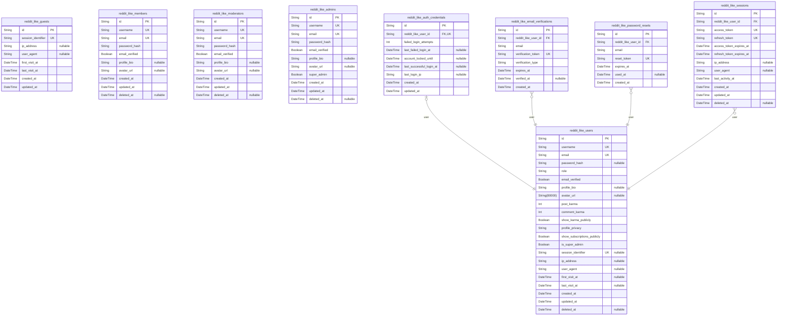

# Prisma Markdown

> Generated by [`prisma-markdown`](https://github.com/samchon/prisma-markdown)

- [Systematic](#systematic)
- [Actors](#actors)
- [Communities](#communities)
- [Posts](#posts)
- [Comments](#comments)
- [Voting](#voting)
- [Karma](#karma)
- [Moderation](#moderation)
- [default](#default)

## Systematic

### `reddit_like_system_settings`

Platform-wide configuration settings stored as key-value pairs. This
table contains system parameters that control platform behavior, such as
content limits, rate limiting rules, feature toggles, and other
configurable aspects of the system. Settings can be categorized and
marked as public or internal-only. Values are stored as strings with a
type indicator for proper deserialization.

Properties as follows:

- `id`: Primary Key.
- `key`
  > Unique identifier for the setting (e.g., 'max_post_length',
  > 'rate_limit_posts_per_hour'). This key is used to retrieve the setting
  > value throughout the application.
- `value`
  > The setting value stored as a string. Complex values (objects, arrays)
  > can be stored as JSON strings. The value_type field indicates how to
  > deserialize this value.
- `description`
  > Human-readable description explaining what this setting controls and its
  > purpose. Helps administrators understand the impact of changing this
  > setting.
- `value_type`
  > Indicates the data type of the value for proper deserialization. Common
  > values: 'string', 'int', 'double', 'boolean', 'json'. This helps the
  > application correctly parse the value string.
- `category`
  > Grouping category for organizing related settings (e.g., 'content',
  > 'moderation', 'performance', 'features'). Allows filtering and grouping
  > settings in admin interfaces.
- `is_public`
  > Whether this setting can be exposed via public API or is internal-only.
  > Public settings may be displayed to users (e.g., max post length), while
  > internal settings are admin-only (e.g., API keys, security parameters).
- `created_at`: Timestamp when this setting was first created in the system.
- `updated_at`
  > Timestamp when this setting was last modified. Updated whenever the value
  > or other fields change. Provides audit trail for configuration changes.

## Actors

### `reddit_like_guests`

Guest users represent unauthenticated visitors to the platform. Guests
can view public communities, posts, and comments but cannot interact
through voting, posting, or commenting. This table tracks guest sessions
for analytics and potential conversion to member accounts.

Properties as follows:

- `id`: Primary Key.
- `session_identifier`
  > Unique session identifier for tracking guest activity across visits. Used
  > for analytics and anonymous user behavior tracking.
- `ip_address`
  > IP address of the guest user for security monitoring and rate limiting
  > purposes.
- `user_agent`: Browser user agent string for device and browser analytics.
- `first_visit_at`: Timestamp of the guest's first visit to the platform.
- `last_visit_at`: Timestamp of the guest's most recent visit to the platform.
- `created_at`: Timestamp when the guest session was first created.
- `updated_at`: Timestamp when the guest session was last updated.

### `reddit_like_members`

Member users are authenticated standard users with full participation
rights. Members can create posts, write comments, vote on content,
subscribe to communities, and earn karma. This is the core user type
representing the majority of platform participants.

Properties as follows:

- `id`: Primary Key.
- `username`
  > Unique username chosen during registration. Must be 3-20 characters
  > containing only alphanumeric characters, underscores, and hyphens.
  > Displayed throughout the platform as the user's identity.
- `email`
  > Unique email address for authentication and communication. Used for
  > login, verification, and notifications.
- `password_hash`
  > Securely hashed password using bcrypt, Argon2, or PBKDF2. Never stored in
  > plain text. Used for authentication.
- `email_verified`
  > Whether the user has verified their email address. Some features may
  > require verified email status.
- `profile_bio`
  > Optional user biography or description displayed on their profile page.
  > Limited to 200-500 characters.
- `avatar_url`
  > URL to the user's profile avatar image. Points to uploaded custom avatar
  > or default generated avatar.
- `created_at`
  > Timestamp when the member account was created. Displayed as account age
  > on profile.
- `updated_at`: Timestamp when the member account was last updated.
- `deleted_at`
  > Timestamp when the account was soft-deleted. Null if account is active.
  > Enables account recovery and data preservation.

### `reddit_like_moderators`

Moderator users are trusted community managers with elevated permissions
within specific communities. Moderators can remove content, ban users
from their communities, configure community settings, and enforce
community rules. Moderator status is community-specific.

Properties as follows:

- `id`: Primary Key.
- `username`
  > Unique username for the moderator account. Same constraints as member
  > usernames: 3-20 characters, alphanumeric with underscores and hyphens.
- `email`
  > Unique email address for moderator authentication and communication. Used
  > for moderation notifications and alerts.
- `password_hash`
  > Securely hashed password for moderator authentication. Same security
  > standards as member passwords.
- `email_verified`
  > Whether the moderator has verified their email address. Required for
  > moderator privileges.
- `profile_bio`: Optional moderator biography displayed on their profile.
- `avatar_url`: URL to the moderator's profile avatar image.
- `created_at`: Timestamp when the moderator account was created.
- `updated_at`: Timestamp when the moderator account was last updated.
- `deleted_at`
  > Timestamp when the moderator account was soft-deleted. Null if account is
  > active.

### `reddit_like_admins`

Administrator users are platform-level managers with system-wide elevated
permissions. Admins can manage all communities, handle appeals, suspend
users from the entire platform, and configure platform-wide settings.
This represents the highest authority level.

Properties as follows:

- `id`: Primary Key.
- `username`
  > Unique username for the administrator account. Same constraints as other
  > user types.
- `email`
  > Unique email address for administrator authentication and critical
  > platform notifications.
- `password_hash`
  > Securely hashed password for administrator authentication. Highest
  > security standards required.
- `email_verified`
  > Whether the administrator has verified their email address. Required for
  > admin privileges.
- `profile_bio`: Optional administrator biography displayed on their profile.
- `avatar_url`: URL to the administrator's profile avatar image.
- `super_admin`
  > Whether this administrator has super admin privileges for critical
  > platform operations like managing other administrators.
- `created_at`: Timestamp when the administrator account was created.
- `updated_at`: Timestamp when the administrator account was last updated.
- `deleted_at`
  > Timestamp when the administrator account was soft-deleted. Null if
  > account is active.

### `reddit_like_auth_credentials`

Authentication security metadata tracking failed login attempts, account
locking, and login history for security monitoring. Supports rate
limiting (max 5 failed attempts in 15 minutes triggers 30-minute lock)
and suspicious activity detection. One credential record per user account
for centralized auth security tracking.

Properties as follows:

- `id`: Primary Key.
- `reddit_like_user_id`: User account these credentials belong to. [reddit_like_users.id](#reddit_like_users)
- `failed_login_attempts`
  > Count of consecutive failed login attempts. Used for rate limiting and
  > account locking after 5 failed attempts within 15 minutes per
  > requirements.
- `last_failed_login_at`
  > Timestamp of most recent failed login attempt. Used to calculate rate
  > limiting windows and reset counters after timeout periods.
- `account_locked_until`
  > Timestamp until which account is locked due to failed login attempts.
  > Null if not locked. Auto-unlocks after 30 minutes per requirements.
- `last_successful_login_at`
  > Timestamp of most recent successful login. Used for security monitoring,
  > user activity tracking, and displaying last login on profile.
- `last_login_ip`
  > IP address from most recent login attempt. Used for security monitoring,
  > suspicious activity detection, and geographic login patterns.
- `created_at`
  > Timestamp when authentication credential record was created (typically
  > when user registered).
- `updated_at`
  > Timestamp when authentication credential record was last updated (login
  > attempt, lock status change).

### `reddit_like_email_verifications`

Email verification tokens generated when users register or change email
addresses. Manages verification workflow with unique time-limited links
expiring after 24 hours per requirements. Supports both initial
registration verification and email change verification workflows.

Properties as follows:

- `id`: Primary Key.
- `reddit_like_user_id`: User requesting email verification. [reddit_like_users.id](#reddit_like_users)
- `email`
  > Email address being verified. For registration, matches user's current
  > email. For email changes, this is the new pending email awaiting
  > verification.
- `verification_token`
  > Unique cryptographically secure token included in verification link. Used
  > to validate verification request. Generated using secure random number
  > generation.
- `verification_type`
  > Type of verification: 'registration' (initial account email verification)
  > or 'email_change' (verifying new email address). Determines workflow
  > after verification.
- `expires_at`
  > Timestamp when verification token expires. Set to 24 hours after creation
  > per requirements. Expired tokens cannot be used.
- `verified_at`
  > Timestamp when email was successfully verified by clicking link. Null if
  > not yet verified. Marks verification completion.
- `created_at`: Timestamp when verification token was generated and email sent.

### `reddit_like_password_resets`

Password reset tokens generated when users request password recovery via
forgot password workflow. Manages time-limited reset links expiring after
1 hour per requirements. Tracks token usage to prevent reuse and supports
the complete password reset workflow including expiration and retry
mechanisms.

Properties as follows:

- `id`: Primary Key.
- `reddit_like_user_id`: User requesting password reset. [reddit_like_users.id](#reddit_like_users)
- `email`
  > Email address for which password reset was requested. Used to send reset
  > link and validate reset request matches account email.
- `reset_token`
  > Unique cryptographically secure token included in password reset link.
  > Used to validate reset request. Generated using secure random number
  > generation.
- `expires_at`
  > Timestamp when reset token expires. Set to 1 hour after creation per
  > requirements. Expired tokens cannot be used for password reset.
- `used_at`
  > Timestamp when password was successfully reset using this token. Null if
  > not yet used. Prevents token reuse - tokens can only be used once.
- `created_at`: Timestamp when password reset token was generated and email sent.

### `reddit_like_sessions`

User sessions managing authentication state using JWT tokens. Each
session contains access token (expires in 30 minutes) and refresh token
(expires in 30 days) per requirements. Tracks active user authentication,
enables token refresh without re-login, and monitors session activity for
security. Sessions can be explicitly revoked on logout or invalidated on
password changes.

Properties as follows:

- `id`: Primary Key.
- `reddit_like_user_id`: User who owns this session. [reddit_like_users.id](#reddit_like_users)
- `access_token`
  > JWT access token used for authenticating API requests. Expires in 30
  > minutes per requirements. Contains user ID, username, and role in
  > payload.
- `refresh_token`
  > JWT refresh token used to obtain new access tokens without re-login.
  > Expires in 30 days per requirements. Longer-lived than access token.
- `access_token_expires_at`
  > Timestamp when access token expires. Set to 30 minutes from token issue
  > time per requirements. After expiration, token cannot authenticate
  > requests.
- `refresh_token_expires_at`
  > Timestamp when refresh token expires. Set to 30 days from token issue
  > time per requirements. After expiration, user must re-login with
  > credentials.
- `ip_address`
  > IP address from which session was created. Used for security monitoring,
  > suspicious activity detection, and geographic login analysis.
- `user_agent`
  > Browser user agent string for session. Used for device tracking, security
  > monitoring, and identifying unusual login patterns.
- `last_activity_at`
  > Timestamp of most recent activity in this session. Updated on each
  > authenticated request. Used for session timeout and activity monitoring.
- `created_at`
  > Timestamp when session was created (user logged in). Used for session
  > duration tracking.
- `updated_at`: Timestamp when session was last updated (activity timestamp change).
- `deleted_at`
  > Soft deletion timestamp when session was explicitly revoked (user logged
  > out or password changed). Null for active sessions. Follows platform
  > soft-delete pattern.

### `reddit_like_users`

Unified user table representing all user types on the platform. Uses
role-based access control with a single user entity supporting the
four-tier hierarchy (guest, member, moderator, admin). This design
ensures global username/email uniqueness, proper normalization, and
simplified authentication. Users have profile information, karma scores,
and privacy settings. Moderator and admin roles are granted through the
role field, with community-specific moderator assignments tracked in
reddit_like_community_moderators junction table.

Properties as follows:

- `id`: Primary Key.
- `username`
  > Unique username chosen during registration. Must be 3-20 characters
  > containing only alphanumeric characters, underscores, and hyphens.
  > Displayed throughout the platform as the user's identity. Globally unique
  > across all user roles.
- `email`
  > Unique email address for authentication and communication. Used for
  > login, verification, and notifications. Globally unique across all user
  > roles.
- `password_hash`
  > Securely hashed password using bcrypt, Argon2, or PBKDF2. Never stored in
  > plain text. Used for authentication. Null for guest users who haven't
  > registered.
- `role`
  > User role determining permission level. Valid values: 'guest'
  > (unauthenticated visitor), 'member' (standard user), 'moderator'
  > (community manager), 'admin' (platform manager). Role can be elevated as
  > users gain privileges.
- `email_verified`
  > Whether the user has verified their email address. Some features require
  > verified email status. Always false for guest users.
- `profile_bio`
  > Optional user biography or description displayed on their profile page.
  > Limited to 200-500 characters per requirements.
- `avatar_url`
  > URL to the user's profile avatar image. Points to uploaded custom avatar
  > or platform-generated default avatar based on username.
- `post_karma`
  > Denormalized karma earned from votes on user's posts. Calculated as sum
  > of (upvotes - downvotes) across all posts. Can be negative. Updated in
  > real-time from voting activity. Default 0 for new users.
- `comment_karma`
  > Denormalized karma earned from votes on user's comments. Calculated as
  > sum of (upvotes - downvotes) across all comments. Can be negative.
  > Updated in real-time from voting activity. Default 0 for new users.
- `show_karma_publicly`
  > Privacy setting controlling whether karma scores are visible on public
  > profile. Per requirements, users can hide karma from display. Default
  > true (karma visible).
- `profile_privacy`
  > Profile visibility level per privacy requirements. Valid values: 'public'
  > (visible to all including guests), 'members_only' (authenticated users
  > only), 'private' (only self). Default 'public'.
- `show_subscriptions_publicly`
  > Privacy setting for community subscription list visibility. Per
  > requirements, users control subscription list privacy independently of
  > overall profile privacy. Default true (subscriptions visible).
- `is_super_admin`
  > Whether this admin user has super admin privileges for critical platform
  > operations like managing other administrators. Only applicable when role
  > is 'admin'. Default false.
- `session_identifier`
  > For guest users, tracks anonymous session for analytics. Null for
  > authenticated users. Used for guest conversion tracking and analytics.
- `ip_address`
  > For guest users, stores IP address for security monitoring and rate
  > limiting. Null for authenticated users where IP is tracked in sessions
  > table.
- `user_agent`
  > For guest users, browser user agent string for device analytics. Null for
  > authenticated users where user agent is tracked in sessions table.
- `first_visit_at`
  > For guest users, timestamp of first platform visit. Null for
  > authenticated users. Used for guest conversion analysis.
- `last_visit_at`
  > For guest users, timestamp of most recent visit. Null for authenticated
  > users. Used for guest engagement tracking.
- `created_at`
  > Timestamp when user account was created. For guests, when session
  > started. For members/moderators/admins, when they registered. Displayed
  > as account age on profiles.
- `updated_at`
  > Timestamp when user account was last updated. Tracks profile changes,
  > role elevations, and setting modifications.
- `deleted_at`
  > Soft deletion timestamp. When set, account is deactivated but data
  > preserved for recovery and referential integrity. Null indicates active
  > account.

## Communities

### `reddit_like_communities`

Core community entity representing a subreddit-like community where users
gather around shared interests. Communities serve as the organizational
structure for all content, with each community having its own rules,
moderators, and subscriber base. Communities can be public (visible to
all) or private (invitation/approval required).

Properties as follows:

- `id`: Primary Key.
- `creator_id`
  > User who created this community and serves as the primary moderator.
  > References [reddit_like_members.id](#reddit_like_members).
- `code`
  > Unique community identifier used in URLs (3-25 characters, alphanumeric
  > and underscores only, case-insensitive). Examples: technology, gaming,
  > science.
- `name`
  > Display name of the community (3-25 characters). This is shown in the UI
  > and can differ from the code.
- `description`
  > Community description explaining its purpose and topic (10-500
  > characters). Helps users understand what the community is about.
- `icon_url`
  > URL to the community icon image (256x256 pixels). Uploaded by moderators
  > for community branding.
- `banner_url`
  > URL to the community banner image (max width 1920px). Uploaded by
  > moderators for community header.
- `privacy_type`
  > Privacy setting for the community. Values: public (anyone can view),
  > private (approval required to view). Default is public.
- `posting_permission`
  > Who can create posts in this community. Values: anyone_subscribed,
  > approved_only, moderators_only. Default is anyone_subscribed.
- `allow_text_posts`
  > Whether text posts are allowed in this community. Moderators can disable
  > specific post types.
- `allow_link_posts`
  > Whether link posts are allowed in this community. Moderators can disable
  > specific post types.
- `allow_image_posts`
  > Whether image posts are allowed in this community. Moderators can disable
  > specific post types.
- `primary_category`
  > Main category for community classification (Technology, Gaming, Sports,
  > Entertainment, Education, Science, Arts, News, Lifestyle, Business,
  > Other). Used for discovery and browsing.
- `secondary_tags`
  > Additional tags for better discoverability (up to 3 tags,
  > comma-separated). Helps users find communities through search and
  > recommendations.
- `subscriber_count`
  > Total number of subscribers to this community. Denormalized for
  > performance, updated when subscriptions change.
- `is_archived`
  > Whether this community is archived due to inactivity. Archived
  > communities prevent new posts but remain viewable.
- `created_at`: Timestamp when the community was created.
- `updated_at`: Timestamp when the community settings were last updated.
- `deleted_at`
  > Timestamp when the community was soft-deleted. Null if active. Deleted
  > communities enter 30-day cooldown before permanent deletion.

### `reddit_like_community_rules`

Community-specific rules defined by moderators (maximum 15 rules per
community). Rules help maintain community standards and guide user
behavior. Each rule has a title and optional detailed description.

Properties as follows:

- `id`: Primary Key.
- `community_id`
  > Community that this rule belongs to. References {@link
  > reddit_like_communities.id}.
- `title`
  > Rule title (3-100 characters). Short, clear statement of the rule.
  > Examples: No self-promotion, Be respectful, Posts must be related to
  > topic.
- `description`
  > Optional detailed explanation of the rule (0-500 characters). Provides
  > additional context and examples for the rule.
- `rule_type`
  > Type of rule for categorization. Values: required (must do), prohibited
  > (must not do), etiquette (recommended behavior).
- `display_order`
  > Order in which this rule should be displayed (1-15). Lower numbers appear
  > first. Used for sorting rules in the UI.
- `created_at`: Timestamp when the rule was created by moderators.
- `updated_at`: Timestamp when the rule was last modified by moderators.

### `reddit_like_community_subscriptions`

Many-to-many junction table tracking which users are subscribed to which
communities. Subscriptions determine what content appears in a user's
personalized feed. Users can subscribe to unlimited communities.

Properties as follows:

- `id`: Primary Key.
- `community_id`
  > Community that the user subscribed to. References {@link
  > reddit_like_communities.id}.
- `member_id`
  > User who subscribed to the community. References {@link
  > reddit_like_members.id}.
- `subscribed_at`
  > Timestamp when the user subscribed to the community. Used for tracking
  > subscription history and feed ordering.

### `reddit_like_community_moderators`

Many-to-many junction table tracking moderator assignments to
communities. Moderators manage content, enforce rules, and configure
community settings. Each moderator can have different permission levels,
and the primary moderator (creator) has irrevocable permissions.

Properties as follows:

- `id`: Primary Key.
- `community_id`
  > Community that this moderator manages. References {@link
  > reddit_like_communities.id}.
- `moderator_id`
  > Moderator user assigned to this community. References {@link
  > reddit_like_moderators.id}.
- `assigned_by_moderator_id`
  > Moderator who assigned this moderator to the community. Null for the
  > primary moderator (community creator). References {@link
  > reddit_like_moderators.id}.
- `assigned_at`
  > Timestamp when this moderator was assigned to the community. Used for
  > seniority-based permissions.
- `is_primary`
  > Whether this is the primary moderator (community creator). Primary
  > moderators have irrevocable permissions and can remove any other
  > moderator.
- `permissions`
  > JSON or comma-separated list of granted permissions. Possible values:
  > manage_posts, manage_comments, manage_users, manage_settings,
  > manage_moderators, access_reports. Primary moderators have all
  > permissions.

## Posts

### `reddit_like_posts`

Main posts table storing common attributes for all post types (text,
link, image). Posts are the primary content type in the platform, created
by members within communities. Each post has a type discriminator and
links to type-specific content tables. Posts support voting, commenting,
editing, and soft deletion. Vote scores and comment counts should be
calculated from related tables or materialized views, not stored here to
maintain strict 3NF normalization.

Properties as follows:

- `id`: Primary Key.
- `reddit_like_member_id`
  > Post author's [reddit_like_members.id](#reddit_like_members). References the member who
  > created this post.
- `reddit_like_community_id`
  > Community where post was published [reddit_like_communities.id](#reddit_like_communities).
  > Every post belongs to exactly one community.
- `type`
  > Post type discriminator. Valid values: 'text', 'link', 'image'.
  > Determines which type-specific content table contains the post's detailed
  > content.
- `title`
  > Post title (3-300 characters). Required for all post types. Indexed for
  > full-text search.
- `created_at`
  > Timestamp when the post was created. Used for chronological sorting and
  > time-based filtering.
- `updated_at`
  > Timestamp of last edit. Updated when post title or type-specific content
  > is modified. Initially equals created_at.
- `deleted_at`
  > Soft delete timestamp. When set, post is hidden from public view but
  > preserved in database with metadata. Null indicates post is active.

### `reddit_like_post_text_content`

Text-specific content for text posts. Contains the body text/markdown
content for posts with type='text'. Has 1:1 relationship with
reddit_like_posts. The body supports markdown formatting and can be up to
40,000 characters. Managed through parent post entity - no independent
lifecycle.

Properties as follows:

- `id`: Primary Key.
- `reddit_like_post_id`
  > Parent post's [reddit_like_posts.id](#reddit_like_posts). One-to-one relationship with
  > posts table.
- `body`
  > Post body text content. Supports markdown formatting. Maximum 40,000
  > characters. Can be empty for title-only posts. Indexed for full-text
  > search.
- `created_at`
  > Timestamp when text content was created. Typically matches parent post's
  > created_at.
- `updated_at`
  > Timestamp when text content was last edited. Updated when body is
  > modified within edit time window.

### `reddit_like_post_link_content`

Link-specific content for link posts. Contains URL and extracted metadata
for posts with type='link'. Has 1:1 relationship with reddit_like_posts.
The system attempts to extract Open Graph metadata (title, description,
preview image) from the target URL. Managed through parent post entity -
no independent lifecycle.

Properties as follows:

- `id`: Primary Key.
- `reddit_like_post_id`
  > Parent post's [reddit_like_posts.id](#reddit_like_posts). One-to-one relationship with
  > posts table.
- `url`
  > The shared URL (HTTP or HTTPS). Maximum 2,000 characters. Required for
  > all link posts. Must be valid web address.
- `domain`
  > Extracted domain name from URL for display and filtering. Example:
  > 'example.com' from 'https://example.com/article'. Indexed for
  > domain-based queries.
- `preview_title`
  > Extracted page title from target URL metadata (Open Graph or meta tags).
  > Used for preview display. Null if extraction failed or not yet attempted.
- `preview_description`
  > Extracted page description from target URL metadata. Used for preview
  > display. Null if extraction failed or not yet attempted.
- `preview_image_url`
  > Extracted preview/thumbnail image URL from target page metadata. Used for
  > link preview card. Null if no image available or extraction failed.
- `metadata_fetched_at`
  > Timestamp when metadata extraction was attempted. Null if metadata hasn't
  > been fetched yet. Used to determine if re-fetch is needed.
- `created_at`
  > Timestamp when link content was created. Typically matches parent post's
  > created_at.
- `updated_at`
  > Timestamp when link content was last updated. Updated when metadata is
  > refreshed.

### `reddit_like_post_image_content`

Image-specific content for image posts. Contains image URLs and metadata
for posts with type='image'. Has 1:1 relationship with reddit_like_posts.
The system stores multiple image versions (original, medium 640px,
thumbnail 150x150) for responsive display. Includes optional caption
supporting markdown. Managed through parent post entity - no independent
lifecycle.

Properties as follows:

- `id`: Primary Key.
- `reddit_like_post_id`
  > Parent post's [reddit_like_posts.id](#reddit_like_posts). One-to-one relationship with
  > posts table.
- `original_image_url`
  > URL to full-resolution original uploaded image. Used for full-size
  > viewing. Maximum 20MB file size.
- `medium_image_url`
  > URL to medium-resolution version (640px width). Used for feed display.
  > Maintains aspect ratio.
- `thumbnail_image_url`
  > URL to thumbnail version (150x150 pixels). Used for list views and
  > previews. Maintains aspect ratio within bounds.
- `image_width`
  > Original image width in pixels. Used for aspect ratio calculations and
  > responsive display.
- `image_height`
  > Original image height in pixels. Used for aspect ratio calculations and
  > responsive display.
- `file_size`
  > Original image file size in bytes. Maximum 20MB (20,971,520 bytes).
  > Displayed to users.
- `file_format`
  > Image file format. Valid values: 'JPEG', 'PNG', 'GIF', 'WebP'. Validated
  > during upload.
- `caption`
  > Optional image caption (up to 10,000 characters). Supports markdown
  > formatting. Displayed below image. Indexed for search.
- `created_at`
  > Timestamp when image content was created. Typically matches parent post's
  > created_at.
- `updated_at`
  > Timestamp when image content was last updated. Updated when caption is
  > modified.

## Comments

### `reddit_like_comments`

Comment system supporting nested threaded discussions on posts. Comments
can be replies to other comments (nested up to 10 levels deep) or
top-level comments. Each comment belongs to a post and has an author.
Comments track vote scores, edit status, and support soft deletion to
preserve thread structure. The parent-child relationship enables threaded
conversations while maintaining clean data structure.

Properties as follows:

- `id`: Primary Key.
- `reddit_like_post_id`: Post where this comment was created. [reddit_like_posts.id](#reddit_like_posts)
- `reddit_like_parent_comment_id`
  > Parent comment for nested threading. Null for top-level comments. {@link
  > reddit_like_comments.id}
- `reddit_like_member_id`: Author of this comment. [reddit_like_members.id](#reddit_like_members)
- `content_text`
  > Text content of the comment. Supports markdown formatting and up to
  > 10,000 characters.
- `depth`
  > Nesting level in comment tree. 0 for top-level comments, increments for
  > each reply level. Maximum depth of 10 enforced at application level.
- `vote_score`
  > Net vote score calculated as upvotes minus downvotes. Updated when votes
  > are cast via reddit_like_comment_votes table.
- `edited`
  > Whether this comment has been edited after initial creation. Set to true
  > when content_text is modified.
- `created_at`: Timestamp when comment was created.
- `updated_at`: Timestamp when comment was last modified (edit or vote update).
- `deleted_at`
  > Soft deletion timestamp. When set, comment content is hidden but thread
  > structure is preserved. Null for active comments.

## Voting

### `reddit_like_post_votes`

Individual user votes on posts enabling democratic content curation
through upvotes and downvotes. Each record represents a single user's
vote on a specific post, storing the vote direction (upvote +1 or
downvote -1), timestamp, and anti-manipulation data. This table is the
foundation for calculating post karma, vote scores, and detecting voting
patterns for anti-manipulation measures. Users can change their votes,
with updated_at tracking modifications. The unique constraint on (member,
post) ensures one vote per user per post. IP address and user agent
tracking enable detection of multiple accounts and vote manipulation per
requirements section 8.3. Vote weight field supports trust-based vote
impact adjustments per requirements section 8.6.

Properties as follows:

- `id`: Primary Key.
- `reddit_like_member_id`: The member who cast this vote. [reddit_like_members.id](#reddit_like_members)
- `reddit_like_post_id`: The post being voted on. [reddit_like_posts.id](#reddit_like_posts)
- `vote_value`
  > The vote direction: 1 for upvote (positive endorsement), -1 for downvote
  > (negative signal). This value directly impacts the post's net vote score
  > and the post author's karma.
- `ip_address`
  > IP address of the voter at time of vote. Required per requirements
  > section 8.3 for detecting multiple accounts from same IP voting on same
  > content, implementing vote weight reduction for suspicious IPs, and
  > identifying vote brigading patterns. Used for anti-manipulation analysis
  > and security monitoring.
- `user_agent`
  > Browser user agent string of the voter's device. Required per
  > requirements section 8.3 for device fingerprinting to detect users
  > operating multiple accounts. Enables correlation of voting patterns
  > across devices for sockpuppet detection.
- `vote_weight`
  > Calculated weight for this vote based on trust factors per requirements
  > section 8.6. Default value 1.0 for normal votes. Reduced values (0.5,
  > 0.25) for new accounts, suspicious patterns, or low-trust voters. May be
  > increased (rare) for highly trusted accounts. Used to calculate weighted
  > vote impact on scores and karma. Enables trust-based vote weighting
  > without deleting votes.
- `created_at`
  > Timestamp when the vote was originally cast. Used for vote velocity
  > calculations, manipulation detection, engagement analytics, and hot
  > algorithm time decay factors.
- `updated_at`
  > Timestamp when the vote was last modified (vote value changed or weight
  > adjusted). Tracks vote changes for detecting rapid vote cycling
  > manipulation and vote editing patterns. Initially equals created_at.

### `reddit_like_comment_votes`

Individual user votes on comments enabling community-driven discussion
quality assessment through upvotes and downvotes. Each record represents
a single user's vote on a specific comment, storing the vote direction
(upvote +1 or downvote -1), timestamp, and anti-manipulation data. This
table powers comment karma calculation, comment sorting algorithms (best,
top, controversial), and vote manipulation detection. Users can modify
their votes, with updated_at tracking changes. The unique constraint on
(member, comment) enforces one vote per user per comment. IP address and
user agent tracking enable detection of coordinated voting and multiple
account abuse per requirements section 8.3. Vote weight field supports
trust-based vote impact adjustments per requirements section 8.6.

Properties as follows:

- `id`: Primary Key.
- `reddit_like_member_id`: The member who cast this vote. [reddit_like_members.id](#reddit_like_members)
- `reddit_like_comment_id`: The comment being voted on. [reddit_like_comments.id](#reddit_like_comments)
- `vote_value`
  > The vote direction: 1 for upvote (positive endorsement), -1 for downvote
  > (negative signal). This value directly impacts the comment's net vote
  > score and the comment author's karma.
- `ip_address`
  > IP address of the voter at time of vote. Required per requirements
  > section 8.3 for detecting multiple accounts from same IP voting on same
  > content, implementing vote weight reduction for suspicious IPs, and
  > identifying coordinated comment vote brigading. Used for
  > anti-manipulation analysis and security monitoring.
- `user_agent`
  > Browser user agent string of the voter's device. Required per
  > requirements section 8.3 for device fingerprinting to detect users
  > operating multiple accounts for comment vote manipulation. Enables
  > correlation of voting patterns across devices for sockpuppet detection.
- `vote_weight`
  > Calculated weight for this vote based on trust factors per requirements
  > section 8.6. Default value 1.0 for normal votes. Reduced values (0.5,
  > 0.25) for new accounts, suspicious patterns, or low-trust voters. May be
  > increased (rare) for highly trusted accounts. Used to calculate weighted
  > vote impact on comment scores and karma. Enables trust-based vote
  > weighting without deleting votes.
- `created_at`
  > Timestamp when the vote was originally cast. Used for vote timing
  > analysis, manipulation detection patterns (rapid voting, coordinated
  > timing), engagement metrics, and comment sorting algorithm inputs.
- `updated_at`
  > Timestamp when the vote was last modified (vote value changed or weight
  > adjusted). Tracks vote changes for detecting rapid vote cycling
  > manipulation and vote editing patterns. Initially equals created_at.

## Karma

### `reddit_like_user_karma`

Stores current karma scores for each user, tracking post karma and
comment karma separately. Karma represents user reputation earned through
community voting on their content. This table maintains the current state
of each user's karma totals, which are updated in real-time as votes are
cast on their posts and comments. Per business requirements, karma
persists even when content is deleted, and can be negative without limit.

Properties as follows:

- `id`: Primary Key.
- `reddit_like_member_id`
  > Reference to the user who owns this karma record. {@link
  > reddit_like_members.id}
- `post_karma`
  > Karma earned from votes on the user's posts. Calculated as sum of
  > (upvotes - downvotes) across all posts created by this user. Can be
  > negative if user's posts receive more downvotes than upvotes. Updated in
  > real-time as votes are cast.
- `comment_karma`
  > Karma earned from votes on the user's comments. Calculated as sum of
  > (upvotes - downvotes) across all comments created by this user. Can be
  > negative if user's comments receive more downvotes than upvotes. Updated
  > in real-time as votes are cast.
- `created_at`
  > Timestamp when this karma record was created (when user account was
  > initialized).
- `updated_at`
  > Timestamp when karma scores were last modified. Updated whenever
  > post_karma or comment_karma changes due to voting activity.

### `reddit_like_karma_history`

Audit trail tracking all karma changes over time. Each record represents
a single karma modification event triggered by voting activity on user
content. This history enables transparency, troubleshooting karma
calculation issues, and provides users insight into how their reputation
evolved. Records are retained for minimum 12 months per business
requirements.

Properties as follows:

- `id`: Primary Key.
- `reddit_like_member_id`: Reference to the user whose karma changed. [reddit_like_members.id](#reddit_like_members)
- `reddit_like_post_id`
  > Reference to the post that triggered this karma change (if applicable).
  > Null if karma change was from comment voting. {@link
  > reddit_like_posts.id}
- `reddit_like_comment_id`
  > Reference to the comment that triggered this karma change (if
  > applicable). Null if karma change was from post voting. {@link
  > reddit_like_comments.id}
- `karma_type`
  > Type of karma that changed. Valid values: 'post' (change to post karma)
  > or 'comment' (change to comment karma). Indicates which karma counter was
  > affected by this event.
- `change_amount`
  > Amount of karma change. Positive values (+1, +2) indicate karma increases
  > from upvotes. Negative values (-1, -2) indicate karma decreases from
  > downvotes or vote changes. Common values: +1 (upvote added), -1 (downvote
  > added or upvote removed), +2 (vote changed from downvote to upvote), -2
  > (vote changed from upvote to downvote).
- `triggered_by_vote_action`
  > Vote action that triggered this karma change. Valid values:
  > 'upvote_added', 'downvote_added', 'vote_removed',
  > 'vote_changed_to_upvote', 'vote_changed_to_downvote'. Provides context
  > for why karma changed.
- `created_at`
  > Timestamp when this karma change occurred. Matches the timestamp of the
  > vote action that triggered the change.

## Moderation

### `reddit_like_content_reports`

User-submitted reports for content that may violate community or platform
rules. Supports both authenticated member reports and anonymous guest
reports. Each report includes violation categories, additional context,
and routing information for moderator review queues. Reports are
permanent records and maintain reporter privacy while enabling moderation
workflows. Ensures exactly one content type is reported per submission
through application-level validation.

Properties as follows:

- `id`: Primary Key.
- `reporter_member_id`
  > Reporter's member account. [reddit_like_members.id](#reddit_like_members). Nullable for
  > anonymous guest reports.
- `reported_post_id`
  > Reported post if content type is post. [reddit_like_posts.id](#reddit_like_posts).
  > Nullable when reporting comments. Must be non-null when
  > content_type='post'.
- `reported_comment_id`
  > Reported comment if content type is comment. {@link
  > reddit_like_comments.id}. Nullable when reporting posts. Must be non-null
  > when content_type='comment'.
- `community_id`
  > Community where reported content exists, used for routing to correct
  > moderators. [reddit_like_communities.id](#reddit_like_communities).
- `content_type`
  > Type of content being reported: 'post' or 'comment'. Used for polymorphic
  > relationship handling and validation.
- `violation_categories`
  > Comma-separated or JSON array of violation category names selected by
  > reporter (spam, harassment, hate speech, etc.). Supports multiple
  > categories per report.
- `additional_context`
  > Optional text provided by reporter explaining the violation (max 500
  > characters). Helps moderators understand reporter's perspective.
- `status`
  > Report review status: 'pending', 'reviewed', or 'dismissed'. Tracks
  > progression through moderation queue.
- `reporter_ip_address`
  > IP address of reporter for abuse detection and anti-spam. Stored for
  > guest reports and logged for authenticated reports.
- `is_anonymous_report`
  > Whether this report was submitted by an unauthenticated guest user. True
  > when reporter_member_id is null, false when authenticated member
  > submitted the report. Simplifies guest vs member report filtering.
- `is_high_priority`
  > Whether report is flagged as high priority (5+ reports on same content
  > within 24 hours). Auto-calculated flag.
- `created_at`
  > Timestamp when report was submitted. Used for queue ordering and SLA
  > tracking.
- `updated_at`: Timestamp when report status was last updated (reviewed, dismissed).

### `reddit_like_moderation_actions`

Actions taken by moderators or administrators in response to content
reports or proactive moderation. Records removal, approval, dismissal,
and escalation decisions with full audit trail. Each action references
the triggering report and includes detailed reasoning for transparency
and appeal processes. Ensures exactly one content type and one actor type
per action through application-level validation.

Properties as follows:

- `id`: Primary Key.
- `report_id`
  > Content report that triggered this action. {@link
  > reddit_like_content_reports.id}. Nullable for proactive moderation
  > without reports.
- `moderator_id`
  > Moderator who performed this action. [reddit_like_moderators.id](#reddit_like_moderators).
  > Nullable when action taken by admin. Exactly one of moderator_id or
  > admin_id must be non-null.
- `admin_id`
  > Administrator who performed this action. [reddit_like_admins.id](#reddit_like_admins).
  > Nullable when action taken by moderator. Exactly one of moderator_id or
  > admin_id must be non-null.
- `affected_post_id`
  > Post affected by this action. [reddit_like_posts.id](#reddit_like_posts). Nullable when
  > action affects comments. Must be non-null when content_type='post'.
- `affected_comment_id`
  > Comment affected by this action. [reddit_like_comments.id](#reddit_like_comments).
  > Nullable when action affects posts. Must be non-null when
  > content_type='comment'.
- `community_id`
  > Community where action was taken. [reddit_like_communities.id](#reddit_like_communities).
  > Used for community-specific moderation scope.
- `action_type`
  > Type of moderation action: 'remove', 'approve', 'dismiss_report',
  > 'escalate', 'restore', 'lock'. Defines what action was taken.
- `content_type`
  > Type of affected content: 'post' or 'comment'. Used for polymorphic
  > relationship handling and validation.
- `removal_type`
  > For removal actions, specifies scope: 'community', 'platform', or 'spam'.
  > Nullable for non-removal actions.
- `reason_category`
  > Predefined reason category selected by moderator (rule violation, spam,
  > harassment, etc.). Required for all actions.
- `reason_text`
  > Detailed explanation of why action was taken. Shown to content author in
  > notifications. Required for transparency.
- `internal_notes`
  > Private notes visible only to moderators and administrators. Used for
  > context sharing among moderation team.
- `status`
  > Action status: 'completed', 'reversed', 'appealed'. Tracks action
  > lifecycle including reversals.
- `created_at`
  > Timestamp when moderation action was taken. Critical for audit trail and
  > SLA tracking.
- `updated_at`: Timestamp when action status changed (reversed, appealed).

### `reddit_like_community_bans`

Community-level bans issued by community moderators preventing users from
participating in specific communities. Supports both temporary and
permanent bans with expiration tracking. Soft delete enabled to track ban
history including lifted bans while maintaining audit trail. Active bans
are enforced to prevent posting, commenting, and voting in the banned
community.

Properties as follows:

- `id`: Primary Key.
- `banned_member_id`: Member who is banned from the community. [reddit_like_members.id](#reddit_like_members).
- `community_id`: Community from which member is banned. [reddit_like_communities.id](#reddit_like_communities).
- `moderator_id`: Moderator who issued the ban. [reddit_like_moderators.id](#reddit_like_moderators).
- `ban_reason_category`
  > Predefined ban reason: 'repeated_violations', 'harassment', 'spam',
  > 'hate_speech', 'illegal_content', 'ban_evasion', 'other'. Required for
  > all bans.
- `ban_reason_text`
  > Detailed explanation of ban reason shown to banned user. Required for
  > transparency and appeal context.
- `internal_notes`
  > Private notes visible only to moderators. Used for documenting ban
  > history and context for moderation team.
- `is_permanent`
  > Whether ban is permanent (true) or temporary (false). Determines if
  > expiration_date is relevant.
- `expiration_date`
  > Date when temporary ban expires and user regains access. Null for
  > permanent bans. Auto-restore triggers on expiration.
- `is_active`
  > Whether ban is currently active. False when lifted by moderators or
  > automatically expired. Used for quick active ban checks.
- `created_at`
  > Timestamp when ban was issued. Used for ban history tracking and duration
  > calculations.
- `updated_at`: Timestamp when ban status changed (lifted, expired).
- `deleted_at`
  > Soft delete timestamp when ban was lifted by moderators. Null for active
  > bans. Enables ban history tracking.

### `reddit_like_platform_suspensions`

Platform-wide suspensions issued by administrators preventing users from
accessing the entire platform. More severe than community bans, affecting
all platform activity. Supports temporary and permanent suspensions with
expiration tracking and soft delete for lifted suspensions.

Properties as follows:

- `id`: Primary Key.
- `suspended_member_id`: Member who is suspended from the platform. [reddit_like_members.id](#reddit_like_members).
- `admin_id`: Administrator who issued the suspension. [reddit_like_admins.id](#reddit_like_admins).
- `suspension_reason_category`
  > Predefined suspension reason: 'repeated_violations', 'harassment',
  > 'spam', 'hate_speech', 'illegal_content', 'ban_evasion', 'other'.
  > Required for all suspensions.
- `suspension_reason_text`
  > Detailed explanation of suspension reason shown to suspended user via
  > email. Required for transparency and appeal context.
- `internal_notes`
  > Private notes visible only to administrators. Used for documenting
  > suspension history and context for admin team.
- `is_permanent`
  > Whether suspension is permanent account termination (true) or temporary
  > (false). Determines if expiration_date is relevant.
- `expiration_date`
  > Date when temporary suspension expires and user regains access. Null for
  > permanent suspensions. Auto-restore triggers on expiration.
- `is_active`
  > Whether suspension is currently active. False when lifted by admins or
  > automatically expired. Used for login access checks.
- `created_at`
  > Timestamp when suspension was issued. Used for suspension history
  > tracking and duration calculations.
- `updated_at`: Timestamp when suspension status changed (lifted, expired).
- `deleted_at`
  > Soft delete timestamp when suspension was lifted by administrators. Null
  > for active suspensions. Enables suspension history tracking.

### `reddit_like_moderation_appeals`

User-submitted appeals challenging moderation actions, bans, or
suspensions. Enables due process by allowing users to contest decisions
with written reasoning. Appeals are reviewed by moderators (for community
actions) or administrators (for platform actions) with status tracking
through resolution. Expected resolution timestamps enable SLA monitoring
and automated reminder notifications.

Properties as follows:

- `id`: Primary Key.
- `appellant_member_id`: Member who submitted the appeal. [reddit_like_members.id](#reddit_like_members).
- `moderation_action_id`
  > Moderation action being appealed. {@link
  > reddit_like_moderation_actions.id}. Nullable when appealing
  > bans/suspensions directly.
- `community_ban_id`
  > Community ban being appealed. [reddit_like_community_bans.id](#reddit_like_community_bans).
  > Nullable when appealing other action types.
- `platform_suspension_id`
  > Platform suspension being appealed. {@link
  > reddit_like_platform_suspensions.id}. Nullable when appealing other
  > action types.
- `reviewer_moderator_id`
  > Moderator who reviewed this appeal. [reddit_like_moderators.id](#reddit_like_moderators).
  > Nullable when reviewed by admin or still pending.
- `reviewer_admin_id`
  > Administrator who reviewed this appeal. [reddit_like_admins.id](#reddit_like_admins).
  > Nullable when reviewed by moderator or still pending.
- `appeal_type`
  > Type of action being appealed: 'content_removal', 'community_ban',
  > 'platform_suspension'. Determines routing to moderators vs admins.
- `appeal_text`
  > User's written explanation of why the action should be reversed (50-1000
  > characters). Required reasoning for all appeals.
- `status`
  > Appeal status: 'pending', 'under_review', 'upheld', 'overturned',
  > 'reduced'. Tracks progression through review process.
- `decision_explanation`
  > Reviewer's written explanation of appeal decision. Required when status
  > changes from pending to final decision. Shown to appellant.
- `is_escalated`
  > Whether appeal was escalated from moderator review to administrator
  > review. Used for tracking escalation workflow.
- `expected_resolution_at`
  > Expected timestamp by which this appeal should be reviewed and decided.
  > Calculated based on appeal type: community appeals (2-3 days), platform
  > suspensions (5-7 days), escalated appeals (7-10 days). Used for SLA
  > monitoring and automated reminder notifications per R-APP-029 and
  > R-APP-030.
- `created_at`
  > Timestamp when appeal was submitted. Used for SLA tracking and queue
  > ordering.
- `updated_at`: Timestamp when appeal status changed (under review, decided).
- `reviewed_at`
  > Timestamp when appeal decision was finalized. Null for pending appeals.
  > Used for response time metrics.

### `reddit_like_moderation_logs`

Comprehensive immutable audit trail of all moderation system activities.
Records every report submission, action taken, ban issued, appeal filed,
and decision made with complete context. Snapshot-based table serving as
permanent historical record for accountability, analytics, and legal
compliance.

Properties as follows:

- `id`: Primary Key.
- `actor_member_id`
  > Member who performed the logged action (reporter, appellant). {@link
  > reddit_like_members.id}. Nullable for system-generated events.
- `actor_moderator_id`
  > Moderator who performed the logged action. {@link
  > reddit_like_moderators.id}. Nullable for member/admin/system actions.
- `actor_admin_id`
  > Administrator who performed the logged action. {@link
  > reddit_like_admins.id}. Nullable for member/moderator/system actions.
- `related_report_id`
  > Content report associated with this log entry. {@link
  > reddit_like_content_reports.id}. Nullable for non-report events.
- `related_action_id`
  > Moderation action associated with this log entry. {@link
  > reddit_like_moderation_actions.id}. Nullable for non-action events.
- `related_ban_id`
  > Community ban associated with this log entry. {@link
  > reddit_like_community_bans.id}. Nullable for non-ban events.
- `related_suspension_id`
  > Platform suspension associated with this log entry. {@link
  > reddit_like_platform_suspensions.id}. Nullable for non-suspension events.
- `related_appeal_id`
  > Appeal associated with this log entry. {@link
  > reddit_like_moderation_appeals.id}. Nullable for non-appeal events.
- `community_id`
  > Community context for this log entry. [reddit_like_communities.id](#reddit_like_communities).
  > Nullable for platform-level events.
- `log_type`
  > Category of moderation event: 'report_submitted', 'action_taken',
  > 'ban_issued', 'ban_lifted', 'suspension_issued', 'suspension_lifted',
  > 'appeal_submitted', 'appeal_decided', 'report_dismissed'. Used for
  > filtering and analytics.
- `action_description`
  > Human-readable description of what occurred in this log entry.
  > Auto-generated from event data for audit trail readability.
- `metadata`
  > JSON object containing additional context and details specific to the log
  > event type. Flexible storage for event-specific data.
- `ip_address`
  > IP address of actor who performed the logged action. Stored for security
  > auditing and abuse detection.
- `created_at`
  > Timestamp when moderation event occurred. Immutable audit trail timestamp
  > with second precision.

## default

### `mv_reddit_like_post_metrics`

Materialized view for post engagement metrics providing denormalized vote
scores and comment counts for query performance optimization.
Pre-calculates net vote score (upvotes - downvotes) from
reddit_like_post_votes and total comment count from reddit_like_comments.
Refreshed periodically to maintain accurate metrics without impacting
write performance on normalized tables. This is the ONLY appropriate
location for denormalized post metrics per architectural requirements.

Properties as follows:

- `id`: Primary Key.
- `reddit_like_post_id`
  > Reference to the post whose metrics are calculated. {@link
  > reddit_like_posts.id}
- `vote_score`
  > Pre-calculated net vote score (upvotes minus downvotes) aggregated from
  > reddit_like_post_votes. This denormalized value enables fast query
  > performance for sorting and ranking algorithms without real-time vote
  > aggregation.
- `comment_count`
  > Pre-calculated total number of comments on this post aggregated from
  > reddit_like_comments. This denormalized value enables fast feed display
  > and post listing without counting comments in real-time.
- `upvote_count`
  > Total number of upvotes (vote_value = 1) aggregated from
  > reddit_like_post_votes. Used for calculating upvote percentage and
  > controversial ranking.
- `downvote_count`
  > Total number of downvotes (vote_value = -1) aggregated from
  > reddit_like_post_votes. Used for calculating upvote percentage and
  > controversial ranking.
- `last_calculated_at`
  > Timestamp when this materialized view was last refreshed with current
  > vote and comment data. Indicates the freshness of calculated metrics.
